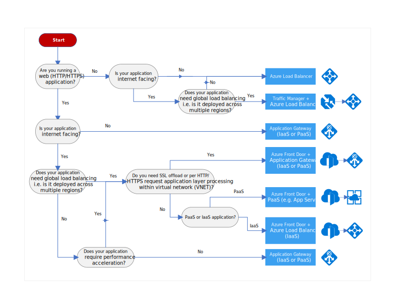

# Decision tree for load balancing in Azure

Azure provides you with a variety of different load balancing solutions that you can leverage to distribute traffic between your different application endpoints. This distribution of traffic could be across your virtual machines, containers, Kubernetes clusters, App Services, in-region within a virtual network or across different Azure regions. The following flowchart will help you to choose a load balancing solution for your application. The flowchart guides you through a set of key decision criteria to reach a recommendation.

**Treat this flowchart as a starting point.** Every application has unique requirements, so use the recommendation as a starting point. Then perform a more detailed evaluation, looking at aspects such as:

- Feature set
- [Service limits](/azure/azure-subscription-service-limits)
- [Cost](https://azure.microsoft.com/pricing/)
- [SLA](https://azure.microsoft.com/support/legal/sla/)
- [Regional availability](https://azure.microsoft.com/global-infrastructure/services/)
- IT/DevOps ecosystem and team skills

If your application consists of multiple workloads, evaluate each workload separately. A complete solution may incorporate two or more load balancing solutions.

## Flowchart

## Definitions

- **"Internet facing"** applications are the ones that are publicly accessible from the internet. This is an application architecture choice that is common for consumer as well as business applications. As a best practice, application owners apply restrictive access policies or protect the application by setting up offerings like web application firewall and DDoS protection. 

- **PaaS** Platform as a service (PaaS) is a complete development and deployment environment in the cloud, with resources that enable you to deliver everything from simple cloud-based apps to sophisticated, cloud-enabled enterprise applications. PaaS is designed to support the complete web application lifecycle: building, testing, deploying, managing, and updating. PaaS allows you to avoid the expense and complexity of buying and managing software licenses, the underlying application infrastructure and middleware or the development tools and other resources. You manage the applications and services you develop, and the cloud service provider typically manages everything else.

- **IaaS** Infrastructure as a service (IaaS) is an instant computing infrastructure, provisioned and managed over the internet. IaaS quickly scales up and down with demand, letting you pay only for what you use. It helps you avoid the expense and complexity of buying and managing your own physical servers and other datacenter infrastructure. Azure, manages the infrastructure, while you purchase, install, configure, and manage your own software—operating systems, middleware, and applications.

## Next steps

For additional context on these different load balancing services, see [Overview of load balancing options in Azure](./load-balancing-overview.md).
