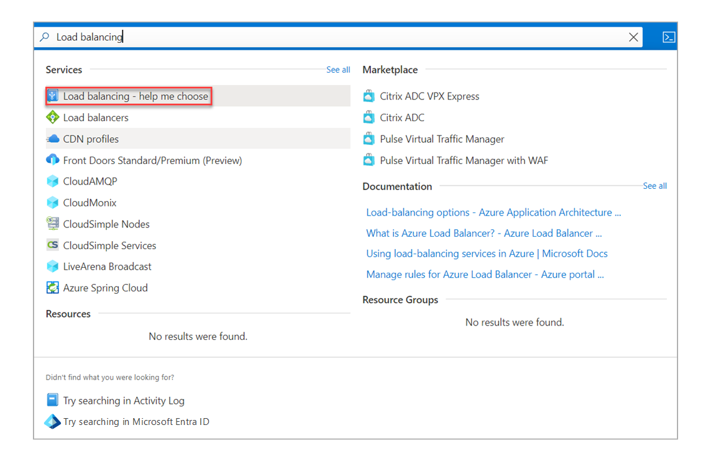
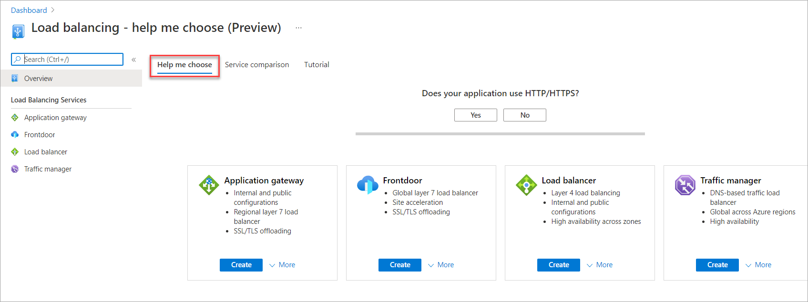
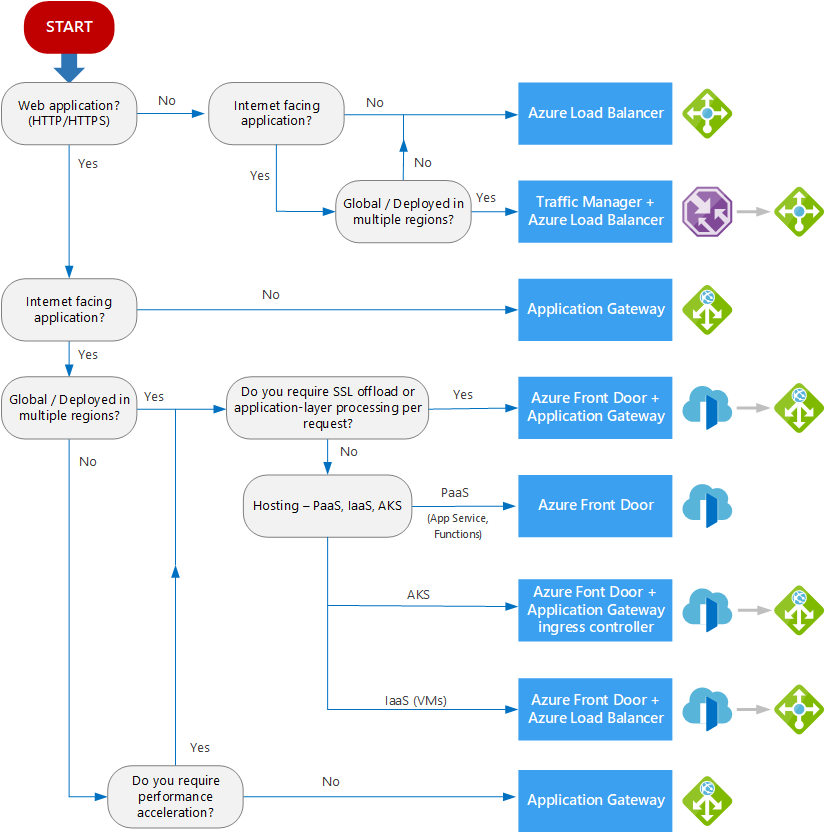

The term *load balancing* refers to the distribution of workloads across multiple computing resources. Load balancing aims to optimize resource use, maximize throughput, minimize response time, and avoid overloading any single resource. It can also improve availability by sharing a workload across redundant computing resources.

Azure provides various load-balancing services that you can use to distribute your workloads across multiple computing resources such as Application Gateway, Azure Front Door, Azure Load Balancer, and Azure Traffic Manager.

This article describes how you can use the Azure **Load balancing** page in the Azure portal to determine an appropriate load-balancing solution for your business needs.

## Service categorizations

Azure load-balancing services can be categorized along two dimensions: global versus regional and HTTP(S) versus non-HTTP(S).

### Global vs. regional

- **Global**: These load-balancing services distribute traffic across regional back-ends, clouds, or hybrid on-premises services. These services route end-user traffic to the closest available back-end. They also react to changes in service reliability or performance to maximize availability and performance. You can think of them as systems that load balance between application stamps, endpoints, or scale-units hosted across different regions/geographies.
- **Regional**: These load-balancing services distribute traffic within virtual networks across virtual machines (VMs) or zonal and zone-redundant service endpoints within a region. You can think of them as systems that load balance between VMs, containers, or clusters within a region in a virtual network.

### HTTP(S) vs. non-HTTP(S)

- **HTTP(S)**: These load-balancing services are [Layer 7](https://www.iso.org/ics/35.100/x/) load balancers that only accept HTTP(S) traffic. They're intended for web applications or other HTTP(S) endpoints. They include features such as SSL offload, web application firewall, path-based load balancing, and session affinity.
- **Non-HTTP(S)**: These load-balancing services can handle non-HTTP(S) traffic and are recommended for non-web workloads.

The following table summarizes the Azure load-balancing services by categories.

| Service                   | Global/Regional | Recommended traffic |
| -------------------       | --------------- | ------------------- |
| Azure Front Door          | Global          | HTTP(S)             |
| Azure Traffic Manager     | Global          | Non-HTTP(S)         |
| Azure Application Gateway | Regional        | HTTP(S)             |
| Azure Load Balancer       | Regional        | Non-HTTP(S)         |

## Azure load-balancing services

Here are the main load-balancing services currently available in Azure:

- [Azure Front Door](/azure/frontdoor/front-door-overview) is an application delivery network that provides global load balancing and site acceleration service for web applications. It offers Layer 7 capabilities for your application like SSL offload, path-based routing, fast failover, and caching to improve performance and high availability of your applications.

   > [!NOTE]
   > At this time, Azure Front Door doesn't support Web Sockets.

- [Traffic Manager](/azure/traffic-manager/traffic-manager-overview) is a DNS-based traffic load balancer that enables you to distribute traffic optimally to services across global Azure regions, while providing high availability and responsiveness. Because Traffic Manager is a DNS-based load-balancing service, it load balances only at the domain level. For that reason, it can't fail over as quickly as Azure Front Door, because of common challenges around DNS caching and systems not honoring DNS TTLs.
- [Application Gateway](/azure/application-gateway/overview) provides application delivery controller (ADC) as a service, offering various Layer 7 load-balancing capabilities. Use it to optimize web farm productivity by offloading CPU-intensive SSL termination to the gateway.
- [Load Balancer](/azure/load-balancer/load-balancer-overview) is a high-performance, ultra low-latency Layer 4 load-balancing service (inbound and outbound) for all UDP and TCP protocols. It is built to handle millions of requests per second while ensuring your solution is highly available. Load Balancer is zone-redundant, ensuring high availability across availability zones.

   > [!NOTE]
   > Load Balancer support for cross-region load balancing is in preview. For more information, see [Cross-region load balancer](/azure/load-balancer/cross-region-overview).

## Choose a load-balancing solution by using the Azure portal

You can use the Azure **Load balancing** page in the Azure portal to help guide you to the right load-balancing solution for your business need. Azure Load Balancer includes the decision-making queries described in the workflow in the following section:

1. Sign in to the [Azure portal](https://portal.azure.com).
1. In the **Search resources, services, and docs** box at the top of the portal, enter **load balancing**. When **Load balancing** appears in the search results, select it.

   

   > [!NOTE]
   > To learn about some of the factors considered in selecting a load-balancing solution, see [Decision tree for load balancing in Azure](#decision-tree-for-load-balancing-in-azure) in this article.

1. On the **Load balancing - help me choose (Preview)** page, do one of the following options:

   - To find the appropriate load-balancing solution for your business, follow instructions on the default **Help me choose** tab.

     

   - To learn about the supported protocols and service capabilities of each load-balancing service, select the **Service comparisons** tab.
   - To access free training on load-balancing services, select the **Tutorial** tab.

## Reference architecture examples

The following table lists various architecture reference articles based on the load-balancing services used as a solution.

|Services |Article |Description |
|---------|---------|---------|
|Load Balancer    |  [Load balance virtual machines (VMs) across availability zones](/azure/load-balancer/quickstart-load-balancer-standard-public-portal)    |   Load balance VMs across availability zones to help protect your apps and data from an unlikely failure or loss of an entire datacenter. With zone-redundancy, one or more availability zones can fail and the data path survives as long as one zone in the region remains healthy.     |
|Azure Front Door    |  [Sharing location in real time using low-cost serverless Azure services](../../example-scenario/signalr/index.yml#azure-front-door)       |   Use Azure Front Door to provide higher availability for your applications than deploying to a single region. If a regional outage affects the primary region, you can use Azure Front Door to fail over to the secondary region.      |
|Application Gateway     |[IaaS: Web application with relational database](../../high-availability/ref-arch-iaas-web-and-db.yml)    |   Learn how to use resources spread across multiple zones to provide a high-availability architecture for hosting an infrastructure as a service (IaaS) web application and SQL Server database.     |
|Traffic Manager   | [Multi-tier web application built for high availability and disaster recovery ](../../example-scenario/infrastructure/multi-tier-app-disaster-recovery.yml)        |      Deploy resilient multi-tier applications built for high availability and disaster recovery. If the primary region becomes unavailable, Traffic Manager fails over to the secondary region.  |
|Azure Front Door + Application Gateway     | [Multitenant SaaS on Azure](../../example-scenario/multi-saas/multitenant-saas.yml)       |   Use a multi-tenant solution that includes a combination of Azure Front Door and Application Gateway.  Azure Front Door helps load balance traffic across regions and Application Gateway routes and load-balances traffic internally in the application to the various services that satisfy client business needs.  |
|Traffic Manager + Load Balancer    | [Multi-region N-tier application](../../reference-architectures/n-tier/multi-region-sql-server.yml)          |   A multi-region N-tier application that uses Traffic Manager to route incoming requests to a primary region and if that region becomes unavailable, Traffic Manager fails over to the secondary region.      |
|Traffic Manager + Application Gateway    | [Multi-region load balancing with Traffic Manager and Application Gateway](../../high-availability/reference-architecture-traffic-manager-application-gateway.yml)          |   Learn how to serve web workloads and deploy resilient multi-tier applications in multiple Azure regions to achieve high availability and a robust disaster recovery infrastructure.      |

## Decision tree for load balancing in Azure

When you select load-balancing options, consider these factors when you select the **Help me choose** default tab in Azure load balancing:

- **Traffic type**: Is it a web (HTTP/HTTPS) application? Is it public facing or a private application?
- **Global vs. regional**: Do you need to load balance VMs or containers within a virtual network, or load balance scale unit/deployments across regions, or both?
- **Availability**: What's the [service-level agreement](https://azure.microsoft.com/support/legal/sla/)?
- **Cost**: For more information, see [Azure pricing](https://azure.microsoft.com/pricing/). In addition to the cost of the service itself, consider the operations cost for managing a solution built on that service.
- **Features and limits**: What are the overall limitations of each service? For more information, see [Service limits](/azure/azure-subscription-service-limits).

The following flowchart helps you to choose a load-balancing solution for your application. The flowchart guides you through a set of key decision criteria to reach a recommendation.

Treat this flowchart as a starting point. Every application has unique requirements, so use the recommendation as a starting point. Then perform a more detailed evaluation.

If your application consists of multiple workloads, evaluate each workload separately. A complete solution might incorporate two or more load-balancing solutions.

### Definitions

- **Internet facing**: Applications that are publicly accessible from the internet. As a best practice, application owners apply restrictive access policies or protect the application by setting up offerings like web application firewall and DDoS protection.
- **Global**: End users or clients are located beyond a small geographical area. For example, users across multiple continents, across countries/regions within a continent, or even across multiple metropolitan areas within a larger country/region.
- **PaaS**: Platform as a service (PaaS) services provide a managed hosting environment, where you can deploy your application without needing to manage VMs or networking resources. In this case, PaaS refers to services that provide integrated load balancing within a region. For more information, see [Choose a compute service &ndash; Scalability](./compute-decision-tree.yml#scalability).
- **AKS**: Azure Kubernetes Service (AKS) enables you to deploy and manage containerized applications. AKS provides serverless Kubernetes, an integrated continuous integration and continuous delivery (CI/CD) experience, and enterprise-grade security and governance. For more information about our AKS architectural resources, see [Azure Kubernetes Service architecture design](../../reference-architectures/containers/aks-start-here.md).
- **IaaS**: IaaS is a computing option where you provision the VMs that you need, along with associated network and storage components. IaaS applications require internal load balancing within a virtual network by using Load Balancer.
- **Application-layer processing**: This term refers to special routing within a virtual network. For example, path-based routing within the virtual network across VMs or virtual machine scale sets. For more information, see [When should we deploy an Application Gateway behind Azure Front Door?](/azure/frontdoor/front-door-faq#when-should-we-deploy-an-application-gateway-behind-front-door).
- **Performance acceleration**: This term refers to features that accelerate web access. Performance acceleration can be achieved through the use of content delivery networks (CDNs) or optimized point of presence (POP) ingress for accelerated client onboarding into the destination network. Azure Front Door supports both [CDNs](/azure/frontdoor/front-door-caching?pivots=front-door-standard-premium) and [Anycast traffic acceleration](/azure/frontdoor/front-door-traffic-acceleration?pivots=front-door-standard-premium). The benefits of both features can be gained with or without Application Gateway in the architecture.

## Next steps

- [Create a public load balancer to load balance VMs](/azure/load-balancer/quickstart-load-balancer-standard-public-portal)
- [Direct web traffic with Application Gateway](/azure/application-gateway/quick-create-portal)
- [Configure Traffic Manager for global DNS-based load balancing](/azure/traffic-manager/quickstart-create-traffic-manager-profile)
- [Configure Azure Front Door for a highly available global web application](/azure/frontdoor/quickstart-create-front-door)
