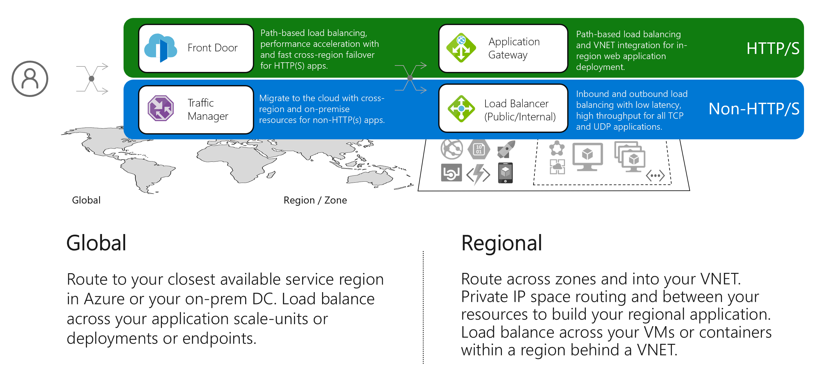

# Overview of load-balancing options in Azure

The term *load balancing* refers to the distribution of workloads across multiple computing resources that your application runs on. Load balancing aims to optimize resource use, maximize throughput, minimize response time, and avoid overload of any single resource.

## Overview

Azure provides multiple global and regional services for managing how your application's traffic is distributed and load balanced: **Traffic Manager**, **Azure Front Door**, **Application Gateway**, and **Azure Load Balancer**. Along with Azure’s many regions and zonal architecture, using these services together enable you to build robust, scalable high-performance applications.

These services are broken into two categories:

- **Global load-balancing services** such as Traffic Manager and Front Door distribute traffic from your end users across your regional backends, across clouds or even your hybrid on-premises services. Global load balancing routes your traffic to your closest service backend and reacts to changes in service reliability or performance to maintain always-on, maximal performance for your users. You can think of global load-balancing services as systems that load balance between your application stamps or endpoints or scale-units hosted across different regions/geographies.

- **Regional load-balancing services** such as Standard Load Balancer or Application Gateway provide the ability to distribute traffic within virtual networks (VNETs) across your virtual machines (VMs) or zonal and zone-redundant service endpoints within a region. You can think of regional load balancers as systems that load balance between your virtual machines or containers or clusters within a region in a virtual network.  

Correspondingly, there is another way of pivoting these different load balancers based on the application workload type that they can handle:

- **HTTP/HTTPS load-balancing services** such as Front Door and Application Gateway are load balancers for web applications, that is, can only cater to HTTP/HTTPS traffic. Front Door and Application Gateway offer key layer 7 benefits like SSL offload, web application firewall, path-based load balancing, session affinity and so on.

- **Non-HTTP/S load-balancing services** such as Traffic Manager and Load Balancer that are recommended for non-web workloads, that is, non-HTTP/HTTPS traffic. Traffic Manager is a DNS-based load-balancing service and so is limited to load balancing only at domain level. Also, being at the DNS level, Traffic Manager cannot perform as fast fail-over as Front Door because of common challenges around DNS caching and systems not honoring DNS TTLs. Azure Load Balancer operates for TCP and UDP traffic and offers in-region load balancing with low latency and high throughput for TCP/UDP workloads.

Combining global and regional services in your application provides an end-to-end reliable, performant, and secure way to route traffic to and from your users to your IaaS, PaaS, or on-premises services. In the next section, we describe each of these services in a nutshell to understand the key differences.

## Load-balancing services in Azure

Here are the main load-balancing services currently available in Azure:

- [Application Gateway](https://docs.microsoft.com/azure/application-gateway/overview) provides application delivery controller (ADC) as a service, offering various Layer 7 load-balancing capabilities for your application. It allows customers to optimize web farm productivity by offloading CPU-intensive SSL termination to the application gateway.
- [Azure Front Door Service](https://docs.microsoft.com/azure/frontdoor/front-door-overview) is an application delivery network providing global load balancing and site acceleration service for web applications. It offers various Layer 7 capabilities for your application like SSL offload, path-based routing, fast failover, caching, etc. to improve performance and high-availability of your applications.
- [Azure Load Balancer](https://docs.microsoft.com/azure/load-balancer/load-balancer-overview) is an integral part of the Azure SDN stack, providing high-performance, low-latency Layer 4 load-balancing services for all UDP and TCP protocols.
- [Traffic Manager](https://docs.microsoft.com/azure/traffic-manager/traffic-manager-overview) is a DNS-based traffic load balancer that enables you to distribute traffic optimally to services across global Azure regions, while providing high availability and responsiveness.

When selecting the load-balancing options, here are some factors to consider:

- **Traffic type**: Is it a web (HTTP/HTTPS) application? Is it public facing or a private application?
- **Global vs. regional**: Are you looking at load balancing your VMs or containers within a VNET, or your scale unit/deployments across regions, or both?
- **Scalability**: How does the service handle adding or removing instances? Can it autoscale based on load and other metrics?
- **Availability** What is the service SLA?
- **Cost** In addition to the cost of the service itself, consider the operations cost for managing a solution built on that service. For example, IaaS solutions might have a higher operations cost.
- What are the overall limitations of each service?
- What kind of application architectures are appropriate for this service?

## Next steps

To help select the right set of load-balancing services for your application, use the [Decision tree for load balancing applications](./load-balancing-decision-tree.md)
