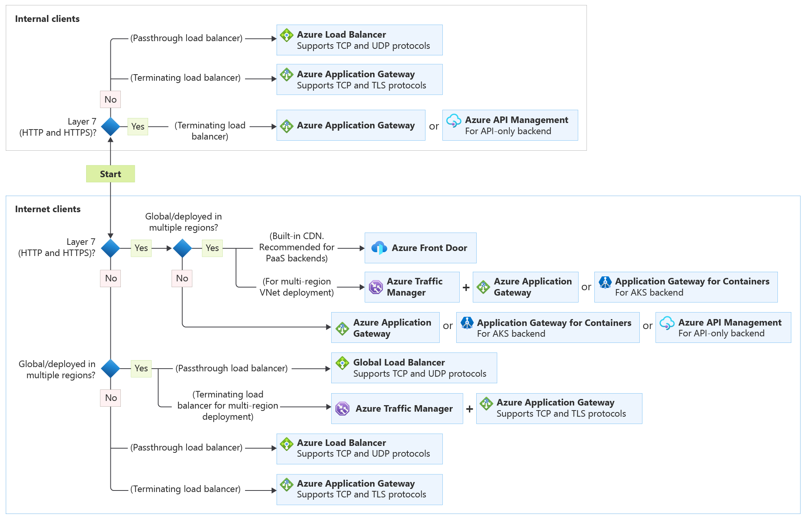

# Understand Azure Load Balancing

The term *load balancing* refers to the distribution of workloads across multiple computing resources. Load balancing aims to optimize resource use, maximize throughput, minimize response time, and avoid overloading any single resource. It can also improve availability by sharing a workload across redundant computing resources.

## Overview

Azure load balancing services can be categorized along two dimensions: global versus regional, and HTTP(S) versus non-HTTP(S).

### Global versus regional

- **Global** load-balancing services distribute traffic across regional backends, clouds, or hybrid on-premises services. These services route end-user traffic to the closest available backend. They also react to changes in service reliability or performance, in order to maximize availability and performance. You can think of them as systems that load balance between application stamps, endpoints, or scale-units hosted across different regions/geographies.

- **Regional** load-balancing services distribute traffic within virtual networks across virtual machines (VMs) or zonal and zone-redundant service endpoints within a region. You can think of them as systems that load balance between VMs, containers, or clusters within a region in a virtual network. 

### HTTP(S) versus non-HTTP(S)

- **HTTP(S)** load-balancing services are [Layer 7](https://www.iso.org/ics/35.100/x/) load balancers that only accept HTTP(S) traffic. They are intended for web applications or other HTTP(S) endpoints. They include features such as SSL offload, web application firewall, path-based load balancing, and session affinity.

- **Non-HTTP/S** load-balancing services can handle non-HTTP(S) traffic and are recommended for non-web workloads. 

The following table summarizes the Azure load balancing services by these categories:

| Service | Global/regional | Recommended traffic |
| ------- | --------------- | ------- |
| Azure Front Door | Global | HTTP(S) |
| Traffic Manager | Global | non-HTTP(S) |
| Application Gateway | Regional | HTTP(S) |
| Azure Load Balancer | Global | non-HTTP(S) |

## Azure load balancing services

Here are the main load-balancing services currently available in Azure:

[Front Door](/azure/frontdoor/front-door-overview) is an application delivery network that provides global load balancing and site acceleration service for web applications. It offers Layer 7 capabilities for your application like SSL offload, path-based routing, fast failover, caching, etc. to improve performance and high-availability of your applications.

>[!NOTE]
> At this time, Azure Front Door does not support Web Sockets.

[Traffic Manager](/azure/traffic-manager/traffic-manager-overview) is a DNS-based traffic load balancer that enables you to distribute traffic optimally to services across global Azure regions, while providing high availability and responsiveness. Because Traffic Manager is a DNS-based load-balancing service, it load balances only at the domain level. For that reason, it can't fail over as quickly as Front Door, because of common challenges around DNS caching and systems not honoring DNS TTLs. 

[Application Gateway](/azure/application-gateway/overview) provides application delivery controller (ADC) as a service, offering various Layer 7 load-balancing capabilities. Use it to optimize web farm productivity by offloading CPU-intensive SSL termination to the gateway.

[Azure Load Balancer](/azure/load-balancer/load-balancer-overview) is a high-performance, ultra low-latency Layer 4 load-balancing service (inbound and outbound) for all UDP and TCP protocols. It is built to handle millions of requests per second while ensuring your solution is highly available. Azure Load Balancer is zone-redundant, ensuring high availability across Availability Zones.

## Choose a load balancing solution using Azure portal

You can use the Azure Load Balancing page in the Azure portal to help you guide to the right load-balancing solution for your business need. Azure Load Balancing includes the decision making queries described in the workflow of the following section and can be accessed as follows:

1. Sign in to the [Azure portal at [https://portal.azure.com](https://portal.azure.com).
1. In the *Search resources, services, and docs* box at the top of the portal, type *load balancing*. When **Load balancing** appears in the search results, select it.
    
    > [!NOTE] To learn about some of the factors considered in selecting a load-balancing solution, see [Decision tree for load-balancing in Azure](#decision-tree-for-load-balancing-in-azure) in this article.
> Information the user should notice even if skimming
1. In the **Load balancing - help me choose (Preview)** page, do one of the following:
    1. To find the appropriate load-balancing solution for your business, follow instructions in the default **Help me choose** tab.
      
    1. To learn about the supported protocols and service capabilities of each load balancing service, select the **Service comparisons** tab.
    1. To access free training on load balancing services, select the **Tutorial** tab.
     
## Reference architecture examples

The following table lists various architecture reference articles based on the load-balancing services used as a solution.

|Service(s) |Article |Description |
|---------|---------|---------|
|Load Balancer    |  [Load balance virtual machines (VMs) across availability zones](https://docs.microsoft.com/azure/load-balancer/quickstart-load-balancer-standard-public-portal)    |   Load balancing VMs across availability zones helps to protect your apps and data from an unlikely failure or loss of an entire datacenter. With zone-redundancy, one or more availability zones can fail and the data path survives as long as one zone in the region remains healthy.     |
|Front Door    |  [Sharing location in real time using low-cost serverless Azure services](https://docs.microsoft.com/azure/architecture/example-scenario/signalr/#azure-front-door)       |   A multi-region architecture using Azure Front Foor can provide higher availability than deploying to a single region. If a regional outage affects the primary region, you can use Front Door to fail over to the secondary region.      |
|Application Gateway     |[IaaS: Web application with relational database](https://docs.microsoft.com/azure/architecture/high-availability/ref-arch-iaas-web-and-db)    |   This reference architecture guide illustrates how to use resources spread across multiple zones to provide a high availability (HA) architecture for hosting an Infrastructure as a Service (IaaS) web application and SQL Server database.     |
|Traffic Manager   | [Multi-region N-tier application](https://docs.microsoft.com/azure/architecture/reference-architectures/n-tier/multi-region-sql-server)        |      TBD   |
|Azure Front Door + Application Gateway     | [Multitenant SaaS on Azure](https://docs.microsoft.com/azure/architecture/example-scenario/multi-saas/multitenant-saas)       |      TBD   |
|Traffic Manager + Load Balancer    | [Multi-region N-tier application](https://docs.microsoft.com/azure/architecture/reference-architectures/n-tier/multi-region-sql-server)          |  TBD       |
|Traffic Manager + Application Gateway  | [Multi-region N-tier application](https://docs.microsoft.com/azure/architecture/reference-architectures/n-tier/multi-region-sql-server)       |     TBD    |

## Decision tree for load balancing in Azure

When selecting the load-balancing options, here are some factors that are considered when you select the **Help me choose** default tab in Azure load balancing:

- **Traffic type**. Is it a web (HTTP/HTTPS) application? Is it public facing or a private application?
- **Global versus. regional**. Do you need to load balance VMs or containers within a virtual network, or load balance scale unit/deployments across regions, or both?
- **Availability**. What is the service [SLA](https://azure.microsoft.com/support/legal/sla/)?
- **Cost**. See [Azure pricing](https://azure.microsoft.com/pricing/). In addition to the cost of the service itself, consider the operations cost for managing a solution built on that service.
- **Features and limits**. What are the overall limitations of each service? See [Service limits](/azure/azure-subscription-service-limits).

The following flowchart will help you to choose a load-balancing solution for your application. The flowchart guides you through a set of key decision criteria to reach a recommendation.

**Treat this flowchart as a starting point.** Every application has unique requirements, so use the recommendation as a starting point. Then perform a more detailed evaluation.

If your application consists of multiple workloads, evaluate each workload separately. A complete solution may incorporate two or more load-balancing solutions.

### Definitions

- **Internet facing**. Applications that are publicly accessible from the internet. As a best practice, application owners apply restrictive access policies or protect the application by setting up offerings like web application firewall and DDoS protection.

- **Global**. End users or clients are located beyond a small geographical area. For example, users across multiple continents, across countries/regions within a continent, or even across multiple metropolitan areas within a larger country/region.

- **PaaS**. Platform as a service (PaaS) services provide a managed hosting environment, where you can deploy your application without needing to manage VMs or networking resources. In this case, PaaS refers to services that provide integrated load balancing within a region. See [Choosing a compute service &ndash; Scalability](./compute-decision-tree.md#scalability).

- **IaaS**. Infrastructure as a service (IaaS) is a computing option where you provision the VMs that you need, along with associated network and storage components. IaaS applications require internal load balancing within a virtual network, using Azure Load Balancer.

- **Application-layer processing** refers to special routing within a virtual network. For example, path-based routing within the virtual network across VMs or virtual machine scale sets. For more information, see [When should we deploy an Application Gateway behind Front Door?](/azure/frontdoor/front-door-faq#when-should-we-deploy-an-application-gateway-behind-front-door).

## Next steps
- [Load balance internet traffic to virtual machines with Azure Load Balancer](/azure/load-balancer/quickstart-load-balancer-standard-public-portal)
- [Load balance internal traffic to virtual machines with Azure Load Balancer](/load-balancer/quickstart-load-balancer-standard-internal-portal)
- [Direct web traffic with Application Gateway](/azure/application-gateway/quick-create-portal)
- [Configure Traffic Manger for global DNS-based load balancing ](/azure/traffic-manager/quickstart-create-traffic-manager-profile)
- [Configure Front Door for a highly available global web application](/azure/frontdoor/quickstart-create-front-door)