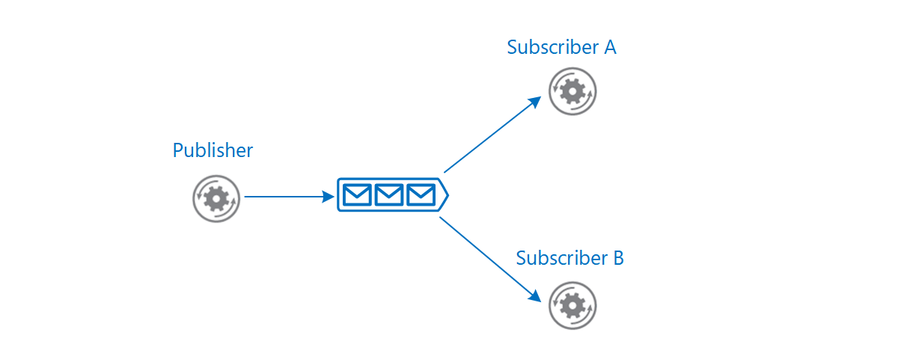
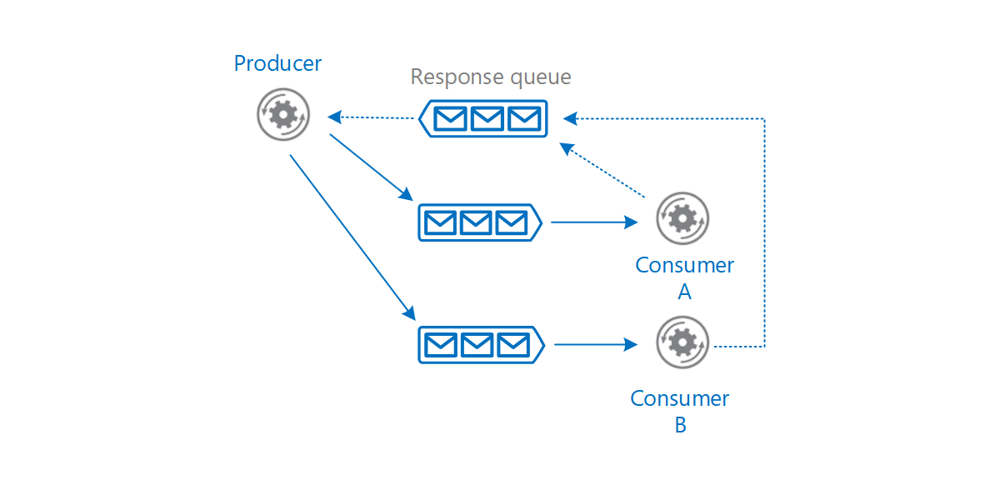
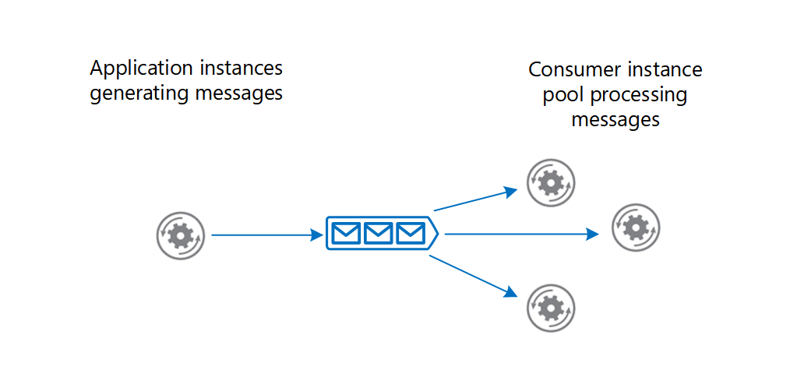
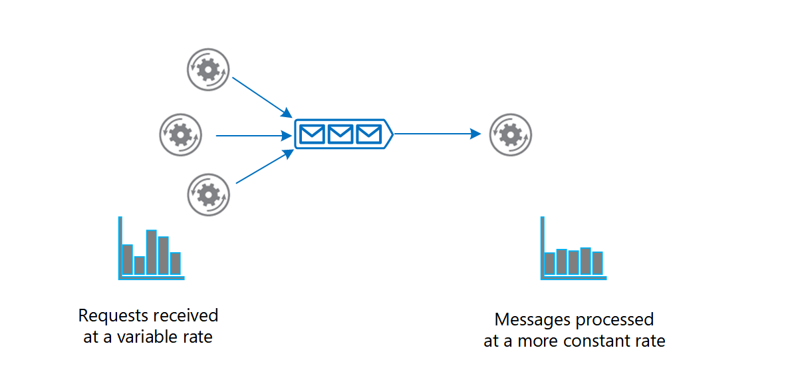
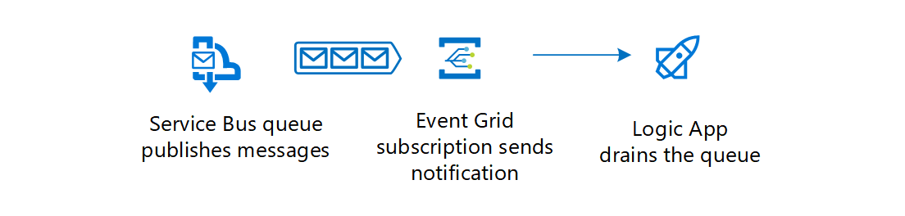
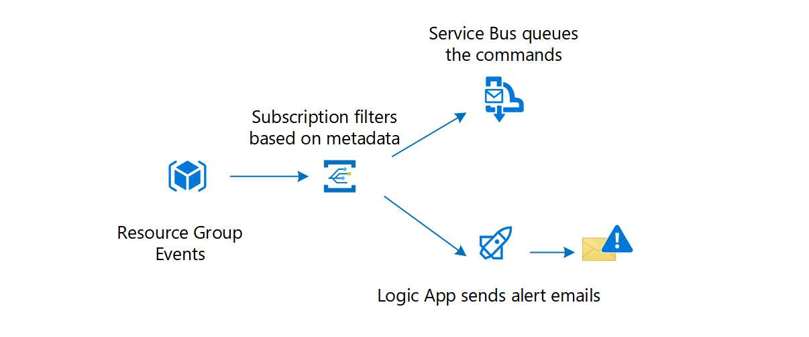

This article describes the different types of messages and the entities that participate in a messaging infrastructure. Based on the requirements of each message type, the article recommends Azure messaging services. The options include [Azure Service Bus Messaging](#azure-service-bus-messaging), [Azure Event Grid](#azure-event-grid), and [Azure Event Hubs](#azure-event-hubs).

At an architectural level, a message is a datagram created by an entity (_producer_), to distribute information so that other entities (_consumers_) can be aware and act accordingly. The producer and the consumer can communicate directly or optionally through an intermediary entity (_message broker_). This article focuses on asynchronous messaging using a message broker.

We can classify messages into two main categories. If the producer expects an action from the consumer, that message is a _command_. If the message informs the consumer that an action has taken place, then the message is an _event_.

## Commands

The producer sends a command with the intent that the consumer(s) will perform an operation within the scope of a business transaction.

A command is a high-value message and must be delivered at least once. If a command is lost, the entire business transaction might fail. Also, a command shouldn't be processed more than once. Doing so might cause an erroneous transaction. A customer might get duplicate orders or billed twice.

Commands are often used to manage the workflow of a multistep business transaction. Depending on the business logic, the producer might expect the consumer to acknowledge the message and report the results of the operation. Based on that result, the producer might choose an appropriate course of action.

## Events

An event is a type of message that a producer raises to announce facts.

The producer (known as the _publisher_ in this context) has no expectations that the events result in any action.

Interested consumer(s) can subscribe, listen for events, and take actions depending on their consumption scenario. Events can have multiple subscribers or no subscribers at all. Two different subscribers can react to an event with different actions and not be aware of one another.

The producer and consumer are loosely coupled and managed independently. The producer doesn't expect the consumer to acknowledge the event back to the producer. A consumer that's no longer interested in the events can unsubscribe, which removes the consumer from the pipeline without affecting the producer or the overall functionality of the system.

There are two categories of events:

- The producer raises events to announce discrete facts. A common use case is event notification. For example, Azure Resource Manager raises events when it creates, modifies, or deletes resources. A subscriber of those events could be a Logic App that sends alert emails.

- The producer raises related events in a sequence, or a stream of events, over a period of time. Typically, a stream is consumed for statistical evaluation. The evaluation can happen within a temporal window or as events arrive. Telemetry is a common use case (for example, health and load monitoring of a system). Another case is event streaming from IoT devices.

A common pattern for implementing event messaging is the [Publisher-Subscriber](../../patterns/publisher-subscriber.yml) pattern.

## Role and benefits of a message broker

An intermediate message broker provides the functionality of moving messages from producer to consumer and can offer more benefits.

### Decoupling

A message broker decouples the producer from the consumer in the logic that generates and uses the messages, respectively. In a complex workflow, the broker can encourage business operations to be decoupled and help coordinate the workflow.

For example, a single business transaction requires distinct operations that are performed in a business logic sequence. The producer issues a command that signals a consumer to start an operation. The consumer acknowledges the message in a separate queue reserved for lining up responses for the producer. Only after receiving the response does the producer send a new message to start the next operation in the sequence. A different consumer processes that message and sends a completion message to the response queue. By using messaging, the services coordinate the workflow of the transaction among themselves.

A message broker provides temporal decoupling. The producer and consumer don't have to run concurrently. A producer can send a message to the message broker regardless of the availability of the consumer. Conversely, the consumer isn't restricted by the producer's availability.

For example, the user interface of a web app generates messages and uses a queue as the message broker. When the consumer is ready, it can retrieve messages from the queue and perform the work. Temporal decoupling helps the user interface to remain responsive. It's not blocked while the messages are handled asynchronously.

Certain operations can take long to complete. After it issues a command, the producer shouldn't have to wait until the consumer completes it. A message broker helps asynchronous processing of messages.

### Load balancing

Producers can post a large number of messages that are serviced by many consumers. Use a message broker to distribute processing across servers and improve throughput. Consumers can run on different servers to spread the load. Consumers can be added dynamically to scale out the system when needed or removed otherwise.

The [Competing Consumers pattern](../../patterns/competing-consumers.yml) explains how to process multiple messages concurrently to optimize throughput, improve scalability and availability, and balance the workload.

### Load leveling

The volume of messages generated by the producer or a group of producers can be variable. At times there might be a large volume causing spikes in messages. Instead of adding consumers to handle this work, a message broker can act as a buffer, and consumers gradually drain messages at their own pace without stressing the system.

The [Queue-based Load Leveling pattern](../../patterns/queue-based-load-leveling.yml) provides more information.

### Reliable messaging

A message broker helps ensure that messages aren't lost even if communication fails between the producer and consumer. The producer can post messages to the message broker and the consumer can retrieve them when communication is reestablished. The producer isn't blocked unless it loses connectivity with the message broker.

### Resilient messaging

A message broker can add resiliency to the consumers in your system. If a consumer fails while processing a message, another instance of the consumer can process that message. The reprocessing is possible because the message persists in the broker.

## Technology choices for a message broker

Azure provides several message broker services, each with a range of features. Before choosing a service, determine the intent and requirements of the message.

### Azure Service Bus Messaging

[Azure Service Bus Messaging](/azure/service-bus-messaging/) queues are well suited for transferring commands from producers to consumers. Here are some considerations.

#### Pull model

A consumer of a Service Bus queue constantly polls Service Bus to check if new messages are available. The client SDKs and [Azure Functions trigger for Service Bus](/azure/azure-functions/functions-triggers-bindings#supported-bindings) abstract that model. When a new message is available, the consumer's callback is invoked and the message is sent to the consumer.

#### Guaranteed delivery

Service Bus allows a consumer to peek the queue and lock a message from other consumers.

It's the consumer's responsibility to report the message's processing status. Only when the consumer marks the message as consumed does Service Bus remove the message from the queue. If a failure, timeout, or crash occurs, Service Bus unlocks the message so that other consumers can retrieve it. This way, messages aren't lost in transfer.

A producer might accidentally send the same message twice. For example, a producer instance fails after sending a message. Another producer replaces the original instance and sends the message again. Azure Service Bus queues provide a [built-in de-duping capability](/azure/service-bus-messaging/duplicate-detection) that detects and removes duplicate messages. There's still a chance that a message is delivered twice. For example, if a consumer fails while processing, the message is returned to the queue and is retrieved by the same or another consumer. The message-processing logic in the consumer should be idempotent so that even if the work is repeated, the state of the system isn't changed.

#### Message ordering

If you want consumers to get the messages in the order they're sent, Service Bus queues guarantee first-in-first-out (FIFO) ordered delivery by using sessions. A session can have one or more messages. The messages are correlated with the **SessionId** property. Messages that are part of a session, never expire. A session can be locked to a consumer to prevent its messages from being handled by a different consumer.

For more information, see [Message sessions](/azure/service-bus-messaging/message-sessions).

#### Message persistence

Service bus queues support temporal decoupling. Even when a consumer isn't available or unable to process the message, it remains in the queue.

#### Checkpoint long-running transactions

Business transactions can run for a long time. Each operation in the transaction can have multiple messages. Use checkpointing to coordinate the workflow and provide resiliency in case a transaction fails.

Service Bus queues allow checkpointing through the [session state capability](/azure/service-bus-messaging/message-sessions#message-session-state). State information is incrementally recorded in the queue ([**SetState**](/dotnet/api/microsoft.servicebus.messaging.messagesession.setstate)) for messages that belong to a session. For example, a consumer can track progress by checking the state ([**GetState**](/dotnet/api/microsoft.servicebus.messaging.messagesession.getstate)) every now and then. If a consumer fails, another consumer can use state information to determine the last known checkpoint to resume the session.

#### Dead-letter queue (DLQ)

A Service Bus queue has a default subqueue, called the [dead-letter queue (DLQ)](/azure/service-bus-messaging/service-bus-dead-letter-queues) to hold messages that couldn't be delivered or processed. Service Bus or the message processing logic in the consumer can add messages to the DLQ. The DLQ keeps the messages until they're retrieved from the queue.

Here are examples of when a message can end up being in the DLQ:

- A poison message is a message that can't be handled because it's malformed or contains unexpected information. In Service Bus queues, you can detect poison messages by setting the **MaxDeliveryCount** property of the queue. If the number of times the same message is received exceeds that property value, Service Bus moves the message to the DLQ.

- A message might no longer be relevant if it isn't processed within a period. Service Bus queues allow the producer to post messages with a time-to-live attribute. If this period expires before the message is received, the message is placed in the DLQ.

Examine messages in the DLQ to determine the failure reason.

#### Hybrid solution

Service Bus bridges on-premises systems and cloud solutions. On-premises systems are often difficult to reach because of firewall restrictions. Both the producer and consumer (either can be on-premises or the cloud) can use the Service Bus queue endpoint as the pickup and drop off location for messages.

#### Topics and subscriptions

Service Bus supports the Publisher-Subscriber pattern through Service Bus topics and subscriptions.

This feature provides a way for the producer to broadcast messages to multiple consumers. When a topic receives a message, it's forwarded to all the subscribed consumers. Optionally, a subscription can have filter criteria that allows the consumer to get a subset of messages. Each consumer retrieves messages from a subscription in a similar way to a queue.

For more information, see [Azure Service Bus topics](/azure/service-bus-messaging/service-bus-messaging-overview#topics).

### Azure Event Grid

We recommend [Azure Event Grid](/azure/event-grid/) for discrete events. Event Grid follows the Publisher-Subscriber pattern. When event sources trigger events, they're published to [Event Grid topics](/azure/event-grid/concepts#topics). Consumers of those events create Event Grid subscriptions by specifying event types and event handler that will process the events. If there are no subscribers, the events are discarded. Each event can have multiple subscriptions.

#### Push Model

Event Grid propagates messages to the subscribers in a push model. Suppose you have an Event Grid subscription with a webhook. When a new event arrives, Event Grid posts the event to the webhook endpoint.

#### Integrated with Azure

Choose Event Grid if you want to get notifications about Azure resources. Many Azure services act as [event sources](/azure/event-grid/overview#event-sources) that have built-in Event Grid topics. Event Grid also supports various Azure services that can be configured as [event handlers](/azure/event-grid/overview#event-handlers). It's easy to subscribe to those topics to route events to event handlers of your choice. For example, you can use Event Grid to invoke an Azure Function when a blob storage is created or deleted.

#### Custom topics

Create custom Event Grid topics if you want to send events from your application or an Azure service that isn't integrated with Event Grid.

For example, to see the progress of an entire business transaction, you want the participating services to raise events as they're processing their individual business operations. A web app shows those events. One way to accomplish this task is to create a custom topic and add a subscription with your web app registered through an HTTP WebHook. As business services send events to the custom topic, Event Grid pushes them to your web app.

#### Filtered events

You can specify filters in a subscription to instruct Event Grid to route only a subset of events to a specific event handler. You specify the filters in the [subscription schema](/azure/event-grid/subscription-creation-schema). Any event sent to the topic with values that match the filter are automatically forwarded to that subscription.

For example, content in various formats are uploaded to Blob Storage. Each time a file is added, an event is raised and published to Event Grid. The event subscription might have a filter that only sends events for images so that an event handler can generate thumbnails.

For more information about filtering, see [Filter events for Event Grid](/azure/event-grid/how-to-filter-events).

#### High throughput

Event Grid can route 10,000,000 events per second per region. The first 100,000 operations per month are free. For cost considerations, see [How much does Event Grid cost?](/azure/event-grid/overview#how-much-does-event-grid-cost)

#### Resilient delivery

Even though successful delivery for events isn't as crucial as commands, you might still want some guarantee depending on the type of event. Event Grid offers features that you can enable and customize, such as retry policies, expiration time, and dead lettering. For more information, see [Event Grid message delivery and retry](/azure/event-grid/delivery-and-retry).

Event Grid's retry process can help resiliency but it's not fail-safe. In the retry process, Event Grid might deliver the message more than once, skip, or delay some retries if the endpoint is unresponsive for a long time. For more information, see [Retry schedule](/azure/event-grid/delivery-and-retry#retry-schedule).

You can persist undelivered events to a blob storage account by enabling dead-lettering. There's a delay in delivering the message to the blob storage endpoint and if that endpoint is unresponsive, then Event Grid discards the event. For more information, see [Set dead-letter location and retry policy](/azure/event-grid/manage-event-delivery).

### Azure Event Hubs

When you're working with an event stream, [Azure Event Hubs](/azure/event-hubs/) is the recommended message broker. Essentially, it's a large buffer that's capable of receiving large volumes of data with low latency. The received data can be read quickly through concurrent operations. You can transform the received data by using any real-time analytics provider. Event Hubs also provides the capability to store events in a storage account.

#### Fast ingestion

Event Hubs is capable of ingesting millions of events per second. The events are only appended to the stream and are ordered by time.

#### Pull model

Like Event Grid, Event Hubs also offers Publisher-Subscriber capabilities. A key difference between Event Grid and Event Hubs is in the way event data is made available to the subscribers. Event Grid pushes the ingested data to the subscribers whereas Event Hubs makes the data available in a pull model. As events are received, Event Hubs appends them to the stream. A subscriber manages its cursor and can move forward and back in the stream, select a time offset, and replay a sequence at its pace.

Stream processors are subscribers that pull data from Event Hubs for the purposes of transformation and statistical analysis. Use [Azure Stream Analytics](../../reference-architectures/data/stream-processing-stream-analytics.yml) and [Apache Spark](https://spark.apache.org/) for complex processing such as aggregation over time windows or anomaly detection.

If you want to act on each event per partition, you can pull the data by using [Event processor host](/azure/event-hubs/event-hubs-event-processor-host), or by using built-in connector such as [Azure Logic Apps](/azure/connectors/connectors-create-api-azure-event-hubs) to provide the transformation logic. Another option is to use [Azure Functions](/azure/azure-functions/).

#### Partitioning

A partition is a portion of the event stream. The events are divided by using a partition key. For example, several IoT devices send device data to an event hub. The partition key is the device identifier. As events are ingested, Event Hubs moves them to separate partitions. Within each partition, all events are ordered by time.

A consumer is an instance of code that processes the event data. Event Hubs follows a partitioned consumer pattern. Each consumer only reads a specific partition. Having multiple partitions results in faster processing because the stream can be read concurrently by multiple consumers.

Instances of the same consumer make up a single consumer group. Multiple consumer groups can read the same stream with different intentions. Suppose an event stream has data from a temperature sensor. One consumer group can read the stream to detect anomalies such as a spike in temperature. Another can read the same stream to calculate a rolling average temperature in a temporal window.

Event Hubs supports the Publisher-Subscriber pattern by allowing multiple consumer groups. Each consumer group is a subscriber.

For more information about Event Hubs partitioning, see [Partitions](/azure/event-hubs/event-hubs-features#partitions).

#### Event Hubs Capture

The Capture feature allows you to store the event stream to an [Azure Blob storage](/azure/storage/blobs/storage-blobs-overview) or [Data Lake Storage](/azure/storage/blobs/data-lake-storage-introduction). This way of storing events is reliable because even if the storage account isn't available, Capture keeps your data for a period, then writes to the storage after it's available.

> Storage services can also offer additional features for analyzing events. For example, by taking advantage of the access tiers of a blob storage account, you can store events in a hot tier for data that needs frequent access. You might use that data for visualization. Alternately, you can store data in the archive tier and retrieve it occasionally for auditing purposes.

Capture stores _all_ events ingested by Event Hubs and is useful for [batch processing](../../data-guide/big-data/batch-processing.yml). You can generate reports on the data by using a MapReduce function. Captured data can also serve as the source of truth. If certain facts were missed while aggregating the data, you can refer to the captured data.

For details about this feature, see [Capture events through Azure Event Hubs in Azure Blob Storage or Azure Data Lake Storage](/azure/event-hubs/event-hubs-capture-overview).

#### Support for Apache Kafka clients

Event Hubs provides an endpoint for [Apache Kafka](https://kafka.apache.org/) clients. Existing clients can update their configuration to point to the endpoint and start sending events to Event Hubs. You don't need to make any code changes.

For more information, see [Event Hubs for Apache Kafka](/azure/event-hubs/event-hubs-for-kafka-ecosystem-overview).

## Crossover scenarios

In some cases, it's advantageous to combine two messaging services.

Combining services can increase the efficiency of your messaging system. For instance, in your business transaction, you use Azure Service Bus queues to handle messages. Queues that are mostly idle and receive messages occasionally are inefficient, because the consumer is constantly polling the queue for new messages. You can set up an Event Grid subscription with an Azure Function as the event handler. Each time the queue receives a message and there are no consumers listening, Event Grid sends a notification, which invokes the Azure Function that drains the queue.

For details about connecting Service Bus to Event Grid, see [Azure Service Bus to Event Grid integration overview](/azure/service-bus-messaging/service-bus-to-event-grid-integration-concept).

The [Enterprise integration using message queues and events](../../example-scenario/integration/queues-events.yml) reference architecture shows an implementation of Service Bus to Event Grid integration.

Here's another example: Event Grid receives a set of events in which some events require a workflow while others are for notification. The message metadata indicates the type of event. One way to differentiate is to check the metadata by using the filtering feature in the event subscription. If it requires a workflow, Event Grid sends it to Azure Service Bus queue. The receivers of that queue can take necessary actions. The notification events are sent to Logic Apps to send alert emails.

## Related patterns

Consider these patterns when implementing asynchronous messaging:

- [Competing Consumers pattern](../../patterns/competing-consumers.yml). Multiple consumers might need to compete to read messages from a queue. This pattern explains how to process multiple messages concurrently to optimize throughput, to improve scalability and availability, and to balance the workload.
- [Priority Queue pattern](../../patterns/priority-queue.yml). For cases where the business logic requires that some messages are processed before others, this pattern describes how messages posted by a producer with a higher priority are received and processed more quickly by a consumer than messages of a lower priority.
- [Queue-based Load Leveling pattern](../../patterns/queue-based-load-leveling.yml). This pattern uses a message broker to act as a buffer between a producer and a consumer to help to minimize the impact on availability and responsiveness of intermittent heavy loads for both those entities.
- [Retry pattern](../../patterns/retry.yml). A producer or consumer might be unable connect to a queue, but the reasons for this failure might be temporary and quickly pass. This pattern describes how to handle this situation to add resiliency to an application.
- [Scheduler Agent Supervisor pattern](../../patterns/scheduler-agent-supervisor.yml). Messaging is often used as part of a workflow implementation. This pattern demonstrates how messaging can coordinate a set of actions across a distributed set of services and other remote resources, and enable a system to recover and retry actions that fail.
- [Choreography pattern](../../patterns/choreography.yml). This pattern shows how services can use messaging to control the workflow of a business transaction.
- [Claim-Check pattern](../../patterns/claim-check.yml). This pattern shows how to split a large message into a claim check and a payload.

## Community resources

[Jonathon Oliver's blog post: Idempotency](https://blog.jonathanoliver.com/idempotency-patterns/)

[Martin Fowler's blog post: What do you mean by "Event-Driven"?](https://martinfowler.com/articles/201701-event-driven.html)
