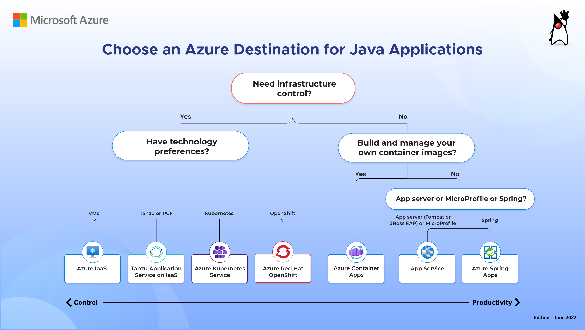
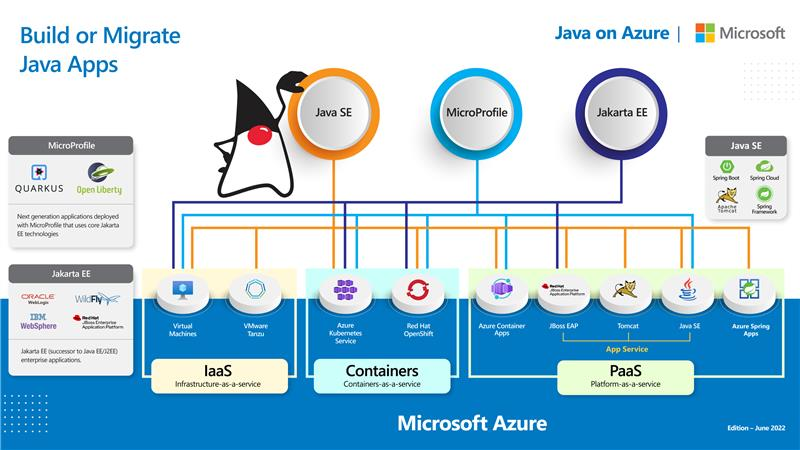

There are many options for teams to build and deploy java applications on Azure. This article will help you understand which scenarios and use cases are best suited for Azure Spring Apps and how it compares to other options on Azure.

## Java Hosting Option comparisons

Before you select a cloud destination for your Java application, you'll need to identify its application type. Most Java applications are one of the following types:

- [Spring Boot / JAR applications](#spring-boot--jar-applications)
- [Spring Cloud applications](#spring-cloud-applications)
- [Web applications](#web-applications)
- [Java EE applications](#java-ee-applications)
- [Batch / scheduled jobs](#batch--scheduled-jobs)

### Spring Boot / JAR applications

These applications are typically invoked directly from the command line and still handle web requests, but instead of relying on an application server to provide HTTP request handling, they incorporate HTTP communication and all other dependencies directly into the application package. Such applications are frequently built with frameworks such as Spring Boot, Dropwizard, Micronaut, MicroProfile, Vert.x, and others.

These applications are packaged into archives with the .jar extension (JAR files).

### Spring Cloud applications
The microservice architectural style is an approach to developing a single application as a suite of small services. Each service runs in its own process and communicates by using lightweight mechanisms, often an HTTP resource API. These services are built around business capabilities and are independently deployable by fully automated deployment machinery. There's a bare minimum of centralized management of these services, which may be written in different programming languages and use different data storage technologies. Such services are frequently built with frameworks such as Spring Cloud.

These services are packaged into multiple applications with the .jar extension (JAR files).

### Web applications
Web applications run inside a Servlet container. Some use servlet APIs directly, while many use other frameworks that encapsulate servlet APIs, such as Apache Struts, Spring MVC, JavaServer Faces (JSF), and others.

Web applications are packaged into archives with the .war extension (WAR files).

### Java EE applications
Java EE applications (also referred to as J2EE applications or, more recently Jakarta EE applications) can contain some, all, or none of the elements of web applications. They can also contain and consume many more components as defined by the Java EE specification.

Java EE applications can be packaged as archives with the .ear extension (EAR files) or as archives with the .war extension (WAR files).

Java EE applications must be deployed onto Java EE-compliant application servers (such as WebLogic, WebSphere, WildFly, GlassFish, Payara, and others).

Applications that rely only on features provided by the Java EE specification (that is, app-server-independent applications) can be migrated from one compliant application server onto another. If your application is dependent on a specific application server (app-server-dependent), you may need to select an Azure service destination that permits you to host that application server.

### Batch / scheduled jobs
Some applications are intended to run briefly, execute a particular workload, and then exit rather than wait for requests or user input. Sometimes such jobs need to run once or at regular, scheduled intervals. On premises, such jobs are often invoked from a server's crontab.

These applications are packaged into archives with the .jar extension (JAR files).

> [!NOTE]
> If your application uses a scheduler (such as Spring Batch or Quartz) to run scheduled tasks, we strongly recommend that you factor such tasks to run outside of the application. If your application scales to multiple instances in the cloud, the same job will run more than once. Furthermore, if your scheduling mechanism uses the host's local time zone, you may experience undesirable behavior when scaling your application across regions.

## Hosting options grid
Use the following grid to identify potential destinations for your application type. Notice that AKS and Virtual Machines support all application types, but they require your team to take on more responsibilities, as shown in the next section.

| Destination&nbsp;→  Application&nbsp;type&nbsp;↓            | Azure Spring Apps | App Service Java SE | App Service Tomcat | App Service JBoss EAP | Azure Container Apps | AKS           | Virtual Machines |
|-------------------------------------------------------------------|---------------------------|--------------------------|-----------------------------|-------------------------|----------------------|---------------|---------------------|
| Spring Boot / JAR applications                                    | &#x2714;                  | &#x2714;                 |                          |                             | &#x2714;             | &#x2714;      | &#x2714;            |
| Spring Cloud applications                                         | &#x2714;                  |                          |                          |                             | &#x2714;             | &#x2714;      | &#x2714;            |
| Web applications                                                  | &#x2714;                  |                          | &#x2714;                 | &#x2714;                    | &#x2714;             | &#x2714;      | &#x2714;            |
| Java EE applications                                              |                           |                          |                         |&#x2714;               |                      | &#x2714;      | &#x2714;            |
| Commercial application servers (such as WebLogic or WebSphere) |                           |                          |                             |                         | &#x2714;             | &#x2714;      | &#x2714;            |
| Long-term persistence on local filesystem                         |                           | &#x2714;                 | &#x2714;                 | &#x2714;                    |                      | &#x2714;      | &#x2714;            |
| Application server-level clustering                               |                           |                          |                          | &#x2714;                        |                      | &#x2714;      | &#x2714;            |
| Batch / scheduled jobs                                            | &#x2714;                  |                          |                             |                        | &#x2714;             | &#x2714;      | &#x2714;            |
| VNet Integration/Hybrid Connectivity                              | &#x2714;                  | &#x2714;                 | &#x2714;                    | &#x2714;                | &#x2714;             | &#x2714;      | &#x2714;            |
| Azure region availability                                         | [Details][1]               | [Details][2]             | [Details][2]            | [Details][2]               | [Details][3]        | [Details][4] | [Details][5]       |

You may also refer to the Java application tree down below for additional hints.

## Build or Migrate Java Apps
Use the following graph to find build or migration guidance by application type and targeted Azure service destination.

<!-- reference links, for use with tables -->
[1]: https://azure.microsoft.com/global-infrastructure/services/?products=spring-apps
[2]: https://azure.microsoft.com/global-infrastructure/services/?products=app-service-linux
[3]: https://azure.microsoft.com/global-infrastructure/services/?products=container-apps
[4]: https://azure.microsoft.com/global-infrastructure/services/?products=kubernetes-service
[5]: https://azure.microsoft.com/global-infrastructure/services/?products=virtual-machines
