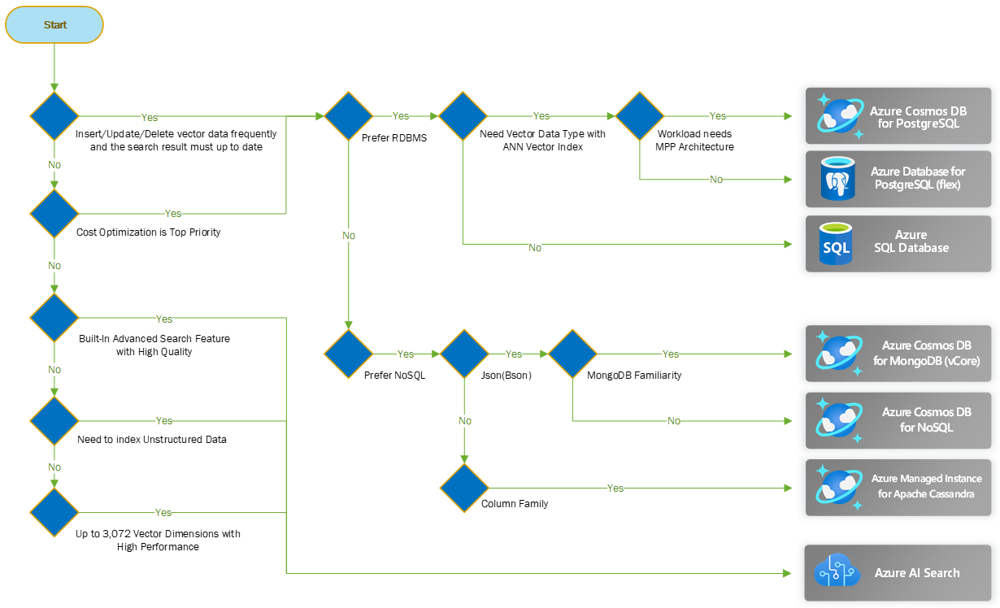

# Choose an Azure service for vector search

Vector search is a method of finding information in the shape of vectors. Vectors are groups of numbers that show features or characteristics of things like text or images. It’s a significant advancement over traditional keyword-based search methods, offering faster and more accurate results by understanding the semantic relationships within the data.

Azure offers many ways to perform vector search. This guide is written for developers who want to understand and choose the right Azure service for vector search for your application.

This article compares the following services:

- [Azure Cosmos DB for PostgreSQL](/azure/cosmos-db/postgresql/)
- [Azure Cosmos DB for MongoDB (vCore)](/azure/cosmos-db/mongodb/vcore/)
- [Azure Database for PostgreSQL](/azure/postgresql/)
- [Azure AI Search](/azure/search/)
- [Azure SQL Database](/azure/azure-sql/)

In the following, we will compare from the perspective of System Requirements in [Choose a candidate service](#choose-a-candidate-service) section, and in the next [Capability Matrix](#capability-matrix) section, we will compare product features based on various criteria.

## Choose a candidate service

This section helps you select the most likely services for your needs. To narrow the choices, start by considering these system requirements.

### Key Requirements

- **You need to do Insert/Update/Delete the vector fields frequently and the search result must always up to date:**
  - If your scenarios require keep vector data with operational data, you can **_keep vector fields in database systems_**.
  - In these scenarios, you can deploy **_RDBMS database or NoSQL database_** for vector store which based on your preference.
  - You need to **_develop advanced search features and need to optimize search quality by yourself_**.
  - Choosing database for vector store has more advantage in **_Cost Optimization_** perspective than choosing search engine.
  - **You have MongoDB already or you are familiar with MongoDB:**
    - If so, Azure Cosmos DB supports [MongoDB](/azure/cosmos-db/mongodb/introduction) and APIs to take advantage of the many benefits that Azure Cosmos DB offers, including Azure Open AI Service integration and instantaneous scalability.
    - JSON(BSON) format is more flexible than RDBMS to keep other relevant data along with vector fields.
    - Azure Cosmos DB for MongoDB vCore supports ANN vector index such as "HNSW" and "VFflat".
    - **_Only one vector field and index is available_** per container.
  - **You have PostgreSQL already or you prefer OSS technology:**
    - In Azure, [Azure Database for PostgreSQL](/azure/postgresql/overview) and [Azure Cosmos DB for PostgreSQL](/azure/cosmos-db/postgresql/introduction) deliver high availability with a managed community PostgreSQL database service.
    - Azure Database for PostgreSQL supports ANN vector index such as "HNSW" and "IVFflat".
    - You can define multiple vector fields in single table.
    - You can create multiple vector indexes in single table with different ANN algorithm and similarity/distance calculation.
    - If you're using Azure Open AI Service, embedding feature is integrated and ready to use.
  - **You have SQL Database already or you prefer SQL Server technology:**
    - In Azure, you can have your workloads running in IaaS-based [SQL Server on Azure Virtual Machines](/azure/azure-sql/virtual-machines/) or on the PaaS-based [Azure SQL Database hosted service](/azure/azure-sql/database/sql-database-paas-overview). Choosing which option to use is primarily a question of whether you want to manage your database, apply patches, and take backups, or if you want to delegate these operations to Azure. In some scenarios, compatibility issues might require the use of IaaS-hosted SQL Server. For more information about how to choose the correct option for your workloads, see [Choose the right SQL Server option in Azure](/azure/azure-sql/azure-sql-iaas-vs-paas-what-is-overview).
    - SQL Server **_doesn't support vector data type and vector index_**. You need to [unpivot vector data into a table with column store index](/azure/azure-sql/database/ai-artificial-intelligence-intelligent-applications).
    - Vector search **_performance is slower and not recommended for large dataset_**.
> [!NOTE]
> Learn more about how to assess database options for each of your applications or services in the [Azure application architecture guide](./data-store-overview.md).
- **Your application requires advanced search features with high quality:**
  - In Azure, [Azure AI Search](/azure/postgresql/overview) provides secure information retrieval at scale over user-owned content in traditional and generative AI search applications.
  - If you need to index **_unstructured data(e.g. images, docx, PDF and etc.)_**, Azure AI search has **_skill set which can help collect insightful metadata_** from them.
  - Azure AI Search supports ANN vector index such as "HNSW" and "Exhaustive KNN".
  - You can define multiple vector fields in single index.
  - You can create multiple vector indexes in search index.
  - If you're using Azure **_OpenAI Service, embedding feature is integrated and ready to use_**.
  - **_Operational Cost can be higher_** than keeping vector data in database systems.

## Capability Matrix
The following tables summarize the key differences in capabilities.

### Basic features
Native support for **vector data type**, **ANN vector index**, vector **dimension limit**, multiple vector fields and multiple vector indexs can be different and these supportability is one of key decision point for vector store.
Understand the basic vector features of each Azure service from the following table.

| Capability                                       | Azure Cosmos DB for PostgreSQL                | Azure Cosmos DB for MongoDB (vCore) | Azure Database for PostgreSQL (Flex)          | Azure AI Search                    | Azure SQL Database                |
| ------------------------------------------------ | --------------------------------------------- | ----------------------------------- | --------------------------------------------- | ---------------------------------- | --------------------------------- |
| Built-In Vector Search                           | Yes <a href="#a1">1</a>            | Yes <a href="#a2">2</a>  | Yes <a href="#a1">1</a>            | Yes <a href="#a3">3</a> | No <a href="#a4">4</a> |
| Data Type for Vectors                            | Yes                                           | Yes                                 | Yes                                           | Yes                                | No <a href="#a5">5</a> |
| Dimensions Limits <a href="#a6">6</a> | 16,000 <a href="#a7">7</a> or 2000 | 2,000                               | 16,000 <a href="#a7">7</a> or 2000 | 3,072                             | Unlimited                         |
| Multiple Vector Fields | Yes | No | Yes | Yes | N/A |
| Multiple Vector Indexes | Yes | No | Yes | Yes | N/A |

1. "pgvector" supports vector search, which is the [extension of PostgreSQL](/azure/postgresql/flexible-server/how-to-use-pgvector).
1. [Use vector search on embeddings](/azure/cosmos-db/mongodb/vcore/vector-search) in Azure Cosmos DB for MongoDB vCore
1. Vectors in Azure AI Search
1. Vector search isn't provided as a first-class feature, but it can be implemented by [using columnstore indexes and functions for cosine similarity](https://devblogs.microsoft.com/azure-sql/vector-similarity-search-with-azure-sql-database-and-openai/)
1. Need to unpivot dimension(array) to table row. [Vectors are stored with columnstore index](https://devblogs.microsoft.com/azure-sql/vector-similarity-search-with-azure-sql-database-and-openai/).
1. Embedding models from OpenAI, 1536 for both text-embedding-ada-002 and text-embedding-3-small, and 3072 for text-embedding-3-large. For [Azure AI Vision multimodal embedding models](/azure/ai-services/computer-vision/concept-image-retrieval), 1024 for both image and text.
1. Vectors can have up to [16,000 dimensions](https://github.com/pgvector/pgvector?tab=readme-ov-file#vector-type). But index using "IVFFlat" and "HNSW" supports vectors with up to 2,000 dimensions.

### Search methods

Not only vector search, but also full-text search and hybrid search (full text search or semantic search + vector search) functions are important. It is because in general the combination of hybrid search and reranking achieves high accuracy.

You can manually implement hybrid search and re-ranking with your own code or **you can take a benefit of built-in hybrid search and re-ranking feature**.

Understand what kind of search methods are provided from the following table.

| Capability             | Azure Cosmos DB for PostgreSQL     | Azure Cosmos DB for MongoDB (vCore) | Azure Database for PostgreSQL (Flex) | Azure AI Search                    | Azure SQL Database                 |
| ---------------------- | ---------------------------------- | ----------------------------------- | ------------------------------------ | ---------------------------------- | ---------------------------------- |
| Full Text search       | Yes <a href="#b1">1</a> | Yes <a href="#b2">2</a>  | Yes <a href="#b1">1</a>   | Yes <a href="#b3">3</a> | Yes <a href="#b4">4</a> |
| Built-In Hybrid search | No <a href="#b5">5</a>  | No                                  | No <a href="#b5">5</a>    | Yes <a href="#b6">6</a> | No                                 |
| Reranking              | No                                 | No                                  | No                                   | Yes <a href="#b7">7</a> | No                                 |

1. PostgreSQL [Full Text Search](https://www.postgresql.org/docs/current/textsearch-intro.html)
1. [Search and query with text indexes](/azure/cosmos-db/mongodb/vcore/how-to-create-text-index) in Azure Cosmos DB for MongoDB vCore
1. Get Started with [Full-Text Search](/sql/relational-databases/search/get-started-with-full-text-search)
1. [Vector Data](/azure/azure-sql/database/ai-artificial-intelligence-intelligent-applications) on SQL Server
1. Not provided as a first-class feature but [sample codes](https://github.com/pgvector/pgvector-python/blob/master/examples/hybrid_search_rrf.py) are provided.
1. [Hybrid search (combination of Full Text search, Vector search, and Semantic Ranking)](/azure/search/hybrid-search-how-to-query) is provided as a first-class feature.
1. Reranking called [Semantic Ranking](/azure/search/semantic-search-overview) is a first-class feature for reranking the result of full text search and/or vector search.

### Vector data indexing algorithms

Vector data indexing is the ability to efficiently store and retrieve vectors. This capability is important because indexing helps us perform fast and accurate similarity searches and nearest neighbor queries on data sources.

Indexes are based on **EKNN or ANN algorithm**. 
EKNN(Exhaustive K-nearest Neighbor) does exhaustive search on all data points one by one and returns the accurate K nearest neighbors. **EKNN works well under milliseconds with small number of documents but can cause latency for large amount of documents**. 

[HNSW](https://en.wikipedia.org/wiki/Hierarchical_Navigable_Small_World_graphs) and [IVFflat](https://en.wikipedia.org/wiki/Nearest_neighbor_search) are ANN algorithm indexes. Selecting the appropriate indexing strategy involves a careful consideration of various factors such as the nature of the dataset, the specific requirements of the queries, and the available resources. IVFFlat is particularly effective in environments where resources are limited or query volumes are not high, whereas HNSW excels in systems that require fast query responses and can adapt to changes in the dataset.

Understand what kinds of vector data indexing are provided from the following table.

| Capability | Azure Cosmos DB for PostgreSQL | Azure Cosmos DB for MongoDB (vCore) | Azure Database for PostgreSQL (Flex) | Azure AI Search | Azure SQL Database |
|---|---|---|---|---|---|
| EKNN (brute-force search) | Yes | Yes | Yes | Yes | Yes |
| "HNSW" | Yes| Yes (preview)<a href="#e1">1</a> | Yes | Yes | No |
| "IVFflat" | Yes | Yes | Yes | No | No |
| Others (limitations, tips etc.) | - | Vector field limitation <a href="#e2">2</a>   Vector index limitation <a href="#e3">2</a> | - | - |No native vector search support<a href="#e4">3</a>|

1. [Azure Cosmos DB for MongoDB - Vector search overview](/azure/cosmos-db/mongodb/vcore/vector-search)
1. Only one vector field is available per container.
1. Only one vector index is available per container.
1. Azure SQL Database doesn't have vector data type. But you can store vectors into a column. Each row holds each element of vectors. Then you can use columnstore index to efficiently store and search for vectors.

### Similarity and distance calculation capabilities

There are [Cosine Similarity](https://en.wikipedia.org/wiki/Cosine_similarity), [Dot Product](https://en.wikipedia.org/wiki/Dot_product) and [Euclidean Distance](https://en.wikipedia.org/wiki/Euclidean_distance) calculation methods for vector search. These methods are used to calculate the similarity between two vectors or the distance between two vectors. 

Preliminary data analysis benefits from both metrics and Euclidean distances, which allow for the extraction of different insights on data structure, whereas text classification generally performs better under Euclidean distances, and retrieval of the most similar texts to a given document typically functions better with cosine similarity.
Azure OpenAI embeddings rely on cosine similarity to compute similarity between documents and a query.

Understand what kind of similarity and distance calculation methods are provided from the following table and check if the calculation way you use is offered as a first-class feature.

| Capability                                     | Azure Cosmos DB for PostgreSQL | Azure Cosmos DB for MongoDB (vCore) | Azure Database for PostgreSQL (Flex) | Azure AI Search | Azure SQL Database |
| ---------------------------------------------- | ------------------------------ | ----------------------------------- | ------------------------------------ | --------------- | ------------------ |
| Cosine similarity                              | Yes                            | Yes                                 | Yes                                  | Yes             | Yes                |
| Euclidean distance (L2 distance)   | Yes                            | Yes                                 | Yes                                  | Yes             | No                 |
| Dot product                                    | Yes                            | Yes                                 | Yes                                  | Yes             | No                 |

### Integration with Microsoft technology

Some technologies from Microsoft are useful to build systems using vector search. For example, Azure OpenAI Service helps you to create vectors for your data and input queries for vector similarity search.  
Understand the useful services/tools from Microsoft, which can be integrated into each Azure service.

| Capability | Azure Cosmos DB for PostgreSQL | Azure Cosmos DB for MongoDB (vCore) | Azure Database for PostgreSQL (Flex) | Azure AI Search | Azure SQL Database |
|---|---|---|---|---|---|
| Azure Open AI Service - add your own data | No | Yes <a href="#g1">1</a> | No | Yes <a href="#g2">2</a>| No |
| Vector Embedding with Azure OpenAI | No | No | Yes <a href="#g3">3</a>| Yes <a href="#g4">4</a>| Yes <a href="#g5">5</a> |
| Integration with Prompt flow | No | No | No | Yes <a href="#g6">6</a>| No |
| Integration with Semantic Kernel | Yes <a href="#g7">7</a> | Yes <a href="#g8">8</a>| Yes <a href="#g7">7</a>| Yes <a href="#g9">9</a> | Yes <a href="#g10">10</a> |

1. Azure Cosmos DB for MongoDB (vCore) is [supported as a data source](/azure/ai-services/openai/concepts/use-your-data?tabs=mongo-db#supported-data-sources) for Azure OpenAI on Your Data.
2. Azure AI Search is [supported as a data source](/azure/ai-services/openai/concepts/use-your-data?tabs=mongo-db#supported-data-sources) for Azure OpenAI on Your Data.
3. [Azure AI Extension (preview)](/azure/postgresql/flexible-server/generative-ai-azure-openai) is available.
4. Azure AI Search provides a skill to vectorize the chunked text.
5. You can create [stored procedure for your embedding model deployment](/azure/azure-sql/database/ai-artificial-intelligence-intelligent-applications)
6. Supported as a vector database in [Vector DB Lookup](https://microsoft.github.io/promptflow/reference/tools-reference/vector_db_lookup_tool.html#vector-db-lookup) tool.
7. Supported as a memory connector, and a vector database connector ([C#](https://github.com/microsoft/semantic-kernel/tree/main/dotnet/src/Connectors/Connectors.Memory.Postgres)).
8. Supported as a vector database connector ([Python](https://github.com/microsoft/semantic-kernel/tree/main/python/semantic_kernel/connectors/memory/azure_cosmosdb)).
9. Supported as a memory connector, and a vector database connector ([C#](https://github.com/microsoft/semantic-kernel/tree/main/dotnet/src/Connectors/Connectors.Memory.AzureAISearch), [Python](https://github.com/microsoft/semantic-kernel/tree/main/python/semantic_kernel/connectors/memory/azure_cognitive_search)).
10. Supported as a [memory connector](/azure/azure-sql/database/ai-artificial-intelligence-intelligent-applications).

## Contributors

Microsoft maintains this article. Below contributors write this article.
Principal authors:
- Keita Onabuta | Senior Customer Engineer
- Gary Lee | Senior Customer Engineer

Other contributors:
- Kruti Mehta | Customer Engineer

## Reference

If you're interested in trying vector search in Azure, you can find the reference information here:

### Next step

[Implement knowledge mining with Azure AI Search - Training | Microsoft Learn](/training/paths/implement-knowledge-mining-azure-cognitive-search/). This learning path explores how to use Azure AI Search.

### Related resources

- [Understand data store models - Azure Application Architecture Guide | Microsoft Learn](/azure/architecture/guide/technology-choices/data-store-overview)
- [Technology choices for Azure solutions - Azure Architecture Center | Microsoft Learn](/azure/architecture/guide/technology-choices/technology-choices-overview)
