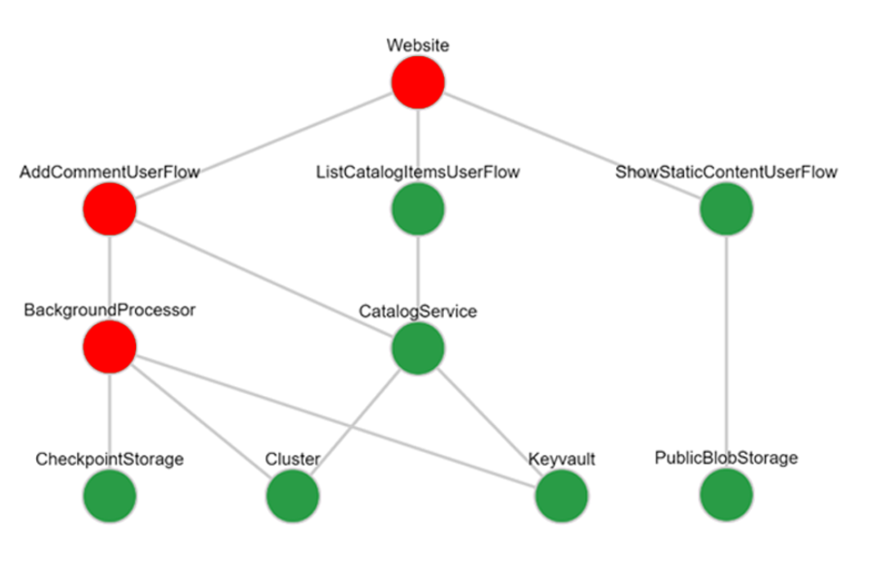
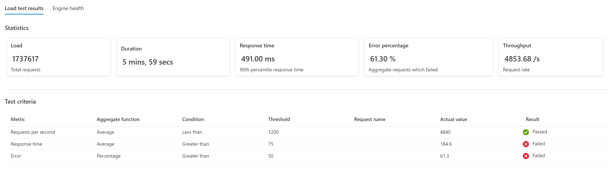
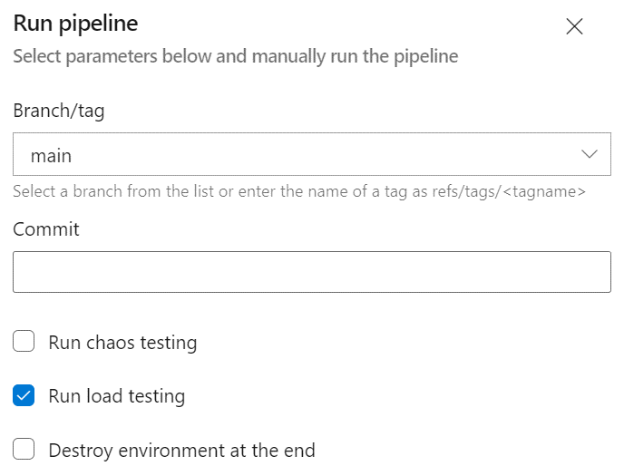
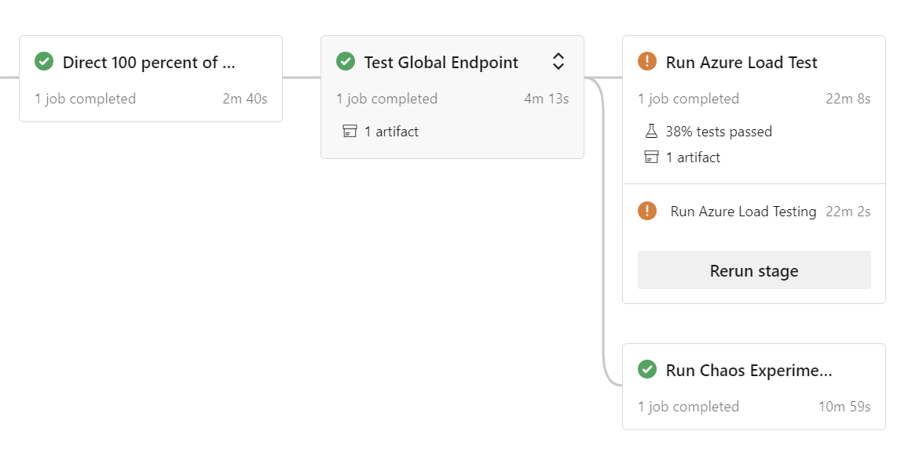
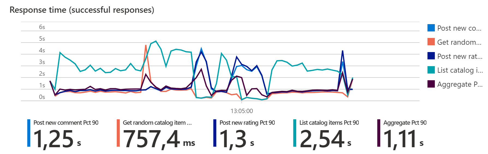
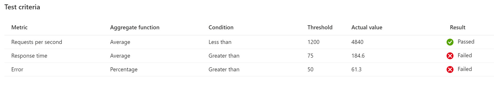

# Continuous validation with Azure Load Testing and Azure Chaos Studio

As cloud-native applications and services get more complex, your deployment will need to keep up when rolling out changes and new releases. Outages are often caused by failed deployments or erroneous releases. However, errors can also occur after the deployment when traffic starts to hit an application, especially for complex applications in highly distributed, multi-tenanted cloud environments, and with multiple development teams involved. These environments have higher need for resiliency measures, such as retry logic and autoscaling, which are usually to test during the development process.

That's why **continuous validation in an environment that closely resembles production is key** in identifying potential issues and bugs as early as possible in the development cycle. So, for your operations, move testing to the beginning of the development process (shift left) and make it easy for developers to do close-to-production testing.

Mission-critical workloads typically have high availability targets of 3, 4 or 5 nines (99.9%, 99.99% or 99.999% respectively). Rigorous automated testing is crucial in achieving that goal. Because continuous validation is highly specific to each individual workload and architecture, consider the guidance in this article to prepare for your actual implementation.

## 1 – Define tests based on expected thresholds

Starting planning by identifying key scenarios, dependencies, expected usage, availability, performance, and scalability targets. Then, define a set of **measurable threshold values** to quantify the expected performance of the key scenarios. The expected number of user logins, requests per second of a given API, operations per second of a background process, are applicable examples for threshold values.

Next, use the numbers to define a **load test** that generates realistic traffic for testing application performance, validating expected scale operations, and so on. Threshold values should be used to develop a [health model for the application](/azure/architecture/framework/mission-critical/mission-critical-health-modeling) not only for testing but also for operating the application in production.

Load testing ensures that changes made to the application or infrastructure don't cause issues and the system still meets the expected performance and test criteria. A failed test run that doesn't meet the test criteria indicates that you need to adjust the baseline, or that an unexpected error occurred.

Even though automated tests represent day-to-day usage, manual load tests should be **regularly executed** to verify how the system responds to unexpected peaks.

The second part of continuous validation is the **injection of failures** (chaos engineering). This step verifies the resiliency of a system by testing how it responds to faults. Also, that all the resiliency measures, such as retry logic, autoscaling, and others, are working as expected.

## 2 - Implement validation

Microsoft Azure provides these managed services to implement load testing and chaos engineering:

- **[Azure Load Testing](/azure/load-testing/)** produces synthetic user load on applications and services.
- **[Azure Chaos Studio](/azure/chaos-studio/)** provides the ability to perform chaos experimentation, by systematically injecting failures into application components and infrastructure.

Both Azure Chaos Studio and Load Testing can be deployed and configured through Azure portal, but more importantly there are APIs available to deploy, configure and execute tests in a programmatic and automated way. By using the tools in conjunction, you can observe how the system reacts to issues and its ability to self-heal in response to infrastructure or application failures. 

The following video shows a [combined implementation of Chaos and Load Testing](/azure/architecture/framework/mission-critical/mission-critical-deployment-testing#demo-continuous-validation-with-azure-load-test-and-azure-chaos-studio) integrated in Azure DevOps:

> [!VIDEO https://www.microsoft.com/en-us/videoplayer/embed/RE4Y50k]

The Azure Mission-critical framework and reference implementation contains detailed guidance, a sample implementation, and code artifacts for extra reference. It deploys the Azure Load Testing service through Terraform and contains a [collection of PowerShell Core wrapper scripts](https://github.com/Azure/Mission-Critical-Online/tree/main/src/testing/loadtest-azure/scripts) to interact with the service via its API. These scripts can be embedded directly into a deployment pipeline.

One option in the reference implementation is to execute the load test directly from within the end-to-end (e2e) pipeline that is used to spin up individual (branch specific) development environments:

The pipeline will automatically run a load test, with or without chaos experiments (depending on the selection) in parallel:

> [!NOTE]
> Running chaos experiments during a load test can result in higher latency, higher response times and temporarily increased error rates. You'll notice higher numbers until a scale-out operation completes or a failover has completed, when compared to a run without chaos experiments.

Depending on whether chaos testing is enabled and the choice of experiments, baseline definitions might vary, because the tolerance for errors can be different in "normal" state and "chaos" state.

## 3 – Establish a baseline

Next, **adjust the thresholds** for regular runs to verify that the application (still) provides the expected performance and doesn't produce any errors. Have a separate baseline for chaos testing that tolerates expected spikes in error rates and temporary reduced performance. This activity is continuous and needs to be done regularly. For example, after introducing new features, changing service SKUs, and others.

The Azure Load Testing service provides a built-in capability called **test criteria** that allows specifying certain criteria that a test needs to pass. This capability can be used to implement different baselines.

The capability is available through the Azure portal, and via the load testing API, and the wrapper scripts developed as part of Azure Mission-critical provide an option to handover a JSON-based baseline definition.

We highly recommend **integrating these tests directly into your CI/CD pipelines** and running them during the early stages of feature development. For an example, see the sample implementation in the Azure Mission-critical reference implementation.

In summary, failure is inevitable in any complex distributed system and the solution must therefore be architected (and tested) to handle failures. The [Azure Mission-critical framework](/azure/architecture/framework/mission-critical/mission-critical-deployment-testing) with its guidance and reference implementations can help designing and operating highly reliable applications to derive maximum value from the Microsoft cloud.

## Next step

Review the deployment and testing design area for mission-critical workloads.

> [!div class="nextstepaction"]
> [Design area: Deployment and testing](/azure/architecture/framework/mission-critical/mission-critical-deployment-testing)

## Related resources

- [Azure Load Testing documentation](/azure/load-testing/)
- [Azure Chaos Studio documentation](/azure/chaos-studio/)
