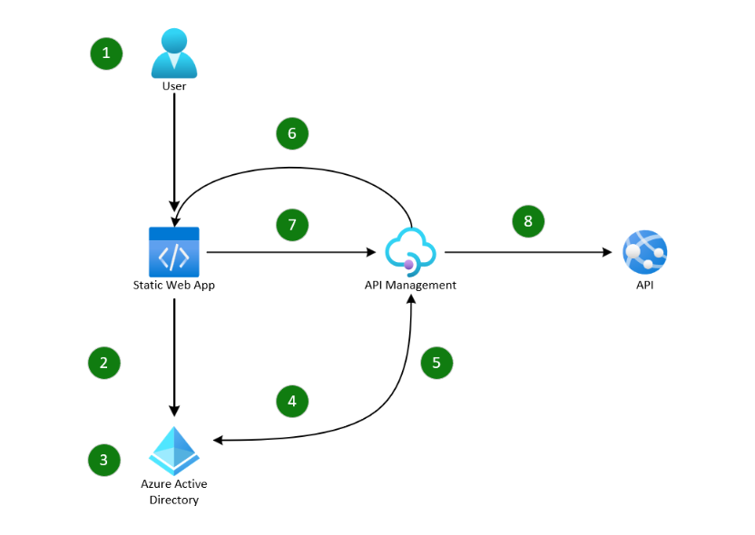

[!INCLUDE [header_file](../../../includes/sol-idea-header.md)]

This guide demonstrates how you can use Azure API Management to implement a stateless no token in the browser pattern for a JavaScript single-page application, protecting access tokens from XSS attacks and malicious code running in the browser.

This pattern uses [Azure API Management](https://azure.microsoft.com/products/api-management) in a [Backend for Frontend](https://learn.microsoft.com/azure/architecture/patterns/backends-for-frontends) pattern to handle the OAuth2 access token acquisition from Azure Active Directory; [AES](https://en.wikipedia.org/wiki/Advanced_Encryption_Standard) encryption and decryption of the access token into an `HttpOnly` cookie; and to proxy all API calls requiring authorization.

As the backend handles the token acquisition, no other code or library, such as [MSAL.js](https://github.com/AzureAD/microsoft-authentication-library-for-js), is required in the single-page application itself. This design means that no tokens are stored in the browser session or local storage. By encrypting and storing the access token in an `HttpOnly` cookie protects it from [XSS](https://owasp.org/www-community/attacks/xss/) attacks, and scoping it to the API domain and setting `SameSite=Strict` ensures that the cookie is automatically sent with all proxied API first-party requests.

## Architecture



*Download a [Visio file](https://arch-center.azureedge.net/no-token-in-the-browser.vsdx) of this architecture.*

### Workflow

1. User selects sign-in in single-page application.
2. Single-page application invokes Authorization Code flow with a redirect to Azure Active Directory authorize endpoint.
3. User authenticates themselves.
4. Authorization Code flow response redirects to Azure API Management callback endpoint with authorization code.
5. Azure API Management policy exchanges authorization code for access token by calling Azure Active Directory token endpoint.
6. Azure API Management policy redirects back to single-page application and sets encrypted access token in an HttpOnly cookie.
7. User invokes external API call from single-page application through Azure API Management proxied endpoint.
8. Azure API Management policy receives API request, decrypts cookie, and makes downstream API call with access token added as Authorization header.

## Scenario details

Single-page applications are written in JavaScript and run within the context of a client-side browser. This pattern means the user can access any code running in the browser. Malicious code running in the browser or an XSS vulnerability can also access any data. Data such as an access token stored in the browser session or local storage is accessible through this pattern. This vulnerability means that any sensitive data, such as access tokens, can be accessed and used to impersonate the user.

This pattern increases the security of the application by moving the token acquisition and storage to the backend, and by using an encrypted `HttpOnly` cookie to store the access token, meaning access tokens no longer need to be stored in the browser session or local storage, and aren't accessible to malicious code running in the browser.

Azure API Management Policies handle the acquisition of the access token and encryption and decryption of the cookie in this example. Policies are a collection of statements that are run sequentially on the request or response of an API and are made up of a set of XML elements and C# scripts.

By using an `HttpOnly` cookie to store the access token, the token is protected from XSS attacks and isn't accessible by JavaScript. Scoping the cookie to the API domain and setting `SameSite=Strict` ensures that the cookie is automatically sent with all proxied API first-party requests. This pattern allows the access token to be automatically added to the Authorization header of all API calls made from the single-page application by the backend.

As this example utilizes a `SameSite=Strict` cookie, it's important that the domain of the API Management gateway must be the same as the domain of the single-page application. This restriction is due to a cookie only being sent to the API Management gateway when the API request comes from a site with the same domain. If the domains are different, the cookie isn't added to the API request, and the proxied API request remains unauthenticated.

It's possible to configure this example without using custom domains for the API Management instance and Static Web App, but that would require the cookie setting to be amended to `SameSite=None`. However, this change provides a less secure implementation since the cookie is added to all requests to any instance of the API Management gateway. More on SameSite cookies can be read [here](https://developer.mozilla.org/docs/Web/HTTP/Headers/Set-Cookie/SameSite).

To learn more about using custom domains on Azure resources, see [Manage custom domains for Azure Static Web Apps](https://learn.microsoft.com/azure/static-web-apps/custom-domain), and [Configure a custom domain name for your Azure API Management instance](https://learn.microsoft.com/azure/api-management/configure-custom-domain). For more information on how to configure DNS records for custom domains, see [How to manage DNS Zones in the Azure portal](https://learn.microsoft.com/azure/dns/dns-operations-dnszones-portal).

## Authentication flow

To obtain an access token to allow the single-page application to access the API, the user must first authenticate themselves. This flow is invoked by redirecting the user to the Azure Active Directory authorize endpoint. The user is then prompted to authenticate themselves, and then redirected back to the Azure API Management callback endpoint with an authorization code. The API Management policy securely exchanges this authorization code for an access token.

This process uses the [OAuth2 Authorization Code flow](https://learn.microsoft.com/azure/active-directory/fundamentals/auth-oauth2), and requires a redirect URI to be configured in Azure Active Directory. This redirect URI must be the Azure API Management callback endpoint. The Azure API Management policy then securely exchanges the authorization code for an access token by calling the Azure Active Directory token endpoint. The following callback policy snippet performs this action:

```XML
<!-- 
// ====================================================================================================
// Call the token server to exchange the auth code for an access token.
// This request will return a JSON object with the access token. No refresh token will be returned
// as it was not requested in the original scope request. To request a refresh token, add the
// "offline_access" scope to the original request.
// ====================================================================================================
-->
<send-request ignore-error="false" timeout="20" response-variable-name="serverResponse" mode="new">
    <set-url>https://login.microsoftonline.com/{{tenant-id}}/oauth2/v2.0/token</set-url>
    <set-method>POST</set-method>
    <set-header name="Content-Type" exists-action="override">
        <value>application/x-www-form-urlencoded</value>
    </set-header>
    <set-body>@(string.Format("grant_type=authorization_code&code={0}&client_id={1}&client_secret={2}&redirect_uri=https://{3}/auth/callback",
                    context.Request.OriginalUrl.Query.GetValueOrDefault("code"),
                    "{{client-id}}",
                    "{{client-secret}}",
                    context.Request.OriginalUrl.Host))</set-body>
</send-request>
<!-- 
// ====================================================================================================
// Extract the access token from the token server response.
// This sample does not request a refresh token. If a refresh token is requested, it will be returned
// in the response together with the access_token and should be extracted separately.
// ====================================================================================================
-->
<set-variable name="token" value="@((context.Variables.GetValueOrDefault<IResponse>("serverResponse")).Body.As<JObject>())" />
<set-variable name="jwt" value="@((string)(context.Variables.GetValueOrDefault<JObject>("token"))["access_token"])" />
```
Once the access token has been obtained, it's encrypted using AES encryption. The encryption is performed within the callback policy using the following policy snippet:

```XML
<!-- 
// ====================================================================================================
// Generate a random IV to encrypt the access token and set it into a variable. This ensures that the
// encrypted content is different each time a token in encrypted.
// This sample uses AES encryption with key is stored in a Named Value in APIM. Any encryption key
// should be rotated regularly to ensure the security of the encryption.
// ====================================================================================================
-->
<set-variable name="cookieContent" value="@{
    var rng = new RNGCryptoServiceProvider();
    var iv = new byte[16];
    rng.GetBytes(iv);
    byte[] jwtBytes = Encoding.UTF8.GetBytes(context.Variables.GetValueOrDefault<string>("jwt"));
    byte[] encryptedToken = jwtBytes.Encrypt("Aes", Convert.FromBase64String("{{enc-key}}"), iv);
    byte[] combinedContent = new byte[iv.Length + encryptedToken.Length];
    Array.Copy(iv, 0, combinedContent, 0, iv.Length);
    Array.Copy(encryptedToken, 0, combinedContent, iv.Length, encryptedToken.Length);
    return System.Net.WebUtility.UrlEncode(Convert.ToBase64String(combinedContent));
}" />
```

Finally, once the access token has been encrypted, it's set into a cookie and returned to the single-page application. The following policy snippet performs this task:

```XML
<!-- 
// ========================================================================================================
// Create a return response to redirect back to the calling application.
// Set the encrypted and base64url encoded access token into a cookie.
// Cookies are created as session cookies by default. If you are not implementing a refresh token
// to the pattern then it setting the expiry of the cookie to match that of the access token could
// be considered. This would ensure that the cookie is removed when the access token expires.
//
// Details on configurable token lifetimes can be found here:
// https://learn.microsoft.com/azure/active-directory/develop/active-directory-configurable-token-lifetimes
// ========================================================================================================
-->
<return-response>
    <set-status code="302" reason="Temporary Redirect" />
    <set-header name="Set-Cookie" exists-action="override">
        <value>@($"{{cookie-name}}={context.Variables.GetValueOrDefault<string>("cookieContent")}; Secure; SameSite=Strict; Path=/; Domain={{cookie-domain}}; HttpOnly")</value>
    </set-header>
    <set-header name="Location" exists-action="override">
        <value>{{return-uri}}</value>
    </set-header>
</return-response>
```

Once the single-page application has the access token, it can be used to call the downstream API. As the cookie is scoped to the domain of the single-page application and has the `SameSite=Strict` attribute set, it's automatically added with each request to the API. The access token can then be decrypted ready to be used to call the downstream API. The following proxy policy snippet performs this process:

```XML
<!-- 
// ====================================================================================================
// 1. Extract cookies from the request header.
// 2. Split all cookies and select the one we're interested in.
// 3. Remove cookie name to leave only the contents.
// 4. Decode the cookie content from base64url to base64.
// 5. Decode the base64 cookie content to bytes.
// 6. Extract the IV from the encrypted cookie content.
// 7. Decrypt the encrypted cookie content into a variable.
// ====================================================================================================
-->
<set-variable name="access_token" value="@{
    try {
        string cookieContent = context.Request.Headers
                                    .GetValueOrDefault("Cookie")?
                                    .Split(';')
                                    .ToList()?
                                    .Where(p => p.Contains("{{cookie-name}}"))
                                    .FirstOrDefault()
                                    .Replace("{{cookie-name}}=", "");
        byte[] encryptedBytes = Convert.FromBase64String(System.Net.WebUtility.UrlDecode(cookieContent));
        byte[] iv = new byte[16];
        byte[] tokenBytes = new byte[encryptedBytes.Length - 16];
        Array.Copy(encryptedBytes, 0, iv, 0, 16);
        Array.Copy(encryptedBytes, 16, tokenBytes, 0, encryptedBytes.Length - 16);
        byte[] decryptedBytes = tokenBytes.Decrypt("Aes", Convert.FromBase64String("{{enc-key}}"), iv);
        char[] convertedBytesToChar = Encoding.UTF8.GetString(decryptedBytes).ToCharArray();
        return Encoding.UTF8.GetString(Encoding.UTF8.GetBytes(convertedBytesToChar));
    } catch (Exception ex) {
        return null;
    }
}" />
```

Once the access token has been decrypted, it can be used to call the downstream API. To successfully make a call the access token needs to be added to the request to the API, as an `Authorization` header. The following policy snippet performs this task:

```XML
<!-- 
// ====================================================================================================
// Set the decrypted access token as an Authorization header.
// ====================================================================================================
-->
<choose>
    <when condition="@(!string.IsNullOrEmpty(context.Variables.GetValueOrDefault<string>("access_token")))">
        <set-header name="Authorization" exists-action="override">
            <value>@("Bearer " + context.Variables.GetValueOrDefault<string>("access_token"))</value>
        </set-header>
    </when>
</choose>
```
 Full examples of these policies, together with OpenApi specifications, and a full deployment guide can be found in this related [GitHub repository](https://github.com/Azure/no-token-in-the-browser-pattern/).

## Enhancements

This example isn't a production-ready solution, merely a demonstration of what is possible using these services. The following points should be considered to enhance any solution before using it in production.

- This example doesn't cater for access token expiry nor the use of refresh or ID tokens.
- The cookie contents in the sample are encrypted using AES encryption. The key is stored as a secret in the Named Values section of the API Management instance. This Named Value can be linked and stored in an [Azure Key Vault](https://azure.microsoft.com/services/key-vault/) to provide better protection of the key. Encryption keys should be rotated on a periodic basis as part of a [Key Management](https://en.wikipedia.org/wiki/Key_management) policy.
- This example only proxies calls to a single downstream API, which only requires one access token, allowing a stateless approach. However, due to the size limitation of HTTP cookies, if you need to proxy calls to multiple downstream APIs, you need a stateful approach. This process involves storing access tokens in a cache and retrieving them based on the API being called and a key provided in the cookie rather than a single access token. This action can be achieved using the API Management [Cache](https://learn.microsoft.com/azure/api-management/api-management-howto-cache) or an external [Redis cache](https://learn.microsoft.com/azure/api-management/api-management-howto-cache-external).
- As this example only demonstrates the retrieval of data using a `GET` request it doesn't include protection from [CSRF](https://owasp.org/www-community/attacks/csrf) attacks, which would be required if other http methods such as `POST`, `PUT`, `PATCH`, or `DELETE` were to be implemented.

## Components

- [Azure Active Directory](https://azure.microsoft.com/services/active-directory): Identity services, single sign-on, and multifactor
- [Azure API Management](https://azure.microsoft.com/services/api-management/) is a hybrid, multicloud management platform for APIs across all environments. API Management creates consistent, modern API gateways for existing backend services.
authentication across Azure workloads.
- [Azure Static Web Apps](/azure/static-web-apps), for automatically building and deploying web applications to Azure, triggered by changes made to application source code in GitHub or in Azure DevOps repositories.

## Contributors

*This article is maintained by Microsoft. It was originally written by the following contributors.*

Principal author:

- [Ira Rainey](https://www.linkedin.com/in/ira-rainey) | Senior Software Engineer

*To see non-public LinkedIn profiles, sign in to LinkedIn.*

## Next steps

- [Example implementation and deployment guide](https://github.com/Azure/no-token-in-the-browser-pattern)
- [Policies in Azure API Management](https://learn.microsoft.com/azure/api-management/api-management-howto-policies)
- [How to set or edit Azure API Management policies](https://learn.microsoft.com/azure/api-management/set-edit-policies)
- [Use named values in Azure API Management policies](https://learn.microsoft.com/azure/api-management/api-management-howto-properties)
- [OAuth 2.0 authentication with Azure Active Directory](https://learn.microsoft.com/azure/active-directory/fundamentals/auth-oauth2)
- [What is Azure Static Web Apps?](https://learn.microsoft.com/azure/static-web-apps/overview)

## Related resources

- [Protect APIs with Application Gateway and API Management](../../reference-architectures/apis/protect-apis.yml)
- [Protect backend APIs by using Azure API Management and Azure AD B2C](../../solution-ideas/articles/protect-backend-apis-azure-management.yml)
