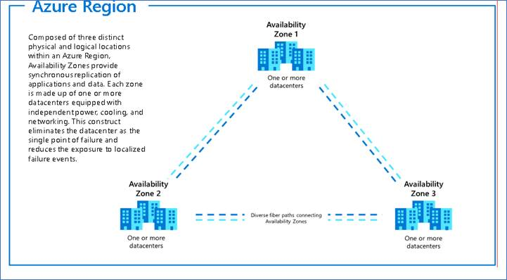
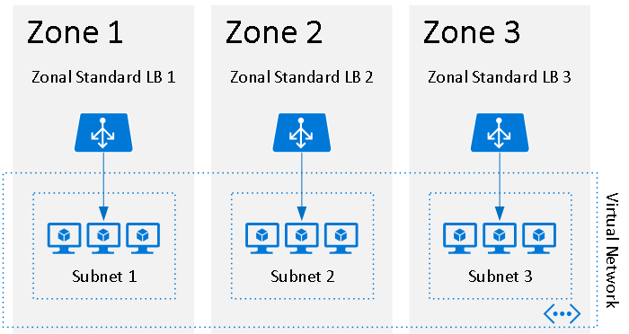
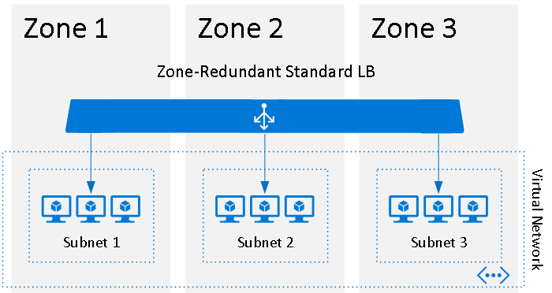
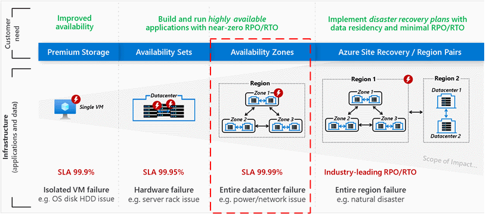

Microsoft Azure's global infrastructure is designed and constructed at every layer to deliver the highest levels of redundancy and resiliency. Azure infrastructure is composed of geographies, regions, and availability zones. Each of these components help you to limit the blast radius of a failure, and therefore limit potential impact to your applications and data. Azure availability zones provide help to protect against datacenter failures and to provide increased high availability (HA).

Availability zones are unique physical locations within an Azure region. Each zone is made up of one or more datacenters with independent power, cooling, and networking. The physical separation of availability zones within a region limits the impact to applications and data from zone failures, such as large-scale flooding, major storms and superstorms, and other events that could disrupt site access, safe passage, extended utilities uptime, and the availability of resources. Availability zones and their associated datacenters are designed such that if one zone is compromised, the services, capacity, and availability are supported by the other availability zones in the region.

Availability zones can be used to spread a solution across multiple zones within a region, allowing for an application to continue functioning when one zone fails. When you use availability zones, Azure offers an industry-best 99.99% [Virtual Machine (VM) uptime service-level agreement (SLA)](https://azure.microsoft.com/support/legal/sla/virtual-machines/v1_9/). Zone-redundant services replicate your services and data across availability zones to protect from single points of failure. If you are designing highly available solutions on Azure that are mission-critical in nature, you can extend the reliability provided by availability zones by [globally distributing your solution across multiple Azure regions](/azure/architecture/framework/mission-critical/mission-critical-application-design#global-distribution).

For additional information about availability zones, see [What are availability zones in Azure?](/azure/availability-zones/az-overview) For information about which regions support availability zones, see [
Azure regions with availability zone support](/azure/reliability/availability-zones-service-support#azure-regions-with-availability-zone-support).

## Availability zones reference architectures

The following architectures feature high-availability scenarios:

- [Mission-critical workload built for maximum reliability](/azure/architecture/reference-architectures/containers/aks-mission-critical/mission-critical-intro)
- [High availability enterprise deployment using App Services Environment](../web-apps/app-service-environment/architectures/ase-high-availability-deployment.yml)
- [IaaS: Web application with relational database](./ref-arch-iaas-web-and-db.yml)
- [Multi-region load balancing with Traffic Manager and Application Gateway](./reference-architecture-traffic-manager-application-gateway.yml)
- [Multi-region web app with private connectivity to database](../example-scenario/sql-failover/app-service-private-sql-multi-region.yml)
- [Multi-tier web application built for HA/DR](../example-scenario/infrastructure/multi-tier-app-disaster-recovery.yml)
- [Baseline highly available zone-redundant web application](../web-apps/app-service/architectures/baseline-zone-redundant.yml)
- [Azure Spring Apps baseline architecture](../web-apps/spring-apps/architectures/spring-apps-multi-zone.yml)

## Delivering reliability in Azure

Designing solutions that continue to function in spite of failure is key to improving the reliability of a solution. In cloud-based solutions, building to survive failure is a shared responsibility. This can be viewed at three levels: a resilient foundation, resilient services, and resilient applications. The foundation is the Microsoft investment in the platform, including availability zones. On top of this foundation are the Azure services that you use and configure to support high availability. For example, when you use Azure Storage, you can use zone-redundant storage (ZRS), which replicates data across zones. You then builds your applications on top of the foundation and your chosen services. You need to design your applications to support resiliency.

 

   ### Your applications

   Your **app** or **workload** architecture

   ### Resilient services

   Azure capabilities you **enable as needed**

   ### Resilient foundation

   Azure capabilities **built into the platform**

When designing a resilent architecture, consider all three layers - foundation, services, and applications - so that you can achieve highest level of reliability. Because a solution can be made up of many components, each component should be designed for reliability.

## Zonal vs. zone-redundant architecture

An Availability Zone in an Azure region is a combination of a fault domain and an update domain. For example, if you create three or more VMs across three zones in an Azure region, your VMs are effectively distributed across three fault domains and three update domains. The Azure platform recognizes this distribution across update domains to take care that VMs in different zones are not updated at the same time.

Azure services supporting availability zones fall into two categories: zonal and zone redundant. Customer workloads can be categorized to utilize either architecture scenario to meet application performance and durability requirements.

With *zonal* architecture, a resource can be deployed to a specific, self-selected Availability Zone to achieve more stringent latency or performance requirements. Resiliency is self-architected by replicating applications and data to one or more zones within the region. You can choose specific availability zones for synchronous replication, providing high availability, or asynchronous replication, providing backup or cost advantage. You can pin resources-for example, virtual machines, managed disks, or standard IP addresses-to a specific zone, allowing for increased resilience by having one or more instances of resources spread across zones.

With *zone-redundant* architecture, the Azure platform automatically replicates the resource and data across zones. Microsoft manages the delivery of high availability, since Azure automatically replicates and distributes instances within the region.

A failure to a zone affects zonal and zone-redundant services differently. In the case of a zone failure, the zonal services in the failed zone become unavailable until the zone has recovered. By architecting your solutions to use replicated VMs in zones, you can protect your applications and data from a zone becoming unavailable-for example, due to a power outage. If one zone is compromised, replicated apps and data are instantly available in another zone.

Zonal architecture applies to a specific resource, typically an infrastructure as a service (IaaS) resource, like a VM or managed disk, as illustrated.

*For example, zonal load balancer, VM, managed disks, virtual machine scale sets.*

In the illustration, each VM and load balancer (LB) are deployed to a specific zone.

With zone-redundant services, the distribution of the workload is a feature of the service and is handled by Azure. Azure automatically replicates the resource across zones without requiring your intervention. ZRS, for example, replicates the data across three zones so a zone failure does not impact the HA of the data.

The following illustration is of a zone-redundant load balancer.

*For example, zone-redundant load balancer, Azure Application Gateway, Azure Service Bus, virtual private network (VPN), zone-redundant storage, Azure ExpressRoute, Azure Event Hubs, Azure Cosmos DB.*

A few resources, like the load balancer and subnets, support both zonal and zone-redundant deployments. An important consideration in HA is distributing the traffic effectively across resources in the different availability zones. For information on how availability zones apply to the load balancer resources for both zonal and zone-redundant resources, see [Standard Load Balancer and availability zones](/azure/load-balancer/load-balancer-standard-availability-zones).

For a list of Azure services that support availability zones, see the [availability zones documentation](/azure/availability-zones/az-region).

## SLA offered by availability zones

With availability zones, Azure offers industry best 99.99% VM uptime SLA. The full [Azure SLA](https://azure.microsoft.com/support/legal/sla/virtual-machines/v1_9/) explains the guaranteed availability of Azure as a whole.

The following diagram illustrates the different levels of HA offered by a single VM, Availability Sets, and availability zones.

Using a VM workload as an example, a single VM has an SLA of 99.9%. This means the VM will be available 99.9% of the time. Within a single datacenter, the use of Availability Sets can increase the level of SLA to 99.95% by protecting a set of VMs, ensuring they will not all be on the same hardware. Within a region, VM workloads can be distributed across availability zones to increase the SLA to
99.99%. For more information, see [Availability options for VMs in Azure](/azure/virtual-machines/availability).

Every organization has unique requirements, and you should design your applications to best meet your complex business needs. Defining a target SLA will make it possible to evaluate whether the architecture meets your business requirements. Some things to consider include:

- What are the availability requirements?

- How much downtime is acceptable?

- How much will potential downtime cost your business?

- How much should you invest in making the application highly available?

- What are the data backup requirements?

- What are the data replication requirements?

- What are the monitoring requirements?

- Does your application have specific latency requirements?

For additional guidance, see [Principles of the reliability pillar](/azure/architecture/framework/resiliency/principles).

Depending on the availability needs of an application, the cost and design complexity will vary. When building for a VM workload, there will be a cost associated with each VM. For example, two VMs per zone across three active zones will have a cost for six VMs. For pricing of VM workloads, see the [Azure pricing calculator](https://azure.microsoft.com/pricing/calculator/?service=virtual-machines).

## Next steps

- [Azure Services that support availability zones](/azure/availability-zones/az-region)
- [Regions and availability zones in Azure](/azure/availability-zones/az-overview)
- [Create a virtual machine in an availability zone using Azure CLI](/azure/virtual-machines/linux/create-cli-availability-zone)
- [Create a virtual machine in an availability zone using Azure PowerShell](/azure/virtual-machines/windows/create-powershell-availability-zone)
- [Create a virtual machine in an availability zone using the Azure portal](/azure/virtual-machines/windows/create-portal-availability-zone)
- [About Azure Edge Zone](/azure/networking/edge-zones-overview)
