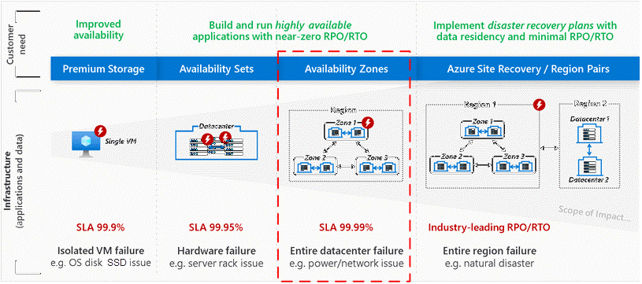

<!-- cSpell:ignore lbrader -->

# Building solutions for high availability using Availability Zones

Microsoft Azure global infrastructure is designed and constructed at every layer
to deliver the highest levels of redundancy and resiliency to its customers.
Azure infrastructure is composed of geographies, regions, and Availability
Zones, which limit the blast radius of a failure and therefore limit potential
impact to customer applications and data. The Azure Availability Zones construct
was developed to provide a software and networking solution to protect against
datacenter failures and to provide increased high availability (HA) to our
customers.

Availability Zones are unique physical locations within an Azure region. Each
zone is made up of one or more datacenters with independent power, cooling, and
networking. The physical separation of Availability Zones within a region limits
the impact to applications and data from zone failures, such as large-scale
flooding, major storms and superstorms, and other events that could disrupt site
access, safe passage, extended utilities uptime, and the availability of
resources. Availability Zones and their associated datacenters are designed such
that if one zone is compromised, the services, capacity, and availability are
supported by the other Availability Zones in the region.

Availability Zones can be used to spread a solution across multiple zones within
a region, allowing for an application to continue functioning when one zone
fails. With Availability Zones, Azure offers industry best 99.99% [Virtual
Machine (VM) uptime service-level agreement
(SLA)](https://azure.microsoft.com/support/legal/sla/virtual-machines/v1_9/).
Zone-redundant services replicate your services and data across Availability
Zones to protect from single points of failure.

For additional information on Availability Zones, including service support by
region and pricing, refer to [What are Availability Zones in
Azure?](/azure/availability-zones/az-overview)
in Microsoft Azure Documentation.

## Delivering reliability in Azure

Designing solutions that continue to function in spite of failure is key to
improving the reliability of a solution. In cloud-based solutions, building to
survive failure is a shared responsibility. This can be viewed at three levels:
a resilient foundation, resilient services, and resilient applications. The
foundation is the Microsoft investment in the platform, including Availability
Zones. On top of this foundation are the Azure services that customers can
enable to support high availability, such as zone-redundant storage (ZRS), which
replicates data across zones. The customer builds applications upon the enabled
services supported by the foundation. The applications should be architected to
support resiliency.

 

   ### Your applications

   Your **app** or **workload** architecture

   ### Resilient services

   Azure capabilities you **enable as needed**

   ### Resilient foundation

   Azure capabilities **built into the platform**

When architecting for resilience, all three layers-foundation, services, and
applications-should be considered to achieve the highest level of reliability.
Since a solution can be made up of many components, each component should be
designed for reliability.

## Zonal vs. zone-redundant architecture

An Availability Zone in an Azure region is a combination of a fault domain and
an update domain. For example, if you create three or more VMs across three
zones in an Azure region, your VMs are effectively distributed across three
fault domains and three update domains. The Azure platform recognizes this
distribution across update domains to take care that VMs in different zones are
not updated at the same time.

Azure services supporting Availability Zones fall into two categories: zonal and
zone redundant. Customer workloads can be categorized to utilize either
architecture scenario to meet application performance and durability
requirements.

With *zonal* architecture, a resource can be deployed to a specific,
self-selected Availability Zone to achieve more stringent latency or performance
requirements. Resiliency is self-architected by replicating applications and
data to one or more zones within the region. You can choose specific
Availability Zones for synchronous replication, providing high availability, or
asynchronous replication, providing backup or cost advantage. You can pin
resources-for example, virtual machines, managed disks, or standard IP
addresses-to a specific zone, allowing for increased resilience by having one or
more instances of resources spread across zones.

With *zone-redundant* architecture, the Azure platform automatically replicates
the resource and data across zones. Microsoft manages the delivery of high
availability, since Azure automatically replicates and distributes instances
within the region.

A failure to a zone affects zonal and zone-redundant services differently. In
the case of a zone failure, the zonal services in the failed zone become
unavailable until the zone has recovered. By architecting your solutions to use
replicated VMs in zones, you can protect your applications and data from a zone
becoming unavailable-for example, due to a power outage. If one zone is
compromised, replicated apps and data are instantly available in another zone.

Zonal architecture applies to a specific resource, typically an infrastructure
as a service (IaaS) resource, like a VM or managed disk, as illustrated.

*For example, zonal load balancer, VM, managed disks, virtual machine scale sets.*

In the illustration, each VM and load balancer (LB) are deployed to a specific
zone.

With zone-redundant services, the distribution of the workload is a feature of
the service and is handled by Azure. Azure automatically replicates the resource
across zones without requiring your intervention. ZRS, for example, replicates
the data across three zones so a zone failure does not impact the HA of the
data.  
  
The following illustration is of a zone-redundant load balancer.

*For example, zone-redundant load balancer, Azure Application Gateway, Azure
Service Bus, virtual private network (VPN), zone-redundant storage, Azure
ExpressRoute, Azure Event Hubs, Azure Cosmos DB.*

A few resources, like the load balancer and subnets, support both zonal and
zone-redundant deployments. An important consideration in HA is distributing the
traffic effectively across resources in the different Availability Zones. For
information on how Availability Zones apply to the load balancer resources for
both zonal and zone-redundant resources, refer to [Standard Load Balancer and
Availability
Zones](/azure/load-balancer/load-balancer-standard-availability-zones).

The following is a summary of the zonal (Z) and zone-redundant (ZR) Azure
services.

<table>
  <tr valign="top">
    <td>

 **Analytics** 

- **Azure Data Explorer (ZR)**

- **Azure Event Hubs (ZR)**

**Compute**

- **Linux virtual machines (Z)**

- **Windows virtual machines (Z)**

- **Virtual machine scale sets (Z, ZR)**

- **Azure App Service Environments (Z)**

**Containers**

- **Azure Kubernetes Service (AKS) (Z)**

- **Azure Service Fabric (Z)**

**Databases**

- **Azure SQL Database (ZR)**

- **Azure Cache for Redis (Z, ZR)**

- **Azure Cosmos DB (ZR)**

**DevOps**

- **Azure DevOps (ZR)**

**Identity**

- **Azure Active Directory Domain Services (ZR)**

**Integration**

- **Azure Event Grid (ZR)**

- **Azure Service Bus (ZR)** 
    </td>
    <td> 

**Management and governance** 

- **Azure Traffic Manager (ZR)** 

**Networking**

- **Azure Load Balancer (Z, ZR)**

- **VPN gateway (ZR)**

- **Azure ExpressRoute (ZR)**

- **Azure Application Gateway (ZR)**

- **Azure Firewall (ZR)**

- **Azure Virtual WAN (ZR)**

**Security**

- **Azure Active Directory Domain Services (ZR)**

**Storage**

- **Azure Data Lake Storage (ZRS)**

- **Azure Blob storage (ZRS, ZR)**

- **Azure Managed Disks (Z)**

**Additional capabilities**

- **Azure Premium Files (ZRS)**

- **Zone-redundant storage (ZRS)**

- **Standard IP address (ZR)**

- **Azure Traffic Analytics (ZR)**
       </td> 
    </tr> 
</table>

*VMs supporting AZs: AV2-series, B-series, DSv2-series, DSv3-series, Dv2-series,
Dv3-series, ESv3-series, Ev3-series, F-series, FS-series, FSv2-series, M-series.*

For a list of Azure services that support Availability Zones, per Azure region,
refer to the [Availability Zones
documentation](/azure/availability-zones/az-overview#services-support-by-region).

## SLA offered by Availability Zones

With Availability Zones, Azure offers industry best 99.99% VM uptime SLA. The
full [Azure
SLA](https://azure.microsoft.com/support/legal/sla/virtual-machines/v1_9/)
explains the guaranteed availability of Azure as a whole.

The following diagram illustrates the different levels of HA offered by a single
VM, Availability Sets, and Availability Zones.

Using a VM workload as an example, a single VM has an SLA of 99.9%. This means
the VM will be available 99.9% of the time. Within a single datacenter, the use
of Availability Sets can increase the level of SLA to 99.95% by protecting a set
of VMs, ensuring they will not all be on the same hardware. Within a region, VM
workloads can be distributed across Availability Zones to increase the SLA to
99.99%. For more information, refer to [Availability options for VMs in
Azure](/azure/virtual-machines/availability).

Every organization has unique requirements, and you should design your
applications to best meet your complex business needs. Defining a target SLA
will make it possible to evaluate whether the architecture meets your business
requirements. Some things to consider include:

- What are the availability requirements?

- How much downtime is acceptable?

- How much will potential downtime cost your business?

- How much should you invest in making the application highly available?

- What are the data backup requirements?

- What are the data replication requirements?

- What are the monitoring requirements?

- Does your application have specific latency requirements?

For additional guidance, refer to [Principles of the reliability pillar](../framework/resiliency/overview.md).

Depending on the availability needs of an application, the cost and design
complexity will vary. When building for a VM workload, there will be a cost
associated with each VM. For example, two VMs per zone across three active zones
will have a cost for six VMs. For pricing of VM workloads, refer to the [Azure
pricing
calculator](https://azure.microsoft.com/pricing/calculator/?service=virtual-machines).
