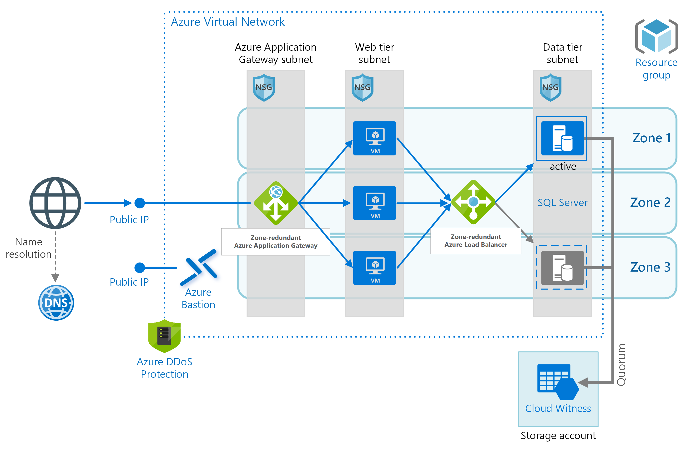
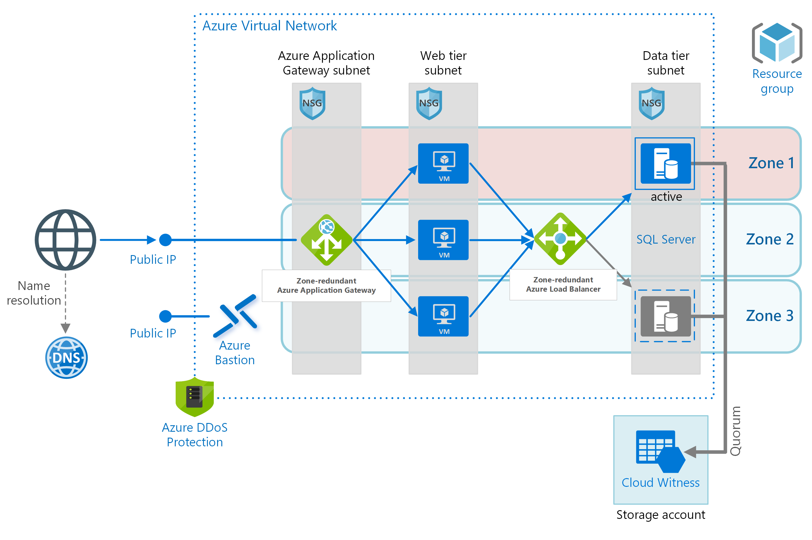

# IaaS: Web application with relational database

Availability Zones are unique physical locations within an Azure region. Each zone is made up of one or more datacenters with independent power, cooling, and networking. The physical separation of availability zones within a region limits the impact to applications and data from zone failures, such as largescale flooding, major/super-storms, and other events that would disrupt site access, safe passage, extended utilities uptime, and the availability of resources. This reference architecture shows best practices for applying Availability Zones to a web application and Microsoft SQL Server database hosted on virtual machines (VMs) known as a zonal deployment.

This approach is used in high availability (HA) scenarios with resiliency as the most significant concern. With HA architecture there is a balance between high resilience, low latency, and cost. This architecture uses redundant resources spread across zones to provide high resiliency. Traffic can be routed between zones to minimize the impact of a zonal failure. If a zone does fail, resources in the zone absorb the traffic until the zone recovers. This provides a high level of resilience.

This architecture provides an efficient use of resources as most of the resources are actively used. All resources are used in handling the requests other than the passive SQL Server. The passive SQL Server only becomes active in the case of a failure of the current SQL Server.

The zone-redundant application gateway and zone-redundant load balancer distribute the traffic to the available resources. Cross-zone routing will have increased latency relative to traffic routed within the zone.



[*Download a Visio file of this architecture.*](https://arch-center.azureedge.net/ref-arch-iaas.vsdx)

## Architecture

The architecture uses resources spread across multiple zones to provide a high availability (HA) architecture for hosting an Infrastructure as a Service (IaaS) web application and SQL Server database. A zone-redundant application gateway routes traffic to virtual machines within the web tier. A zone-redundant load balancer routes traffic from the virtual machines in the web tier to the active SQL Server. In the case of a zonal failure, the application gateway will route to virtual machines in the other available zones.

If the active SQL Server becomes unavailable, either due to a zone failure or local failure, a passive SQL Server will become the active SQL Server. The zone-redundant load balancer will detect the failover of SQL Server and route traffic to the newly active SQL Server.

The following illustrates a failure of Zone 1.



The application gateway is zone-redundant and is not impacted by the failure of Zone 1. The application gateway uses health probes to determine the available virtual machines. With Zone 1 unavailable, the zone-redundant application gateway only routes traffic to the remaining two zones. The zone-redundant load balancer is also not impacted by the failure of Zone 1 and uses health probes to determine the location of the active SQL Server. In this example, the load balancer will detect that the active SQL Server is in Zone 3 and will then route traffic to the SQL Server instance in Zone 3.

Spreading resources across Availability Zones also protects an application from planned maintenance. When VMs are distributed across three Availability Zones, effectively they are spread across three update domains. The Azure platform recognizes this distribution across update domains to ensure that VMs in different zones are not updated at the same time.

By replicating VMs across Availability Zones, you can protect your applications and data from a zonal failure. This allows Azure to support the industry best 99.99% VM uptime service-level agreement (SLA). See [Building solutions for high availability using Availability Zones](./building-solutions-for-high-availability.md).

The architecture has the following components.

### General

- **Resource group**. [Resource groups](/azure/azure-resource-manager/management/overview#resource-groups) are used to group Azure resources so  they can be managed by lifetime, owner, or other criteria.

- **Availability Zones**. [Availability Zones](/azure/availability-zones/az-overview#availability-zones) are physical locations within an Azure region. Each zone consists of one or more datacenters with independent power, cooling, and networking. By placing VMs across zones, the application becomes resilient to failures within a zone.

### Networking and load balancing

- **Virtual network and subnets**. Every Azure VM is deployed into a virtual network (VNet) that can be segmented into subnets. Create a separate subnet for each tier.

- **Azure Application Gateway**. Azure [Application Gateway](/azure/application-gateway/) is a layer 7 load balancer. In this architecture, a zone-redundant application gateway routes HTTP requests to the web front end. Application Gateway also provides a [Web Application Firewall](/azure/application-gateway/waf-overview) (WAF) that protects the application from common exploits and vulnerabilities. The v2 SKU of Application Gateway supports cross-zone redundancy. A single Application Gateway deployment can run multiple instances of the gateway. For production workloads, run at least two instances. For more information, see [Autoscaling and Zone-redundant Application Gateway v2](/azure/application-gateway/application-gateway-autoscaling-zone-redundant) and [How does Application Gateway support high availability and scalability?](/azure/application-gateway/application-gateway-faq#how-does-application-gateway-support-high-availability-and-scalability).

- **Azure Load Balancer**. Azure Load Balancer is a layer 4 load balancer. In this architecture, a zone-redundant [Azure Standard Load Balancer](/azure/load-balancer/load-balancer-standard-overview) directs network traffic from the web tier to SQL Server. Because a zone-redundant load balancer is not pinned to a specific zone, the application will continue to distribute the network traffic in the case of a zonal failure. A zone-redundant load balancer is used to provide availability in the case the active SQL Server becomes unavailable. The Standard SKU of Azure Load Balancer supports cross-zone redundancy. For more information, see [Standard Load Balancer and Availability Zones](/azure/load-balancer/load-balancer-standard-availability-zones).

- **Network security groups (NSGs)**. A [network security group](/azure/virtual-network/virtual-networks-nsg) is used to restrict network traffic within the virtual network. In this architecture, the web tier only accepts traffic from the public IP endpoint. Additionally, the database tier does not accept traffic from any subnet other than the web-tier subnet.

- **DDoS protection**. The Azure platform provides protection against distributed denial of service (DDoS) attacks. For additional protection, we recommend using [DDoS Protection Standard](/azure/virtual-network/ddos-protection-overview), which has enhanced DDoS mitigation features. See [Security considerations](#ddos-protection).

- **Bastion**. [Azure Bastion](https://azure.microsoft.com/services/azure-bastion/) provides secure and seamless Remote Desktop Protocol (RDP) and Secure Shell (SSH) access to the VMs within the VNet. This provides access while limiting the exposed public IP addresses of the VMs with the VNet. Azure Bastion provides a cost-effective alternative to a **provisioned** VM to provide access to  all VMs within the same virtual network.

### Microsoft SQL Server

- **SQL Server Always On availability group**. SQL Server Always On availability group provides high availability at the data tier by enabling replication and failover. It uses Windows Server Failover Cluster (WSFC) technology for failover.

- **Cloud Witness**. A failover cluster requires more than half of its nodes to be running, which is known as having quorum. If the cluster has just two nodes, a network partition could cause each node to think it's the primary node. In that case, you need a witness to break ties and establish quorum. A witness is a resource such as a shared disk that can act as a tie breaker to establish quorum. Cloud Witness is a type of witness that uses Azure Blob Storage. The Azure Blob Storage must use Zone Redundant Storage (ZRS) to not be impacted by zonal failure.

    To learn more about the concept of quorum, see [Understanding cluster and  pool quorum](/windows-server/storage/storage-spaces/understand-quorum). For more information about Cloud Witness, see [Deploy a Cloud Witness for a Failover Cluster](/windows-server/failover-clustering/deploy-cloud-witness).

## Recommendations

Your requirements might differ from the architecture described here. Use these recommendations as a starting point.

For recommendations on configuring the VMs, see [Run a Windows VM on Azure](../reference-architectures/n-tier/windows-vm.yml).

For more information about designing virtual networks and subnets, see [Plan and design Azure Virtual Networks](/azure/virtual-network/virtual-network-vnet-plan-design-arm).

### Network security groups

Use NSG rules to restrict traffic between tiers. In the architecture shown earlier, only the web tier can communicate directly with the database tier. To enforce this rule, the database tier should block all incoming traffic except for the web-tier subnet.

- Deny all inbound traffic from the virtual network. (Use the VIRTUAL\_NETWORK tag in the rule.)

- Allow inbound traffic from the web-tier subnet.

- Allow inbound traffic from the database-tier subnet itself. This rule allows communication between the database VMs, which is needed for database replication and failover.

Create rules 2 – 3 with higher priority than the first rule, so they override it.

### SQL Server Always On availability groups

We recommend [Always On availability
groups](/sql/database-engine/availability-groups/windows/always-on-availability-groups-sql-server?view=sql-server-ver15&preserve-view=true) for Microsoft SQL Server high availability. Other tiers connect to the database through an [availability group listener](/sql/database-engine/availability-groups/windows/listeners-client-connectivity-application-failover?view=sql-server-ver15&preserve-view=true). The listener enables a SQL client to connect without knowing the name of the physical instance of SQL Server. VMs that access the database must be joined to the domain. The client (in this case, another tier) uses DNS to resolve the listener's virtual network name into IP addresses.

Configure the SQL Server Always On availability group as follows:

- Create a Windows Server Failover Clustering (WSFC) cluster, a SQL Server Always On availability group, and a primary replica. For more information, see [Getting Started with Always On availability groups](/sql/database-engine/availability-groups/windows/getting-started-with-always-on-availability-groups-sql-server?view=sql-server-ver15&preserve-view=true).

- Create an internal load balancer with a static private IP address.

- Create an availability group listener and map the listener's DNS name to the IP address of an internal load balancer.

- Create a load balancer rule for the SQL Server listening port (TCP port 1433 by default). The load balancer rule must enable floating IP, also called Direct Server Return. This causes the VM to reply directly to the client, which enables a direct connection to the primary replica.

> [!NOTE]
> When floating IP is enabled, the front-end port number must be the same as the back-end port number in the load balancer rule.

When a SQL client tries to connect, the load balancer routes the connection request to the primary replica. If there is a failover to another replica, the load balancer automatically routes new requests to a new primary replica. For more information, see [Configure a load balancer for an availability group on Azure SQL Server VMs](/azure/virtual-machines/windows/sql/virtual-machines-windows-portal-sql-alwayson-int-listener).

During a failover, existing client connections are closed. After the failover completes, new connections will be routed to the new primary replica.

If your application makes significantly more reads than writes, you can offload some of the read-only queries to a secondary replica. See [Connect to a read-only replica](/sql/database-engine/availability-groups/windows/listeners-client-connectivity-application-failover?view=sql-server-ver15&preserve-view=true#ConnectToSecondary&preserve-view=true).

Test your deployment by [forcing a manual failover](/sql/database-engine/availability-groups/windows/perform-a-forced-manual-failover-of-an-availability-group-sql-server?view=sql-server-ver15&preserve-view=true) of the availability group.

## Availability considerations

Availability Zones provide high resilience within a single region. If you need even higher availability, consider replicating the application across two regions, using Azure Traffic Manager for failover. For more information, see [Run an N-tier application in multiple Azure regions for high availability](../reference-architectures/n-tier/multi-region-sql-server.yml).

Not all regions support Availability Zones, and not all VM sizes are supported in all zones. Run the following Azure CLI command to find the supported zones for each VM size within a region:

```azurecli
az vm list-skus --resource-type virtualMachines --zone false --location eastus -o table
```

Virtual machine scale sets automatically use placement groups, which act as an implicit availability set. For more information about placement groups, see [Working with large virtual machine scale sets](/azure/virtual-machine-scale-sets/virtual-machine-scale-sets-placement-groups).

### Health probes

Azure Application Gateway and Azure Load Balancer both use health probes to monitor the availability of VM instances.

- Application Gateway always uses an HTTP probe.

- Load Balancer can test either HTTP or TCP. Generally, if a VM runs an HTTP server, use an HTTP probe. Otherwise, use TCP.

If a probe can't reach an instance within a timeout period, the gateway or load balancer stops sending traffic to that VM. The probe continues to check and will return the VM to the back-end pool if the VM becomes available again.

HTTP probes send an HTTP GET request to a specified path and listen for an HTTP 200 response. This path can be the root path ("/"), or a health-monitoring endpoint that implements some custom logic to check the health of the application. The endpoint must allow anonymous HTTP requests.

For more information about health probes, see:

- [Load Balancer health probes](/azure/load-balancer/load-balancer-custom-probe-overview)

- [Application Gateway health monitoring overview](/azure/application-gateway/application-gateway-probe-overview)

For considerations about designing a health probe endpoint, see [Health Endpoint Monitoring pattern](../patterns/health-endpoint-monitoring.md).

## Cost considerations

Use the [Azure Pricing Calculator](https://azure.microsoft.com/pricing/calculator/) to estimates costs. Here are some other considerations.

### Virtual machine scale sets

Virtual machine scale sets are available on all Windows VM sizes. You are only charged for the Azure VMs you deploy, and any additional underlying infrastructure resources consumed, such as storage and networking. There are no incremental charges for the virtual machine scale sets service.

For single VMs pricing options, see [Windows VMs pricing](https://azure.microsoft.com/pricing/details/virtual-machines/windows/).

### SQL Server

If you choose Azure SQL DBaaS, you can save on cost because you don't need to configure an Always On availability group and domain controller machines. There are several deployment options starting from single database up to managed instance, or elastic pools. For more information, see [Azure SQL pricing](https://azure.microsoft.com/pricing/details/sql-database/managed/).

For SQL server VMs pricing options, see [SQL VMs pricing](https://www.microsoft.com/sql-server/sql-server-2019-pricing).

### Azure Load Balancer

You are charged only for the number of configured load-balancing and outbound rules. Inbound NAT rules are free. There is no hourly charge for the Standard Load Balancer when no rules are configured.

For more information, see the cost section in [Azure Architecture Framework](../framework/cost/overview.md).

### Azure Application Gateway

The Application Gateway should be provisioned with the v2 SKU and can span multiple Availability Zones. With the v2 SKU, the pricing model is driven by consumption and has two components: Hourly fixed price and a consumption-based cost.

For more information, see the pricing section in [Autoscaling and Zone-redundant Application Gateway v2](/azure/application-gateway/application-gateway-autoscaling-zone-redundant#pricing).

## Security considerations

Virtual networks are a traffic isolation boundary in Azure. By default, VMs in one virtual network can't communicate directly with VMs in a different virtual network. However, you can explicitly connect virtual networks by using [virtual network peering](/azure/virtual-network/virtual-network-peering-overview).

### Network security groups

Use [network security groups](/azure/virtual-network/virtual-networks-nsg) (NSGs) to restrict traffic to and from the internet. For more information, see [Microsoft cloud services and network security](/azure/best-practices-network-security).

### DMZ

Consider adding a network virtual appliance (NVA) to create a DMZ between the internet and the Azure virtual network. NVA is a generic term for a virtual appliance that can perform network-related tasks, such as firewall, packet inspection, auditing, and custom routing. For more information, see [Network DMZ between Azure and an on-premises datacenter](../reference-architectures/dmz/secure-vnet-dmz.yml).

### Encryption

Encrypt sensitive data at rest and use [Azure Key Vault](https://azure.microsoft.com/services/key-vault) to manage the database encryption keys. Key Vault can store encryption keys in hardware security modules (HSMs). For more information, see [Configure Azure Key Vault Integration for SQL Server on Azure VMs](/azure/azure-sql/virtual-machines/windows/azure-key-vault-integration-configure). It's also recommended to store application secrets, such as database connection strings, in Key Vault.

### DDoS protection

The Azure platform provides basic DDoS protection by default. This basic protection is targeted at protecting the Azure infrastructure. Although basic DDoS protection is automatically enabled, we recommend using [DDoS Protection Standard](/azure/virtual-network/ddos-protection-overview).
Standard protection uses adaptive tuning, based on your application's network traffic patterns, to detect threats. This allows it to apply mitigations against DDoS attacks that might go unnoticed by the infrastructure-wide DDoS policies. Standard protection also provides alerting, telemetry, and analytics through Azure Monitor. For more information, see [Azure DDoS Protection: Best practices and reference architectures](/azure/security/fundamentals/ddos-best-practices).

## Next steps

- [Microsoft Learn module: Tour the N-tier architecture style](/learn/modules/n-tier-architecture/)
