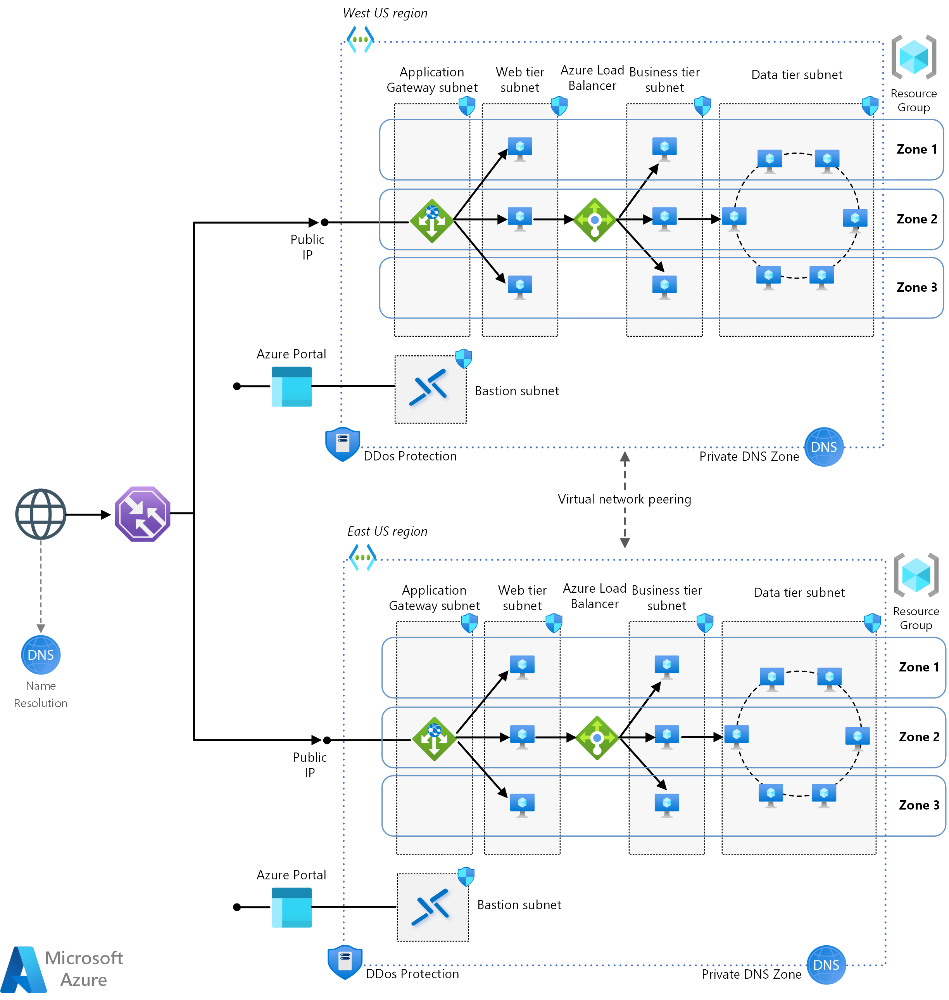

# Multi-region load balancing with Traffic Manager and Application Gateway

This reference architecture is applicable to any industry that intends to serve web workloads and needs to deploy resilient multitier applications in multiple Azure regions, in order to achieve availability and a robust disaster recovery infrastructure. 
In this reference architecture, Azure Traffic Manager performs the global load balancing of web traffic across Azure regions, which have a regional load balancer based on Azure Application Gateway. This combination gets you the benefits of Traffic Manager many routing rules and Application Gateway’s capabilities such as WAF, TLS termination, path-based routing, cookie-based session affinity among others.
In this scenario, the application consists of three layers.
- **Web tier:** The top layer including the user interface. This layer parses user interactions and passes the actions to next layer for processing.
- **Business tier:** Processes the user interactions and makes logical decisions about the next steps. This layer connects the web tier and the data tier.
- **Data tier:** Stores the application data. Either a database, object storage, or file storage is typically used.

>[!NOTE]
> Azure provides a suite of fully managed load-balancing solutions for your scenarios. If you are looking for Transport Layer Security (TLS) protocol termination ("SSL offload") or per-HTTP/HTTPS request, application-layer processing, review [Azure Application Gateway](/azure/application-gateway/overview). If you are looking for regional load balancing, review [Azure Load Balancer](/azure/load-balancer/load-balancer-overview). Your end-to-end scenarios might benefit from combining these solutions as needed.
>
> For an Azure load-balancing options comparison, see [Overview of load-balancing options in Azure](/azure/architecture/guide/technology-choices/load-balancing-overview).

## Architecture

Traffic Manager operates at the DNS layer to quickly and efficiently direct application traffic based on the routing method of your choice. An example would be sending requests to the closest endpoints, improving the responsiveness of your applications. Whereas Application Gateway load balances HTTP(S) and WebSocket requests to route traffic to backend pool servers. The backend can be public or private endpoints, virtual machines, virtual machine scale sets, app services, or Kubernetes clusters. Traffic can be routed based on attributes of an HTTP request, such as a host name and URI path. The architecture has the following components.

### General

- **Multiple Azure regions** Use at least two Azure regions to achieve higher availability. You can deploy your application across multiple Azure regions in in active/passive or active/active configurations.

- **Resource groups:** [Resource groups](/azure/azure-resource-manager/management/overview) are used to group Azure resources so they can be managed by lifetime, owner, or other criteria.
- **Availability zones:** [Availability zones](/azure/availability-zones/az-overview) are physical locations within an Azure region. Each zone consists of one or more data centers with independent power, cooling, and networking. By placing VMs across zones, the application becomes resilient to failures within a zone.

### Networking and load balancing

- **Virtual network and subnets:** Azure VM and specific Azure resources (such as Azure App Gateway or Azure Load Balancer) are deployed into a virtual network that can be segmented into subnets. Create a separate subnet for each tier.
 
- **Azure Traffic Manager:** [Traffic Manager](/azure/traffic-manager/traffic-manager-overview) is a DNS-based traffic load balancer that distributes traffic optimally to services across global Azure regions while providing high availability and responsiveness. For more information, see the section [Traffic Manager configuration](/azure/architecture/reference-architectures/n-tier/multi-region-sql-server#traffic-manager-configuration).
 
- **Azure Application Gateway:** [Azure Application Gateway](/azure/application-gateway/overview) is a layer 7 load balancer. In this architecture, a zone-redundant application gateway routes HTTP requests to the web front end. Application Gateway also provides a Web Application Firewall (WAF) that protects the application from common exploits and vulnerabilities. The v2 SKU of Application Gateway supports cross-zone redundancy. A single Application Gateway deployment can run multiple instances of the gateway. For production workloads, run at least two instances. Note that on this architecture, the public endpoint of the Application Gateways are configured as the Traffic Manager backends.
 
- **Azure Load Balancer:** [Azure Load Balancer](/azure/load-balancer/load-balancer-overview) is a layer 4 load balancer. In this architecture, a zone-redundant Azure Standard Load Balancer directs network traffic from the web tier to business tier. Because a zone-redundant load balancer is not pinned to a specific zone, the application will continue to distribute the network traffic in the case of a zonal failure.
 
- **Network security groups (NSGs):** Use [NSGs](/azure/virtual-network/network-security-groups-overview) to restrict network traffic within the virtual network. For example, in the three-tier architecture shown here, the database tier does not accept traffic from the web front end, only from the business tier and the bastion subnet.
 
- **DDoS Protection:** Although the Azure platform provides basic protection against distributed denial of service (DDoS) attacks, we recommend using [DDoS Protection Standard](/azure/ddos-protection/ddos-protection-overview), which has enhanced DDoS mitigation features. See [Security considerations](/azure/architecture/reference-architectures/n-tier/n-tier-sql-server#security-considerations).
 
- **Azure DNS:** [Azure DNS](/azure/dns/dns-overview) is a hosting service for DNS domains. It provides name resolution using Microsoft Azure infrastructure. By hosting your domains in Azure, you can manage your DNS records using the same credentials, APIs, tools, and billing as your other Azure services.
 
- **Virtual network peering:** [Virtual network peering](/azure/virtual-network/virtual-network-peering-overview) enables you to seamlessly connect two or more virtual networks in Azure. The virtual networks appear as one for connectivity purposes. The traffic between virtual machines in peered virtual networks uses the Microsoft backbone infrastructure. Make sure that the address space of the virtual networks do not overlap.
 
- **Azure Bastion:** [Azure Bastion](/azure/bastion/bastion-overview) provides secure and seamless Remote Desktop Protocol (RDP) and Secure Shell (SSH) access to the VMs within the VNet. This provides access while limiting the exposed public IP addresses of the VMs with the VNet. Azure Bastion provides a cost-effective alternative to a provisioned VM to provide access to all VMs within the same virtual network.
 
## Recommendations

A multi-region architecture can provide higher availability than deploying to a single region. If a regional outage affects the primary region, you can use Traffic Manager to fail over to the secondary region. This architecture can also help if an individual subsystem of the application fails.
Note that this architecture is applicable for active/passive as well as for active/active highly available configurations across Azure regions.

### Regional pairing
Each Azure region is paired with another region within the same geography (such as US, Europe, or Asia). This approach allows for the replication of resources, such as VM storage, across a geography that should reduce the likelihood of natural disasters, civil unrest, power outages, or physical network outages affecting both regions at once. Additional advantages of region pairs include:
- In the event of a wider Azure outage, one region is prioritized out of every pair to help reduce the time to restore for applications.
- Planned Azure updates are rolled out to paired regions one at a time to minimize downtime and risk of application outage.
- Data continues to reside within the same geography as its pair (except for Brazil South) for tax and law enforcement jurisdiction purposes.

However, make sure that both regions support all of the Azure services needed for your application (see [Services by region](https://azure.microsoft.com/global-infrastructure/geographies/#services)). For more information about regional pairs, see [Business continuity and disaster recovery (BCDR): Azure Paired Regions](/azure/best-practices-availability-paired-regions).

### Network security groups
Use NSG rules to restrict traffic between tiers. In the architecture shown earlier, only the business tier can communicate directly with the database tier. To enforce this rule, the database tier should block all incoming traffic except for the business-tier subnet.
1.	Deny all inbound traffic from the virtual network. (Use the VIRTUAL_NETWORK tag in the rule.)
2.	Allow inbound traffic from the business-tier subnet.
3.	Allow inbound traffic from the database-tier subnet itself. This rule allows communication between the database VMs, which is needed for database replication and failover.

Create rules 2 – 3 with higher priority than the first rule, so they override it.

### Traffic Manager configuration
Consider the following points when configuring Traffic Manager:
-	**Routing:** Traffic Manager supports several [routing algorithms](/azure/traffic-manager/traffic-manager-routing-methods). For the scenario described in this article, we are using performance routing. Deploying endpoints in two or more locations across the globe can improve the responsiveness of your applications. With the 'Performance' traffic-routing method, you can route traffic to the location that is 'closest' to you. For more information, see [Configure the performance traffic routing method](/traffic-manager/traffic-manager-configure-performance-routing-method). 

In case endpoint A stopped performing as efficiently as endpoint B, customer traffic is automatically routed to endpoint B. Also, if you need more granular control, for example, to choose a preferred failover within a region, you can use Traffic Manager in a nested configuration. 

-	**Health probe:** Traffic Manager uses an HTTP (or HTTPS) probe to monitor the availability of each region. The probe checks for an HTTP 200 response for a specified URL path. As a best practice, create an endpoint that reports the overall health of the application, and use this endpoint for the health probe. Otherwise, the probe might report a healthy endpoint when critical parts of the application are failing. For more information, see [Health Endpoint Monitoring pattern](/azure/architecture/patterns/health-endpoint-monitoring).

When Traffic Manager fails over there is a period of time when clients cannot reach the application. The duration is affected by the following factors:
- The health probe must detect that the primary region has become unreachable.
- DNS servers must update the cached DNS records for the IP address, which depends on the DNS time-to-live (TTL). The default TTL is 300 seconds (5 minutes), but you can configure this value when you create the Traffic Manager profile.

For more details, see [About Traffic Manager Monitoring](/azure/traffic-manager/traffic-manager-monitoring).

Enable [Traffic View](/azure/traffic-manager/traffic-manager-traffic-view-overview) to understand which regions have a large amount of traffic but suffer from higher latencies. Then you use this information to plan your footprint expansion to new Azure regions. That way your users will have a lower latency experience.

## Availability considerations

Availability Zones provide high resiliency within a single region. If you need even higher availability, consider deploying the application across two or more regions, using Azure Traffic Manager for failover as described in this article. Traffic Manager delivers high availability for your critical applications by monitoring your endpoints and providing automatic failover when an endpoint goes down.

Application Gateway v1 SKU supports high-availability scenarios when you've deployed two or more instances. Azure distributes these instances across update and fault domains to ensure that instances don't all fail at the same time. The v1 SKU supports scalability by adding multiple instances of the same gateway to share the load.

Application Gateway v2 SKU automatically ensures that new instances are spread across fault domains and update domains. If you choose zone redundancy, the newest instances are also spread across availability zones to offer zonal failure resiliency.

### Health probes

Azure Application Gateway and Azure Load Balancer both use health probes to monitor the availability of VM instances.
- Application Gateway always uses an HTTP probe.
- Load Balancer can test either HTTP or TCP. Generally, if a VM runs an HTTP server, use an HTTP probe. Otherwise, use TCP.

If a probe can't reach an instance within a timeout period, the gateway or load balancer stops sending traffic to that VM. The probe continues to check and will return the VM to the back-end pool if the VM becomes available again. HTTP probes send an HTTP GET request to a specified path and listen for an HTTP 200 response. This path can be the root path ("/"), or a health-monitoring endpoint that implements some custom logic to check the health of the application. The endpoint must allow anonymous HTTP requests.

For more information about health probes, see:
-	[Load Balancer health probes](/load-balancer/load-balancer-custom-probe-overview)
-	[Application Gateway health monitoring overview](/azure/application-gateway/application-gateway-probe-overview)

For considerations about designing a health probe endpoint, see [Health Endpoint Monitoring pattern](/azure/architecture/patterns/health-endpoint-monitoring).

## Cost considerations
Use the [Azure Pricing Calculator](https://azure.microsoft.com/pricing/calculator/) to estimates costs. Here are some other considerations.

### Virtual machine scale sets
Virtual machine scale sets are available on all Windows VM sizes. You are only charged for the Azure VMs you deploy, and any additional underlying infrastructure resources consumed, such as storage and networking. There are no incremental charges for the virtual machine scale sets service.
For single VMs pricing options, see [Windows Virtual Machines Pricing](https://azure.microsoft.com/pricing/details/virtual-machines/windows/).

### Azure Load Balancer
You are charged only for the number of configured load-balancing and outbound rules. Inbound NAT rules are free. There is no hourly charge for the Standard Load Balancer when no rules are configured.
For more information, see the cost section in [Azure Architecture Framework](/azure/architecture/framework/cost/overview).

### Azure Application Gateway
The Application Gateway should be provisioned with the v2 SKU and can span multiple Availability Zones. With the v2 SKU, the pricing model is driven by consumption and has two components: Hourly fixed price and a consumption-based cost.
For more information, see the pricing section in [Autoscaling and Zone-redundant Application Gateway v2](/azure/application-gateway/application-gateway-autoscaling-zone-redundant#pricing).

### Traffic Manager pricing
Traffic Manager billing is based on the number of DNS queries received, with a discount for services receiving more than 1 billion monthly queries. You are also charged for each monitored endpoint.
For pricing information, see [Traffic Manager pricing](https://azure.microsoft.com/pricing/details/traffic-manager/).

### Virtual network peering pricing
A high-availability deployment that leverages multiple Azure Regions will make use of VNet Peering. There are different charges for virtual network within the same region and for global virtual network peering.
For more information, see [Virtual Network Pricing](https://azure.microsoft.com/en-us/pricing/details/virtual-network/).

## Next steps
For additional reference architectures using the same technologies, see:
- [Multi-region N-tier application](/azure/architecture/reference-architectures/n-tier/multi-region-sql-server)
- [IaaS: Web application with relational database](/azure/architecture/high-availability/ref-arch-iaas-web-and-db)
