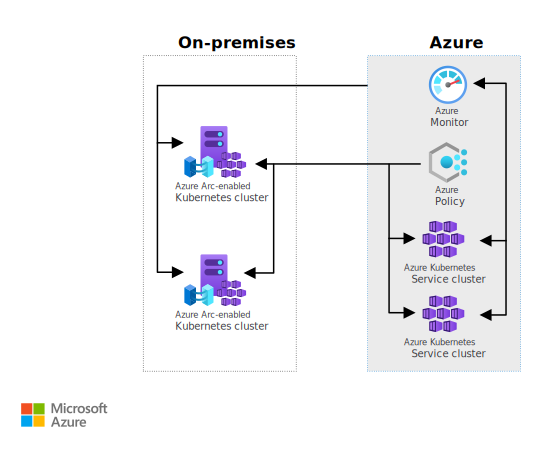

This reference architecture demonstrates how Azure Arc extends Kubernetes cluster management and configuration across customer data centers, edge locations, and multiple cloud environments.

## Architecture

*Download a [Visio file][Architecture visio] of this architecture.*

### Workflow

The architecture consists of the following aspects:

- **[Azure Arc-enabled Kubernetes][Azure Arc-enabled Kubernetes]**. Attach and configure Kubernetes clusters inside or outside of Azure by using Azure Arc-enabled Kubernetes. When a Kubernetes cluster is attached to Azure Arc, it's assigned an Azure Resource Manager ID and a managed identity.
- **[Azure Kubernetes Service][Azure Kubernetes Service]**. Host Kubernetes clusters in Azure to reduce the complexity and operational overhead of Kubernetes cluster management.
- **[On-premises Kubernetes cluster][kubernetes]**. Attach Cloud Native Computing Foundation (CNCF)-certified Kubernetes clusters that are hosted in on-premises or third-party cloud environments.
- **[Azure Policy][Azure Policy]**. Deploy and manage policies for Arc-enabled Kubernetes clusters.
- **[Azure Monitor][Azure Monitor]**. Observe and monitor Arc-enabled Kubernetes clusters.

### Components

- [Azure Arc](https://azure.microsoft.com/products/azure-arc) is a bridge that extends the Azure platform, making it possible to build applications and services that can run across datacenters, at the edge, and in multicloud environments.
- [Azure Kubernetes Service (AKS)](https://azure.microsoft.com/products/kubernetes-service) is a managed service for deploying and scaling Kubernetes clusters.
- [Azure Policy](https://azure.microsoft.com/products/azure-policy) makes it possible to achieve real-time cloud compliance at scale with consistent resource governance.
- [Azure Monitor](https://azure.microsoft.com/products/monitor) provides end-to-end observability for your applications, infrastructure, and network.

## Scenario details

You can use Azure Arc to register Kubernetes clusters that are hosted outside of Microsoft Azure. You can then use Azure tools to manage these clusters along with clusters that are hosted in Azure Kubernetes Service (AKS).

### Potential use cases

Typical uses for this architecture include:

- Managing on-premises Kubernetes clusters and clusters hosted in AKS for inventory, grouping, and tagging.
- Using Azure Monitor to monitor Kubernetes clusters across hybrid environments.
- Using Azure Policy to deploy and enforce policies for Kubernetes clusters across hybrid environments.
- Using Azure Policy to deploy and enforce GitOps.

## Recommendations

The following sections offer recommendations that apply to most scenarios. Microsoft recommends that you follow them unless you have a requirement that overrides them.

### Cluster registration

You can register any active CNCF Kubernetes cluster. You need a **kubeconfig** file to access the cluster and a cluster-admin role on the cluster to deploy Arc-enabled Kubernetes agents. You use the Azure Command-Line Interface (Azure CLI) to perform cluster registration tasks. The user or service principal that you use for the **az login** and **az connectedk8s connect** commands requires Read and Write permissions on the Microsoft.Kubernetes/connectedClusters resource type. The Kubernetes Cluster - Azure Arc Onboarding role has these permissions and can be used for role assignments on either the user principal or the service principal. Helm 3 is required for onboarding the cluster that uses the connectedk8s extension. Azure CLI version 2.3 or later is required to install the Azure Arc-enabled Kubernetes command-line interface extensions.

#### Azure Arc agents for Kubernetes

Azure Arc-enabled Kubernetes consists of a few agents (also referred to as *operators*) that run in the cluster that's deployed to the **azure-arc** namespace:

- **deployment.apps/config-agent**. Watches the connected cluster for source control configuration resources that are applied on the cluster, and updates the compliance state.
- **deployment.apps/controller-manager**. An operator of operators that orchestrates interactions between Azure Arc components.
- **deployment.apps/metrics-agent**. Collects metrics from other Arc agents to ensure that these agents are exhibiting optimal performance.
- **deployment.apps/cluster-metadata-operator**. Gathers cluster metadata, cluster version, node count, and Azure Arc agent version.
- **deployment.apps/resource-sync-agent**. Syncs the previously mentioned cluster metadata to Azure.
- **deployment.apps/clusteridentityoperator**. Maintains the Managed Service Identity (MSI) certificate that's used by other agents to communicate with Azure.
- **deployment.apps/flux-logs-agent**. Collects logs from the flux operators that are deployed as a part of source control configuration.
- **deployment.apps/extension-manager**. Installs and manages the lifecycle of extension Helm charts.
- **deployment.apps/kube-azure-ad-proxy**. Used for the authentication of the requests that are sent to the cluster by using Cluster Connect.
- **deployment.apps/clusterconnect-agent**. A reverse proxy agent that enables the cluster connect feature to provide access to the apiserver of the cluster. It's an optional component that's deployed only if the cluster connect feature is enabled on the cluster.
- **deployment.apps/guard**. An authentication and authorization webhook server that's used for Azure Active Directory (Azure AD) role-based access control (RBAC). It's an optional component that's deployed only if the azure-rbac feature is enabled on the cluster.

For more information, see [Connect an Azure Arc-enabled Kubernetes cluster][Connect an Azure Arc-enabled Kubernetes cluster].

### Monitor clusters by using Azure Monitor Container insights

Monitoring your containers is critical. Azure Monitor Container insights provides a rich monitoring experience for the AKS and AKS engine clusters. You can also configure Azure Monitor Container insights to monitor Azure Arc-enabled Kubernetes clusters that are hosted outside of Azure. Doing this provides comprehensive monitoring of your Kubernetes clusters across Azure, on-premises, and third-party cloud environments.

Azure Monitor Container insights can provide you with performance visibility by collecting memory and processor metrics from controllers, nodes, and containers, metrics that are available in Kubernetes through the Metrics application programming interface (API). Container logs are also collected. After you enable monitoring from Kubernetes clusters, metrics and logs are automatically collected for you by a containerized version of the Log Analytics agent. Metrics are written to the metrics store, and log data is written to the logs store that's associated with your Log Analytics workspace. For more information about Azure Monitor Container insights, see [Azure Monitor Container insights overview][Azure Monitor Container insights overview].

You can enable Azure Monitor Container insights for one or more deployments of Kubernetes by using either a PowerShell script or a Bash script.

To enable monitoring for Arc-enabled Kubernetes clusters, see [Enable monitoring of Azure Arc-enabled Kubernetes cluster][Enable monitoring of Azure Arc-enabled Kubernetes cluster]

### Use Azure Policy to enable GitOps-based application deployment

Use Azure Policy to enforce that each GitOps–enabled **Microsoft.Kubernetes/connectedclusters** resource or **Microsoft.ContainerService/managedClusters** resource has specific **Microsoft.KubernetesConfiguration/fluxConfigurations** applied on it. For example, you can apply a baseline configuration to one or more clusters, or deploy specific applications to multiple clusters. To use Azure Policy, select a definition from the [Azure Policy built-in definitions for Azure Arc-enabled Kubernetes][Azure Policy built-in definitions for Azure Arc-enabled Kubernetes], and then create a policy assignment.

 When you create the policy assignment, set the scope to an Azure resource group or subscription. Also set the parameters for the **fluxConfiguration** that's created. When the assignment is created, the Policy engine will identify all **connectedCluster** or **managedCluster** resources that are located within the scope, and then apply the **fluxConfiguration** to each.

If you're using multiple source repositories for each cluster (for example, one repo for the central IT/cluster operator and other repos for application teams), activate this by using multiple policy assignments and configure each policy assignment to use a different source repo.

For more information, see [Deploy applications consistently at scale using Flux v2 configurations and Azure Policy][Deploy applications at scale].

### Deploy applications using GitOps

GitOps is the practice of declaring the desired state of Kubernetes configuration (deployments, namespaces, and so on) in a source repository, such as a Git or Helm repository, Buckets, or Azure Blob Storage. This is followed by a polling and pull-based deployment of these configurations to the cluster by using an operator.

The connection between your cluster and one or more source repositories is enabled by deploying the **microsoft.flux** extension to your cluster. The **fluxConfiguration** resource properties represent where and how Kubernetes resources should flow from the source repository to your cluster. The **fluxConfiguration** data is stored encrypted at rest in an Azure Cosmos DB database to ensure data confidentiality.

The **flux-config** agent that runs in your cluster is responsible for watching for new or updated **fluxConfiguration** extension resources on the Azure Arc-enabled Kubernetes resource, for deploying applications from the source repository, and for propagating any updates that are made to the **fluxConfiguration**. You can even create multiple **fluxConfiguration** resources by using the **namespace** scope on the same Azure Arc-enabled Kubernetes cluster to achieve multi-tenancy.

The source repository can contain any valid Kubernetes resources, including Namespaces, ConfigMaps, Deployments, and DaemonSets. It can also contain Helm charts for deploying applications. Common source repository scenarios include defining a baseline configuration for your organization that can include common role-base access control (RBAC) roles and bindings, monitoring agents, logging agents, and cluster-wide services.

You can also manage a larger collection of clusters that are deployed across heterogeneous environments. For example, you can have one repository that defines the baseline configuration for your organization, and then apply that to multiple Kubernetes clusters simultaneously. You can also deploy applications to a cluster from multiple source repositories.

For more information, see [Deploy applications using GitOps with Flux v2][Deploy applications using GitOps with Flux v2].

### Topology, network, and routing

Azure Arc agents require the following protocols/ports/outbound URLs in order to function:

|Endpoint (DNS)|Description|
| -------------|-------------|
|`https://management.azure.com:443`|Required for the agent to connect to Azure and register the cluster.|
|`https://[region].dp.kubernetesconfiguration.azure.com:443`|Data plane endpoint for the agent to push status and fetch configuration information, where [region] represents the Azure region that hosts the AKS instance.|
|`https://docker.io:443`|Required to pull container images.|
|`https://github.com:443`, `git://github.com:9418`|Example GitOps repos are hosted on GitHub. The configuration agent requires connectivity to whichever git endpoint that you specify.|
|`https://login.microsoftonline.com:443`|Required to fetch and update Azure Resource Manager tokens.|
|`https://azurearcfork8s.azurecr.io:443`|Required to pull container images for Azure Arc agents.

For a complete list of URLs across Azure Arc services, see [Azure Arc network requirements][Azure Arc network requirements].

## Considerations

These considerations implement the pillars of the Azure Well-Architected Framework, which is a set of guiding tenets that can be used to improve the quality of a workload. For more information, see [Microsoft Azure Well-Architected Framework](/azure/architecture/framework).

### Reliability

Reliability ensures your application can meet the commitments you make to your customers. For more information, see [Overview of the reliability pillar](/azure/architecture/framework/resiliency/overview).

- In most cases, the location that you select when you create the installation script should be the Azure region that's geographically closest to your on-premises resources. The rest of the data is stored within the Azure geography that contains the region that you specify, a fact that might affect your choice of region if you have data residency requirements. If an outage affects the Azure region that your machine is connected to, the outage doesn't affect the connected machine, but management operations that use Azure might not complete. For resilience when there's a regional outage, it's best, if you have multiple locations that provide a geographically redundant service, to connect the machines in each location to a different Azure region. For available regions, consult [Supported regions][Supported regions] for Azure Arc-enabled Kubernetes.
- You should ensure that the services that are referenced in the **Architecture** section are supported in the region where Azure Arc is deployed.

### Security

Security provides assurances against deliberate attacks and the abuse of your valuable data and systems. For more information, see [Overview of the security pillar](/azure/architecture/framework/security/overview).

- You can use Azure RBAC to manage access to Azure Arc-enabled Kubernetes across Azure and on-premises environments that use Azure Active Directory (Azure AD) identities. For more information, see [Use Azure RBAC for Kubernetes Authorization][Use Azure RBAC for Kubernetes Authorization].
- Microsoft recommends that you use a service principal that has limited privileges to onboard Kubernetes clusters to Azure Arc. This practice is useful in CI/CD pipelines such as Azure Pipelines and GitHub Actions. For more information, see [Create an Azure Arc-enabled onboarding Service Principal][Create an Azure Arc-enabled onboarding Service Principal].
- To simplify service principal management, you can use managed identities in AKS. However, clusters must be created by using the managed identity, and the existing clusters (including Azure and on-premises clusters) can't be migrated to managed identities. For more information, see [Use managed identities in Azure Kubernetes Service][Use managed identities in Azure Kubernetes Service].

### Cost optimization

Cost optimization is about looking at ways to reduce unnecessary expenses and improve operational efficiencies. For more information, see [Overview of the cost optimization pillar](/azure/architecture/framework/cost/overview).

General cost considerations are described in the [Principles of cost optimization][Principles of cost optimization] section in the Microsoft Azure Well-Architected Framework.

### Operational excellence

Operational excellence covers the operations processes that deploy an application and keep it running in production. For more information, see [Overview of the operational excellence pillar](/azure/architecture/framework/devops/overview).

- Before you configure your Azure Arc-enabled Kubernetes clusters, review the Azure Resource Manager [Subscription limits][subscription limits] and [Resource group limits][resource group limits] to plan for the number of clusters.
- Use Helm, the open-source packaging tool, to install and manage the Kubernetes application lifecycles. Similar to Linux package managers such as APT and Yum, you use Helm to manage Kubernetes *charts*, which are packages of preconfigured Kubernetes resources.

## Contributors

*This article is maintained by Microsoft. It was originally written by the following contributors.*

Principal author:

- [Pieter de Bruin](https://www.linkedin.com/in/pieterjmdebruin) | Senior Program Manager

*To see non-public LinkedIn profiles, sign in to LinkedIn.*

## Next steps

- [Azure Arc documentation][Azure Arc]
- [Azure Arc-enabled Kubernetes documentation][Azure Arc-enabled Kubernetes]
- [Azure Kubernetes Service documentation][Azure Kubernetes Service]
- [Azure Policy documentation][Azure Policy]
- [Azure Monitor documentation][Azure Monitor]
- [Connect an Azure Arc-enabled Kubernetes cluster][Connect an Azure Arc-enabled Kubernetes cluster]

## Related resources

Related hybrid guidance:

- [Hybrid architecture design](hybrid-start-here.md)
- [Azure hybrid options](../guide/technology-choices/hybrid-considerations.yml)
- [Hybrid app design considerations](/hybrid/app-solutions/overview-app-design-considerations)
- [Deploy a hybrid app with on-premises data that scales cross-cloud](deployments/solution-deployment-guide-cross-cloud-scaling-onprem-data.md)

Related architectures:

- [Run containers in a hybrid environment](hybrid-containers.yml)
- [Baseline architecture for AKS on Azure Stack HCI](../example-scenario/hybrid/aks-baseline.yml)
- [Network architecture for AKS on Azure Stack HCI](../example-scenario/hybrid/aks-network.yml)
- [Optimize administration of SQL Server instances in on-premises and multicloud environments by using Azure Arc](../hybrid/azure-arc-sql-server.yml)
- [Enterprise monitoring with Azure Monitor](../example-scenario/monitoring/enterprise-monitoring.yml)

[Architecture visio]: https://arch-center.azureedge.net/arc-hybrid-kubernetes.vsdx
[Azure Arc]: /azure/azure-arc
[Azure Arc-enabled Kubernetes]: /azure/azure-arc/kubernetes/
[Azure Arc network requirements]: /azure/azure-arc/network-requirements-consolidated
[Azure Kubernetes Service]: /azure/aks/
[Azure Policy]: /azure/governance/policy/
[Azure Monitor]: /azure/azure-monitor/
[Connect an Azure Arc-enabled Kubernetes cluster]: /azure/azure-arc/kubernetes/connect-cluster
[Use Azure RBAC for Kubernetes Authorization]: /azure/aks/manage-azure-rbac
[Create an Azure Arc-enabled onboarding Service Principal]: /azure/azure-arc/servers/onboard-service-principal
[Azure Monitor Container insights overview]: /azure/azure-monitor/insights/container-insights-overview
[Enable monitoring of Azure Arc-enabled Kubernetes cluster]: /azure/azure-monitor/insights/container-insights-enable-arc-enabled-clusters?toc=%252fazure%252fazure-arc%252ftoc.json
[Azure Policy built-in definitions for Azure Arc-enabled Kubernetes]: /azure/azure-arc/kubernetes/policy-samples
[Deploy applications at scale]: /azure/azure-arc/kubernetes/use-azure-policy-flux-2
[Deploy applications using GitOps with Flux v2]: /azure/azure-arc/kubernetes/tutorial-use-gitops-flux2
[Supported regions]: /azure/azure-arc/kubernetes/overview#supported-regions
[Subscription limits]: /azure/azure-resource-manager/management/azure-subscription-service-limits#subscription-limits
[resource group limits]: /azure/azure-resource-manager/management/azure-subscription-service-limits#resource-group-limits
[Use managed identities in Azure Kubernetes Service]: /azure/aks/use-managed-identity
[Principles of cost optimization]: /azure/architecture/framework/cost/overview
[kubernetes]: https://kubernetes.io
