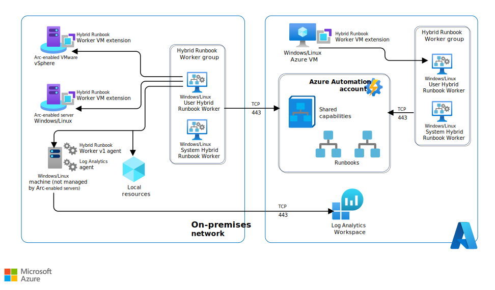
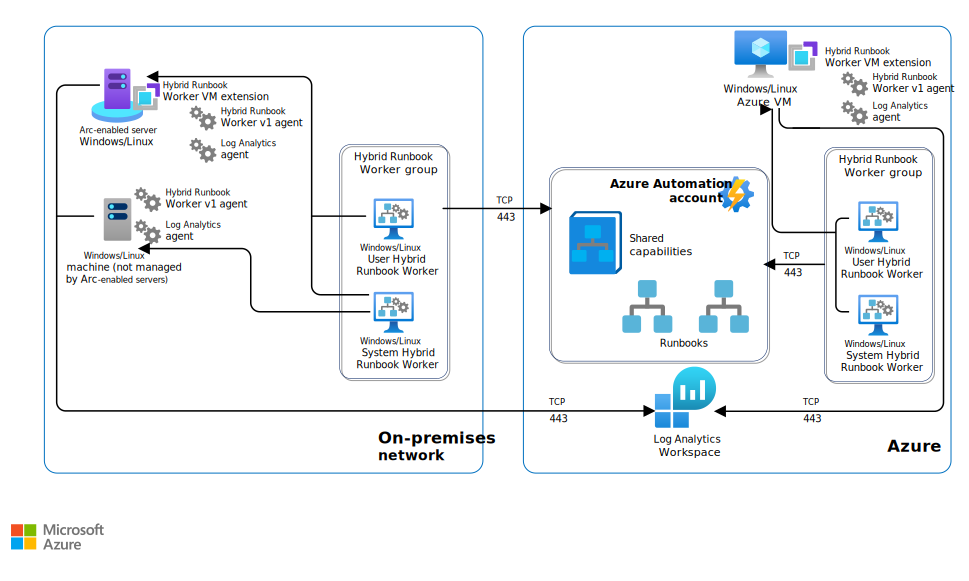

> [!IMPORTANT]
> Azure Automation Agent-based User Hybrid Runbook Worker (Windows and Linux) will retire on **August 31, 2024** and wouldn't be supported after that date. You must complete migrating existing Agent-based User Hybrid Runbook Workers to Extension-based Workers before August 31, 2024. Moreover, starting **October 1, 2023**, creating new Agent-based Hybrid Workers wouldn't be possible. [Learn more][20]

Runbooks in Azure Automation run on the Azure cloud platform and might not have access to resources that are in other clouds or in your on-premises environment.  You can use the Hybrid Runbook Worker feature of Azure Automation to run runbooks directly on the machine that hosts the role and against resources in the environment to manage those local resources. Runbooks are stored and managed in Azure Automation and then delivered to one or more assigned machines.

## Architecture

*Download a [Visio file][architectural-diagram-visio-source] of this architecture.*

### Workflow

The Hybrid Runbook Worker architecture consists of the following:

- **Automation account**: A cloud service that automates configuration and management across your Azure and non-Azure environments.
- **Hybrid Runbook Worker**: A computer that's configured with the Hybrid Runbook Worker feature and can execute runbooks directly on the computer and against the resources in the local environment.
- **Hybrid Runbook Worker group**: Group with multiple Hybrid runbook workers for higher availability and scale to run a set of runbooks.
- **Runbook**: A collection of one or more linked activities that together automate a process or operation. [Learn more][7].
- **On-premises machines and VMs**: Windows or Linux on-premises computers and VMs that are hosted in a private local-area network.
- **Components that are applicable to the extension-based approach (V2)**:
  - **Hybrid Runbook Worker VM extension**: A small application that's installed on a computer. The application configures the computer as a Hybrid Runbook Worker.
  - **Arc-enabled server**: Azure Arc-enabled servers make it possible for you to manage Windows and Linux computers and virtual machines that are hosted outside of Azure, whether on your corporate network or on another cloud provider. This management experience is designed to be consistent with how you manage native Azure virtual machines. [Learn more][8].
- **Components that are applicable to the agent-based approach (V1)**:
  - **Log Analytics workspace**: A Log Analytics workspace is a data repository for log data that's collected from resources that run in Azure, on-premises, or in another cloud provider.
  - **Automation Hybrid Worker solution**: With this solution, you can create Hybrid Runbook Workers to run Azure Automation runbooks on your Azure and non-Azure computers.

#### User Hybrid Runbook Worker

*Download a [Visio file][architectural-diagram-visio-source] of this architecture.*

Each user Hybrid Runbook Worker is a member of a Hybrid Runbook Worker group that you specify when you install the worker. A group can include a single worker, but you can include multiple workers in a group for high availability. Each machine can host one Hybrid Runbook Worker reporting to one Automation account; you can't register the hybrid worker across multiple Automation accounts. A hybrid worker can only listen for jobs from a single Automation account.

#### System Hybrid Runbook Worker

*Download a [Visio file][architectural-diagram-visio-source-system] of this architecture.*

Machines that host the system Hybrid Runbook Worker that's managed by Update Management can be added to a Hybrid Runbook Worker group. But you must use the same Automation account for both Update Management and the Hybrid Runbook Worker group membership.

#### Job execution on Hybrid Runbook Worker

When you start a runbook on a user Hybrid Runbook Worker, you specify the group that it runs on. Each worker in the group polls Azure Automation to see if any jobs are available. If a job is available, the first worker to get the job takes it. The processing time of the jobs queue depends on the hybrid worker hardware profile and load. You can't specify a particular worker. Hybrid worker works on a polling mechanism (every 30 secs) and follows an order of first-come, first-served.

### Components

- [Azure Automation](https://azure.microsoft.com/products/automation) is an Azure service for automating cloud management tasks. The **Hybrid Runbook Worker** feature makes it possible to run runbooks on machines that are located in your datacenter in order to manage local resources.
- [Azure Monitor](https://azure.microsoft.com/products/monitor) gives you full observability into applications, infrastructure, and network. **Azure Monitor Logs** is a feature of Azure Monitor that collects and organizes log and performance data from monitored resources. **Log Analytics** is a tool in the Azure portal for querying logs and for analyzing the results

## Scenario details

### Hybrid Runbook Worker installation approach

Azure Automation provides native integration of the Hybrid Runbook Worker role through the Azure virtual machine extension framework. The Azure VM agent is responsible for managing the extension on Azure VMs, both Windows and Linux, and on non-Azure machines through the Arc-enabled servers connected machine agent. There are two Hybrid Runbook Workers installation platforms that are supported by Azure Automation.

|**Platform** | **Description**
--- | ---
[Extension-based(V2)][1] | Installed by using the Hybrid Runbook Worker VM extension, without any dependency on the reporting activity of the Log Analytics agent that reports to an Azure Monitor Log Analytics workspace. **This is the recommended approach**, as it offers seamless onboarding and is easy to manage.
[Agent-based(V1)][2] | Installed after the Log Analytics agent finishes reporting to an Azure Monitor Log Analytics workspace.

A hybrid worker can co-exist with both platforms: Agent based (V1) and Extension based (V2). If you install Extension based (V2) on a hybrid worker that's already running Agent based (V1), you see two entries of the Hybrid Runbook Worker in the group. One with Platform Extension based (V2) and the other Agent based (V1). [Learn more][3]

### Runbook worker types

There are two types of Runbook workers, System and User.

**System** supports a set of hidden runbooks that are used by the Update Management feature. The runbooks are designed to install user-specified updates on Windows and Linux machines. This type of Hybrid Runbook Worker isn't a member of a Hybrid Runbook Worker group, and therefore doesn't run runbooks that target a Runbook Worker group.

**User** supports user-defined runbooks that are intended to run directly on the Windows and Linux machines that are members of one or more Runbook Worker groups.

The extension-based Hybrid Runbook Worker only supports the user Hybrid Runbook Worker type and doesn't include the system Hybrid Runbook Worker required for the Update Management feature.

Agent-based (V1) Hybrid Runbook Workers rely on the [Log Analytics agent][4] reporting to an Azure Monitor [Log Analytics workspace][5]. The workspace isn't only to collect monitoring data from the machine, but also to download the components that are required to install the agent-based Hybrid Runbook Worker. When Azure Automation [Update Management][6] is enabled, any machine that's connected to your Log Analytics workspace is automatically configured as a system Hybrid Runbook Worker.

### Potential use cases

- To execute Azure Automation runbooks directly on an existing Azure virtual machine (VM) or on-premises Arc-enabled server.
- To overcome the Azure Automation sandbox limitation. The common scenarios include executing long-running operations beyond the three-hour limit for cloud jobs, performing resource-intensive automation operations, interacting with local services that run on-premises or in hybrid environments, running scripts that require elevated permissions, and so on.
- To overcome organizational restrictions on keeping data in Azure for governance and security reasons. Even though you can't execute Automation jobs in the cloud, you can run them on an on-premises machine that's onboarded as a Hybrid Runbook Worker.
- To automate operations on multiple non-Azure resources that run in on-premises, hybrid, or multicloud environments. You can onboard one of those machines as a Hybrid Runbook Worker and target automation on the remaining on-premises machines.
- To access other services privately from the Azure Virtual Network (VNet) without having to open an outbound connection to the internet, you can execute runbooks on a Hybrid Worker connected to the Azure virtual network.

## Considerations

These considerations implement the pillars of the Azure Well-Architected Framework, which is a set of guiding tenets that can be used to improve the quality of a workload. For more information, see [Microsoft Azure Well-Architected Framework](/azure/architecture/framework).

### Reliability

Reliability ensures that your application can meet the commitments that you make to your customers. For more information, see [Overview of the reliability pillar](/azure/architecture/framework/resiliency/overview).

- A Hybrid Runbook Worker Group with more than one machine configured with the Hybrid Worker Role provides high availability because runbooks will start only on servers that are running and healthy.
- The extension-based (V1) Hybrid Runbook Worker only supports the User Hybrid Runbook Worker type and doesn't include the System Hybrid Runbook Worker that's required for the Update Management feature.
- The following applies only to the agent-based approach (V1). Currently, mappings between a Log Analytics Workspace and an Automation account are supported in several regions. For more information, see [Supported regions for linked Log Analytics workspace.][12]

### Security

Security provides assurances against deliberate attacks and the abuse of your valuable data and systems. For more information, see [Overview of the security pillar](/azure/architecture/framework/security/overview).

- **Encryption of sensitive assets in Automation**: An Azure Automation Account can contain sensitive assets such as credentials, certificate, connection, and encrypted variables that might be used by the runbooks. Each secure asset is encrypted by default by using a Data Encryption key that's generated for each Automation Account. These keys are encrypted and stored in Azure Automation with an Account Encryption Key (AEK) that can be stored in the Key vault for customers who want to manage encryption with their own keys. By default, AEK is encrypted by using Microsoft-managed keys. Use the following guidelines to [apply encryption of secure assets in Azure Automation][18].
- **Runbook permission**: By default, runbook permissions for a Hybrid Runbook Worker run in a system context on the machine where they're deployed. A runbook provides its own authentication to local resources. Authentication can be configured by using managed identities for Azure resources or by specifying a Run As account to provide a user context for all runbooks.
- **Network planning**:
  - If you use a proxy server for communication between Azure Automation and the machines that run the Hybrid Runbook Worker, ensure that the appropriate resources are accessible. The timeout for requests from the Hybrid Runbook Worker and Automation services is 30 seconds. After three attempts, the request fails.
  - Hybrid Runbook Worker requires outbound internet access over TCP port 443 to communicate with Automation. If you use a firewall to restrict access to the Internet, you must configure the firewall to permit access. For agent-based (V1) computers with restricted internet access, use Log Analytics gateway to configure communication with Azure Automation and Azure Log Analytics Workspace.
  - There is a CPU quota limit of 5% while configuring extension-based Linux Hybrid Runbook worker. There is no such limit for Windows extension-based Hybrid Runbook Worker.
- **Azure security baseline for Automation**: [The Azure security baseline for Automation][19] contains recommendations on how to improve your security configuration to protect your assets by following the best-practice guidance.

### Cost optimization

Cost optimization is about looking at ways to reduce unnecessary expenses and to improve operational efficiencies. For more information, see [Overview of the cost optimization pillar](/azure/architecture/framework/cost/overview).

- Azure Automation costs are priced for job execution per minute. Every month, the first 500 minutes of process automation are free. Use the [Azure pricing calculator][14] to estimate costs. For more information about the Azure Automation pricing models, see [Automation pricing][15].
- For the agent-based approach (V1), Azure Log Analytics Workspace might generate additional costs that are related to the amount of log data that's stored in Azure Log Analytics. The pricing model is based on consumption. The costs are associated for data ingestion and data retention. For ingesting data into Azure Log Analytics, use Capacity Reservation or the Pay-As-You-Go model that includes 5 gigabytes (GB) free per billing account per month. Data retention for the first 31 days is free of charge. For the pricing models for Log Analytics, see [Azure Monitor pricing][16].

### Operational excellence

Operational excellence covers the operations processes that deploy an application and keep it running in production. For more information, see [Overview of the operational excellence pillar](/azure/architecture/framework/devops/overview).

#### Manageability

- The extension-based approach (V2) offers ease of manageability as compared to agent-based approach (V1) through:
  - Native integration with ARM identity for Hybrid Runbook Worker and provides the flexibility for governance at scale through policies and templates.
  - Centralized control and management of identities and resource credentials, since it uses VM system-assigned identities that are provided by Azure AD.
  - Unified experience for both Azure and non-Azure machines while onboarding and deboarding Hybrid Runbook Workers.
- Applicable only for agent-based approach (V1):
  - To accelerate deployment of the Log Analytics Agent with Hybrid Worker Role running on Windows machine, use the PowerShell script [New-OnPremiseHybridWorker.ps1][17]
  - Deployment of many agents in on-premises infrastructure can be orchestrated by using command line scripts and deployed by using Group Policy or System Center Configuration Manager.

#### DevOps

- Azure Automation allows integration with popular source control systems, Azure DevOps and GitHub. With source control, you can integrate the existing development environment that contains your scripts and custom code that have been previously tested in an isolated environment.
- For information on how to integrate Azure Automation with your source control environment, see [Use source control integration][13].

## Contributors

*This article is maintained by Microsoft. It was originally written by the following contributors.*

Principal author:

- [Mike Martin](https://www.linkedin.com/in/techmike2kx) | Senior Cloud Solution Architect

*To see non-public LinkedIn profiles, sign in to LinkedIn.*

## Next steps

More about Azure Automation:

- [Hybrid Runbook Worker overview](/azure/automation/automation-hybrid-runbook-worker)
- [Deploy extension-based Windows or Linux User Hybrid Runbook Worker](/azure/automation/extension-based-hybrid-runbook-worker-install)
- [Deploy an agent-based Windows Hybrid Runbook Worker in Automation](/azure/automation/automation-windows-hrw-install)
- [Deploy an agent-based Linux Hybrid Runbook Worker in Automation](/azure/automation/automation-linux-hrw-install)
- [Create an Azure Automation account](/azure/automation/quickstarts/create-azure-automation-account-portal)
- [Create a runbook in Azure Automation using Managed Identities](/azure/automation/learn/powershell-runbook-managed-identity)
- [Run Automation runbooks on a Hybrid Runbook Worker](/azure/automation/automation-hrw-run-runbooks)
- [Pre-requisites: Azure Automation network configuration details](/azure/automation/automation-network-configuration)
- [Azure Arc Overview](/azure/azure-arc/overview)
- [What is Azure Arc enabled servers?](/azure/azure-arc/servers/overview)

More about Azure Monitor and Monitor Logs:

- [Azure Monitor Logs overview](/azure/azure-monitor/logs/data-platform-logs)
- [Overview of Log Analytics in Azure Monitor](/azure/azure-monitor/logs/log-analytics-overview)

## Related resources

- [Hybrid architecture design](/azure/architecture/hybrid/hybrid-start-here)
- [Connect an on-premises network to Azure](/azure/architecture/reference-architectures/hybrid-networking)
- [Enterprise monitoring with Azure Monitor](/azure/architecture/example-scenario/monitoring/enterprise-monitoring)
- [Computer forensics chain of custody in Azure](/azure/architecture/example-scenario/forensics)
- [Disaster Recovery for Azure Stack Hub virtual machines](/azure/architecture/hybrid/azure-stack-vm-disaster-recovery)

[architectural-diagram-visio-source]: https://arch-center.azureedge.net/azure-automation-hybrid.vsdx
[architectural-diagram-visio-source-system]: https://arch-center.azureedge.net/azure-automation-system.vsdx
[1]: /azure/automation/extension-based-hybrid-runbook-worker-install?tabs=windows
[2]: /azure/automation/automation-windows-hrw-install
[3]: /azure/automation/extension-based-hybrid-runbook-worker-install?tabs=windows#install-extension-based-v2-on-existing-agent-based-v1-hybrid-worker
[4]: /azure/azure-monitor/agents/log-analytics-agent
[5]: /azure/azure-monitor/logs/design-logs-deployment
[6]: /azure/automation/update-management/overview
[7]: /azure/automation/automation-runbook-types
[8]: /azure/azure-arc/servers/overview
[12]: /azure/automation/how-to/region-mappings
[13]: /azure/automation/source-control-integration
[14]: https://azure.microsoft.com/pricing/calculator
[15]: https://azure.microsoft.com/pricing/details/automation
[16]: https://azure.microsoft.com/pricing/details/monitor
[17]: https://www.powershellgallery.com/packages/New-OnPremiseHybridWorker/1.7
[18]: /azure/automation/automation-secure-asset-encryption
[19]: /security/benchmark/azure/baselines/automation-security-baseline#network-security
[20]: /azure/automation/migrate-existing-agent-based-hybrid-worker-to-extension-based-workers
