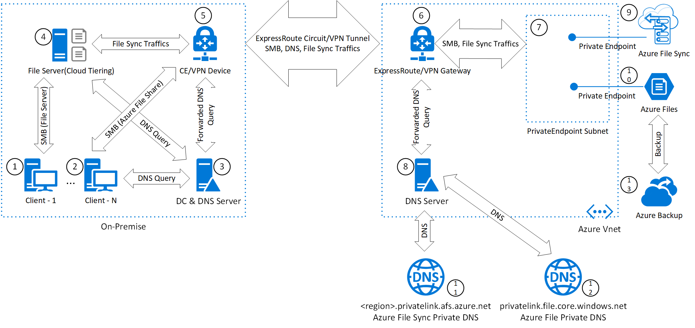

This reference architecture illustrates an enterprise-level cloud file sharing solution that uses Azure services including [Azure Files](https://azure.microsoft.com/services/storage/files/), [Azure File Sync](https://azure.microsoft.com/updates/azure-file-sync), [Azure Private DNS](/azure/dns/private-dns-overview), and [Azure Private Endpoint](/azure/private-link/private-endpoint-overview). The solution generates cost savings by outsourcing the management of file servers and infrastructure while retaining control of the data.

## Architecture

The following diagram shows how clients can access Azure file shares:

- Locally through a cloud tiering file server.
- Remotely over [ExpressRoute](https://azure.microsoft.com/services/expressroute/) private peering or VPN tunnels in a private network environment.

*Download a [Visio file](https://arch-center.azureedge.net/azure-files-private.vsdx) of this architecture.*

### Workflow

The enterprise-level cloud file sharing solution uses the following methods to provide the same user experience as traditional file sharing but with Azure file shares:

- Makes use of Azure File Sync to synchronize file and folder Access Control Lists (ACL) between on-premises file servers and Azure file shares.
- Uses the cloud tiering feature from the Azure File Sync agent to cache frequently accessed files locally.
- Enforces AD DS authentication over Azure file shares.
- Accesses file share and file sync services via private IP through Private Link and Private Endpoint over an ExpressRoute private peering or VPN tunnel.

By implementing Azure Private Endpoint on Azure Files and Azure File Sync, public endpoint access is disabled so that access to Azure Files and Azure File Sync is restricted from the Azure virtual network.

The ExpressRoute private peering VPN site-to-site tunnel extends the on-premises network to the Azure virtual network. Azure File Sync and Server Message Block (SMB) traffic from on-premises to Azure Files and Azure File Sync private endpoints is restricted to private connection only. During transition, Azure Files will only allow the connection if it's made with SMB 3.0+. Connections made from the Azure File Sync agent to an Azure File share or Storage Sync Service are always encrypted. At rest, Azure Storage automatically encrypts your data when it's persisted to the cloud, as does Azure Files.

A Domain Name System (DNS) resolver is a critical component of the solution. Each Azure service, in this case Azure Files and Azure File Sync, have a fully qualified domain name (FQDN). The FQDNs of those services are resolved to their public IP addresses in these cases:

- When a client accesses an Azure Files share.
- When an Azure File Sync agent, deployed on an on-premises file server, accesses the Azure File Sync service.

After enabling a private endpoint, private IP addresses are allocated in the Azure virtual network. These addresses allow access to those services over a private connection, and the same FQDNs must now resolve to private IP addresses. To achieve that, Azure Files and Azure File Sync create a canonical name DNS record (CNAME) to redirect the resolution to a private domain name:

- The Azure File Sync's public domain name `*.afs.azure.net` gets a CNAME redirect to the private domain name `*.<region>.privatelink.afs.azure.net`.
- The Azure Files public domain name `<name>.file.core.windows.net` gets a CNAME redirect to the private domain name `<name>.privatelink.file.core.windows.net`.

The solution shown in this architecture correctly configures on-premises DNS settings so that they resolve private domain names to private IP addresses, by using the following methods:

- Private DNS zones (components **11** and **12**) are created from Azure to provide private name resolution for Azure File Sync and Azure Files.
- Private DNS zones are linked to the Azure virtual network so that a DNS server deployed in the virtual network or Azure private DNS resolver(component **8**)  can resolve private domain names.
- DNS A records are created for Azure Files and Azure File Sync in private DNS zones. For the endpoint configuration steps, see [Configuring Azure Files network endpoints](/azure/storage/files/storage-files-networking-endpoints) and [Configuring Azure File Sync network endpoints](/azure/storage/files/storage-sync-files-networking-endpoints).
- The on-premises DNS server (component **3**) sets up conditional forwarding to forward the DNS query of `domain afs.azure.net` and `file.core.windows.net` to the DNS server in the Azure virtual network (component **8**).
- After receiving the forwarded DNS query from the on-premises DNS server, the DNS server (component **8**) in the Azure virtual network uses the Azure DNS recursive resolver to resolve private domain names and return private IP addresses to the client.

### Components

The solution depicted in the architecture diagram uses the following components:

- **Client** (component **1** or **2**) - Typically, the client is a Windows, Linux, or Mac OSX desktop that can *talk* to a file server or Azure Files through the SMB protocol.

- **DC and DNS servers** (component **3**) - A domain controller (DC) is a server that responds to authentication requests and verifies users on computer networks. A DNS server provides computer name-to-IP address-mapping name resolution services to computers and users. DC and DNS servers can be combined into a single server or can be separated into different servers.

- **File server** (component **4**) - A server that hosts file shares and provides file share services through the SMB protocol.

- **CE/VPN Device** (component **5**) - A customer edge router (CE) or VPN device is used to establish ExpressRoute or VPN connection to the Azure virtual network.

- **Azure ExpressRoute or Azure VPN Gateway** (component **6**) – [Azure ExpressRoute](https://azure.microsoft.com/services/expressroute) is a service that lets you extend your on-premises network into the Microsoft cloud over a private connection facilitated by a connectivity provider. [Azure VPN Gateway](https://azure.microsoft.com/services/vpn-gateway) is a specific type of virtual network gateway that is used to send encrypted traffic between an Azure virtual network and an on-premises location over the public internet. ExpressRoute or VPN Gateway establishes ExpressRoute or VPN connection to your on-premises network.

- **Azure private endpoint** (component **7**) - A network interface that connects you privately and securely to a service powered by [Azure Private Link](https://azure.microsoft.com/services/private-link). In this solution, an [Azure File Sync](/azure/storage/file-sync/file-sync-introduction) private endpoint connects to Azure File Sync (**9**), and an [Azure Files](https://azure.microsoft.com/services/storage/files) private endpoint connects to Azure Files (**10**).

- **DNS server/Azure private DNS resolver** (component **8**) in the [Azure Virtual Network](https://azure.microsoft.com/services/virtual-network) instance uses the [Azure DNS](https://azure.microsoft.com/services/dns) recursive resolver to resolve the private domain name and return a private IP address to the client, after receiving a forwarded DNS query from an on-premises DNS server.

- **Azure File Sync and cloud tiering** (component **9**) – Azure File Sync is a feature of [Azure Storage](https://azure.microsoft.com/products/category/storage) to centralize your organization's file shares in Azure, while keeping the flexibility, performance, and compatibility of an on-premises file server. Cloud tiering is an optional feature of Azure File Sync in which frequently accessed files are cached locally on the server while all other files are tiered to Azure Files based on policy settings.

- **Azure Files** (component **10**) - A fully managed service that offers file shares in the cloud that are accessible via the industry standard Server Message Block (SMB) protocol. [Azure Files](https://azure.microsoft.com/services/storage/files) implements the SMB v3 protocol and supports authentication through on-premises Active Directory Domain Services (AD DS) and [Azure Active Directory Domain Services](https://azure.microsoft.com/services/active-directory-ds) (Azure AD DS). File shares from Azure Files can be mounted concurrently by cloud or on-premises deployments of Windows, Linux, and macOS. Additionally, Azure file shares can be cached nearer to where the data is being used, on Windows Servers with Azure File Sync for fast access.

- **Azure Private DNS** (components **11** and **12**) - A DNS service offered by Azure, Private DNS manages and resolves domain names in a virtual network, without the need to add a custom DNS solution.

- **Azure Backup** (component **13**) - [Azure Backup](https://azure.microsoft.com/products/backup) is an Azure file share backup service that uses file share snapshots to provide a cloud-based backup solution. For considerations, see [Data loss and backup](#data-loss-and-backup).

## Scenario details

This solution allows you to access Azure file shares in a hybrid work environment over a virtual private network between on-premises and Azure virtual networks without traversing the internet. It also allows you to control and limit file access through Azure Active Directory Domain Services (AD DS) authentication.

### Potential use cases

The cloud file sharing solution supports the following potential use cases:

- File server or file share lift and shift. By lifting and shifting, you eliminate the need to restructure or reformat data. You also keep legacy applications on-premises while benefiting from cloud storage.
- Accelerate cloud innovation with increased operational efficiency. Reduces the cost to maintain hardware and physical space, protects against data corruption and data loss.
- Private access to Azure File shares. Protects against data exfiltration.

### Traffic flows

After enabling Azure File Sync and Azure Files, Azure file shares can be accessed in two modes, *local cache mode* or *remote mode*. In both modes, the client uses existing AD DS credentials to authenticate itself.

- Local cache mode - The client accesses files and file shares through a local file server with cloud tiering enabled. When a user opens a file from the local file server, file data is either served from the file server local cache, or the Azure File Sync agent seamlessly recalls the file data from Azure Files. In the architecture diagram for this solution, it happens between component **1** and **4**.

- Remote mode - The client accesses files and file shares directly from a remote Azure file share. In the architecture diagram for this solution, the traffic flow travels through components **2**, **5**, **6**, **7** and **10**.

Azure File Sync traffic travels between components **4**, **5**, **6**, and **7**, using an [ExpressRoute circuit](/azure/expressroute/expressroute-circuit-peerings) for a reliable connection.

Private domain name resolution queries go through components **3**, **5**, **6**, **8**, **11** and **12** using the following sequence:

1. The client sends a query to an on-premises DNS server to resolve an Azure Files or Azure File Sync DNS name.
2. The on-premises DNS server has a conditional forwarder that points Azure File and Azure File Sync DNS name resolution to a DNS server in the Azure virtual network.
3. The query is redirected to a DNS Server or Azure private DNS resolver in the Azure virtual network.
4. Depending on the virtual network's DNS configuration:
   - If a custom DNS server is configured, the DNS Server in the Azure virtual network sends a name query to the Azure provided DNS (168.63.129.16) recursive resolver.
   - If the Azure private DNS resolver is configured, and the query matches the private DNS zones that are linked to the virtual network, those zones are consulted.
5. The DNS server/Azure private DNS resolver returns a private IP, after resolving the private domain name to the respective private DNS zone. It uses the Azure virtual network's links to the Azure Files DNS zone and the Azure File Sync private DNS zone.

## Considerations

These considerations implement the pillars of the Azure Well-Architected Framework, which is a set of guiding tenets that can be used to improve the quality of a workload. For more information, see [Microsoft Azure Well-Architected Framework](/azure/architecture/framework).

Consider the following points when implementing this solution.

### Planning

- For Azure File Sync planning, refer to [Planning for an Azure File Sync deployment](/azure/storage/files/storage-sync-files-planning).
- For Azure Files planning, refer to [Planning for an Azure Files deployment](/azure/storage/files/storage-files-planning).

### Networking

- For Azure File Sync network considerations, refer to [Azure File Sync networking considerations](/azure/storage/files/storage-sync-files-networking-overview).
- For Azure Files networking considerations, refer to [Azure Files networking considerations](/azure/storage/files/storage-files-networking-overview).

### DNS

When managing name resolution for Private Endpoints, the private domain names of Azure Files and Azure File Sync are resolved in the following way:

From the Azure side:

- If Azure-provided name resolution is used, the Azure virtual network must link to provisioned private DNS zones.
- If "bring your own DNS server" is used, the virtual network where your own DNS server is deployed must link to provisioned private DNS zones.

From the on-premises side, the private domain name is mapped to a private IP address in one of the following ways:

- Through DNS forwarding to a DNS server deployed in the Azure virtual network or Azure private DNS resolver, as the diagram shows.
- Through the on-premises DNS server that sets up zones for the private domain `<region>.privatelink.afs.azure.net` and `privatelink.file.core.windows.net`. The server registers the IP addresses of Azure Files and Azure File Sync private endpoints as DNS A records into their respective DNS zones. The on-premises client resolves the private domain name directly from the local on-premises DNS server.

### Distributed File System (DFS)

When it comes to an on-premises file sharing solution, many administrators choose to use a DFS rather than a traditional standalone file server. DFS allows administrators to consolidate file shares that may exist on multiple servers so that they appear as though they all live in the same location, allowing users to access them from a single point on the network. While moving to a cloud file share solution, traditional DFS-R deployment can be replaced by Azure File Sync deployment. For more information, see [Migrate a DFS Replication (DFS-R) deployment to Azure File Sync](/azure/storage/files/storage-sync-files-deployment-guide?tabs=azure-portal%2Cproactive-portal#migrate-a-dfs-replication-dfs-r-deployment-to-azure-file-sync).

### Data loss and backup

Data loss is a serious problem for businesses of all sizes. Azure file share backup uses file share snapshots to provide a cloud-based backup solution that protects your data in the cloud and eliminates additional maintenance overhead involved in on-premises backup solutions. The key benefits of Azure file share backup include:

- Zero infrastructure
- Customized retention
- Built-in management capabilities
- Instant restores
- Alerting and reporting
- Protection against accidental deletion of file shares

For more information, see [About Azure file share backup](/azure/backup/azure-file-share-backup-overview)

### Support for hybrid identities on Azure Files

Although this article describes Active Directory for authenticating on Azure Files, it's possible to use Azure Active Directory for authenticating hybrid user identities. Azure Files supports identity-based authentication over Server Message Block (SMB), by using the Kerberos authentication protocol through the following three methods:

- On-premises Active Directory Domain Services (AD DS)
- Azure Active Directory Domain Services (Azure AD DS)
- Azure Active Directory Kerberos (Azure AD) for hybrid user identities only

For more information, see [Enable Azure Active Directory Kerberos authentication for hybrid identities on Azure Files (preview)](/azure/storage/files/storage-files-identity-auth-azure-active-directory-enable).

### Security

Security provides assurances against deliberate attacks and the abuse of your valuable data and systems. For more information, see [Overview of the security pillar](/azure/architecture/framework/security/overview).

[Azure DDoS Protection Standard](/azure/ddos-protection/ddos-protection-overview), combined with application-design best practices, provides enhanced DDoS mitigation features to provide more defense against DDoS attacks. You should enable [Azure DDOS Protection Standard](/azure/ddos-protection/ddos-protection-overview) on any perimeter virtual network.

Security auditing is a necessary requirement for helping to maintain the security of an enterprise. Industry standards require enterprises to follow a strict set of rules related to data security and privacy.

#### File access auditing

File access auditing can be enabled locally and remotely:

- Locally, by using Dynamic Access Control. For more information, see [Plan for File Access Auditing](/windows-server/identity/solution-guides/plan-for-file-access-auditing).
- Remotely, by using Azure Storage logs in Azure Monitor on Azure Files. Azure Storage logs contains StorageRead, StorageWrite, StorageDelete, and Transaction logs. Azure file access can be logged to a storage account, log analytics workspace, or streamed to an event hub separately. For more information, see [Monitoring Azure Storage](/azure/storage/common/monitor-storage).

## Contributors

*This article is maintained by Microsoft. It was originally written by the following contributors.* 

Principal author:
- [Yingting Huang](https://www.linkedin.com/in/yingting-huang-9622bb20) | Senior Cloud Solution Architect

*To see non-public LinkedIn profiles, sign in to LinkedIn.*

## Next steps

- [Planning for an Azure Files deployment](/azure/storage/files/storage-files-planning)
- [How to deploy Azure Files](/azure/storage/files/storage-files-deployment-guide)
- [Azure Files networking considerations](/azure/storage/files/storage-files-networking-overview)
- [Configuring Azure Files network endpoints](/azure/storage/files/storage-files-networking-endpoints)
- [Monitoring Azure Storage](/azure/storage/common/monitor-storage)
- [Plan for File Access Auditing](/windows-server/identity/solution-guides/plan-for-file-access-auditing)
- [Back up Azure file shares](/azure/backup/backup-afs)
- [Overview - on-premises Active Directory Domain Services authentication over SMB for Azure file shares](/azure/storage/files/storage-files-identity-auth-active-directory-enable)
- [Deploy Azure File Sync](/azure/storage/files/storage-sync-files-deployment-guide)
- [Configuring Azure File Sync network endpoints](/azure/storage/files/storage-sync-files-networking-endpoints)
- [Cloud Tiering Overview](/azure/storage/files/storage-sync-cloud-tiering)
- [Create a Site-to-Site connection in the Azure portal](/azure/vpn-gateway/vpn-gateway-howto-site-to-site-resource-manager-portal)
- [ExpressRoute circuits and peering](/azure/expressroute/expressroute-circuit-peerings)
- [Create and modify peering for an ExpressRoute circuit](/azure/expressroute/expressroute-howto-routing-portal-resource-manager)
- [About Azure file share backup](/azure/backup/azure-file-share-backup-overview)
- [What is Azure DNS Private Resolver](/azure/dns/dns-private-resolver-overview)
- [Enable Azure Active Directory Kerberos authentication for hybrid identities on Azure Files (preview)](/azure/storage/files/storage-files-identity-auth-azure-active-directory-enable)

## Related resources

- [Azure enterprise cloud file share](/azure/architecture/hybrid/azure-files-private)
- [Azure files accessed on-premises and secured by AD DS](/azure/architecture/example-scenario/hybrid/azure-files-on-premises-authentication)
- [Hybrid file services](/azure/architecture/hybrid/hybrid-file-services)
- [Use Azure file shares in a hybrid environment](/azure/architecture/example-scenario/hybrid/hybrid-file-share-dr-remote-local-branch-workers)
- [Hybrid file share with disaster recovery for remote and local branch workers](/azure/architecture/example-scenario/hybrid/hybrid-file-share-dr-remote-local-branch-workers)
- [Data management in banking](/azure/architecture/industries/finance/data-management-banking-overview)
