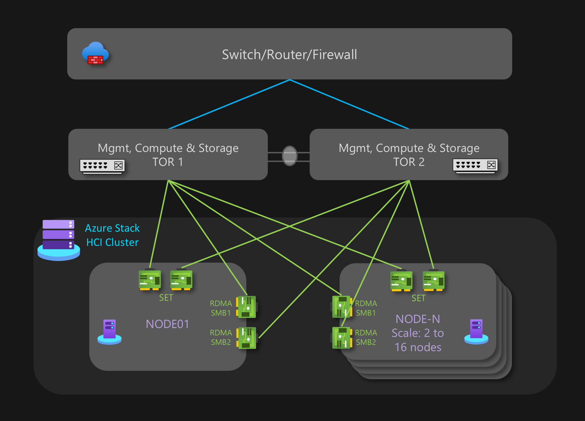
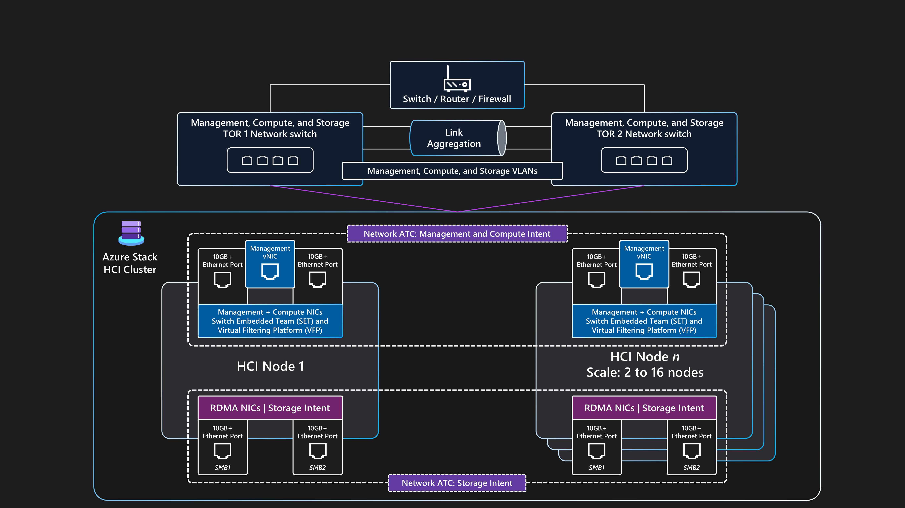

This baseline reference architecture provides workload agnostic guidance and recommendations for configuring Azure Stack HCI 23H2 (_and later_) infrastructure to provide a reliable platform to deploy and manage highly available virtualized and containerized workloads. It covers the resource components and cluster design choices for the physical nodes that provide the local compute, storage and networking features, as well as information for how to use Azure services to simplify and streamline the day-to-day management of Azure Stack HCI.

For additional information on workload architectures patterns that are optimized to run on Azure Stack HCI, please review the content located under the "_Azure Stack HCI workloads_" navigation menu.

This architecture serves as a starting point for deploying a multi-node Azure Stack HCI cluster using the storage switched network design. The workload applications deployed on an Azure Stack HCI cluster should also be well-architected, such as deploying multiple instances (_high availability_) of any critical workload services, and with appropriate business continuity and disaster recovery (_BC/DR_) controls in place, for example regular backups and DR failover capabilities. These _workload_ design aspects have been intentionally excluded from this article, to maintain the focus on the HCI infrastructure (_platform_). For additional information review the [Azure Stack HCI Well-Architected Framework Service Guide](/azure/well-architected/service-guides/azure-stack-hci) which provides guidelines and recommendations for the five pillars of the well-architected framework.

## Article layout

| Architecture | Design decisions | Well-Architected Framework approach|
|---|---|---|
|&#9642; [Architecture diagram](#architecture)  &#9642; [Potential use cases](#potential-use-cases)  &#9642; [Scenario details and benefits](#scenario-details-and-benefits)  &#9642; [Platform resources](#platform-resources)  &#9642; [Platform supporting resources](#platform-supporting-resources)  &#9642; [Deploy this scenario](#deploy-this-scenario)  |&#9642; [Cluster design choices](#cluster-design-choices)  &#9642; [Physical disk drives](#physical-disk-drives)   &#9642; [Networking](#network-design)   &#9642; [Monitoring](#monitoring)   &#9642; [Update management](#update-management)|&#9642; [Reliability](#reliability)   &#9642; [Security](#security)   &#9642; [Cost Optimization](#cost-optimization)   &#9642; [Operational Excellence](#operational-excellence)   &#9642; [Performance Efficiency](#performance-efficiency)|

> [!TIP]
>  This [reference implementation](https://github.com/Azure/azure-quickstart-templates/tree/master/quickstarts/microsoft.azurestackhci/create-cluster-2-node-switched-custom-storageip) demonstrates how to deploy a "Switched Multi Server Deployment" of Azure Stack HCI using an ARM template and parameter file. Alternatively, [this example demonstrates how to use a Bicep template](https://github.com/Azure/azure-quickstart-templates/blob/master/quickstarts/microsoft.azurestackhci/create-cluster-with-prereqs/) to deploy an Azure Stack HCI cluster, including it's prerequisites resources.

## Architecture

_Download a [Visio file][architectural-diagram-visio-source] of this architecture._

For information about these resources, see Azure product documentation listed in [Related resources](#related-resources).

## Potential use cases

Typical use cases for using Azure Stack HCI include the ability to run highly available (HA) workloads in an on-premises or edge location to provide a solution to address requirements such as:

- Provide a hybrid-cloud solution deployed on-premises to address data sovereignty, regulation & compliance or latency requirements.
- Deploy and manage highly available (HA) virtualized or container-based edge workloads deployed in a single or multiple locations, to enable business-critical applications and services to operate in a resilient, cost-effective and scalable manner.
- Lower the total cost of ownership (TCO) through use of Microsoft-certified solutions, cloud-based deployment, centralized management, monitoring and alerting.
- Provide a centralized provisioning capability to deploy workloads across multiple locations consistently and securely using Azure and Azure Arc, such as using Azure portal, command-line-interface (CLI) or infrastructure as code (IaC) templates to drive automation and repeatability using Kubernetes for containerization and/or traditional workload virtualization.
- Requirement to adhere to strict security, compliance and audit requirements. Azure Stack HCI is deployed with a hardened security posture configured "by default" (_secure-by-default_), using technologies such as certified hardware, secure boot, trusted platform module (TPM), virtualization-based security, credential guard and application control policies (WDAC) enforced, and the ability to integrate with modern cloud-based security & threat management services, such as Microsoft Defender for Cloud and Azure Sentinel.

### Scenario details and benefits

The following sections provide additional details on the scenarios and potential use cases for this reference architecture, including a list of business benefits and example workload resource types that can be deployed on Azure Stack HCI.

#### Azure Stack HCI directly integrates with Azure using Azure Arc, lowering the total cost of ownership (TCO) and operational overheads

Azure Stack HCI is deployed and managed using Azure, this provides built-in integration of Azure Arc through deployment of the [Azure Arc resource bridge](/azure/azure-arc/resource-bridge/overview) component which is installed during the HCI cluster deployment process. Azure Stack HCI cluster nodes are enrolled with [Azure Arc for Servers](/azure-stack/hci/deploy/deployment-arc-register-server-permissions) as a prerequisite to initiating the cloud based deployment of the cluster. During deployment the mandatory extensions are installed on each cluster node, such as “Lifecycle Manager (_LCM_)”, “Edge Device Management” and “Telemetry and Diagnostics”. Once deployed, an HCI cluster can be monitored using Azure Monitor and Log Analytics, by enabling Azure Stack HCI Insights. [Feature updates for Azure Stack HCI are released periodically to enhance customer experience](/azure-stack/hci/release-information-23h2), these updates are controlled and managed using [Azure Update Management][azure-update-management].

Workload resources, such as [Azure Arc VMs](/azure-stack/hci/manage/create-arc-virtual-machines), [Arc-enabled AKS][arc-enabled-aks] and [Azure Virtual Desktop (AVD) session hosts](/azure/virtual-desktop/deploy-azure-virtual-desktop) can be deployed using Azure portal, by selecting an [Azure Stack HCI cluster's "custom location"](/azure-stack/hci/manage/azure-arc-vm-management-overview#components-of-azure-arc-vm-management) as the target for the workload deployment, these components provide centralized administration, management, and support. For customers that have existing Windows Server Datacenter Core Licenses with active Software Assurance (SA), it is possible to further reduce costs by applying Azure Hybrid Benefit to Azure Stack HCI, and Windows Server VMs and AKS clusters to optimize the costs for these services.

Azure and Azure Arc integration extends the capabilities of Azure Stack HCI virtualized and containerized workloads, such as using the following capabilities:

- [Azure Arc VMs][arc-enabled-vms] for traditional applications or services that run in virtual machines (VM) on Azure Stack HCI.
- [Azure Kubernetes Service (AKS) on HCI][arc-enabled-aks] for containerized applications or services that will benefit from using Kubernetes as their orchestration platform.
- [Azure Virtual Desktop (AVD)][azs-hci-avd]. Deploy your session hosts for AVD workloads on Azure Stack HCI (_on-premises_), using the control and management plane in Azure to initiate the host pool creation and configuration.
- [Azure Arc-enabled Data Services][arc-enabled-data-services] for containerized Azure SQL Managed Instance or PostgreSQL server that use Arc-enabled AKS hosted on Azure Stack HCI.
- [Azure Arc-enabled Event Grid extension for Kubernetes](/azure/event-grid/kubernetes/install-k8s-extension) can be used to deploy the [Event Grid broker and an Event Grid operator](/azure/event-grid/kubernetes/concepts#event-grid-on-kubernetes-components) components, enabling capabilities such as Event Grid topics and subscriptions for event processing.
- [Azure Arc-enabled Machine Learning](/azure/machine-learning/how-to-attach-kubernetes-anywhere) using an Azure Kubernetes Service (AKS) cluster deployed on Azure Stack HCI, as the compute target to run Azure Machine Learning, providing capabilities to train or deploy ML models at the edge.

Through Azure Arc connected workloads, the ability to use Azure Policy can provide additional Azure consistency and automation for workloads deployed on Azure Stack HCI, such as [automating Guest OS configuration using Azure Arc VM extensions][arc-vm-extensions] or evaluating [compliance against industry regulations or corporate standards using Azure Policy][arc-azure-policy], which can be enabled using Azure portal or IaC automation.

#### Azure Stack HCI default security configuration provides defense in depth approach, simplifying security and compliance costs

The deployment and management of IT services for retail, manufacturing and remote office scenarios present unique challenges for security and compliance. With no&mdash;or at best limited&mdash;local IT support and lack of dedicated datacenters, it is particularly important to protect workloads from both internal and external threats. Azure Stack HCI's default security hardening and deep integration with Azure services can help address these challenges.

Azure Stack HCI&ndash;certified hardware ensures built-in Secure Boot, Unified Extensible Firmware Interface (UEFI), and Trusted Platform Module (TPM) support. These technologies, combined with [virtualization-based security (VBS)][azs-hci-vbs], help protect security-sensitive workloads. BitLocker Drive Encryption allows you to encrypt Boot disk volume and Storage Spaces Direct volumes at rest while SMB encryption provides automatic encryption of traffic between servers in the cluster (_on the storage network_) and signing of SMB traffic between the cluster nodes and other systems to help prevent relay attacks, facilitating compliance with regulatory standards.

In addition, you can onboard Azure Stack HCI VMs in [Microsoft Defender for Cloud][ms-defender-for-cloud] to activate cloud-based behavioral analytics, threat detection and remediation, alerting, and reporting. Similarly, by managing Azure Stack HCI VMs in Azure Arc, you gain the ability to use [Azure Policy][arc-azure-policy] to evaluate their compliance with industry regulations and corporate standards.

## Architecture components

This architecture consists of physical server hardware that is used to deploy Azure Stack HCI clusters in on-premises or edge locations. Azure Stack HCI integrates with Azure Arc and several other Azure services that provide supporting resources that enhance platform capabilities. Azure Stack HCI provides a resilient platform to deploy, manage and operate end user applications or business systems (_workloads_). These platform resources and services are described in the following sections.

### Platform resources

The architecture requires the following mandatory resources and components:

- **[Azure Stack HCI][azs-hci]** is a hyper-converged infrastructure (HCI) solution that is deployed on-premises or in edge locations using physical server hardware and networking infrastructure. Azure Stack HCI provides a platform to deploy and manage virtualized workloads, such as virtual machines, Kubernetes clusters and other services enabled through Azure Arc. Azure Stack HCI clusters can scale from a single-node deployment to a maximum of sixteen nodes using validated, integrated, or premium hardware SKUs provided by OEM partners.
- **[Azure Arc][azure-arc]** is a cloud-based service that extends the Azure Resource Manager-based management model to Azure Stack HCI and other non-Azure locations. Azure Arc provides the ability to manage resources including virtual machines (VMs), Kubernetes clusters, and containerized data and machine learning services using Azure as the control and management plane.
- **[Azure Key Vault][key-vault]** is a cloud service for securely storing and accessing secrets. A secret is anything that you want to tightly control access to, such as API keys, passwords, certificates, or cryptographic keys, local admin credentials, and BitLocker recovery keys.
- **Azure Storage used to provide a [Cloud Witness][cloud-witness]**, which is a type of failover cluster quorum used by Azure Stack HCI cluster nodes for quorum voting capabilities, which enables high availability of the cluster. The storage account and witness configuration are created during the Azure Stack HCI cloud deployment process.
- **[Azure Update Management][azure-update-management]** is a unified service to help manage and govern updates for Azure Stack HCI. You can also manage workloads deployed on HCI, such as Windows and Linux VMs Guest OS update compliance, unifying patch management operations across Azure, on-premises, or other cloud platforms using a single dashboard.

### Platform supporting resources

The architecture can incorporate the following optional supporting services that can be used to enhance the platform capabilities:

- **[Azure Monitor][azure-monitor]** is a cloud-based service for collecting, analyzing, and acting on diagnostic logs and telemetry from your cloud and on-premises workloads. By using Azure Monitor, you can maximize the availability and performance of your applications and services through a comprehensive monitoring solution. Deploying Azure Stack HCI Insights simplifies the creation of the Azure Monitor data collection rule (DCR) to quickly enable monitoring of Azure Stack HCI clusters.
- **[Azure Policy][azure-policy]** evaluates Azure and on-premises resources through integration with Azure Arc by the properties of those resources to business rules (_called Policy Definitions_) to determine compliance, or capabilities that can be used to apply VM Guest Configuration using policy settings.
- **[Microsoft Defender for Cloud][ms-defender-for-cloud]** is a unified infrastructure security management system that strengthens the security posture of your datacenters and provides advanced threat protection across your hybrid workloads in the cloud - whether they're in Azure or not - and on premises.
- **[Azure Backup][azure-backup]** service provides simple, secure, and cost-effective solutions to back up your data, including virtual machines, and recover it from the Microsoft Azure cloud. Azure Backup Server (MABS) is used to take backup of virtual machines deployed on Azure Stack HCI to Azure Backup service.
- **[Azure Site Recovery][azure-site-recovery]** provides business continuity and disaster recovery (BC/DR) capabilities, by enabling business apps and workloads to fail over in the event of a disaster or outage. Site Recovery manages replication and failover of workloads running on both physical and virtual machines, between their primary site (_on-premises_) and a secondary location (_Azure_).

## Cluster design choices

When designing an Azure Stack HCI cluster it is important to understand the workload performance and resiliency requirements, such as the recovery time objective (_RTO_) and recovery point objective (_RPO_) times and compute (CPU), memory and storage requirements for all workload that will be deployed on the Azure Stack HCI cluster. Several characteristics of the workload influence the decision-making process, including:

- Processor (_CPU_) architecture capabilities, such as the Ghz frequency (_speed_), and number of cores per socket.
- Graphics processing unit (_GPU_) requirements of the workload, such as for AI/ML, inferencing or graphics rendering.
- Memory per node, the quantity of physical memory required to run the workload.
- Number of physical nodes in the cluster, one to sixteen nodes in scale. Note: Three nodes is the maximum if using the ["Storage Switchless" network architecture](/azure/architecture/hybrid/azure-stack-hci-switchless).
  - Resiliency for Compute: Requires a minimum reservation of "_N+1 nodes worth of capacity_" in the cluster, which ensures it is always possible to drain a node to perform updates or for the workload to restart in the event of an unplanned outage of a single node, such as power or hardware failure.
  - For business-critical or mission-critical workloads, consider reserving "_N+2 nodes worth of capacity_" to provide increased resiliency. For example, if two nodes in the cluster are offline, the workload can remain online. This approach provides resiliency for a scenario such as, if a node running workload goes offline during a planned update procedure (_resulting in two nodes being offline simultaneously_).
- Storage resiliency, capacity, and performance requirements.
  - Resiliency: It is recommended to deploy three (_or more_) nodes to enable use of the "_three-way mirroring_" capability (_3 x copies of data_) for the infrastructure and user volumes, which provides increased performance in addition to maximum reliability for storage.
  - Capacity: Total required usable storage after fault tolerance (_copies_) has been taken into consideration. This is approximately 33% of the raw storage space of your "capacity tier" disks when using three-way mirroring.
  - Performance: Input/output operations per second (_IOPS_) of the platform, which, when multiplied by the application(s) block size, determines the storage throughput capabilities for the workload.

To help design and plan an Azure Stack HCI deployment correctly, it's recommended to use the [Azure Stack HCI - Sizer Tool][azs-hci-sizer-tool] and create a "New Project" for sizing your HCI cluster(s). To use the Sizer requires that you understand your workload requirements, in terms of the number and size of workload VMs that will run on the cluster, this includes number of vCPUs, and amount of Memory and Storage required for the VMs.

The Sizer Tool "Preferences" section will guide you through questions that relate to the System type (_Premier, Integrated System or Validated Node_) and CPU family options. It also helps you to select your resiliency requirements for the cluster, such as:

- Reserve a minimum of "N + 1 nodes" worth of capacity (_one node_) across the cluster.

- Reserve "N + 2 nodes worth of capacity" across the cluster for additional resiliency. This option provides the ability to withstand a node failure during an update, or other unplanned event that impacts two nodes simultaneously, while ensuring there's sufficient capacity available in the cluster for the workload to run on the remaining online nodes. This scenario requires use of "three-way mirroring" for user volumes, which is the default for clusters with three or more physical nodes.

The output from the Azure Stack HCI Sizer Tool will be a list of recommended hardware solution SKUs that are able to provide the required workload capacity and platform resiliency requirements, based on the input values in the Sizer Project. If you wish to browse the full list of all OEM hardware partner solutions available, see the [Azure Stack HCI Solutions Catalog](https://aka.ms/hci-catalog#catalog), and also speak to your preferred hardware solution provider or system integration (SI) partner to help size their solution SKUs to meet your requirements.

### Physical disk drives

[Storage Spaces Direct][s2d-disks] supports multiple physical disk drive types that vary in performance and capacity. When designing an Azure Stack HCI cluster, work with your chosen hardware OEM partner to determine the most appropriate physical disk drive type(s) to meet the capacity and performance requirements of your workload. Examples include spinning Hard Disk Drives (HDDs), or Solid-State Drives (SSDs) and NVMe drives, which are both often called "_flash drives_", or [Persistent Memory (PMem) storage](/azure-stack/hci/concepts/deploy-persistent-memory), which is referred to as "_Storage-Class Memory_" (SCM).

The reliability of the platform depends on how well the critical platform dependencies, such as physical disk types, perform. You must choose the right disk types for your requirements. Use all-flash (NVMe or SSD) based solutions for workloads that have high-performance or low-latency requirements. These workloads include but are not limited to highly transactional database technologies, production AKS clusters, or any mission-critical or business-critical workloads with low-latency or high-throughput storage requirements. Use all-flash deployments to maximize storage performance. All-NVMe or all-SSD configurations (_especially at a very small scale_) improve storage efficiency and maximize performance because no drives are used as a cache tier. For more information, see [all-flash-based storage](/azure-stack/hci/concepts/cache#all-flash-deployment-possibilities).

For general purpose workloads, [a hybrid storage (_NVMe or SSDs for cache and HDDs for capacity_) configuration](/azure-stack/hci/concepts/cache#hybrid-deployment-possibilities) might provide more storage space. But the tradeoff is that spinning disks have significantly lower performance if your workload exceeds the [cache working set][s2d-cache-sizing], and HDDs have a much lower mean time between failure value compared to NVMe/SSDs.

The selected physical disk drive type(s) has a direct influence on the performance of your cluster storage, due to differences in the performance characteristics of each drive type, and the caching mechanism used. This is an integral part of any Storage Spaces Direct design and configuration. Depending on the Azure Stack HCI workload requirements and/or budget constraints, you can choose to [maximize performance][s2d-drive-max-performance], [maximize capacity][s2d-drive-max-capacity], or implement a mixed drive type configuration that provides a [balance between performance and capacity][s2d-drive-balance-performance-capacity].

**Storage caching optimization**: Storage Spaces Direct provides a [built-in, persistent, real-time, read and write, server-side cache][s2d-cache] that maximizes storage performance. The cache should be sized and configured to accommodate the [working set of your applications and workloads][s2d-cache-sizing]. Storage Spaces Direct virtual disks (_volumes_) are used in combination with Cluster Shared Volumes (CSV) In-Memory Read Cache to [improve Hyper-V performance][azs-hci-csv-cache], such as for unbuffered I/O access to workload VHD or VHDX files.

> [!TIP]
> For high performance or latency sensitive workloads, we recommend using an [**all-flash storage (_all NVMe or all SSD_) configuration**](/azure-stack/hci/concepts/choose-drives#option-1--maximizing-performance) and a cluster size of three or more physical nodes. Deploying this design using the "_default storage configuration_" settings will use [**Three-Way Mirroring**](/azure-stack/hci/concepts/fault-tolerance#three-way-mirror) for the infrastructure and user volumes, which provides the highest performance and resiliency. Another advantage of using an all-NVMe or all-SSD configuration, is that you get the usable storage capacity of every flash drive, as there is no capacity "spent" from the flash drives for caching (_unlike hybrid or mixed NVMe + SSD drive type configurations_). To learn more about how to balance performance and capacity to meet your workload requirements, see [Plan volumes - When performance matters most][s2d-plan-volumes-performance].

### Network design

Network design refers to the overall arrangement of components within the network, both physical and logical. It is possible to use the same physical network interface card (NIC) ports for any/all combination of the management, compute, and storage network intents. When you use the same NIC ports for all intent purposes, it is referred to as a _fully converged networking configuration_.

Although using a fully converged networking configuration is supported, **the optimal configuration for performance and reliability is for the storage intent to use dedicated network adapter ports**. Therefore, this baseline architecture provides example guidance for deploying a **multi-node Azure Stack HCI cluster using the "storage switched" network architecture**, with two network adapter ports that are Converged for the management and compute intents, and two dedicated network adapter ports for the storage intent. For additional information review [Network considerations for cloud deployments of Azure Stack HCI](/azure-stack/hci/plan/cloud-deployment-network-considerations).

This architecture requires two or more physical nodes (_servers_), up to a maximum of sixteen nodes in scale. Each node requires four network adapter ports that are connected to two top of rack (ToR) switches, the two switches should be interconnected using multi-chassis link aggregation group (MLAG) links. The two network adapter ports that are used for the [storage intent traffic must support remote direct memory access (RDMA)](/azure-stack/hci/concepts/host-network-requirements#rdma), with a minimum link speed of 10Gbps, although 25Gbps (_or higher_) is recommended. The two network adapter ports used for the management and compute intents are Converged using switch embedded teaming (SET) technology, which provides link redundancy and load-balancing capabilities, these ports require a minimum link speed of 1Gbps, but 10Gbps or higher is recommended.

#### Physical network topology

The physical network topology shows the actual physical connections between nodes and networking components. When you design a multi-node storage-switched Azure Stack HCI deployment using this baseline architecture, you need the following components:

- Dual Top of Rack (ToR) Switches:
  - Dual (two) ToR network switches are required to provide redundant and load balanced networking services.
  - These two ToR switches are used for the storage (_east / west_) traffic, using two dedicated ethernet ports, with specific storage VLANs and priority flow control (PFC) traffic classes defined to provide lossless RDMA communication.
  - These switches connect to the nodes using ethernet cables.
- Two or more nodes (_servers_), up to a maximum of sixteen nodes:
  - Each node is a physical server running Azure Stack HCI OS.
  - Each node requires four network adapter ports in total: two RDMA-capable ports for storage and two network adapter ports for the management and compute traffic.
  - Storage: uses the two dedicated RDMA capable network adapter ports that connect with one path to each of the two top of rack (ToR) switches, this provides link path redundancy and dedicated prioritized bandwidth for SMB-Direct storage traffic.
  - Management and compute: uses two network adapter ports that provide one path to each of the two top of rack (ToR) switches for link path redundancy.
- External Connectivity:
  - The dual ToR switches connect to the external network, such as your internal corporate LAN to provide access to the required outbound URLs using your edge border network device (_firewall or router_). These switches route traffic going in and out of the Azure Stack HCI cluster (_north / south_) traffic.
  - External connectivity (_north / south traffic_), is used for the cluster "management" intent and the "compute" intent(s), using two switch ports and two network adapter ports per node that are Converged using a switch embedded teaming (SET) and a virtual switch within Hyper-V to provide resiliency. These components work to provide external connectivity for Arc VMs, and other workload resources deployed within the logical networks that are created in Azure Resource Manager using Azure portal, CLI or IaC templates.
  

#### Logical network topology

The logical network topology provides an overview for how the network data flows between devices, regardless of their physical connections. Below is a summarization of the logical setup for this multi-node storage switched baseline architecture for Azure Stack HCI:

- External communication:
  - When the nodes or workload need to communicate externally, such as accessing the corporate LAN, internet, or another service, they route using the dual ToR switches, as outlined in the earlier physical network topology section.
  - The ToR switches handle routing and provide connectivity beyond the cluster to the edge border device, such as your firewall or router.
  - The [NetworkATC service](/azure-stack/hci/deploy/network-atc) is designed to ensure optimal networking configuration and traffic flow using network "_Intents_". Network intents define which physical network interface ports that are used for the different traffic intents (_types_), such as the management, compute, and storage intents.
  - Intent-based policies define how the network adapter ports should behave, and which network traffic classes should be used on which ports, such as the "Storage", "Management" and "Compute" intents, which are associated with the correct physical network adapter ports as part of the Azure Stack HCI cloud deployment process.
  - Compute network intent: one or more logical networks can be created in Azure with specific VLAN IDs. These are used by the workload resources, such as virtual machines (VMs) to provide access to the physical network. The logical networks will use the two physical network adapter ports that are Converged for the Compute and Management intents.
- Storage traffic:
  - The physical nodes communicate with each other using two dedicated network adapter ports that are connected to the top of rack (ToR) switches to provide high bandwidth and resiliency for storage traffic. These links use a non-routable (_layer 2_) network configuration, with "no default gateway" configured on the storage intent network adapter ports within the Azure Stack HCI node OS.
  Each node can access storage spaces direct (S2D) capabilities of the cluster, such as remote physical disks used in the storage pool, virtual disks, and volumes with communication using SMB-Direct (_RDMA_) protocol over the two dedicated storage network adapter ports which use SMB Multichannel for resiliency.
  - This configuration provides sufficient data transfer speed for storage-related operations, such as maintaining consistent copies of data for mirrored volumes.

#### Network switch requirements

Your Ethernet switches must meet the different specifications set by the Institute of Electrical and Electronics Engineers Standards Association (IEEE SA) that Azure Stack HCI requires. For example, for multi-node storage switched deployments, the storage network is used for [remote direct memory access (RDMA) using RoCE v2 or iWARP](/azure-stack/hci/concepts/host-network-requirements#rdma), this requires IEEE 802.1Qbb priority flow control (PFC) to provide "lossless communication" for the [storage traffic class](/azure-stack/hci/concepts/host-network-requirements#rdma-traffic-class). Other standards your top of rack (ToR) switches must provide include, but are not limited to, support for IEEE 802.1Q for virtual local area networks (VLANs), and IEEE 802.1AB for link layer discovery protocol (LLDP).

Review the [list of hardware vendor certified switch models](/azure-stack/hci/concepts/physical-network-requirements#network-switches-for-azure-stack-hci) to ensure your network switches' make and model can meet the requirements. You should also review the [list of mandatory IEEE standards and specifications the network switch configuration must provide](/azure-stack/hci/concepts/physical-network-requirements#network-switch-requirements), to gain an understanding of the IEEE standards required for Azure Stack HCI.

#### IP address requirements

For a multi-node storage switched deployment, the number of IP addresses required will increase as the number of physical nodes increases, up to the maximum of sixteen nodes in a single cluster. To provide an example, to deploy a two-node storage switched configuration of Azure Stack HCI, the cluster infrastructure / platform would require a minimum of 11 x IP addresses to be allocated. Additional IP addresses are required if using micro-segmentation and/or software defined networking (SDN). [Review the two-node storage reference pattern IP requirements for Azure Stack HCI](/azure-stack/hci/plan/two-node-ip-requirements) for additional information.

When designing and planning IP address requirements for Azure Stack HCI, consider that additional IP addresses and/or network ranges will be required for your workload, in addition to the IP addresses required for the Azure Stack HCI cluster and infrastructure components. For example, review [AKS enabled by Azure Arc network requirements](/azure/aks/hybrid/aks-hci-network-system-requirements) if you plan to deploy Azure Kubernetes Service (AKS) on Azure Stack HCI.

### Monitoring

Enable [Azure Monitor Insights on Azure Stack HCI](/azure-stack/hci/concepts/monitoring-overview) to enhance monitoring and alerting. Insights can seamlessly scale to monitor and manage multiple on-premises clusters using an Azure consistent experience. Insights is capable of monitoring key Azure Stack HCI features using the cluster performance counters and Event Log channels, which are collected by the data collection rule (DCR) configured using Azure Monitor and Log Analytics.

Because Azure Stack HCI Insights is built using Azure Monitor and Log Analytics, it is an always up to date, scalable solution that is highly customizable. Insights provides access to default workbooks with basic metrics, along with specialized workbooks created for monitoring key features of Azure Stack HCI. These components provide a near real-time monitoring solution, with the ability to create graphs, customize visualization using aggregation and filtering functionality and configuring custom resource health alert rules.

### Update management

Azure Stack HCI clusters and the deployed workload resources, such as Arc VMs need to be updated and patched regularly. By regularly applying updates, you ensure that your organization maintains a strong security posture, and you improve the overall reliability and supportability of your estate. We recommend automatic and periodic manual assessments for early discovery and application of security patches and OS updates.

#### Infrastructure updates

Azure Stack HCI is continually updated to enhance customer experience and provide additional features and functionality. This process is delivered using "Release Trains", which provide new "Baseline Builds" on a quarterly basis. These are applied to Azure Stack HCI clusters to keep them up to date. In addition to regular Baseline Build updates, Azure Stack HCI is updated with monthly OS security and reliability updates.

Azure Update Manager is an Azure service that allows you to apply, view, and manage updates for Azure Stack HCI. This provides a mechanism to view all Azure Stack HCI clusters across your entire infrastructure and edge locations using Azure portal to provide a centralized management experience. For additional information review the following resources:

- [About Azure Stack HCI Release Information](/azure-stack/hci/release-information-23h2#about-azure-stack-hci-version-23h2-releases)
- [Azure Stack HCI Lifecycle cadence](/azure-stack/hci/update/about-updates-23h2#lifecycle-cadence)
- [Review update phases of Azure Stack HCI](/azure-stack/hci/update/update-phases-23h2)
- [Use Azure Update Manager to update Azure Stack HCI](/azure-stack/hci/update/azure-update-manager-23h2)

It is important to check for new driver and firmware updates on a regular basis, such as every three to six months. If you are using a Premier solution category SKU for your Azure Stack HCI hardware, the [Solution Builder Extension (SBE) package updates](/azure-stack/hci/update/solution-builder-extension) will be integrated with Azure Update Manager to provide a simplified update experience. If you are using validated nodes or an integrated system category, there could be a requirement for you to download and execute an OEM specific update package that contains the firmware and driver updates for your hardware. Contact your hardware OEM or solution integrator (SI) partner to determine how updates are supplied for your hardware.

#### Workload Guest OS patching

Arc VMs deployed on Azure Stack HCI can be enrolled with [Azure Update Manager][azure-update-management] (AUM) to provide a unified patch management experience, using the same mechanism used to update the Azure Stack HCI cluster physical nodes. Using AUM, create [Guest maintenance configurations](/azure/virtual-machines/maintenance-configurations#guest) to control settings such as "Reboot setting: _reboot if required_", and the Schedule (_dates / times and repeat options_) and either Dynamic (_subscription_) or static list of the Arc VMs for the scope. These settings control the configuration for when OS security patches will be installed inside your workload VM's Guest OS.

## Well-Architected Framework considerations

The Microsoft [Azure Well-Architected Framework (WAF)][azure-well-architected-framerwork] is a set of guiding tenets that are followed in this reference architecture. The following considerations are framed in the context of these tenets.

### Reliability

Reliability ensures your application can meet the commitments you make to your business or customers. For more information, see the [Reliability pillar of the Azure Stack HCI WAF Service Guide](/azure/well-architected/service-guides/azure-stack-hci#reliability).

#### Identify the potential failure points

Every architecture is susceptible to failures. The exercise of failure mode analysis lets you anticipate failures and be prepared with mitigations. Below are four example potential failure points in this architecture:

| Component | Risk | Likelihood | Effect/Mitigation/Note | Outage |
|-----------|------|------------|------------------------|--------|
| Azure Stack HCI cluster outage | Power, network, hardware or software failure | Medium | For business or mission-critical use cases, to prevent a prolonged application outage caused by the failure of an Azure Stack HCI cluster, your workload should be architected using high-availability and disaster recovery principles. For example use industry standard workload data replication technologies to maintain multiple copies of persistent state data, deployed using multiple Arc VMs or AKS instances that are deployed on separate Azure Stack HCI clusters, and in separate physical locations. | Potential outage |
| Azure Stack HCI single physical node outage | Power, hardware or software failure | Medium | To prevent a prolonged application outage caused by the failure of a single Azure Stack HCI node, your Azure Stack HCI cluster should have multiple physical nodes, recommended three or more nodes, determined by your workload capacity requirements during the cluster design phase. It is recommended to use three-way mirroring, which is the default storage resiliency mode for clusters with three or more nodes. Deploy multiple instance of your workload using two or more Arc VMs and/or container pods running in multiple AKS worker nodes, to prevent a single point of failure and increase workload resiliency. In the event of a single node failure, the Arc VMs and workload / application services will be restarted on the remaining online physical nodes in the cluster. | Potential outage |
| Arc VM or AKS worker node (_workload_) | Misconfiguration | Medium | Application users are unable to sign in or access the application. Misconfigurations should be caught during deployment. If these errors happen during a configuration update, DevOps team must roll back changes. It is possible to redeploy the VM if required, which should take less than 10 minutes to deploy, however it can take longer depending on the type of deployment. | Potential outage |
| Connectivity to Azure | Network outage | Medium | The ability to manage your Azure Stack HCI cluster(s) will be degraded or impaired due to lack of connectivity to the control plane running in Azure. This could effect management and monitoring capabilities, if using HCI Insights, in addition to preventing the deployment of new Arc VMs or AKS clusters whilst the connection to Azure is unavailable. Running workload resources that are already deployed on the cluster will continue to run locally without a connection to Azure, if possible it is recommended to restore the connection within 48 to 72 hours. | None |

> Refer to Well-Architected Framework: [RE:03 - Recommendations for performing failure mode analysis](/azure/well-architected/reliability/failure-mode-analysis).

#### Reliability targets

Example scenario: a **fictitious customer "Contoso Manufacturing"** uses this reference architecture to deploy Azure Stack HCI to help address their requirements to deploy and manage workloads on-premises. Contoso Manufacturing have an internal **Service Level Objective (SLO) target of 99.8%** agreed with business and application stakeholders for their services.

- An SLO of 99.8% uptime/availability results in the following periods of allowed downtime / unavailability for the applications which are deployed using Arc VMs running on Azure Stack HCI:

  Weekly: 20 minutes and 10 seconds

  Monthly: 1 hour, 26 minutes and 56 seconds

  Quarterly: 4 hours, 20 minutes and 49 seconds

  Yearly: 17 hours, 23 minutes and 16 seconds

- **To help achieve the SLO targets** Contoso Manufacturing have implemented the _principle of least privilege_ to restrict the number of Azure Stack HCI cluster administrators to a small group of trusted and qualified individuals. This helps prevent downtime due to any inadvertent or accidental actions being performed on production resources. Furthermore, the on-premises Active Directory Domain Services (AD DS) domain controllers security event logs are monitored to detect and report any user account group membership changes (_add / remove actions_) for the "Azure Stack HCI cluster administrators" group using a security information event management (SIEM) solution. In addition to increasing Reliability, this monitoring also improves the Security of the solution.
  > For additional information see [Security SE:05 - Recommendations for identity and access management](/azure/well-architected/security/identity-access)

- **Strict change control procedures** are in place Contoso Manufacturing's production systems. This process requires that all changes must be tested and validated in a representative test environment prior to implementation in production. All changes submitted to the weekly change advisory board (CAB) process must include a detailed implementation plan (_or link to source code_), risk level score, a comprehensive roll back plan, along with post change testing / validation and clear success criteria for a change to be reviewed or approved.
  > For additional information see [Operational Excellence OE:11 - Recommendations for safe deployment practices](/azure/well-architected/operational-excellence/safe-deployments)

- **Monthly security patches and quarterly baseline updates** are applied to production Azure Stack HCI clusters only after they have been validated in the pre-production environment. Azure Update Management and Cluster Aware Updating (CAU) automate the process of using [**VM Live Migration**](/windows-server/virtualization/hyper-v/manage/live-migration-overview) to minimize downtime for business-critical workloads during the monthly servicing operations. Contoso Manufacturing standard operating procedures require that security, reliability or baseline build updates are applied to all production systems within four weeks of their release date, without this policy production systems would “always be behind” or perpetually be unable to stay current with monthly OS and security updates, which would impact reliability and security of the platform.
  > For additional information see [Security SE:01 - Recommendations for establishing a security baseline](/azure/well-architected/security/establish-baseline)

- **Contoso Manufacturing implements daily, weekly and monthly backups**, retaining the last 6 x days of daily backups (_Monday to Saturdays_), the last 3 x weekly (_each Sunday_) and 3 x monthly backups, with each "_Sunday week 4_" being retained to become the Month 1, Month 2, and Month 3 backups using a "_rolling calendar based schedule_" that is documented and auditable. This approach meets Contoso Manufacturing requirements for an adequate balance between the number of data recovery points available and reducing costs for the offsite / cloud backup storage service.
  > For additional information see [Reliability RE:09 - Recommendations for designing a disaster recovery strategy](/azure/well-architected/reliability/disaster-recovery)

- **Data backup and recovery processes are tested** for each business system every six months, this provides assurance that their business continuity and disaster recovery (BCDR) processes are valid, and the business would be protected in the event of a datacenter disaster or cyber incident.
  > For additional information see [Reliability RE:08 - Recommendations for designing a reliability testing strategy](/azure/well-architected/reliability/testing-strategy)

- The operational processes and procedures outlined above, together with the recommendations in the [**Well-Architected Framework (WAF) Service Guide for Azure Stack HCI**](/azure/well-architected/service-guides/azure-stack-hci) enable Contoso Manufacturing to achieve their 99.8% Service Level Objective (SLO) target and effectively scale and manage Azure Stack HCI and workload deployments across multiple manufacturing sites that are distributed around the world.
  > For additional information see [Reliability RE:04 - Recommendations for defining reliability targets.](/azure/well-architected/reliability/metrics)

#### Redundancy

Consider a workload that you deploy on a single Azure Stack HCI cluster as a _locally redundant deployment_. The cluster provides high availability at the platform level, but you must remember that you deploy a cluster "_in a single rack_". Therefore, for business-critical or mission-critical use cases, we recommend that you deploy multiple instances of a workload or service across two or more separate Azure Stack HCI clusters, ideally in separate physical locations.

- Use industry-standard high-availability patterns for workloads, for example a design that provides active/passive synchronous or asynchronous data replication ([_such as SQL Server Always On_](/sql/database-engine/availability-groups/windows/overview-of-always-on-availability-groups-sql-server)). Another example is an external network load balancing (NLB) technology that can route user requests across the multiple workload instances that run on Azure Stack HCI clusters that you deploy in separate physical locations. Consider using a partner external NLB device. Or evaluate the [load balancing options](/azure/architecture/guide/technology-choices/load-balancing-overview) that support traffic routing for hybrid and on-premises services, such as an Azure Application Gateway instance that uses Azure ExpressRoute or a VPN tunnel to connect to an on-premises service.
  > For additional information see [RE:05 - Recommendations for designing for redundancy](/azure/well-architected/reliability/redundancy).

### Security

Security provides assurances against deliberate attacks and the misuse of your valuable data and systems. For more information, see the [Security pillar of the Azure Stack HCI WAF Service Guide](/azure/well-architected/service-guides/azure-stack-hci#security).

Security considerations include:

- [Azure Stack HCI is a secure-by-default product][azs-hci-basic-security], that uses certified/validated hardware components that use a TPM, UEFI and Secure Boot to build a secure foundation for the Azure Stack HCI platform and workload security. When deployed with the default / recommended security settings, the product has Windows Defender Application Control (WDAC), Credential Guard and BitLocker enabled. Use [Azure Stack HCI built-in role-based access control (RBAC) roles][azs-hci-rbac] such as 'Azure Stack HCI Administrator' for platform administrators, and 'Azure Stack HCI VM Contributor' or 'Azure Stack HCI VM Reader' for workload operators to simplify delegating permissions, using the principle of least privilege.

- [Azure Stack HCI security default][azs-hci-security-default]. Apply default security settings for your Azure Stack HCI cluster during deployment, and [Enable Drift Control](/azure-stack/hci/manage/manage-secure-baseline)  to keep the nodes in a known good state. You can use the security default settings to manage cluster security, drift control, and Secured core server settings on your cluster.

- Enable [Azure Stack HCI Syslog Forwarding][azs-hci-security-syslog] to integrate with security monitoring solutions, by retrieving relevant security event logs to aggregate and store events for retention in your own SIEM platform.

- Enable [Microsoft Defender for Cloud to protect your Azure Stack HCI clusters][azs-hci-defender-for-cloud] from various cyber threats and vulnerabilities, which helps to improve the security posture of your Azure Stack HCI environment, and can protect against existing and evolving threats.

- [Microsoft Advanced Threat Analytics (ATA)][ms-ata] can be used to detect and remediate cyber threats, such as those targeting Active Directory Domain Services (AD DS) that provide authentication services to Azure Stack HCI cluster nodes and their Windows Server VM workloads.

- Isolate networks if needed. For example, you can provision multiple logical networks that use separate virtual local area networks (vLANs) and network address ranges. When you use this approach, ensure that the management network can reach each logical network and vLAN so that Azure Stack HCI cluster nodes can communicate with the vLAN networks through the ToR switches or gateways. This configuration is required for management of the workload, such as allowing infrastructure management agents to communicate with the workload guest OS.
  > For additional information see [Recommendations for building a segmentation strategy](/azure/well-architected/security/segmentation).

### Cost optimization

Cost optimization is about looking at ways to reduce unnecessary expenses and improve operational efficiencies. For more information, the [Cost optimization pillar of the Azure Stack HCI WAF Service Guide](/azure/well-architected/service-guides/azure-stack-hci#cost-optimization).

Cost optimization considerations include:

- Cloud-style billing model for licensing. Azure Stack HCI pricing follows the [monthly subscription billing model][azs-hci-billing], with a flat rate per physical processor core in an Azure Stack HCI cluster (additional usage charges apply if you use other Azure services). If you own on-premises core licenses for Windows Server Datacenter edition, with active Software Assurance (SA) you might choose to exchange these licenses to activate Azure Stack HCI cluster and Windows Server VM subscription fee.

> [!TIP]
> You can get cost savings with Azure Hybrid Benefit if you have Windows Server Datacenter licenses with active Software Assurance. For more information about Azure Hybrid Benefit, see [Azure Hybrid Benefit for Azure Stack HCI][azs-hybrid-benefit].

- Automatic VM Guest patching for Arc VMs help to reduce the overhead of manual patching and the associated maintenance costs. Not only does this action help make the system more secure, but it also optimizes resource allocation, contributing to overall cost efficiency.

- Consolidate costs of monitoring using [Azure Stack HCI Insights](/azure-stack/hci/concepts/monitoring-overview#insights) and patching using [Azure Update Management for Azure Stack HCI](/azure-stack/hci/update/about-updates-23h2). Insights provides rich metrics and alerting capabilities using Azure Monitor. The Life-Cycle Manager (LCM) component of Azure STack HCI integrates with Azure Update Manager to simplify the task of keeping your clusters up to date, by consolidating update workflows for various components into a single experience. Using Azure Monitor and Azure Update Manager optimizes resource allocation, and contributes to overall cost efficiency.

  - > For additional information see [CO:13 - Recommendations for optimizing personnel time](/azure/well-architected/cost-optimization/optimize-personnel-time).

- Depending on your initial workload capacity and resiliency requirements, and planning for future growth, consider if using a "two or three-node storage switchless" architecture could reduce cost, such as removing the requirement to procure "_storage class network switches_". Procuring additional "_storage class_" network switches can be an expensive component of new Azure Stack HCI cluster deployments. If your workload capacity and resiliency requirements will **not scale beyond three-nodes**, consider if you could use existing switches for the management and compute networks, and deploy Azure Stack HCI using the [three-node storage switchless architecture](azure-stack-hci-switchless.yml).

- > For additional information see [CO:07 - Recommendations for optimizing component costs](/azure/well-architected/cost-optimization/optimize-component-costs).

### Operational excellence

Operational excellence covers the operational processes that are used to deploy the Azure Stack HCI cluster and keep the platform running in production. For more information, see the [Operational excellence pillar of the Azure Stack HCI WAF Service Guide](/azure/well-architected/service-guides/azure-stack-hci#operational-excellence).

Operational excellence considerations include:

- Simplified provisioning and management experience integrated with Azure. The [**Cloud Based Deployment** in Azure][azs-hci-deploy-via-portal] provides a wizard-driven interface that guides you through creating an Azure Stack HCI cluster. Similarly, Azure simplifies the process of [managing Azure Stack HCI clusters][azs-hci-manage-cluster-at-scale] and [Arc VMs](/azure-stack/hci/manage/azure-arc-vm-management-overview). The portal based deployment of Azure Stack HCI cluster can be [automated using ARM template][azs-hci-deploy-via-template] providing consistency and automation to deploy Azure Stack HCI at scale, especially in edge scenarios, such as retail stores or manufacturing site that require an Azure Stack HCI cluster to run workloads critical for business processes.

- Automation capabilities for Virtual Machines. Azure Stack HCI provides a wide range of automation capabilities for managing workloads such as Virtual Machines, with the [automated deployment of Arc VMs using Azure CLI, ARM or Bicep Template][azs-hci-automate-arc-vms], with Virtual Machine OS updates using Azure Arc Extension for Updates and [Azure Update Manager][azure-update-management] to update each Azure Stack HCI cluster. Azure Stack HCI also offers support for [Azure Arc VM management][azs-hci-vm-automate-cli] by using Azure CLI and [Non-Azure Arc VMs][azs-hci-manage-non-arc-vms] by using Windows PowerShell. You can run Azure CLI commands locally from one of the Azure Stack HCI servers or remotely from a management computer. Integration with [Azure Automation][az-auto-hybrid-worker] and Azure Arc facilitates a wide range of additional automation scenarios for [virtual machine][arc-vm-extensions] workloads through Azure Arc extensions.

> For additional information see [OE:05 - Recommendations for using infrastructure as code](/azure/well-architected/operational-excellence/infrastructure-as-code-design).

- Automation capabilities for Containers on AKS (Azure Kubernetes Service). Azure Stack HCI provides a wide range of automation capabilities for managing workloads such as containers on AKS, with the [automated deployment of AKS clusters using Azure CLI][azs-hci-automate-arc-aks], with AKS workload cluster updates using Azure Arc Extension for [Kubernetes Updates][azs-hci-automate-aks-update]. Azure Stack HCI also offers support for [Azure Arc AKS management][azs-hci-aks-automate-cli] by using Azure CLI. You can run Azure CLI commands locally from one of the Azure Stack HCI servers or remotely from a management computer. Integration with Azure Arc facilitates a wide range of additional automation scenarios for [containerized][azs-hci-k8s-gitops] workloads through Azure Arc extensions.

> For additional information see [OE:10 - Recommendations for enabling automation](/azure/well-architected/operational-excellence/enable-automation).

### Performance efficiency

Performance efficiency defines the controls put in place to enable the workload to meet the demands placed on it by users in an efficient manner. For more information, see the [Performance efficiency pillar of the Azure Stack HCI WAF Service Guide](/azure/well-architected/service-guides/azure-stack-hci#performance-efficiency).

Performance efficiency considerations include:

- Consider using [DiskSpd to test workload storage performance](/azure-stack/hci/manage/diskspd-overview) capabilities of the Azure Stack HCI cluster. You can also use VMFleet to generate load and measure the performance of a storage subsystem. Evaluate whether you should use [VMFleet for measuring storage subsystem performance](https://github.com/microsoft/diskspd/wiki/VMFleet).
  - **Recommendation**: Establish a baseline for your Azure Stack HCI cluster(s) performance before you deploy production workloads. DiskSpd allows administrators to test the storage performance of the cluster by using various command line parameters. The main function of DiskSpd is to issue read and write operations and output performance metrics, such as latency, throughput, and IOPs.

> For additional information see [PE:06 - Recommendations for performance testing](/azure/well-architected/performance-efficiency/performance-test).

- [Storage resiliency][s2d-resiliency] versus usage (_capacity_) efficiency, versus performance. Planning for Azure Stack HCI volumes involves identifying the optimal balance between resiliency, usage efficiency, and performance. This challenge results from the fact that maximizing one of these characteristics typically has a negative impact on at least one of the other two. For example, increasing resiliency reduces the usable capacity, while the resulting performance might vary depending on the resiliency type selected. When resiliency and performance matters most, and when using three or more nodes, the "_default storage configuration"_ will use three-way mirroring for the infrastructure and user volumes.

> For additional information see [PE:02 - Recommendations for capacity planning](/azure/well-architected/performance-efficiency/capacity-planning).

- Network performance optimization. As part of your design, be sure to include projected [network traffic bandwidth allocation][azs-hci-network-bandwidth-allocation] when determining your [optimal network hardware configuration][azs-hci-networking].

- Compute performance optimization in Azure Stack HCI can be achieved through the use of graphics processing unit (GPU) acceleration, such as requirements for data insights or inferencing for [high-performance AI/ML workloads][azs-hci-gpu-acceleration] that require deployment at edge locations due to data gravity and/or security requirements. In a hybrid / on-premises deployment, it is important to take your workload performance requirements (_including GPUs_) into consideration to enable you to select (_procure_) the right services when designing and procuring your Azure Stack HCI cluster(s).

> For additional information see [PE:03 - Recommendations for selecting the right services](/azure/well-architected/performance-efficiency/select-services).

## Deploy this scenario

The following section provides an _example list of the high-level tasks or typical workflow_ used to deploy Azure Stack HCI, including prerequisites tasks and considerations. This workflow list is intended as an **example guide only**. It isn't an exhaustive list of all actions or steps required, as these can vary based on organizational, geographic or project-specific requirements.

**Scenario: there is a project or use case requirement to deploy a hybrid cloud solution in an on-premises or edge location** to provide local compute for data processing capabilities, and a desire to use Azure consistent management and billing experiences. Additional details are outlined in the [Potential use cases](#potential-use-cases) section of this article. The remaining steps assume Azure Stack HCI has been selected as the infrastructure platform solution for the project.

1. **Workload and use case requirements should be gathered from relevant stakeholders**, to enable the project to confirm that the features and capabilities of Azure Stack HCI meet the workload scale, performance and functionality requirements. This review process should include understanding the workload scale (_size_) and required features such as Arc VMs, Azure Kubernetes Service, Azure Virtual Desktop (AVD), or Arc-enabled Data Services or Arc-enabled Machine Learning (ML) service. The workload RTO and RPO (_reliability_) values and other non-functional requirements (_performance / load scalability_) should be documented as part of this requirements gathering step.  
1. **Review the Azure Stack HCI Sizer output for the recommended hardware partner solution**. This output includes details of the recommended physical server hardware (_make and model_), number of physical nodes and the specifications for the CPU, Memory and Storage configuration of each physical node that will be required to deploy and run your workload(s).  
1. **Use the [Azure Stack HCI Sizer Tool][azs-hci-sizer-tool] to create a new Project that will model the workload type and scale**, this will include the size and number of VMs and their storage requirements. These details are inputted together with choices for the System type, preferred CPU family and your Resiliency requirements for high availability and Storage fault tolerance, as explained in the earlier [Cluster design choices](#cluster-design-choices) section.  
1. **Review the Azure Stack HCI Sizer output for the recommended hardware partner solution**, this will include details of the recommended physical server hardware (_make and model_), number of physical nodes and the specifications for the CPU, Memory and Storage configuration of each physical node, that will be required to deploy and run your workload(s).  
1. **Contact the hardware OEM or system integrator (SI) partner to further qualify the suitability** of the recommended hardware SKU vs your workload requirements. Use OEM specific sizing tools (_if available_) to determine OEM specific hardware sizing requirements for the intended workload(s). This step typically includes discussions with the hardware OEM or SI partner for the commercial aspects of the solution, such as quotations, availability of the hardware, lead times and any professional or value-add services that the partner offers to help accelerate your project or business outcomes.  
1. **Network integration**: For highly-available solutions, HCI clusters require two top of rack (ToR) switches to be deployed. Each physical node requires four NICs, (_two must be RDMA capable_) which provide two links from each node to the two ToR switches. Two NICs, one connected to each switch, are "converged" for outbound (_north / south_) connectivity for the compute and management networks. The other two RDMA capable NICs are dedicated for the storage (_east / west_) traffic. If you plan to use existing network switches, ensure the make and model of your switches are on the [approved list of network switches supported by Azure Stack HCI](/azure-stack/hci/concepts/physical-network-requirements#network-switches-for-azure-stack-hci).  
1. **Work with the hardware OEM or SI partner to arrange delivery of the hardware**. The partner or your employees will then be required to integrate the hardware into your on-premises datacenter or edge location, such as "racking and stacking" the hardware, physical network and power supply unit (PSU) cabling for the physical nodes.  
1. **Perform the Azure Stack HCI cluster deployment.** Depending on your chosen solution SKU (_Premier solution, Integrated system or Validated nodes_) either the hardware / SI partner, or your employees will now be able to [deploy the Azure Stack HCI software](/azure-stack/hci/deploy/deployment-introduction). This step starts by onboarding the physical nodes HCI operating system into Azure Arc-enabled Servers, then starting the Azure Stack HCI cloud deployment process. Customers and partners can raise a support request (SR) directly with Microsoft in [Azure portal](https://portal.azure.com/), by selecting the "Support + Troubleshooting" icon, or by contacting their hardware OEM or SI partner depending on the nature of the request and the hardware solution category. 
   > [!TIP]
   >  **Deployment automation**:  This [reference implementation](https://github.com/Azure/azure-quickstart-templates/tree/master/quickstarts/microsoft.azurestackhci/create-cluster-2-node-switched-custom-storageip) demonstrates how to deploy a **Switched Multi Server Deployment** of Azure Stack HCI using an ARM template and parameter file. Alternatively, [this example demonstrates how to use a Bicep template](https://github.com/Azure/azure-quickstart-templates/blob/master/quickstarts/microsoft.azurestackhci/create-cluster-with-prereqs/) to deploy an Azure Stack HCI cluster, including it's prerequisites resources.

1. **Deploy highly-available workloads on Azure Stack HCI**, using Azure portal, CLI or ARM + Arc templates for automation. Use the "_custom location_" resource of the new HCI cluster as the target region when [deploying workload resources such as Arc VMs, Azure Kubernetes Service (AKS), Azure Virtual Desktop (AVD) session hosts, or other Azure Arc enabled services](#azure-stack-hci-directly-integrates-with-azure-using-azure-arc-lowering-the-total-cost-of-ownership-tco-and-operational-overheads) that can be enabled using AKS extensions and containerization on Azure Stack HCI.  
1. **Install monthly updates to improve the security and reliability of the platform**. It is important to install Microsoft software updates, and hardware OEM driver and firmware updates to keep your Azure Stack HCI cluster(s) up to date. These updates improve the security and reliability of the platform. Updates are applied using [Azure Update Manager](/azure-stack/hci/update/azure-update-manager-23h2) which provides a centralized and scalable solution to install updates across a single or multiple clusters. Check with your hardware OEM partner to determine the process for installing hardware driver and firmware updates, as this process can vary depending on your chosen hardware solution category type (_Premier solution, Integrated system or Validated nodes_). See the [Infrastructure updates](#infrastructure-updates) for more information.

## Related resources

See product documentation for details on specific Azure services:

- [Azure Stack HCI](https://azure.microsoft.com/products/azure-stack/hci/)
- [Azure Arc](https://azure.microsoft.com/products/azure-arc)
- [Azure Key Vault](https://azure.microsoft.com/products/key-vault)
- [Azure Blob Storage](https://azure.microsoft.com/products/storage/blobs/)
- [Azure Monitor](https://azure.microsoft.com/products/monitor)
- [Azure Policy](https://azure.microsoft.com/products/azure-policy)
- [Azure Container Registry](https://azure.microsoft.com/products/container-registry)
- [Microsoft Defender for Cloud](https://azure.microsoft.com/products/defender-for-cloud)
- [Azure Site Recovery](https://azure.microsoft.com/products/site-recovery)
- [Azure Backup](https://azure.microsoft.com/products/backup)

Additional information:

- [Hybrid architecture design](hybrid-start-here.md)
- [Azure hybrid options](/azure/architecture/guide/technology-choices/hybrid-considerations)
- [Azure Automation in a hybrid environment](azure-automation-hybrid.yml)
- [Azure Automation State Configuration](../example-scenario/state-configuration/state-configuration.yml)
- [Optimize administration of SQL Server instances in on-premises and multicloud environments by using Azure Arc](/azure/architecture/hybrid/azure-arc-sql-server)

## Next steps

Product documentation:

- [Azure Stack HCI, version 23H2 release information](/azure-stack/hci/release-information-23h2)
- [Azure Kubernetes Service on Azure Stack HCI](/azure/aks/hybrid/aks-whats-new-23h2)
- [Azure Virtual Desktop for Azure Stack HCI](/azure/virtual-desktop/azure-stack-hci-overview)
- [What is Azure Stack HCI monitoring?](/azure-stack/hci/concepts/monitoring-overview)
- [Protect VM workloads with Azure Site Recovery on Azure Stack HCI](/azure-stack/hci/manage/azure-site-recovery)
- [Azure Monitor overview](/azure/azure-monitor/overview)
- [Change Tracking and Inventory overview](/azure/automation/change-tracking/overview)
- [Update Management overview](/azure/automation/update-management/overview)
- [What are Azure Arc-enabled Data Services?](/azure/azure-arc/data/overview)
- [What is Azure Arc-enabled servers?](/azure/azure-arc/servers/overview)
- [What is the Azure Backup service?](/azure/backup/backup-overview)
- [Introduction to Kubernetes compute target in Azure Machine Learning](/azure/machine-learning/how-to-attach-kubernetes-anywhere)

Microsoft Learn modules:

- [Configure Azure Monitor](/training/modules/configure-azure-monitor)
- [Design your site recovery solution in Azure](/training/modules/design-your-site-recovery-solution-in-azure)
- [Introduction to Azure Arc enabled servers](/training/modules/intro-to-arc-for-servers)
- [Introduction to Azure Arc-enabled data services](/training/modules/intro-to-arc-enabled-data-services)
- [Introduction to Azure Kubernetes Service](/training/modules/intro-to-azure-kubernetes-service)
- [Scale model deployment with Azure Machine Learning anywhere - Tech Community Blog](https://techcommunity.microsoft.com/t5/ai-machine-learning-blog/scale-model-deployment-with-azure-machine-learning-anywhere/ba-p/2888753)
- [Realizing Machine Learning anywhere with Azure Kubernetes Service and Arc-enabled Machine Learning - Tech Community Blog](https://techcommunity.microsoft.com/t5/azure-arc-blog/realizing-machine-learning-anywhere-with-azure-kubernetes/ba-p/3470783)
- [Machine learning on AKS hybrid & Stack HCI using Azure Arc-enabled ML - Tech Community Blog](https://techcommunity.microsoft.com/t5/azure-stack-blog/machine-learning-on-aks-hybrid-amp-stack-hci-using-azure-arc/ba-p/3816127)
- [Introduction to Kubernetes compute target in Azure Machine Learning](/azure/machine-learning/how-to-attach-kubernetes-anywhere?view=azureml-api-2)
- [Keep your virtual machines updated](/training/modules/keep-your-virtual-machines-updated)
- [Protect your virtual machine settings with Azure Automation State Configuration](/training/modules/protect-vm-settings-with-dsc)
- [Protect your virtual machines by using Azure Backup](/training/modules/protect-virtual-machines-with-azure-backup)

[architectural-diagram-visio-source]: https://arch-center.azureedge.net/azure-stack-hci-baseline.vsdx
[azure-well-architected-framerwork]: /azure/architecture/framework
[azs-hci]: /azure-stack/hci/overview
[azure-arc]: /azure/azure-arc/overview
[azure-monitor]: /azure/azure-monitor/overview
[azure-backup]: /azure/backup/backup-overview
[ms-defender-for-cloud]: /azure/security-center/security-center-introduction
[cloud-witness]: /windows-server/failover-clustering/deploy-cloud-witness
[azure-policy]: /azure/governance/policy/overview
[azure-update-management]: /azure/update-manager/
[azure-site-recovery]: /azure/site-recovery/site-recovery-overview
[key-vault]: /azure/key-vault/general/basic-concepts
[s2d-resiliency]: /windows-server/storage/storage-spaces/storage-spaces-fault-tolerance
[azs-hci-avd]: /azure/virtual-desktop/deploy-azure-virtual-desktop?toc=%2Fazure-stack%2Fhci%2Ftoc.json&bc=%2Fazure-stack%2Fbreadcrumb%2Ftoc.json&tabs=portal
[arc-enabled-vms]: /azure-stack/hci/manage/azure-arc-vm-management-overview
[arc-enabled-aks]: /azure/aks/hybrid/cluster-architecture
[azs-hci-automate-arc-aks]: /azure/aks/hybrid/aks-create-clusters-cli?toc=%2Fazure-stack%2Fhci%2Ftoc.json&bc=%2Fazure-stack%2Fbreadcrumb%2Ftoc.json
[azs-hci-automate-aks-update]: /azure/aks/hybrid/cluster-upgrade
[azs-hybrid-benefit]: /azure-stack/hci/concepts/azure-hybrid-benefit-hci
[arc-enabled-data-services]: /azure/azure-arc/data/overview
[arc-vm-extensions]: /azure/azure-arc/servers/manage-vm-extensions
[arc-azure-policy]: /azure/azure-arc/servers/security-controls-policy
[azs-hci-vbs]: /windows-hardware/design/device-experiences/oem-vbs
[azs-hci-billing]: /azure-stack/hci/concepts/billing
[azs-hci-deploy-via-portal]: /azure-stack/hci/deploy/deploy-via-portal
[azs-hci-deploy-via-template]: /azure-stack/hci/deploy/deployment-azure-resource-manager-template
[azs-hci-manage-cluster-at-scale]: /azure-stack/hci/manage/manage-at-scale-dashboard
[azs-hci-automate-arc-vms]: /azure-stack/hci/manage/create-arc-virtual-machines?tabs=azurecli
[azs-hci-vm-automate-cli]: /cli/azure/stack-hci-vm
[azs-hci-aks-automate-cli]: /cli/azure/aksarc
[azs-hci-manage-non-arc-vms]: /azure-stack/hci/manage/vm-powershell
[az-auto-hybrid-worker]: /azure/automation/automation-hybrid-runbook-worker
[azs-hci-k8s-gitops]: /azure/azure-arc/kubernetes/use-gitops-connected-cluster
[s2d-disks]: /windows-server/storage/storage-spaces/choosing-drives
[s2d-drive-max-performance]: /windows-server/storage/storage-spaces/choosing-drives#option-1--maximizing-performance
[s2d-drive-max-capacity]: /windows-server/storage/storage-spaces/choosing-drives#option-3--maximizing-capacity
[s2d-drive-balance-performance-capacity]: /windows-server/storage/storage-spaces/choosing-drives#option-2--balancing-performance-and-capacity
[s2d-cache]: /azure-stack/hci/concepts/cache#server-side-architecture
[s2d-cache-sizing]: /azure-stack/hci/concepts/cache#sizing-the-cache
[s2d-plan-volumes-performance]: /azure-stack/hci/concepts/plan-volumes#when-performance-matters-most
[azs-hci-csv-cache]: /azure-stack/hci/manage/use-csv-cache#planning-considerations
[azs-hci-gpu-acceleration]: /windows-server/virtualization/hyper-v/deploy/use-gpu-with-clustered-vm?pivots=azure-stack-hci
[azs-hci-networking]: /azure-stack/hci/concepts/plan-host-networking
[azs-hci-network-bandwidth-allocation]: /azure-stack/hci/concepts/plan-host-networking#traffic-bandwidth-allocation
[azs-hci-basic-security]: /azure-stack/hci/concepts/security-features
[azs-hci-rbac]: /azure-stack/hci/manage/assign-vm-rbac-roles
[azs-hci-security-default]: /azure-stack/hci/manage/manage-secure-baseline
[azs-hci-security-syslog]: /azure-stack/hci/manage/manage-syslog-forwarding
[ms-ata]: /advanced-threat-analytics/what-is-ata
[azs-hci-defender-for-cloud]: /azure-stack/hci/manage/manage-security-with-defender-for-cloud
[azs-hci-sizer-tool]: https://aka.ms/hci-catalog#sizer
