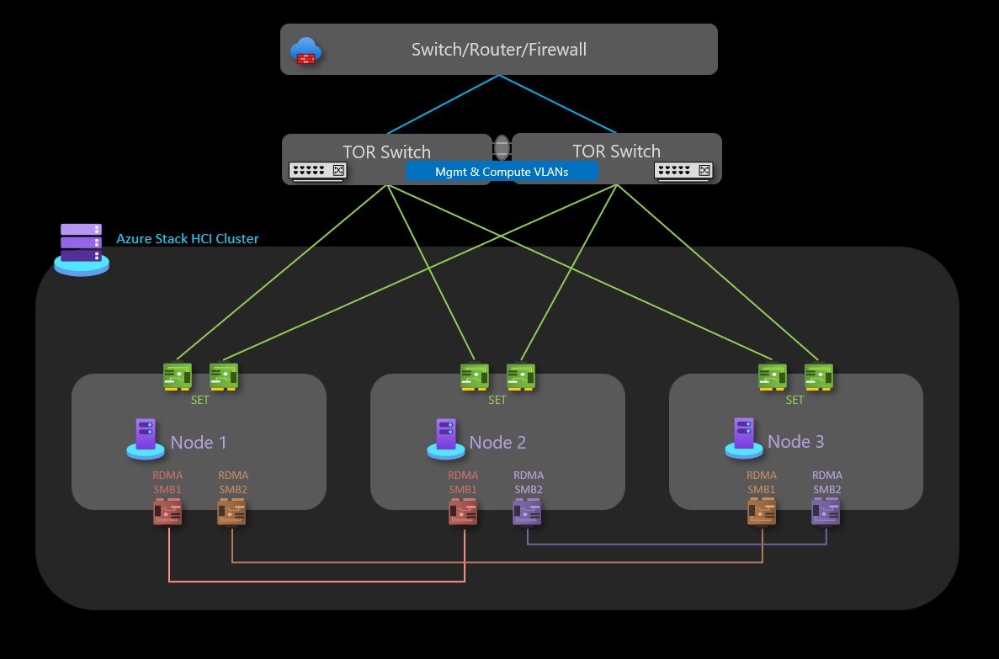
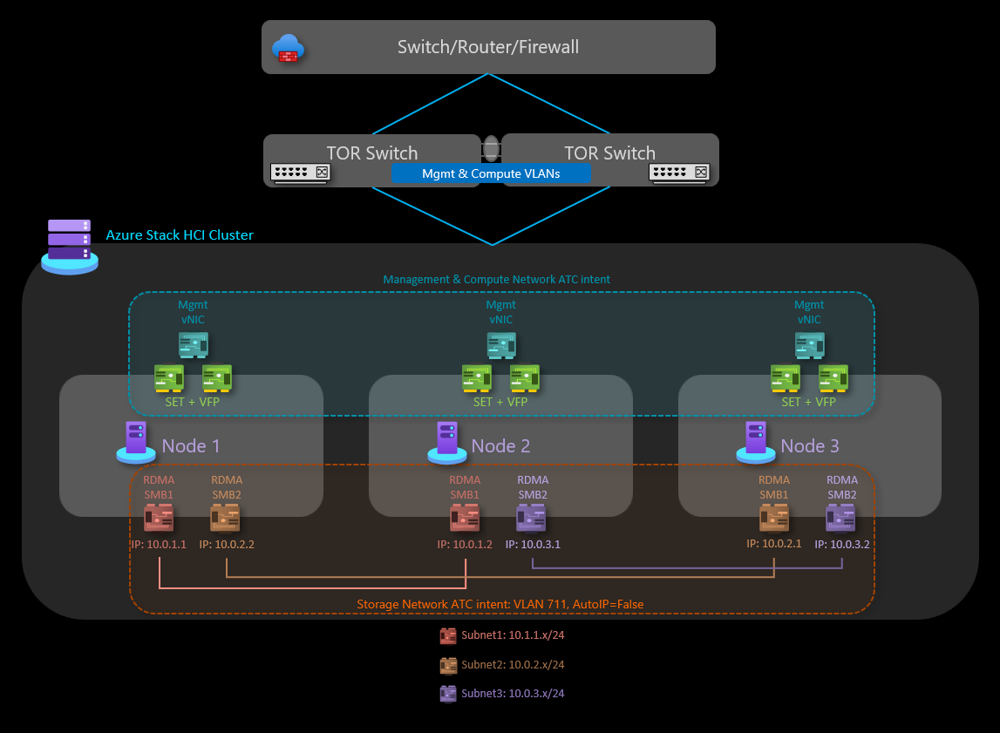

This reference architecture illustrates how to design Azure Stack HCI 23H2 (_and later_) infrastructure, to provide a platform to run highly available virtualized and containerized workloads for retail, manufacturing or remote office scenarios.

This architecture design provides guidance and recommendations for configuring Azure Stack HCI as a resilient platform to deploy and manage end user applications or business systems (_workload_), however this architecture is workload agnostic. Resource components covered include cluster design choice decisions for the physical nodes that provide the local compute, storage and networking capabilities, in addition to information for how to use Azure services to simplify and streamline the day-to-day management of Azure Stack HCI.

For additional information on workload architectures patterns that are optimized to run on Azure Stack HCI, please review the content located under the "_Azure Stack HCI workloads_" navigation menu.

This architecture serves as a starting point for a [3-node Azure Stack HCI cluster using a storage switchless networking design](/azure-stack/hci/plan/three-node-switchless-two-switches-two-links). The workload applications deployed on an Azure Stack HCI cluster should also be well-architected; such as deploying multiple instances (_high-availability_) of any critical workload services, and with appropriate business continuity and disaster recovery (_BC/DR_) controls in place, such as backup and DR failover. These _workload_ design aspects have been intentionally excluded from this article, to maintain the focus on the HCI infrastructure (platform). For additional information review the [Azure Stack HCI Well-Architected Framework Service Guide](/azure/well-architected/service-guides/azure-stack-hci) which provides guidelines and recommendations for the five pillars of the well-architected framework.

## Article layout

| Architecture | Design decisions | Well-Architected Framework approach|
|---|---|---|
|&#9642; [Architecture diagram](#architecture)  &#9642; [Potential use cases](#potential-use-cases)  &#9642; [Scenario details and benefits](#scenario-details-and-benefits)  &#9642; [Platform resources](#platform-resources)  &#9642; [Platform supporting resources](#platform-supporting-resources)  &#9642; [Deployment prerequisites and workflow](#deployment-prerequisites-and-workflow)  |&#9642; [Cluster design choices](#cluster-design-choices)  &#9642; [Physical disk drives](#physical-disk-drives)   &#9642; [Networking](#network-design)   &#9642; [Monitoring](#monitoring)   &#9642; [Update management](#update-management)|&#9642; [Reliability](#reliability)   &#9642; [Security](#security)   &#9642; [Cost Optimization](#cost-optimization)   &#9642; [Operational Excellence](#operational-excellence)   &#9642; [Performance Efficiency](#performance-efficiency)|

> [!TIP]
>  This [reference implementation](https://github.com/Azure/azure-quickstart-templates/tree/master/quickstarts/microsoft.azurestackhci/create-cluster-3Nodes-Switchless-DualLink) demonstrates how to deploy a 3-node Azure Stack HCI storage switchless cluster using an ARM template and parameter file.

## Architecture

_Download a [Visio file][architectural-diagram-visio-source] of this architecture._

For information about these resources, see Azure product documentation listed in [Related resources](#related-resources).

## Potential use cases

Typical use cases for this architecture pattern include the ability to run highly available (HA) workloads for retail, manufacturing or remote office scenarios that have  requirements such as:

- Deploy and manage highly available (HA) virtualized or container-based edge workloads deployed in a single location, to enable business-critical applications and services to operate in a resilient, cost-effective and scalable manner.
- Lower the total cost of ownership (TCO) through use of Microsoft-certified solutions, cloud-based deployment, centralized management, monitoring and alerting.
- Provide a centralized provisioning capability to deploy workloads across multiple locations consistently and securely using Azure and Azure Arc, such as using Azure portal, command-line-interface (cli) or infrastructure as code (IaC) templates to drive automation and repeatability using Kubernetes for containerization and/or traditional workload virtualization.
- Requirement to adhere to strict security, compliance and audit requirements. Azure Stack HCI is deployed with a hardened security posture configured "by default" (_secure-by-default_), using technologies such as certified hardware, secure boot, trust platform module (TPM), virtualization-based security, credential guard and application control policies (WDAC) enforced, and the ability to integrate with modern cloud-based security & threat management services, such as Microsoft Defender for Cloud and Azure Sentinel.

### Scenario details and benefits

The following sections provide additional details on the scenarios and potential use cases for this reference architecture, including a list of business benefits and example workload resource types that can be deployed on Azure Stack HCI.

#### Azure Stack HCI directly integrates with Azure using Azure Arc, lowering the total cost of ownership (TCO) and operational overheads

Azure Stack HCI is deployed and managed using Azure, this provides built-in integration of Azure Arc through deployment of the [Azure Arc resource bridge](/azure/azure-arc/resource-bridge/overview) component which is installed during the HCI cluster deployment process. Azure Stack HCI cluster nodes are enrolled with [Azure Arc for Servers](/azure-stack/hci/deploy/deployment-arc-register-server-permissions) as a prerequisite to initiating the cloud based deployment of the cluster. During deployment the mandatory extensions are installed on each cluster node, such as “Lifecycle Manager (_LCM_)”, “Edge Device Management” and “Telemetry and Diagnostics”. Once deployed, an HCI cluster can be monitored using Azure Monitor and Log Analytics, by enabling Azure Stack HCI Insights. [Feature updates for Azure Stack HCI are released periodically to enhance customer experience](/azure-stack/hci/release-information-23h2), these updates are controlled and managed using [Azure Update Management][azure-update-management]. Workload resources, such as [Azure Arc VMs](/azure-stack/hci/manage/create-arc-virtual-machines), [Arc-enabled AKS][arc-enabled-aks] and [Azure Virtual Desktop (AVD) node pools](/azure/virtual-desktop/deploy-azure-virtual-desktop) can be deployed using Azure, by selecting an [Azure Stack HCI cluster's "custom location"](/azure-stack/hci/manage/azure-arc-vm-management-overview#components-of-azure-arc-vm-management) as the target for the workload deployment, these components provide centralized administration, management, and support. For customers that have existing Windows Server Datacenter Core Licenses with active Software Assurance (SA), it is possible to further reduce costs by applying Azure Hybrid Benefit to Azure Stack HCI, and Windows Server VMs and AKS clusters to optimize the costs for these services.

Azure and Azure Arc integration extends the capabilities of Azure Stack HCI virtualized and containerized workloads, such as using the following capabilities:

- [Azure Arc VMs][arc-enabled-vms] for traditional applications or services that run in virtual machines (VM) on Azure Stack HCI.
- [Azure Kubernetes Service (AKS) on HCI][arc-enabled-aks] for containerized applications or services that will benefit from using Kubernetes as their orchestration platform.
- [Azure Virtual Desktop (AVD)][azs-hci-avd]. Deploy your node pools for AVD workloads on Azure Stack HCI (_on-premises_), using the control and management plane in Azure.
- [Azure Arc-enabled Data Services][arc-enabled-data-services] for containerized Azure SQL Managed Instance or PostgreSQL Hyperscale that use Arc-enabled AKS hosted on Azure Stack HCI.
- [Azure Arc-enabled Machine Learning](/azure/machine-learning/how-to-attach-kubernetes-anywhere) using an Azure Kubernetes Service (AKS) cluster deployed on Azure Stack HCI, as the compute target to run Azure Machine Learning, providing capabilities to train or deploy ML models at the edge.

Through Azure Arc connected workloads, the ability to use Azure Policy can provide additional Azure consistency and automation for workloads deployed on Azure Stack HCI, such as [automating Guest OS configuration using Azure Arc VM extensions][arc-vm-extensions] or evaluating [compliance against industry regulations or corporate standards using Azure Policy][arc-azure-policy], which can be enabled using Azure portal or IaC automation.

#### Azure Stack HCI default security configuration provides defense in depth approach, simplifying security and compliance costs

The deployment and management of IT services for retail, manufacturing and remote office scenarios present unique challenges for security and compliance. With no&mdash;or at best&mdash;limited local IT support and lack of dedicated datacenters, it is particularly important to protect workloads from both internal and external threats. Azure Stack HCI's default security hardening and deep integration with Azure services can help address these challenges.

Azure Stack HCI&ndash;certified hardware ensures built-in Secure Boot, Unified Extensible Firmware Interface (UEFI), and Trusted Platform Module (TPM) support. These technologies, combined with [virtualization-based security (VBS)][azs-hci-vbs], help protect security-sensitive workloads. BitLocker Drive Encryption allows you to encrypt Boot disk volume and Storage Spaces Direct volumes at rest while SMB encryption provides automatic encryption of traffic between servers in the cluster (_on the storage network_) and signing of SMB traffic between the cluster nodes and other systems to help prevent relay attacks, facilitating compliance with regulatory standards.

In addition, you can onboard Azure Stack HCI VMs in [Microsoft Defender for Cloud][ms-defender-for-cloud] to activate cloud-based behavioral analytics, threat detection and remediation, alerting, and reporting. Similarly, by managing Azure Stack HCI VMs in Azure Arc, you gain the ability to use [Azure Policy][arc-azure-policy] to evaluate their compliance with industry regulations and corporate standards.

## Architecture components

This architecture consists of physical server hardware that is used to deploy Azure Stack HCI clusters in on-premises or edge locations. Azure Stack HCI integrates with Azure Arc and several other Azure services that provide supporting resources that enhance the platform capabilities. Azure Stack HCI provides a resilient platform to deploy, manage and operate end user applications or business systems (_workloads_). These platform resources and services are described in the following sections.

### Platform resources

The architecture requires the following mandatory resources and components:

- **[Azure Stack HCI][azs-hci]** is a hyper-converged infrastructure (HCI) solution that is deployed on-premises or in edge locations using physical server hardware and networking infrastructure. Azure Stack HCI provides a platform to deploy and manage virtualized workloads, such as virtual machines, kubernetes clusters and other services enabled through Azure Arc. Azure Stack HCI clusters can scale from a single node deployment to a maximum of sixteen nodes using validated, integrated, or premium hardware SKUs provided by OEM partners.
- **[Azure Arc][azure-arc]** is a cloud-based service that extends the Azure Resource Manager-based management model to Azure Stack HCI and other non-Azure locations. Azure Arc provides the ability to manage resources including virtual machines (VMs), Kubernetes clusters, and containerized data and machine learning services using Azure as the control and management plane.
- **[Key Vault][key-vault]** is a cloud service for securely storing and accessing secrets. A secret is anything that you want to tightly control access to, such as API keys, passwords, certificates, or cryptographic keys.
- **[Cloud Witness][cloud-witness]** is a type of failover cluster quorum witness that uses an Azure Storage Account to provide Azure Stack HCI cluster node quorum voting capabilities. The storage account and witness configuration is created during the Azure Stack HCI cloud deployment process.
- **[Update Management][azure-update-management]** is a unified service to help manage and govern updates for Azure Stack HCI. You can also manage workloads deployed on HCI, such as Windows and Linux VMs Guest OS update compliance, unifying patch management operations across Azure, on-premises, or other cloud platforms using a single dashboard.

### Platform supporting resources

The architecture can incorporate the following optional supporting services that can be used to enhance the platform capabilities:

- **[Azure Monitor][azure-monitor]** is a cloud-based service that maximizes the availability and performance of your applications and services by delivering a comprehensive solution for collecting, analyzing, and acting on diagnostic logs and telemetry from your cloud and on-premises workloads. Deploying Azure Stack HCI Insights simplifies the creation of the Azure Monitor data collection rule (DCR) to quickly enable monitoring of Azure Stack HCI clusters.
- **[Azure Policy][azure-policy]** evaluates Azure and on-premises resources through integration with Azure Arc by comparing properties to determine compliance based on customizable business rules, or capabilities that can be used to apply VM Guest Configuration using policy settings.
- **[Microsoft Defender for Cloud][ms-defender-for-cloud]** is a unified infrastructure security management system that strengthens the security posture of your data centers, and provides advanced threat protection across your hybrid workloads in the cloud - whether they're in Azure or not - and on premises.
- **[Azure Backup][azure-backup]** service provides simple, secure, and cost-effective solutions to back up your data, including virtual machines and recover it from the Microsoft Azure cloud.
- **[Azure Site Recovery][azure-site-recovery]** provides business continuity and disaster recovery (BC/DR) capabilities, by enabling business apps and workloads to failover in the event of a disaster or outage. Site Recovery manages replication and failover of workloads running on both physical and virtual machines, between their primary site (_on-premises_) and a secondary location (_Azure_).

## Cluster design choices

When designing an Azure Stack HCI cluster it is important to understand the workload performance and resiliency requirements, such as the RTO / RPO times and compute (CPU), memory and storage requirements for all of the workload that is planned to run on the Azure Stack HCI cluster. Several characteristics of the workload influence the decision-making process, including:

- Processor (_CPU_) architecture capabilities, and number of cores per socket
- Graphics processing unit (_GPU_) requirements of the workload
- Memory per node, the quantity of physical memory required to run the workload
- Storage capacity and performance requirements
  - Total required usable storage after fault tolerance (copies) taken into consideration, and the input/output operations per second (_IOPs_) x block size = through-put requirements
- Number of HCI cluster nodes in the cluster, one to sixteen nodes in scale (_three nodes maximum for storage switchless design_)
  - Resiliency for Storage: It is recommended to deploy three (_or more_) nodes to enable use of the "_three-way mirror_" capability (_3 x copies of data_) for the infrastructure and user volumes, which provides increased performance in addition to maximum reliability for storage
  - Resiliency for Compute: Requires reservation of "_N+1 nodes worth of capacity_" in the cluster, which is the minimum required to be able to drain a node to perform updates or for the workload to restart in the event of an unplanned outage of a single node, such as power or hardware failure

To help design and plan an Azure Stack HCI deployment correctly, it is recommended to use the [Azure Stack HCI - Sizer Tool][azs-hci-sizer-tool] and create a "New Project" for sizing your HCI cluster(s).To use the Sizer requires that you understand your workload requirements, in terms of number and size of workload VMs that will run on the cluster, this includes number of vCPUs, and amount of Memory and Storage required for the VMs. The Sizer Tool "Preferences" section will guide you through questions that relate to the System type (_Premier, Integrated System or Validated Node_), CPU family options, and Resiliency requirements for the cluster, such as reserving a minimum of "N + 1 nodes" worth of capacity (_one node_) across the cluster. Or the option to reserve "N + 2 nodes worth of capacity" across the cluster for high availability, which provides the ability to withstand a node failure during an update, or other unplanned event that impacts two nodes simultaneously, but ensures there is sufficient capacity to be available in the cluster for the workload to run on the remaining online nodes, this scenario requires use of a "three-way mirror" for user volumes.

The output from the Azure Stack HCI Sizer Tool will be a list of recommended hardware solution SKUs that are able to provide the required workload capacity and platform resiliency requirements, based on the input values in the Sizer Project. If you wish to browse the full list of all OEM hardware partner solutions available, see to the [Azure Stack HCI Solutions Catalog](https://aka.ms/hci-catalog#catalog), and also speak to your preferred hardware solution provider or SI partner to help size their solution SKUs to meet your requirements.

> [!IMPORTANT]
> It is not supported to increase the scale (_perform an Add-Node operation_) of an existing three-node "storage switchless" HCI cluster, without redeploying the cluster and adding additional networking capabilities (_switches, ports, physical NICs_) for storage traffic, and the additional required nodes. Three nodes is the maximum supported cluster size for the "storage switchless" network design. It is important to factor this into the cluster design phase when sizing the hardware, in terms of allowing for  future workload capacity growth requirements.

### Physical disk drives

[Storage Spaces Direct][s2d-disks] supports multiple physical disk drive types that vary in performance and capacity. When designing an Azure Stack HCI cluster, work with your chosen hardware OEM partner to determine the most appropriate physical disk drive type(s) to meet the capacity and performance requirements of your workload. Examples include spinning Hard Disk Drives (HDDs), or Solid-State Drives (SSDs) and NVMe drives, which are both often called "_flash drives_", or [Persistent Memory (PMem) storage](/azure-stack/hci/concepts/deploy-persistent-memory), which is referred to as "_Storage-Class Memory_" (SCM).

The selected physical disk drive type(s) has a direct influence or corelation on storage performance, due to differences in the performance characteristics of each drive type, and the caching mechanism used. This is an integral part of any Storage Spaces Direct design and configuration. Depending on the Azure Stack HCI workload requirements and/or budget constraints, you can choose to [maximize performance][s2d-drive-max-performance], [maximize capacity][s2d-drive-max-capacity], or implement a mixed drive type configuration that provides a [balance between performance and capacity][s2d-drive-balance-performance-capacity].

Storage caching optimization: Storage Spaces Direct provides a [built-in, persistent, real-time, read and write, server-side cache][s2d-cache] that maximizes storage performance. The cache should be sized and configured to accommodate the [working set of your applications and workloads][s2d-cache-sizing]. Storage Spaces Direct virtual disks (_volumes_) is used in combination with Cluster Shared Volumes (CSV) in-memory read cache to [improve Hyper-V performance][azs-hci-csv-cache] for unbuffered I/O access to VHD or VHDX files.

### Network design

The network design refers to the overall arrangement of components within the network, both physical and logical. In the case of a three node "storage switchless" configuration for Azure Stack HCI, we have three physical nodes (_servers_) that are directly connected to each other without the use of an external switch for the storage traffic. This "direct cross-over ethernet connection" between nodes for the storage traffic simplifies the network design by reducing complexity, as there is no requirement to define / apply switch configuration, for example technologies such as RoCE v2, iWARP, ECN, PFC or QoS for the storage network. However, the maximum number of supported nodes in this configuration is three nodes, which means it is not possible to scale (_add additional nodes_) the cluster after it has been deployed.

#### Physical network topology

The physical network topology shows the actual physical connections between nodes and networking components. Below is what this looks like for a 3-node storage switchless Azure Stack HCI deployment:

- Three nodes (Servers):
  - Each node is a physical server running Azure Stack HCI OS.
  - These nodes are interconnected using a single (_or dual_) dedicated physical network interface cards (NICs), that is directly connected to the other nodes using ethernet cables, forming a mesh network for storage.
- Dual Top-of-Rack (ToR) Switches:
  - Although this configuration is switchless for storage traffic, it requires links to the ToR switches for external connectivity (_north/south traffic_) for the cluster "management" intent and workload "compute" intent.
  - These switches connect to the nodes using ethernet cables.
  - Using dual ToR switches is recommended to provide redundancy and load balancing for external communication.
- External Connectivity:
  - The dual ToR switches connect to the external network, such as the internal corporate LAN and provide access to the required outbound URLs using your edge border network device (_firewall or router_).
  - They handle traffic going in and out of the Azure Stack HCI cluster (_north/south traffic_).
- Storage Traffic:
  - Within the HCI cluster, nodes communicate directly with each other for storage replication traffic (_east/west traffic_).
  - This direct communication avoids the requirement to use additional switch ports and configuration for SMB-Direct (_RDMA_) traffic.

#### Logical network topology

The logical network topology provides an overview for how the network data flows between devices, regardless of their physical connections. Below is a summarization of the logical setup for a 3-node storage switchless Azure Stack HCI cluster:

- Storage traffic:
  - The nodes communicate with each other directly for storage traffic.
  - Each node can access shared storage spaces, virtual disks, and volumes.
  - This direct communication ensures sufficient data transfer for storage-related operations, such as maintaining consistent copies of data for mirrored volumes.
- External communication:
  - When nodes or workload need to communicate externally, such as accessing the corporate LAN, internet or another service, they route using the dual ToR switches.
  - The ToR switches handle routing and provide connectivity beyond the cluster to the edge border device (_firewall or router_).
- Network ATC and Intents:
  - Azure Stack HCI leverages network automation and intent-based network configuration.
  - The NetworkATC service is designed to ensure optimal networking configuration and traffic flow using network "_Intents_", such as defining which physical network interface cards (_pNICs_) will be used for the different traffic types.
  - Intent-based policies define how the pNICs should behave, and which network traffic classes should be used on which pNICs, such as the "Storage", "Management" and "Compute" intents, that are associated with the correct pNICs as part of the Azure Stack HCI cloud deployment process.

#### IP address requirements

To deploy a three-node storage switchless configuration of Azure Stack HCI, the cluster infrastructure platform requires a minimum of 14 x IP addresses to be allocated. Additional IP addresses are required if using microsegmentation and/or software defined networking (SDN). [Review three-node storage reference pattern IP requirements for Azure Stack HCI](/azure-stack/hci/plan/three-node-ip-requirements) for additional information.

When designing and planning IP address requirements for Azure Stack HCI, consider that additional IP addresses and/or network ranges will be required for your workload, in addition to the IP addresses required for the Azure Stack HCI cluster and infrastructure components.

### Monitoring

Enable [Azure Monitor Insights on Azure Stack HCI](/azure-stack/hci/concepts/monitoring-overview) to enhance monitoring and alerting. Insights can seamlessly scale to monitor and manage multiple on-premises clusters using an Azure consistent experience.

Insights is capable of monitoring key Azure Stack HCI features using the cluster Performance counters and Event Log Channels that are collected by the data collection rule (DCR) configured using Azure Monitor and Log Analytics.

Because Azure Stack HCI Insights is built using Azure Monitor and Log Analytics, it is an always up to date, scalable solution that is highly customizable. Insights provides access to default workbooks with basic metrics, along with specialized workbooks created for monitoring key features of Azure Stack HCI. This components provide a near real-time monitoring solution, with the ability to create graphs, customize visualization using aggregation and filtering functionality and configuring custom resource health alert rules.

### Update management

Azure Stack HCI is continually updated to enhance customer experience and provide additional features and functionality, this process is delivered using "Release Trains" that provide new "Baseline Builds" which can be applied to Azure Stack HCI clusters to keep them up to date. In addition to regular Baseline Build updates, Azure Stack HCI is updated with OS security and reliability updates on a monthly basis.

Azure Update Manager is an Azure service that allows you to apply, view, and manage updates for Azure Stack HCI. This provides a mechanism to view all Azure Stack HCI clusters across your entire infrastructure and edge locations using Azure portal for a centralized management experience. For additional information review the following resources:

- [About Azure Stack HCI Release Information](/azure-stack/hci/release-information-23h2#about-azure-stack-hci-version-23h2-releases)
- [Azure Stack HCI Lifecycle cadence](/azure-stack/hci/update/about-updates-23h2#lifecycle-cadence)
- [Review update phases of Azure Stack HCI](/azure-stack/hci/update/update-phases-23h2)
- [Use Azure Update Manager to update Azure Stack HCI](/azure-stack/hci/update/azure-update-manager-23h2)

## Deployment prerequisites and workflow

**There is a project or use case requirement to deploy a hybrid cloud solution in an on-premises or edge location** to provide local compute or data processing capabilities with an Azure consistent management and billing experience. Additional details are outlined in the [Potential use cases](#potential-use-cases) section of this article. The remaining steps assume Azure Stack HCI has been selected as the infrastructure platform solution for the project.

The following section provides an _example list of the high-level tasks or typical workflow_ used to deploy an Azure Stack HCI solution. This workflow list is intended as an **example guide only**, it is not an exhaustive list of all actions or steps required, as these can vary based on organizational, geographic or project specific requirements.

1. **Workload and use case requirements should be gathered from relevant stakeholders**, to enable the project leads to confirm that the features and capabilities of Azure Stack HCI meet the workload scale and functionality requirements. This review process should include understanding the workload scale (size) and required features such as Arc VMs, Azure Kubernetes Service, AVD host pools, or Arc-enabled Data Services or Arc-enabled Machine Learning (ML). The workload RTO and RPO (_reliability_) values and other non-functional requirements (_performance / load scalability_) should be documented as part of this requirements gathering step.
1. **Use the [Azure Stack HCI Sizer Tool][azs-hci-sizer-tool] to create a new Project that will model the workload type and scale**, this will include the size and number of VMs and their storage requirements. These details are inputted together with choices for the System type, preferred CPU family and your Resiliency requirements for high availability and Storage fault tolerance, as explained in the earlier [Cluster design choices](#cluster-design-choices) section.
1. **Review the Azure Stack HCI Sizer output for the recommended hardware partner solution**, this will include details of the recommended physical server hardware (_make and model_), number of physical nodes and the specifications for the CPU, Memory and Storage configuration of each physical node, that will be required to deploy and run your workload(s).
1. **Contact the hardware OEM or system integrator (SI) partner to further qualify the suitability** of the recommended hardware SKU vs your workload requirements. This step typically includes discussions with the hardware OEM or SI partner for the commercial aspects of the solution, such as quotations, availability of the hardware, lead times and any professional or value-add services that the partner offers to help accelerate your project or business outcomes.
1. **Work with the hardware OEM or SI partner to arrange delivery of the hardware**. The partner or your employees will then be required integrate the hardware into your on-premises datacenter or edge location, such as "racking and stacking" the hardware, physical network and power supply unit (PSU) cabling for the physical nodes.
1. **Perform the Azure Stack HCI cluster deployment.** Depending on your chosen solution SKU (_Premier solution, Integrated system or Validated nodes_) either the hardware / SI partner, or your employees will now be able to [deploy the Azure Stack HCI software](/azure-stack/hci/deploy/deployment-introduction). This step starts by onboarding the physical nodes HCI operating system into Azure Arc-enabled Servers, then starting the Azure Stack HCI cloud deployment process.

## Well-Architected Framework considerations

The Microsoft [Azure Well-Architected Framework (WAF)][azure-well-architected-framerwork] is a set of guiding tenets that are followed in this reference architecture. The following considerations are framed in the context of these tenets.

### Reliability

Reliability ensures your application can meet the commitments you make to your business or customers. For more information, see the [Reliability pillar of the Azure Stack HCI WAF Service Guide](/azure/well-architected/service-guides/azure-stack-hci#reliability).

Reliability considerations include:

- For the deployment of this reference architecture, a fictitious customer "Contoso Manufacturing" has an internal Service Level Objective (SLO) of 99.9% agreed with business and application stakeholders. An SLO of 99.9% uptime/availability results in the following periods of allowed downtime / unavailability for the applications deployed within Arc VMs running on Azure Stack HCI:

  Weekly: 10m 4.8s
  Monthly: 43m 28s
  Quarterly: 2h 10m 24s
  Yearly: 8h 41m 38s

- **To help achieve the SLO targets** Contoso Manufacturing have implemented the _principle of least privilege_ to restrict the number of Azure Stack HCI cluster administrators to a small group of trusted and qualified individuals. This helps prevent downtime due to any inadvertent or accidental actions being performed on production resources. Furthermore, the on-premises Active Directory Domain Services (AD DS) domain controllers security event logs are monitored to detect and report any user account group membership changes (_add / remove actions_) for the "Azure Stack HCI cluster administrators" group using a security information event management (SIEM) solution. In addition to increasing Reliability, this monitoring also improves the Security of the solution.
- Contoso Manufacturing have **strict change control procedures** in place for production systems, this process requires that all changes must be tested and validated in a representative test environment prior to implementation in production, all submitted changes must include a risk level and comprehensive roll back plan.
- **Monthly security patches and quarterly baseline updates** are applied to production Azure Stack HCI clusters only after they have been validated in the pre-production environment. Azure Update Management automation and Cluster Awareness Updating automates the process of using _VM Live Migration_ to minimize downtime for business critical workloads during the monthly servicing operations. Contoso Manufacturing require the patching process to be completed for all production systems within four weeks of the update release date.
- **Contoso Manufacturing perform daily, weekly and monthly backups**, retaining the last 6 x days of daily backups (_Monday to Saturdays_), the last 3 x weekly (_each Sunday_) and 3 x monthly (_Sunday week 4 is retained as the Month 1, then Month 2, and Month 3_) backups. This provides an adequate balance between the number of data recovery points available and reducing costs for the offsite / cloud backup storage service.
- **The data backup and recovery process is tested** for each business system every six months, this provides assurance the business continuity and disaster recovery (BCDR) processes are valid and the business would be protected in the event of a datacenter disaster or cyber incident.
- The operational processes and procedures outlined above, together with the recommendations in the [**Well-Architected Framework (WAF) Service Guide for Azure Stack HCI**](/azure/well-architected/service-guides/azure-stack-hci) enable Contoso Manufacturing to achieve their 99.9% Service Level Objective (SLO) target and effectivity scale and manage operations of Azure Stack HCI across multiple manufacturing sites that are distributed across the globe.

### Security

Security provides assurances against deliberate attacks and the misuse of your valuable data and systems. For more information, see the [Security pillar of the Azure Stack HCI WAF Service Guide](/azure/well-architected/service-guides/azure-stack-hci#security).

Security considerations include:

- [Azure Stack HCI is a secure-by-default product][azs-hci-basic-security], that uses certified/validated hardware components that use a TPM, UEFI and Secure Boot to build a secure foundation for the Azure Stack HCI platform and workload security. When deployed with the default / recommended security settings, the product has Windows Defender Application Control (WDAC), Credential Guard and BitLocker enabled. Use [Azure Stack HCI built-in role-based access control (RBAC) roles][azs-hci-rbac] such as 'Azure Stack HCI Administrator' for platform administrators, and 'Azure Stack HCI VM Contributor' or 'Azure Stack HCI VM Reader' for workload operators to simplify delegating permissions, using the principle of least privilege.
- [Azure Stack HCI security default][azs-hci-security-default]. Apply default security settings for your Azure Stack HCI cluster during deployment, and [Enable Drift Control](/azure-stack/hci/manage/manage-secure-baseline)  to keep the nodes in a known good state. You can use the security default settings to manage cluster security, drift control, and Secured core server settings on your cluster.
- Enable [Azure Stack HCI Syslog Forwarding][azs-hci-security-syslog] to integrate with security monitoring solutions, by retrieving relevant security event logs to aggregate and store events for retention in your own SIEM platform.
- Enable [Microsoft Defender for Cloud to protect your Azure Stack HCI clusters][azs-hci-defender-for-cloud] from various cyber threats and vulnerabilities, which helps to improve the security posture of your Azure Stack HCI environment, and can protect against existing and evolving threats.
- [Microsoft Advanced Threat Analytics (ATA)][ms-ata] can be used to detect and remediate cyber threats, such as those targeting Active Directory Domain Services (AD DS) that provides authentication services to Azure Stack HCI cluster nodes and their Windows Server VM workloads.

### Cost optimization

Cost optimization is about looking at ways to reduce unnecessary expenses and improve operational efficiencies. For more information, the [Cost optimization pillar of the Azure Stack HCI WAF Service Guide](/azure/well-architected/service-guides/azure-stack-hci#cost-optimization).

Cost optimization considerations include:

- Switchless vs switch-based cluster interconnects. The switchless interconnect topology consists of connections between single-port or dual-port (_redundant_) Remote Direct Memory Access (RDMA) capable network interface cards (NICs) in each node (_to form a full mesh_), with each node connected directly to every other node. While this is straightforward to implement, it is only supported in two-node or three-node clusters. Azure Stack HCI cluster with four or more nodes require the "storage switched" network architecture, which also provides the ability to add additional nodes post deployment, unlike the storage switchless design that does not support add-node operations.
- Cloud-style billing model. Azure Stack HCI pricing follows the [monthly subscription billing model][azs-hci-billing], with a flat rate per physical processor core in an Azure Stack HCI cluster (additional usage charges apply if you use other Azure services). If you own on-premises core licenses for Windows Server Datacenter edition, with active Software Assurance (SA) you might choose to exchange these licenses to activate Azure Stack HCI cluster and Windows Server VM subscription fee.

> [!TIP]
> You can get cost savings with Azure Hybrid Benefit if you have Windows Server Datacenter licenses with active Software Assurance. For more information about Azure Hybrid Benefit, see [Azure Hybrid Benefit for Azure Stack HCI][azs-hybrid-benefit].

### Operational excellence

Operational excellence covers the operational processes that are used to deploy the Azure Stack HCI cluster and keep the platform running in production. For more information, see the [Operational excellence pillar of the Azure Stack HCI WAF Service Guide](/azure/well-architected/service-guides/azure-stack-hci#operational-excellence).

Operational excellence considerations include:

- Simplified provisioning and management experience integrated with Azure. The [**Cloud Based Deployment** in Azure][azs-hci-deploy-via-portal] provides a wizard-driven interface that guides you through creating an Azure Stack HCI cluster. Similarly, Azure simplifies the process of [managing Azure Stack HCI clusters][azs-hci-manage-cluster-at-scale] and [Arc VMs](/azure-stack/hci/manage/azure-arc-vm-management-overview). The portal based deployment of Azure Stack HCI cluster can be [automated using ARM template][azs-hci-deploy-via-template] providing consistency and automation to deploy Azure Stack HCI at scale, especially in edge scenarios, such as retail stores or manufacturing site that require an Azure Stack HCI cluster to run workloads critical for business processes.
- Automation capabilities for Virtual Machines. Azure Stack HCI provides a wide range of automation capabilities for managing workloads such as Virtual Machines, with the [automated deployment of Arc VMs using Azure CLI, ARM or Bicep Template][azs-hci-automate-arc-vms], with Virtual Machine OS updates using Azure Arc Extension for Updates and [Azure Update Manager][azure-update-management] to update each Azure Stack HCI cluster. Azure Stack HCI also offers support for [Azure Arc VM management][azs-hci-vm-automate-cli] by using Azure CLI and [Non-Azure Arc VMs][azs-hci-manage-non-arc-vms] by using Windows PowerShell. You can run Azure CLI commands locally from one of the Azure Stack HCI servers or remotely from a management computer. Integration with [Azure Automation][az-auto-hybrid-worker] and Azure Arc facilitates a wide range of additional automation scenarios for [virtual machine][arc-vm-extensions] workloads through Azure Arc extensions.
- Automation capabilities for Containers on AKS (Azure Kubernetes Service). Azure Stack HCI provides a wide range of automation capabilities for managing workloads such as containers on AKS, with the [automated deployment of AKS clusters using Azure CLI][azs-hci-automate-arc-aks], with AKS workload cluster updates using Azure Arc Extension for [Kubernetes Updates][azs-hci-automate-aks-update]. Azure Stack HCI also offers support for [Azure Arc AKS management][azs-hci-aks-automate-cli] by using Azure CLI. You can run Azure CLI commands locally from one of the Azure Stack HCI servers or remotely from a management computer. Integration with Azure Arc facilitates a wide range of additional automation scenarios for [containerized][azs-hci-k8s-gitops] workloads through Azure Arc extensions.
- Decreased management complexity. Switchless interconnect eliminates the risk of switch device failures and the need for their configuration and management.

### Performance efficiency

Performance efficiency is the ability of your workload to scale to meet the demands placed on it by users in an efficient manner. For more information, see the [Performance efficiency pillar of the Azure Stack HCI WAF Service Guide](/azure/well-architected/service-guides/azure-stack-hci#performance-efficiency).

Performance efficiency considerations include:

- [Storage resiliency][s2d-resiliency] versus usage efficiency, versus performance. Planning for Azure Stack HCI volumes involves identifying the optimal balance between resiliency, usage efficiency, and performance. This challenge results from the fact that maximizing one of these characteristics typically has a negative impact on at least one of the other two. For example, increasing resiliency reduces the usable capacity, while the resulting performance might vary depending on the resiliency type selected. When resiliency and performance matters most, and when using three or more nodes, the default storage configuration during Azure Stack HCI cloud deployment will be a three-way mirror for the infrastructure and user volumes.
- Compute performance optimization in Azure Stack HCI can be achieved through the use of graphics processing unit (GPU) acceleration, such as requirements for data insights or inferencing for [high-performance AI/ML workloads][azs-hci-gpu-acceleration] that require deployment at edge locations due to data gravity and/or security requirements.
- Network performance optimization. As part of your design, be sure to include projected [network traffic bandwidth allocation][azs-hci-network-bandwidth-allocation] when determining your [optimal network hardware configuration][azs-hci-networking]. This includes provisions to address [switchless interconnect minimum bandwidth requirements for storage traffic][azs-hci-switchless-interconnects-reqs], such as implementing with two (or more) physical network interface adapters (NICs) for the storage Network ATC intent, which provides additional bandwidth and resiliency for high storage performance and/or business-critical scenarios.

> [!IMPORTANT]
> We recommend using Mirrored Volumes for performance-sensitive workloads. If you have three or more servers, use the default storage configuration (_three-way mirror_), instead of a two-way mirror, to provide additional resiliency and more data copies for read optimization. To learn more about how to balance performance and capacity to meet your workload requirements, see [Plan volumes][s2d-plan-volumes].

## Related resources

See product documentation for details on specific Azure services:

- [Azure Stack HCI](https://azure.microsoft.com/products/azure-stack/hci/)
- [Azure Arc](https://azure.microsoft.com/products/azure-arc)
- [Azure Key Vault](https://azure.microsoft.com/products/key-vault)
- [Azure Blob Storage](https://azure.microsoft.com/products/storage/blobs/)
- [Azure Monitor](https://azure.microsoft.com/products/monitor)
- [Azure Policy](https://azure.microsoft.com/products/azure-policy)
- [Azure Container Registry](https://azure.microsoft.com/products/container-registry)
- [Microsoft Defender for Cloud](https://azure.microsoft.com/products/defender-for-cloud)
- [Azure Site Recovery](https://azure.microsoft.com/products/site-recovery)
- [Azure Backup](https://azure.microsoft.com/products/backup)

Additional information:

- [Hybrid architecture design](hybrid-start-here.md)
- [Azure hybrid options](/azure/architecture/guide/technology-choices/hybrid-considerations)
- [Azure Automation in a hybrid environment](azure-automation-hybrid.yml)
- [Azure Automation State Configuration](../example-scenario/state-configuration/state-configuration.yml)
- [Optimize administration of SQL Server instances in on-premises and multicloud environments by using Azure Arc](/azure/architecture/hybrid/azure-arc-sql-server)

## Next steps

Product documentation:

- [About Site Recovery](/azure/site-recovery/site-recovery-overview)
- [Azure Automation State Configuration overview](/azure/automation/automation-dsc-overview)
- [Azure Kubernetes Service](/azure/aks/intro-kubernetes)
- [Azure Monitor overview](/azure/azure-monitor/overview)
- [Change Tracking and Inventory overview](/azure/automation/change-tracking/overview)
- [Manage registered servers with Azure File Sync](/azure/storage/file-sync/file-sync-server-registration)
- [Update Management overview](/azure/automation/update-management/overview)
- [What are Azure Arc-enabled Data Services?](/azure/azure-arc/data/overview)
- [What is Azure Arc-enabled servers?](/azure/azure-arc/servers/overview)
- [What is the Azure Backup service?](/azure/backup/backup-overview)

Microsoft Learn modules:

- [Configure Azure files and Azure File Sync](/training/modules/configure-azure-files-file-sync)
- [Configure Azure Monitor](/training/modules/configure-azure-monitor)
- [Design your site recovery solution in Azure](/training/modules/design-your-site-recovery-solution-in-azure)
- [Introduction to Azure Arc enabled servers](/training/modules/intro-to-arc-for-servers)
- [Introduction to Azure Arc-enabled data services](/training/modules/intro-to-arc-enabled-data-services)
- [Introduction to Azure Kubernetes Service](/training/modules/intro-to-azure-kubernetes-service)
- [Scale model deployment with Azure Machine Learning anywhere - Tech Community Blog](https://techcommunity.microsoft.com/t5/ai-machine-learning-blog/scale-model-deployment-with-azure-machine-learning-anywhere/ba-p/2888753)
- [Realizing Machine Learning anywhere with Azure Kubernetes Service and Arc-enabled Machine Learning - Tech Community Blog](https://techcommunity.microsoft.com/t5/azure-arc-blog/realizing-machine-learning-anywhere-with-azure-kubernetes/ba-p/3470783)
- [Machine learning on AKS hybrid & Stack HCI using Azure Arc-enabled ML - Tech Community Blog](https://techcommunity.microsoft.com/t5/azure-stack-blog/machine-learning-on-aks-hybrid-amp-stack-hci-using-azure-arc/ba-p/3816127)
- [Introduction to Kubernetes compute target in Azure Machine Learning](/azure/machine-learning/how-to-attach-kubernetes-anywhere?view=azureml-api-2)
- [Keep your virtual machines updated](/training/modules/keep-your-virtual-machines-updated)
- [Protect your virtual machine settings with Azure Automation State Configuration](/training/modules/protect-vm-settings-with-dsc)
- [Protect your virtual machines by using Azure Backup](/training/modules/protect-virtual-machines-with-azure-backup)

[architectural-diagram-visio-source]: https://arch-center.azureedge.net/azure-stack-hci-switchless.vsdx
[azure-well-architected-framerwork]: /azure/architecture/framework
[azs-hci]: /azure-stack/hci/overview
[azure-arc]: /azure/azure-arc/overview
[azure-monitor]: /azure/azure-monitor/overview
[azure-backup]: /azure/backup/backup-overview
[ms-defender-for-cloud]: /azure/security-center/security-center-introduction
[cloud-witness]: /windows-server/failover-clustering/deploy-cloud-witness
[azure-policy]: /azure/governance/policy/overview
[azure-update-management]: /azure/update-manager/
[azure-site-recovery]: /azure/site-recovery/site-recovery-overview
[key-vault]: /azure/key-vault/general/basic-concepts
[s2d-resiliency]: /windows-server/storage/storage-spaces/storage-spaces-fault-tolerance
[azs-hci-avd]: /azure/virtual-desktop/deploy-azure-virtual-desktop?toc=%2Fazure-stack%2Fhci%2Ftoc.json&bc=%2Fazure-stack%2Fbreadcrumb%2Ftoc.json&tabs=portal
[arc-enabled-vms]: /azure-stack/hci/manage/azure-arc-vm-management-overview
[arc-enabled-aks]: /azure/aks/hybrid/cluster-architecture
[azs-hci-automate-arc-aks]: /azure/aks/hybrid/aks-create-clusters-cli?toc=%2Fazure-stack%2Fhci%2Ftoc.json&bc=%2Fazure-stack%2Fbreadcrumb%2Ftoc.json
[azs-hci-automate-aks-update]: /azure/aks/hybrid/cluster-upgrade
[azs-hybrid-benefit]: /azure-stack/hci/concepts/azure-hybrid-benefit-hci
[arc-enabled-data-services]: /azure/azure-arc/data/overview
[arc-vm-extensions]: /azure/azure-arc/servers/manage-vm-extensions
[arc-azure-policy]: /azure/azure-arc/servers/security-controls-policy
[azs-hci-vbs]: /windows-hardware/design/device-experiences/oem-vbs
[azs-hci-billing]: /azure-stack/hci/concepts/billing
[azs-hci-deploy-via-portal]: /azure-stack/hci/deploy/deploy-via-portal
[azs-hci-deploy-via-template]: /azure-stack/hci/deploy/deployment-azure-resource-manager-template
[azs-hci-manage-cluster-at-scale]: /azure-stack/hci/manage/manage-at-scale-dashboard
[azs-hci-automate-arc-vms]: /azure-stack/hci/manage/create-arc-virtual-machines?tabs=azurecli
[azs-hci-vm-automate-cli]: /cli/azure/stack-hci-vm
[azs-hci-aks-automate-cli]: /cli/azure/aksarc
[azs-hci-manage-non-arc-vms]: /azure-stack/hci/manage/vm-powershell
[az-auto-hybrid-worker]: /azure/automation/automation-hybrid-runbook-worker
[azs-hci-k8s-gitops]: /azure/azure-arc/kubernetes/use-gitops-connected-cluster
[s2d-disks]: /windows-server/storage/storage-spaces/choosing-drives
[s2d-drive-max-performance]: /windows-server/storage/storage-spaces/choosing-drives#option-1--maximizing-performance
[s2d-drive-max-capacity]: /windows-server/storage/storage-spaces/choosing-drives#option-3--maximizing-capacity
[s2d-drive-balance-performance-capacity]: /windows-server/storage/storage-spaces/choosing-drives#option-2--balancing-performance-and-capacity
[s2d-cache]: /windows-server/storage/storage-spaces/understand-the-cache
[s2d-cache-sizing]: /windows-server/storage/storage-spaces/choosing-drives#cache
[s2d-plan-volumes]: /azure-stack/hci/concepts/plan-volumes#choosing-the-resiliency-type
[azs-hci-csv-cache]: /azure-stack/hci/manage/use-csv-cache#planning-considerations
[azs-hci-gpu-acceleration]: /azure-stack/hci/manage/attach-gpu-to-linux-vm
[azs-hci-networking]: /azure-stack/hci/concepts/plan-host-networking
[azs-hci-network-bandwidth-allocation]: /azure-stack/hci/concepts/plan-host-networking#traffic-bandwidth-allocation
[azs-hci-switchless-interconnects-reqs]: /azure-stack/hci/concepts/plan-host-networking#interconnects-for-2-3-node-clusters
[sr-resync]: /windows-server/storage/storage-spaces/understand-storage-resync
[azs-hci-basic-security]: /azure-stack/hci/concepts/security-features
[azs-hci-rbac]: /azure-stack/hci/manage/assign-vm-rbac-roles
[azs-hci-security-default]: /azure-stack/hci/manage/manage-secure-baseline
[azs-hci-security-syslog]: /azure-stack/hci/manage/manage-syslog-forwarding
[ms-ata]: /advanced-threat-analytics/what-is-ata
[azs-hci-defender-for-cloud]: /azure-stack/hci/manage/manage-security-with-defender-for-cloud
[azs-hci-sizer-tool]: https://aka.ms/hci-catalog#sizer
