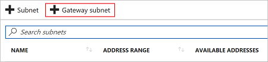

# Configure hybrid cloud connectivity using Azure and Azure Stack Hub

You can access resources with security in global Azure and Azure Stack Hub using the hybrid connectivity pattern.

In this solution, you'll build a sample environment to:

> [!div class="checklist"]
> - Keep data on-premises to meet privacy or regulatory requirements but keep access to global Azure resources.
> - Maintain a legacy system while using cloud-scaled app deployment and resources in global Azure.

> [!Tip]
> 
> Microsoft Azure Stack Hub is an extension of Azure. Azure Stack Hub brings the agility and innovation of cloud computing to your on-premises environment, enabling the only hybrid cloud that allows you to build and deploy hybrid apps anywhere.
>
> The article [Hybrid app design considerations](/hybrid/app-solutions/overview-app-design-considerations) reviews pillars of software quality (placement, scalability, availability, resiliency, manageability, and security) for designing, deploying, and operating hybrid apps. The design considerations assist in optimizing hybrid app design, minimizing challenges in production environments.

## Prerequisites

A few components are required to build a hybrid connectivity deployment. Some of these components take time to prepare, so plan accordingly.

### Azure

- If you don't have an Azure subscription, create a [free account](https://azure.microsoft.com/free/?WT.mc_id=A261C142F) before you begin.
- Create a [web app](/aspnet/core/tutorials/publish-to-azure-webapp-using-vs) in Azure. Make note of the web app URL because you'll need it in the solution.

### Azure Stack Hub

An Azure OEM/hardware partner can deploy a production Azure Stack Hub, and all users can deploy an Azure Stack Development Kit (ASDK).

- Use your production Azure Stack Hub or deploy the ASDK.
   > [!Note]
   > Deploying the ASDK can take up to 7 hours, so plan accordingly.

- Deploy [App Service](/azure-stack/operator/azure-stack-app-service-deploy) PaaS services to Azure Stack Hub.
- [Create plans and offers](/azure-stack/operator/service-plan-offer-subscription-overview) in the Azure Stack Hub environment.
- [Create tenant subscription](/azure-stack/operator/azure-stack-subscribe-plan-provision-vm) within the Azure Stack Hub environment.

### Azure Stack Hub components

An Azure Stack Hub operator must deploy the App Service, create plans and offers, create a tenant subscription, and add the Windows Server 2016 image. If you already have these components, make sure they meet the requirements before you start this  solution.

This solution example assumes that you have some basic knowledge of Azure and Azure Stack Hub. To learn more before starting the solution, read the following articles:

- [Introduction to Azure](https://azure.microsoft.com/overview/what-is-azure/)
- [Azure Stack Hub Key Concepts](/azure-stack/operator/azure-stack-overview)

### Before you begin

Verify that you meet the following criteria before you start configuring hybrid cloud connectivity:

- You need an externally facing public IPv4 address for your VPN device. This IP address can't be located behind a NAT (Network Address Translation).
- All resources are deployed in the same region/location.

#### Solution example values

The examples in this solution use the following values. You can use these values to create a test environment or refer to them for a better understanding of the examples. For more information about VPN gateway settings, see [About VPN Gateway Settings](/azure/vpn-gateway/vpn-gateway-about-vpn-gateway-settings).

Connection specifications:

- **VPN type**: route-based
- **Connection type**: site-to-site (IPsec)
- **Gateway type**: VPN
- **Azure connection name**: Azure-Gateway-AzureStack-S2SGateway (the portal will autofill this value)
- **Azure Stack Hub connection name**: AzureStack-Gateway-Azure-S2SGateway (the portal will autofill this value)
- **Shared key**: any compatible with VPN hardware, with matching values on both sides of connection
- **Subscription**: any preferred subscription
- **Resource group**: Test-Infra

Network and subnet IP addresses:

| Azure/Azure Stack Hub Connection | Name | Subnet | IP Address |
|---|---|---|---|
| Azure vNet | ApplicationvNet 10.100.102.9/23 | ApplicationSubnet 10.100.102.0/24 |  |
|  |  | GatewaySubnet 10.100.103.0/24 |  |
| Azure Stack Hub vNet | ApplicationvNet 10.100.100.0/23 | ApplicationSubnet  10.100.100.0/24 |  |
|  |  | GatewaySubnet  10.100101.0/24 |  |
| Azure Virtual Network Gateway | Azure-Gateway |  |  |
| Azure Stack Hub Virtual Network Gateway | AzureStack-Gateway |  |  |
| Azure Public IP | Azure-GatewayPublicIP |  | Determined at creation |
| Azure Stack Hub Public IP | AzureStack-GatewayPublicIP |  | Determined at creation |
| Azure Local Network Gateway | AzureStack-S2SGateway    10.100.100.0/23 |  | Azure Stack Hub Public IP Value |
| Azure Stack Hub Local Network Gateway | Azure-S2SGateway 10.100.102.0/23 |  | Azure Public IP Value |

## Create a virtual network in global Azure and Azure Stack Hub

Use the following steps to create a virtual network by using the portal. You can use these [example values](/azure/vpn-gateway/vpn-gateway-howto-site-to-site-resource-manager-portal#values) if you're using this article as only a  solution. If you're using this article to configure a production environment, replace the example settings with  your own values.

> [!IMPORTANT]
> You must ensure that there isn't an overlap of IP addresses in Azure or Azure Stack Hub vNet address spaces.

To create a vNet in Azure:

1. Use your browser to connect to the [Azure portal](https://portal.azure.com/) and sign in with your Azure account.
2. Select **Create a resource**. In the **Search the marketplace** field, enter 'virtual network'. Select **Virtual network** from the results.
3. From the **Select a deployment model** list, select **Resource Manager**, and then select **Create**.
4. On **Create virtual network**, configure the VNet settings. The required fields names are prefixed with a red asterisk.  When you enter a valid value, the asterisk changes to a green check mark.

To create a vNet in Azure Stack Hub:

1. Repeat the steps above (1-4) using the Azure Stack Hub **tenant portal**.

## Add a gateway subnet

Before connecting your virtual network to a gateway, you need to create the gateway subnet for the virtual network that you want to connect to. The gateway services use the IP addresses you specify in the gateway subnet.

In the [Azure portal](https://portal.azure.com/), navigate to the Resource Manager virtual network where you want to create a virtual network gateway.

1. Select the vNet to open the **Virtual network** page.
2. In **SETTINGS**, select **Subnets**.
3. On the **Subnets** page, select **+Gateway subnet** to open the **Add subnet** page.

    

4. The **Name** for the subnet is automatically filled in with the value 'GatewaySubnet'. This value is required for Azure to recognize the subnet as the gateway subnet.
5. Change the **Address range** values that are provided to match your configuration requirements and then select **OK**.

## Create a Virtual Network Gateway in Azure and Azure Stack

Use the following steps to create a virtual network gateway in Azure.

1. On the left side of the portal page, select **+** and enter 'virtual network gateway' in the search field.
2. In **Results**, select **Virtual network gateway**.
3. In **Virtual network gateway**, select **Create** to open the **Create virtual network gateway** page.
4. On **Create virtual network gateway**, specify the values for your network gateway using our **Tutorial example values**. Include the following additional values:

   - **SKU**: basic
   - **Virtual Network**: Select the virtual network you created earlier. The gateway subnet you created is automatically selected.
   - **First IP Configuration**:  The public IP of your gateway.
     - Select **Create gateway IP configuration**, which takes you to the **Choose public IP address** page.
     - Select **+Create new** to open the **Create public IP address** page.
     - Enter a **Name** for your public IP address. Leave the SKU as **Basic**, and then select **OK** to save your changes.

       > [!Note]
       > Currently, VPN Gateway only supports Dynamic Public IP address allocation. However, this doesn't mean that the IP address changes after it's assigned to your VPN gateway. The only time the public IP address changes is when the gateway is deleted and re-created. Resizing, resetting, or other internal maintenance/upgrades to your VPN gateway don't change the IP address.

5. Verify your gateway settings.
6. Select **Create** to create the VPN gateway. The gateway settings are validated and the "Deploying Virtual network gateway" tile is shown on your dashboard.

   > [!Note]
   > Creating a gateway can take up to 45 minutes. You may need to refresh your portal page to see the completed status.

    After the gateway is created, you can see the IP address assigned to it by looking at the virtual network in the portal. The gateway appears as a connected device. To see more information about the gateway, select the device.

7. Repeat the previous steps (1-5) on your Azure Stack Hub deployment.

## Create the local network gateway in Azure and Azure Stack Hub

The local network gateway typically refers to your on-premises location. You give the site a name that Azure or Azure Stack Hub can refer to, and then specify:

- The IP address of the on-premises VPN device that you're creating a connection for.
- The IP address prefixes that will be routed through the VPN gateway to the VPN device. The address prefixes you specify are the prefixes located on your on-premises network.

  > [!Note]
  > If your on-premises network changes or you need to change the public IP address for the VPN device, you can update these values later.

1. In the portal, select **+Create a resource**.
2. In the search box, enter **Local network gateway**, then select **Enter** to search. A list of results will display.
3. Select **Local network gateway**, then select **Create** to open the **Create local network gateway** page.
4. On **Create local network gateway**, specify the values for your local network gateway using our **Tutorial example values**. Include the following additional values:

    - **IP address**: The public IP address of the VPN device that you want Azure or Azure Stack Hub to connect to. Specify a valid public IP address that isn't behind a NAT so Azure can reach the address. If you don't have the IP address right now, you can use a value from the example as a placeholder. You'll have to go back and replace the placeholder with the public IP address of your VPN device. Azure can't connect to the device until you provide a valid address.
    - **Address Space**: the address range for the network that this local network represents. You can add multiple address space ranges. Make sure that the ranges you specify don't overlap with ranges of other networks that you want to connect to. Azure will route the address range that you specify to the on-premises VPN device IP address. Use your own values if you want to connect to your on-premises site, not an example value.
    - **Configure BGP settings**: Use only when configuring BGP. Otherwise, don't select this option.
    - **Subscription**: Verify that the correct subscription is showing.
    - **Resource Group**: Select the resource group that you want to use. You can either create a new resource group or select one that you've already created.
    - **Location**: Select the location that this object will be created in. You may want to select the same location that your VNet resides in, but you're not required to do so.
5. When you finish specifying the required values, select **Create** to create the local network gateway.
6. Repeat these steps (1-5) on your Azure Stack Hub deployment.

## Configure your connection

Site-to-site connections to an on-premises network require a VPN device. The VPN device you configure is referred to as a connection. To configure your connection, you need:

- A shared key. This key is the same shared key that you specify when creating your site-to-site VPN connection. In our examples, we use a basic shared key. We recommend that you generate a more complex key to use.
- The public IP address of your virtual network gateway. You can view the public IP address by using the Azure portal, PowerShell, or CLI. To find the public IP address of your VPN gateway using the Azure portal, go to virtual network gateways, then select the name of your gateway.

Use the following steps to create a site-to-site VPN connection between your virtual network gateway and your on-premises VPN device.

1. In the Azure portal, select **+Create a resource**.
2. Search for **connections**.
3. In **Results**, select **Connections**.
4. On **Connection**, select **Create**.
5. On **Create Connection**, configure the following settings:

    - **Connection type**: Select site-to-site (IPSec).
    - **Resource Group**: Select your test resource group.
    - **Virtual Network Gateway**: Select the virtual network gateway you created.
    - **Local Network Gateway**: Select the local network gateway you created.
    - **Connection Name**: This name is autopopulated using the values from the two gateways.
    - **Shared Key**: This value must match the value that you're using for your local on-premises VPN device. The tutorial example uses 'abc123', but you should use something more complex. The important thing is that this value *must* be the same value that you specify when configuring your VPN device.
    - The values for **Subscription**, **Resource Group**, and **Location** are fixed.

6. Select **OK** to create your connection.

You can see the connection in the **Connections** page of the virtual network gateway. The status will go from *Unknown* to *Connecting*, and then to *Succeeded*.

## Next steps

- To learn more about Azure Cloud Patterns, see [Cloud Design Patterns](../../patterns/index.md).
