# Deploy a hybrid app with on-premises data that scales cross-cloud

This solution guide shows you how to deploy a hybrid app that spans both Azure and Azure Stack Hub and uses a single on-premises data source.

By using a hybrid cloud solution, you can combine the compliance benefits of a private cloud with the scalability of the public cloud. Your developers can also take advantage of the Microsoft developer ecosystem and apply their skills to the cloud and on-premises environments.

## Overview and assumptions

Follow this tutorial to set up a workflow that lets developers deploy an identical web app to a public cloud and a private cloud. This app can access a non-internet routable network hosted on the private cloud. These web apps are monitored and when there's a spike in traffic, a program modifies the DNS records to redirect traffic to the public cloud. When traffic drops to the level before the spike, traffic is routed back to the private cloud.

This tutorial covers the following tasks:

> [!div class="checklist"]
> - Deploy a hybrid-connected SQL Server database server.
> - Connect a web app in global Azure to a hybrid network.
> - Configure DNS for cross-cloud scaling.
> - Configure SSL certificates for cross-cloud scaling.
> - Configure and deploy the web app.
> - Create a Traffic Manager profile and configure it for cross-cloud scaling.
> - Set up Application Insights monitoring and alerting for increased traffic.
> - Configure automatic traffic switching between global Azure and Azure Stack Hub.

> [!Tip]
> 
> Microsoft Azure Stack Hub is an extension of Azure. Azure Stack Hub brings the agility and innovation of cloud computing to your on-premises environment, enabling the only hybrid cloud that allows you to build and deploy hybrid apps anywhere.
>
> The article [Hybrid app design considerations](/hybrid/app-solutions/overview-app-design-considerations) reviews pillars of software quality (placement, scalability, availability, resiliency, manageability, and security) for designing, deploying, and operating hybrid apps. The design considerations assist in optimizing hybrid app design, minimizing challenges in production environments.

### Assumptions

This tutorial assumes that you have a basic knowledge of global Azure and Azure Stack Hub. If you want to learn more before starting the tutorial, review these articles:

- [Introduction to Azure](https://azure.microsoft.com/overview/what-is-azure)
- [Azure Stack Hub Key Concepts](/azure-stack/operator/azure-stack-overview)

This tutorial also assumes that you have an Azure subscription. If you don't have a subscription, [create a free account](https://azure.microsoft.com/free/) before you begin.

## Prerequisites

Before you start this solution, make sure you meet the following requirements:

- An Azure Stack Development Kit (ASDK) or a subscription on an Azure Stack Hub Integrated System. To deploy the ASDK, follow the instructions in [Deploy the ASDK using the installer](/azure-stack/asdk/asdk-install).
- Your Azure Stack Hub installation should have the following installed:
  - The Azure App Service. Work with your Azure Stack Hub Operator to deploy and configure the Azure App Service on your environment. This tutorial requires the App Service to have at least one (1) available dedicated worker role.
  - A Windows Server 2016 image.
  - A Windows Server 2016 with a Microsoft SQL Server image.
  - The appropriate plans and offers.
  - A domain name for your web app. If you don't have a domain name, you can buy one from a domain provider like GoDaddy, Bluehost, and InMotion.
- An SSL certificate for your domain from a trusted certificate authority like LetsEncrypt.
- A web app that communicates with a SQL Server database and supports Application Insights. You can download the [dotnetcore-sqldb-tutorial](https://github.com/Azure-Samples/dotnetcore-sqldb-tutorial) sample app from GitHub.
- A hybrid network between an Azure virtual network and Azure Stack Hub virtual network. For detailed instructions, see [Configure hybrid cloud connectivity with Azure and Azure Stack Hub](solution-deployment-guide-connectivity.md).

- A hybrid continuous integration/continuous deployment (CI/CD) pipeline with a private build agent on Azure Stack Hub. For detailed instructions, see [Configure hybrid cloud identity with Azure and Azure Stack Hub apps](solution-deployment-guide-identity.md).

## Deploy a hybrid-connected SQL Server database server

1. Sign to the Azure Stack Hub user portal.

2. On the **Dashboard**, select **Marketplace**.

    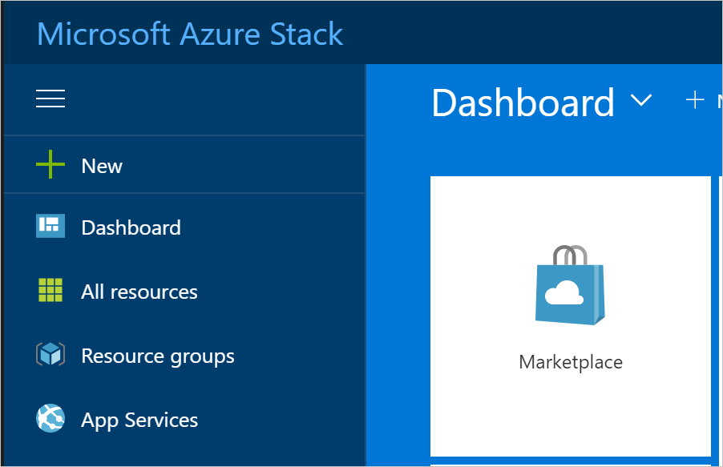

3. In **Marketplace**, select **Compute**, and then choose **More**. Under **More**, select the **Free SQL Server License: SQL Server 2017 Developer on Windows Server** image.

    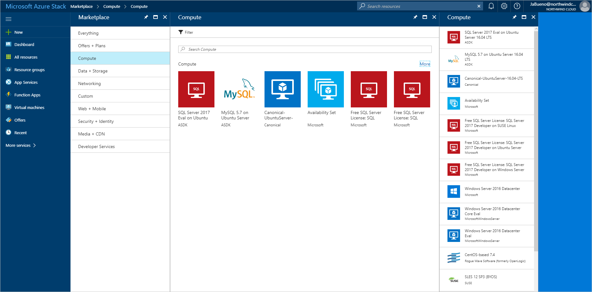

4. On **Free SQL Server License: SQL Server 2017 Developer on Windows Server**, select **Create**.

5. On **Basics > Configure basic settings**, provide a **Name** for the virtual machine (VM), a **User name** for the SQL Server SA, and a **Password** for the SA.  From the **Subscription** drop-down list, select the subscription that you're deploying to. For **Resource group**, use **Choose existing** and put the VM in the same resource group as your Azure Stack Hub web app.

    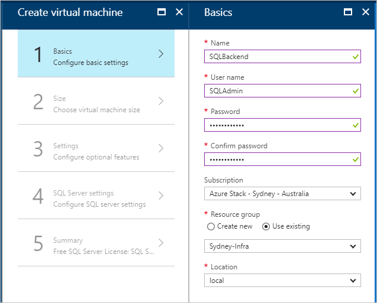

6. Under **Size**, pick a size for your VM. For this tutorial, we recommend A2_Standard or a DS2_V2_Standard.

7. Under **Settings > Configure optional features**, configure the following settings:

   - **Storage account**: Create a new account if you need one.
   - **Virtual network**:

     > [!Important]
     > Make sure your SQL Server VM is deployed on the same  virtual network as the VPN gateways.

   - **Public IP address**: Use the default settings.
   - **Network security group**: (NSG). Create a new NSG.
   - **Extensions and Monitoring**: Keep the default settings.
   - **Diagnostics storage account**: Create a new account if you need one.
   - Select **OK** to save your configuration.

     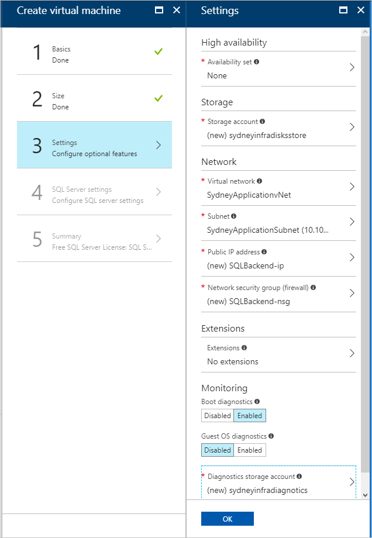

8. Under **SQL Server settings**, configure the following settings:

   - For **SQL connectivity**, select **Public (Internet)**.
   - For **Port**, keep the default, **1433**.
   - For **SQL authentication**, select **Enable**.

     > [!Note]
     > When you enable SQL authentication, it should auto-populate with the "SQLAdmin" information that you configured in **Basics**.

   - For the rest of the settings, keep the defaults. Select **OK**.

     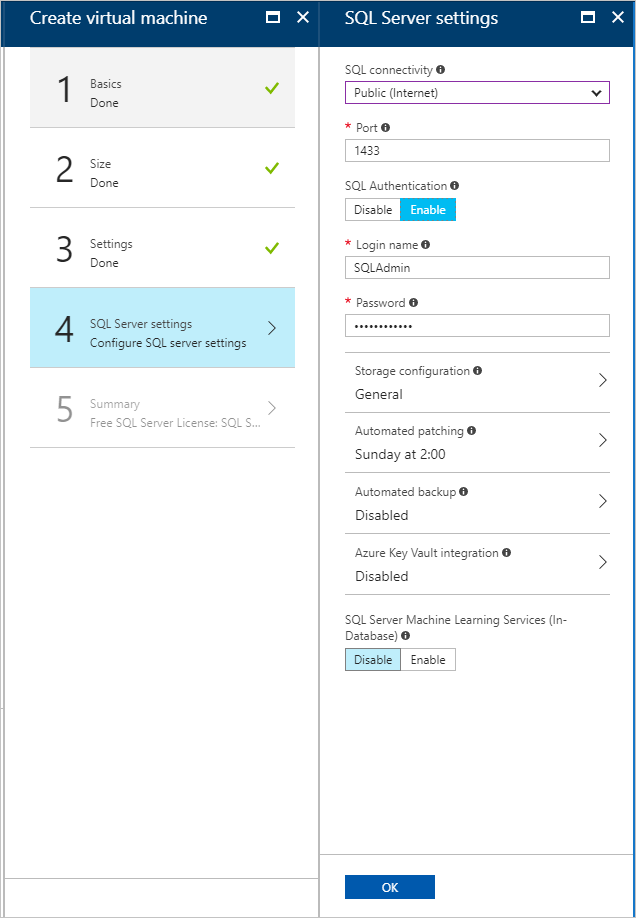

9. On **Summary**, review the VM configuration and then select **OK** to start the deployment.

    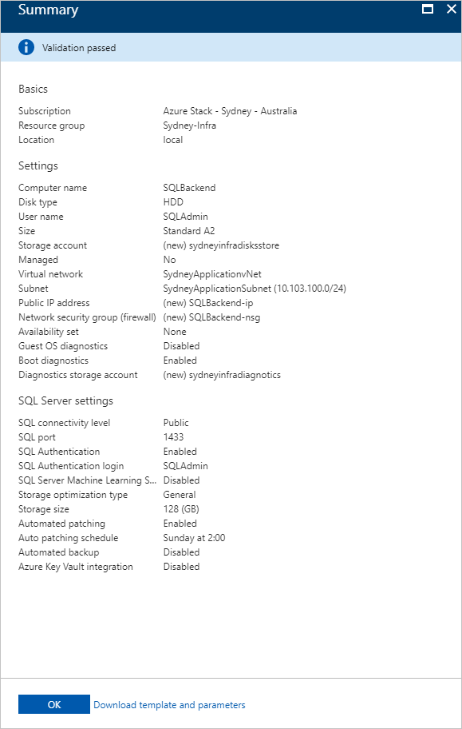

10. It takes some time to create the new VM. You can view the STATUS of your VMs in **Virtual machines**.

    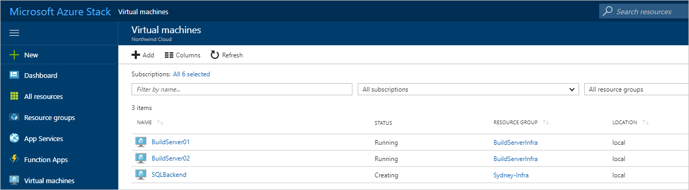

## Create web apps in Azure and Azure Stack Hub

The Azure App Service simplifies running and managing a web app. Because Azure Stack Hub is consistent with Azure,  the App Service can run in both environments. You'll use the App Service to host your app.

### Create web apps

1. Create a web app in Azure by following the instructions in [Manage an App Service plan in Azure](/azure/app-service/app-service-plan-manage#create-an-app-service-plan). Make sure you put the web app in the same subscription and resource group as your hybrid network.

2. Repeat the previous step (1) in Azure Stack Hub.

### Add route for Azure Stack Hub

The App Service on Azure Stack Hub must be routable from the public internet to let users access your app. If your Azure Stack Hub is accessible from the internet, make a note of the public-facing IP address or URL for the Azure Stack Hub web app.

If you're using an ASDK, you can [configure a static NAT mapping](/azure-stack/operator/azure-stack-create-vpn-connection-one-node#configure-the-nat-vm-on-each-asdk-for-gateway-traversal) to expose App Service outside the virtual environment.

### Connect a web app in Azure to a hybrid network

To provide connectivity between the web front end in Azure and the SQL Server database in Azure Stack Hub, the web app must be connected to the hybrid network between Azure and Azure Stack Hub. To enable connectivity, you'll have to:

- Configure point-to-site connectivity.
- Configure the web app.
- Modify the local network gateway in Azure Stack Hub.

### Configure the Azure virtual network for point-to-site connectivity

The virtual network gateway in the Azure side of the hybrid network must allow point-to-site connections to integrate with Azure App Service.

1. In the Azure portal, go to the virtual network gateway page. Under **Settings**, select **Point-to-site configuration**.

    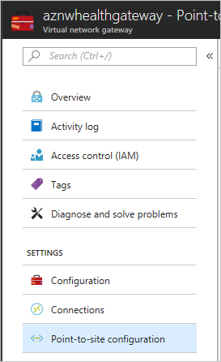

2. Select **Configure now** to configure point-to-site.

    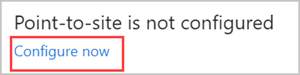

3. On the **Point-to-site** configuration page, enter the private IP address range that you want to use in **Address pool**.

   > [!Note]
   > Make sure that the range you specify doesn't overlap with any of the address ranges already used by subnets in the global Azure or Azure Stack Hub components of the hybrid network.

   Under **Tunnel Type**, uncheck the **IKEv2 VPN**. Select **Save** to finish configuring point-to-site.

   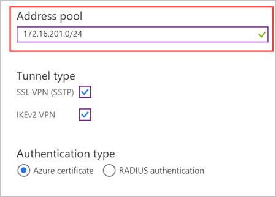

### Integrate the Azure App Service app with the hybrid network

1. To connect the app to the Azure VNet, follow the instructions in [Gateway required VNet integration](/azure/app-service/web-sites-integrate-with-vnet#gateway-required-vnet-integration).

2. Go to **Settings** for the App Service plan hosting the web app. In **Settings**, select **Networking**.

    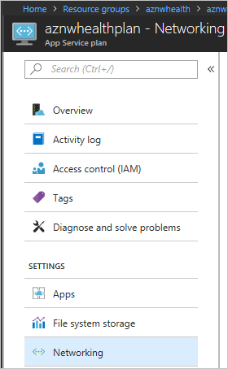

3. In **VNET Integration**, select **Click here to manage**.

    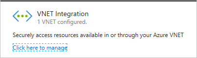

4. Select the VNET that you want to configure. Under **IP ADDRESSES ROUTED TO VNET**, enter the IP address range for the Azure VNet, the Azure Stack Hub VNet, and the point-to-site address spaces. Select **Save** to validate and save these settings.

    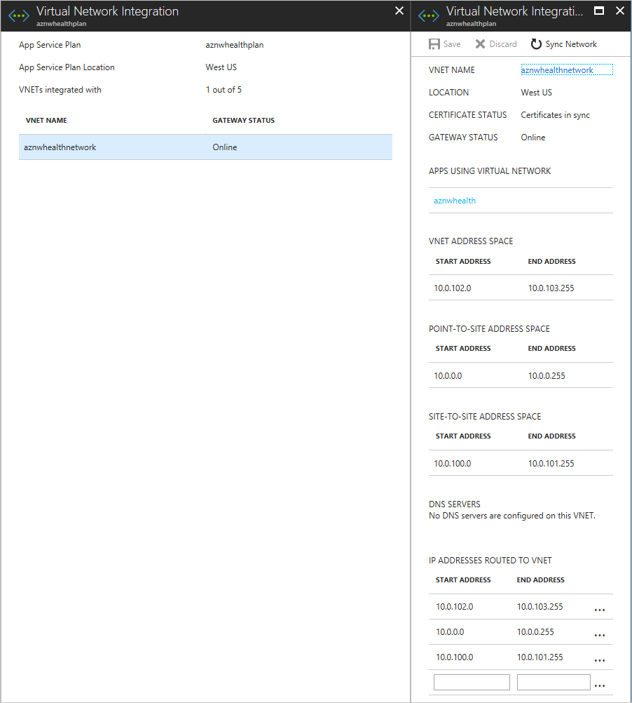

To learn more about how App Service integrates with Azure VNets, see [Integrate your app with an Azure Virtual Network](/azure/app-service/web-sites-integrate-with-vnet).

### Configure the Azure Stack Hub virtual network

The local network gateway in the Azure Stack Hub virtual network needs to be configured to route traffic from the App Service point-to-site address range.

1. In the Azure Stack Hub portal, go to **Local network gateway**. Under **Settings**, select **Configuration**.

    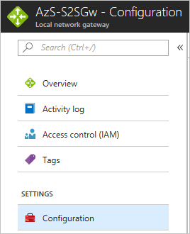

2. In **Address space**, enter the point-to-site address range for the virtual network gateway in Azure.

    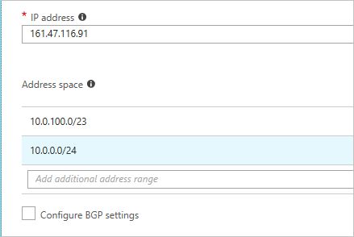

3. Select **Save** to validate and save the configuration.

## Configure DNS for cross-cloud scaling

By properly configuring DNS for cross-cloud apps, users can access the global Azure and Azure Stack Hub instances of your web app. The DNS configuration for this tutorial also lets Azure Traffic Manager route traffic when the load increases or decreases.

This tutorial uses Azure DNS to manage the DNS because App Service domains won't work.

### Create subdomains

Because Traffic Manager relies on DNS CNAMEs, a subdomain is needed to properly route traffic to endpoints. For more information about DNS records and domain mapping, see [map domains with Traffic Manager](/azure/app-service/web-sites-traffic-manager-custom-domain-name).

For the Azure endpoint, you'll create a subdomain that users can use to access your web app. For this tutorial, can use **app.northwind.com**, but you should customize this value based on your own domain.

You'll also need to create a subdomain with an A record for the Azure Stack Hub endpoint. You can use **azurestack.northwind.com**.

### Configure a custom domain in Azure

1. Add the **app.northwind.com** hostname to the Azure web app by [mapping a CNAME to Azure App Service](/azure/app-service/app-service-web-tutorial-custom-domain#map-a-cname-record).

### Configure custom domains in Azure Stack Hub

1. Add the **azurestack.northwind.com** hostname to the Azure Stack Hub web app by [mapping an A record to Azure App Service](/azure/app-service/app-service-web-tutorial-custom-domain#map-an-a-record). Use the internet-routable IP address for the App Service app.

2. Add the **app.northwind.com** hostname to the Azure Stack Hub web app by [mapping a CNAME to Azure App Service](/azure/app-service/app-service-web-tutorial-custom-domain#map-a-cname-record). Use the hostname you configured in the previous step (1) as the target for the CNAME.

## Configure SSL certificates for cross-cloud scaling

It's important to ensure sensitive data collected by your web app is secure in transit to and when stored on the SQL database.

You'll configure your Azure and Azure Stack Hub web apps to use SSL certificates for all incoming traffic.

### Add SSL to Azure and Azure Stack Hub

To add SSL to Azure:

1. Make sure that the SSL certificate you get is valid for the subdomain you created. (It's okay to use wildcard certificates.)

2. In the Azure portal, follow the instructions in the **Prepare your web app** and **Bind your SSL certificate** sections of the [Bind an existing custom SSL certificate to Azure Web Apps](/azure/app-service/app-service-web-tutorial-custom-ssl) article. Select **SNI-based SSL** as the **SSL Type**.

3. Redirect all traffic to the HTTPS port. Follow the instructions in the   **Enforce HTTPS** section of the [Bind an existing custom SSL certificate to Azure Web Apps](/azure/app-service/app-service-web-tutorial-custom-ssl) article.

To add SSL to Azure Stack Hub:

1. Repeat steps 1-3 that you used for Azure, using the Azure Stack Hub portal.

## Configure and deploy the web app

You'll configure the app code to report telemetry to the correct Application Insights instance and configure the web apps with the right connection strings. To learn more about Application Insights, see [What is Application Insights?](/azure/application-insights/app-insights-overview)

### Add Application Insights

1. Open your web app in Microsoft Visual Studio.

2. [Add Application Insights](/azure/azure-monitor/app/asp-net-core#enable-client-side-telemetry-for-web-applications) to your project to transmit the telemetry that Application Insights uses to create alerts when web traffic increases or decreases.

### Configure dynamic connection strings

Each instance of the web app will use a different method to connect to the SQL database. The app in Azure uses the private IP address of the SQL Server VM and the app in Azure Stack Hub uses the public IP address of the SQL Server VM.

> [!Note]
> On an Azure Stack Hub integrated system, the public IP address shouldn't be internet-routable. On an ASDK, the public IP address isn't routable outside the ASDK.

You can use App Service environment variables to pass a different connection string to each instance of the app.

1. Open the app in Visual Studio.

2. Open Startup.cs and find the following code block:

    ```csharp
    services.AddDbContext<MyDatabaseContext>(options =>
        options.UseSqlite("Data Source=localdatabase.db"));
    ```

3. Replace the previous code block with the following code, which uses a connection string defined in the *appsettings.json* file:

    ```csharp
    services.AddDbContext<MyDatabaseContext>(options =>
        options.UseSqlServer(Configuration.GetConnectionString("MyDbConnection")));
     // Automatically perform database migration
     services.BuildServiceProvider().GetService<MyDatabaseContext>().Database.Migrate();
    ```

### Configure App Service app settings

1. Create connection strings for Azure and Azure Stack Hub. The strings should be the same, except for the IP addresses that are used.

2. In Azure and Azure Stack Hub, add the appropriate connection string [as an app setting](/azure/app-service/web-sites-configure) in the web app, using `SQLCONNSTR\_` as a prefix in the name.

3. **Save** the web app settings and restart the app.

## Enable automatic scaling in global Azure

When you create your web app in an App Service environment, it starts with one instance. You can automatically scale out to add instances to provide more compute resources for your app. Similarly, you can automatically scale in and reduce the number of instances your app needs.

> [!Note]
> You need to have an App Service plan to configure scale out and scale in. If you don't have a plan, create one before starting the next steps.

### Enable automatic scale-out

1. In the Azure portal, find the App Service plan for the sites you want to scale out, and then select **Scale-out (App Service plan)**.

    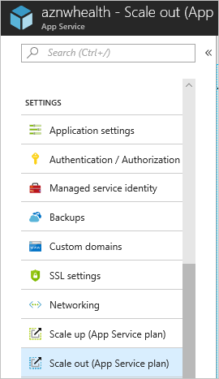

2. Select **Enable autoscale**.

    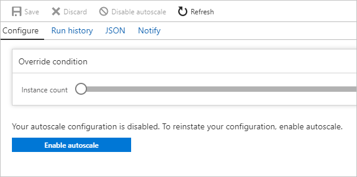

3. Enter a name for **Autoscale Setting Name**. For the **Default** auto scale rule, select **Scale based on a metric**. Set the **Instance limits** to **Minimum: 1**, **Maximum: 10**, and **Default: 1**.

    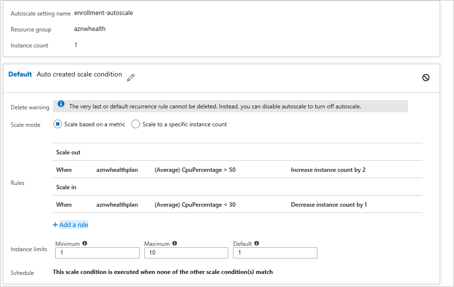

4. Select **+Add a rule**.

5. In **Metric Source**, select **Current Resource**. Use the following Criteria and Actions for the rule.

#### Criteria

1. Under **Time Aggregation,** select **Average**.

2. Under **Metric Name**, select **CPU Percentage**.

3. Under **Operator**, select **Greater than**.

   - Set the **Threshold** to **50**.
   - Set the **Duration** to **10**.

#### Action

1. Under **Operation**, select **Increase Count by**.

2. Set the **Instance Count** to **2**.

3. Set the **Cool down** to **5**.

4. Select **Add**.

5. Select the **+ Add a rule**.

6. In **Metric Source**, select **Current Resource.**

   > [!Note]
   > The current resource will contain your App Service plan's name/GUID and the **Resource Type** and **Resource** drop-down lists will be unavailable.

### Enable automatic scale in

When traffic decreases, the Azure web app can automatically reduce the number of active instances to reduce costs. This action is less aggressive than scale-out and minimizes the impact on app users.

1. Go to the **Default** scale out condition, then select **+ Add a rule**. Use the following Criteria and Actions for the rule.

#### Criteria

1. Under **Time Aggregation,** select **Average**.

2. Under **Metric Name**, select **CPU Percentage**.

3. Under **Operator**, select **Less than**.

   - Set the **Threshold** to **30**.
   - Set the **Duration** to **10**.

#### Action

1. Under **Operation**, select **Decrease Count by**.

   - Set the **Instance Count** to **1**.
   - Set the **Cool down** to **5**.

2. Select **Add**.

## Create a Traffic Manager profile and configure cross-cloud scaling

Create a Traffic Manager profile using the Azure portal, then configure endpoints to enable cross-cloud scaling.

### Create Traffic Manager profile

1. Select **Create a resource**.
2. Select **Networking**.
3. Select **Traffic Manager profile** and configure the following settings:

   - In **Name**, enter a name for your profile. This name **must** be unique in the trafficmanager.net zone and is used to create a new DNS name (for example, northwindstore.trafficmanager.net).
   - For **Routing method**, select the **Weighted**.
   - For **Subscription**, select the subscription you want to create  this profile in.
   - In **Resource Group**, create a new resource group for this profile.
   - In **Resource group location**, select the location of the resource group. This setting refers to the location of the resource group and has no impact on the Traffic Manager profile that's deployed globally.

4. Select **Create**.

    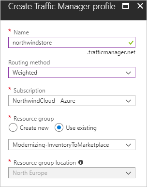

   When the global deployment of your Traffic Manager profile is complete, it's shown in the list of resources for the resource group you created it under.

### Add Traffic Manager endpoints

1. Search for the Traffic Manager profile you created. If you navigated to the resource group for the profile, select the profile.

2. In **Traffic Manager profile**, under **SETTINGS**, select **Endpoints**.

3. Select **Add**.

4. In **Add endpoint**, use the following settings for Azure Stack Hub:

   - For **Type**, select **External endpoint**.
   - Enter a **Name** for the endpoint.
   - For **Fully qualified domain name (FQDN) or IP**, enter the external URL for your Azure Stack Hub web app.
   - For **Weight**, keep the default, **1**. This weight results in all traffic going to this endpoint if it's healthy.
   - Leave **Add as disabled** unchecked.

5. Select **OK** to save the Azure Stack Hub endpoint.

You'll configure the Azure endpoint next.

1. On **Traffic Manager profile**, select **Endpoints**.
2. Select **+Add**.
3. On **Add endpoint**, use the following settings for Azure:

   - For **Type**, select **Azure endpoint**.
   - Enter a **Name** for the endpoint.
   - For **Target resource type**, select **App Service**.
   - For **Target resource**, select **Choose an app service** to see a list of Web Apps in the same subscription.
   - In **Resource**, pick the App service that you want to add as the first endpoint.
   - For **Weight**, select **2**. This setting results in all traffic going to this endpoint if the primary endpoint is unhealthy, or if you have a rule/alert that redirects traffic when triggered.
   - Leave **Add as disabled** unchecked.

4. Select **OK** to save the Azure endpoint.

After both endpoints are configured, they're listed in **Traffic Manager profile** when you select **Endpoints**. The example in the following screen capture shows two endpoints, with status and configuration information for each one.

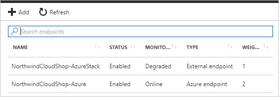

## Set up Application Insights monitoring and alerting in Azure

Azure Application Insights lets you monitor your app and send alerts based on conditions you configure. Some examples are: the app is unavailable, is experiencing failures, or is showing performance issues.

You'll use Azure Application Insights metrics to create alerts. When these alerts trigger, your web app's instance will automatically switch from Azure Stack Hub to Azure to scale out, and then back to Azure Stack Hub to scale in.

### Create an alert from metrics

In the Azure portal, go to the resource group for this tutorial, and select the Application Insights instance to open **Application Insights**.

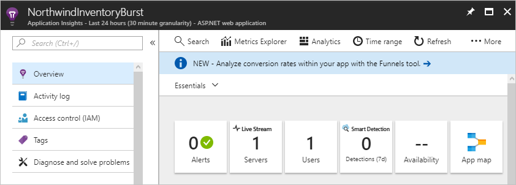

You'll use this view to create a scale-out alert and a scale-in alert.

### Create the scale-out alert

1. Under **CONFIGURE**, select **Alerts (classic)**.
2. Select **Add metric alert (classic)**.
3. In **Add rule**, configure the following settings:

   - For **Name**, enter **Burst into Azure Cloud**.
   - A **Description** is optional.
   - Under **Source** > **Alert on**, select **Metrics**.
   - Under **Criteria**, select your subscription, the resource group for your Traffic Manager profile, and the name of the Traffic Manager profile for the resource.

4. For **Metric**, select **Request Rate**.
5. For **Condition**, select **Greater than**.
6. For **Threshold**, enter **2**.
7. For **Period**, select **Over the last 5 minutes**.
8. Under **Notify via**:
   - Check the checkbox for **Email owners, contributors, and readers**.
   - Enter your email address for **Additional administrator email(s)**.

9. On the menu bar, select **Save**.

### Create the scale-in alert

1. Under **CONFIGURE**, select **Alerts (classic)**.
2. Select **Add metric alert (classic)**.
3. In **Add rule**, configure the following settings:

   - For **Name**, enter **Scale back into Azure Stack Hub**.
   - A **Description** is optional.
   - Under **Source** > **Alert on**, select **Metrics**.
   - Under **Criteria**, select your subscription, the resource group for your Traffic Manager profile, and the name of the Traffic Manager profile for the resource.

4. For **Metric**, select **Request Rate**.
5. For **Condition**, select **Less than**.
6. For **Threshold**, enter **2**.
7. For **Period**, select **Over the last 5 minutes**.
8. Under **Notify via**:
   - Check the checkbox for **Email owners, contributors, and readers**.
   - Enter your email address for **Additional administrator email(s)**.

9. On the menu bar, select **Save**.

The following screenshot shows the alerts for scale-out and scale-in.

   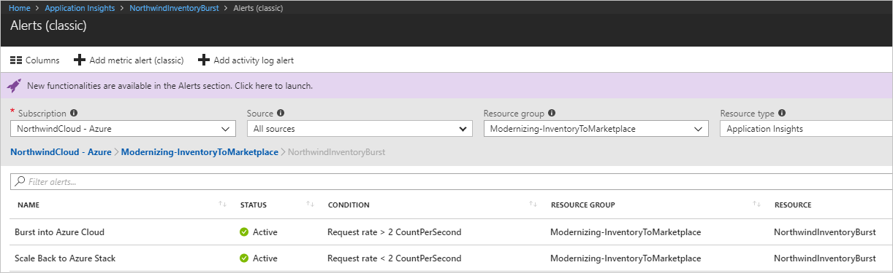

## Redirect traffic between Azure and Azure Stack Hub

You can configure manual or automatic switching of your web app traffic between Azure and Azure Stack Hub.

### Configure manual switching between Azure and Azure Stack Hub

When your web site reaches the thresholds that you configure, you'll receive an alert. Use the following steps to manually redirect traffic to Azure.

1. In the Azure portal, select your Traffic Manager profile.

    

2. Select **Endpoints**.
3. Select the **Azure endpoint**.
4. Under **Status**, select **Enabled**, and then select **Save**.

    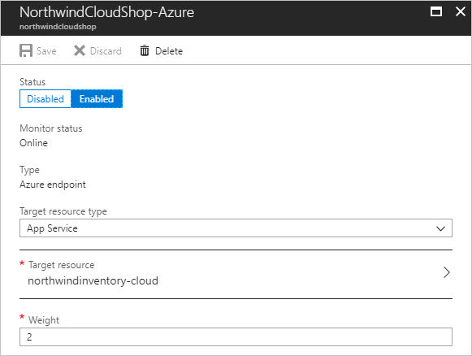

5. On **Endpoints** for the Traffic Manager profile, select **External endpoint**.
6. Under **Status**, select **Disabled**, and then select **Save**.

    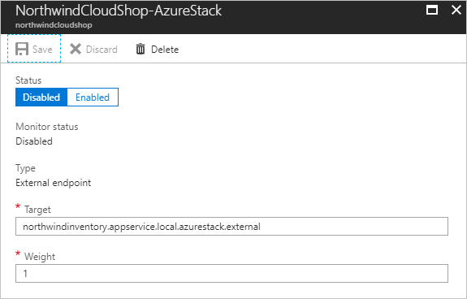

After the endpoints are configured, app traffic goes to your Azure scale-out web app instead of the Azure Stack Hub web app.

 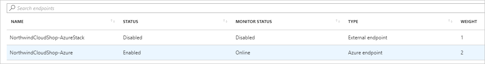

To reverse the flow back to Azure Stack Hub, use the previous steps to:

- Enable the Azure Stack Hub endpoint.
- Disable the Azure endpoint.

### Configure automatic switching between Azure and Azure Stack Hub

You can also use Application Insights monitoring if your app runs in a [serverless](https://azure.microsoft.com/overview/serverless-computing) environment provided by Azure Functions.

In this scenario, you can configure Application Insights to use a webhook that calls a function app. This app automatically enables or disables an endpoint in response to an alert.

Use the following steps as a guide to configure automatic traffic switching.

1. Create an Azure Function app.
2. Create an HTTP-triggered function.
3. Import the Azure SDKs for Resource Manager, Web Apps, and Traffic Manager.
4. Develop code to:

   - Authenticate to your Azure subscription.
   - Use a parameter that toggles the Traffic Manager endpoints to direct traffic to Azure or Azure Stack Hub.

5. Save your code and add the function app's URL with the appropriate parameters to the **Webhook** section of the Application Insights alert rule settings.
6. Traffic is automatically redirected when an Application Insights alert fires.

## Next steps:

- [Serverless computing](https://azure.microsoft.com/overview/serverless-computing)
- [Configure hybrid cloud identity with Azure and Azure Stack Hub apps](solution-deployment-guide-identity.md)
- [Bind an existing custom SSL certificate to Azure Web Apps](/azure/app-service/app-service-web-tutorial-custom-ssl)

## Related resources

- To learn more about Azure Cloud Patterns, see [Cloud Design Patterns](../../patterns/index.md).

See these additional hybrid deployment guides:

- [Configure hybrid cloud connectivity using Azure and Azure Stack Hub](/azure/architecture/hybrid/deployments/solution-deployment-guide-connectivity)
- [Configure hybrid cloud identity for Azure and Azure Stack Hub apps](/azure/architecture/hybrid/deployments/solution-deployment-guide-identity)
- [Deploy an app that scales cross-cloud using Azure and Azure Stack Hub](/azure/architecture/hybrid/deployments/solution-deployment-guide-cross-cloud-scaling)
- [Deploy a high availability Kubernetes cluster on Azure Stack Hub](/azure/architecture/hybrid/deployments/solution-deployment-guide-highly-available-kubernetes)
