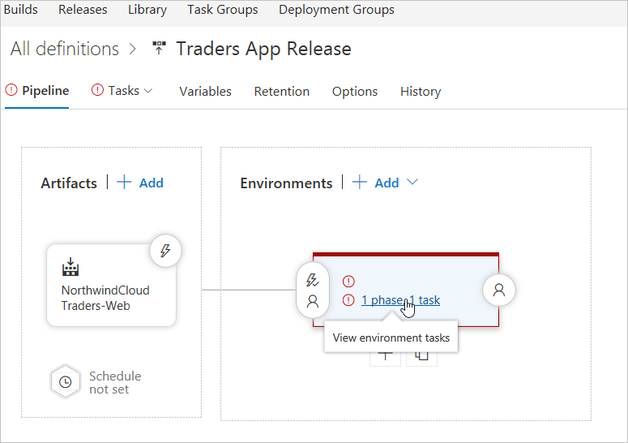
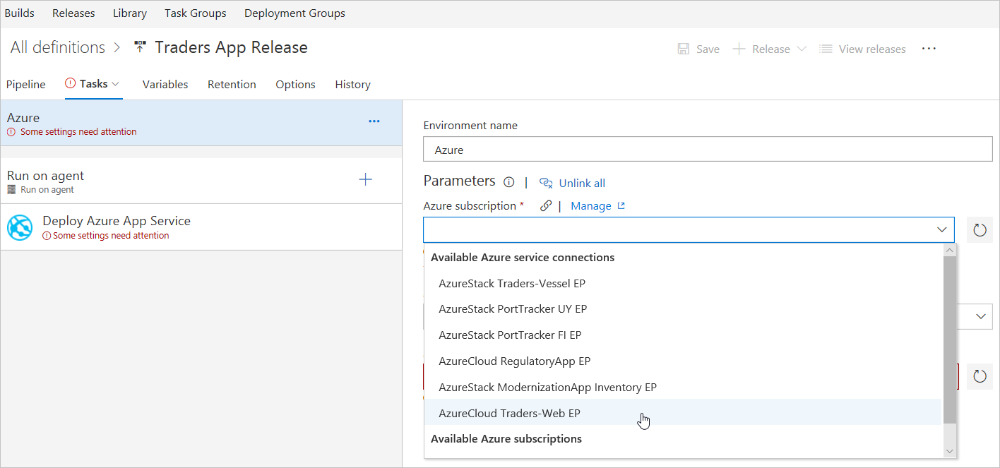
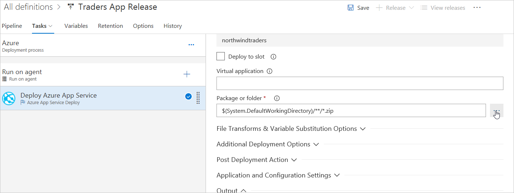
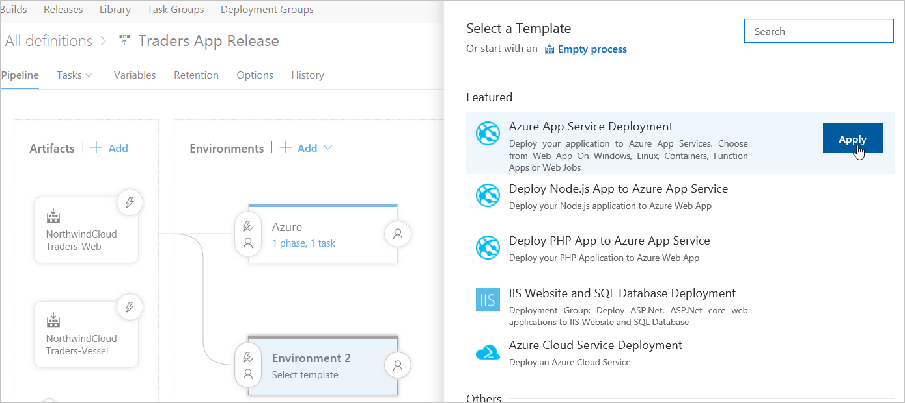
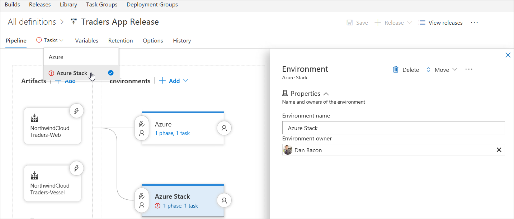
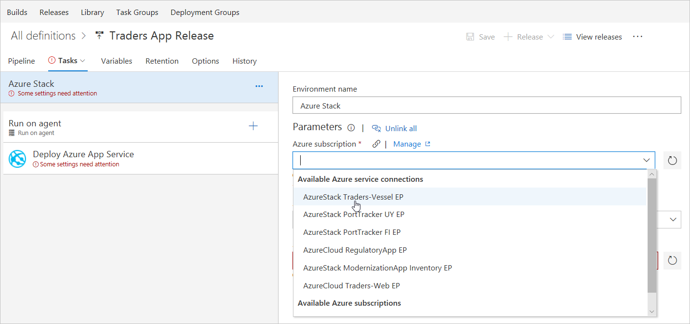
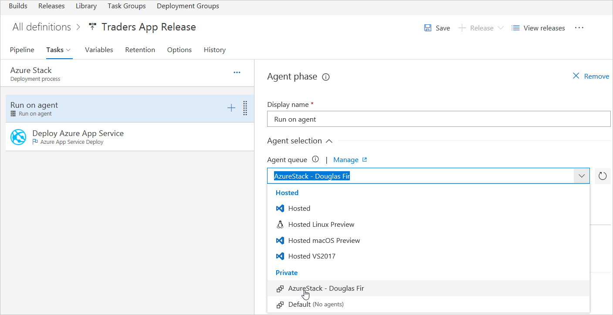
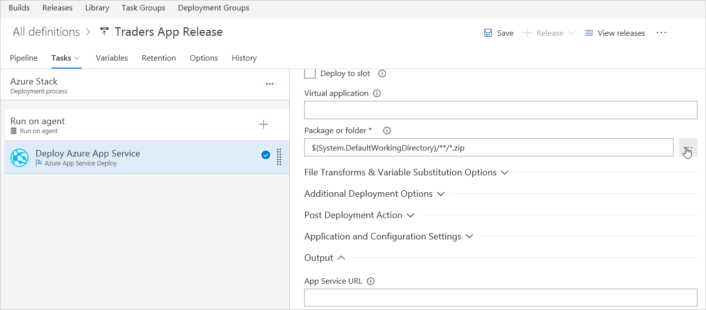
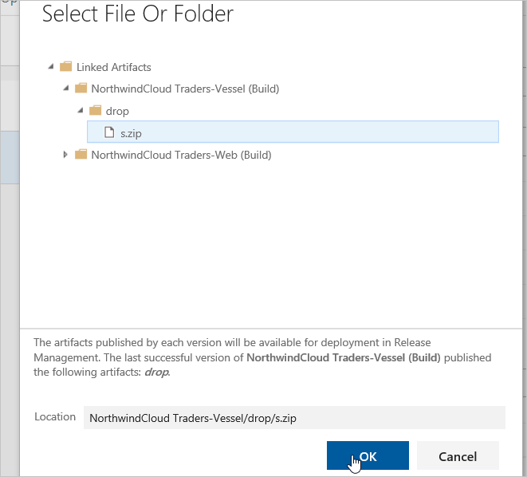

# Deploy an app that scales cross-cloud using Azure and Azure Stack Hub

Learn how to create a cross-cloud solution to provide a manually triggered process for switching from an Azure Stack Hub hosted web app to an Azure hosted web app with autoscaling via traffic manager. This process ensures flexible and scalable cloud utility when under load.

With this pattern, your tenant may not be ready to run your app in the public cloud. However, it may not be economically feasible for the business to maintain the capacity required in their on-premises environment to handle spikes in demand for the app. Your tenant can make use of the elasticity of the public cloud with their on-premises solution.

In this solution, you'll build a sample environment to:

> [!div class="checklist"]
> - Create a multi-node web app.
> - Configure and manage the Continuous Deployment (CD) process.
> - Publish the web app to Azure Stack Hub.
> - Create a release.
> - Learn to monitor and track your deployments.

> [!Tip]
> 
> Microsoft Azure Stack Hub is an extension of Azure. Azure Stack Hub brings the agility and innovation of cloud computing to your on-premises environment, enabling the only hybrid cloud that lets you build and deploy hybrid apps anywhere.
>
> The article [Hybrid app design considerations](/hybrid/app-solutions/overview-app-design-considerations) reviews pillars of software quality (placement, scalability, availability, resiliency, manageability, and security) for designing, deploying, and operating hybrid apps. The design considerations assist in optimizing hybrid app design, minimizing challenges in production environments.

## Prerequisites

- Azure subscription. If needed, create a [free account](https://azure.microsoft.com/free/?WT.mc_id=A261C142F) before beginning.
- An Azure Stack Hub integrated system or deployment of Azure Stack Development Kit (ASDK).
  - For instructions on installing Azure Stack Hub, see [Install the ASDK](/azure-stack/asdk/asdk-install).
  - For an ASDK post-deployment automation script, go to: [https://github.com/mattmcspirit/azurestack](https://github.com/mattmcspirit/azurestack)
  - This installation may require a few hours to complete.
- Deploy [App Service](/azure-stack/operator/azure-stack-app-service-deploy) PaaS services to Azure Stack Hub.
- [Create plans/offers](/azure-stack/operator/service-plan-offer-subscription-overview) within the Azure Stack Hub environment.
- [Create tenant subscription](/azure-stack/operator/azure-stack-subscribe-plan-provision-vm) within the Azure Stack Hub environment.
- Create a web app within the tenant subscription. Make note of the new web app URL for later use.
- Deploy Azure Pipelines virtual machine (VM) within the tenant subscription.
- Windows Server 2016 VM with .NET 3.5 is required. This VM will be built in the tenant subscription on Azure Stack Hub as the private build agent.
- [Windows Server 2016 with SQL 2017 VM image](/azure-stack/operator/azure-stack-add-vm-image) is available in the Azure Stack Hub Marketplace. If this image isn't available, work with an Azure Stack Hub Operator to ensure it's added to the environment.

## Issues and considerations

### Scalability

The key component of cross-cloud scaling is the ability to deliver immediate and on-demand scaling between public and on-premises cloud infrastructure, providing consistent and reliable service.

### Availability

Ensure locally deployed apps are configured for high-availability through on-premises hardware configuration and software deployment.

### Manageability

The cross-cloud solution ensures seamless management and familiar interface between environments. PowerShell is recommended for cross-platform management.

## Cross-cloud scaling

### Get a custom domain and configure DNS

Update the DNS zone file for the domain. Azure AD will verify ownership of the custom domain name. Use [Azure DNS](/azure/dns/dns-getstarted-portal) for Azure/Microsoft 365/external DNS records within Azure, or add the DNS entry at [a different DNS registrar](/microsoft-365/admin/get-help-with-domains/create-dns-records-at-any-dns-hosting-provider).

1. Register a custom domain with a public registrar.
2. Sign in to the domain name registrar for the domain. An approved admin may be required to make DNS updates.
3. Update the DNS zone file for the domain by adding the DNS entry provided by Azure AD. (The DNS entry won't affect email routing or web hosting behaviors.)

### Create a default multi-node web app in Azure Stack Hub

Set up hybrid continuous integration and continuous deployment (CI/CD) to deploy web apps to Azure and Azure Stack Hub and to autopush changes to both clouds.

> [!Note]
> Azure Stack Hub with proper images syndicated to run (Windows Server and SQL) and App Service deployment are required. For more information, review the App Service documentation [Prerequisites for deploying App Service on Azure Stack Hub](/azure-stack/operator/azure-stack-app-service-before-you-get-started).

### Add Code to Azure Repos

Azure Repos

1. Sign in to Azure Repos with an account that has project creation rights on Azure Repos.

    Hybrid CI/CD can apply to both app code and infrastructure code. Use [Azure Resource Manager templates](https://azure.microsoft.com/resources/templates/) for both private and hosted cloud development.

    

2. **Clone the repository** by creating and opening the default web app.

    

### Create self-contained web app deployment for App Services in both clouds

1. Edit the **WebApplication.csproj** file. Select `Runtimeidentifier` and add `win10-x64`. (See [Self-contained deployment](/dotnet/core/deploying/deploy-with-vs#simpleSelf) documentation.)

    

2. Check in the code to Azure Repos using Team Explorer.

3. Confirm that the app code has been checked into Azure Repos.

## Create the build definition

1. Sign in to Azure Pipelines to confirm the ability to create build definitions.

2. Add **-r win10-x64** code. This addition is necessary to trigger a self-contained deployment with .NET Core.

    

3. Run the build. The [self-contained deployment build](/dotnet/core/deploying/deploy-with-vs#simpleSelf) process will publish artifacts that run on Azure and Azure Stack Hub.

## Use an Azure hosted agent

Using a hosted build agent in Azure Pipelines is a convenient option to build and deploy web apps. Maintenance and upgrades are done automatically by Microsoft Azure, enabling a continuous and uninterrupted development cycle.

### Manage and configure the CD process

Azure Pipelines and Azure DevOps Services provide a highly configurable and manageable pipeline for releases to multiple environments like development, staging, QA, and production environments; including requiring approvals at specific stages.

## Create release definition

1. Select the **plus** button to add a new release under the **Releases** tab in the **Build and Release** section of Azure DevOps Services.

    

2. Apply the Azure App Service Deployment template.

   

3. Under **Add artifact**, add the artifact for the Azure Cloud build app.

   

4. Under Pipeline tab, select the **Phase, Task** link of the environment and set the Azure cloud environment values.

   

5. Set the **environment name** and select the **Azure subscription** for the Azure Cloud endpoint.

      

6. Under **App service name**, set the required Azure app service name.

      

7. Enter "Hosted VS2017" under **Agent queue** for Azure cloud hosted environment.

      

8. In Deploy Azure App Service menu, select the valid **Package or Folder** for the environment. Select **OK** to **folder location**.

      

      

9. Save all changes and go back to **release pipeline**.

    

10. Add a new artifact selecting the build for the Azure Stack Hub app.

    

11. Add one more environment by applying the Azure App Service Deployment.

    

12. Name the new environment "Azure Stack".

    

13. Find the Azure Stack environment under **Task** tab.

    

14. Select the subscription for the Azure Stack endpoint.

    

15. Set the Azure Stack web app name as the App service name.
    

16. Select the Azure Stack agent.

    

17. Under the Deploy Azure App Service section, select the valid **Package or Folder** for the environment. Select **OK** to folder location.

    

    

18. Under Variable tab add a variable named `VSTS\_ARM\_REST\_IGNORE\_SSL\_ERRORS`, set its value as **true**, and scope to Azure Stack.

    

19. Select the **Continuous** deployment trigger icon in both artifacts and enable the **Continues** deployment trigger.

    

20. Select the **Pre-deployment** conditions icon in the Azure Stack environment and set the trigger to **After release.**

    

21. Save all changes.

> [!Note]
> Some settings for the tasks may have been automatically defined as [environment variables](/azure/devops/pipelines/release/variables?tabs=batch#custom-variables) when creating a release definition from a template. These settings can't be modified in the task settings; instead, the parent environment item must be selected to edit these settings.

## Publish to Azure Stack Hub via Visual Studio

By creating endpoints, an Azure DevOps Services build can deploy Azure Service apps to Azure Stack Hub. Azure Pipelines connects to the build agent, which connects to Azure Stack Hub.

1. Sign in to Azure DevOps Services and go to the app settings page.

2. On **Settings**, select **Security**.

3. In **VSTS Groups**, select **Endpoint Creators**.

4. On the **Members** tab, select **Add**.

5. In **Add users and groups**, enter a user name and select that user from the list of users.

6. Select **Save changes**.

7. In the **VSTS Groups** list, select **Endpoint Administrators**.

8. On the **Members** tab, select **Add**.

9. In **Add users and groups**, enter a user name and select that user from the list of users.

10. Select **Save changes**.

Now that the endpoint information exists, the Azure Pipelines to Azure Stack Hub connection is ready to use. The build agent in Azure Stack Hub gets instructions from Azure Pipelines and then the agent conveys endpoint information for communication with Azure Stack Hub.

## Develop the app build

> [!Note]
> Azure Stack Hub with proper images syndicated to run (Windows Server and SQL) and App Service deployment are required. For more information, see [Prerequisites for deploying App Service on Azure Stack Hub](/azure-stack/operator/azure-stack-app-service-before-you-get-started).

Use [Azure Resource Manager templates](https://azure.microsoft.com/resources/templates/) like web app code from Azure Repos to deploy to both clouds.

### Add code to an Azure Repos project

1. Sign in to Azure Repos with an account that has project creation rights on Azure Stack Hub.

2. **Clone the repository** by creating and opening the default web app.

#### Create self-contained web app deployment for App Services in both clouds

1. Edit the **WebApplication.csproj** file: Select `Runtimeidentifier` and then add `win10-x64`. For more information, see [Self-contained deployment](/dotnet/core/deploying/deploy-with-vs#simpleSelf) documentation.

2. Use Team Explorer to check the code into Azure Repos.

3. Confirm that the app code was checked into Azure Repos.

### Create the build definition

1. Sign in to Azure Pipelines with an account that can create a build definition.

2. Go to the **Build Web Application** page for the project.

3. In **Arguments**, add **-r win10-x64** code. This addition is required to trigger a self-contained deployment with .NET Core.

4. Run the build. The [self-contained deployment build](/dotnet/core/deploying/deploy-with-vs#simpleSelf) process will publish artifacts that can run on Azure and Azure Stack Hub.

#### Use an Azure hosted build agent

Using a hosted build agent in Azure Pipelines is a convenient option to build and deploy web apps. Maintenance and upgrades are done automatically by Microsoft Azure, enabling a continuous and uninterrupted development cycle.

### Configure the continuous deployment (CD) process

Azure Pipelines and Azure DevOps Services provide a highly configurable and manageable pipeline for releases to multiple environments like development, staging, quality assurance (QA), and production. This process can include requiring approvals at specific stages of the app life cycle.

#### Create release definition

Creating a release definition is the final step in the app build process. This release definition is used to create a release and deploy a build.

1. Sign in to Azure Pipelines and go to **Build and Release** for the project.

2. On the **Releases** tab, select **[ + ]** and then pick **Create release definition**.

3. On **Select a Template**, choose **Azure App Service Deployment**, and then select **Apply**.

4. On **Add artifact**, from the **Source (Build definition)**, select the Azure Cloud build app.

5. On the **Pipeline** tab, select the **1 Phase**, **1 Task** link to **View environment tasks**.

6. On the **Tasks** tab, enter Azure as the **Environment name** and select the AzureCloud Traders-Web EP from the **Azure subscription** list.

7. Enter the **Azure app service name**, which is `northwindtraders` in the next screen capture.

8. For the Agent phase, select **Hosted VS2017** from the **Agent queue** list.

9. In **Deploy Azure App Service**, select the valid **Package or folder** for the environment.

10. In **Select File or Folder**, select **OK** to **Location**.

11. Save all changes and go back to **Pipeline**.

12. On the **Pipeline** tab, select **Add artifact**, and choose the **NorthwindCloud Traders-Vessel** from the **Source (Build Definition)** list.

13. On **Select a Template**, add another environment. Pick **Azure App Service Deployment** and then select **Apply**.

14. Enter `Azure Stack Hub` as the **Environment name**.

15. On the **Tasks** tab, find and select Azure Stack Hub.

16. From the **Azure subscription** list, select **AzureStack Traders-Vessel EP** for the Azure Stack Hub endpoint.

17. Enter the Azure Stack Hub web app name as the **App service name**.

18. Under **Agent selection**, pick **AzureStack -b Douglas Fir** from the **Agent queue** list.

19. For **Deploy Azure App Service**, select the valid **Package or folder** for the environment. On **Select File Or Folder**, select **OK** for the folder **Location**.

20. On the **Variable** tab, find the variable named `VSTS\_ARM\_REST\_IGNORE\_SSL\_ERRORS`. Set the variable value to **true**, and set its scope to **Azure Stack Hub**.

21. On the **Pipeline** tab, select the **Continuous deployment trigger** icon for the NorthwindCloud Traders-Web artifact and set the **Continuous deployment trigger** to **Enabled**. Do the same thing for the **NorthwindCloud Traders-Vessel** artifact.

22. For the Azure Stack Hub environment, select the **Pre-deployment conditions** icon set the trigger to **After release**.

23. Save all changes.

> [!Note]
> Some settings for release tasks are automatically defined as [environment variables](/azure/devops/pipelines/release/variables?tabs=batch#custom-variables) when creating a release definition from a template. These settings can't be modified in the task settings but can be modified in the parent environment items.

## Create a release

1. On the **Pipeline** tab, open the **Release** list and select **Create release**.

2. Enter a description for the release, check to see that the correct artifacts are selected, and then select **Create**. After a few moments, a banner appears indicating that the new release was created and the release name is displayed as a link. Select the link to see the release summary page.

3. The release summary page shows details about the release. In the following screen capture for "Release-2", the **Environments** section shows the **Deployment status** for Azure as "IN PROGRESS", and the status for Azure Stack Hub is "SUCCEEDED". When the deployment status for the Azure environment changes to "SUCCEEDED", a banner appears indicating that the release is ready for approval. When a deployment is pending or has failed, a blue **(i)** information icon is shown. Hover over the icon to see a pop-up that contains the reason for delay or failure.

4. Other views, like the list of releases, also display an icon that indicates approval is pending. The pop-up for this icon shows the environment name and more details related to the deployment. It's easy for an admin see the overall progress of releases and see which releases are waiting for approval.

## Monitor and track deployments

1. On the **Release-2** summary page, select **Logs**. During a deployment, this page shows the live log from the agent. The left pane shows the status of each operation in the deployment for each environment.

2. Select the person icon in the **Action** column for a pre-deployment or post-deployment approval to see who approved (or rejected) the deployment and the message they provided.

3. After the deployment finishes, the entire log file is displayed in the right pane. Select any **Step** in the left pane to see the log file for a single step, like **Initialize Job**. The ability to see individual logs makes it easier to trace and debug parts of the overall deployment. **Save** the log file for a step or **Download all logs as zip**.

4. Open the **Summary** tab to see general information about the release. This view shows details about the build, the environments it was deployed to, deployment status, and other information about the release.

5. Select an environment link (**Azure** or **Azure Stack Hub**) to see information about existing and pending deployments to a specific environment. Use these views as a quick way to check that the same build was deployed to both environments.

6. Open the **deployed production app** in a browser. For example, for the Azure App Services website, open the URL `https://[your-app-name\].azurewebsites.net`.

### Integration of Azure and Azure Stack Hub provides a scalable cross-cloud solution

A flexible and robust multi-cloud service provides data security, back up and redundancy, consistent and rapid availability, scalable storage and distribution, and geo-compliant routing. This manually triggered process ensures reliable and efficient load switching between hosted web apps and immediate availability of crucial data.

## Next steps

- To learn more about Azure Cloud Patterns, see [Cloud Design Patterns](../../patterns/index.md).
