# Direct traffic with a geo-distributed app using Azure and Azure Stack Hub

Learn how to direct traffic to specific endpoints based on various metrics using the geo-distributed apps pattern. Creating a Traffic Manager profile with geographic-based routing and endpoint configuration ensures information is routed to endpoints based on regional requirements, corporate and international regulation, and your data needs.

In this solution, you'll build a sample environment to:

> [!div class="checklist"]
> - Create a geo-distributed app.
> - Use Traffic Manager to target your app.

## Use the geo-distributed apps pattern

With the geo-distributed pattern, your app spans regions. You can default to the public cloud, but some of your users may require that their data remain in their region. You can direct users to the most suitable cloud based on their requirements.

### Issues and considerations

#### Scalability considerations

The solution you'll build with this article isn't to accommodate scalability. However, if used in combination with other Azure and on-premises solutions, you can accommodate scalability requirements. For information on creating a hybrid solution with autoscaling via traffic manager, see [Create cross-cloud scaling solutions with Azure](solution-deployment-guide-cross-cloud-scaling.md).

#### Availability considerations

As is the case with scalability considerations, this solution doesn't directly address availability. However, Azure and on-premises solutions can be implemented within this solution to ensure high availability for all components involved.

### When to use this pattern

- Your organization has international branches requiring custom regional security and distribution policies.

- Each of your organization's offices pulls employee, business, and facility data, which requires reporting activity per local regulations and time zones.

- High-scale requirements are met by horizontally scaling out apps with multiple app deployments within a single region and across regions to handle extreme load requirements.

### Planning the topology

Before building out a distributed app footprint, it helps to know the following things:

- **Custom domain for the app:** What's the custom domain name that customers will use to access the app? For the sample app, the custom domain name is *www\.scalableasedemo.com.*

- **Traffic Manager domain:** A domain name is chosen when creating an [Azure Traffic Manager profile](/azure/traffic-manager/traffic-manager-manage-profiles). This name is combined with the *trafficmanager.net* suffix to register a domain entry that's managed by Traffic Manager. For the sample app, the name chosen is *scalable-ase-demo*. As a result, the full domain name that's managed by Traffic Manager is *scalable-ase-demo.trafficmanager.net*.

- **Strategy for scaling the app footprint:** Decide whether the app footprint will be distributed across multiple App Service environments in a single region, multiple regions, or a mix of both approaches. The decision should be based on expectations of where customer traffic will originate and how well the rest of an app's supporting back-end infrastructure can scale. For example, with a 100% stateless app, an app can be massively scaled using a combination of multiple App Service environments per Azure region, multiplied by App Service environments deployed across multiple Azure regions. With 15+ global Azure regions available to choose from, customers can truly build a world-wide hyper-scale app footprint. For the sample app used here, three App Service environments were created in a single Azure region (South Central US).

- **Naming convention for the App Service environments:** Each App Service environment requires a unique name. Beyond one or two App Service environments, it's helpful to have a naming convention to help identify each App Service environment. For the sample app used here, a simple naming convention was used. The names of the three App Service environments are *fe1ase*, *fe2ase*, and *fe3ase*.

- **Naming convention for the apps:** Since multiple instances of the app will be deployed, a name is needed for each instance of the deployed app. With App Service Environment for Power Apps, the same app name can be used across multiple environments. Since each App Service environment has a unique domain suffix, developers can choose to reuse the exact same app name in each environment. For example, a developer could have apps named as follows: *myapp.foo1.p.azurewebsites.net*, *myapp.foo2.p.azurewebsites.net*, *myapp.foo3.p.azurewebsites.net*, and so on. For the app used here, each app instance has a unique name. The app instance names used are *webfrontend1*, *webfrontend2*, and *webfrontend3*.

> [!Tip]
> 
> Microsoft Azure Stack Hub is an extension of Azure. Azure Stack Hub brings the agility and innovation of cloud computing to your on-premises environment, enabling the only hybrid cloud that allows you to build and deploy hybrid apps anywhere.
>
> The article [Hybrid app design considerations](/hybrid/app-solutions/overview-app-design-considerations) reviews pillars of software quality (placement, scalability, availability, resiliency, manageability, and security) for designing, deploying, and operating hybrid apps. The design considerations assist in optimizing hybrid app design, minimizing challenges in production environments.

## Part 1: Create a geo-distributed app

In this part, you'll create a web app.

> [!div class="checklist"]
> - Create web apps and publish.
> - Add code to Azure Repos.
> - Point the app build to multiple cloud targets.
> - Manage and configure the CD process.

### Prerequisites

An Azure subscription and Azure Stack Hub installation are required.

### Geo-distributed app steps

### Obtain a custom domain and configure DNS

Update the DNS zone file for the domain. Azure AD can then verify ownership of the custom domain name. Use [Azure DNS](/azure/dns/dns-getstarted-portal) for Azure/Microsoft 365/external DNS records within Azure, or add the DNS entry at [a different DNS registrar](/microsoft-365/admin/get-help-with-domains/create-dns-records-at-any-dns-hosting-provider).

1. Register a custom domain with a public registrar.

2. Sign in to the domain name registrar for the domain. An approved admin may be required to make the DNS updates.

3. Update the DNS zone file for the domain by adding the DNS entry provided by Azure AD. The DNS entry doesn't change behaviors such as mail routing or web hosting.

### Create web apps and publish

Set up Hybrid Continuous Integration/Continuous Delivery (CI/CD) to deploy Web App to Azure and Azure Stack Hub, and auto push changes to both clouds.

> [!Note]
> Azure Stack Hub with proper images syndicated to run (Windows Server and SQL) and App Service deployment are required. For more information, see [Prerequisites for deploying App Service on Azure Stack Hub](/azure-stack/operator/azure-stack-app-service-before-you-get-started).

#### Add Code to Azure Repos

1. Sign in to Visual Studio with an **account that has project creation rights** on Azure Repos.

    CI/CD can apply to both app code and infrastructure code. Use [Azure Resource Manager templates](https://azure.microsoft.com/resources/templates/) for both private and hosted cloud development.

    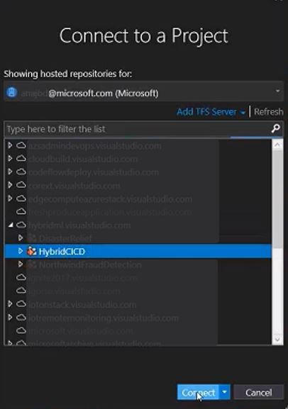

2. **Clone the repository** by creating and opening the default web app.

    

### Create web app deployment in both clouds

1. Edit the **WebApplication.csproj** file: Select `Runtimeidentifier` and add `win10-x64`. (See [Self-contained Deployment](/dotnet/core/deploying/deploy-with-vs#simpleSelf) documentation.)

    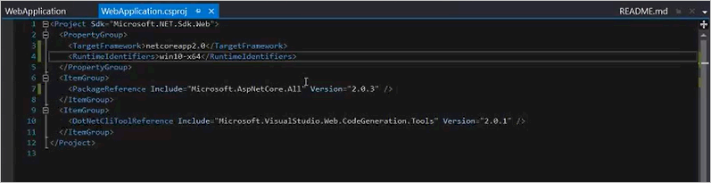

2. **Check in the code to Azure Repos** using Team Explorer.

3. Confirm that the **application code** has been checked into Azure Repos.

### Create the build definition

1. **Sign in to Azure Pipelines** to confirm ability to create build definitions.

2. Add `-r win10-x64` code. This addition is necessary to trigger a self-contained deployment with .NET Core.

    

3. **Run the build**. The [self-contained deployment build](/dotnet/core/deploying/deploy-with-vs#simpleSelf) process will publish artifacts that can run on Azure and Azure Stack Hub.

#### Using an Azure Hosted Agent

Using a hosted agent in Azure Pipelines is a convenient option to build and deploy web apps. Maintenance and upgrades are automatically performed by Microsoft Azure, which enables uninterrupted development, testing, and deployment.

### Manage and configure the CD process

Azure DevOps Services provide a highly configurable and manageable pipeline for releases to multiple environments such as development, staging, QA, and production environments; including requiring approvals at specific stages.

## Create release definition

1. Select the **plus** button to add a new release under the **Releases** tab in the **Build and Release** section of Azure DevOps Services.

    

2. Apply the Azure App Service Deployment template.

   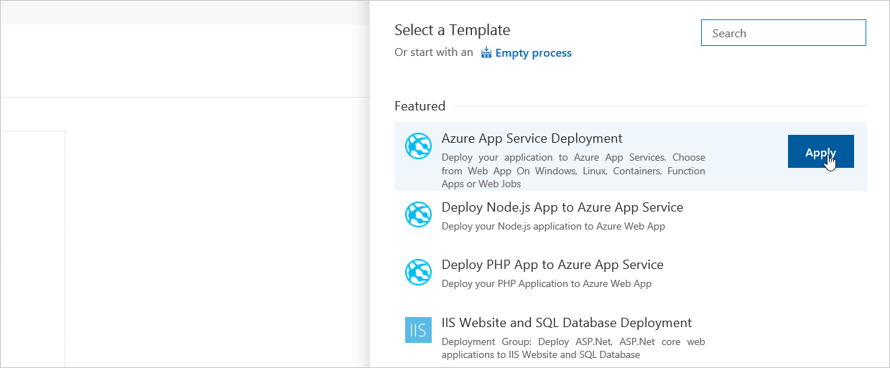

3. Under **Add artifact**, add the artifact for the Azure Cloud build app.

   

4. Under Pipeline tab, select the **Phase, Task** link of the environment and set the Azure cloud environment values.

   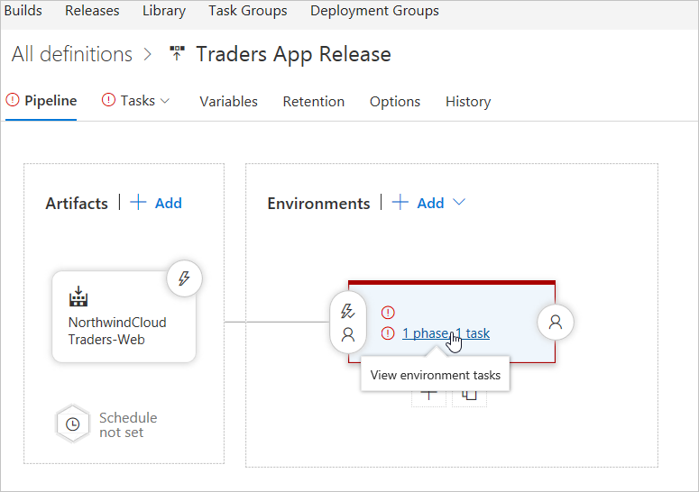

5. Set the **environment name** and select the **Azure subscription** for the Azure Cloud endpoint.

      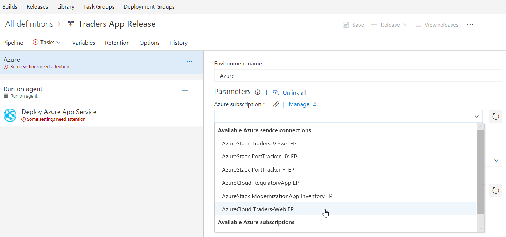

6. Under **App service name**, set the required Azure app service name.

      

7. Enter "Hosted VS2017" under **Agent queue** for Azure cloud hosted environment.

      

8. In Deploy Azure App Service menu, select the valid **Package or Folder** for the environment. Select **OK** to **folder location**.

      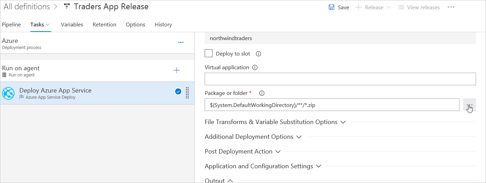

      

9. Save all changes and go back to **release pipeline**.

    

10. Add a new artifact selecting the build for the Azure Stack Hub app.

    

11. Add one more environment by applying the Azure App Service Deployment.

    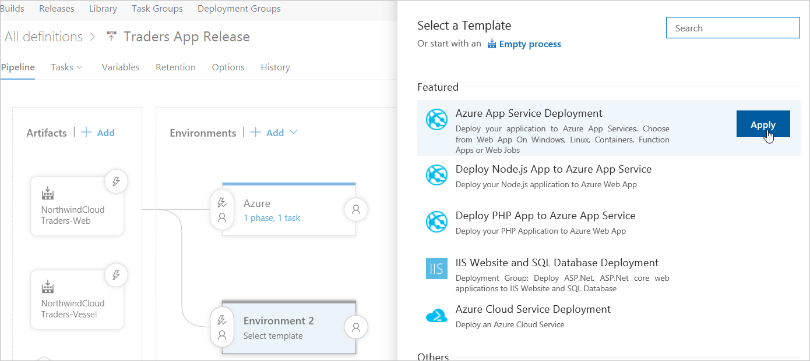

12. Name the new environment Azure Stack Hub.

    

13. Find the Azure Stack Hub environment under **Task** tab.

    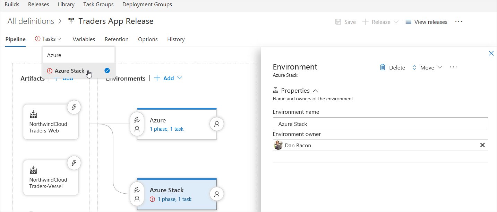

14. Select the subscription for the Azure Stack Hub endpoint.

    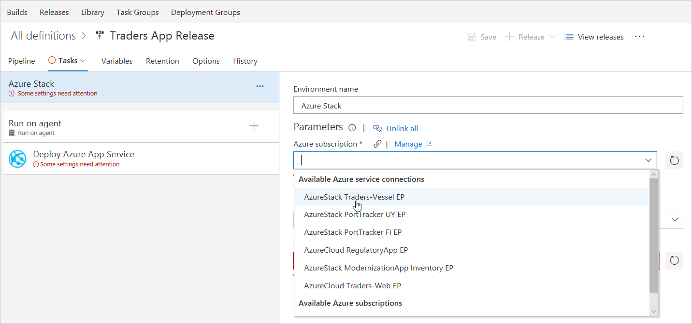

15. Set the Azure Stack Hub web app name as the App service name.

    

16. Select the Azure Stack Hub agent.

    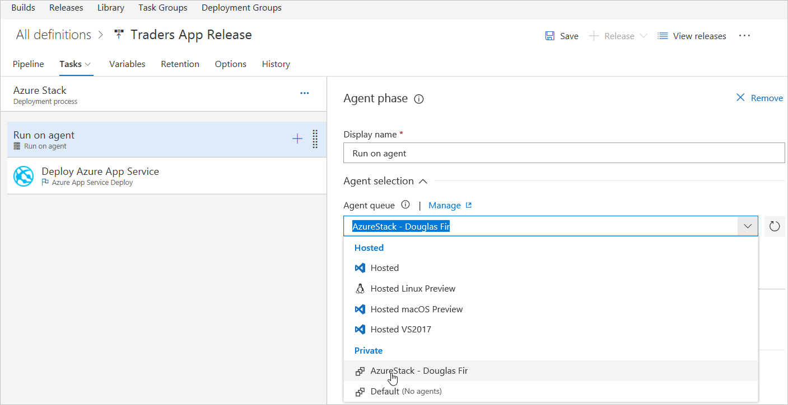

17. Under the Deploy Azure App Service section, select the valid **Package or Folder** for the environment. Select **OK** to folder location.

    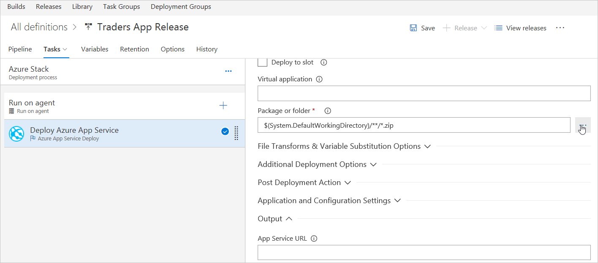

    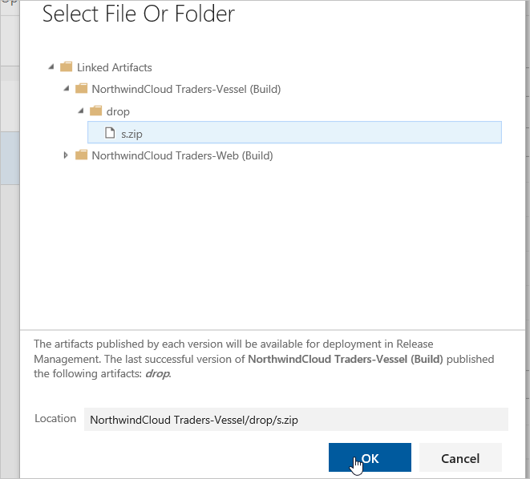

18. Under Variable tab add a variable named `VSTS\_ARM\_REST\_IGNORE\_SSL\_ERRORS`, set its value as **true**, and scope to Azure Stack Hub.

    

19. Select the **Continuous** deployment trigger icon in both artifacts and enable the **Continues** deployment trigger.

    

20. Select the **Pre-deployment** conditions icon in the Azure Stack Hub environment and set the trigger to **After release.**

    

21. Save all changes.

> [!Note]
> Some settings for the tasks may have been automatically defined as [environment variables](/azure/devops/pipelines/release/variables?tabs=batch#custom-variables) when creating a release definition from a template. These settings can't be modified in the task settings; instead, the parent environment item must be selected to edit these settings.

## Part 2: Update web app options

[Azure App Service](/azure/app-service/overview) provides a highly scalable, self-patching web hosting service.

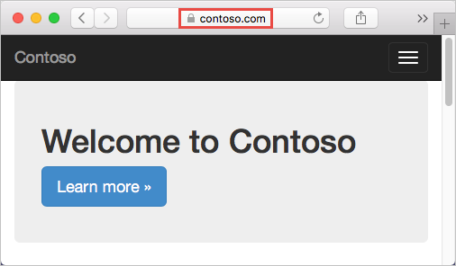

> [!div class="checklist"]
> - Map an existing custom DNS name to Azure Web Apps.
> - Use a **CNAME record** and an **A record** to map a custom DNS name to App Service.

### Map an existing custom DNS name to Azure Web Apps

> [!Note]
> Use a CNAME for all custom DNS names except a root domain (for example, northwind.com).

To migrate a live site and its DNS domain name to App Service, see [Migrate an active DNS name to Azure App Service](/azure/app-service/manage-custom-dns-migrate-domain).

### Prerequisites

To complete this solution:

- [Create an App Service app](/azure/app-service/), or use an app created for another  solution.

- Purchase a domain name and ensure access to the DNS registry for the domain provider.

Update the DNS zone file for the domain. Azure AD will verify ownership of the custom domain name. Use [Azure DNS](/azure/dns/dns-getstarted-portal) for Azure/Microsoft 365/external DNS records within Azure, or add the DNS entry at [a different DNS registrar](/microsoft-365/admin/get-help-with-domains/create-dns-records-at-any-dns-hosting-provider).

- Register a custom domain with a public registrar.

- Sign in to the domain name registrar for the domain. (An approved admin may be required to make DNS updates.)

- Update the DNS zone file for the domain by adding the DNS entry provided by Azure AD.

For example, to add DNS entries for northwindcloud.com and www\.northwindcloud.com, configure DNS settings for the northwindcloud.com root domain.

> [!Note]
> A domain name may be purchased using the [Azure portal](/azure/app-service/manage-custom-dns-buy-domain). To map a custom DNS name to a web app, the web app's [App Service plan](https://azure.microsoft.com/pricing/details/app-service/) must be a paid tier (**Shared**, **Basic**, **Standard**, or **Premium**).

### Create and map CNAME and A records

#### Access DNS records with domain provider

> [!Note]
>  Use Azure DNS to configure a custom DNS name for Azure Web Apps. For more information, see [Use Azure DNS to provide custom domain settings for an Azure service](/azure/dns/dns-custom-domain).

1. Sign in to the website of the main provider.

2. Find the page for managing DNS records. Every domain provider has its own DNS records interface. Look for areas of the site labeled **Domain Name**, **DNS**, or **Name Server Management**.

DNS records page can be viewed in **My domains**. Find the link named **Zone file**, **DNS Records**, or **Advanced configuration**.

The following screenshot is an example of a DNS records page:

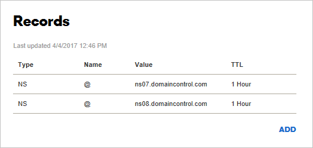

1. In Domain Name Registrar, select **Add or Create** to create a record. Some providers have different links to add different record types. Consult the provider's documentation.

2. Add a CNAME record to map a subdomain to the app's default hostname.

   For the www\.northwindcloud.com domain example, add a CNAME record that maps the name to `<app_name>.azurewebsites.net`.

After adding the CNAME, the DNS records page looks like the following example:

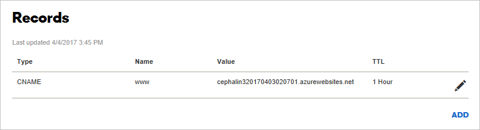

### Enable the CNAME record mapping in Azure

1. In a new tab, sign in to the Azure portal.

2. Go to App Services.

3. Select web app.

4. In the left navigation of the app page in the Azure portal, select **Custom domains**.

5. Select the **+** icon next to **Add hostname**.

6. Type the fully qualified domain name, like `www.northwindcloud.com`.

7. Select **Validate**.

8. If indicated, add additional records of other types (`A` or `TXT`) to the domain name registrars DNS records. Azure will provide the values and types of these records:

   a.  An **A** record to map to the app's IP address.

   b.  A **TXT** record to map to the app's default hostname `<app_name>.azurewebsites.net`. App Service uses this record only at configuration time to verify custom domain ownership. After verification, delete the TXT record.

9. Complete this task in the domain registrar tab and revalidate until the **Add hostname** button is activated.

10. Make sure that **Hostname record type** is set to **CNAME** (www.example.com or any subdomain).

11. Select **Add hostname**.

12. Type the fully qualified domain name, like `northwindcloud.com`.

13. Select **Validate**. The **Add** is activated.

14. Make sure that **Hostname record type** is set to **A record** (example.com).

15. **Add hostname**.

    It might take some time for the new hostnames to be reflected in the app's **Custom domains** page. Try refreshing the browser to update the data.

    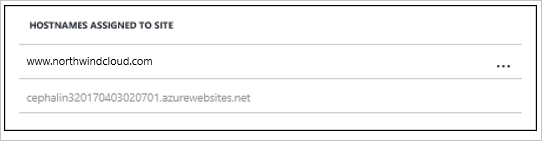

    If there's an error, a verification error notification will appear at the bottom of the page. 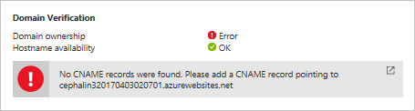

> [!Note]
>  The above steps may be repeated to map a wildcard domain (\*.northwindcloud.com). This allows the addition of any additional subdomains to this app service without having to create a separate CNAME record for each one. Follow the registrar instructions to configure this setting.

#### Test in a browser

Browse to the DNS name(s) configured earlier (for example, `northwindcloud.com` or `www.northwindcloud.com`).

## Part 3: Bind a custom SSL cert

In this part, we will:

> [!div class="checklist"]
> - Bind the custom SSL certificate to App Service.
> - Enforce HTTPS for the app.
> - Automate SSL certificate binding with scripts.

> [!Note]
> If needed, obtain a customer SSL certificate in the Azure portal and bind it to the web app. For more information, see the [App Service Certificates tutorial](/azure/app-service/web-sites-purchase-ssl-web-site).

### Prerequisites

To complete this solution:

- [Create an App Service app.](/azure/app-service/)
- [Map a custom DNS name to your web app.](/azure/app-service/app-service-web-tutorial-custom-domain)
- Acquire an SSL certificate from a trusted certificate authority and use the key to sign the request.

### Requirements for your SSL certificate

To use a certificate in App Service, the certificate must meet all the following requirements:

- Signed by a trusted certificate authority.

- Exported as a password-protected PFX file.

- Contains private key at least 2048 bits long.

- Contains all intermediate certificates in the certificate chain.

> [!Note]
> **Elliptic Curve Cryptography (ECC) certificates** work with App Service but aren't included in this guide. Consult a certificate authority for assistance in creating ECC certificates.

#### Prepare the web app

To bind a custom SSL certificate to the web app, the [App Service plan](https://azure.microsoft.com/pricing/details/app-service/) must be in the **Basic**, **Standard**, or **Premium** tier.

#### Sign in to Azure

1. Open the [Azure portal](https://portal.azure.com/) and go to the web app.

2. From the left menu, select **App Services**, and then select the web app name.

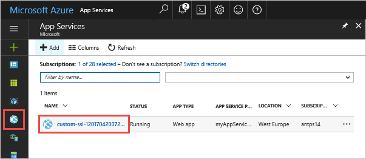

#### Check the pricing tier

1. In the left-hand navigation of the web app page, scroll to the **Settings** section and select **Scale up (App Service plan)**.

    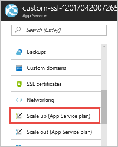

1. Ensure the web app isn't in the **Free** or **Shared** tier. The web app's current tier is highlighted in a dark blue box.

    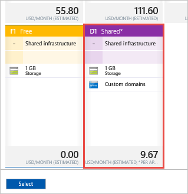

Custom SSL isn't supported in the **Free** or **Shared** tier. To upscale, follow the steps in the next section or the **Choose your pricing tier** page and skip to [Upload and bind your SSL certificate](/azure/app-service/app-service-web-tutorial-custom-ssl).

#### Scale up your App Service plan

1. Select one of the **Basic**, **Standard**, or **Premium** tiers.

2. Select **Select**.

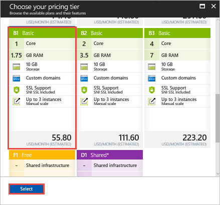

The scale operation is complete when notification is displayed.

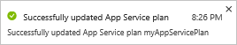

#### Bind your SSL certificate and merge intermediate certificates

Merge multiple certificates in the chain.

1. **Open each certificate** you received in a text editor.

2. Create a file for the merged certificate called *mergedcertificate.crt*. In a text editor, copy the content of each certificate into this file. The order of your certificates should follow the order in the certificate chain, beginning with your certificate and ending with the root certificate. It looks like the following example:

    ```text

    -----BEGIN CERTIFICATE-----

    <your entire Base64 encoded SSL certificate>

    -----END CERTIFICATE-----

    -----BEGIN CERTIFICATE-----

    <The entire Base64 encoded intermediate certificate 1>

    -----END CERTIFICATE-----

    -----BEGIN CERTIFICATE-----

    <The entire Base64 encoded intermediate certificate 2>

    -----END CERTIFICATE-----

    -----BEGIN CERTIFICATE-----

    <The entire Base64 encoded root certificate>

    -----END CERTIFICATE-----
    ```

#### Export certificate to PFX

Export the merged SSL certificate with the private key generated by the certificate.

A private key file is created via OpenSSL. To export the certificate to PFX, run the following command and replace the placeholders `<private-key-file>` and `<merged-certificate-file>` with the private key path and the merged certificate file:

```powershell
openssl pkcs12 -export -out myserver.pfx -inkey <private-key-file> -in <merged-certificate-file>
```

When prompted, define an export password for uploading your SSL certificate to App Service later.

When IIS or **Certreq.exe** are used to generate the certificate request, install the certificate to a local machine and then [export the certificate to PFX](/previous-versions/windows/it-pro/windows-server-2008-R2-and-2008/cc754329(v=ws.11)).

#### Upload the SSL certificate

1. Select **SSL settings** in the left navigation of the web app.

2. Select **Upload Certificate**.

3. In **PFX Certificate File**, select PFX file.

4. In **Certificate password**, type the password created when exporting the PFX file.

5. Select **Upload**.

    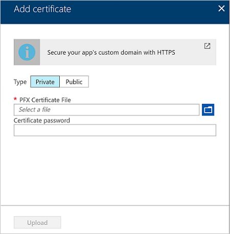

When App Service finishes uploading the certificate, it appears in the **SSL settings** page.

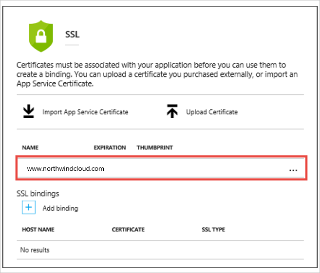

#### Bind your SSL certificate

1. In the **SSL bindings** section, select **Add binding**.

    > [!Note]
    >  If the certificate has been uploaded, but doesn't appear in domain name(s) in the **Hostname** dropdown, try refreshing the browser page.

2. In the **Add SSL Binding** page, use the drop downs to select the domain name to secure and the certificate to use.

3. In **SSL Type**, select whether to use [**Server Name Indication (SNI)**](https://en.wikipedia.org/wiki/Server_Name_Indication) or IP-based SSL.

    - **SNI-based SSL**: Multiple SNI-based SSL bindings may be added. This option allows multiple SSL certificates to secure multiple domains on the same IP address. Most modern browsers (including Internet Explorer, Chrome, Firefox, and Opera) support SNI (find more comprehensive browser support information at [Server Name Indication](https://wikipedia.org/wiki/Server_Name_Indication)).

    - **IP-based SSL**: Only one IP-based SSL binding may be added. This option allows only one SSL certificate to secure a dedicated public IP address. To secure multiple domains, secure them all using the same SSL certificate. IP-based SSL is the traditional option for SSL binding.

4. Select **Add Binding**.

    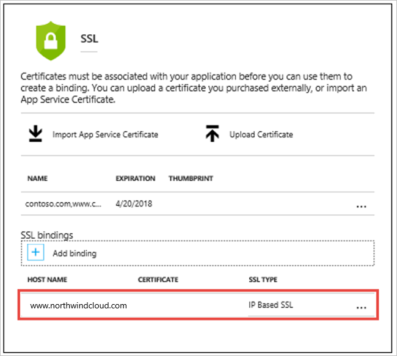

When App Service finishes uploading the certificate, it appears in the **SSL bindings** sections.

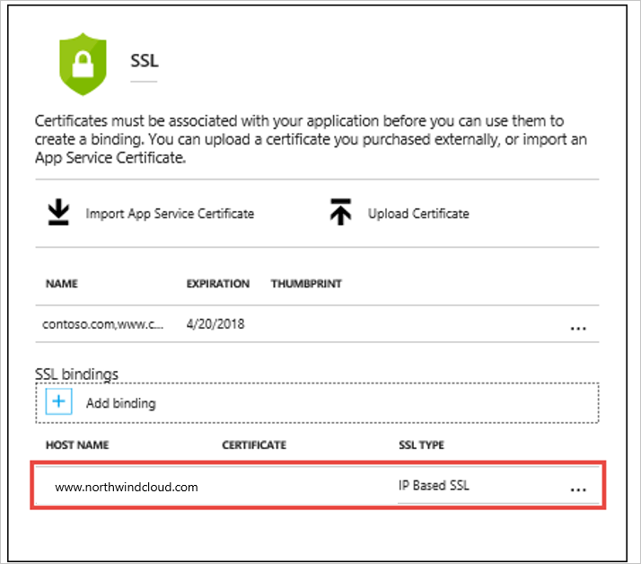

#### Remap the A record for IP SSL

If IP-based SSL isn't used in the web app, skip to [Test HTTPS for your custom domain](/azure/app-service/app-service-web-tutorial-custom-ssl).

By default, the web app uses a shared public IP address. When the certificate is bound with IP-based SSL, App Service creates a new and dedicated IP address for the web app.

When an A record is mapped to the web app, the domain registry must be updated with the dedicated IP address.

The **Custom domain** page is updated with the new, dedicated IP address. Copy this [IP address](/azure/app-service/app-service-web-tutorial-custom-domain), then remap the [A record](/azure/app-service/app-service-web-tutorial-custom-domain) to this new IP address.

#### Test HTTPS

In different browsers, go to `https://<your.custom.domain>` to ensure the web app is served.

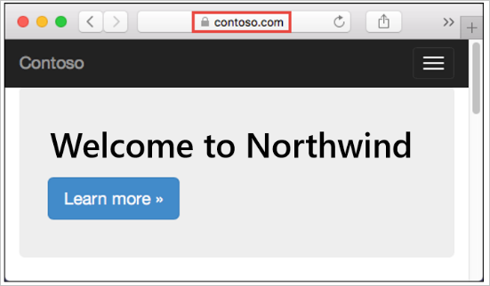

> [!Note]
> If certificate validation errors occur, a self-signed certificate may be the cause, or intermediate certificates may have been left off when exporting to the PFX file.

#### Enforce HTTPS

By default, anyone can access the web app using HTTP. All HTTP requests to the HTTPS port may be redirected.

In the web app page, select **SL settings**. Then, in **HTTPS Only**, select **On**.

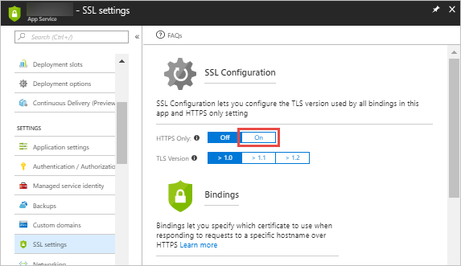

When the operation is complete, go to any of the HTTP URLs that point to the app. For example:

- https://<app_name>.azurewebsites.net
- `https://northwindcloud.com`
- `https://www.northwindcloud.com`

#### Enforce TLS 1.1/1.2

The app allows [TLS](https://wikipedia.org/wiki/Transport_Layer_Security) 1.0 by default, which is no longer considered secure by industry standards (like [PCI DSS](https://wikipedia.org/wiki/Payment_Card_Industry_Data_Security_Standard)). To enforce higher TLS versions, follow these steps:

1. In the web app page, in the left navigation, select **SSL settings**.

2. In **TLS version**, select the minimum TLS version.

    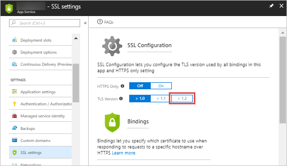

### Create a Traffic Manager profile

1. Select **Create a resource** > **Networking** > **Traffic Manager profile** > **Create**.

2. In the **Create Traffic Manager profile**, complete as follows:

    1. In **Name**, provide a name for the profile. This name needs to be unique within the traffic manager.net zone and results in the DNS name, trafficmanager.net, which is used to access the Traffic Manager profile.

    2. In **Routing method**, select the **Geographic routing method**.

    3. In **Subscription**, select the subscription under which to create this profile.

    4. In **Resource Group**, create a new resource group to place this profile under.

    5. In **Resource group location**, select the location of the resource group. This setting refers to the location of the resource group and has no impact on the Traffic Manager profile deployed globally.

    6. Select **Create**.

    7. When the global deployment of the Traffic Manager profile is complete, it's listed in the respective resource group as one of the resources.

        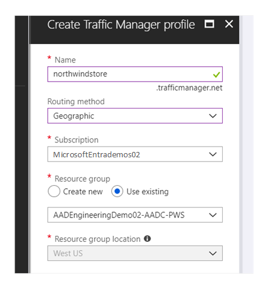

### Add Traffic Manager endpoints

1. In the portal search bar, search for the **Traffic Manager profile** name created in the preceding section and select the traffic manager profile in the displayed results.

2. In **Traffic Manager profile**, in the **Settings** section, select **Endpoints**.

3. Select **Add**.

4. Adding the Azure Stack Hub Endpoint.

5. For **Type**, select **External endpoint**.

6. Provide a **Name** for this endpoint, ideally the name of the Azure Stack Hub.

7. For fully qualified domain name (**FQDN**), use the external URL for the Azure Stack Hub Web App.

8. Under Geo-mapping, select a region/continent where the resource is located. For example, **Europe.**

9. Under the Country/Region drop-down that appears, select the country/region that applies to this endpoint. For example, **Germany**.

10. Keep **Add as disabled** unchecked.

11. Select **OK**.

12. Adding the Azure Endpoint:

    1. For **Type**, select **Azure endpoint**.

    2. Provide a **Name** for the endpoint.

    3. For **Target resource type**, select **App Service**.

    4. For **Target resource**, select **Choose an app service** to show the listing of the Web Apps under the same subscription. In **Resource**, pick the App service used as the first endpoint.

13. Under Geo-mapping, select a region/continent where the resource is located. For example, **North America/Central America/Caribbean.**

14. Under the Country/Region drop-down that appears, leave this spot blank to select all of the above regional grouping.

15. Keep **Add as disabled** unchecked.

16. Select **OK**.

    > [!Note]
    >  Create at least one endpoint with a geographic scope of All (World) to serve as the default endpoint for the resource.

17. When the addition of both endpoints is complete, they're displayed in **Traffic Manager profile** along with their monitoring status as **Online**.

    

#### Global Enterprise relies on Azure geo-distribution capabilities

Directing data traffic via Azure Traffic Manager and geography-specific endpoints enables global enterprises to adhere to regional regulations and keep data compliant and secure, which is crucial to the success of local and remote business locations.

## Next steps

- To learn more about Azure Cloud Patterns, see [Cloud Design Patterns](../../patterns/index.md).
