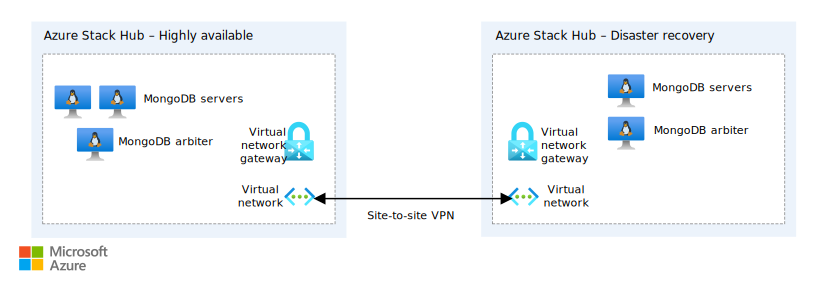

# Deploy a highly available MongoDB solution across two Azure Stack Hub environments

This article will step you through an automated deployment of a basic highly available (HA) MongoDB cluster with a disaster recovery (DR) site across two Azure Stack Hub environments. To learn more about MongoDB and high availability, see [Replica Set Members](https://docs.mongodb.com/manual/core/replica-set-members/).

In this solution, you'll create a sample environment to:

> [!div class="checklist"]
> - Orchestrate a deployment across two Azure Stack Hubs.
> - Use Docker to minimize dependency issues with Azure API profiles.
> - Deploy a basic highly available MongoDB cluster with a disaster recovery site.

> [!Tip]
> 
> Microsoft Azure Stack Hub is an extension of Azure. Azure Stack Hub brings the agility and innovation of cloud computing to your on-premises environment, enabling the only hybrid cloud that lets you build and deploy hybrid apps anywhere.
>
> The article [Hybrid app design considerations](/hybrid/app-solutions/overview-app-design-considerations) reviews pillars of software quality (placement, scalability, availability, resiliency, manageability, and security) for designing, deploying, and operating hybrid apps. The design considerations assist in optimizing hybrid app design, minimizing challenges in production environments.

## Architecture for MongoDB with Azure Stack Hub



*Download a [Visio file](https://arch-center.azureedge.net/solution-deployment-guide-mongodb-ha.vsdx) of this architecture.*

## Prerequisites for MongoDB with Azure Stack Hub

- Two connected Azure Stack Hub integrated systems (Azure Stack Hub). This deployment doesn't work on the Azure Stack Development Kit (ASDK). To learn more about Azure Stack Hub, see [What is Azure Stack Hub?](https://azure.microsoft.com/products/azure-stack/hub/)
  - A tenant subscription on each Azure Stack Hub.
  - **Make a note of each subscription ID and the Azure Resource Manager endpoint for each Azure Stack Hub.**
- An Azure Active Directory (Azure AD) service principal that has permissions to the tenant subscription on each Azure Stack Hub. You may need to create two service principals if the Azure Stack Hubs are deployed against different Azure AD tenants. To learn how to create a service principal for Azure Stack Hub, see [Use an app identity to access Azure Stack Hub resources](/azure-stack/user/azure-stack-create-service-principals).
  - **Make a note of each service principal's application ID, client secret, and tenant name (xxxxx.onmicrosoft.com).**
- Ubuntu 16.04 syndicated to each Azure Stack Hub's Marketplace. To learn more about marketplace syndication, see [Download Marketplace items to Azure Stack Hub](/azure-stack/operator/azure-stack-download-azure-marketplace-item).
- [Docker for Windows](https://docs.docker.com/docker-for-windows/) installed on your local machine.

## Get the Docker image

Docker images for each deployment eliminate dependency issues between different versions of Azure PowerShell.

1. Make sure that Docker for Windows is using Windows containers.
2. Run the following command in an elevated command prompt to get the Docker container with the deployment scripts:

    ```powershell  
    docker pull intelligentedge/mongodb-hadr:1.0.0
    ```

## Deploy the clusters

1. Once the container image has been successfully pulled, start the image:

    ```powershell  
    docker run -it intelligentedge/mongodb-hadr:1.0.0 powershell
    ```

2. Once the container has started, you'll be given an elevated PowerShell terminal in the container. Change directories to get to the deployment script:

    ```powershell  
    cd .\MongoHADRDemo\
    ```

3. Run the deployment. Provide credentials and resource names where needed. HA refers to the Azure Stack Hub where the HA cluster will be deployed. DR refers to the Azure Stack Hub where the DR cluster will be deployed:

    ```powershell
    .\Deploy-AzureResourceGroup.ps1 `
    -AzureStackApplicationId_HA "applicationIDforHAServicePrincipal" `
    -AzureStackApplicationSercet_HA "clientSecretforHAServicePrincipal" `
    -AADTenantName_HA "hatenantname.onmicrosoft.com" `
    -AzureStackResourceGroup_HA "haresourcegroupname" `
    -AzureStackArmEndpoint_HA "https://management.haazurestack.com" `
    -AzureStackSubscriptionId_HA "haSubscriptionId" `
    -AzureStackApplicationId_DR "applicationIDforDRServicePrincipal" `
    -AzureStackApplicationSercet_DR "ClientSecretforDRServicePrincipal" `
    -AADTenantName_DR "drtenantname.onmicrosoft.com" `
    -AzureStackResourceGroup_DR "drresourcegroupname" `
    -AzureStackArmEndpoint_DR "https://management.drazurestack.com" `
    -AzureStackSubscriptionId_DR "drSubscriptionId"
    ```

4. Type `Y` to allow the NuGet provider to be installed, which will kick off the API Profile "2018-03-01-hybrid" modules to be installed.

5. The HA resources will deploy first. Monitor the deployment and wait for it to finish. Once you have the message stating that the HA deployment is finished, you can check the HA Azure Stack Hub's portal to see the resources deployed.

6. Continue with the deployment of DR resources and decide if you'd like to enable a jump box on the DR Azure Stack Hub to interact with the cluster.

7. Wait for DR resource deployment to finish.

8. Once DR resource deployment has finished, exit the container:

    ```powershell
    exit
    ```

## Next steps

- If you enabled the jump box VM on the DR Azure Stack Hub, you can connect via SSH and interact with the MongoDB cluster by installing the mongo CLI. To learn more about interacting with MongoDB, see [The mongo Shell](https://www.mongodb.com/docs/mongodb-shell/).
- To learn more about hybrid cloud apps, see [Hybrid Cloud Solutions.](/azure-stack/user).
- Modify the code to this sample on [GitHub](https://github.com/Azure-Samples/azure-intelligent-edge-patterns).
