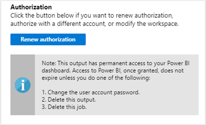

# Deploy an AI-based footfall detection solution using Azure and Azure Stack Hub

This article describes how to deploy an AI-based solution that generates insights from real world actions by using Azure, Azure Stack Hub, and the Custom Vision AI Dev Kit.

In this solution, you learn how to:

> [!div class="checklist"]
> - Deploy Cloud Native Application Bundles (CNAB) at the edge.
> - Deploy an app that spans cloud boundaries.
> - Use the Custom Vision AI Dev Kit for inference at the edge.

> [!TIP]
> 
> Microsoft Azure Stack Hub is an extension of Azure. Azure Stack Hub brings the agility and innovation of cloud computing to your on-premises environment, enabling the only hybrid cloud that allows you to build and deploy hybrid apps anywhere.
>
> The article [Hybrid app design considerations](/hybrid/app-solutions/overview-app-design-considerations) reviews pillars of software quality (placement, scalability, availability, resiliency, manageability, and security) for designing, deploying, and operating hybrid apps. The design considerations assist in optimizing hybrid app design, minimizing challenges in production environments.

## Prerequisites

Before getting started with this deployment guide, make sure you:

- Review the [Footfall detection architecture](/azure/architecture/solution-ideas/articles/hybrid-footfall-detection).
- Obtain user access to an Azure Stack Development Kit (ASDK) or Azure Stack Hub integrated system instance, with:
  - The [Azure App Service on Azure Stack Hub resource provider](/azure-stack/operator/azure-stack-app-service-overview) installed. You need operator access to your Azure Stack Hub instance, or work with your administrator to install.
  - A subscription to an offer that provides App Service and Storage quota. You need operator access to create an offer.
- Obtain access to an Azure subscription.
  - If you don't have an Azure subscription, sign up for a [free trial account](https://azure.microsoft.com/free) before you begin.
- Create two service principals in your directory:
  - One set up for use with Azure resources, with access at the Azure subscription scope.
  - One set up for use with Azure Stack Hub resources, with access at the Azure Stack Hub subscription scope.
  - To learn more about creating service principals and authorizing access, see [Use an app identity to access resources](/azure-stack/operator/azure-stack-create-service-principals). If you prefer to use Azure CLI, see [Create an Azure service principal with Azure CLI](/cli/azure/create-an-azure-service-principal-azure-cli).
- Deploy Azure Cognitive Services in Azure or Azure Stack Hub.
  - First, [learn more about Cognitive Services](https://azure.microsoft.com/services/cognitive-services).
  - Then visit [Deploy Azure Cognitive Services to Azure Stack Hub](/azure-stack/user/azure-stack-solution-template-cognitive-services) to deploy Cognitive Services on Azure Stack Hub. You first need to sign up for access to the preview.
- Clone or download an unconfigured Azure Custom Vision AI Dev Kit. For details, see the [Vision AI DevKit](https://azure.github.io/Vision-AI-DevKit-Pages).
- Sign up for a Power BI account.
- An Azure Cognitive Services Face API subscription key and endpoint URL. You can get both with the [Try Cognitive Services](https://azure.microsoft.com/try/cognitive-services/?api=face-api) free trial. Or, follow the instructions in [Create a Cognitive Services account](/azure/cognitive-services/cognitive-services-apis-create-account).
- Install the following development resources:
  - [Azure CLI 2.0](/azure-stack/user/azure-stack-version-profiles-azurecli2)
  - [Docker CE](https://hub.docker.com/search/?type=edition&offering=community)
  - [Porter](https://porter.sh/). You use Porter to deploy cloud apps using CNAB bundle manifests that are provided for you.
  - [Visual Studio Code](https://code.visualstudio.com/)
  - [Azure IoT Tools for Visual Studio Code](https://marketplace.visualstudio.com/items?itemName=vsciot-vscode.azure-iot-toolkit)
  - [Python extension for Visual Studio Code](https://marketplace.visualstudio.com/items?itemName=ms-python.python)
  - [Python](https://www.python.org/)

## Deploy the hybrid cloud app

First you use the Porter CLI to generate a credential set, then deploy the cloud app.

1. Clone or download the [repository containing the solution sample code](https://github.com/Azure-Samples/azure-intelligent-edge-patterns/tree/master/footfall-analysis).

1. Porter will generate a set of credentials that will automate deployment of the app. Before running the credential generation command, be sure to have the following available:

    - A service principal for accessing Azure resources, including the service principal ID, key, and tenant DNS.
    - The subscription ID for your Azure subscription.
    - A service principal for accessing Azure Stack Hub resources, including the service principal ID, key, and tenant DNS.
    - The subscription ID for your Azure Stack Hub subscription.
    - Your Azure Cognitive Services Face API key and resource endpoint URL.

1. Run the Porter credential generation process and follow the prompts:

   ```porter
   porter creds generate --tag intelligentedge/footfall-cloud-deployment:0.1.0
   ```

1. Porter also requires a set of parameters to run. Create a parameter text file and enter the following name/value pairs. Ask your Azure Stack Hub administrator if you need assistance with any of the required values.

    > [!NOTE]
    > The `resource suffix` value is used to ensure that your deployment's resources have unique names across Azure. It must be a unique string of letters and numbers, no longer than 8 characters.

    ```porter
    azure_stack_tenant_arm="Your Azure Stack Hub tenant endpoint"
    azure_stack_storage_suffix="Your Azure Stack Hub storage suffix"
    azure_stack_keyvault_suffix="Your Azure Stack Hub keyVault suffix"
    resource_suffix="A unique string to identify your deployment"
    azure_location="A valid Azure region"
    azure_stack_location="Your Azure Stack Hub location identifier"
    powerbi_display_name="Your first and last name"
    powerbi_principal_name="Your Power BI account email address"
    ```

    Save the text file and make a note of its path.

1. You're now ready to deploy the hybrid cloud app using Porter. Run the install command and watch as resources are deployed to Azure and Azure Stack Hub:

    ```porter
    porter install footfall-cloud –tag intelligentedge/footfall-cloud-deployment:0.1.0 –creds footfall-cloud-deployment –param-file "path-to-cloud-parameters-file.txt"
    ```

1. Once deployment is complete, make note of the following values:
    - The camera's connection string.
    - The image storage account connection string.
    - The resource group names.

## Prepare the Custom Vision AI DevKit

Next, set up the Custom Vision AI Dev Kit as shown in the [Vision AI DevKit quickstart](https://azure.github.io/Vision-AI-DevKit-Pages/docs/quick_start). You also set up and test your camera, using the connection string provided in the previous step.

## Deploy the camera app

Use the Porter CLI to generate a credential set, then deploy the camera app.

1. Porter will generate a set of credentials that will automate deployment of the app. Before running the credential generation command, be sure to have the following available:

    - A service principal for accessing Azure resources, including the service principal ID, key, and tenant DNS.
    - The subscription ID for your Azure subscription.
    - The image storage account connection string provided when you deployed the cloud app.

1. Run the Porter credential generation process and follow the prompts:

    ```porter
    porter creds generate --tag intelligentedge/footfall-camera-deployment:0.1.0
    ```

1. Porter also requires a set of parameters to run. Create a parameter text file and enter the following text. Ask your Azure Stack Hub administrator if you don't know some of the required values.

    > [!NOTE]
    > The `deployment suffix` value is used to ensure that your deployment's resources have unique names across Azure. It must be a unique string of letters and numbers, no longer than 8 characters.

    ```porter
    iot_hub_name="Name of the IoT Hub deployed"
    deployment_suffix="Unique string here"
    ```

    Save the text file and make a note of its path.

1. You're now ready to deploy the camera app using Porter. Run the install command and watch as the IoT Edge deployment is created.

    ```porter
    porter install footfall-camera –tag intelligentedge/footfall-camera-deployment:0.1.0 –creds footfall-camera-deployment –param-file "path-to-camera-parameters-file.txt"
    ```

1. Verify that the camera's deployment is complete by viewing the camera feed at `https://<camera-ip>:3000/`, where `<camara-ip>` is the camera IP address. This step may take up to 10 minutes.

## Configure Azure Stream Analytics

Now that data is flowing to Azure Stream Analytics from the camera, we need to manually authorize it to communicate with Power BI.

1. From the Azure portal, open **All Resources**, and the *process-footfall\[yoursuffix\]* job.

2. In the **Job Topology** section of the Stream Analytics job pane, select the **Outputs** option.

3. Select the **traffic-output** output sink.

4. Select **Renew authorization** and sign in to your Power BI account.

    

5. Save the output settings.

6. Go to the **Overview** pane and select **Start** to start sending data to Power BI.

7. Select **Now** for job output start time and select **Start**. You can view the job status in the notification bar.

## Create a Power BI Dashboard

1. Once the job succeeds, go to [Power BI](https://powerbi.com/) and sign in with your work or school account. If the Stream Analytics job query is outputting results, the *footfall-dataset* dataset you created exists under the **Datasets** tab.

2. From your Power BI workspace, select **+ Create** to create a new dashboard named *Footfall Analysis.*

3. At the top of the window, select **Add tile**. Then select **Custom Streaming Data** and **Next**. Choose the **footfall-dataset** under **Your Datasets**. Select **Card** from the **Visualization type** dropdown, and add **age** to **Fields**. Select **Next** to enter a name for the tile, and then select **Apply** to create the tile.

4. You can add additional fields and cards as desired.

## Test Your Solution

Observe how the data in the cards you created in Power BI changes as different people walk in front of the camera. Inferences may take up to 20 seconds to appear once recorded.

## Remove Your Solution

If you'd like to remove your solution, run the following commands using Porter, using the same parameter files that you created for deployment:

```porter
porter uninstall footfall-cloud –tag intelligentedge/footfall-cloud-deployment:0.1.0 –creds footfall-cloud-deployment –param-file "path-to-cloud-parameters-file.txt"

porter uninstall footfall-camera –tag intelligentedge/footfall-camera-deployment:0.1.0 –creds footfall-camera-deployment –param-file "path-to-camera-parameters-file.txt"
```

## Next steps

- Learn more about [Hybrid app design considerations](/hybrid/app-solutions/overview-app-design-considerations)
- Review and propose improvements to [the code for this sample on GitHub](https://github.com/Azure-Samples/azure-intelligent-edge-patterns/tree/master/footfall-analysis).
- See [Overview of a hybrid workload](/azure/architecture/framework/hybrid/hybrid-overview) in Azure Well-Architected Framework.
- See the [hybrid and multicloud scenario](/azure/cloud-adoption-framework/scenarios/hybrid) in Azure Cloud Adoption Framework.

## Related resources

- [Configure hybrid cloud connectivity using Azure and Azure Stack Hub](/azure/architecture/hybrid/deployments/solution-deployment-guide-connectivity)
- [Configure hybrid cloud identity for Azure and Azure Stack Hub apps](/azure/architecture/hybrid/deployments/solution-deployment-guide-identity)
- [Deploy an app that scales cross-cloud using Azure and Azure Stack Hub](/azure/architecture/hybrid/deployments/solution-deployment-guide-cross-cloud-scaling)
- [Deploy a high availability Kubernetes cluster on Azure Stack Hub](/azure/architecture/hybrid/deployments/solution-deployment-guide-highly-available-kubernetes)
- [Deploy a hybrid app with on-premises data that scales cross-cloud](/azure/architecture/hybrid/deployments/solution-deployment-guide-cross-cloud-scaling-onprem-data)
