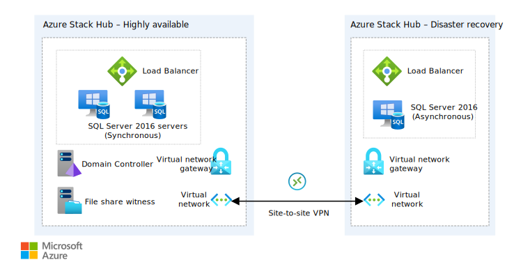
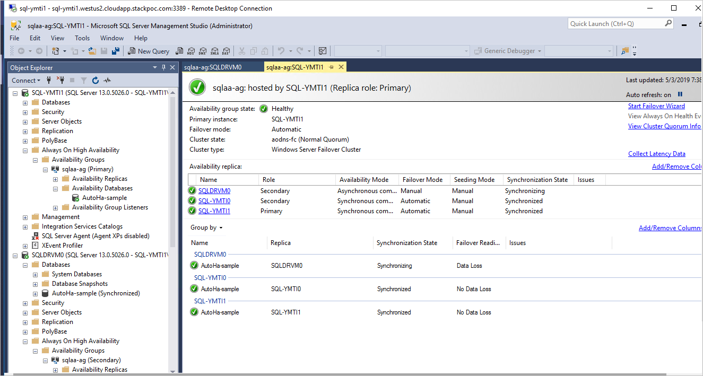

# Deploy a SQL Server 2016 availability group across two Azure Stack Hub environments

This article will step you through an automated deployment of a basic highly available (HA) SQL Server 2016 Enterprise cluster with an asynchronous disaster recovery (DR) site across two Azure Stack Hub environments. To learn more about SQL Server 2016 and high availability, see [Always On availability groups: a high-availability and disaster-recovery solution](/sql/database-engine/availability-groups/windows/always-on-availability-groups-sql-server?view=sql-server-2016&preserve-view=true).

In this solution, you'll build a sample environment to:

> [!div class="checklist"]
>
> - Orchestrate a deployment across two Azure Stack Hubs.
> - Use Docker to minimize dependency issues with Azure API profiles.
> - Deploy a basic highly available SQL Server 2016 Enterprise cluster with a disaster recovery site.

<!-- -->

> [!TIP]
> 
> Microsoft Azure Stack Hub is an extension of Azure. Azure Stack Hub brings the agility and innovation of cloud computing to your on-premises environment, enabling the only hybrid cloud that lets you build and deploy hybrid apps anywhere.
>
> The article [Hybrid app design considerations](/hybrid/app-solutions/overview-app-design-considerations) reviews pillars of software quality (placement, scalability, availability, resiliency, manageability, and security) for designing, deploying, and operating hybrid apps. The design considerations assist in optimizing hybrid app design, minimizing challenges in production environments.

## Architecture for SQL Server 2016



*Download a [Visio file](https://arch-center.azureedge.net/solution-deployment-guide-sql-ha.vsdx) of this architecture.*

## Prerequisites for SQL Server 2016

- Two connected Azure Stack Hub integrated systems (Azure Stack Hub). This deployment doesn't work on the Azure Stack Development Kit (ASDK). To learn more about Azure Stack Hub, see the [Azure Stack overview](https://azure.microsoft.com/overview/azure-stack/).
- A tenant subscription on each Azure Stack Hub.
  - **Make a note of each subscription ID and the Azure Resource Manager endpoint for each Azure Stack Hub.**
- An Azure Active Directory (Azure AD) service principal that has permissions to the tenant subscription on each Azure Stack Hub. You may need to create two service principals if the Azure Stack Hubs are deployed against different Azure AD tenants. To learn how to create a service principal for Azure Stack Hub, see [Create service principals to give apps access to Azure Stack Hub resources](/azure-stack/user/azure-stack-create-service-principals).
  - **Make a note of each service principal's application ID, client secret, and tenant name (xxxxx.onmicrosoft.com).**
- SQL Server 2016 Enterprise syndicated to each Azure Stack Hub's Marketplace. To learn more about marketplace syndication, see [Download Marketplace items to Azure Stack Hub](/azure-stack/operator/azure-stack-download-azure-marketplace-item).
    **Make sure that your organization has the appropriate SQL licenses.**
- [Docker for Windows](https://docs.docker.com/docker-for-windows/) installed on your local machine.

## Get the Docker image

Docker images for each deployment eliminate dependency issues between different versions of Azure PowerShell.

1. Make sure that Docker for Windows is using Windows containers.
2. Run the following script in an elevated command prompt to get the Docker container with the deployment scripts.

    ```powershell  
    docker pull intelligentedge/sqlserver2016-hadr:1.0.0
    ```

## Deploy the availability group

1. Once the container image has been successfully pulled, start the image.

      ```powershell  
      docker run -it intelligentedge/sqlserver2016-hadr:1.0.0 powershell
      ```

2. Once the container has started, you'll be given an elevated PowerShell terminal in the container. Change directories to get to the deployment script.

      ```powershell  
      cd .\SQLHADRDemo\
      ```

3. Run the deployment. Provide credentials and resource names where needed. HA refers to the Azure Stack Hub where the HA cluster will be deployed. DR refers to the Azure Stack Hub where the DR cluster will be deployed.

      ```powershell
      > .\Deploy-AzureResourceGroup.ps1 `
      -AzureStackApplicationId_HA "applicationIDforHAServicePrincipal" `
      -AzureStackApplicationSercet_HA "clientSecretforHAServicePrincipal" `
      -AADTenantName_HA "hatenantname.onmicrosoft.com" `
      -AzureStackResourceGroup_HA "haresourcegroupname" `
      -AzureStackArmEndpoint_HA "https://management.haazurestack.com" `
      -AzureStackSubscriptionId_HA "haSubscriptionId" `
      -AzureStackApplicationId_DR "applicationIDforDRServicePrincipal" `
      -AzureStackApplicationSercet_DR "ClientSecretforDRServicePrincipal" `
      -AADTenantName_DR "drtenantname.onmicrosoft.com" `
      -AzureStackResourceGroup_DR "drresourcegroupname" `
      -AzureStackArmEndpoint_DR "https://management.drazurestack.com" `
      -AzureStackSubscriptionId_DR "drSubscriptionId"
      ```

4. Type `Y` to allow the NuGet provider to be installed, which will kick off the API Profile "2018-03-01-hybrid" modules to be installed.

5. Wait for resource deployment to complete.

6. Once DR resource deployment has completed, exit the container.

      ```powershell
      exit
      ```

7. Inspect the deployment by viewing the resources in each Azure Stack Hub's portal. Connect to one of the SQL instances on the HA environment and inspect the Availability Group through SQL Server Management Studio (SSMS).

    

## Next steps

- Use SQL Server Management Studio to manually fail over the cluster. See [Perform a Forced Manual Failover of an Always On Availability Group (SQL Server)](/sql/database-engine/availability-groups/windows/perform-a-forced-manual-failover-of-an-availability-group-sql-server?view=sql-server-2017&preserve-view=true).
- Learn more about hybrid cloud apps. See [Hybrid Cloud Solutions](/azure-stack/user/).
- Use your own data or modify the code to this sample on [GitHub](https://github.com/Azure-Samples/azure-intelligent-edge-patterns).
