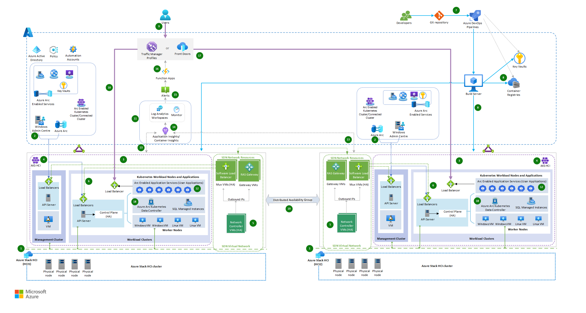

This solution demonstrates how to achieve cross-cluster scaling of workloads deployed on a hybrid infrastructure. This solution is achieved by applying the scalability and management capabilities of Azure Arc-enabled services on Azure Stack HCI clusters.

## Architecture

The architecture shows the deployment of hybrid solutions by using Azure Arc-enabled services on Azure Stack HCI, Azure Pipelines, and the integration of a global load balancer and an Azure Function App.

*Download a [Visio file](https://arch-center.azureedge.net/hybrid-cross-cluster-scaling-with-azure-arc.vsdx) of this architecture.*

### Workflow

The architecture consists of the following steps:

1. Two [Azure Stack HCI](https://azure.microsoft.com/products/azure-stack/hci) clusters are set up in two different locations: Azure Stack HCI (HCI1) serves as primary on-premises infrastructure and Azure Stack HCI (HCI2) as secondary on-premises infrastructure for running workloads.
1. Azure Stack HCI clusters connect to Azure via SD-WAN and are managed through Azure Arc and Windows Admin Center. As a result, you can extend Azure capabilities to on-premises infrastructure, and use Azure management tools and services to manage and monitor on-premises infrastructure and workload.
1. [Azure Kubernetes Service (AKS)](/azure/aks), deployed on Azure Stack HCI, are comprised of the management cluster (AKS host), and Workload clusters (also known as target clusters) where containerized applications are deployed. See [Azure Kubernetes Service (AKS) baseline architecture](/azure/architecture/reference-architectures/containers/aks/baseline-aks) for AKS on Azure Stack HCI.
1. Azure Kubernetes Service host on Azure Stack HCI and workload cluster is deployed using AksHci PowerShell modules. See [Use PowerShell to set up Kubernetes on Azure Stack HCI and Windows Server clusters](/azure/aks/hybrid/kubernetes-walkthrough-powershell).
1. Virtualization of network resources is implemented by applying SDN capabilities of Azure Stack HCI cluster. It deploys the necessary SDN network infrastructure resources like Software Load Balancer Mux VMs, RAS Gateway VMs and Network Controllers for higher network availability. See [Software defined networking (SDN) in Azure Stack HCI and Windows Server](/azure-stack/hci/concepts/software-defined-networking).
1. AKS infrastructure and workload VMs are deployed to an SDN Virtual Network with hybrid load balancing achieved via SDN Software Load Balancer (SLB). See the [Deploy Microsoft Software Defined Networking (SDN) with AKS on Azure Stack HCI](/azure/aks/hybrid/software-defined-networking).
1. [Azure Pipelines](https://azure.microsoft.com/products/devops/pipelines) deploys the frontend applications with the same versions of the containerized applications deployed in both Azure Stack HCI on-premises environments.
1. Databases are hosted in Arc-enabled SQL Managed Instances deployed on AKS hybrid.
1. A developer packages their applications as a container to be deployed to both AKS Hybrid clusters using Kubernetes Manifests and AksHci PowerShell Modules, and automates deployment tasks through Azure Pipelines.
1. A client request to the application is directed by a global load balancer service like Azure Front Door or Azure Traffic Manager, which routes the request to the appropriate service endpoint using a weighted traffic-routing method. Based on the assigned weighted percentage, the traffic gets distributed to services deployed across the two AKS hybrid clusters on Stack HCI.

   Both Traffic Manager and Azure Front Door are viable options for addressing global load-balancing capabilities due to the presence of clusters across multiple regions. Selecting between Azure Front Door and Traffic Manager depends on various factors, and the decision to recommend one over the other requires careful consideration. Here are some reasons to consider different load-balancing services:

   - If your internet-facing applications use HTTPS, Azure Front Door is the preferable option. Generally, Traffic Manager isn't the primary choice in such instances. While there might be exceptions, specific scenarios are beyond the scope of this discussion.
   - If your primary goal is efficient global load balancing, Traffic Manager might be sufficient. If you also need content delivery optimization, application-layer security, and more advanced routing capabilities, Azure Front Door could be a better fit.
   - Traffic Manager is simpler to set up and primarily focuses on load balancing. Azure Front Door offers more features but might have a steeper learning curve.
   - Consider your application type. If it's more web-centric and you need optimizations like caching and SSL termination, Azure Front Door might be beneficial.
   - Regarding DNS-based routing, the complexity reduces when dealing with load balancing at the application level. However, it's crucial to note that relying solely on DNS-based routing can lead to increased downtime during a failure, which could adversely affect your applications' Service Level Agreements (SLAs). The decision between Azure Front Door and Traffic Manager should consider your DNS solution's SLA and whether your application can accommodate the differing failover times between the two options.

1. The deployed workload applications are monitored for load using Azure Arc-Enabled services, Azure Monitor, and Log Analytic Workspace.
1. Under normal load conditions, the client request is routed to the instance of the app hosted on-premises in the Azure Stack HCI-1 environment (Primary cluster environment).
1. Arc-enabled AKS cluster workloads are designed to scale horizontally to multiple instances by using built-in autoscaler, which automatically scales up or down the number of nodes in the deployed AKS cluster based on demand.
1. Container insights is enabled to capture diagnostics and monitor workload performance on the Kubernetes cluster hosted on Azure Stack HCIs.
1. When there's an increase in traffic and the workload cluster on Azure Stack HCI-1 reaches its maximum node count with no further pod scaling options, it generates an alert to trigger an Azure Function app.
1. An Alert rule is configured to monitor the result of a custom Kusto query, which checks for the maximum node count and pod readiness percentage from the KubeNodeInventory and KubePodInventory Azure Monitor tables. See [Create log alerts from Container insights](/azure/azure-monitor/containers/container-insights-log-alerts).
1. Kubernetes monitoring can also be performed using preconfigured alert rules from the Kubernetes Container insights. You can also apply the KubePodNotReady or KubeHpaMaxedOut metrics rules from Container insights to configure alert rule conditions. See [Metric alert rules in Container insights (preview)](/azure/azure-monitor/containers/container-insights-metric-alerts) and invoke the Azure Function App through the Alert's Action Group.
1. Azure Function App dynamically manages weighted traffic-routing rules based on the primary cluster’s condition, and redirects the traffic to the Azure Stack HCI-2 cluster.

   - You can use Azure Function to calculate the percentage of traffic that must be redirected based on predefined threshold limits of cluster readiness and traffic conditions. Doing so can help you adapt to changes quickly, automate tasks, scale resources efficiently, and save money.
   - Azure Function helps manage traffic routing rules dynamically. This functionality ensures high availability, scalability, and performance, and provides a seamless user experience even during peak traffic and failover scenarios. For example, initial Traffic Distribution begins with directing 100% of traffic to the primary cluster when it's performing well and is able to handle the load. When the primary cluster is almost full or experiences performance degradation, you can adjust traffic-routing rules within Azure Function. Doing so redirects some of the read-only traffic to the secondary cluster.

1. App instances running on both cluster environments connect to the data services, such as arc-enabled SQL Managed Instances, locally within their respective clusters.
1. Data synchronization across the clusters for Arc SQL Managed Instances is governed by Azure Failover Group, which in turn uses the Distributed Availability Groups. Synchronization between clusters can be sync or async. See [Azure Arc-enabled SQL Managed Instance](/azure/azure-arc/data/managed-instance-overview).

Overall, this workflow involves building and deploying applications, load balancing, traffic management, autoscaling, and data synchronization across multiple cluster environments. This setup allows you to scale infrastructure horizontally across clusters at two different data centers or locations, providing security, redundancy, flexibility, and efficient resource utilization.

### Components

- [Azure Front Door](https://azure.microsoft.com/products/frontdoor/) is a layer 7 load balancer. In this architecture, it routes HTTP requests to the web applications deployed on Stack HCI Cluster. You can also use a [web application firewall (WAF)](/azure/frontdoor/waf-overview) with Azure Front Door that protects the application from common exploits and vulnerabilities, and a [Content Delivery Network (CDN)](/azure/frontdoor/front-door-overview#global-delivery-scale-using-microsofts-network) solution in this design to reduce latency and to improve content load time by caching the content at the edge locations.

- [Traffic Manager](https://azure.microsoft.com/products/traffic-manager) is a DNS-based traffic load balancer and a viable load-balancing option. Use it to control the distribution of application traffic to service endpoints in different data centers. Here's how the Traffic Manager configuration works:

  - Set up Traffic Manager, a global load-balancing solution in Azure, to distribute incoming traffic across your Azure Stack HCI clusters. Traffic Manager can be configured to use different load-balancing methods such as performance, failover, or weighted round-robin, depending on the requirements.
  - Create Traffic Manager endpoints that correspond to the endpoints of workloads deployed on Azure Stack HCI clusters. This allows Traffic Manager to direct traffic to the appropriate endpoint. In this scenario, direct traffic based on the weighted routing load-balancing method.
  - Based on the scaling policies calculated through an Azure function, when there's a need for extra capacity or high availability, Traffic Manager can dynamically route traffic to other instances based on the routing rules and their weighted percentages.

- [Application Insights](https://azure.microsoft.com/products/monitor) collects telemetry data from various components deployed in this hybrid solution. It provides insights and analytics that can be used to identify issues, optimize performance, and improve user experience.

- [Azure Functions](https://azure.microsoft.com/products/functions) acts as an orchestrator for traffic distribution. It monitors the readiness conditions of each cluster, assessing factors such as resource utilization, latency, and health. Based on this assessment, the Function App decides where to direct incoming traffic.

- [Azure Stack HCI](https://azure.microsoft.com/products/azure-stack/hci) is a hyperconverged infrastructure (HCI) cluster solution that hosts virtualized Windows and Linux workloads and their storage in a hybrid environment that combines on-premises infrastructure with Azure services.

  - The solution uses [Arc-Enabled Azure Kubernetes Service on Azure Stack HCI (AKS-HCI)](/azure/aks/hybrid/) to host the web app or APIs, [Arc-Enabled Azure Servers](/azure/azure-arc/servers), and [Arc-Enabled Data Services](/azure/azure-arc/data/) in both environments.

- [Azure DevOps Services](https://azure.microsoft.com/products/devops) serve as the backbone of this hybrid solution deployment strategy, providing the automation and orchestration necessary to streamline the entire software delivery lifecycle. It empowers development teams to focus on delivering high-quality code while the pipeline takes care of building, testing, and deploying applications.  

  - To deploy an AKS cluster on Azure Stack HCI, you can set up a build server within Azure Pipelines. The build server is responsible for executing the deployment process.

    a. Create a virtual machine (VM) within Azure or a VM from the Stack HCI environment. Or use an existing on-premises VM as your build server if it has network connectivity to the hybrid infrastructures.

    b. Install the necessary tools on the build server, such as Git, Azure CLI, and Azure PowerShell modules.

    c. Configure authentication to Azure by setting up service principals or using managed identities.

- [Azure Pipelines](https://azure.microsoft.com/products/devops/pipelines) is a service that provides CI/CD and manages hosted build and release agents and definitions. Development pipeline can use various code repositories, including GitHub, Bitbucket, Dropbox, OneDrive, and [Azure Repos](https://azure.microsoft.com/products/devops/repos).
- [Azure Monitor](https://azure.microsoft.com/services/monitor) collects telemetry data and monitors the performance of clusters and workloads. It also lets you configure alerts to trigger an Azure Function or to notify an administrator if any cluster becomes unhealthy or if predefined thresholds are exceeded. You can use Azure Automation or Azure Logic Apps to automate scaling actions based on the monitoring data.
- [Azure Policy](https://azure.microsoft.com/products/azure-policy/) acts as a governance and compliance enforcer, guaranteeing that Stack HCI clusters and associated SDN resources operate within the defined guidelines and standards. Here are some examples to enhance the security of the environment through Azure Policy:
  - Enforcing Container Insight Addon
  - Installation of essential extensions within Stack HCI clusters
  - Enforcing resources tagging
  - Policy-based access control
  - Networking and Monitoring related Policies

- [Azure Container Registry](https://azure.microsoft.com/products/container-registry/) is a managed, private Docker registry service on Azure. Use the Container Registry to store private Docker images, which are deployed to the cluster.
- [Azure Arc](https://azure.microsoft.com/products/azure-arc/) extends Azure services to on-premises environments, allowing organizations to benefit from cloud capabilities while keeping sensitive data within their own infrastructure.
- [Container insights](/azure/azure-monitor/containers/container-insights-overview) is a monitoring and observability solution provided by Azure Monitor that lets you gain insights into the performance and health of containers running in AKS clusters. With Azure Arc enabled for AKS, you can extend the capabilities of Container insights to monitor and manage your AKS clusters that are running outside of Azure, such as for on-premises or multicloud environments.
- [Arc-Enabled SQL Managed Instances](https://azure.microsoft.com/products/azure-arc/hybrid-data-services/) is an Azure SQL data service that can be created on the Stack HCI infrastructure and managed by using Azure Arc.
- [Azure Key Vault](https://azure.microsoft.com/products/key-vault/) lets you securely store and manage cryptographic keys, secrets, and certificates. While Azure Key Vault is primarily a cloud service, it can also be used with Azure Stack HCI deployments to store and manage sensitive information securely on-premises.
- [SDN Infrastructure](/azure-stack/hci/concepts/plan-software-defined-networking-infrastructure). In an AKS hybrid deployment on Azure Stack HCI, load balancing is achieved through the Software Load Balancer (SLB) SDN. SLB manages the AKS-HCI infrastructure and applications within the SDN (Software-Defined Networking) Virtual Network, including the necessary SDN network infrastructure resources like Mux load balancer VMs, Gateway VMs, and Network Controllers.

Here's a breakdown of the components involved:

- **Software Load Balancer (SLB)**: The SLB is a key component of the AKS-HCI infrastructure that provides load-balancing capabilities for distributing network traffic to the applications running on the cluster. It operates at the transport layer (Layer 4) and directs traffic based on configured rules.
- **Mux Load Balancer VMs**: Mux load balancer VMs are virtual machines that handle incoming network traffic from external sources and distribute it to the appropriate backend pods or services within the AKS-HCI cluster. They work with SLB to perform load balancing.
- **Gateway VMs**: Gateway VMs provide connectivity between the AKS-HCI cluster and external networks. They act as a bridge between the internal SDN Virtual Network and external networks, letting ingress and egress traffic flow securely.
- **Network Controllers**: Network Controllers are responsible for managing the SDN infrastructure within the AKS-HCI cluster. They handle tasks such as network policy enforcement, network configuration, and load balancer configuration.

By using SLB, Mux load balancer VMs, Gateway VMs, and Network Controllers, AKS-HCI achieves load balancing for hybrid deployments. It ensures that incoming network traffic is efficiently distributed across the applications running within the cluster, providing high availability and scalability.

> [!NOTE]
> These components are managed and configured by AKS-HCI, letting you focus on deploying and managing your applications while using the built-in load-balancing capabilities of the platform.

### Alternatives

For Web Application and event-based services, you can run App Service, Functions, and Logic Apps on an Azure Arc-enabled Kubernetes cluster hosted on Azure Stack HCI. For database, you can use another storage option such as Azure Arc-enabled PostgreSQL server.

For web applications, you can use Azure Front Door. Azure Front Door works at Layer 7, the HTTP/HTTPS layer. It uses the anycast protocol with split TCP, and the Microsoft global network, to improve global connectivity. Your routing method can ensure that Azure Front Door routes your client requests to the fastest and most available application back end.

You can use Azure ExpressRoute to connect your local network directly to Azure resources by using a dedicated private network connection.

If your repo is in GitHub, you can use GitHub Actions instead of Azure Pipelines.

## Scenario details

The primary objective is to facilitate cross-cluster scaling by effectively distributing workloads across clusters situated in two different data centers or locations. This approach prevents overloading of any single cluster and optimizes resource utilization across all clusters. The Azure Function App plays a pivotal role in intelligently distributing traffic based on cluster readiness conditions, thereby enhancing efficiency, scalability, availability, and performance.

This scenario is applicable for organizations dealing with a strict set of constraints, data sovereignty regulations, or crucial resiliency and business continuity needs or handling critical workloads in highly restricted and regulated environments such as banks, finance, defense, and government. Due to organizations' regulatory and compliance policies, applications and databases run on-premises to prevent exposing confidential or sensitive data in the public cloud. This solution is useful when:

- On-premises apps experience usage spikes during peak season and autoscale within the cluster, but the primary cluster reaches 100% capacity and wants to divert overflow traffic to another data center cluster without interrupting any service executions.

- You want to resolve the rerouting of app/API traffic automatically to the nearest available on-premises environment.

- You want to simplify governance and management of on-premises setup and access relevant cloud services that are filtered through a firewall or proxy server in a consistent and secure way through Azure Arc-enabled services deployed on Azure Stack HCI.

### Potential use cases

- You want to implement highly available, scalable, secured, and restricted workloads in an on-premises Azure Stack HCI cluster environment.
- You want dynamic scaling of running applications between the datacenters whenever on-premises apps experience spikes in their usages.
- You want to apply cloud-based automation with centralized management, governance, and monitoring.
- You have on-premises components and want to use another on-premises setup to scale them.
- You want dynamic cross-cluster scalability to run your apps on-premises until the time when you can extend scaling of your workloads to cloud instances.

## Considerations

These considerations implement the pillars of the Azure Well-Architected Framework, which is a set of guiding tenets that can be used to improve the quality of a workload. For more information, see [Microsoft Azure Well-Architected Framework](/azure/architecture/framework).

### Reliability

Reliability ensures your application can meet the commitments you make to your customers. For more information, see [Overview of the reliability pillar](/azure/architecture/framework/resiliency/overview).

A company can take a hybrid approach for maintaining their systems by keeping apps and resources on-premises for regulatory and performance reasons. If they want to apply Azure cloud capabilities, they can deploy the same version of applications hosted on Azure HCI Cluster across multiple regions. Doing so fulfills their compliance of highly available and scalable services.  

### Security

Security provides assurances against deliberate attacks and the abuse of your valuable data and systems. For more information, see [Overview of the security pillar](/azure/architecture/framework/security/overview).

When deploying AKS-HCI, it's essential to consider security practices to help protect your applications and infrastructure. Here are some key security considerations for AKS-HCI:

- **Secure cluster access**

  - Limit access to the AKS-HCI cluster by following the principle of least privilege. Only grant necessary permissions to users, groups, or service accounts.
  - Use strong authentication mechanisms, such as Microsoft Entra integration, Microsoft Entra Pod Identity, or Kubernetes role-based access control (Kubernetes RBAC) to control access to the cluster and its resources.
  - Consider implementing multi-factor authentication (MFA) for cluster access to add an extra layer of security.

- **Network security**

  - Implement network segmentation and isolation within the AKS-HCI cluster using Kubernetes network policies or Azure network security groups.
  - Control inbound and outbound traffic with network-level firewalls, such as Azure Firewall, and restrict access based on IP allow list or virtual network peering.
  - Encrypt network traffic between services using Transport Layer Security (TLS) or mutual TLS (mTLS) authentication.

- **Container image security**

  - Use secure container images from trusted sources and regularly update them with the latest security patches and vulnerability fixes.
  - Implement image scanning and vulnerability assessment tools to identify and remediate any security issues in container images.
  - Use container image signing and verification mechanisms to ensure the integrity and authenticity of the images.

- **Secrets management**

  - Avoid hardcoding sensitive information (such as passwords, API keys, or connection strings) in your application code or configuration files.
  - Use Azure Key Vault or a secure secrets management solution to store and retrieve sensitive information securely.
  - Use Kubernetes secrets or Azure Key Vault integration to inject secrets securely into your application containers.

- **Logging and monitoring**

  - Implement centralized logging and monitoring for AKS-HCI clusters by using Azure Monitor or third-party solutions.
  - Configure audit logs, container logs, and system logs to capture critical security events.
  - Set up alerting and notification mechanisms to proactively detect and respond to security incidents or anomalies.

- **Regular updates and patching**

  - Keep the AKS-HCI cluster nodes and underlying infrastructure up to date with the latest security patches and updates.
  - Establish a patch management process to ensure timely application of security fixes.

- **Compliance and regulatory considerations**

  - Understand and comply with relevant industry-specific security and compliance regulations (such as HIPAA or PCI DSS) based on your organization's requirements.
  - Implement security controls and practices to meet the compliance standards applicable to your industry.

### Cost optimization

Cost optimization is about looking at ways to reduce unnecessary expenses and improve operational efficiencies. For more information, see [Overview of the cost optimization pillar](/azure/architecture/framework/cost/overview).

Some cost optimization considerations for deploying Arc-enabled services on Azure Stack HCI:

- Correctly size the AKS-HCI cluster nodes based on actual workload requirements to avoid overprovisioning or underutilization.
- AKS-HCI Autoscaling helps optimize resource allocation and reduces costs during periods of low demand. Configure horizontal pod autoscaling (HPA) based on demand and workload patterns to automatically scale the number of pods in your AKS-HCI cluster.
- **Storage optimization**:
  - Choose appropriate storage options based on your workload requirements and performance needs.
  - Consider using Azure Disk Storage for persistent volumes or Azure Files for shared file storage.
  - Optimize storage configurations, such as adjusting the size and type of disks based on workload demands.
- **Tagging and resource group management**:
  - Implement consistent resource tagging to track and categorize resources.
  - Use resource groups to logically organize resources, making it easier to manage and track costs.
- **Continuous cost monitoring and optimization**:
  - Regularly review cost reports and dashboards provided by Microsoft Cost Management to identify cost-saving opportunities and optimize spending.
  - Use tools like Azure Advisor to receive recommendations to optimize resource utilization, improve security, and reduce costs.
- Reduce deployment and maintenance efforts with Azure DevOps Services.

### Operational excellence

Operational excellence covers the operations processes that deploy an application and keep it running in production. For more information, see [Overview of the operational excellence pillar](/azure/architecture/framework/devops/overview).

### Performance efficiency

Performance efficiency is the ability of your workload to scale to meet the demands placed on it by users in an efficient manner. For more information, see [Performance efficiency pillar overview](/azure/architecture/framework/scalability/overview).

The major benefit of cross-cluster scaling is the ability to deliver on-demand scaling with on-premises environments along with complete control over the setup within your organization's secured network.

## Contributors

*This article is maintained by Microsoft. It was originally written by the following contributors.*

Principal authors:

[Mayuri Bhavsar](https://www.linkedin.com/in/mayuri-bhavsar-2ba0911a/) | Senior Cloud Solution Architect

[Vidya Narasimhan](https://www.linkedin.com/in/vidya-narasimhan-124ba393/) | Principal Cloud Solution Architect

Other contributors:

[Himanshu Amodwala](https://www.linkedin.com/in/himanshu-a-5919b4112/) | Senior Cloud Solution Architect

[Nakul Joshi](https://www.linkedin.com/in/nakul-joshi-24884430/) | Principal Software Engineering Manager

[Vineeth Marar](https://www.linkedin.com/in/vineeth-marar-2a835832/) | Senior Cloud Solution Architect

*To see non-public LinkedIn profiles, sign in to LinkedIn.*

## Next steps

- [Deploy a high availability Kubernetes cluster on Azure Stack Hub](/azure/architecture/hybrid/deployments/solution-deployment-guide-highly-available-kubernetes?toc=/hybrid/app-solutions/toc.json&bc=/hybrid/breadcrumb/toc.json)
- [High availability Kubernetes pattern using Azure and Azure Stack Hub](/hybrid/app-solutions/pattern-highly-available-kubernetes)
- [Azure Kubernetes Service (AKS) documentation](/azure/aks)

## Related resources

- [Cross-cloud scaling (on-premises data) pattern](/hybrid/app-solutions/pattern-cross-cloud-scale-onprem-data)
- [Cross-cloud scaling pattern](/hybrid/app-solutions/pattern-cross-cloud-scale)
- [Cross-cloud scaling with Azure Functions](/azure/architecture/solution-ideas/articles/cross-cloud-scaling)
