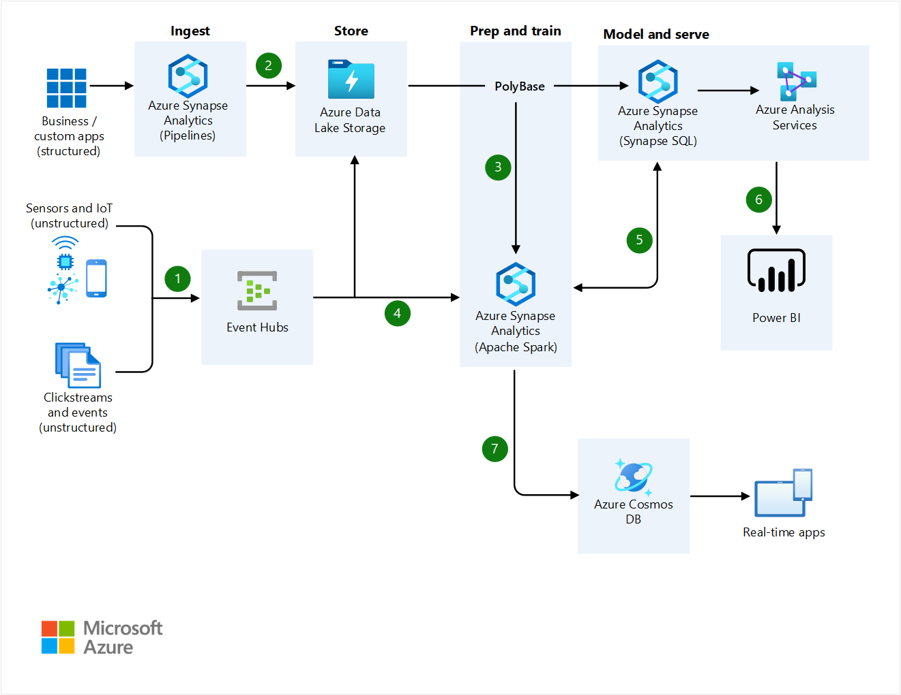

# Azure architecture icons

Helping our customers design solutions is core to the Azure Architecture Center's mission. Architecture diagrams like those included in our guidance can help communicate design decisions and the relationships between components of a given workload. On this page, you'll find an official collection of Azure architecture icons including Azure product icons to help you build a custom architecture diagram for your next solution.

To learn more about communicating design intent, see [Architecture design diagrams](/azure/well-architected/architect-role/design-diagrams) in the Azure Well-Architected Framework.

## General guidelines

### Do's

- Use the icon to illustrate how products can work together.
- In diagrams, we recommend including the product name somewhere close to the icon.
- Use the icons as they would appear within Azure.

### Don'ts

- Don't crop, flip, or rotate icons.
- Don't distort or change icon shape in any way.
- Don't use Microsoft product icons to represent your product or service.

## Example architecture diagrams

[Browse all Azure architectures](../browse/index.yml) to view other examples.

## Icon updates

|Month|Change description|
|--------------|--------------|
|March 2025|Added six new icons, including SQL Database Fleet manager and Microsoft Engage Center (Services Hub) along with a few non-service icons.|
|November 2024|Added 10 new icons such as Azure AI Foundry, Azure landing zone, Azure VPN client, and Azure Managed Redis.|
|July 2024|Rebranded more Microsoft Entra ID icons. Added new icons such as AI Content Safety, AKS Automatic, Application Gateway for Containers, and Azure Monitor Pipeline.|
|February 2024|Over 40 new icons for various services and components such as AI (including Azure OpenAI), Azure Operator, Microsoft Entra ID, and Azure networking.|
|August 2023|Added new Microsoft Entra ID icon. Reorganized folder structure of some icons.|

## Icon terms

Microsoft permits the use of these icons in architectural diagrams, training materials, or documentation. You may copy, distribute, and display the icons only for the permitted use unless granted explicit permission by Microsoft. Microsoft reserves all other rights.

I agree to the above terms.

 > [!div class="button"]
 > [Download SVG icons](https://arch-center.azureedge.net/icons/Azure_Public_Service_Icons_V21.zip)

## Use in Microsoft Visio

The icons are not provided in Visio stencil format. The icons are provided as general purpose SVG files. You can drag and drop these icons into many diagraming and drawing tools, including Visio. There are no plans to provide these icons as Visio stencils.

## More icon sets from Microsoft

- [Dynamics 365 icons](/dynamics365/get-started/icons)
- [Microsoft 365 architecture icons and templates](/microsoft-365/solutions/architecture-icons-templates)
- [Microsoft Entra ID architecture icons](/entra/architecture/architecture-icons)
- [Microsoft Power Platform icons](/power-platform/guidance/icons)
