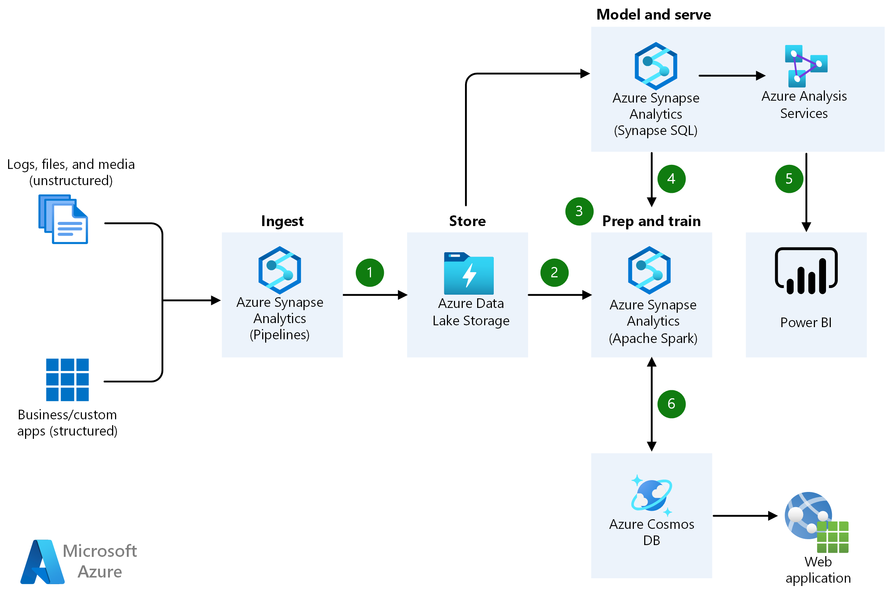

# Azure architecture icons

Helping our customers design and architect new solutions is core to the Azure Architecture Center's mission. Architecture diagrams like those included in our guidance can help communicate design decisions and the relationships between components of a given workload. On this page you'll find an official collection of Azure architecture icons including Azure product icons to help you build a custom architecture diagram for your next solution.

## General guidelines

### Do's

- Use the icon to illustrate how products can work together.
- In diagrams, we recommend including the product name somewhere close to the icon.
- Use the icons as they would appear within Azure.

### Don'ts

- Don't crop, flip or rotate icons.
- Don't distort or change icon shape in any way.
- Don't use Microsoft product icons to represent your product or service.

## Example architecture diagram

[Browse all Azure architectures](../browse/index.yml) to view other examples.

## Icon updates

|Month|Change description|
|--------------|--------------|
|March 2023|Added 7 icons for various services and components.|
|January 2023|Added ~106 icons for various services and components.|
|November 2022|Updated icon names from Azure Security Center to Microsoft Defender for Cloud.|
|January 2021|There are ~26 icons that have been added to the existing set.|
|November 2020|The folder structure of our collection of Azure architecture icons has changed. The FAQs and Terms of Use PDF files appear in the first level when you download the SVG icons below. The files in the icons folder are the same except there's no longer a CXP folder.|

## Icon terms

Microsoft permits the use of these icons in architectural diagrams, training materials, or documentation. You may copy, distribute, and display the icons only for the permitted use unless granted explicit permission by Microsoft. Microsoft reserves all other rights.

I agree to the above terms.

 > [!div class="button"]
 > [Download SVG icons](https://arch-center.azureedge.net/icons/Azure_Public_Service_Icons_V12.zip)

## More icon sets from Microsoft

- [Microsoft 365 architecture icons and templates](/microsoft-365/solutions/architecture-icons-templates)
- [Dynamics 365 icons](/dynamics365/get-started/icons)
- [Microsoft Power Platform icons](/power-platform/guidance/icons)
