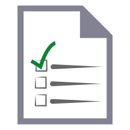

# Azure Architecture Center

<ul class="panelContent cardsC">
    <li>
        <a href="/azure/architecture/reference-architectures">
        

            

                

                    

                        

                            
                        

                    

                

                    <h3>Reference Architectures</h3>
                    
A set of recommended architectures for the cloud. Each architecture includes best practices, prescriptive steps, and deployable solution.

                

            

        

    

    </a>
</li>
<li>
    <a href="/azure/architecture/patterns/">
    

        

            

                

                    

                        
                    

                

                

                    <h3>Cloud Design Patterns</h3>
                    
Design patterns for developers and solution architects. Each pattern describes a problem, a pattern that addresses the problem, and an example based on Azure.

                

            

        

    

    </a>
</li>
<li>
    <a href="/azure/architecture/best-practices/">
    

        

            

                

                    

                        
                    

                

                

                    <h3>Best Practices for Cloud Applications</h3>
                    
Best practices for cloud applications, covering aspects such as auto-scaling, caching, data partitioning, API design, and others.

                

            

        

    

    </a>
</li>
</ul>

<ul class="panelContent cardsI">
    <li>
    <a href="/azure/architecture/checklist/">

    

        

            

                
            

        

        

            <h3>Design Review Checklists</h3>
            
Checklists to assist developers and solution architects during the design process.

        

    

</a>
    </li>
    <li>
    <a href="/azure/architecture/resiliency">

    

        

            

                
            

        

        

            <h3>Designing for Resiliency</h3>
            
Learn how to design resiliency applications for Azure.

        

    

</a>
    </li>
    <li>
    <a href="/azure/architecture/elasticsearch">

    

        

            

                
            

        

        

            <h3>Run Elasticsearch on Azure</h3>
            
Learn how to deploy, manage, and tune an Elasticsearch cluster on Azure.

        

    

</a>
    </li>
    <li>
    <a href="/azure/architecture/aws-professional">

    

        

            

                
            

        

        

            <h3>Azure for AWS Professionals</h3>
            
Leverage your AWS experiences in Microsoft Azure.

        

    

</a>
    </li>
    <li>
    <a href="/azure/architecture/multitenant-identity">

    

        

            

                
            

        

        

            <h3>Identity Management for Multitenant Applications</h3>
            
Understand the best practices for multitenancy, when using Azure AD for identity management.

        

    

</a>
    </li>
    <li>
    <a href="https://blogs.msdn.microsoft.com/azurecat/">

    

        

            

                
            

        

        

            <h3>Azure Customer Advisory Team</h3>
            
The AzureCAT team's blog

        

    

</a>
    </li>
    <li>
    <a href="https://blogs.msdn.microsoft.com/sqlcat/">

    

        

            

                
            

        

        

            <h3>SQL Server Customer Advisory Team</h3>
            
The SQLCAT team's blog

        

    

</a>
    </li>
</ul>
