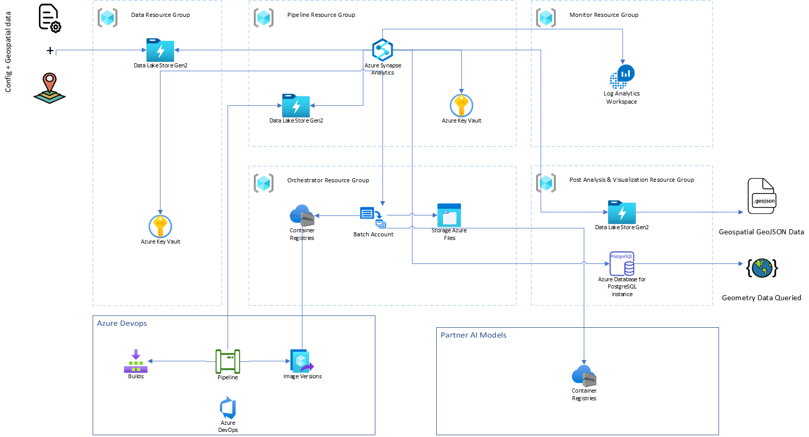

Spaceborne data collection is growing at an exponential rate. For the application of artificial intelligence, stored archives of data are necessary for machine learning. The need to build a cloud-based, end-to-end solution for geospatial analysis has become more important so enterprises and governments can drive better-informed business and tactical decisions. 

This architecture is designed to show an end-to-end implementation that involves extracting, loading, transforming, and analyzing spaceborne data by using geospatial libraries and AI models with [Azure Synapse Analytics](/azure/synapse-analytics/overview-what-is). This article also shows how to integrate geospatial-specific [Azure Cognitive Services](/azure/cognitive-services) models, AI models from partners, bring-your-own-data, and AI models that use Azure Synapse Analytics.

The architecture demonstrates how you can use Azure Synapse Analytics for geospatial analysis and for running AI models against spaceborne data. The intended audience for this document is users with intermediate skill levels in the geospatial space.

An implementation of this architecture is available on [GitHub](https://github.com/Azure/Azure-Orbital-Analytics-Samples).

apache note

## Potential use cases

This solution is ideal for the aerospace industry. It addresses these scenarios:

- Raster data ingestion and processing
- Object detection via pre-trained AI models
- Classification of land masses via AI models
- Monitoring changes in the environment via AI models
- Derived datasets from preprocessed imagery sets
- Vector visualization / small-area consumption
- Vector data filtering and cross-data joins

## Architecture

:::image type="content" border="false" source="./images/geospatial-processing-analytics/geospatial-processing-analytics-architecture.png" alt-text="Diagram that shows the geospatial processing analytics solution." lightbox="./images/geospatial-processing-analytics/geospatial-processing-analytics-architecture.png":::

### Dataflow

The following sections describe the stages of the architecture.

#### Data ingestion

- Spaceborne data is pulled from data sources like [Airbus](https://oneatlas.airbus.com/home), [NAIP/USDA (via the Planetary Computer API)](https://planetarycomputer.microsoft.com/dataset/naip), [Maxar](https://www.maxar.com), [Capella](https://www.capellaspace.com/), and [HEAD Aerospace](https://www.head-aerospace.eu/satellite-imagery). Data is ingested into [Azure Data Lake Storage](/azure/storage/blobs/data-lake-storage-introduction). 

   Azure Synapse Analytics provides various pipelines and activities, like Web activity, Data Flow activity, and custom activities, to connect to these sources and copy the data into Data Lake Storage.

   Azure Synapse custom activities run your customized code logic on an [Azure Batch](/azure/batch/batch-technical-overview) pool of virtual machines or [Docker-compatible containers](/azure/batch/batch-docker-container-workloads).
  
#### Data transformation

 - The data is processed and transformed into a format that can be consumed by analysts and AI models. Various geospatial libraries are available to perform the transformation, including GDAL, OGR, Rasterio, and GeoPandas.
 - Azure Synapse Spark pools provide the ability to configure and use these libraries to perform such data transformations. You can also use Azure Synapse custom activities, which use Batch pools. 
 - An [Azure Synapse notebook](/azure/synapse-analytics/spark/apache-spark-notebook-concept) is a web interface that you can use to create files that contain live code, visualizations, and narrative text. Notebooks are a good place to validate ideas, define transformations, and do quick experiments to get insights from your data and build a pipeline. In the sample code, the GDAL library is used in a Spark pool to perform data transformations. See the [sample code](#sample-code) section of this article for more details.
 - The sample solution implements this pipeline from this step of data transformation. It expects data to be copied in Data Lake Storage by the data ingestion methods described earlier. It demonstrates end-to-end implementation of this pipeline for raster data processing.

#### Analysis and execution of AI models

 - The Azure Synapse notebook environment analyzes and runs AI models. 
 - AI models developed with services like the Cognitive Services Custom Vision model, trained in their own environment, and packaged as Docker containers are available in the Azure Synapse environment.
 - From the Azure Synapse environment, you can also run AI models that are available from partners for various capabilities like object detection, change detection, and land classification. These models are trained in their own environment and packaged as Docker containers.
 - Azure Synapse can run such AI models via a custom activity that runs code in Batch pools as executables or Docker containers. The sample solution demonstrates how to run a [Custom Vision AI model](/azure/cognitive-services/custom-vision-service/overview) as part of an Azure Synapse pipeline for object detection over a specific geospatial area.

#### Post-analysis and visualization

 - Output from analysis and execution of the AI models can be stored in Data Lake Storage, data-aware databases like Azure Database for PostgreSQL, or Azure Cosmos DB for further analysis and visualization. The sample solution shows how to transform AI model output and store it as [GeoJSON](https://tools.ietf.org/html/rfc7946) data in Data Lake Storage and Azure Database for PostgreSQL. You can retrieve and query it from there.
 - You can use licensed tools like ArcGIS Desktop or open source tools like QGIS to visualize the data.
 - You can use Power BI to access GeoJSON from various data sources and visualize the geographic information system (GIS) data.
 - You can use client-side geospatial JavaScript-based libraries to visualize the data in web applications.

### Components

#### Data sources

- **Imagery providers**
	- [Airbus](https://oneatlas.airbus.com/home).
	- [NAIP/USDA (via the Planetary Computer API)](https://planetarycomputer.microsoft.com/dataset/naip).
	- [Maxar](https://www.maxar.com).
	- [Capella](https://www.capellaspace.com).
	- [HEAD Aerospace](https://www.head-aerospace.eu/satellite-imagery).
- **Bring your own data.** Copy your own data to Data Lake Storage.

#### Data ingestion

- [Azure Synapse Analytics](https://azure.microsoft.com/services/synapse-analytics) is a limitless analytics service that brings together data integration, enterprise data warehousing, and big data analytics. Azure Synapse contains the same Data Integration engine and experiences as Azure Data Factory, so you can to create rich, at-scale ETL pipelines without leaving Azure Synapse.
- [Azure Data Lake Storage](https://azure.microsoft.com/services/storage/data-lake-storage) is dedicated to big data analytics, and is built on [Azure Blob Storage](https://azure.microsoft.com/services/storage/blobs).
- [Azure Batch](https://azure.microsoft.com/services/batch) enables you to run and scale a large number of batch computing jobs on Azure. Batch tasks can run directly on virtual machines (nodes) in a Batch pool, but you can also set up a Batch pool to run tasks in [Docker-compatible containers](/azure/batch/batch-docker-container-workloads) on the nodes.
  - An Azure Synapse custom activity runs customized code logic on an Azure Batch pool of virtual machines or docker containers.
- [Azure Key Vault](https://azure.microsoft.com/services/key-vault) stores and controls access to secrets like tokens, passwords, and API keys. Key Vault also creates and controls encryption keys and manages security certificates.

#### Data transformation

The following geospatial libraries and packages are applied in combination to transformations. These libraries and packages are installed to a serverless Spark pool, which is then attached to an Azure Synapse notebook. For information on installing the libraries, see [Install Geospatial packages into a Synapse Spark pool](#install-geospatial-packages-into-a-synapse-spark-pool), later in this article. 

- **Geospatial libraries**
	- [GDAL](https://gdal.org) is a library of tools for manipulating spaceborne data. GDAL works on raster and vector data types. It's a good tool to know if you're working with spaceborne data.
	- [Rasterio](https://rasterio.readthedocs.io/en/latest/intro.html) is a module for raster processing. You can use it to read and write several different raster formats in Python. Rasterio is based on GDAL. Python automatically registers all known GDAL drivers for reading supported formats when importing the module.
	- [GeoPandas](https://geopandas.org/en/stable) is an open source project that can make it easier to work with spaceborne data in Python. GeoPandas extends the data types used by Pandas to allow spatial operations on geometric types.
	- [Shapely](https://shapely.readthedocs.io/en/stable/manual.html#introduction) is a Python package for set-theoretic analysis and manipulation of planar features using (via Python's ctypes module) functions from the widely deployed GEOS library.
	- [pyproj](https://pyproj4.github.io/pyproj/stable/examples.html) performs cartographic transformations. It converts from longitude and latitude to native map projection x, y coordinates, and vice versa, by using [PROJ](https://proj.org).
- [Azure Batch](https://azure.microsoft.com/services/batch).
- [Azure Synapse notebooks](https://docs.microsoft.com/azure/synapse-analytics/spark/apache-spark-notebook-concept) is a web interface for creating files that contain live code, visualizations, and narrative text. You can add existing Azure Synapse notebooks to an Azure Synapse pipeline by using the Notebook activity.
- [Apache Spark pool](https://docs.microsoft.com/azure/synapse-analytics/spark/apache-spark-overview#spark-pool-architecture). You can add existing Spark jobs to an Azure Synapse pipeline by using the Spark Job Definition activity.

#### Analysis and AI modeling

- [Azure Synapse](https://azure.microsoft.com/services/synapse-analytics) provides Machine Learning capabilities.
-  [Azure Batch](https://azure.microsoft.com/services/batch). In this solution, the Azure Synapse Custom activity is used to run Docker-based AI models on Azure Batch pools. 
- [Azure Cognitive Services](https://azure.microsoft.com/services/cognitive-services) enables you to embed the ability to see, hear, speak, search, understand, and accelerate advanced decision-making in your apps. You can use [Custom Vision](https://azure.microsoft.com/services/cognitive-services/custom-vision-service), a component of Cognitive Services, to customize and embed state-of-the-art computer vision image analysis for specific domains. 
- Microsoft Partner AI models like [blackshark.ai](https://blackshark.ai/).
- Bring-your-own AI models.

#### Post-analysis and visualization

- [Azure Database for PostgreSQL](https://azure.microsoft.com/services/postgresql). A fully managed relational database service designed for hyperscale workloads. Supports spaceborne data via the [PostGIS](https://www.postgis.net) extension.
- [Azure Cosmos DB](https://azure.microsoft.com/services/cosmos-db) supports indexing and querying of geospatial point data that's represented in [GeoJSON](https://tools.ietf.org/html/rfc7946).
- [Power BI](https://powerbi.microsoft.com). An interactive data visualization tool to build reports and dashboards through visuals to provide insights to data including spaceborne data through Esri [ArcGIS Maps](https://powerbi.microsoft.com/power-bi-esri-arcgis/)
- [QGIS](https://www.qgis.org/) A free and open source GIS to create, edit, visualise, analyse and publish geospatial information.
- [ArcGIS Desktop](https://www.esri.com/arcgis/products/arcgis-desktop/overview) is a licensed software provided by Esri to create, analyze, manage and share geographic information.

### Alternatives

- [Azure Kubernetes Service](https://docs.microsoft.com/azure/aks/), [Azure Container Instances](https://docs.microsoft.com/azure/container-instances/), [Azure Container Apps](https://azure.microsoft.com/services/container-apps/) provide alternatives to run containerized AI models which can be called from Azure Synapse Analytics.
- [Azure Databricks](https://docs.microsoft.com/azure/databricks/) provides a viable alternative option to host an end-to-end analytics pipeline.
- [Azure HDInsight Spark](https://docs.microsoft.com/azure/hdinsight/spark/apache-spark-overview) provides a viable alternative option to use geospatial libraries in the Apache Spark environment.

Some other alternative geospatial libraries / frameworks that can be used for geospatial processing are:
- [Apache Sedona](https://sedona.apache.org/) was formerly called GeoSpark, is a cluster computing system for processing large-scale spatial data. Sedona extends Apache Spark / SparkSQL with a set of out-of-the-box Spatial Resilient Distributed Datasets / SpatialSQL that efficiently load, process, and analyze large-scale spatial data across machines.
- [Dask for Python](https://tutorial.dask.org/00_overview.html) is a parallel computing library that scales the existing Python ecosystem.


## Considerations

### Operational excellence

- [Azure Devops and Azure Synapse Analytics](https://docs.microsoft.com/en-us/azure/synapse-analytics/cicd/source-control#:~:text=The%20configuration%20pane%20shows%20the%20following%20Azure%20DevOps,%3Cyour%20organization%20name%3E%20%206%20more%20rows%20?msclkid=f10ed11caab011ec9afb89a6db3e1e9f) if you have a need for collaboration using Git for source control, Synapse Studio allows you to associate your workspace with a Git repository, Azure DevOps, or GitHub. 
  - In an Azure Synapse Analytics workspace, CI/CD moves all entities from one environment (development, test, production) to another environment. 
  - You can use Azure DevOps release pipeline and GitHub Actions to automate the deployment of an Azure Synapse workspace to multiple environments.

### Performance

- [Speed up your data workloads with performance updates to Apache Spark 3.1.2 in Azure Synapse](https://techcommunity.microsoft.com/t5/azure-synapse-analytics-blog/speed-up-your-data-workloads-with-performance-updates-to-apache/ba-p/2769467#:~:text=In%20the%20new%20release%20of%20Spark%20on%20Azure,your%20data%2C%20faster%20and%20at%20a%20lower%20cost.) Azure Synapse Analytics supports Apache Spark 3.1.2, that is more performant than its predecessors. 
- [Spark pools in Azure Synapse Analytics](https://docs.microsoft.com/azure/synapse-analytics/spark/apache-spark-pool-configurations)
- [Azure Batch](https://docs.microsoft.com/azure/batch/batch-technical-overview) provides capability to scale out intrinsically parallel for transformations submitted as Azure Synapse Custom activity. For running the AI models, Azure Batch supports specialized GPU-optimized VM sizes.


### Reliability

- [Azure Synapse SLA](https://azure.microsoft.com/support/legal/sla/synapse-analytics/v1_1/)
   - This architecture is based on Azure Synapse Analytics. Please refer the SLA for more information.

### Security

Please refer the following security best practices 

- [Azure Synapse Analytics security](https://docs.microsoft.com/azure/synapse-analytics/guidance/security-white-paper-introduction)
- [Azure Synapse Analytics security white paper: Data protection](https://docs.microsoft.com/azure/synapse-analytics/guidance/security-white-paper-data-protection)
- [Azure Synapse Analytics security white paper: Access control](https://docs.microsoft.com/azure/synapse-analytics/guidance/security-white-paper-access-control)
- [Azure Synapse Analytics security white paper: Authentication](https://docs.microsoft.com/azure/synapse-analytics/guidance/security-white-paper-authentication)
- [Azure Synapse Analytics Network security](https://docs.microsoft.com/azure/synapse-analytics/guidance/security-white-paper-network-security)

## Deploy this scenario

A deployment of the sample solution is available using [Bicep](https://docs.microsoft.com/azure/azure-resource-manager/bicep/overview?tabs=bicep) files. Instructions on how to get started with this deployment can be accessed [here](https://github.com/Azure/Azure-Orbital-Analytics-Samples).



### Limitations

This architecture showcases the functional working of an end-to-end geoprocessing and analytics solution that uses Azure Synapse Analytics. This sample implementation is targeted for small to medium area of interest and a limited concurrent geoprocessing of raster data.

### Sample code

The following article shows how to read, write and apply transformations to raster data that is stored in Azure Data Lake Storage using Synapse Notebook. The intention is more to showcase the usage of libraries in Synapse notebooks rather than the actual transformation itself. 

#### Prerequisites

  - [Install geospatial libraries](#install-geospatial-packages-into-a-synapse-spark-pool)
  - [Create an Azure Key Vault](https://docs.microsoft.com/en-us/azure/key-vault/general/quick-create-portal#create-a-vault) to store secrets. In this case, we will store the access key of the storage account in the Key Vault. Instructions on how to do this is available [here](https://docs.microsoft.com/bs-latn-ba/azure/data-factory/store-credentials-in-key-vault).
  - [Create a linked service](https://docs.microsoft.com/en-us/azure/data-factory/concepts-linked-services?tabs=synapse-analytics#linked-service-with-ui) for Azure Key Vault using Azure Synapse Aalytics via `Manage` hub.
  

- Print information from the raster data 
 
  ```python
  from osgeo import gdal  
  gdal.UseExceptions()
  access_key = TokenLibrary.getSecret('<key-vault-name>','<secret-name>')
  gdal.SetConfigOption('AZURE_STORAGE_ACCOUNT', '<storage_account_name>')
  gdal.SetConfigOption('AZURE_STORAGE_ACCESS_KEY', access_key)  
  dataset_info = gdal.Info('/vsiadls/aoa/input/sample_image.tiff')  #/vsiadls/<container_name>/path/to/image
  print(dataset_info)
  ```
  
  Output:
  
  ```output
  Driver: GTiff/GeoTIFF
	Files: /vsiadls/naip/input/sample_image.tiff
	Size is 6634, 7565
	Coordinate System is:
	PROJCRS["NAD83 / UTM zone 16N",
	    BASEGEOGCRS["NAD83",
	        DATUM["North American Datum 1983",
	            ELLIPSOID["GRS 1980",6378137,298.257222101,
	                LENGTHUNIT["metre",1]]],
	        PRIMEM["Greenwich",0,
	            ANGLEUNIT["degree",0.0174532925199433]],
	        ID["EPSG",4269]],
	    CONVERSION["UTM zone 16N",
	        METHOD["Transverse Mercator",
	            ID["EPSG",9807]],
	        PARAMETER["Latitude of natural origin",0,
	            ANGLEUNIT["degree",0.0174532925199433],
	            ID["EPSG",8801]],
	        PARAMETER["Longitude of natural origin",-87,
	            ANGLEUNIT["degree",0.0174532925199433],
	            ID["EPSG",8802]],
	        PARAMETER["Scale factor at natural origin",0.9996,
	            SCALEUNIT["unity",1],
	            ID["EPSG",8805]],
	        PARAMETER["False easting",500000,
	            LENGTHUNIT["metre",1],
	            ID["EPSG",8806]],
	        PARAMETER["False northing",0,
	            LENGTHUNIT["metre",1],
	            ID["EPSG",8807]]],
	    CS[Cartesian,2],
	        AXIS["(E)",east,
	            ORDER[1],
	            LENGTHUNIT["metre",1]],
	        AXIS["(N)",north,
	            ORDER[2],
	            LENGTHUNIT["metre",1]],
	    USAGE[
	        SCOPE["Engineering survey, topographic mapping."],
	        AREA["North America - between 90°W and 84°W - onshore and offshore. Canada - Manitoba; Nunavut; Ontario. United States (USA) - Alabama; Arkansas; Florida; Georgia; Indiana; Illinois; Kentucky; Louisiana; Michigan; Minnesota; Mississippi; Missouri; North Carolina; Ohio; Tennessee; Wisconsin."],
	        BBOX[23.97,-90,84,-84]],
	    ID["EPSG",26916]]
	Data axis to CRS axis mapping: 1,2
	Origin = (427820.000000000000000,3395510.000000000000000)
	Pixel Size = (1.000000000000000,-1.000000000000000)
	Metadata:
	  AREA_OR_POINT=Area
	Image Structure Metadata:
	  COMPRESSION=DEFLATE
	  INTERLEAVE=PIXEL
	  LAYOUT=COG
	  PREDICTOR=2
	Corner Coordinates:
	Upper Left  (  427820.000, 3395510.000) ( 87d45'13.12"W, 30d41'24.67"N)
	Lower Left  (  427820.000, 3387945.000) ( 87d45'11.21"W, 30d37'18.94"N)
	Upper Right (  434454.000, 3395510.000) ( 87d41' 3.77"W, 30d41'26.05"N)
	Lower Right (  434454.000, 3387945.000) ( 87d41' 2.04"W, 30d37'20.32"N)
	Center      (  431137.000, 3391727.500) ( 87d43' 7.54"W, 30d39'22.51"N)
	Band 1 Block=512x512 Type=Byte, ColorInterp=Red
	  Overviews: 3317x3782, 1658x1891, 829x945, 414x472
	Band 2 Block=512x512 Type=Byte, ColorInterp=Green
	  Overviews: 3317x3782, 1658x1891, 829x945, 414x472
	Band 3 Block=512x512 Type=Byte, ColorInterp=Blue
	  Overviews: 3317x3782, 1658x1891, 829x945, 414x472
	Band 4 Block=512x512 Type=Byte, ColorInterp=Undefined
	  Overviews: 3317x3782, 1658x1891, 829x945, 414x472
	```	
  
	> - **/vsiadls/** is a filesystem handler that allows on-the-fly random reading of (primarily non-public) files available in Microsoft Azure Data Lake Storage file systems, without prior download of the entire file. It has similar capabilities as **/vsiaz/**, and in particular uses the same configuration options for authentication. Its advantages over /vsiaz/ are a real management of directory and Unix-style ACL support. Some features require the Azure storage to have hierarchical support turned on. Please refer to its [documentation](https://gdal.org/user/virtual_file_systems.html#vsiadls-microsoft-azure-data-lake-storage-gen2) for more details.
	
- Convert GeoTiff to PNG using GDAL

	```python
	from osgeo import gdal
	gdal.UseExceptions()
	access_key = TokenLibrary.getSecret('<key-vault-name>','<secret-name>')
	gdal.SetConfigOption('AZURE_STORAGE_ACCOUNT', '<storage_account_name>')
	gdal.SetConfigOption('AZURE_STORAGE_ACCESS_KEY', access_key) 
	tiff_in = "/vsiadls/aoa/input/sample_image.tiff"	#/vsiadls/<container_name>/path/to/image
	png_out = "/vsiadls/aoa/input/sample_image.png"	#/vsiadls/<container_name>/path/to/image
	options = gdal.TranslateOptions(format='PNG')
	gdal.Translate(png_out, tiff_in, options=options)
	```
	
- Approach for Storing GeoTiff images to Azure Data Lake Storage. 
	
	> Due to the nature of how data is stored in cloud and the fact the file handlers `/vsiaz/` or `/vsiadls/` support only sequential writes, we leverage the file mount feature available in [mssparkutils package](https://docs.microsoft.com/azure/synapse-analytics/spark/synapse-file-mount-api). Once the output is written to a mount location,  copy it to ADLS Gen2 as shown in the below sample transformation.
	
	```python
	import shutil
	import sys
	from osgeo import gdal
	from notebookutils import mssparkutils 

	mssparkutils.fs.mount( 
    	"abfss://<container_name>@<storage_account_name>.dfs.core.windows.net", 
    	"/<mount_path>", 
    	{"linkedService":"<linked_service_name>"} 
	)
	
	access_key = TokenLibrary.getSecret('<key-vault-name>','<secret-name>')
    gdal.SetConfigOption('AZURE_STORAGE_ACCOUNT', '<storage_account_name>')
    gdal.SetConfigOption('AZURE_STORAGE_ACCESS_KEY', access_key) 

    options = gdal.WarpOptions(options=['tr'], xRes=1000, yRes=1000)
    gdal.Warp('dst_img.tiff', '/vsiadls/<container_name>/path/to/src_img.tiff', options=options)

    jobId = mssparkutils.env.getJobId()
	
    shutil.copy("dst_img.tiff", f"/synfs/{jobId}/<mount_path>/path/to/dst_img.tiff")
	```	
    > Azure Synapse Analytics allows you to add Azure Data Lake Storage Gen2 as one of the linked services. This can be done using the UI as documented [here](https://docs.microsoft.com/azure/data-factory/concepts-linked-services?context=%2Fazure%2Fsynapse-analytics%2Fcontext%2Fcontext&tabs=synapse-analytics#linked-service-with-ui)
	
### Sample solution

An implementation of this architecture is available on [GitHub](https://github.com/Azure/Azure-Orbital-Analytics-Samples).

The sequence diagram below shows the steps of the sample solution.


1. Azure Synapse pipeline reads the spaceborne data from Azure Data Lake Storage
	- This spaceborne data data is pulled from spaceborne data sources and copied to Azure Data Lake Storage, this data ingestion is not part of reference implementation.
2. The data is processed using GDAL library using Azure Synapse Notebooks
3. The processed data is stored in Azure Data Lake Storage
4. This processed data is read from Azure Data Lake Storage and passed to the object detection custom vision AI models using Azure Synapse custom activity
	- This custom activity uses Azure Batch pools to run the object detection model
5. The object detection model outputs a list of detected objects and bounding boxes
6. The detected objects are stored in Azure Data Lake Storage
	- The objects are converted to GeoJSON format and stored in Azure Data Lake Storage
7. This GeoJSON data is read from Azure Data Lake Storage and stored to PostGresSQL database
8. This data is read from PostGresSQL database and can be visualized further in tools like ArcGIS Pro, QGIS, and PowerBI

### Install Geospatial packages into a Synapse Spark pool

You'll need to install packages into Synapse Spark pool using the package management feature. For more information, visit [Synapse Package Management](https://docs.microsoft.com/en-us/azure/synapse-analytics/spark/apache-spark-azure-portal-add-libraries).

To support Geospatial workloads on Azure Synapse, it requires libraries like [GDAL](https://gdal.org/), [Rasterio](https://rasterio.readthedocs.io/en/latest/intro.html), [Geopandas](https://geopandas.org/en/stable/), just to name a few. These libraries are installed on a given serverless Apache Spark pool using a yaml file. The Spark pool comes with [Anaconda](https://docs.continuum.io/anaconda/) libraries pre-installed.

#### Prerequisites

- [Create a Synapse workspace](https://docs.microsoft.com/en-us/azure/synapse-analytics/get-started-create-workspace)

- [Create the Apache Spark pool in Synapse Studio](https://docs.microsoft.com/en-us/azure/synapse-analytics/quickstart-create-apache-spark-pool-studio#create-the-apache-spark-pool-in-synapse-studio)

#### Steps

1. The following libraries/packages are available in the [environment.yml](https://github.com/Azure/Azure-Orbital-Analytics-Samples/deploy/environment.yml) file. This file will be used to install the libraries to the Spark pools.

	```yaml
	name: aoi-env
	channels:
  	  - conda-forge
  	  - defaults
	dependencies:
  	  - azure-storage-file-datalake
	  - gdal=3.3.0
	  - libgdal
	  - pip>=20.1.1		
	  - pyproj
  	  - shapely
  	  - pip:
        - rasterio
        - geopandas
	```
**Note:** GDAL uses virtual file system [/vsiadls/](https://gdal.org/user/virtual_file_systems.html#vsiadls-microsoft-azure-data-lake-storage-gen2) for Azure Data Lake Storage Gen2. This support is available from [GDAL v3.3.0](https://github.com/OSGeo/gdal/blob/eeeffe624996518655f231125712582551222932/gdal/NEWS#L9). When using GDAL please ensure the version is >= 3.3.0.

2. Go to [https://web.azuresynapse.net](https://web.azuresynapse.net) and sign in to your workspace. 

3. Select **Manage** from the main navigation panel and then select **Apache Spark pools**
4. Select **Packages** by clicking `...` on the specific Spark pool, upload the `environment.yml` file from local and apply the package settings.

5. The notification section of the portal notifies you once the installation has been completed. You can also track the installation progress by following the below steps:
	1. Navigate to the Spark applications list in the **Monitor** tab.
	2. Select **SystemReservedJob-LibraryManagement** that corresponds to your pool update.
	
	3. View the driver logs 

6. Finally, run the following code to verify the installed libraries and the respective version. This will also display all the pre-installed libraries that Conda installs.

    ```python
    import pkg_resources
    for d in pkg_resources.working_set:
       print(d)
    ```

For more information on managing packages, please visit [Manage packages](https://docs.microsoft.com/en-us/azure/synapse-analytics/spark/apache-spark-manage-python-packages) on Azure Synapse.

## Pricing

Review the following resources for pricing and cost optimization:

- [Plan to manage costs for Azure Synapse Analytics](https://docs.microsoft.com/azure/synapse-analytics/plan-manage-costs?msclkid=af63ba3caa2111ec86673cc969d7ed5e#monitor-costs)
- [Azure Synapse - use Azure Pricing calculator](https://azure.microsoft.com/pricing/calculator/?service=synapse-analytics)
- [Apache Spark pool in Azure Synapse Analytics](https://docs.microsoft.com/azure/synapse-analytics/spark/apache-spark-pool-configurations?msclkid=3fe55d68aa2111ec9c3fdac2368fec1a#autoscale)
- [Nodes and pools in Azure Batch](https://docs.microsoft.com/azure/batch/nodes-and-pools?msclkid=5bf9ea8caa2111eca300073ea3740fa6#pool-and-compute-node-lifetime)
- [Azure Batch - use Azure Pricing calculator](https://azure.microsoft.com/pricing/calculator/?service=batch)

**Note:** Please refer the AI model partners documentation for the pricing and license terms of using their AI models in the solution.

## Related resources
 
- [Geospatial data processing and analytics](https://docs.microsoft.com/azure/architecture/example-scenario/data/geospatial-data-processing-analytics-azure)
- [Azure Maps Geospatial Services](https://microsoft.github.io/SynapseML/docs/features/geospatial_services/GeospatialServices%20-%20Overview/)
- [Getting geospatial insides in big data using SynapseML](https://techcommunity.microsoft.com/t5/azure-maps-blog/getting-geospatial-insides-in-big-data-using-synapseml/ba-p/3154717)