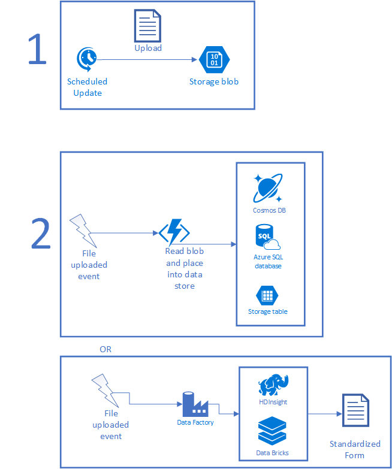
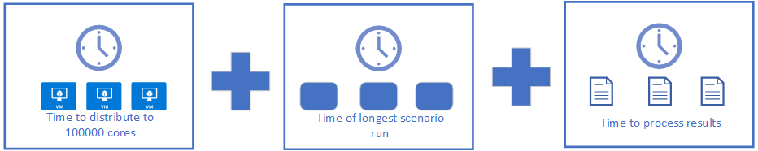

Over the last several years, insurers and companies that provide insurance-like products have seen several new regulations come into place. These new regulations have required more extensive financial modeling for insurers. The European Union enacted [Solvency II](https://eur-lex.europa.eu/legal-content/EN/ALL/?uri=celex%3A32009L0138). This law requires insurers to demonstrate that they've done their proper analysis to validate that the insurer will be solvent at the end of the year. Insurers who provide variable annuities have to follow [Actuarial Guideline XLIII](https://eur-lex.europa.eu/legal-content/EN/ALL/?uri=celex%3A32009L0138) with extensive analysis of asset and liability cash flows. All types of insurers, including those who distribute insurance-like products, will have to implement [International Financial Reporting Standard 17](https://www.ifrs.org/issued-standards/list-of-standards/ifrs-17-insurance-contracts/) (IFRS 17) by 2021. (*IFRS* stands for International Financing Reporting Standards.) Other regulations exist, depending on the jurisdictions the insurers operate in. These standards and regulations require actuaries to use compute-intensive techniques when modeling assets and liabilities. Much of the analysis will make use of stochastically generated scenario data over seriatim inputs of things like assets and liabilities. Beyond regulatory needs, actuaries do a fair amount of financial modeling and computation. They create the input tables for the models that generate the regulatory reports. Internal grids don't satisfy the computational needs, so actuaries are steadily moving to the cloud.

Actuaries move to the cloud to get more time to review, evaluate, and validate results. When regulators audit insurers, the actuaries need to be able to explain their results. The move to the cloud gives them access to the computing resources to run 20,000 hours of analysis in 24-120 hours of clock time, through the power of parallelization. To assist with this need for scale, many of the companies that create actuarial software provide solutions that allow calculations to run in Azure. Some of these solutions are built on technologies that run on-premises and on Azure, like the high-performance computing PowerShell solution, [HPC Pack](/powershell/high-performance-computing/overview?view=hpc16-ps&WT.mc_id=riskmodel-docs-scseely). Other solutions are native to Azure and use [Azure Batch](/azure/batch?WT.mc_id=riskmodel-docs-scseely), [Virtual Machine Scale Sets](/azure/virtual-machine-scale-sets?WT.mc_id=riskmodel-docs-scseely), or a custom scaling solution.

In this article, we'll look at how actuarial developers can use Azure, coupled with modeling packages, to analyze risk. The article explains some of the Azure technologies that the modeling packages use to run at scale on Azure. You can use the same technology to do further analysis of your data. We look at the following items:

- Running larger models in less time, in Azure.
- Reporting on the results.
- Managing data retention.

Whether you service life, property and casualty, health, or other insurance, you need to create financial and risk models of your assets and liabilities. You can then adjust your investments and premiums so that you stay solvent as an insurer. IFRS 17 reporting adds changes to the models that the actuaries create, like calculating the contractual service margin (CSM), which changes how insurers manage their profit through time.

## Running more in less time, in Azure

You believe in the promise of the cloud: it can run your financial and risk models faster and easier. For many insurers, a back of the envelope calculation shows the problem: they need years, or even decades, of sequential time to run these calculations from start to finish. You need technology to solve the runtime problem. Your strategies are:

- Data preparation: Some data changes slowly. Once a policy or service contract is in force, claims move at a predictable pace. You can prepare the data needed for model runs as it arrives, eliminating a need to plan much time for data cleansing and preparation. You may also use clustering to create stand-ins for seriatim data through weighted representations. Fewer records usually results in reduced computation time.
- Parallelization: If you need to do the same analysis to two or more items, you may be able to perform the analysis simultaneously.

Let's look at these items individually.

### Data preparation

Data flows in from several different sources. You have semi-structured policy data in your books of business. You also have information about the insured people, companies, and the items that appear in various application forms. Economic Scenario Generators (ESGs) produce data in a variety of formats which may need translation to a form your model can use. Current data on values of assets also needs normalization. The stock market data, cash flow data on rentals, payment information on mortgages, and other asset data all need some preparation when you move from the source to the model. Finally, you should update any assumptions based on recent experience data. To speed up a model run, you prepare the data ahead of time. At run time you do any necessary updates to add in changes since the last scheduled update.

So, how do you prepare the data? Let's first look at the common bits and then look at how to work with the different ways data will appear. First, you want a mechanism to get all the changes since the last synchronization. That mechanism should include a value that's sortable. For recent changes, that value should be greater than any previous change. The two most common two mechanisms are an ever-increasing ID field or a timestamp. If a record has an increasing ID key, but the rest of the record contains fields that can be updated, then you need to use something like a &quot;last-modified&quot; timestamp to find the changes. Once the records have been processed, record the sortable value of the last item updated. This value, probably a timestamp on a field called *lastModified*, becomes your watermark, used for subsequent queries on the data store. Data changes can be processed in many ways. Here are two common mechanisms that use minimal resources:

- If you have hundreds or thousands of changes to process, upload the data to blob storage. Use an event trigger in [Azure Data Factory](/azure/data-factory?WT.mc_id=riskmodel-docs-scseely) to process the changeset.
- If you have small sets of changes to process, or if you want to update your data as soon as a change happens, put each change into a queue message that's hosted by [Service Bus](/azure/service-bus-messaging?WT.mc_id=riskmodel-docs-scseely) or [Storage Queues](/azure/storage/queues/storage-queues-introduction?WT.mc_id=riskmodel-docs-scseely). [This article](/azure/service-bus-messaging/service-bus-azure-and-service-bus-queues-compared-contrasted?WT.mc_id=riskmodel-docs-scseely) has a great explanation about the tradeoffs between the two queueing technologies. Once a message is in a queue, you can use a trigger in Azure Functions or Azure Data Factory to process the message.

The following figure illustrates a typical scenario. First, a scheduled job collects some set of data and places the file into storage. The scheduled job can be a CRON job running on premises, a [Scheduler task](/azure/scheduler?WT.mc_id=riskmodel-docs-scseely), [Logic App](/azure/logic-apps/logic-apps-overview?WT.mc_id=riskmodel-docs-scseely), or anything that runs on a timer. Once the file is uploaded, an [Azure Function](/azure/azure-functions?WT.mc_id=riskmodel-docs-scseely) or **Data Factory** instance can be triggered to process the data. If the file can be processed in a short period of time, use a **Function**. If the processing is complex, requires AI or other complex scripting, you may find that [HDInsight](/azure/hdinsight?WT.mc_id=riskmodel-docs-scseely), [Azure Databricks](/azure/azure-databricks?WT.mc_id=riskmodel-docs-scseely), or something custom works better. When done, the file winds up in a usable form as a new file or as records in a database.

 

Once the data is in Azure, you need to make it usable by the modeling application. You can write code to do custom transformations, run the items through **HDInsight** or Azure **Databricks** to ingest larger items, or copy the data into the right data sets. The use of big data tools can also help you do things like transform unstructured data into structured data as well as run any AI and machine learning over the received data. You can also host virtual machines, upload data straight to data sources from on-premises, call Azure Functions directly, and so on.

Later, the data needs to be consumed by your models. The way you do this depends largely on how the calculations need to access data. Some modeling systems require all data files to live on the node that runs the calculation. Others can make use of databases like [Azure SQL Database](/azure/sql-database/?WT.mc_id=riskmodel-docs-scseely), [MySQL](/azure/mysql/?WT.mc_id=riskmodel-docs-scseely), or [PostgreSQL](/azure/postgresql/?WT.mc_id=riskmodel-docs-scseely). You can use a low-cost version of any of these items, and then scale up the performance during a modeling run. This gives you the price you need for everyday work. Plus it gives you the extra speed just when thousands of cores are requesting data. Normally, this data will be read-only during a modeling run. If your calculations occur across multiple regions, consider using [Azure Cosmos DB](/azure/cosmos-db/distribute-data-globally?WT.mc_id=riskmodel-docs-scseely) or [Azure SQL geo-replication](/azure/sql-database/sql-database-geo-replication-overview?WT.mc_id=riskmodel-docs-scseely). Both provide mechanisms to automatically replicate data across regions with low latency. Your choice depends on the tools your developers know, how you've modeled your data, and the number of regions used for your modeling run.

Do spend some time thinking about where to store your data. Understand how many simultaneous requests for the same data will exist. Think about how you'll distribute the information:

- Does each computational node get its own copy?
- Is the copy shared through some high bandwidth location?

If you keep data centralized using Azure SQL, you'll likely keep the database at a lower-priced tier most of the time. If the data is only used during a modeling run and isn't updated very often, Azure customers will go so far as to back up the data and turn off their database instances between runs. The potential savings are large. Customers can also make use of [Azure SQL Elastic Pools](/azure/sql-database/sql-database-elastic-pool?WT.mc_id=riskmodel-docs-scseely). These are designed to control database costs, especially when you don't know which databases will be under a lot of load at different times. The elastic pools allow a collection of databases to use as much power as they need, then scale back once demand shifts elsewhere in the system.

You may need to disable data synchronization during a modeling run so that calculations later in the process are using the same data. If you use queuing, then disable the message processors but allow the queues to receive data.

You can also use the time before the run to generate economic scenarios, update actuarial assumptions, and generally update other static data. Let's look at economic scenario generation (ESG). The [Society of Actuaries](https://www.soa.org/) provides the [Academy Interest Rate Generator](https://www.soa.org/tables-calcs-tools/research-scenario/) (AIRG), an ESG which models U. S. Treasury yields. AIRG is prescribed for use in items like Valuation Manual 20 (VM-20) calculations. Other ESGs may model the stock market, mortgages, commodity prices, and so on.

Because your environment pre-processes the data, you can also run other pieces early. For example, you may have things which you model that use records to represent larger populations. One usually does this by clustering records. If the dataset is updated sporadically, such as once a day, one can reduce the record set to what will be used in the model as part of the ingestion process.

Let's look at a practical example. With IFRS-17, you need to group your contracts together such that the maximum distance between the start dates for any two contracts is less than one year. Let's assume that you do this the easy way and use the contract year as the grouping mechanism. This segmentation can be done while data is loaded into Azure by reading through the file and moving the records to the appropriate year groupings.

Focusing on data preparation reduces the time necessary to run the model components. By getting the data in early, you can save clock time for running your models.

### Parallelization

Proper parallelization of the steps can shrink clock execution time dramatically. This speedup happens by streamlining the pieces that you implement and knowing how to express your model in a way that allows for two or more activities to run simultaneously. The trick is to find balance between the size of the work request and the productivity of an individual node. If the task spends more time in setup and cleanup than it does in evaluation, you went too small. If the task is too large, execution time doesn't improve. You want the activity to be small enough to spread over multiple nodes and make a positive difference in elapsed execution time.

To get the most out of your system, you need to understand the workflow for your model and how the computations interact with the ability to scale out. Your software may have a notion of jobs, tasks, or something similar. Use that knowledge to design something that can split work up. If you have some custom steps in your model, design those to allow for inputs to be split into smaller groups for processing. This design is often referred to as a scatter-gather pattern.

- Scatter: split the inputs along natural lines and allow separate tasks to run.
- Gather: as the tasks complete, collect their outputs.

When splitting things, also know where the process needs to synchronize before moving forward. There are a few common places where people split things up. For nested stochastic runs, you may have a thousand outer loops with a set of inflection points that run inner loops of one hundred scenarios. Each outer loop can run simultaneously. You halt at an inflection point, then run the inner loops simultaneously, bring the information back to adjust the data for the outer loop, and go forward again. The following figure illustrates the workflow. Given enough compute, you can run the 100,000 inner loops on 100,000 cores, bringing processing time down to the sum of the following times:

Distribution will increase a bit depending on how that is done. It may be as simple as constructing a small job with the right parameters, or as complex as copying 100K files to the right places. Processing results can even be sped up if you can distribute the result aggregation using Apache Spark from Azure HDInsight, Azure Databricks, or your own deployment. For example, computing averages is a simple matter of remembering the number of items seen so far and the sum. Other computations may work better on a single machine with thousands of cores. For those, you can make use of GPU-enabled machines in Azure.

Most actuarial teams start this journey by moving their models to Azure. Then they collect timing data on the various steps in the process. Then they sort the clock time for each step from longest to shortest elapsed time. They won't look at total execution time since something may consume thousands of core hours but only 20 minutes elapsed time. For each of the longest running job steps the actuarial developers look for ways to decrease the elapsed time while getting the right results. This process repeats regularly. Some actuarial teams will set a target run time, let's say an overnight hedging analysis has a goal of running in under 8 hours. As soon as the time creeps over 8.25 hours, some part of the actuarial team will switch over to improve the time of the longest piece in the analysis. Once they get the time back under 7.5 hours, they switch back to development. The heuristics to go back and optimize vary among actuaries.

To run all this you have several options. Most actuarial software works with compute grids. Grids that work on-premises and on Azure use either [HPC Pack](/azure/virtual-machines/windows/hpcpack-cluster-options?WT.mc_id=riskmodel-docs-scseely), a partner package, or something custom. Grids optimized for Azure will use [Virtual Machine Scale Sets](/azure/virtual-machine-scale-sets/?WT.mc_id=riskmodel-docs-scseely), [Batch](/azure/batch/?WT.mc_id=riskmodel-docs-scseely), or something custom. If you choose to use either Scale Sets or Batch, make sure to look at their support for low priority virtual machines (VMs) ([Scale Sets](/azure/virtual-machine-scale-sets/virtual-machine-scale-sets-use-low-priority?WT.mc_id=riskmodel-docs-scseely) low priority docs, [Batch](/azure/batch/batch-low-pri-vms?WT.mc_id=riskmodel-docs-scseely) low priority docs). A low priority VM is a VM running on hardware that you can rent for a fraction of the normal price. The lower price is available because low priority VMs may be preempted when capacity demands it. If you have some flexibility in your time budget, the low priority VMs provide a great way to reduce the price of a modeling run.

If you need to coordinate the execution and deployment across many machines, perhaps with some machines running in different regions, you can take advantage of CycleCloud. CycleCloud costs nothing extra. It orchestrates data movement when necessary. This includes allocation, monitoring, and shut down of the machines. It can even handle low priority machines, making sure expenses are contained. You can go so far as to describe the mix of machines you need. For example, maybe you need a class of machine but can run well on any version that has 2 or more cores. Cycle can allocate cores across those machine types.

## Reporting on the results

Once the actuarial packages have run and produced their results, you'll have several regulator-ready reports. You'll also have a mountain of new data that you may want to analyze to generate insights not required by regulators or auditors. You may want to understand the profile of your best customers. Using insights, you can tell marketing what a low-cost customer looks like so that marketing and sales can find them faster. Likewise, you can use the data to discover which groups benefit the most from having the insurance. For example, you may discover that people who take advantage of an annual physical found out about early stage health issues earlier. This saves the insurance company time and money. You can use that data to drive behavior in your customer base.

To do this, you'll want access to plenty of data science tooling as well as some pieces for visualization. Depending on how much investigation you want to do, you can start with [a Data Science VM](/azure/machine-learning/data-science-virtual-machine/overview?WT.mc_id=riskmodel-docs-scseely) which can be provisioned from the Azure Marketplace. These VMs have both Windows and Linux versions. Installed, you'll find Microsoft R Open, Microsoft Machine Learning Server, Anaconda, Jupyter, and other tools ready to go. Throw in a little R or Python to visualize the data and share insights with your colleagues.

If you need to do more analysis, you can use Apache data science tools like Spark, Hadoop, and others via either HDInsight or Databricks. Use these more for when the analysis needs to be done regularly and you want to automate the workflow. They're also useful for live analysis of large datasets.

Once you've found something that's interesting, you need to present the results. Many actuaries will start by taking the sample results and plugging them into Excel to create charts, graphs, and other visualizations. If you want something that also has a nice interface for drilling into the data, take a look at [Power BI](/power-bi/?WT.mc_id=riskmodel-docs-scseely). Power BI can make some nice visualizations, display the source data, and can allow for explaining the data to the reader through the addition of [ordered, annotated bookmarks](/power-bi/desktop-bookmarks?WT.mc_id=riskmodel-docs-scseely).

## Data retention

Much of the data you bring into the system needs to be preserved for future audits. Data retention requirements typically range from 7 to 10 years, but requirements vary. Minimal retention involves:

- A snapshot of the original inputs to the model. This includes assets, liabilities, assumptions, ESGs, and other inputs.
- A snapshot of the final outputs. This includes any data used to create reports that are presented to regulatory bodies.
- Other important, intermediate results. An auditor will ask why your model came up with some result. You need to retain evidence about why the model made certain choices or came up with particular numbers. Many insurers will choose to keep the binaries used to produce the final outputs from the original inputs. Then, when questioned, they rerun the model to get a fresh copy of the intermediate results. If the outputs match, then the intermediate files should also contain the explanations they need.

During the model run, the actuaries use data delivery mechanisms that can handle the request load from the run. Once the run is complete and data is no longer needed, they preserve some of the data. At a minimum, an insurer should preserve the inputs and the runtime configuration for any reproducibility requirements. Databases are preserved to backups in Azure Blob Storage and servers are shut down. Data on high speed storage also moves to the less expensive Azure Blob Storage. Once in Blob Storage, you can choose the data tier used for each blob: hot, cool, or archive. Hot storage works well for frequently accessed files. Cool storage is optimized for infrequent data access. Archive storage is best for holding auditable files but the price savings comes at a latency cost: archived tier data latency is measured in hours. Read [Azure Blob storage: Hot, cool, and archive storage tiers](/azure/storage/blobs/storage-blob-storage-tiers?WT.mc_id=riskmodel-docs-scseely) to fully understand the different storage tiers. You can manage data from creation through deletion with lifecycle management. URIs for blobs stay static, but where the blob is stored gets cheaper over time. This feature will save a lot of money and headaches for many users of Azure Storage. You can learn about the ins and outs in [Managing the Azure Blob Storage Lifecycle](/azure/storage/common/storage-lifecycle-managment-concepts?WT.mc_id=riskmodel-docs-scseely). The fact that you can automatically delete files is wonderful: it means you won't accidentally expand an audit by referring to a file that is out of scope because the file itself can be removed automatically.

## Considerations

If the actuarial system you run has an on-premises grid implementation, that grid implementation will likely run on Azure too. Some vendors have specialized Azure implementations that run at hyperscale. As part of the move to Azure, move your internal tooling over also. Actuaries everywhere have been finding that their data science skills work well on their laptop or with a large environment. Look for things your team already does: maybe you have something that uses deep learning but takes hours or days to run on one GPU. Try running the same workload on a machine with four high-end GPUs and look at the run times; odds are good you'll see significant speedups for things you already have.

As things improve, make sure that you also build out some data synchronization to feed the modeling data. A model run can't start until the data is ready. This may involve adding some effort so that you send only data which has changed. The actual approach depends on the data size. Updating a few MB maybe isn't a big deal but reducing the number of gigabyte uploads speeds things a lot.

## Contributors

*This article is maintained by Microsoft. It was originally written by the following contributors.*

Principal author:

- [Scott Seely](https://www.linkedin.com/in/scottseely) | Software Architect

## Next steps

- R Developers: [Run a parallel R simulation with Azure Batch](/azure/batch/tutorial-r-doazureparallel?WT.mc_id=riskmodel-docs-scseely)
- ETL with Databricks: [Extract, transform, and load data using Azure Databricks](/azure/azure-databricks/databricks-extract-load-sql-data-warehouse?WT.mc_id=riskmodel-docs-scseely)
- ETL with HDInsight: [Extract, transform, and load data using Apache Hive on Azure HDInsight](/azure/hdinsight/hdinsight-analyze-flight-delay-data-linux?bc=/azure/bread/toc.json&toc=/azure/hdinsight/hadoop/TOC.json&WT.mc_id=riskmodel-docs-scseely)
- [Data Science VM How To (Linux)](/azure/machine-learning/data-science-virtual-machine/linux-dsvm-walkthrough)
- [Data Science VM How To (Windows)](/azure/machine-learning/data-science-virtual-machine/vm-do-ten-things)

## Related resources

- [Risk grid computing in banking](risk-grid-banking-overview.yml)
- [Risk grid computing solution](risk-grid-banking-solution-guide.yml)
- [Data management in banking](data-management-banking-overview.yml)
- [A financial institution scenario for data mesh](/azure/cloud-adoption-framework/scenarios/cloud-scale-analytics/architectures/data-mesh-scenario)
- [Big compute architecture style](../../guide/architecture-styles/big-compute.yml)
