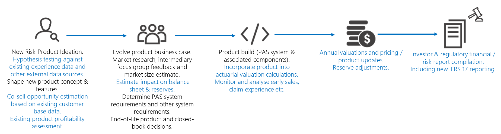
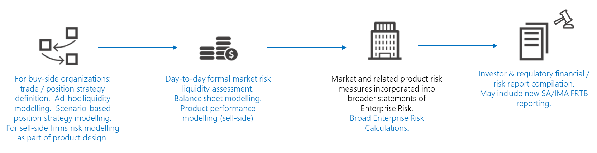
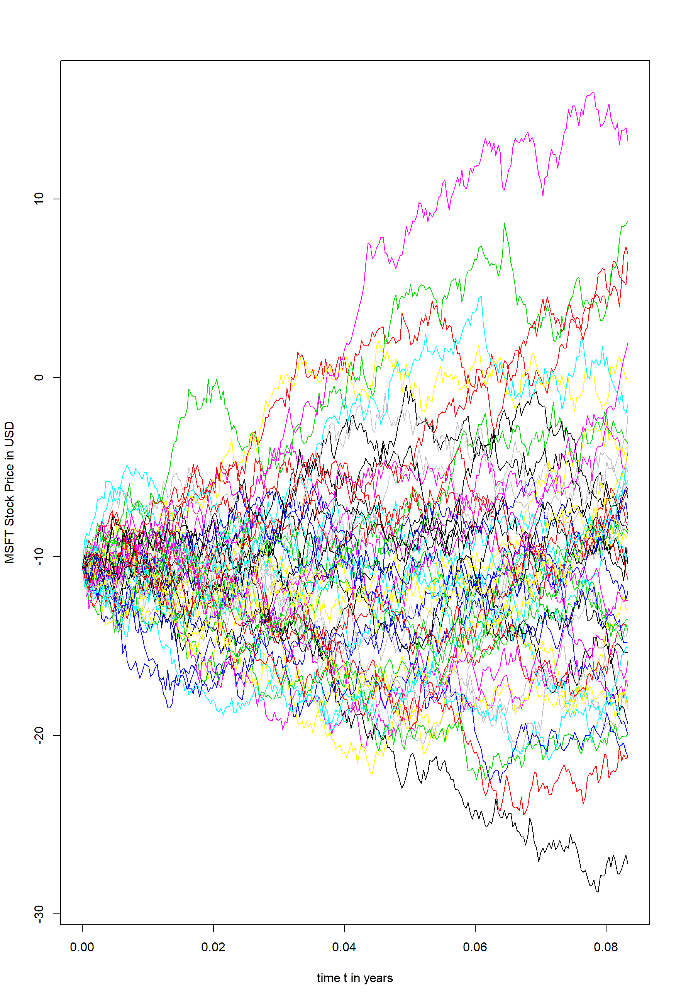
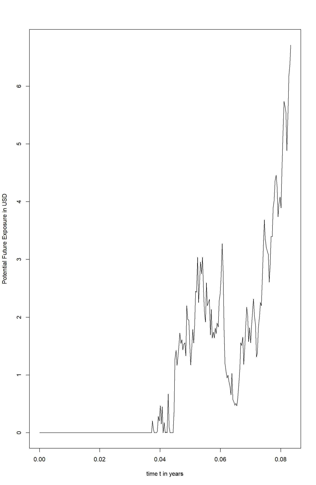
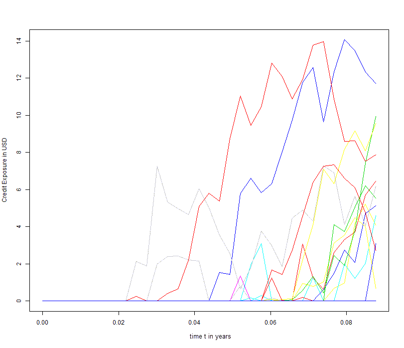
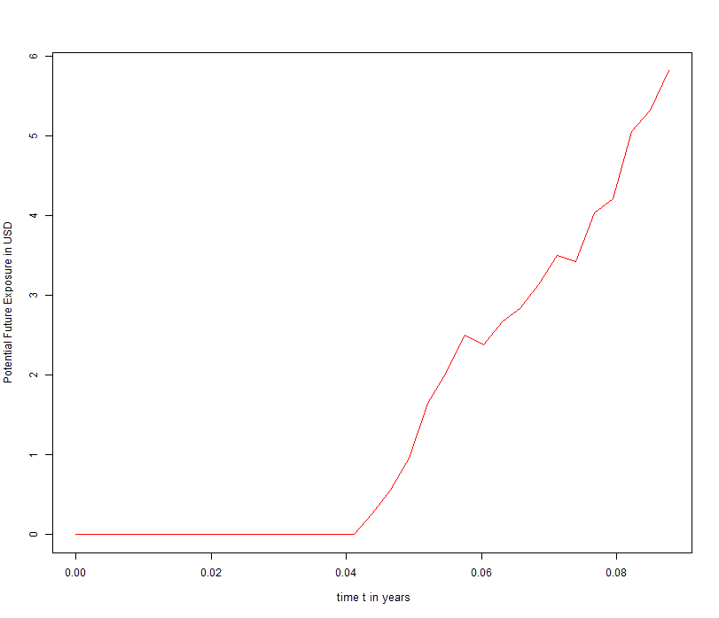

# Enable the financial services risk lifecycle with Azure and R

Risk calculations are pivotal at several stages in the lifecycle of key financial services operations. For example, a simplified form of the insurance product management lifecycle might look something like the diagram below. The risk calculation aspects are shown in blue text.



A scenario in a capital markets firm might look like this:



In processes such as these, there are common risk modeling needs, including:

- The need for ad-hoc risk-related experimentation by risk analysts, such as actuaries in an insurance firm or quants in a capital markets firm. These analysts typically work with code and modeling tools that are popular in their domain: R and Python. Many university curriculums include training in R or Python in mathematical finance and MBA courses. Both languages have access to a wide range of open source libraries that support popular risk calculations.
- Along with appropriate tooling, analysts often require access to:
  - Accurate market-pricing data.
  - Policy and claims data.
  - Market position data.
  - Other external data such as:
    - Structured data such as mortality tables and competitive pricing data.
    - Less traditional types such as weather and news.
  - Computational capacity for quick interactive data investigations.
- In some cases, ad-hoc machine learning algorithms for pricing or determining market strategy.
- The ability to visualize and present data for use in product planning, trading strategy, and similar discussions.
- The rapid execution of defined models, configured by the analysts for pricing, valuations, and market risk. The valuations use a combination of dedicated risk modeling, market risk tools, and custom code. The analysis is executed in a batch with varying nightly, weekly, monthly, quarterly, and annual calculations. This analysis generates spikes in workloads.
- The integration of data with other enterprise-wide risk measures for consolidated risk reporting. In larger organizations, lower-level risk estimates can be transferred to a tool for enterprise risk modeling and reporting.
- Results reported in a defined format at the required times to meet investor and regulatory requirements.

Microsoft helps meet these needs through a combination of Azure services and partner offerings in the [Azure Marketplace](https://azuremarketplace.microsoft.com/?WT.mc_id=fsiriskmodelr-docs-scseely). In this article, there are practical examples that show how to perform ad-hoc experimentation by using R. We begin by explaining how to run the experiment on a single machine. Next, we show you how to run the same experiment on [Azure Batch](/azure/batch/?WT.mc_id=fsiriskmodelr-docs-scseely), and we close by showing you how to take advantage of external services for the modeling. The options and considerations for the execution of defined models on Azure are described in these articles that focus on [banking](/azure/industry/financial/risk-grid-banking-solution-guide?WT.mc_id=fsiriskmodelr-docs-scseely) and [insurance](/azure/industry/financial/actuarial-risk-analysis-and-financial-modeling-solution-guide?WT.mc_id=fsiriskmodelr-docs-scseely).

## Analyst modeling in R

Let's start by looking at how R may be used by an analyst in a simplified, representative capital markets scenario. You can build this either by referencing an existing R library for the calculation or by writing code from scratch. In our example, we must also fetch external pricing data. To keep the example simple but illustrative, we calculate the potential future exposure (PFE) of an equity stock forward contract. This example avoids complex quantitative modeling techniques for instruments like complex derivatives and focuses on a single risk factor to concentrate on the risk life cycle. Our example lets you do the following:

- Select an instrument of interest.
- Source historic prices for the instrument.
- Model equity price action by using simple Monte Carlo (MC) calculation, which uses Geometric Brownian Motion (GBM):
  - Estimate expected return μ (mu) and volatility σ (theta).
  - Calibrate the model to historic data.
- Visualize the various paths to communicate the results.
- Plot max(0,Stock Value) to demonstrate the meaning of PFE, the difference to value at risk (VaR). To clarify:
  > `PFE = Share Price (T) -- Forward Contract Price K`
- Take the 0.95 Quantile to get the PFE value at each time step / end of simulation period.

We'll calculate the PFE for an equity forward based on Microsoft (MSFT) stock. As mentioned previously, to model the stock prices, historic prices for the MSFT stock are required so we can calibrate the model to historical data. There are many ways to acquire historical stock prices. In our example, we use a free version of a stock price service from an external service provider, [Quandl](https://www.quandl.com).

> [!NOTE]
> The example uses the [WIKI Prices dataset](https://www.quandl.com/databases/WIKIP) which can be used for learning concepts. For production usage of US based equities, Quandl recommends using the [End of Day US Stock Prices dataset](https://www.eoddata.com).

To process the data and define the risk associated with the equity, we need to do the following things:

- Retrieve history data from the equity.
- Determine the expected return μ and volatility σ from the historic data.
- Model the underlying stock prices using some simulation.
- Run the model.
- Determine the exposure of the equity in the future.

We start by retrieving the stock from the Quandl service and plotting the closing price history over the last 180 days.

```R
# Lubridate package must be installed
if (!require(lubridate)) install.packages('lubridate')
library(lubridate)

# Quandl package must be installed
if (!require(Quandl)) install.packages('Quandl')
library(Quandl)

# Get your API key from quandl.com
quandl_api = "enter your key here"

# Add the key to the Quandl keychain
Quandl.api_key(quandl_api)

quandl_get <-
    function(sym, start_date = "2018-01-01") {
        require(devtools)
        require(Quandl)
        # Retrieve the Open, High, Low, Close and Volume Column for a given Symbol
        # Column Indices can be deduced from this sample call
        # data <- Quandl(c("WIKI/MSFT"), rows = 1)

        tryCatch(Quandl(c(
        paste0("WIKI/", sym, ".8"),    # Column 8 : Open
        paste0("WIKI/", sym, ".9"),    # Column 9 : High
        paste0("WIKI/", sym, ".10"),   # Column 10: Low
        paste0("WIKI/", sym, ".11"),   # Column 11: Close
        paste0("WIKI/", sym, ".12")),  # Column 12: Volume
        start_date = start_date,
        type = "raw"
        ))
    }

# Define the Equity Forward
instrument.name <- "MSFT"
instrument.premium <- 100.1
instrument.pfeQuantile <- 0.95

# Get the stock price for the last 180 days
instrument.startDate <- today() - days(180)

# Get the quotes for an equity and transform them to a data frame
df_instrument.timeSeries <- quandl_get(instrument.name,start_date = instrument.startDate)

#Rename the columns
colnames(df_instrument.timeSeries) <- c()
colnames(df_instrument.timeSeries) <- c("Date","Open","High","Low","Close","Volume")

# Plot the closing price history to get a better feel for the data
plot(df_instrument.timeSeries$Date, df_instrument.timeSeries$Close)
```

With the data in hand, we calibrate the GBM model.

```R
# Code inspired by the book Computational Finance, An Introductory Course with R by
#    A. Arratia.

# Calculate the daily return in order to estimate sigma and mu in the Wiener Process
df_instrument.dailyReturns <- c(diff(log(df_instrument.timeSeries$Close)), NA)

# Estimate the mean of std deviation of the log returns to estimate the parameters of the Wiener Process

estimateGBM_Parameters <- function(logReturns,dt = 1/252) {

    # Volatility
    sigma_hat = sqrt(var(logReturns)) / sqrt(dt)

    # Drift
    mu_hat = mean(logReturns) / dt + sigma_hat**2 / 2.0

    # Return the parameters
    parameter.list <- list("mu" = mu_hat,"sigma" = sigma_hat)

    return(parameter.list)
}

# Calibrate the model to historic data
GBM_Parameters <- estimateGBM_Parameters(df_instrument.dailyReturns[1:length(df_instrument.dailyReturns) - 1])
```

Next, we model the underlying stock prices. We can either implement the discrete GBM process from scratch or use one of many R packages which provide this functionality. We use the R package [*sde* (Simulation and Inference for Stochastic Differential Equations)](https://cran.r-project.org/web/packages/sde/index.html) which provides a method of solving this problem. The GBM method requires a set of parameters which are either calibrated to historic data or given as simulation parameters. We use the historic data, providing μ, σ and the stock prices at the beginning of the simulation (P0).

```R
if (!require(sde)) install.packages('sde')
library(sde)

sigma <- GBM_Parameters$sigma
mu <- GBM_Parameters$mu
P0 <- tail(df_instrument.timeSeries$Close, 1)

# Calculate the PFE looking one month into the future
T <- 1 / 12

# Consider nt MC paths
nt=50

# Divide the time interval T into n discrete time steps
n = 2 ^ 8

dt <- T / n
t <- seq(0,T,by=dt)
```

We're now ready to start a Monte Carlo simulation to model the potential exposure for some number of simulation paths. We'll limit the simulation to 50 Monte Carlo paths and 256 time steps. In preparation for scaling out the simulation and taking advantage of parallelization in R, the Monte Carlo simulation loop uses a foreach statement.

```R
# Track the start time of the simulation
start_s <- Sys.time()

# Instead of a simple for loop to execute a simulation per MC path, call the
# simulation with the foreach package
# in order to demonstrate the similarity to the AzureBatch way to call the method.

library(foreach)
# Execute the MC simulation for the wiener process by using the GBM method from the sde package
exposure_mc <- foreach (i=1:nt, .combine = rbind ) %do% GBM(x = P0, r = mu, sigma = sigma, T = T, N = n)
rownames(exposure_mc) <- c()

# Track the end time of the simulation
end_s <- Sys.time()

# Duration of the simulation

difftime(end_s, start_s)
```

We've now simulated the price of the underlying MSFT stock. To calculate the exposure of the equity forward, we subtract the premium and limit the exposure to only positive values.

```R
# Calculate the total Exposure as V_i(t) - K, put it to zero for negative exposures
pfe_mc <- pmax(exposure_mc - instrument.premium ,0)

ymax <- max(pfe_mc)
ymin <- min(pfe_mc)
plot(t, pfe_mc[1,], t = 'l', ylim = c(ymin, ymax), col = 1, ylab="Credit Exposure in USD", xlab="time t in Years")
for (i in 2:nt) {
    lines(t, pfe_mc[i,], t = 'l', ylim = c(ymin, ymax), col = i)
}
```

The next two pictures show the result of the simulation. The first picture shows the Monte Carlo simulation of the underlying stock price for 50 paths. The second picture illustrates the underlying credit exposure for the equity forward after subtracting the premium of the equity forward and limiting the exposure to positive values.



Figure 1 - 50 Monte Carlo paths


Figure 2 - Credit exposure for equity forward

In the last step, the 1-month 0.95 quantile PFE is calculated by the following code.

```R
# Calculate the PFE at each time step
df_pfe <- cbind(t,apply(pfe_mc,2,quantile,probs = instrument.pfeQuantile ))

resulting in the final PFE plot
plot(df_pfe, t = 'l', ylab = "Potential future exposure in USD", xlab = "time t in Years")
```



Figure 3 Potential future exposure for MSFT equity forward

## Using Azure Batch with R

The R solution described above can be connected to Azure Batch and leverage the cloud for risk calculations. This takes little extra effort for a parallel calculation such as ours. The tutorial, [Run a parallel R simulation with Azure Batch](/azure/batch/tutorial-r-doazureparallel?WT.mc_id=fsiriskmodelr-docs-scseely), provides detailed information on connecting R to Azure Batch. Below we show the code and summary of the process to connect to Azure Batch and how to take advantage of the extension to the cloud in a simplified PFE calculation.

This example tackles the same model described earlier. As we've seen before, this calculation can run on our personal computer. Increases to the number of Monte Carlo paths or use of smaller time steps will result in much longer execution times. Almost all of the R code will remain unchanged. We'll highlight the differences in this section.

Each path of the Monte Carlo simulation runs in Azure. We can do this because each path is independent of the others, giving us a calculation that's easily parallelized.

To use Azure Batch, we define the underlying cluster and reference it in the code before the cluster can be used in the calculations. To run the calculations, we use the following cluster.json definition:

```JavaScript
{
  "name": "myMCPool",
  "vmSize": "Standard_D2_v2",
  "maxTasksPerNode": 4,
  "poolSize": {
    "dedicatedNodes": {
      "min": 1,
      "max": 1
    },
    "lowPriorityNodes": {
      "min": 3,
      "max": 3
    },
    "autoscaleFormula": "QUEUE"
  },
  "containerImage": "rocker/tidyverse:latest",
  "rPackages": {
    "cran": [],
    "github": [],
    "bioconductor": []
  },
  "commandLine": [],
  "subnetId": ""
}
```

With this cluster definition, the following R code makes use of the cluster:

```R

# Define the cloud burst environment
library(doAzureParallel)

# set your credentials
setCredentials("credentials.json")

# Create your cluster if not exist
cluster <- makeCluster("cluster.json")

# register your parallel backend
registerDoAzureParallel(cluster)

# check that your workers are up
getDoParWorkers()
```

Finally, we update the foreach statement from earlier to use the doAzureParallel package. It's a minor change, adding a reference to the sde package and changing the %do% to %dopar%:

```R
# Execute the MC simulation for the wiener process using the GBM method from the sde package and extend the computation to the cloud
exposure_mc <- foreach(i = 1:nt, .combine = rbind, .packages = 'sde') %dopar% GBM(x = P0, r = mu, sigma = sigma, T = T, N = n)
rownames(exposure_mc) <- c()
```

Each Monte Carlo simulation is submitted as a task to Azure Batch. The task executes in the cloud. Results are merged before being sent back to the analyst workbench. The heavy lifting and computations execute in the cloud to take full advantage of scaling and the underlying infrastructure required by the requested calculations.

After the calculations have finished, the additional resources can easily be shut-down by invoking the following a single instruction:

```R
# Stop the cloud cluster
stopCluster(cluster)
```

## Use a SaaS offering

The first two examples show how to use local and cloud infrastructure to develop an adequate valuation model. This paradigm has begun to shift. In the same way that on-premises infrastructure has transformed into cloud-based IaaS and PaaS services, the modeling of relevant risk figures is transforming into a service-oriented process. Today's analysts face two major challenges:

- The regulatory requirements use increasing compute capacity to add to modeling requirements. The regulators are asking for more frequent and up-to date risk figures.
- The existing risk infrastructure has grown organically with time and creates challenges when implementing new requirements and more advanced risk modeling in an agile manner.

Cloud-based services can deliver the required functionality and support risk analysis. This approach has some advantages:

- The most common risk calculations required by the regulator must be implemented by everyone under the regulation. By using services from a specialized service provider, the analyst benefits from ready to use, regulator-compliant risk calculations. Such services may include market risk calculations, counterparty risk calculations, X-Value Adjustment (XVA), and even Fundamental Review of Trading Book (FRTB) caculations.
- These services expose their interfaces through web services. The existing risk infrastructure can be enhanced by these other services.

In our example, we want to invoke a cloud-based service for FRTB calculations. Several of these can be found on [AppSource](https://appsource.microsoft.com/?WT.mc_id=fsiriskmodelr-docs-scseely). For this article we chose a trial option from [Vector Risk](http://www.vectorrisk.com). We'll continue to modify our system. This time, we use a service to calculate the risk figure of interest. This process consists of the following steps:

1. Call the relevant risk service with the right parameters.
1. Wait until the service finishes the calculation.
1. Retrieve and incorporate the results into the risk analysis.

Translated into R code, our R code can be enhanced by the definition of the required input values from a prepared input template.

```R
Template <- readLines('RequiredInputData.json')
data <- list(
# drilldown setup
  timeSteps = seq(0, n, by = 1),
  paths = as.integer(seq(0, nt, length.out = min(nt, 100))),
# calc setup
  calcDate = instrument.startDate,
  npaths = nt,
  price = P0,
  vol = sigma,
  drift = mu,
  premium = instrument.premium,
  maturityDate = today()
  )
body <- whisker.render(template, data)
```

Next, we need to call the web service. In this case, we call the StartCreditExposure method to trigger the calculation. We store the endpoint for the API in a variable named *endpoint*.

```R
# make the call
result <- POST( paste(endpoint, "StartCreditExposure", sep = ""),
                authenticate(username, password, type = "basic"),
                content_type("application/json"),
                add_headers(`Ocp-Apim-Subscription-Key` = api_key),
                body = body, encode = "raw"
               )

result <- content(result)
```

Once the calculations have finished, we retrieve the results.

```R
# get back high level results
result <- POST( paste(endpoint, "GetCreditExposureResults", sep = ""),
                authenticate(username, password, type = "basic"),
                content_type("application/json"),
                add_headers(`Ocp-Apim-Subscription-Key` = api_key),
               body = sprintf('{"getCreditExposureResults": {"token":"DataSource=Production;Organisation=Microsoft", "ticket": "%s"}}', ticket), encode = "raw")

result <- content(result)
```

This leaves the analyst to continue with the results received. The relevant risk figures of interest are extracted from the results and plotted.

```R
if (!is.null(result$error)) {
    cat(result$error$message)
} else {
    # plot PFE
    result <- result$getCreditExposureResultsResponse$getCreditExposureResultsResult
    df <- do.call(rbind, result$exposures)
    df <- as.data.frame(df)
    df <- subset(df, term <= n)
}

plot(as.numeric(df$term[df$statistic == 'PFE']) / 365, df$result[df$statistic == 'PFE'], type = "p", xlab = ("time t in Years"), ylab = ("Potential future exposure in USD"), ylim = range(c(df$result[df$statistic == 'PFE'], df$result[df$statistic == 'PFE'])), col = "red")
```

The resulting plots look like this:



Figure 4 - Credit exposure for MSFT equity forward - Calculated with a cloud-based risk engine



Figure 5 - Potential future exposure for MSFT equity forward - Calculated with a cloud-based risk engine

## Considerations

Flexible access to the cloud through compute infrastructure and SaaS-based risk analysis services can deliver improvements in speed and agility for risk analysts working in capital markets and insurance. In this article we worked through an example which illustrates how to use Azure and other services using tools risk analysts know. Try taking advantage of Azure's capabilities as you create and enhance your risk models.

## Contributors

*This article is maintained by Microsoft. It was originally written by the following contributors.*

Principal authors:

- [Dr. Darko Mocelj](https://www.linkedin.com/in/darko-mocelj) | HPC Global Blackbelt & AI Sr. Technology Specialist
- [Rupert Nicolay](https://www.linkedin.com/in/rupert-nicolay) | Financial Services Industry Solutions Lead

## Next steps

- R developers: [Run a parallel R simulation with Azure Batch](/azure/batch/tutorial-r-doazureparallel?WT.mc_id=fsiriskmodelr-docs-scseely)
- [Basic R commands and RevoScaleR functions: 25 common examples](/machine-learning-server/r/tutorial-r-to-revoscaler?WT.mc_id=fsiriskmodelr-docs-scseely)
- [Visualize and analyze data using RevoScaleR](/machine-learning-server/r/tutorial-revoscaler-data-model-analysis?WT.mc_id=fsiriskmodelr-docs-scseely)
- [Introduction to ML services and open-source R capabilities on HDInsight](https://azure.microsoft.com/services/hdinsight/r-server/#overview)

## Related resources

- [Actuarial risk analysis and financial modeling](actuarial-risk-analysis-financial-model.yml)
- [Risk grid computing solution](risk-grid-banking-solution-guide.yml)
- [Data management in banking](data-management-banking-overview.yml)
- [Risk grid computing in banking](risk-grid-banking-overview.yml)
- [HPC risk analysis template](../../solution-ideas/articles/hpc-risk-analysis.yml)
- [A financial institution scenario for data mesh](/azure/cloud-adoption-framework/scenarios/cloud-scale-analytics/architectures/data-mesh-scenario)
- [Knowledge mining in auditing, risk, and compliance management](../../solution-ideas/articles/auditing-and-risk-compliance.yml)
- [Loan credit risk and default modeling](../../example-scenario/ai/loan-credit-risk-analyzer-default-modeling.yml)
- [Loan credit risk with SQL Server](../../solution-ideas/articles/loan-credit-risk-with-sql-server.yml)
