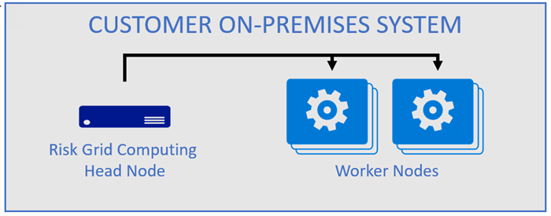
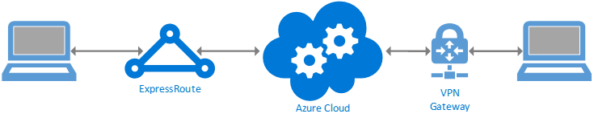
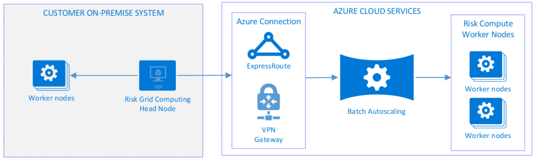
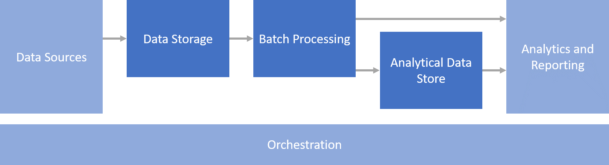

In corporate finance and investment banking, one of the most important jobs is analyzing risk.

Financial risk analysts provide a comprehensive picture of the risk associated with an investment portfolio. They review research, monitor economic and social conditions, stay abreast of regulations, and create computer models of the investment climate.

Risk analysis across the many vectors that affect a portfolio is sufficiently complex that computer modeling is required. Most analysts spend quite a bit of time working with computer models to simulate and predict how financial conditions will change. When you evaluate investment risks (Market Risk, Credit Risk and Operational Risk), the computational load of processing the predicative models can be quite large due to the volume of and diversity data.

Cloud computing offers significant benefits for risk grid computing or risk modeling because it enables analysts to access massive compute resources on demand, without incurring capital costs or managing infrastructure. This article examines leveraging Microsoft Azure to augment current risk grid compute resources and optimize the cost and speed of risk grid computing workloads. Topics covered include secure and reliable connectivity, batch processing, and augmenting compute resources based on demand when on-premises servers are at capacity.

## Grid computing services

Analysts need a simple and reliable way to provide their models to a batch processing pipeline. It starts with data ingestion and flows through data processing to analysis, where insights can be derived from the resulting data.

Risk model input data comes in several forms, the most common being Excel files or .csv files. These files are often restructured into formats more suitable for processing the risk model in later stages of the risk compute pipeline. A common technique for parsing and processing these files is batch processing with a grid of virtual machines working together to reach a common goal.

[Azure Batch](/azure/batch/?WT.mc_id=gridbank-docs-dastarr) is an Azure service that allows multiple worker VMs to run in parallel, as shown below. Processing data files and submitting results to machine learning systems or data stores are common tasks for the worker nodes. The application code run by the worker nodes is created by the customer, so almost any action may be taken in the batch job.

Azure provides an elegant solution for risk grid computing using Azure Batch. Customers can use Azure Batch to extend their existing risk computing grid, or to replace on-premises resources with a completely cloud-based solution.

Connecting directly and securely to the Azure cloud is fully supported. The Azure Batch risk processing grid worker nodes can access modeling data when they connect to data stored on-premises, when you connect to Azure with a hybrid network. The customer can also upload data to appropriate storage within Azure, allowing Batch to have direct access to the data.

## Secure connectivity to Azure

When you build a risk grid computing solution on Azure, the business will often continue to use existing on-premises applications such as trading systems, middle office risk management, risk analytics, and so on. Azure becomes an extension to those existing investments.

When you connect to the cloud, security is a primary consideration. Accounting for your current security model is the first step in connecting directly to Azure. For customers already using Active Directory on-premises, connecting to Azure can leverage existing identity resources. Service accounts can live in the on-premises AD.

### Hybrid network solution

A hybrid network ties Azure directly to the customer&#39;s on-premises network. Azure offers two models for securely and reliably connecting current on-premises systems to Azure, [Microsoft Azure ExpressRoute](/azure/expressroute/expressroute-introduction?WT.mc_id=gridbank-docs-dastarr) and [VPN Gateway](/azure/vpn-gateway/?WT.mc_id=gridbank-docs-dastarr). Both are trusted connectivity solutions, although there are differences in implementation, performance, cost and other attributes.

&quot;Burst to cloud&quot; offloads computing jobs to cloud-based machines when existing resources spike, augmenting the customer&#39;s data center or private cloud resources. Using the hybrid network model allows for easy burst to cloud scenarios as the cloud-based risk computing grid is a simple extension of the existing network.

There are several network connectivity configurations beyond those in the simple model presented in the logical architecture above. To help with decisions and architectural guidance regarding connecting your network to Azure, see the article [_Connect an on-premises network to Azure_](/azure/architecture/reference-architectures/hybrid-networking/).

### REST API solution over the internet

An alternative to creating a hybrid network is to upload data into Azure Storage and have Batch read the data files from storage. This can be achieved using a secure connection to connect to Azure, storing the documents in Azure Storage, and then managing the risk grid computing jobs via the [Batch service REST API](/rest/api/batchservice/?WT.mc_id=gridbank-docs-dastarr) or SDK with a fit-for-purpose application, orchestrating the Batch run.

### Azure Data Factory

Another solution for your scenario may be using [Azure Data Factory](/azure/data-factory/?WT.mc_id=gridbank-docs-dastarr), a cloud-based data integration service, to compose large storage, movement and processing pipelines. Data can be uploaded on demand through a Data Factory pipeline. The service provides a visual designer in the Azure portal for building Extract, Transform and Load solutions in Azure. Data Factory can help ingest data into Azure for further processing.

## Matching processing needs with demand

When you compute risk, whether daily or with the heavier loads at the end of the month, the calculations consume significant computational resources. These calculations don't run 24x7. When risk calculations aren't being run on the on-premises grid, the organization leaves valuable and expensive servers running with no workload, but with ongoing costs for power, cooling, and datacenter space, along with other fixed costs.

### Augmenting an on-premises grid with Azure Batch

To minimize costs, a business could choose to own and manage just enough worker nodes to satisfy requirements when demand is low. High demand risk grid computing jobs can then be pushed to high performance servers in Azure, elastically scaling up and down with workload demand.

The Azure Batch processing model has several benefits for risk grid computing:

- Augments existing investments in various on-premises systems.
- Allows existing infrastructure to serve risk analysis needs when demand is low, deallocating Azure-based worker nodes.
- Provides extra capacity to the risk compute grid when demand is high.
- Enables matching machine profiles to the processing power needed by Batch workload, even when the load calls for [High Performance Computing (HPC)](/azure/virtual-machines/windows/hpcpack-cluster-options?WT.mc_id=gridbank-docs-dastarr) configurations.

A common solution is to automatically add worker nodes in Azure when the on-premises workers are all in use. The risk grid head node simply asks for more workers. This automatically scales the number of grid worker nodes in Azure and enables an elastic demand solution.

Along with efficient use of resources, this arrangement provides other benefits. For independent tasks, adding more workers allows the load to scale linearly. Azure also provides the flexibility to try out a very large VM instance or a machine with several GPU cards. This flexibility enables experimentation and innovation.

For times when more compute capacity is needed, such as quarterly valuations, the extra capacity can also come from Azure Batch auto-scaling. Auto-scaling provides elasticity to your Batch solution. By scaling resources to match needed load, Azure provides significantly greater capacity at a lower cost than owning the hardware.

Most commercial grid products do support some form of burst to cloud, enabling easier proofs of concept for your risk analysis load. For example, [Microsoft HPC Pack](/azure/virtual-machines/windows/hpcpack-cluster-options?WT.mc_id=gridbank-docs-dastarr) can run in Azure, as can products from companies like TIBCO, Univa, and others. Many of these 3rd party tools or systems are available through the [Azure Marketplace](https://azuremarketplace.microsoft.com/marketplace/?WT.mc_id=gridbank-docs-dastarr).

### Migrating additional resources to the cloud

As workloads grow or on-premises datacenter infrastructure ages, organizations can move their entire Batch processing for risk grid computing into Azure.

### Growing into Azure

As on-premises machines reach end of life, you can further distribute worker nodes into the cloud. The same can be true for the Batch head node. This inverts the relationship between the on-premises network and Azure. This may be an opportunity to decrease costs by decommissioning any network-to-network products such as Azure ExpressRoute, and any remaining on-premises worker nodes.

As part of this change, data may be made available to Azure using various file ingress techniques. Azure has many storage options to choose from, including rest endpoints to allow uploading data directly, rather than having the compute jobs pick it up from the on-premises network.

 

Under this model, all risk grid computing activities can take place in the cloud. Data files processed by the workers may be stored in Azure storage, data can be fed directly into the Azure Data Lake, and Azure HDInsight can take care of machine learning needs. Finally, Power BI and Azure Analytics are excellent data analysis tools and can work across all data stored in Azure.

### Data security considerations for risk grid computing

While calculation data often doesn't include any customer content, most banks are still likely to conduct a security risk assessment before placing any workload in the cloud. This assessment might require input from Microsoft and may result in security recommendations.

A notable consideration for risk grid computing is to [run the batch processes within an Azure VNet](/azure/batch/batch-virtual-network?WT.mc_id=gridbank-docs-dastarr). This allows pool compute nodes to communicate securely with other compute nodes, or with an on-premises network. Appropriate service accounts and Network Service Groups (NSG) should be created and used by the batch compute nodes. [Azure also has solutions](/azure/security/blueprints/financial-services-regulated-workloads?WT.mc_id=gridbank-docs-dastarr) for data encryption in transit and at rest in Azure storage.

Some areas to consider may be: Active Directory (AD) or non-AD joined compute nodes, [VM disk encryption](/azure/security/fundamentals/encryption-overview), security of calculation input and output data at rest and in transit, Azure network configurations, permissions and more. Authentication may also be handled at the REST API level through a secret key.

## Getting started

Many customers have an in-house risk computing grid they already use. If your company developed the grid internally, consider Azure Batch to extend the grid. A good place to start with Azure Batch is by extending any current on-premises solution by replicating the current processing application logic and running it as a Batch job in Azure. This may require a networking solution for joining the Azure Batch compute nodes to the on-premises network, depending on our application&#39;s functionality.

To mitigate any security, speed, and connection reliability concerns, consider connecting your on-premises network to Azure using Azure ExpressRoute or a VPN Gateway. From there, you may have your on-premises head node provision a cluster of Azure-based worker nodes, spinning them up and down as needed.

Lastly, you may be ready for a complete migration of your risk compute infrastructure to Azure. If this is the case, [here's an article](/azure/batch/?WT.mc_id=gridbank-docs-dastarr) to get you started today.

## Components

- [Azure Batch](https://azure.microsoft.com/services/batch/) enables augmenting on-premises risk computing worker nodes to dynamically provide compute resources based on demand.

- [Azure Data Lake](https://azure.microsoft.com/solutions/data-lake/) provides storage, processing and analytics across for your risk analysis data.

- [Azure ExpressRoute](https://azure.microsoft.com/services/expressroute) extends your on-premises network to Azure over a private connection facilitated by a connectivity provider.

- [Azure HDInsight](https://azure.microsoft.com/free/hdinsight) is a fully managed open-source analytics service to process massive amounts of data such as the data provided in month-end batch runs.

- [Microsoft HPC Pack](/azure/virtual-machines/windows/hpcpack-cluster-options?WT.mc_id=gridbank-docs-dastarr) enables provisioning High Performance Computing clusters for batch processing.

- [Power BI](https://powerbi.microsoft.com) is a suite of business analytics tools risk analysts use to gain and share insights.

- [Azure VPN Gateway](https://azure.microsoft.com/free/vpn-gateway) extends your on-premises network to the Azure cloud over the Internet.

## Conclusion

The solutions covered in this article are approaches to risk grid computing in banking. Other architectures may be used given the rich capabilities of Azure products and services and the various existing client system architectures. Even so, Batch provides a reasonable model for risk grid computing given the advantages laid out in this article.

[Extending the on-premises network to Azure](/azure/architecture/reference-architectures/hybrid-networking/?WT.mc_id=gridbank-docs-dastarr) allows Azure easy access to network resources and other processing systems already present in the on-premises network. When on-premises machines are reaching end of life, it may make more sense to use Batch compute entirely in Azure rather than supporting a hybrid model.

Uploading files to Azure Storage before the Batch job begins is another way to take advantage of Batch without the need for a hybrid network. This could be done incrementally, or as a starting process to the Batch run.

## Contributors

*This article is maintained by Microsoft. It was originally written by the following contributors.*

Principal authors:

* [David Starr](https://www.linkedin.com/in/davidstarr) | Principal Solutions Architect

## Next steps

After you select a connectivity strategy, a logical place to start with risk compute is placing your existing jobs into Azure compute worker nodes and running them in a test environment to see if any code needs to be changed. [This article provides a starting point](/azure/batch/batch-virtual-network?WT.mc_id=gridbank-docs-dastarr) for getting started with Azure Batch in the language or tool of your choice.

See the [Risk Grid Computing in Banking Solution Guide](/azure/industry/financial/risk-grid-banking-solution-guide?WT.mc_id=banking-docs-dastarr).

Product documentation:

- [What is Azure Batch?](/azure/batch/batch-technical-overview)
- [What is Azure Data Lake?](/azure/data-lake-store/data-lake-store-overview)
- [What is Azure ExpressRoute?](/azure/expressroute/expressroute-introduction)
- [What is Azure HDInsight?](/azure/hdinsight/hdinsight-overview)
- [What is Power BI?](/power-bi/fundamentals/power-bi-overview)
- [What is VPN Gateway?](/azure/vpn-gateway/vpn-gateway-about-vpngateways)

## Related resources

- [Risk grid computing solution](risk-grid-banking-solution-guide.yml)
- [HPC risk analysis template](../../solution-ideas/articles/hpc-risk-analysis.yml)
- [Loan credit risk and default modeling](../../example-scenario/ai/loan-credit-risk-analyzer-default-modeling.yml)
- [Actuarial risk analysis and financial modeling](./actuarial-risk-analysis-financial-model.yml)
