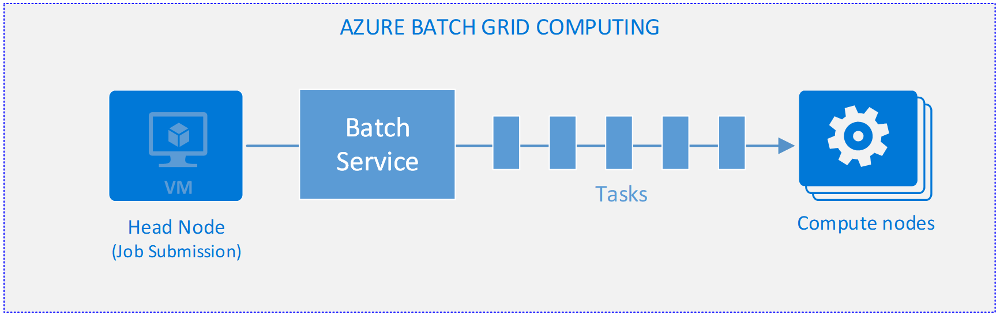
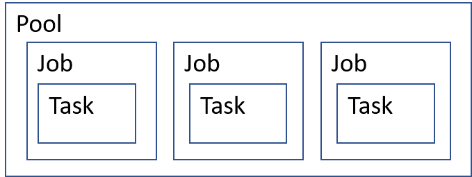
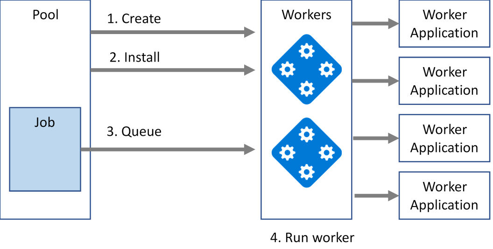
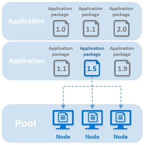
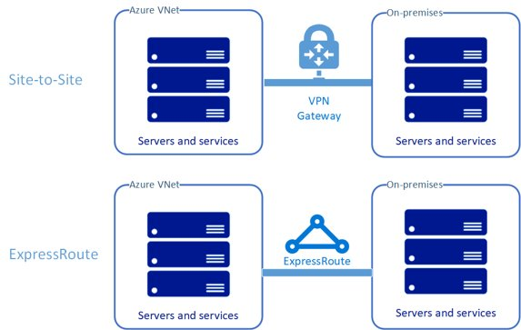
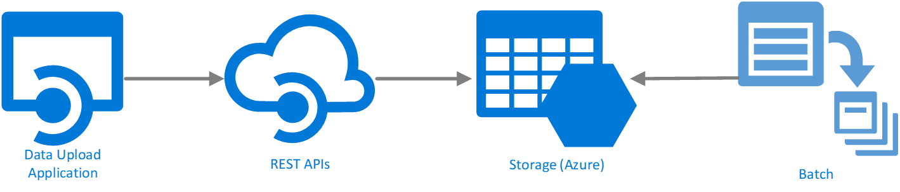

This article provides a technical overview of using Microsoft Azure to support and enhance risk grid computing in banking. The article explores recommended systems and high-level architectures.

This document is intended for Solution Architects, and in some cases Technical Decision Makers, who want a deep dive on proposed solutions for risk computing.

## Introduction

Financial risk analysis models are typically processed as batch jobs. They have heavy compute loads generating high demand for computing power, data access, and analysis. Demand for risk grid computing calculations often grows over time, and the need for compute resources increases with it.

The broad range of available products and services in Azure means there can be more than one solution to most problems. This article provides an overview of the technologies, patterns, and practices that are the most effective for a risk grid computing solution in banking that uses [Microsoft Azure Batch](/azure/batch/batch-dotnet-get-started?WT.mc_id=gridbanksg-docs-dastarr).

Azure Batch is a free service that provides cost-effective and secure solutions. The solutions are for both the infrastructure and the various stages of batch processing that are typically used with risk grid computing models. Azure Batch can augment, extend, or even replace current on-premises compute resource investments using hybrid networks or by moving the entire Batch process into Azure.  Data can traverse up and down from the cloud or stay on-premises. Other data can be processed by compute nodes in a burst-to-cloud model, when on-premises resources run low.

## Anatomy of an Azure Batch run

There are typically at least two applications involved in a Batch run. One application, typically run on a “head node,” submits the job to the pool and sometimes orchestrates the compute nodes. The orchestration can also be configured via the Azure portal. The other application is run by the compute nodes as a task (see Figure 1).

The compute node application performs the task of parallel processing risk modeling files. There can be more than one application installed and run on the compute nodes.

These applications can be uploaded via the [Batch API](/azure/batch/batch-apis-tools?WT.mc_id=gridbanksg-docs-dastarr), directly through the Azure portal, or via the [Azure CLI commands for Batch](/azure/batch/cli-samples?WT.mc_id=gridbanksg-docs-dastarr).



**Figure 1:** Azure Batch grid computing

An Azure Batch run consists of several logical elements. Figure 2 shows the logical model of a batch job. A pool is a container for the VMs involved in the Batch run and provisions the compute node VMs. A pool is also the container for the applications installed on the compute nodes. Jobs are created and run within the pool. Tasks are executed by the jobs. Tasks are a run of the worker application and are invoked by a command-line instruction.

The worker application is installed to the compute node when it's created.



**Figure 2:** Logical batch concept model

When the job executes, the pool provisions any worker VMs needed and installs the worker applications. The job assigns tasks to those compute nodes, which in turn run a command-line instruction (CLI). The CLI script typically calls the installed applications or scripts.

Using Batch typically follows a prototypical pattern, described as follows:

1. Create a resource group to contain the Batch assets.
2. Within the resource group, create a Batch account.
3. Create a linked storage account.
4. Create a pool in which you can provision the worker VMs.
5. Upload the compute node application or scripts to the pool.
6. Create a job to assign tasks to the VMs in the pool.
7. Add the job to the pool.
8. Begin the Batch run.
9. The job queues tasks to run on the compute nodes.
10. Compute nodes run the tasks as the VMs become available.

An illustration of this process is show in Figure 3.



**Figure 3:** Logical batch concept model

Once tasks are complete, it can be useful to remove the compute nodes to not incur fees while not in use. To delete them, via code or the portal, one can delete the containing pool, which will remove the worker VMs.

For more detailed walkthroughs on how to get starting with Batch, [5-minute Quickstarts](/azure/batch/?WT.mc_id=gridbanksg-docs-dastarr) take you through the process in several languages, and it also shows you how to use the Azure portal.

## Batch process scheduling

Azure Batch has a scheduler built in so scheduling of each run can be defined in the portal or through APIs. The Batch job scheduler can define multiple schedules to fire multiple jobs. Each job has its own properties such as what to do when the job starts and ends. Job schedules can be set on recurring intervals or for a one-time run.

Many bank grid computing systems already have their own scheduling service. There may be no immediate need to move my scheduler to Azure. This can work seamlessly because Azure Batch can be invoked manually or through an SDK. This ability allows scheduling to still occur on-premises, and it allows workloads to be processed in Azure.

Batch processing can happen on a predetermined schedule or on demand. In either case, there's no need to keep compute node VMs alive when they aren’t being used. When using hundreds, if not thousands, of VM compute nodes, significant cost savings can be realized, by de-provisioning the servers when they're done running their queued tasks.

## Compute node applications

Compute nodes need an application to run when a task is invoked. These applications are written by the business to perform the processing jobs when installed on the workers. In risk grid computing for banking scenarios, this application often takes on the job of transforming data into formats especially suited for downstream analytics or other processing.

When providing the application to the pool for distribution to compute nodes, it's uploaded in an application package. An application package may be another version of a previously uploaded application package. More than one application package can be installed to one compute node. The job contains the applications packages to load onto the worker machines.

Application package deployment may also be managed by version. If multiple versions of an application package have been loaded into a pool, a specific version may be designated for use in a Batch run as shown in Figure 4. This may be necessary in audit environments or when the business wants to reproduce a prior run. It can also be used for roll-back purposes if a bug is introduced to the worker application.



**Figure 4:** Versioning compute node task applications

An application package is uploaded to the pool as a .zip file. The file contains the application binaries and the supporting files that are required for tasks to run the application. There are two scopes for application packages. You can designate an application package in scope of the pool, or in the scope of tasks.

## Pool application packages

These packages are deployed to every compute node in the pool. When a compute node VM is provisioned, rebooted, or reimaged, a new copy of any pool application packages is installed, if an updated application exists. One or more application packages can be assigned to a pool, which means the compute nodes will get all packages designated.

## Task application packages

Application packages targeting the task level are only installed to compute nodes scheduled to run a task. Task applications packages are intended for use when more than one job is run in one pool.

Task applications are useful when aggregating data that's produced by pool-level jobs. These applications can be relevant in risk grid computing scenarios. For example, a task application can run a set of risk calculations that generate data to be used later in the risk calculation workflow.

## Scaling batch jobs

Banks often perform risk analysis batch runs over weekends or at night when computing resources are underutilized. While this model works for some, it can quickly be outgrown, requiring more capital to add more worker machines to the grid.

If Azure Batch jobs take too long to run, or if you want more computing power in your Batch runs, Azure offers several options.

1. Allocate more compute node machines to scale out.
2. Allocate more powerful compute node machines to scale up. Azure machines may be provisioned to meet high performance needs of for cores and memory, and even GPU computing power.

> Note: Using Microsoft HPC Pack with Batch is a more complex model and isn't discussed in this article.

In a Batch processing cluster, you might have as few as two processing VMs. Or you could have thousands of simultaneous tasks running on thousands of VM compute nodes, with tens of thousands of cores. Each VM is responsible for running a single task at a time. The number of VMs in a pool can be scaled manually or automatically, as configured when load increases or decreases.

### Burst to cloud

When compute resources in an on-premises grid are running low due to executing a large analysis job, “burst to cloud” offers a way to augment those resources by adding more compute nodes in Azure. Burst to cloud is a model in which private clouds or infrastructure distribute their workload to cloud servers, when demand is high for on-premises resources.

These compute nodes can be pre-configured as Linux or Windows virtual machines to be provisioned in Azure’s IaaS platform. Further, servers can be provisioned and automatically configured to work with existing investments like Tibco Gridserver and IBM Symphony.

### Automatic scaling formulas

This elasticity can be configured in the Azure portal or by using [automatic scaling formulas](/azure/batch/batch-automatic-scaling?WT.mc_id=gridbanksg-docs-dastarr). Automatic scaling formulas are scripts uploaded to the Batch processing scheduler for fine-grained control of Batch behavior. Automatic scaling on a pool of compute nodes is done by associating the nodes with autoscale formulas.

The following example is of an automatic scaling formula directing auto scaling to start with one VM and scale up to 50 VMs as needed. As tasks complete, VMs become free one by one and the auto scaling formula shrinks the pool.

```Formula
startingNumberOfVMs = 1;
maxNumberofVMs = 50;
pendingTaskSamplePercent = $PendingTasks.GetSamplePercent(180 * TimeInterval_Second);
pendingTaskSamples = pendingTaskSamplePercent < 70 ? startingNumberOfVMs : avg($PendingTasks.GetSample(180 * TimeInterval_Second));
$TargetDedicatedNodes=min(maxNumberofVMs, pendingTaskSamples);
```

### Other scaling techniques

Automatic scaling can also be enabled by the Enable-AzureBatchAutoScale PowerShell cmdlet. The Enable-AzureBatchAutoScale cmdlet enables automatic scaling of the specified pool. An example follows.

1. The first command defines a formula, and then saves it to the `$Formula` variable.
2. The second command enables automatic scaling on the pool named `RiskGridPool` using the formula in `$Formula`.

```console
C:\> $Formula = ‘startingNumberOfVMs = 1;
maxNumberofVMs = 50;
pendingTaskSamplePercent = $PendingTasks.GetSamplePercent(180 * TimeInterval_Second?WT.mc_id=gridbanksg-docs-dastarr);
pendingTaskSamples = pendingTaskSamplePercent < 70 ? startingNumberOfVMs : avg($PendingTasks.GetSample(180 * TimeInterval_Second));
$TargetDedicatedNodes=min(maxNumberofVMs, pendingTaskSamples);’;

C:\> Enable-AzureBatchAutoScale -Id "RiskGridPool" -AutoScaleFormula $Formula -BatchContext $Context
```

Scaling can also be accomplished using the Azure CLI with the `az batch pool resize` command and through the Azure portal.

## Data storage and retention

Once data is ingested and processed by a compute node, the resulting output data can be stored in a database. The output data can be further processed and analyzed or transformed upon ingestion, before storage, in order to ensure the proper formats for downstream processing. Microsoft Azure offers several storage options. The choice of [which data store technology to use](/azure/architecture/data-guide/?WT.mc_id=gridbanksg-docs-dastarr) depends largely on analysis and or reporting needs in downstream processes.

When using a hybrid network, the data storage target may be on-premises. When using Batch over a hybrid network, compute nodes can write data back to an on-premises data store without using an Azure-based storage location. Workers can also write to Azure File storage, which can be mounted as a disk on an on-premises machine. This setup allows easy access by any process that works with the files on-premises.

## Monitoring and logging

To optimize future runs of the Batch job, data should be recorded to help identify areas of optimization. For example, if workers are running near CPU capacity, adding cores to the compute nodes may help avoid being CPU-bound and the job can finish faster. Each application run in the Batch job has its own characteristics and the optimizations made to the VMs in the Batch runs may differ. For memory-intensive tasks, more memory can be allocated by configuring the machines differently in the next run.

Logging can be done by the compute node and grid head applications or by a job using [Batch diagnostic logging](/azure/batch/batch-diagnostics?WT.mc_id=gridbanksg-docs-dastarr). Logging information about the performance of the Batch runs can be configured to help identify which areas to improve for better performance and faster task completion.

### Custom Batch monitoring and logging

The controlling application and compute node applications can generate this data and store it for further analysis. Data found helpful in optimizing Batch jobs includes:

- Start and end times for each task
- The time each compute node is alive and running tasks
- The time each compute node is alive and not running tasks
- The overall batch job run time

### Batch diagnostic logging

There's an alternative to using the controller and compute node applications to emit instrumentation data. [Batch diagnostics logging](/azure/batch/batch-diagnostics?WT.mc_id=gridbanksg-docs-dastarr) can capture a lot of the run data. Batch Diagnostic Logging isn't enabled by default and must be enabled for the Batch account.

Batch diagnostic logging provides a significant amount of data aiding in trouble shooting and optimizing Batch runs. Start and end times for job and tasks, core count, total node count, and many other metrics.

Batch logging requires a storage destination for the logs emitted, storing events produced by the Batch run such as pool creation, job execution, task execution, and so on. In addition to storing diagnostic log events in an Azure Storage account, Batch service log events can be streamed to an instance of [Azure Event Hubs](/azure/event-hubs/event-hubs-what-is-event-hubs?WT.mc_id=gridbanksg-docs-dastarr). The events can then be sent to [Azure Log Analytics](/azure/log-analytics/log-analytics-overview?WT.mc_id=gridbanksg-docs-dastarr).

Using these data, core computing and head node applications can be optimized. This can lower costs, due to things like faster deprovisioning worker VMs, when they're no longer needed, rather than waiting for the end of the Batch run to complete.

### Batch management tools

The Azure portal provides a Batch monitoring dashboard that shows information about Batch as jobs are running and even account quota usage. It's sufficient for many Batch job applications.

In addition to the Batch management and visualization tools available in the Azure portal, there's a free open-source tool, [BatchLabs](https://github.com/Azure/BatchLabs), for managing Batch. This is a standalone client tool to help create, debug, and monitor Azure Batch applications. Download an installation package for Mac, Linux, or Windows.

## Network models

Risk analysis often requires hundreds, if not thousands, of documents to be ingested into the risk grid computing process. These files are often located on-premises in a file store, network share, or other repository. When using Azure-based VMs to access and process those files, it's often useful for the on-premises network to be seamlessly connected to the Azure network, so file access is simple and fast. This approach may even mean no code changes are needed to the code doing the processing on the compute nodes.

Azure offers two models for securely and reliably connecting current on-premises systems to Azure, [Microsoft Azure ExpressRoute](/azure/expressroute/expressroute-introduction?WT.mc_id=gridbanksg-docs-dastarr) and [VPN Gateway](/azure/vpn-gateway/?WT.mc_id=gridbanksg-docs-dastarr). Both offer secure reliable connectivity, although there are differences in implementation, performance and [other attributes](/azure/networking/networking-overview?WT.mc_id=gridbanksg-docs-dastarr).

Alternatively, the risk grid computing head node may live on-premises and execute the Batch job through the REST APIs or SDKs in .NET and other languages.

There are other techniques for bridging the gap between Azure and on-premises resources without a hybrid network solution. More information on this is provided below.

### ExpressRoute

ExpressRoute ties your on-premises or datacenter network to Azure through a private connection facilitated by a connectivity partner, such as your current Internet Service Provider. This enables both networks to see each other as the same network instance, providing seamless access between networks. Network integration is critical when you want to integrate existing on-premises systems with an Azure network, and ExpressRoute offers the fastest connection speeds possible.

Additional pricing information for Azure ExpressRoute [can be found here](https://azure.microsoft.com/pricing/details/expressroute/?WT.mc_id=gridbanksg-docs-dastarr).

### VPN Gateway

A VPN Gateway is another way to connect your network to Azure. The downside of this model is traffic flows over the Internet. The connection can be less resilient as a result and network speeds can't reach those of ExpressRoute, however this may not be a barrier for a risk grid computing scenario as reading data files is typically a fast operation.

Additional pricing information for VPN Gateway [can be found here](https://azure.microsoft.com/pricing/details/expressroute/?WT.mc_id=gridbanksg-docs-dastarr).

### Choices for connectivity details

There are essentially two models for extending your network to Azure, as shown in Figure 5.

- Virtual gateway – site-to-site
- ExpressRoute – Exchange or ISP provider



**Figure 5:** Site-to-Site and ExpressRoute

#### Virtual gateway site-to-site integration

A [Site-to-Site VPN Gateway](/azure/vpn-gateway/vpn-gateway-howto-site-to-site-resource-manager-portal?WT.mc_id=gridbanksg-docs-dastarr) connects your on-premises network to an Azure VNet. This bridges the gap between networks essentially making them parts of the same network, with two-way access to resources, servers, and artifacts. This allows direct access to data files from the Azure worker VMs running the risk grid computing batch job.

#### ExpressRoute integration

An ExpressRoute connection facilitated by an Azure partner network provider realizes the same benefits as a Site-to-Site connection, but with higher speeds and reliability.

Get more information about [ExpressRoute connectivity models](/azure/expressroute/expressroute-connectivity-models?WT.mc_id=gridbanksg-docs-dastarr).

### Batch processing without an Azure hybrid network

Another Batch scenario is uploading all data files into Azure storage for later processing by Azure-based compute machines. File storage and Blob storage are likely candidates for storing risk grid computing data.

In this scenario, the job controller and all compute nodes live in Azure as shown in Figure 6. The likely destination for processed data is an Azure data store, in preparation for further processing by Azure Machine Learning solutions or other systems. This additional processing is beyond the scope of this article.



**Figure 6:** Batch upload to execution lifecycle

### Hybrid network connectivity resources

Several configurations may be applicable in your situation. To help with decisions and architectural guidance regarding connecting network connectivity to Azure, see the article _[Connect an on-premises network to Azure](/azure/architecture/reference-architectures/hybrid-networking/?WT.mc_id=gridbanksg-docs-dastarr)_ by the patterns & practices group.

- [See this article](/azure/vpn-gateway/vpn-gateway-about-vpngateways?WT.mc_id=gridbanksg-docs-dastarr) for VPN Gateway configuration alternatives.
- Learn about [ExpressRoute connectivity models](/azure/expressroute/expressroute-connectivity-models?WT.mc_id=gridbanksg-docs-dastarr).
- Calculate [ExpressRoute pricing](https://azure.microsoft.com/pricing/details/expressroute/?WT.mc_id=gridbanksg-docs-dastarr).
- Calculate [VPN Gateway pricing](https://azure.microsoft.com/pricing/details/vpn-gateway/?WT.mc_id=gridbanksg-docs-dastarr).

## Security considerations

An Azure [virtual network (VNet)](/azure/virtual-network/virtual-networks-overview?WT.mc_id=gridbanksg-docs-dastarr) may be created and the pool's compute nodes created within it. This provides an extra level of isolation for the Batch runs and allows authentication using [Azure Active Directory (Azure AD)](/azure/active-directory/active-directory-whatis?WT.mc_id=gridbanksg-docs-dastarr). For more information, see [Pool network configuration](/azure/batch/batch-api-basics#pool-network-configuration?WT.mc_id=gridbanksg-docs-dastarr).

There are two ways to authenticate a Batch application using Azure Active Directory (Azure AD):

- **Integrated authentication**. A batch application using Azure AD accounts can use the account to gain resources to data stores and other resources.

- **Service principal**. Azure AD Service principals define access policy and permissions for users and applications. A service principal provides authentication to users using a secret key tied to that application. This allows authenticating an unattended application with a secret key. A service principal defines the policy and permissions for an application to represent the application when accessing resources at runtime. [Learn more here](/azure/active-directory/develop/active-directory-application-objects?WT.mc_id=gridbanksg-docs-dastarr).

For more information on security in batch processing with Azure AD, [see this article](/azure/batch/batch-aad-auth?WT.mc_id=gridbanksg-docs-dastarr).

The Batch service can also authenticate with a shared key. The authentication service requires two header values to be added to the HTTP request, data and authorization. [See here for more](/rest/api/batchservice/authenticate-requests-to-the-azure-batch-service?WT.mc_id=gridbanksg-docs-dastarr) on shared key authentication.

## Cost optimization

There's no charge for using Azure Batch. You only pay for the underlying resources consumed, such as virtual machine uptime, storage, and networking. However, the compute node VMs still cost money when sitting idle, so it's a good idea to deprovision machines when they're no longer needed. This is often done by deleting the pool containing them.
>
When creating a pool, you can specify which types of compute nodes you want and the number of each. The two types of compute nodes are as follows:
>
>**Dedicated compute nodes** are reserved for your workloads. They're more expensive than low-priority nodes, but they're guaranteed to never be preempted.
>
>**Low-priority compute nodes** take advantage of surplus capacity in Azure to run Batch workloads. Low-priority nodes are less expensive per hour than dedicated nodes, and enable workloads requiring a lot of compute power. For more information, see [Use low-priority VMs with Batch](/azure/batch/batch-low-pri-vms?WT.mc_id=gridbanksg-docs-dastarr).
>
>Dedicated and low-priority nodes may exist in the same pool.
>
>For pricing information for both low-priority and dedicated compute nodes, see [Batch Pricing](https://azure.microsoft.com/pricing/details/batch/?WT.mc_id=gridbanksg-docs-dastarr).

When using the Batch Diagnostic Logging service, the data emitted to Azure storage incurs a cost. This is storage data like any other data, and pricing is impacted by the amount of diagnostic data retained.

## Getting started

While there are many places to get started with a complex domain like Batch
computing for risk grid computing, here are some logical starting points to
better understand the Batch technology.

[This is a great place to start](/azure/batch/?WT.mc_id=gridbanksg-docs-dastarr)
working with Batch using coding and Azure portal examples. The Azure Batch
sample applications are also freely available [on
GitHub](https://github.com/Azure/azure-batch-samples).

Below are some quick tutorials to help you build a simple application to create
and run batch compute jobs. Options for building the application are as follows:

- [Batch .NET API](/azure/batch/batch-dotnet-get-started?WT.mc_id=gridbanksg-docs-dastarr)
- [Batch SDK for Python](/azure/batch/tutorial-parallel-python)
- [Batch SDK for Node.js](/azure/batch/batch-nodejs-get-started?WT.mc_id=gridbanksg-docs-dastarr)
- [Batch management with PowerShell](/azure/batch/batch-powershell-cmdlets-get-started?WT.mc_id=gridbanksg-docs-dastarr)
- [Batch management with the Azure CLI](/azure/batch/batch-cli-get-started?WT.mc_id=gridbanksg-docs-dastarr)

Consider launching a proof-of-concept initiative. What will your approach be for data ingestion into Azure? Will you use a hybrid network or upload data via an SDK or REST interface? If you're considering a hybrid network, consider launching a pilot to put this in place.

Evaluate the size of your Batch compute jobs, and then select the right scaling solution. [Autoscaling
formulas](/azure/batch/batch-automatic-scaling?WT.mc_id=gridbanksg-docs-dastarr)
enable complex scheduling scenarios, while simpler scenarios are achievable by using the Azure portal.

## Components

- [Azure Batch](https://azure.microsoft.com/services/batch/) provides capabilities to run large-scale parallel processing jobs in the cloud.

- [Azure Active Directory](https://azure.microsoft.com/services/active-directory/) is a multi-tenant, cloud-based directory, and identity management service combining core directory services, application access management, and identity protection into a single solution.

- [Automatic scaling formulas](/azure/batch/batch-automatic-scaling?WT.mc_id=gridbanksg-docs-dastarr) are scripts uploaded to the batch processing scheduler for fine grained control of Batch scaling behaviors.

- [Batch Diagnostics Logging](/azure/batch/batch-diagnostics?WT.mc_id=gridbanksg-docs-dastarr) is a feature of Azure Batch enabling creation of a detailed log from your Batch runs and the events generated. Logs are stored in Azure Storage.

- [BatchLabs](https://github.com/Azure/BatchLabs) is a standalone application for Batch monitoring and management available Windows, macOS, and Linux.

- [ExpressRoute](https://azure.microsoft.com/services/expressroute) is a high speed and reliability hybrid network solution for joining on-premises and Azure networks.

- [Azure VPN Gateway](https://azure.microsoft.com/free/vpn-gateway) is a hybrid network solution using the Internet for joining on-premises and Azure networks.

## Conclusion

This document provided an overview of technical solutions and considerations when using Azure Batch for risk grid computing for banking. The article covered a lot of ground from the definition of Azure Batch to [networking options](/azure/architecture/reference-architectures/hybrid-networking/?WT.mc_id=gridbanksg-docs-dastarr),
and even cost considerations.

## Contributors

*This article is maintained by Microsoft. It was originally written by the following contributors.*

Principal authors:

* [David Starr](https://www.linkedin.com/in/davidstarr) | Principal Solutions Architect

## Next steps

When considering moving forward in evaluating Azure Batch for risk grid computing, [this page](/azure/batch/?WT.mc_id=gridbanksg-docs-dastarr) is a good resource for getting started. It provides sample guided tutorials for parallel file processing, which is inherent in risk grid computing. Tutorials are provided using the Azure Portal, Azure CLI, .NET, and Python.

Product documentation:

- [What is Azure Batch?](/azure/batch/batch-technical-overview)
- [What is Azure Active Directory?](/azure/active-directory)
- [What is Azure ExpressRoute?](/azure/expressroute/expressroute-introduction)
- [What is VPN Gateway?](/azure/vpn-gateway/vpn-gateway-about-vpngateways)

## Related resources

- [Risk grid computing in banking](risk-grid-banking-overview.yml)
- [HPC risk analysis template](../../solution-ideas/articles/hpc-risk-analysis.yml)
- [Knowledge mining in auditing, risk, and compliance management](../../solution-ideas/articles/auditing-and-risk-compliance.yml)
- [Actuarial risk analysis and financial modeling](./actuarial-risk-analysis-financial-model.yml)
