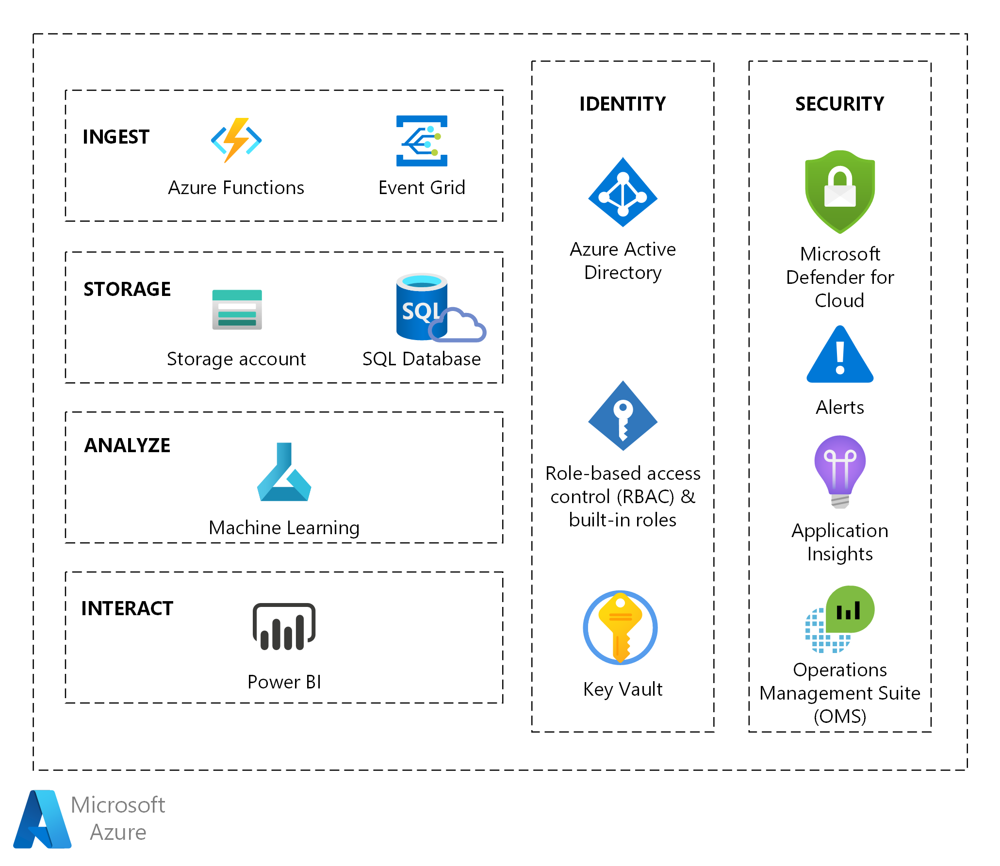
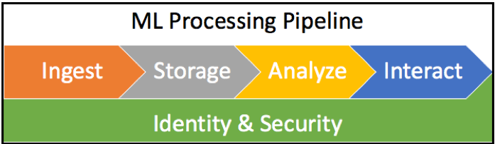
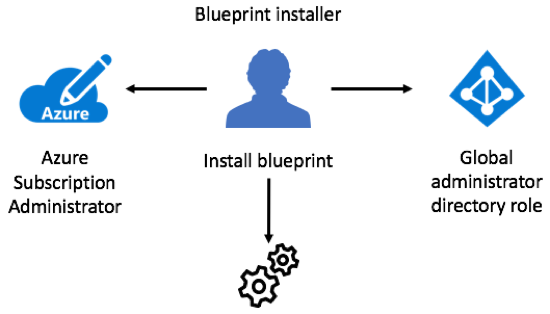
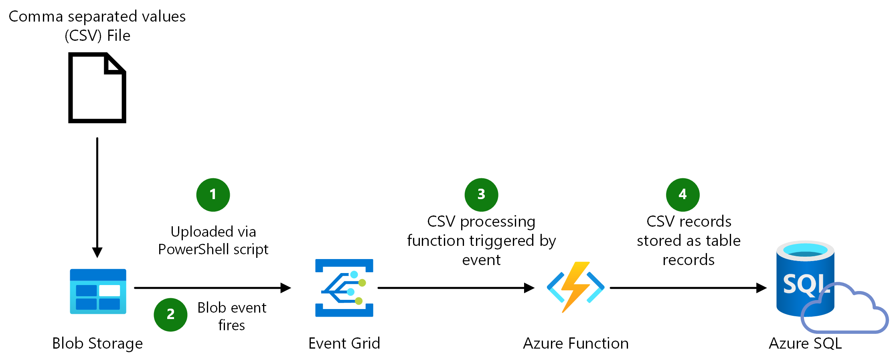
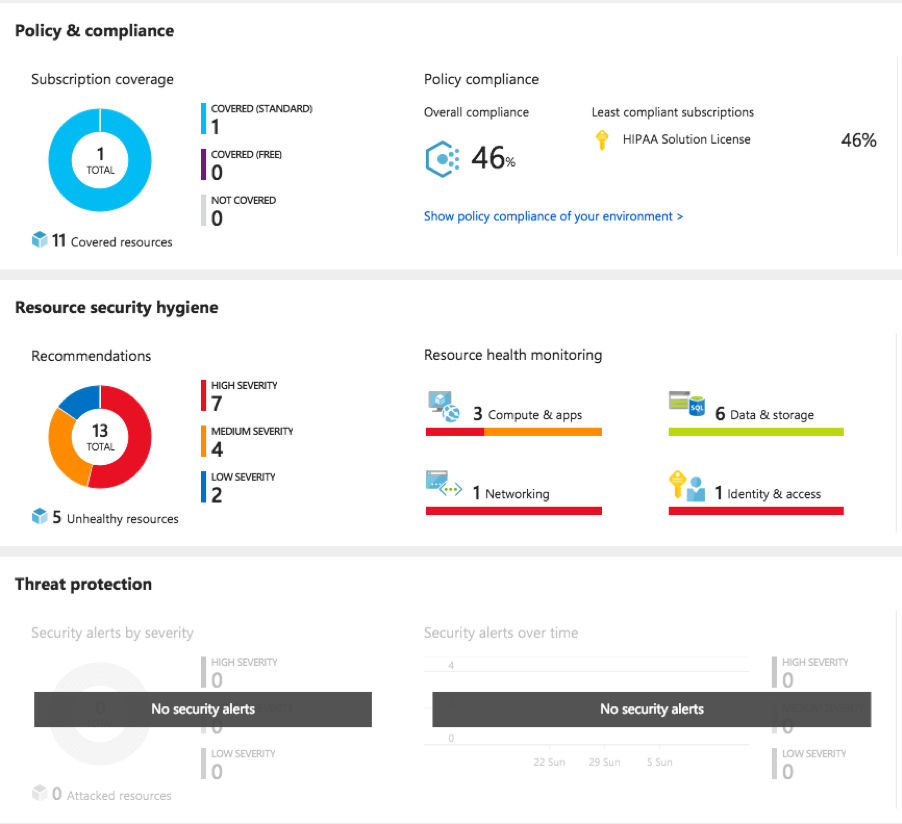
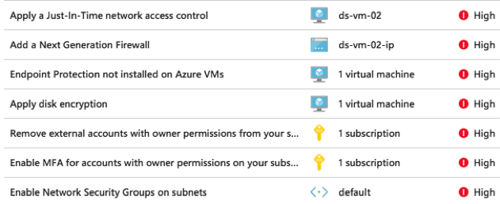

The healthcare blueprint for AI bootstraps AI and machine learning into your organization using Azure. This article describes how to install the blueprint and what its components are. Then we cover how to use the solution to run an AI and machine learning experiment that predicts a patient’s length of stay.

## Architecture

The following graphic shows the Azure products that are installed. Each resource or service provides a component of the AI and machine learning processing solution, including the cross-cutting concerns of identity and security.



*Download a [Visio file](https://arch-center.azureedge.net/component-zones.vsdx) of this architecture.*

## Scenario details

Healthcare organizations are realizing that artificial intelligence (AI) and machine learning can be valuable tools for many parts of their business, from improving patient outcomes to streamlining daily operations. Often, healthcare organizations don't have the technology staff to implement AI and machine learning systems. To improve this situation and get AI and machine learning solutions running on Azure quickly, Microsoft created the [Azure healthcare AI blueprint](/azure/security/blueprints/azure-health?WT.mc_id=ms-docs-dastarr). Using the blueprint, we show how to get started with AI and machine learning quickly in a safe, compliant, secure, and reliable way.

### Benefits

The blueprint was created to give healthcare organizations guidance and a quick start on proper PaaS (Platform as a Service) architectures. The blueprint supports AI and machine learning in highly regulated healthcare environments. The solution ensures the system upholds HIPAA and HITRUST compliance requirements.

Technology staff in healthcare organizations often have little time for new projects, especially those in which they must learn a new and complex technology. The blueprint can help technical staff become familiar with Azure and several of its services quickly, saving the cost of a learning curve. After the blueprint is installed, technical staff can learn from it as a reference implementation. The staff can then use that knowledge to extend the blueprint's capabilities, or they can create a new AI and machine learning solution that's patterned after the blueprint.

The blueprint gets your organization up and running with new AI and machine learning capabilities quickly. With AI and machine learning in place, technical staff are ready to run AI and machine learning experiments using data collected through various sources. For example, data might already exist on previous instances of sepsis, and the data might exist through many of the accompanying variables that were tracked for individual patients with the condition. By using this data in an anonymized format, technical staff can look for indicators of potential sepsis in patients. They can then help change operational procedures to better avoid the condition.

The blueprint provides the data and example code for learning how to predict a patient’s length of stay. This is a sample use case that can be used for learning about the components of the AI and machine learning solution.

### Platform or infrastructure as a service

Microsoft Azure offers both PaaS and SaaS offerings and choosing the right one for your needs differs per use case. The blueprint is designed to use PaaS services that solve for predicting a patient’s length of stay in hospital. The Azure healthcare AI blueprint provides everything needed to instantiate a secure and compliant AI and machine learning solution pre-configured for healthcare organizations. The PaaS model used by this blueprint installs and configures the blueprint as a complete solution.

#### PaaS option

Using a PaaS services model results in reduced Total Cost of Ownership(TCO) because there's no hardware to manage. The organization doesn’t need to buy and maintain hardware or VMs. The blueprint uses PaaS services exclusively.

This reduces the cost of maintaining an on-premises solution and frees technical staff to focus on strategic initiatives instead of infrastructure. Staff can also move paying for computing and storage from their capital expense budgets to their operational expense budgets instead. The costs of running this blueprint scenario are driven by usage of the services plus the costs of data storage.

#### IaaS option

Although the blueprint and this article focus on the PaaS implementation, there's an [open source extension](https://github.com/Azure/Azure-Health-Extension) to the blueprint that allows you to use it in an infrastructure as a service (IaaS) environment.

In an IaaS hosting model, customers pay for uptime of Azure hosted VMs and their processing power. IaaS gives a higher level of control since the customer is managing their own VMs, but typically at increased costs as VMs are charged for uptime versus usage. Further, the customer is responsible for maintaining the VMs by applying patches, guarding against malware and so on.

The IaaS model is beyond the scope of this article, which focuses on a PaaS deployment of the blueprint.

### The healthcare AI and machine learning blueprint

The blueprint creates a starting point for using this technology in a healthcare context. When the blueprint is installed to Azure, all resources, services and several user accounts are created to support the AI and machine learning scenario with appropriate actors, permissions, and services.

The blueprint includes an AI and machine learning experiment to predict a patient’s length of stay, which can help in forecasting staffing, bed counts, and other logistics. The package includes installation scripts, example code, test data, security and privacy support and more.

## Deploy this scenario

### Blueprint technical resources

The resources listed in this section are all found in the GitHub repository.

Review the following primary resources:

- [PowerShell](/powershell/scripting/overview) scripts for deployment, configuration, and other tasks.
- [Detailed instructions for installation](https://github.com/Azure/Health-Data-and-AI-Blueprint/blob/master/deployment.md) include how to use the install script.
- [A comprehensive FAQ](https://github.com/Azure/Health-Data-and-AI-Blueprint/blob/master/faq.md)

Cross cutting concerns for this model include identity and security, both of which are especially important when dealing with patient data. The components of the machine learning pipeline are shown in this graphic.



Implementing a new system in a regulated healthcare environment is complex. For example, ensuring all aspects of the system are HIPAA compliant and HITRUST certifiable takes more than developing a lightweight solution. The blueprint installs identification and resource permissions to help with these complexities.

The blueprint also provides additional scripts and data used to simulate and study the results of admitting or discharging patients. These scripts allow staff to immediately begin to learn how to implement AI and machine learning using the solution in a safe, isolated scenario.

### Additional blueprint resources

The blueprint provides exceptional guidance and instructions for technical staff and also includes artifacts to help create a fully functional installation. See the following additional artifacts:

- A [threat model](https://servicetrust.microsoft.com/ViewPage/HIPAABlueprint?command=Download&downloadType=Document&downloadId=01828de2-9555-4bac-a2a0-44e9ed2eeeaf&docTab=d7c399a0-2b92-11e8-9910-13dc07d708f7_Data_Analytics&WT.mc_id=ms-docs-dastarr) for use with the [Microsoft Threat Modeling Tool](https://www.microsoft.com/download/details.aspx?id=49168&WT.mc_id=ms-docs-dastarr). This threat model shows components of the solution, the data flows between them, and the trust boundaries. The tool can be used for threat modeling by those looking to extend the base blueprint or for learning about the system architecture from a security perspective.

- The [HITRUST customer responsibility matrix](https://servicetrust.microsoft.com/ViewPage/HIPAABlueprint?command=Download&downloadType=Document&downloadId=eab85244-b9ab-490a-9e2a-611153f7d3af&docTab=d7c399a0-2b92-11e8-9910-13dc07d708f7_Data_Analytics&WT.mc_id=ms-docs-dastarr) is an Excel workbook. This resource shows what you (the customer) must provide, versus what Microsoft provides, for each requirement in the matrix. More information about this responsibility matrix is included in this article, in the "Security and Compliance" > Blueprint responsibility matrix section of this document.

- The [HITRUST health data and AI review](https://servicetrust.microsoft.com/ViewPage/HIPAABlueprint?command=Download&downloadType=Document&downloadId=ffc32e44-665e-46c5-b753-163d55a17d27&docTab=d7c399a0-2b92-11e8-9910-13dc07d708f7_Data_Analytics&WT.mc_id=ms-docs-dastarr) technical paper examines the blueprint through the lens of requirements to be met for HITRUST certification.

- The [HIPAA health data and AI review](https://servicetrust.microsoft.com/ViewPage/HIPAABlueprint?command=Download&downloadType=Document&downloadId=d5ce675c-3e83-45db-98a6-ae77fc439436&docTab=d7c399a0-2b92-11e8-9910-13dc07d708f7_Data_Analytics&WT.mc_id=ms-docs-dastarr) technical paper reviews the architecture with HIPAA regulations in mind.

These resources are [here on GitHub](https://github.com/Azure/Health-Data-and-AI-Blueprint).

### Install the blueprint

There's little time investment to get up and running with this blueprint solution. A bit of PowerShell scripting knowledge is recommended, but step-by-step instructions are available to help guide the installation. This way technologists will be successful in deploying this blueprint, regardless of their scripting skills.

Technical staff can expect to install the blueprint with little experience using Azure in 30 minutes to an hour.

#### The installation script

The blueprint provides exceptional guidance and instructions for installation. It also provides scripting for install and uninstall of the blueprint services and resources. Calling the PowerShell deployment script is simple. Before the blueprint is installed, certain data must be collected and used as arguments to the deploy.ps1 script, as show in the following code.

```powershell
.\deploy.ps1 -deploymentPrefix <prefix> `
            -tenantId <tenant id> ` # also known as the Azure Active Directory (Azure AD) directory
            -tenantDomain <tenant domain> `
            -subscriptionId <subscription id> `
            -globalAdminUsername <user id> ` # ID from your Azure AD account
            -deploymentPassword <universal password> ` # applied to all new users and service accounts
            -appInsightsPlan 1 # we want app insights set up
```

#### The installation environment

**Important!** Don't install the blueprint from a machine outside of Azure. The install is much more likely to succeed if you create a clean Windows 10 VM (or other Windows VM) in Azure. Then run the install scripts from there. This technique uses a cloud-based VM to mitigate latency and help to create a smooth installation.

During installation, the script calls out to other packages to load and use. When installing from a VM in Azure, the lag between the installation machine and the target resources will be much lower. However, some of the scripting packages downloaded are still vulnerable to latency as script packages live outside the Azure environment—which can lead to time-out failures.

#### Troubleshooting: Install failure

The installer downloads some external packages during installation. Sometimes, a script resource request will time out due to lag between the install machine and the package. When this happens, you have two choices:

1. Run the install script again with no changes. The installer checks for already allocated resources and installs only those needed. While this technique can work, there's a risk the install script will try to allocate resources already in place. This can cause an error and the installation will fail.

2. You still run the deploy.ps1 script, but pass different arguments for uninstalling the blueprint services.

```powershell
.\deploy.ps1 -clearDeploymentPrefix <prefix> `
             -tenantId <value> `
             -subscriptionId <value> `
             -tenantDomain <value> `
             -globalAdminUsername <value> `
             -clearDeployment
```

After the uninstall is done, change the prefix in the install script and try installing again. The latency issue may not occur again. If the installation fails while downloading script packages, run the uninstaller script and then the installer again.

After running the uninstall script, the following will be gone.

- Users installed by the installer script
- The resource groups and their respective services are gone, including data storage
- The application registered with Azure AD

Note that the key vault is held as a “soft delete” and while it isn’t seen in the portal, it doesn’t get deallocated for 30 days. This enables reconstituting the key vault if needed. To learn more about the implications of this and how to handle it, see the [Key vaults](#key-vaults) section of this article.

#### Reinstall after an uninstall

If there's a need to reinstall the blueprint after an uninstall, you must change the prefix in the next deployment as the uninstalled key vault will cause an error if you don't change the prefix. More about this is covered in the [Key vaults](#key-vaults) section of this article.

#### Required administrator roles

The person installing the blueprint must be in the Global Administrator role in Azure AD. The installing account must also be an Azure subscription administrator for the subscription being used. If the person doing the install isn't in both of these roles, the install will fail.



Further, the install isn't designed to work with MSDN subscriptions, due to the tight integration with Azure AD. A standard Azure account must be used. If needed, [get a free trial](https://azure.microsoft.com/free/?WT.mc_id=ms-docs-dastarr) with credit to spend for installing the blueprint solution and running its demos.

### Adding other resources

The Azure blueprint installation doesn’t include more services than those needed to implement the AI and machine learning use case. However, more resources or services can be added to the Azure environment. This capability makes it a good test bed for additional initiatives, or a starting point for a production system. For instance, you could add other PaaS services or IaaS resources in the same subscription and Azure AD.

New resources, like [Azure Cosmos DB](/azure/cosmos-db/introduction?WT.mc_id=ms-docs-dastarr) or a new [Azure Functions](/azure/azure-functions/functions-overview?WT.mc_id=ms-docs-dastarr), can be added to the solution as more Azure capabilities are needed. When adding new resources or services, ensure they're configured to meet security and privacy policies to remain compliant with regulations and policy.

New resources and services can be created with [Azure REST APIs](/rest/api/?view=Azure&WT.mc_id=ms-docs-dastarr), [Azure PowerShell scripting](/powershell/azure/get-started-azureps?view=azurermps-6.6.0&WT.mc_id=ms-docs-dastarr), or by using the [Azure portal](https://portal.azure.com/?WT.mc_id=ms-docs-dastarr).

### Using machine learning with the blueprint

The blueprint was built to demonstrate a machine learning scenario with a regression algorithm used in a model to predict a [patient’s length of stay](/azure/security/blueprints/azure-health?WT.mc_id=ms-docs-dastarr#example-use-case). This is a common prediction for healthcare providers to run as it helps in scheduling staffing and other operational decisions. Further, anomalies can be detected over time when an average length of stay for a given condition rises or declines.

#### Ingesting training data

With the blueprint installed and all services working properly, the data to be analyzed can be ingested. 100,000 patient [records are available for ingest](/azure/security/blueprints/azure-health?WT.mc_id=ms-docs-dastarr#ingest) and working with the model. Ingesting patient records is the first step in the using [Azure Machine Learning Studio](/azure/machine-learning/studio/what-is-ml-studio?WT.mc_id=ms-docs-dastarr) to run the patient length of stay experiment, as shown in the following image.



The blueprint includes an experiment and the necessary data to run a machine learning job in Machine Learning Studio. The example uses a trained model in an experiment to forecast patient length of stay based on many variables.

In this demonstration environment, the data ingested into the Azure SQL database is free from any defects or missing data elements. This data is clean. Often, unclean data is ingested and must be “cleaned” before it can be used for feeding a machine learning training algorithm. Or it must be cleaned before using the data in a machine learning job. Missing data or incorrect values in the data will negatively impact the results of the machine learning analysis.

## Machine Learning Studio

Many healthcare organizations don’t have the technical staff to focus on machine learning projects. This often means valuable data is left unused or expensive consultants are brought in to create machine learning solutions.

AI and machine learning experts as well as those learning about AI and machine learning can use Machine Learning Studio to design experiments. Machine Learning Studio is a web-based design environment used to create machine learning experiments. With Machine Learning Studio, you can create, train, evaluate, and score models, saving precious time when using different tools to develop models.

Machine Learning Studio offers a complete toolset for machine learning workloads. This means people new to machine learning can get a jump start using the tool and produce results faster than with other machine learning tools. That lets your IT staff focus on providing value elsewhere and without bringing in a machine learning specialist. This capability in your own healthcare organization means various hypotheses can be tested. The resulting data is then analyzed for actionable insights, like how patient interventionism offers [pre-written modules](/azure/machine-learning/studio-module-reference/index?WT.mc_id=ms-docs-dastarr#help-for-machine-learning-modules). These modules are to be used on a drag-and-drop canvas, visually composing end-to-end data-science workflows as experiments.

There are pre-written modules that encapsulate specific algorithms, such as decision trees, decision forests, clustering, time series, anomaly detection, and others.

Custom modules can be added to any experiment. These are written in the [R language](/azure/machine-learning/studio/extend-your-experiment-with-r?WT.mc_id=ms-docs-dastarr) or in [Python](/azure/machine-learning/studio/execute-python-scripts?WT.mc_id=ms-docs-dastarr). This allows using pre-built modules as well as custom logic to create a more sophisticated experiment.

Machine Learning Studio enables [creating and using](/azure/machine-learning/studio-module-reference/machine-learning-initialize-model?WT.mc_id=ms-docs-dastarr) learning models. It provides a set of pre-designed experiments for use in common applications. Additionally, new experiments can be added to Machine Learning Studio without changing any of the blueprint’s resources.

To save time, visit the [Azure AI Gallery](https://gallery.azure.ai/industries/healthcare?WT.mc_id=ms-docs-dastarr) to find ready-to-use machine learning solutions for specific industries, including healthcare. For example, the gallery includes solutions and experiments for breast cancer detection and heart disease prediction.

## Security and compliance

Security and compliance are two of the most important things to be mindful of when creating, installing or managing software systems in a healthcare environment. The investment made in adopting a software system can be undercut by not meeting required security policies and certifications.

Although this article and the healthcare blueprint focus on technical security, other types of security are also important including physical security and administrative security. These security topics are beyond the scope of this article, which focuses on the blueprint’s technical security.

### Principle of least privilege

The blueprint installs named users with roles to support and limit their access needs to resources in the solution. This model is known as the “principle of least privilege,” an approach to resource access in system design. The principle states that service and user accounts should have access to only those systems and services needed for a legitimate purpose.

This security model ensures the system’s compliance with HIPAA and HITRUST requirements, removing risk to the organization.

### Defense in depth

System designs using multiple abstraction layers of security controls are using defense in depth. Defense in depth provides security redundancy at multiple levels. It means you're not dependent on a single layer of defense. It ensures that user and service accounts have appropriate access to resources, services, and data. Azure provides security and monitoring resources at every level of system architecture, in order to provide defense in depth for the entire landscape of technologies.

In a software system like the one installed by the blueprint, a user can log in but not have permission to a specific resource. This example of defense in depth is provided by RBAC (Role Based Access Control) and Azure AD, supporting the principle of least privilege.

Two-factor authentication is also a form of technical defense in depth and can be optionally included when the blueprint is installed.

### Azure Key Vault

The Key Vault service is used to store secrets, certificates, and other data used by applications. These include database strings, REST endpoint URLs, API keys, and other things developers don’t want to hard-code into an application or distribute in a .config file.

Vaults are accessible by application service identities or other accounts in with Azure AD permissions. This allows secrets to be accessed at runtime by applications needing a vault’s contents.

Keys stored in a vault can be encrypted or signed, and key usage can be monitored for any security concerns.

If a key vault is deleted, it's not immediately purged from Azure. Implications of this are covered in the [Key vaults](#key-vaults) section of this article.

### Application Insights

Healthcare organizations often have mission and life-critical systems that must be reliable and resilient. Anomalies or disruptions in service must be detected and corrected as soon as possible. [Application Insights](/azure/application-insights/app-insights-proactive-application-security-detection-pack?WT.mc_id=ms-docs-dastarr) is an Application Performance Management (APM) technology that monitors applications and sends alerts when something goes wrong. It monitors applications at runtime for errors or application anomalies. It's designed to work with multiple programming languages and provides a rich set of capabilities to help ensure applications are healthy and running smoothly.

For example, an application can have a memory leak. Application Insights can help find and diagnose issues like this through the rich reporting and KPIs it monitors. Application Insights is a robust APM service for application developers.

This interactive demo shows key features and capabilities of Application Insights, including a comprehensive monitoring dashboard which can be used by technologists in the health organization to monitor application state and health.

#### Microsoft Defender for Cloud

Real time security and KPI monitoring is a necessity in mission critical applications. Defender for Cloud helps ensure your Azure resources are secure and protected. Defender for Cloud is a security management and advanced threat protection service. It can be used to apply security policies across your workloads, limit your exposure to threats and detect and respond to attacks.

Defender for Cloud standard provides the following services.

- **Hybrid security** – Get a unified view of security across all your on-premises and cloud workloads. This is especially helpful in hybrid cloud networks used by healthcare organizations with Azure.
- **Advanced threat detection** – Defender for Cloud uses advanced analytics to get an edge over evolving cyber-attacks and mitigate them right away.
- **Access and application controls** - Block malware and other unwanted applications by applying allow list recommendations for your specific workloads and powered by machine learning.

In the context of the Health AI blueprint, Defender for Cloud analyzes the system components and provides a dashboard showing vulnerabilities in services and resources in the subscription. Distinct dashboard elements provide visibility into a solution’s concerns as follows.

- Policy and compliance
- Resource security hygiene
- Threat protection

The following example dashboard identifies 13 suggestions for improving the system threat vulnerabilities. It also shows a mere 46% compliance with HIPAA and policy.



Drilling into the high severity security problems shows what resources are affected and the remediation needed for each resource, as shown later in this section.

Many hours can be spent by IT staff trying to manually secure all resources and networks. With Defender for Cloud to identify vulnerabilities in a given system, time can be spent in other strategic pursuits. For many of the vulnerabilities identified, Defender for Cloud can automatically apply the remediating action and secure the resource without an administrator having to dig deeply into the problem.



Defender for Cloud does even more through its threat detection and alerting capabilities. Use Defender for Cloud to monitor networks, machines, and cloud services for incoming attacks and post-breach activity to keep your environment secure.
Defender for Cloud automatically collects, analyzes, and integrates security information and logs from a variety of Azure resources.

The machine learning capabilities in Defender for Cloud allow it to detect threats that manual approaches wouldn't reveal. A list of prioritized security alerts is shown in Defender for Cloud along with the information needed to quickly investigate the problem along with recommendations for how to remediate an attack.

### RBAC security

[Role Based Access Control](/azure/role-based-access-control/role-assignments-portal?WT.mc_id=ms-docs-dastarr) (RBAC) provides or denies access to protected resources, sometimes with specific rights per resource. This ensures only appropriate users can access their designated system components.
For example, a database administrator can have access to a database containing encrypted patient data whereas a health care provider only has access to appropriate patient’s records through the application that displays them. This is typically an Electronic Medical Record or Electronic Health Record system. The nurse has no need to access the databases and the database administrator has no need to see a patient’s health record data.

To enable this, RBAC is part of Azure security and enables precisely focused access management for Azure resources. Fine-grained settings for each user enable security and systems administrators to be very exact in the rights they give each user.

### Blueprint responsibility matrix

The HITRUST customer responsibility matrix is an Excel document that supports customers implementing and documenting security controls for systems built on Azure. The workbook lists the relevant HITRUST requirements and explains how Microsoft and the customer are responsible for meeting each one.

It's essential for customers, when building systems on Azure, to understand the shared responsibility for implementing security controls in a cloud environment. Implementing a specific security control can be the responsibility of Microsoft, the responsibility of customers, or a shared responsibility between Microsoft and customers. Different cloud implementations affect the way responsibilities are shared between Microsoft and customers.

See the following responsibilities table for examples.

|Azure responsibilities |Customer responsibilities |
|---------|---------|
|Azure is responsible for implementation, management, and monitoring of information protection program methods and mechanisms in relation to its service provision environment. | The customer is responsible for implementation, configuration, management, and monitoring of information protection program methods and mechanisms for customer-controlled assets used to access and consume Azure services. |
|Azure is responsible for implementation, configuration, management, and monitoring of account management methods and mechanisms in relation to its service provision environment. |The customer is also responsible for account management of deployed Azure virtual machine instances and resident application components.|

These are only two examples of the many responsibilities to be considered when deploying cloud systems. The HITRUST customer responsibility matrix is designed to support an organization’s HITRUST compliance with an Azure system implementation.

## Customization

It's common to customize the blueprint after it's installed. Reasons and techniques to customize the environment vary.

The blueprint can be customized before installation by modifying the install scripts. While this is possible, we advise you to create independent PowerShell scripts to run after the initial install is complete. New services can also be added to the system through the portal once the initial installation has taken place.

Customizations can include any of the following:

- Adding new experiments to Machine Learning studio
- Adding additional unrelated services to environment
- Modifying data ingestion and the machine learning experiment output to use a different data source than the Azure SQL patientdb database
- Providing production data to the machine learning experiment
- Cleaning any proprietary data being ingested to match that needed by the experiment

Customizing the installation is no different than working with any Azure solution. Services or resources can be added or removed, providing new capabilities. When customizing the blueprint, take care not to alter the overall machine learning pipeline to ensure the implementation continues working.

## Technical issues

The following issues can cause the blueprint installation to fail or to install in an undesirable configuration.

### Key vaults

Key vaults are unique when deleting an Azure resource. Vaults are kept by Azure for recovery purposes. Accordingly, a different prefix must be passed into the install script each time the install script is run, or the install will fail due to a collision with the old vault name. Key vaults, and all other resources, are named using the prefix you provide to the install script.

A key vault created by the installation script is retained as a “soft delete” for 30 days. Although not currently accessible through the portal, soft deleted [Key Vaults are manageable from PowerShell](/azure/key-vault/key-vault-soft-delete-powershell?WT.mc_id=ms-docs-dastarr), and can even be deleted manually.

### Azure AD

It's strongly recommended that you install the blueprint in an empty Azure AD rather than into a production system. Create a new Azure AD instance and use its tenant ID during installs to avoid adding blueprint accounts to your live Azure AD instance.

## Components

- [Azure Machine Learning](https://azure.microsoft.com/services/machine-learning) is an enterprise-grade machine learning service for building and deploying models quickly. It provides users at all skill levels with a low-code designer, automated machine learning, and a hosted Jupyter notebook environment that supports various IDEs.
- [Machine Learning studio](/azure/machine-learning/?WT.mc_id=ms-docs-dastarr) is the workspace and tool data scientists use to create machine learning experiments. It allows using built-in algorithms, special purpose widgets, and Python and R scripts. Train, deploy, and automate machine learning models in this web portal, covering both code-first and no-code perspectives.
- [Key Vault](https://azure.microsoft.com/services/key-vault): is a cloud service that provides a secure store for secrets such as API keys, passwords, certificates, and cryptographic keys. Key Vault also lets you easily provision, manage, and deploy public and private Transport Layer Security/Secure Sockets Layer (TLS/SSL) certificates for use with Azure and your internal connected resources.
- [Azure Functions](https://azure.microsoft.com/services/functions) is an event-driven, serverless compute service that runs small, single-task code without requiring new infrastructure. The cloud infrastructure provides servers to run the functions at scale. With triggers and bindings, Functions can react to changes in Azure services like Blob Storage and Azure Cosmos DB. You can use it to process bulk data, integrate systems, work with IoT, and build simple APIs and microservices. The [Azure Functions Premium plan](/azure/azure-functions/functions-premium-plan) adds the ability to communicate with Functions privately over a virtual network.
- [Azure SQL](https://azure.microsoft.com/services/azure-sql) is a family of SQL cloud databases that provides a unified experience for your entire SQL portfolio, and a wide range of deployment options from edge to cloud.
- [Azure SQL Database](https://azure.microsoft.com/products/azure-sql/database), part of the Azure SQL family, is a fully managed platform as a service (PaaS) database engine. It always runs on the latest stable version of the SQL Server database engine and patched OS. It handles most database management functions for you, including upgrading, patching, backups, and monitoring.
- [Microsoft Defender for Cloud](https://azure.microsoft.com/services/defender-for-cloud?WT.mc_id=ms-docs-dastarr) provides unified security management and threat protection across your hybrid and multi-cloud workloads, including workloads in Azure, Amazon Web Services (AWS), and Google Cloud Platform (GCP). It integrates with almost all major services on the Azure platform. It automatically collects, analyzes, and integrates log data from your Azure resources, the network, and connected partner solutions, such as firewall solutions, to detect real threats and reduce false positives. Defender for Cloud helps you find and fix security vulnerabilities, apply access and application controls to block malicious activity, detect threats using analytics and intelligence, and respond quickly when under attack. Its capabilities include security alerts, anomaly detection, best practice recommendations, regulatory compliance scores, and threat detection.
- **Azure Powershell** is a set of cmdlets for managing Azure resources directly from PowerShell. For more information, see: [What is Azure PowerShell?](/powershell/azure/what-is-azure-powershell).

## Considerations

- The scripting language PowerShell is instrumental to setting up the blueprint, although needed commands are presented in the installation instructions.
- [Azure AI Gallery](https://gallery.azure.ai) provides a recipe box of AI and machine learning solutions useful for customers by their industry. There are several solutions published by data scientists along with other experts for healthcare.

## Conclusion

The [Azure Health Data AI blueprint](/azure/security/blueprints/azure-health?WT.mc_id=ms-docs-dastarr) is a complete machine learning solution and can be used as a learning tool for technologists to better understand Azure and how to ensure systems conform to healthcare regulatory requirements. It can also be used as a starting point for a production system, by using Machine Learning Studio as the focal point.

Whether you're using the blueprint for learning purposes or for the seed of an AI and machine learning solution for your organization, it provides a starting point for working with AI and machine learning in Azure with a focus on healthcare.

## Contributors

Principal author:

- [David Starr](https://www.linkedin.com/in/davidstarr/?msclkid=18a535bac1c011ecb8532eb644398ade) | Principal Software Engineer

## Next steps

- [Azure Security and Compliance Blueprint - HIPAA/HITRUST Health Data and AI](/azure/security/blueprints/azure-health?WT.mc_id=ms-docs-dastarr)
- [GitHub repo: Azure HIPAA/HITRUST Health Data and AI - with (IaaS Extension](https://github.com/Azure/Health-Data-and-AI-Blueprint/blob/master/deployment.md)
- [Azure Key Vault basic concepts](/azure/key-vault/key-vault-whatis?WT.mc_id=ms-docs-dastarr)
- [Azure Machine Learning Studio (classic)](/azure/machine-learning/studio/what-is-ml-studio)
- [Azure Machine Learning Studio](/azure/machine-learning/overview-what-is-machine-learning-studio)
- [Introduction to Azure Functions](/azure/azure-functions/functions-overview)
- [Download the blueprint](https://github.com/Azure/Health-Data-and-AI-Blueprint/blob/master/deployment.md) to get started with your implementation in hours, not days or weeks. If you have problems with your install or questions about blueprint, visit [the FAQ page](https://github.com/Azure/Health-Data-and-AI-Blueprint/blob/master/faq.md).
- Download the supporting collateral to gain a better understanding of the blueprint implementation beyond the installation and machine learning experiment. This collateral includes the following.
  - [HITRUST customer responsibility matrix](https://servicetrust.microsoft.com/ViewPage/HIPAABlueprint?command=Download&downloadType=Document&downloadId=eab85244-b9ab-490a-9e2a-611153f7d3af&docTab=d7c399a0-2b92-11e8-9910-13dc07d708f7_Data_Analytics&WT.mc_id=ms-docs-dastarr)
  - [The comprehensive threat model](https://servicetrust.microsoft.com/ViewPage/HIPAABlueprint?command=Download&downloadType=Document&downloadId=01828de2-9555-4bac-a2a0-44e9ed2eeeaf&docTab=d7c399a0-2b92-11e8-9910-13dc07d708f7_Data_Analytics&WT.mc_id=ms-docs-dastarr)
  - [HITRUST health data and AI review technical paper](https://servicetrust.microsoft.com/ViewPage/HIPAABlueprint?command=Download&downloadType=Document&downloadId=ffc32e44-665e-46c5-b753-163d55a17d27&docTab=d7c399a0-2b92-11e8-9910-13dc07d708f7_Data_Analytics&WT.mc_id=ms-docs-dastarr)
  - [HIPAA health data and AI review](https://servicetrust.microsoft.com/ViewPage/HIPAABlueprint?command=Download&downloadType=Document&downloadId=d5ce675c-3e83-45db-98a6-ae77fc439436&docTab=d7c399a0-2b92-11e8-9910-13dc07d708f7_Data_Analytics?WT.mc_id=ms-docs-dastarr)

## Related resources

- [Solutions for the healthcare industry](../../industries/healthcare.md)
- [Clinical insights with Microsoft Cloud for Healthcare](../../example-scenario/mch-health/medical-data-insights.yml)
- [Predict hospital readmissions by using traditional and automated machine learning techniques](../../example-scenario/ai/predict-hospital-readmissions-machine-learning.yml)
- [Predict the length of stay in hospitals](/azure/architecture/example-scenario/digital-health/predict-patient-length-of-stay)
- [Precision medicine pipeline with genomics](../../example-scenario/precision-medicine/genomic-analysis-reporting.yml)