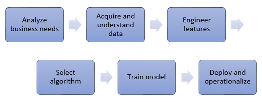

Customers are demanding products that have these attributes: lightweight, strong, safe, sustainable, and customized. As a result, the design stage has become increasingly complex. In that stage, computers are used to visualize, analyze, simulate, and optimize. And those tasks will grow more sophisticated and computationally hungry. In addition, products are increasingly connected, and generate vast amounts of data that needs to be processed and analyzed.

It all adds up to a single need: large computing resources, on-demand.

In this article, we walk through some well-known areas in engineering and manufacturing that need large computing power. We then explore how the Microsoft Azure platform can help.

## Cloud design workstations

Product designers use various software tools during the design and planning phases of the product development lifecycle. CAD tools require strong graphics capabilities on the designer’s workstation, and the cost of these workstations is high. These souped-up workstations are normally inside the offices of the designers, tying them physically to a location.

As cloud solutions started to gain more popularity, and new capabilities became available, the idea of cloud workstations started to become more viable. Using a workstation that's hosted on the cloud allows the designer to access it from any location. And it allows the organization to change the cost model from capital expenses to operational expenses.

### Remote desktop protocol

Microsoft’s Remote Desktop Protocol (RDP) has supported TCP-only for a long time. Transmission Control Protocol (TCP) introduces more overhead than User Datagram Protocol (UDP). Starting with RDP 8.0, UDP is available to servers running Microsoft Remote Desktop Services. To be usable, a virtual machine (VM) must have enough hardware resources, namely: CPU, memory and, most critically, the graphics processing unit (GPU). (The GPU is arguably the most critical component of a high-performance cloud workstation.) Windows Server 2016 provides several options for accessing the underlying graphics capabilities. The default Remote Desktop Services (RDS) GPU solution is also known as Windows Advanced Rasterization Platform (WARP). It's an adequate solution for knowledge-worker scenarios, but it provides inadequate resources for the cloud workstation scenarios. RemoteFX vGPU is a feature of RemoteFX that was introduced for remote connections. It provides a solution for scenarios with higher user densities per server, which allows a high-burst GPU utilization. However, when the time comes for using the power of the GPU, Discrete Device Assignment (DDA) is necessary to make the full use of the GPU power.

NV Series VMs are available with single or multiple Nvidia GPUs, as part of the Azure N Series offering. These VMs are optimized for remote visualization and virtual desktop infrastructure (VDI) scenarios. They use frameworks such as OpenGL and DirectX. Going up to 4 GPUs, you can provision workstations that take full advantage of the GPU, through Discrete Device Assignment (DDA) on Azure.

The Azure platform is programmable. It offers several options for a VM. For example, you can provision a workstation on demand. You can also keep the state of the remote machine on local files by using Azure Disks on Premium Storage or Azure Files. These options give you the ability to control costs. The Microsoft partnership with Citrix, for their XenDesktop and XenApp solutions, also provides another alternative for a desktop virtualization solution.

## Analysis and simulation

Analysis and simulation of physical systems on computers has been around for a long time. Finite element analysis (FEA) is a numerical method that's used for solving many analysis problems. FEA requires a lot of computational power to perform large matrix calculations. The number of matrices involved in the solution of an FEA model explodes as we go from 2D to 3D and as we add granularity to the FEA mesh. This analysis requires computing power that's deployed on demand. It's important that the problem-solving code can be run in parallel to take advantage of the scalability of resources.

Solving simulation problems requires large-scale computing resources. High performance computing (HPC) is a class of large-scale computing. HPC requires low backend network latency, and remote direct memory access (RDMA) capabilities for fast parallel computations. The Azure platform offers VMs built for high-performance computing. They feature specialized processors that are paired with DDR4 memory, and they allow compute-intensive solutions to run effectively, both on Linux and Windows installations. They're available in several sizes. See [High-performance compute VM sizes](/azure/virtual-machines/windows/sizes-hpc?WT.mc_id=computeinmanufacturing-docs-ercenk). To see how Azure supports HPC in other ways, see big compute: [HPC & Batch](https://azure.microsoft.com/solutions/big-compute/?WT.mc_id=computeinmanufacturing-docs-ercenk).

The Azure platform enables solutions to scale up and out. One of the commonly known software packages for simulation is STAR-CCM+, from CD-adapco. [A published study](https://azure.microsoft.com/blog/availability-of-star-ccm-on-microsoft-azure/?WT.mc_id=computeinmanufacturing-docs-ercenk) demonstrating STAR-CCM+ running “Le Mans 100 million cell” computational fluid dynamics (CFD) model provides a glimpse of the scalability of the platform. The following chart demonstrates the observed scalability as more cores are added for running the simulation:

Another popular engineering analysis software package is ANSYS CFD. It enables engineers to perform multi-physics analysis, including fluid forces, thermal effects, structural integrity, and electromagnetic radiation. [The published study](https://azure.microsoft.com/blog/ansys-cfd-and-microsoft-azure-perform-the-best-hpc-scalability-in-the-cloud/?WT.mc_id=computeinmanufacturing-docs-ercenk) demonstrates the scalability of the solution on Azure and shows similar results.

Instead of investing in a local compute cluster, a software package that requires parallel execution can be deployed on Azure virtual machines or on [Virtual Machine Scale Sets](/azure/virtual-machine-scale-sets/overview?WT.mc_id=computeinmanufacturing-docs-ercenk) by using the [HPC and GPU VM](/azure/virtual-machines/windows/sizes-hpc?WT.mc_id=computeinmanufacturing-docs-ercenk) families for an all-cloud solution.

### Burst to Azure

If a local cluster is available, another option is to extend it to Azure. This process offloads peak workloads and is known as *bursting to Azure*. To do so requires using one of the on-premises workload managers that support Azure. Recommended workload managers include [Alces Flight Compute](http://alces-flight.github.io), [TIBCO DataSynapse GridServer](https://azure.microsoft.com/blog/tibco-datasynapse-comes-to-the-azure-marketplace/?WT.mc_id=computeinmanufacturing-docs-ercenk), [Bright Cluster Manager](http://www.brightcomputing.com/technology-partners/microsoft), [IBM Spectrum Symphony and Symphony LSF](https://azure.microsoft.com/blog/ibm-and-microsoft-azure-support-spectrum-symphony-and-spectrum-lsf/?WT.mc_id=computeinmanufacturing-docs-ercenk), [PBS Pro](http://pbspro.org), and [Microsoft HPC Pack](/powershell/high-performance-computing/overview?WT.mc_id=computeinmanufacturing-docs-ercenk).

Another option is Azure Batch, which is a service for running large scale parallel and HPC batch jobs efficiently. Azure Batch allows jobs that use the Message Passing Interface (MPI) API. Batch supports both [Microsoft MPI](/message-passing-interface/microsoft-mpi?WT.mc_id=computeinmanufacturing-docs-ercenk) and Intel MPI with [HPC](/azure/virtual-machines/linux/sizes-hpc?WT.mc_id=computeinmanufacturing-docs-ercenk) and [GPU](/azure/virtual-machines/linux/sizes-gpu?WT.mc_id=computeinmanufacturing-docs-ercenk) optimized VM families. Microsoft also acquired [Cycle Computing](https://blogs.microsoft.com/blog/2017/08/15/microsoft-acquires-cycle-computing-accelerate-big-computing-cloud/?WT.mc_id=computeinmanufacturing-docs-ercenk), which provides a solution that offers a higher level of abstraction for running clusters on Azure. Another option is to run [Cray supercomputers](https://www.hpe.com/us/en/compute/hpc/supercomputing/cray-exascale-supercomputer.html) on Azure with seamless access to complementary Azure services such as [Azure Storage](/azure/virtual-machines/windows/premium-storage?WT.mc_id=computeinmanufacturing-docs-ercenk) and [Azure Data Lake](/azure/data-lake-store/data-lake-store-overview?WT.mc_id=computeinmanufacturing-docs-ercenk).

## Generative design

The design process is always iterative. A designer starts with a set of constraints and parameters for a target design. The designer iterates over several design alternatives, eventually settling on one that satisfies the constraints. However, when computational power is almost infinite, one could evaluate *thousands* or even *millions* of design alternatives instead of a few. This journey started with parametric models, and their use in CAD tools. Now with vast computational resources on cloud platforms, the industry is going to its next step. Generative design is the term that describes the design process of providing parameters and constraints to the software tool. Then the tool generates design alternatives, creating several permutations of a solution. There are a few approaches to generative design: topology optimization, lattice optimization, surface optimization, and form synthesis. The details of those approaches are out of the scope of this article. However, the common pattern across those approaches is the need for access to compute-intensive environments.

The starting point of generative design is defining the design parameters over which the algorithm must iterate, along with reasonable increments and value ranges. The algorithm then creates a design alternative for each valid combination of these parameters. This process results in a huge number of design alternatives. Creating these alternatives requires a lot of computing resources. You must also run all the simulations and analysis tasks for each design alternative. The net result is that you need massive compute environments.

Azure’s multiple options for scaling up on demand for the compute needs, through [Azure Batch](/azure/batch/batch-technical-overview?WT.mc_id=computeinmanufacturing-docs-ercenk), and [Virtual Machine Scale Sets](/azure/virtual-machine-scale-sets/overview?WT.mc_id=computeinmanufacturing-docs-ercenk), are natural destinations for those workloads.

## Machine learning (ML)

At a simplistic level, we can characterize ML systems like this: when you're given a data point, or a set of data points, the system returns a correlated result. In this way, ML systems are used to solve questions, such as the following:

- Given the past house prices and properties of houses, what is the predicted price of a given house that comes to the market?
- Given the readings from various sensors and past failure cases of a machine, what is the likelihood that the machine fails in the next period?
- Given a set of images, which one is a domestic cat?
- Given a video feed of an oil pipeline, is there a damaged section of it that has substantial dents?

Adding an advanced analytic capability by using artificial intelligence (AI) and machine learning (ML) starts with developing a model, with a process that's similar to the following.

[Selecting the algorithm](/azure/machine-learning/studio/algorithm-choice) depends on the size, the quality, the nature of the data, and the type of the answer that is expected. Based on the input size, the selected algorithm, and the computing environment, this step usually requires big compute intensive resources. It can take different times to complete. The following chart is from [a technical article](/archive/blogs/machinelearning/lessons-learned-benchmarking-fast-machine-learning-algorithms?WT.mc_id=computeinmanufacturing-docs-ercenk) for benchmarking the training of ML algorithms. It shows the time to complete the training cycle given different algorithms, data set sizes, and computation targets (GPU or CPU).

:::image type="content" source="./images/compute-manufacturing-overview/vm-sizes-inline.png" alt-text="Image shows values for benchmarking the training of an algorithm." lightbox="./images/compute-manufacturing-overview/vm-sizes-expanded.png":::

The major driver for the decision is the business problem. If the problem requires a large data set+ to be processed with a suitable algorithm, the critical factor is cloud scale compute resources for training the algorithm. [Azure Batch AI](https://azure.microsoft.com/services/batch-ai/?WT.mc_id=computeinmanufacturing-docs-ercenk) is a service that trains AI models in parallel and at scale.

With Azure Batch AI, a data scientist can develop a solution on the workstation using the [Azure Data Science Virtual Machine (DSVM)](/azure/machine-learning/data-science-virtual-machine/overview?WT.mc_id=computeinmanufacturing-docs-ercenk) or [Azure Deep Learning Virtual Machine (DLVM)](/azure/machine-learning/data-science-virtual-machine/deep-learning-dsvm-overview?WT.mc_id=computeinmanufacturing-docs-ercenk) and push the training to the cluster. DSVM and DLVM are specially configured VM images with a rich set of preinstalled tools and samples.

## Conclusion

The manufacturing industry requires massive numbers of mathematical calculations, using access to high-end hardware components, including graphics processing units (GPU). Scalability and elasticity of the platform that hosts the resources is crucial. To control costs, it must be available on demand while supplying the optimum speed.

The Microsoft Azure platform provides a wide array of choices for fulfilling these needs. You can start from scratch, control every resource and aspect of it to build your own solution. Or you can find a Microsoft partner to expedite the solution creation. Our partners know how to take advantage of the power of Azure.

## Contributors

*This article is maintained by Microsoft. It was originally written by the following contributors.*

Principal author:

- [Ercenk Keresteci ](https://www.linkedin.com/in/ercenk) | Technical Strategist

*To see non-public LinkedIn profiles, sign in to LinkedIn.*

## Next steps

- Set up a cloud workstation by deploying an [NV series VM](/azure/virtual-machines/windows/sizes-gpu?WT.mc_id=computeinmanufacturing-docs-ercenk).
- Review the [options](/azure/virtual-machines/linux/high-performance-computing?WT.mc_id=computeinmanufacturing-docs-ercenk) for deploying a tool for your design needs to take advantage of Azure HPC capabilities.
- Learn the possibilities with [Azure Machine Learning](/azure/machine-learning/?WT.mc_id=computeinmanufacturing-docs-ercenk).

## Related resources

Related guides:

- [Introduction to predictive maintenance in manufacturing](/azure/architecture/industries/manufacturing/predictive-maintenance-overview)
- [Predictive maintenance solution](/azure/architecture/industries/manufacturing/predictive-maintenance-solution)
- [Use subject matter expertise in machine teaching and reinforcement learning](/azure/architecture/solution-ideas/articles/machine-teaching)
- [Extract actionable insights from IoT data](/azure/architecture/industries/manufacturing/extract-insights-iot-data)
- [Azure industrial IoT analytics guidance](/azure/architecture/guide/iiot-guidance/iiot-architecture)

Related architectures:

- [End-to-end computer vision at the edge for manufacturing](/azure/architecture/reference-architectures/ai/end-to-end-smart-factory)
- [Implement real-time anomaly detection for conveyor belts](/azure/architecture/example-scenario/ai/real-time-anomaly-detection-conveyor-belt)
- [Anomaly detector process](/azure/architecture/solution-ideas/articles/anomaly-detector-process)
- [Quality assurance](/azure/architecture/solution-ideas/articles/quality-assurance)
- [Predictive maintenance solution](/azure/architecture/industries/manufacturing/predictive-maintenance-solution)
- [Facilities management powered by mixed reality and IoT](/azure/architecture/solution-ideas/articles/facilities-management-powered-by-mixed-reality-and-iot)
- [Batch integration with Azure Data Factory for Azure Digital Twins](/azure/architecture/example-scenario/iot/batch-integration-azure-data-factory-digital-twins)
- [Supply chain track and trace](/azure/architecture/solution-ideas/articles/supply-chain-track-and-trace)
