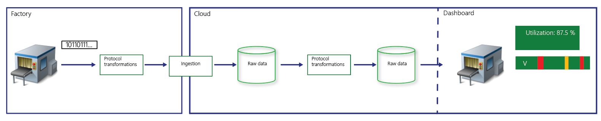
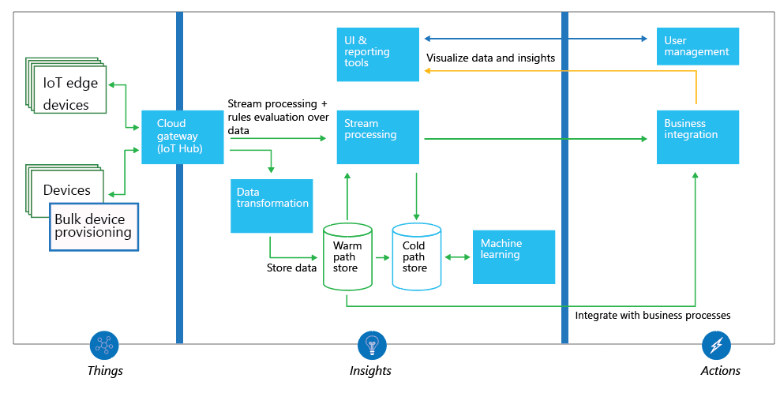
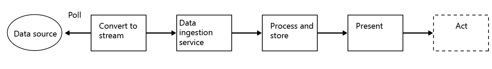
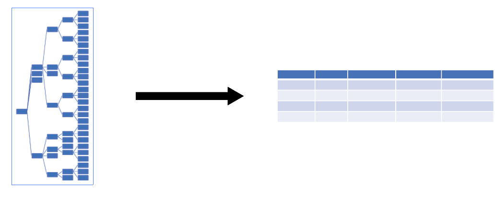
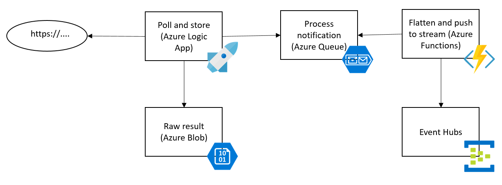
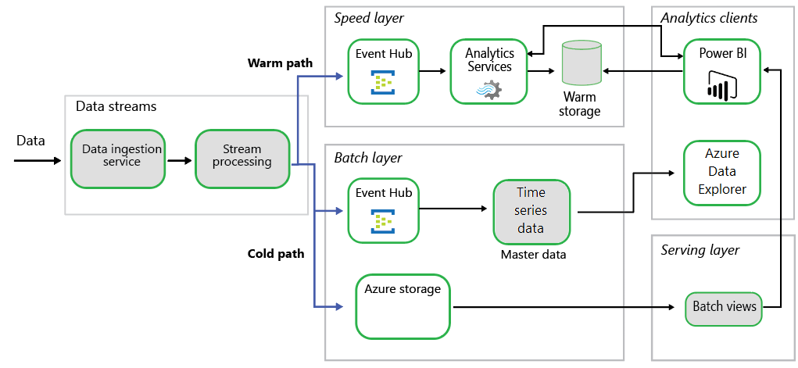
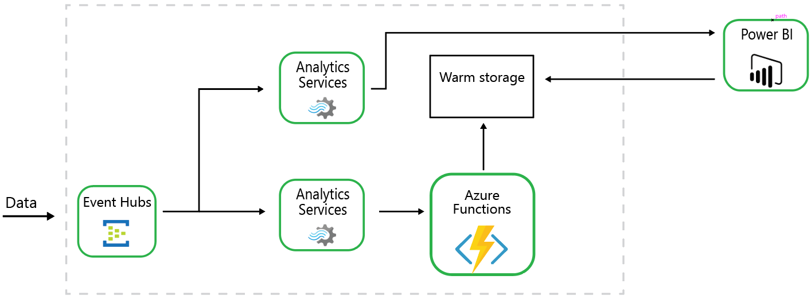
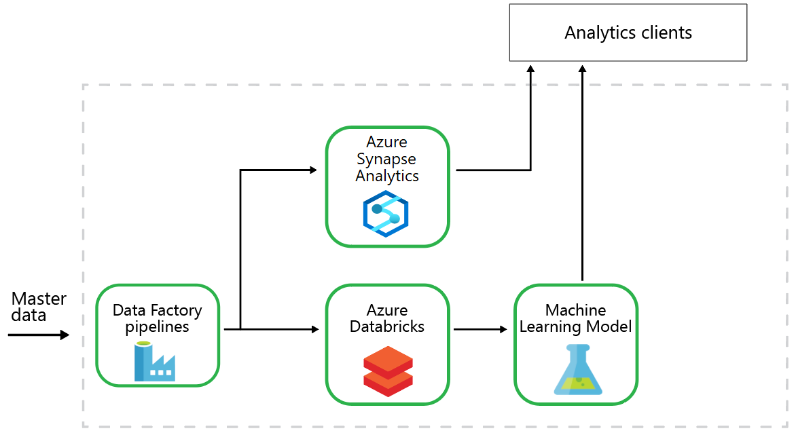

---
# required metadata
title: Extract actionable insights from IoT data
description: Extract insights from IoT data with Azure services.
author: ercenk
ms.author: ercenk
manager: gmarchet
ms.service: industry
ms.topic: article
ms.date: 11/28/2019
---
# Extract actionable insights from IoT data

If you are responsible for the machines on a factory floor, you are already aware that the Internet of Things (IoT) is the next step in improving your processes and results. Having sensors on machines, or the factory floor, is the first step. The next step is to use the data—which is the object of this document. This guide provides a technical overview of the components needed to extract actionable insights from IoT data analytics.

IoT analytics solutions are about transforming raw IoT data coming from a set of devices into a form that is better suited for analytics. Once the data is in an analyzable form we can actually perform analytics. Some examples of analytics include:

- simple visualizations of the telemetry data, for example, a bar chart showing temperatures over time
- calculation of KPIs, for example, Overall Equipment Effectiveness (OEE)
- predictive analytics powered by machine learning models

These analytics, in turn, provide insights that inform actions. Actions may range from sending a simple command to a machine, to tweaking operational parameters, to performing an action on another software system, to implementing company-wide operational improvement programs.

The figure below shows a chain of actions that occur between a factory machine and the end result, which is a dashboard representation of “utilization,” showing a graph and the label “87.5%.”

For the purposes of illustration, we will use the calculation of a simple KPI: machine utilization. *Machine utilization* is the percentage of time the machine is actually *producing* parts. For example, if there are 8 hours in a shift, and the machine is producing parts for 7 of those hours, then the machine utilization for that shift is 87.5% (7/8 x 100).

## Approach

IoT applications have three components: **things** (or devices), sending data or events that are used to generate **insights**, which are used to generate **actions** to help improve a business or process.

The equipment in a manufacturing plant (things) sends various types of data as it operates. An example is a milling machine sending feed rate and temperature data; this is used to evaluate whether the machine is running or not—an insight—which is used to optimize the plant—an action. We will go through the steps to extract the data, visualize it in a dashboard, extract new insights, and take further actions.

Microsoft has published a high level reference architecture for IoT applications that walks through the various subsystems and the recommended approaches for those subsystems.
An IoT application consists of the following subsystems:

1. Devices, or on-premises edge gateways, which are a specific kind of device that can securely register message sources (devices) with the cloud. The edge gateway may also transform messages from a native protocol to another format (such as JSON).
2. A cloud gateway service, or hub (such as [Azure IoT Hub](/azure/iot-hub/?WT.mc_id=iotinsightssoln-docs-ercenk) or [Azure Event Hubs](/azure/event-hubs/event-hubs-about?WT.mc_id=iotinsightssoln-docs-ercenk)), to securely ingest data and provide device management capabilities. 
3. Stream processors that consume streaming data. The processors may also integrate with business processes and place the data into storage.
4. A user interface, in the form of a dashboard, to visualize IoT data and facilitate device management.

In this article, we focus on the process of extracting insights. These are the major steps:

1. Access the data and process it into a data stream.
2. Process and store the data.
3. Visualize or present the data. 

The figure below is a diagram that shows the flow of data, from data source, to convert, to ingestion, to process and store, to presentation, and finally action.

## Converting the data to a stream

IoT data is time-series data: values from “things” that can be more meaningful over a time span. Equipment on a plant floor operates through time, and events occur during that time. If the data on the plant floor is not sent to a data ingestion service, such as [Azure IoT Hub](/azure/iot-hub/?WT.mc_id=iotinsightssoln-docs-ercenk), we must poll for the data periodically from its store—for  example, a Manufacturing Execution System (MES), or an HTTP endpoint), and send the data to an ingestion service.  
To convert data to a stream, we usually:

1. Access the data source.
2. Transform and enrich the data.
3. Post the data to an endpoint that can ingest streaming data.

We don’t cover the access to the data source in detail here, since access depends on where the data resides,  and the variations are too numerous.

## Transforming and enriching the data

Raw data must usually undergo transformation operations to standardize it and prepare it for ingestion.  The specific transformations will vary depending on the type of analytics used.  Some common examples of data transformations are time-series data where measurements may be missing and need to be inputted, or where the time scales across different machines needs to be rationalized.  We would like to have data records that are timestamped (if the source contains it) and in name-value pairs. Commonly, the data comes in a hierarchical format, and must be transformed into a flat structure.

The figure below shows a hierarchical data structure with a jagged profile, converted to a standardized column and row format (a block).

Usually, the data is not accessible from the internet. A common pattern is to use an edge gateway to push data from the plant floor to the ingestion point. [Azure IoT Edge](/azure/iot-edge?WT.mc_id=iotinsightssoln-docs-ercenk) is a service that builds on top of IoT Hub. An IoT Edge device can act as a gateway to cover three [patterns](/azure/iot-edge/iot-edge-as-gateway?WT.mc_id=iotinsightssoln-docs-ercenk): transparent gateway, protocol translation, and identity translation.

If the data is available externally and is accessible from internet, several Azure services can be used to access, transform, and enrich the data. Among those options are:

- Custom code deployed in various Azure compute services, such as [App Service](/azure/app-service/?WT.mc_id=iotinsightssoln-docs-ercenk),  [Azure Kubernetes Service](/azure/aks/?WT.mc_id=iotinsightssoln-docs-ercenk) (AKS), [Container Instances](/azure/container-instances/?WT.mc_id=iotinsightssoln-docs-ercenk), or [Service Fabric](/azure/service-fabric/service-fabric-overview?WT.mc_id=iotinsightssoln-docs-ercenk).
- [Azure Logic Apps](/azure/logic-apps/?WT.mc_id=iotinsightssoln-docs-ercenk)
- [Pipelines and activities in Azure Data Factory](/azure/data-factory/copy-activity-overview/?WT.mc_id=iotinsightssoln-docs-ercenk)
- [Azure Functions](/azure/azure-functions/functions-overview)
- [BizTalk Services](https://azure.microsoft.com/services/biztalk-services/)

Each of the services above have their own benefits and costs, depending on the scenario. For example, Logic Apps provide a means for [transforming XML documents](/azure/logic-apps/logic-apps-enterprise-integration-transform?WT.mc_id=iotinsightssoln-docs-ercenk). However, the data can be an overly complex XML document, so it may not be practical to develop a large XSLT script to transform the data. In this case, one might develop a hybrid solution using multiple microservices from different Azure services. For example, a microservice, implemented in Azure Logic Apps, can poll an HTTP endpoint, store the raw result temporarily, and notify another microservice. The other microservice—which transforms the message—can be custom code hosted on [Azure Functions Host](https://github.com/Azure/azure-functions-host).  

Alternatively, you may opt for a workflow orchestrated by Azure Data Factory where a sequence of activities performs the transformations. For more details on the type of activities available, see [Pipelines and activities in Azure Data Factory](/azure/data-factory/concepts-pipelines-activities).
The messages can be timestamped at reception, or they may contain a timestamp to let us reconstruct the time series of several values measured. Hence, negligible ingestion latency and high throughput are fundamental to guarantee the integrity of information and timeliness of eventual responses. To minimize the latency, we normalize the time stamps as close as possible to the plant.

## Ingesting the data stream

To analyze the data as a stream, we can do queries on the data based on time windows to identify patterns and relationships. There are various services on the Azure platform that can ingest data at high throughput.
Choosing between the services below depends on the needs of the project, such as device management, protocol support, scalability, team’s preference of programming model etc. For example, team may have a preference to use Kafka because of their experience, or the need to have a Kafka broker for the solution. Or, for another case, the project may need the data ingestion system to take advantage of [IoT Hub Device Provisioning Service’s TPM Key Attestation](/azure/iot-dps/?WT.mc_id=iotinsightssoln-docs-ercenk) to secure the access of the devices to the ingestion point.

- [Azure IoT Hub](/azure/iot-hub/?WT.mc_id=iotinsightssoln-docs-ercenk) is a bi-directional communication hub between IoT applications and the devices. It is a scalable service that enables full-featured IoT solutions by providing secure communications, message routing, integration with other Azure services, and management features to control and configure the devices.

- [Azure Event Hubs](/azure/event-hubs/event-hubs-about?WT.mc_id=iotinsightssoln-docs-ercenk) is a high-scale ingestion-only service for collecting telemetry data from concurrent sources at exceedingly high throughput rates.
- [Apache Kafka on HDInsight](/azure/hdinsight/kafka/apache-kafka-introduction?WT.mc_id=iotinsightssoln-docs-ercenk) is a managed service that hosts [Apache Kafka](https://kafka.apache.org/). Apache Kafka is an open-source distributed streaming platform that also provides message broker functionality. The hosted service has a Service Level Agreement (SLA) of 99.9% on Kafka uptime.

## Processing and storing the data

The IoT applications introduce challenges, as they are event-driven systems, that also need to keep and operate on historical data. The incoming data is an append type of data and can potentially grow large. There is a need to keep data for longer periods, primarily for these reasons: archive, batch analytics, and to build machine learning (ML) models. On the other hand, the event stream is crucial for analyzing in near real-time to detect anomalies, recognize patterns over rolling time windows, or triggering alerts, if values go over or below a threshold.
Microsoft’s Azure IoT Reference Architecture presents a recommended data flow for device to cloud messages and events in an IoT solution using Lambda architecture. The Lambda architecture enables the analysis of both near real-time, streaming data, as well as archived data, which makes it the best option for processing of the incoming data.

## Lambda architecture

The Lambda architecture addresses this problem by creating two paths for data flow. All data coming into the system goes through these two paths:

- A batch layer (cold path) stores all the incoming data in its raw form and performs batch processing on the data. The result of this processing is stored as a batch view. It is a slow processing pipeline executing complex analysis, for example combining data from multiple sources and over a longer period (hours, days, or longer), and generating new information such as reports, machine learning models, etcetera.
- A speed layer (warm path) analyzes data in real time. This layer is designed for low latency, at the expense of accuracy. It is a faster processing pipeline that archives and displays incoming messages, and analyzes these records generating short term critical information and actions such as alarms.
- The batch layer feeds into a “serving layer,” which responds to queries. The batch layer indexes the batch view for efficient querying. The speed layer updates the serving layer with incremental updates based on the most recent data.

The following image shows five blocks that represent stages of transformation. The first block is the data stream, which feeds both the speed layer and batch layer in parallel. Both layers feed the serving layer, The speed layer and the serving layer both feed the analytics client.

 Azure platform provides various services that can be used for implementing the architecture. The following diagram shows how those services can be mapped to implement it. The figure shows the five stages of transformation, with each stage containing relevant Azure technologies. The darker colored boxes represent the availability of multiple options to perform those tasks.

The options for the data ingestion service on the speed layer are covered in the previous section, “Ingesting the data stream.”

[Apache Kafka on HDInsight](/azure/hdinsight/kafka/apache-kafka-introduction?WT.mc_id=iotinsightssoln-docs-ercenk) can be a service option to implement the data stream both for the data ingestion service and the stream processing.

Use [Azure Stream Analytics](/azure/stream-analytics?WT.mc_id=iotinsightssoln-docs-ercenk) (ASA) if you are using Event Hubs for the data ingestion service. Azure Stream Analytics is an event-processing engine that allows you to examine high volumes of data streaming from devices. Incoming data can originate from devices, sensors, web sites, social media feeds, applications, and more. It also supports extracting information from data streams, identifying patterns, and relationships.

Stream Analytics queries start with a source of streaming data that is ingested into Azure Event Hub, Azure IoT Hub or from a data store like Azure Blob Storage. To examine a stream, create a Stream Analytics job that specifies the input source that streams data. The job also specifies a transformation query that defines how to look for data, patterns, or relationships. The transformation query leverages a SQL-like query language that is used to filter, sort, aggregate, and join streaming data over a period of time.

## Warm Path

The example scenario for this document is a machine utilization KPI (introduced at the beginning of the guide). We could opt for a naive interpretation of the data and assume that if the machine is sending data then it is being utilized. However, the machine could be sending data while not really producing anything (for example, it could be idle, or being maintained). This highlights a very common challenge when trying to extract insight out of IoT data: the data you are looking for is not available in the data you are getting. So, in our example, we are not getting data clearly and unequivocally telling us whether or not the machine is producing.  Therefore, we need to infer utilization by combining the data we are getting with other sources of data, and applying rules to determine of whether or not the machine is producing. In addition, these rules may change from company to company since they may have different interpretations of what “producing” is. The warm path is all about analyzing as the data flows through the system. We process this stream in near-real time, save it to the warm storage, and push it to the analytics clients.

Azure Event Hubs is a big data streaming platform and event ingestion service, capable of receiving and processing millions of events per second. Event Hubs can process and store events, data, or telemetry produced by distributed software and devices. Data sent to an event hub can be transformed and stored using any real-time analytics provider or batching/storage adapters. Event Hubs makes the perfect match for the first step in the warm path for the data flow.

The figure below shows the speed layer stage. It consists of an event hub, a Stream Analytics instance, and a data store for warm storage.

  
The Azure platform provides many options for processing the events on an Event Hub, however, we recommend Stream Analytics. Stream Analytics can also push data to the Power BI service to visualize streamed data.

Stream Analytics can execute complex analysis at scale, for example, tumbling/sliding/hopping windows, stream aggregations, and external data source joins. For even more complex processing, performance can be extended by cascading multiple instances of Event Hubs, Stream Analytics jobs, and Azure functions, as shown in the following figure.

  
Warm storage can be implemented with various services on the Azure platform, such as Azure SQL Database. We recommend [Azure Cosmos DB](/azure/cosmos-db/introduction?WT.mc_id=iotinsightssoln-docs-ercenk). It is Microsoft's globally distributed, multi-model database. It is best for datasets that can benefit from flexible, schema-agnostic, automatic indexing, and rich query interfaces. Cosmos DB allows multi-region, read/write, and supports manual failover in addition to automatic failover. In addition, Cosmos DB allows the user to set a time-to-live (TTL) on their data, which makes expiring old data automatic. We recommend using the feature to control the time the records stay in the database, thus controlling the database size.

Pricing for Cosmos DB is based on storage used and [request units](/azure/cosmos-db/request-units) provisioned. Cosmos DB is best for scenarios that do not require queries involving aggregation over large sets of data, as those queries require more request units than a basic query such as the last event for a device.  

[Microsoft Power BI](/power-bi/power-bi-overview?WT.mc_id=iotinsightssoln-docs-ercenk) is a collection of software services, apps, and connectors that work together to turn your unrelated sources of data into coherent, visually immersive, and interactive insights. Power BI helps you stay up to date with the information that matters to you. You can utilize the [real-time streaming in Power BI](/power-bi/service-real-time-streaming?WT.mc_id=iotinsightssoln-docs-ercenk) to push data to the service. This real time stream can act as a real time streaming data source for various visuals on the Power BI dashboard.

## Cold Path

The warm path is where the stream processing occurs to discover patterns over time. However we also would like to calculate the utilization over a period of time in the past, with different pivots, and aggregations, such as machine, line, plant, produced part etcetera. We  want to merge those results with the warm path results to present a unified view to the user. The cold path includes the batch layer and the serving layers. The combination provides a long-term view of the system.

The cold path contains the long-term data store for the solution. It also contains the batch layer, which creates pre-calculated aggregate views to provide fast query responses over long periods of time. The technology options available for this layer on Azure platform is quite diverse.

  
[Azure Time Series Insights](/azure/time-series-insights/?WT.mc_id=iotinsightssoln-docs-ercenk) (TSI) is an analytics, storage and visualization service for time series data. It provides SQL-like filtering and aggregation, alleviating the need for user-defined functions. TSI can receive data from Event Hubs, IoT Hub or Azure Blob storage. All data in TSI is stored in-memory and in SSDs, which ensures that the data is always ready for interactive analytics. For example, a typical aggregation over tens of millions of events returns on the order of milliseconds. It also provides visualizations such as overlays of different time series, dashboard comparisons, accessible tabular views, and heat maps. Key features of TSI include:

- Built-in visualization services for solutions that do not need to report on data immediately. TSI has an approximate latency for querying data records of 30-60 seconds. 
- The ability to query large sets of data.
- Any number of users can conduct an unlimited number of queries for no extra cost.

TSI has a maximum retention of 400 days and a maximum storage limit of 3 TB. If you require a longer retention span, or more capacity, use a cold storage database (swapping data into TSI for querying as needed).

Cold storage for an IoT application is certain to grow large over time. This is where data is stored for the long term and aggregated at the batch views for analytics. Data for ML models is also stored here. We recommend [Azure Storage](/azure/storage/?WT.mc_id=iotinsightssoln-docs-ercenk) for the cold storage. It is a Microsoft-managed service providing cloud storage that is highly available, secure, durable, scalable, and redundant. Azure Storage includes Azure Blobs (objects), Azure Data Lake Storage Gen2, Azure Files, Azure Queues, and Azure Tables. The cold storage can be either Blobs, Data Lake Storage Gen2, or Azure Tables., or a combination of those.

[Azure Table storage](/azure/cosmos-db/table-storage-overview?WT.mc_id=iotinsightssoln-docs-ercenk) is a service that stores structured NoSQL data in the cloud, providing a key/attribute store with a schemaless design. Because Table Storage is schemaless, it is easy to adapt your data as the needs of your application evolve. Access to Table Storage data is fast and cost-effective for many types of applications and is typically lower in cost than traditional SQL for similar volumes of data. We use one table for samples, and one table for events that are received from data streams. The design of the partition key is an especially important concept; both tables use the hour of the timestamp on the event or the sample. For more information, see [Understanding the Table Service Data Model](/rest/api/storageservices/Understanding-the-Table-Service-Data-Model?WT.mc_id=iotinsightssoln-docs-ercenk).

To store massive amounts of unstructured data, such as JSON, or XML documents containing the unprocessed data received by the IoT application, [Blob storage](/azure/storage/blobs/storage-blobs-introduction?WT.mc_id=iotinsightssoln-docs-ercenk), [Azure Files](/azure/storage/files/storage-files-introduction?WT.mc_id=iotinsightssoln-docs-ercenk), or [Azure Data Lake Storage Gen2](/azure/storage/data-lake-storage/introduction?WT.mc_id=iotinsightssoln-docs-ercenk) are the best options.

Azure Blob storage can be accessed from anywhere in the world via HTTP or HTTPS securely. Access to the blob storage must be authorized using one of the [authorization mechanisms](/azure/storage/common/storage-auth?toc=%2fazure%2fstorage%2fblobs%2ftoc.json?WT.mc_id=iotinsightssoln-docs-ercenk) used by the service. The service provides multiple replication [options](/azure/storage/common/storage-redundancy?toc=%2fazure%2fstorage%2fblobs%2ftoc.json?WT.mc_id=iotinsightssoln-docs-ercenk): locally redundant, zone-redundant, geo-redundant and read access geo-redundant. There are also three [access tiers](/azure/storage/blobs/storage-blob-storage-tiers?WT.mc_id=iotinsightssoln-docs-ercenk) that allows the most cost-effective solutions.

Once the data is in cold storage, batch views on the serving layer of the Lambda architecture need to be created. [Azure Data Factory](/azure/data-factory/introduction?WT.mc_id=iotinsightssoln-docs-ercenk) is a great solution for creating the batch views on the serving layer. It is a cloud-based managed data integration service that allows you to create data-driven workflows in the cloud for orchestrating and automating data movement and data transformation. Using Azure Data Factory, you can create and schedule [data-driven workflows](/azure/data-factory/concepts-pipelines-activities?WT.mc_id=iotinsightssoln-docs-ercenk) (called pipelines) that can ingest data from disparate data stores. It can process and transform the data by using services such as [Azure HDInsight Hadoop](/azure/hdinsight/?WT.mc_id=iotinsightssoln-docs-ercenk), [Spark](/azure/hdinsight/?WT.mc_id=iotinsightssoln-docs-ercenk), and [Azure Databricks](/azure/azure-databricks/?WT.mc_id=iotinsightssoln-docs-ercenk). This allows you to build machine learning models and consume them with the analytics clients.

For example, as shown in the following figure, Data Factory pipelines read data from the master data store. One pipeline summarizes and aggregates the data to populate an instance of Azure Data Warehouse. The Data Factory pipeline also and contains [Azure Databricks notebook activities](/azure/data-factory/transform-data-using-databricks-notebook?WT.mc_id=iotinsightssoln-docs-ercenk) that are used to build ML models.

  
[Azure SQL Database](/azure/sql-database/?WT.mc_id=iotinsightssoln-docs-ercenk) or [Azure SQL Data Warehouse](/azure/sql-data-warehouse/sql-data-warehouse-overview-what-is?WT.mc_id=iotinsightssoln-docs-ercenk) are the best options for hosting the batch views. These services can serve pre-calculated and aggregated views on the master data. 

Azure SQL Database (SQL DB) is a relational database-as-a-service based on the latest version of Microsoft SQL Server Database Engine. SQL DB is a high-performance, reliable, and secure database you can use to build data-driven applications and websites. As an Azure service,  there is no need to manage its infrastructure. As the data volume increases, the solution can start using techniques to aggregate and store data for speeding up the queries. Pre-calculating aggregations is a well-known technique, especially for append-only data. It is also useful for managing costs.

Azure SQL Data Warehouse provides many additional features that can be useful in some scenarios. It is a cloud-based enterprise data warehouse that leverages massively parallel processing  to quickly run complex queries across petabytes of data. If you need to keep petabytes of data, and want to have queries running fast, we recommend SQL Data Warehouse.

## Visualizing the data

At this layer, we want to merge the two data pipelines (warm and cold paths) to present a cohesive view of the data. In this example, we used multiple metrics to deduce the utilization of the machine on both warm and cold paths. In the analytics stage, we provide visualizations that combine the data from those paths.

[Microsoft Power BI](/power-bi/?WT.mc_id=iotinsightssoln-docs-ercenk) and [Azure Time Series Insights](/azure/time-series-insights/?WT.mc_id=iotinsightssoln-docs-ercenk) provide data visualizations out-of-the-box. Power BI is business analytics solution that lets you visualize your data and share insights across your organization, or embed them in your app or website. [Power BI Desktop](https://powerbi.microsoft.com/desktop/?WT.mc_id=iotinsightssoln-docs-ercenk) is a free and powerful tool for modelling reports and their underlying data sources.  The applications embedding Power BI visualizations use the reports authored by the desktop tool and hosted on the Power BI Service.

Time Series Insights has a data explorer to visualize and query data as well as REST query APIs. Further, it exposes a JavaScript controls library that lets you embed TSI-powered charts into custom applications. The following is a basic heatmap view on the TSI for the incoming data that approximates the utilization of the machines on the shop floor, by simply looking at the number of samples observed.

If you require a browser-based user interface that aggregates data from multiple sources, both TSI and Power BI services allow embedding visualization controls. Both also provide REST APIs ([Power BI Rest API](/rest/api/power-bi/?WT.mc_id=iotinsightssoln-docs-ercenk), [TSI REST API](/rest/api/time-series-insights/time-series-insights-reference-queryapi?WT.mc_id=iotinsightssoln-docs-ercenk)) and JavaScript SDKs ([Power BI JavaScript SDK](https://github.com/Microsoft/PowerBI-JavaScript?WT.mc_id=iotinsightssoln-docs-ercenk), [TSI JavaScript SDK](/azure/time-series-insights/tutorial-explore-js-client-lib?WT.mc_id=iotinsightssoln-docs-ercenk)) that allows extensive customizations.

## Next Steps

We covered a lot of concepts and would like to give the reader a set of starting points to learn more and apply the techniques to their own requirements. Here are some tutorials we believe can be useful for this purpose.

- Converting the data to a stream
  - [Creating a Logic App running on a schedule](/azure/logic-apps/tutorial-build-schedule-recurring-logic-app-workflow?WT.mc_id=iotinsightssoln-docs-ercenk)
  - [Code examples for data operations on Logic Apps](/azure/logic-apps/logic-apps-data-operations-code-samples?WT.mc_id=iotinsightssoln-docs-ercenk)
  - [Running Azure Functions in a container](/azure/azure-functions/functions-create-function-linux-custom-image?WT.mc_id=iotinsightssoln-docs-ercenk) to host your Azure Function is covered in multiple places. Creating a function on Linux using a custom image, running functions on any platform, Docker images for Azure Functions Runtime
  - [Using various bindings on Azure Functions](/azure/azure-functions/functions-triggers-bindings?WT.mc_id=iotinsightssoln-docs-ercenk)

- Hot path
  - End-to-end tutorials demonstrating the use of Event Hubs, Azure Stream Analytics and Power BI. See [Tutorial: Visualize data anomalies](/azure/event-hubs/event-hubs-tutorial-visualize-anomalies?WT.mc_id=iotinsightssoln-docs-ercenk) in real-time events sent to Azure Event Hubs, and [Create a Stream Analytics job to analyze phone call data](/azure/stream-analytics/stream-analytics-manage-job?WT.mc_id=iotinsightssoln-docs-ercenk) and visualize results in a Power BI dashboard.
  -[Using Azure Cosmos DB with .NET](/azure/cosmos-db/sql-api-get-started?WT.mc_id=iotinsightssoln-docs-ercenk)
- Cold path
  - [Transforming data in the cloud by using a Spark activity](/azure/data-factory/tutorial-transform-data-spark-portal?WT.mc_id=iotinsightssoln-docs-ercenk) in Azure Data Factory
  - [Tutorial: Create an Azure Time Series Insights environment](/azure/time-series-insights/tutorial-create-populate-tsi-environment?WT.mc_id=iotinsightssoln-docs-ercenk)
- Analysis clients
  - [Learning Power BI](/power-bi/guided-learning/?WT.mc_id=iotinsightssoln-docs-ercenk)
  - [Creating a Time Series Insights SPA](/azure/time-series-insights/tutorial-create-tsi-sample-spa?WT.mc_id=iotinsightssoln-docs-ercenk)
  - [Exploring Time Series Insights Java Script client library](/azure/time-series-insights/tutorial-explore-js-client-lib?WT.mc_id=iotinsightssoln-docs-ercenk)
  - See the [TSI demo](https://insights.timeseries.azure.com/demo) and [Power BI demo](https://microsoft.github.io/PowerBI-JavaScript/demo/v2-demo/index.html).

## Appendix: Pillars of software quality (PoSQ)

A successful cloud application is built on these [pillars of software quality](/azure/architecture/guide/pillars?WT.mc_id=iotinsightssoln-docs-ercenk): Scalability, availability, resiliency, management, and security. In this section, we will briefly cover those pillars for each component as necessary. We don’t cover availability, resiliency, management and DevOps, since they are mostly addressed at the implementation level, and we want to mention Azure platform provides extensive means for achieving those through APIs, tools, diagnostics and logging. In addition to the mentioned pillars, we will also mention cost efficiency.

Let’s quickly review those pillars:

- **Scalability** is the ability of a system to handle increased load. There are two main ways that an application can scale. Vertical scaling (scaling up) means increasing the capacity of a resource, for example by using a larger VM size. Horizontal scaling (scaling out) is adding new instances of a resource, such as VMs or database replicas. The scalability pillar also includes performance and the ability to handle load.
- **Availability** is the proportion of time that the system is functional and working. It is usually measured as a percentage of uptime. Application errors, infrastructure problems, and system load can all reduce availability. The service level agreements for Microsoft Azure services are published and available at [Service Level Agreements](https://azure.microsoft.com/support/legal/sla/?WT.mc_id=iotinsightssoln-docs-ercenk). Availability is the only meaningful metric at the system level. Separate components contribute to the overall availability of the system.
- **Resiliency** is the ability of the system to recover from failures and continue to function. The goal of resiliency is to return the application to a fully functioning state after a failure occurs. Resiliency is closely related to availability.
- **Management and DevOps**. This pillar covers the operations processes that keep an application running in production. Deployments must be reliable and predictable. They should be automated to reduce the chance of human error. They should be a fast and routine process, so they do not slow down the release of new features or bug fixes. Equally important, you must be able to quickly roll back or roll forward if an update has problems.
- **Security** should be a major focus point throughout the entire lifecycle of a solution, from design and implementation to deployment and operations. Identity management, protecting your infrastructure, application security, authorization, data sovereignty and encryption, auditing are all broad areas that need to be addressed.

## PoSQ: Converting the data to a stream

**Scalability**: We can approach the scalability from two perspectives. First, from the perspective of the component, second, from the perspective of the system that provides the source data.

Each Azure service provides options for vertical and horizontal scaling. We strongly recommend considering the scalability requirements while designing the solution.

As for the systems providing the source data, we need to be careful about not to overwhelm the system, and basically causing a denial of service (DoS) attack on the system, by querying it too frequently. If you are polling the system, you should keep in mind that adjusting the polling frequency has two effects, the granularity of the data (the more often you query, the closer it gets to real-time) and the load created on the remote system.

**Security**: If the remote system is accessed by symmetrical or asymmetrical keys, we recommend the secrets to be kept in [Azure Key Vault](/azure/key-vault/?WT.mc_id=iotinsightssoln-docs-ercenk).

## PoSQ: Warm path

**Scalability**: If Azure Event Hubs is the used in the ingestion subsystem, the main scalability mechanism is [throughput units](/azure/event-hubs/event-hubs-features#throughput-units?WT.mc_id=iotinsightssoln-docs-ercenk). Event Hubs provide the capability of setting the throughput units statically, or through the [auto-inflate feature](/azure/event-hubs/event-hubs-auto-inflate?WT.mc_id=iotinsightssoln-docs-ercenk).

[Streaming Units](/azure/stream-analytics/stream-analytics-streaming-unit-consumption?WT.mc_id=iotinsightssoln-docs-ercenk) (SUs) in Stream Analytics represent the computing resources that are allocated to execute a job. The higher the number of SUs, the more CPU and memory resources are allocated for your job. This capacity lets you focus on the query logic and abstracts the need to manage the hardware to run your Stream Analytics job in a timely manner. In addition to SUs, making efficient use of them through [properly parallelizing the queries](/azure/stream-analytics/stream-analytics-scale-jobs?WT.mc_id=iotinsightssoln-docs-ercenk) is crucial.

Azure Cosmos DB implementations need to be provisioned with the right throughput parameters and proper partitioning design. Provisioning the throughput is available at the container or the data base level, and expressed in [Request Units](/azure/cosmos-db/request-units?WT.mc_id=iotinsightssoln-docs-ercenk) (RUs). Cosmos DB provides a tool for estimating the RUs. In addition to provisioning the throughput, [efficiently partitioning the database](/azure/cosmos-db/partition-data?WT.mc_id=iotinsightssoln-docs-ercenk) is key.

**Security**: Access to Azure Event Hubs by clients is through a combination of Shared Access Signature (SAS) tokens and event publishers for client authentication. The security for back-end applications follow the same concepts as the Service Bus topics. A thorough description of the Event Hubs security model is in the [Event Hubs authentication and security model overview](/azure/event-hubs/event-hubs-authentication-and-security-model-overview?WT.mc_id=iotinsightssoln-docs-ercenk).

Securing the Cosmos DB databases provides controlled access to the data, and encryption at rest. For more information, see [Azure Cosmos DB database security](/azure/cosmos-db/database-security?WT.mc_id=iotinsightssoln-docs-ercenk).

**Cost Efficiency**: The pricing of Event Hubs is a function of the SKU (standard or premium), and the millions of events received, plus throughput units. The optimum combination can be achieved by looking at the data ingest rate that is dictated by the incoming messages.

When using Cosmos DB, we recommend observing the most optimum use of the store through the RU utilization. Cosmos DB also has a feature for controlling data retention, as we stated earlier, we recommend using the feature to control the time the records stay in the database, thus controlling the database size.

## PoSQ: Cold path

**Scalability**: Azure Time Series Insights (TSI) is scaled with a metric named as “capacity” which is a multiplier applied to the ingress rate, storage capacity and the cost associated with the SKU. 

Azure Time Series Insights has multiple SKUs that also have direct effect on its vertical scale. See the document [Plan your Azure Time Series Insights environment](/azure/time-series-insights/time-series-insights-environment-planning?WT.mc_id=iotinsightssoln-docs-ercenk) for details on scale. Like many other Azure services, TSI is also subject to throttling to avoid the “noisy neighbor” problem. A noisy neighbor is an application on a shared environment /azure/sql-database/sql-database-service-tiers-vcore?WT.mc_id=iotinsightssoln-docs-ercenk
that monopolizes the resources and starves the other users. Please see the [TSI documentation](/azure/time-series-insights/time-series-insights-environment-mitigate-latency?WT.mc_id=iotinsightssoln-docs-ercenk) for managing the throttling. 

Scalability targets of storage accounts are documented in [Azure Storage Scalability and Performance Targets](/azure/storage/common/storage-scalability-targets?WT.mc_id=iotinsightssoln-docs-ercenk). A common technique for storing data beyond the capacity of a single storage account is partitioning across multiple storage accounts.

Azure SQL Database has many options to manage scalability, both vertically and horizontally, depending on the purchasing model ([DTU based](/azure/sql-database/sql-database-service-tiers-dtu?WT.mc_id=iotinsightssoln-docs-ercenk) and vCore based). We recommend further research to find the best option for a future solution using the [SQL Database documentation](/azure/sql-database/sql-database-scale-resources?WT.mc_id=iotinsightssoln-docs-ercenk) on the topic.

**Security**: TSI environments provide [access policies](/azure/time-series-insights/time-series-insights-data-access?WT.mc_id=iotinsightssoln-docs-ercenk) for management access and data access independent of each other. There is no direct way to add data to a TSI environment other than the defined data sources. Management access policies grant permissions related to the configuration of the environment. Data access policies grant permissions to issue data queries, manipulate reference data in the environment, and share saved queries and perspectives associated with the environment.

Azure Data Factory service provides multiple methods for securing data store credentials, either in its managed store, or in Azure Key Vault. In-transit data encryption depends on the data store’s transport (e.g. HTTPS or TLS). At-rest data encryption also depends on the data stores. See [Security considerations for data movement in Azure Data Factory](/azure/data-factory/data-movement-security-considerations?WT.mc_id=iotinsightssoln-docs-ercenk) for further details.

SQL Database provides an extensive set of security features for data access, monitoring and auditing as well as encrypting data at rest. For details, see [Security Center for SQL Server Database Engine and Azure SQL Database](/sql/relational-databases/security/security-center-for-sql-server-database-engine-and-azure-sql-database?WT.mc_id=iotinsightssoln-docs-ercenk).

**Cost Efficiency**: At the heart of any analytics solution is the storage. Analytics engines need speed, efficiency, security, and throughput for processing volumes of data in reasonable times. Devising mechanisms to make best of use of the underlying platform, by aggregating and summarizing data, and efficiently using polyglot stores are the means for efficiently managing costs. As Azure is a cloud platform, there are methods to programmatically decommission, recommission, and resize resources. For example, the [Create or Update operation](/rest/api/sql/databases/createorupdate?WT.mc_id=iotinsightssoln-docs-ercenk) provides a way to change the database size of Azure SQL Database.