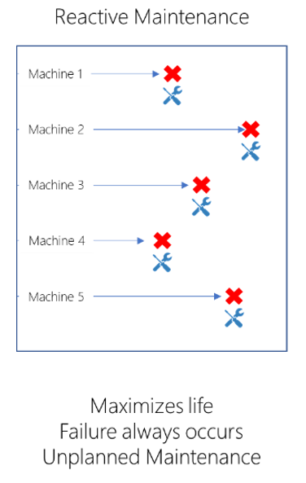
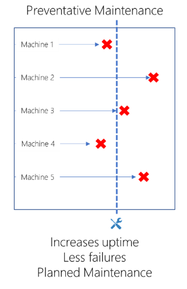
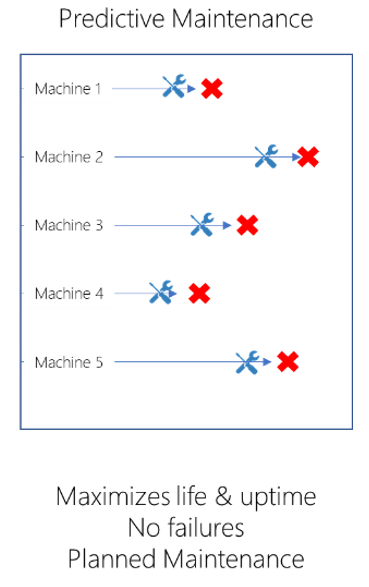

Predictive maintenance (PdM) anticipates maintenance needs to avoid costs associated with unscheduled downtime. By connecting to devices and monitoring the data the devices produce, you can identify patterns that lead to potential problems or failures. You can then use these insights to address issues before they happen. This ability to predict when equipment or assets need maintenance allows you to optimize equipment lifetime and minimize downtime.

PdM extracts insights from the data that's produced by the equipment on the shop floor, and then it acts on these insights. The idea of PdM goes back to the early 1990s and augments regularly scheduled, preventive maintenance. Early on, the lack of availability of sensors generating data, as well as a lack of computational resources for gathering and analyzing the data, made it difficult to implement PdM. Today, advances in the Internet of Things (IoT), cloud computing, data analytics, and Machine Learning (ML) are enabling predictive maintenance to go mainstream.

PdM requires the equipment to provide data from sensors monitoring the equipment as well as other operational data. The PdM system analyzes the data and stores the results. Humans act based on the analysis.

After introducing some background in this article, we discuss how to implement the various pieces of a PdM solution using a combination of on-premises data, Azure machine learning, and usage of the machine learning models. PdM relies heavily on data to make decisions, so we start by looking at data collection. The data must be collected and then used to evaluate what is happening now, as well as used to build up better predictive models in the future. Finally, we explain what an analysis solution looks like, including visualizing the analysis results in a reporting tool like [Power BI](/power-bi).

## Maintenance strategies

Over the history of the manufacturing industry, several maintenance strategies emerged. Reactive maintenance fixes issues after they occur. Preventive maintenance fixes issues before they occur by following a maintenance schedule based on prior failure experience. PdM also fixes issues before they occur but considers the actual utilization of the equipment instead of working from a fixed schedule. Of the three, PdM was the most difficult to achieve because of historical limitations on data collection, processing, and data visualization. Let&#39;s look at each option in a bit more detail.

Reactive maintenance embodies the &quot;if it isn&#39;t broken, don&#39;t fix it&quot; mentality. Service the asset only when it fails. For example, the motor of your 5-axis CNC Machining Center gets serviced only when it stops working. Reactive maintenance maximizes the lifetime of the component that eventually fails. Reactive maintenance also introduces unknown amounts of downtime, unexpected collateral damage to components harmed by the failing component, and other issues.

 

Preventive maintenance requires you to the service the asset at pre-determined intervals. The interval is typically based on the experienced failure frequency history for the asset. These intervals are based on historical performance, simulations, statistical modeling, and so on. The advantage of this strategy is that it increases uptime, results in less failures, and maintenance can be planned. The downside in many cases is the replaced component on the asset may have had some life left. This results in over-maintenance and waste. On the flip side, some parts may still fail before the scheduled maintenance. You probably know preventive maintenance well: after every set hours of operation (or some other metric), stop using the machine and inspect the machine. Replace any parts that are due to be replaced.

 

Predictive maintenance monitors the usage of assets using models to predict when an asset will likely experience a component failure. That component then has its maintenance scheduled for &quot;just-in-time maintenance&quot;. PdM improves on the previous strategies by maximizing both uptime and asset life. Since you service the equipment close to the component maximum lifetimes, you spend less money on replacing working parts. The downside is that the just-in-time nature of PdM is more difficult to execute since it requires a more responsive and flexible Services organization. Back to the motor of the 5-axis CNC Machining, you would schedule its maintenance &quot;gracefully&quot; (in a planned fashion, without disrupting production), if a predictive model predicts that the motor has, say, a 75% probability of failure in the next 24 hours (based on the information coming from sensors in the machine).

 

## Different ways PdM can be offered

A PdM solution can be used by a manufacturer directly, monitoring the data coming from its own manufacturing operations. Other ways exist which mean new business opportunities and revenue streams for other organizations. For example:

- A manufacturer adds value for its customers by offering predictive maintenance services for its products.
- A manufacturer offers its products under a Product-as-a-Service model - where customers &quot;subscribe&quot; to the product instead of purchasing it outright. Under this model, the manufacturer wants to maximize product uptime; the product won't generate revenue when the product isn't working.
- A company provides predictive maintenance products and services for products manufactured by one or more manufacturers.

## Building a predictive maintenance solution

To build a PdM solution, we start with data; ideally data that shows normal operation as well as data that shows what the equipment looked like before, during, and after a failure. The data comes from sensors, notes maintained by equipment operators, run information, environmental data, machine specifications, and so on. Systems of record can include historians, manufacturing execution systems, ERP, and so on. The data is made available for analytics in a variety of ways. [The Team Data Science Process](/azure/machine-learning/team-data-science-process) is illustrated in the following diagram. It's customized for manufacturing and does an excellent job explaining the various concerns one has when building and executing machine learning models.

:::image type="content" source="./images/predictive-maintenance-overview/data-science-diagram-inline.png" alt-text="Diagram presents a summary of the Team Data Science Process." lightbox="./images/predictive-maintenance-overview/data-science-diagram-expanded.png":::

Your first task will be to identify the types of failures you want to predict. With that in mind, you then identify the data sources which have interesting data around that failure type. The pipeline gets the data into the system from your environment. The data scientists will use their favorite machine learning tools to prepare the data. At this point, they're ready to create and train models that can identify diverse types of issues. The models answer questions like:

- _For the asset, what is the probability that a failure will occur within the next X hours?_ Answer: 0-100%
- _What is the remaining useful life of the asset?_ Answer: X hours
- _Is this asset behaving in an unusual way?_ Answer: Yes or No
- _Which asset requires servicing most urgently?_ Answer: Asset X

Once developed, the models may sit on the equipment itself for self-diagnostics, in an edge device somewhere in the manufacturing environment, or in Azure. You'll also continue to send the data from the primary sources into a central store so that you can continue to build and maintain the PdM solution.

The horsepower of Azure allows you to train and test the models on your technology of choice. You may make use of GPUs, FPGAs, CPUs, large memory machines, and so on. One of the great things about Azure is that the platform fully embraces the open-source tools that are used by data scientists (such as R and Python). As the analysis completes, the results can be displayed in other facets of the dashboard or in other reports. These reports may appear in custom tools or you can take advantage of reporting tools like [Power BI](/power-bi) or [Time Series Insights](/azure/time-series-insights).

Whatever your PdM needs, Azure has the tools, the scale, the capabilities you need for building a solid solution.

## Getting started

A lot of equipment found on the factory floor collects data and provides mechanisms to collect the data from the devices. Start collecting that data as soon as possible. As failures occur, have the data scientists analyze the data to create models that can detect future failures. As knowledge builds about failure detection, you'll move to predictive mode where you fix components during planned downtime. The [Predictive Maintenance Modeling Guide](https://gallery.azure.ai/Collection/Predictive-Maintenance-Modelling-Guide-1) provides a solid walkthrough of how to build the Machine Learning pieces of the solution.

To see an example solution, review the solution, guide, and playbook for [PdM in Aerospace](https://github.com/Azure/cortana-intelligence-predictive-maintenance-aerospace). If you need to ramp up on building models, we recommend visiting [AI School](https://aischool.microsoft.com/). The [Introduction to Machine Learning with Azure ML](https://aischool.microsoft.com/learning-paths/4ZYo4wHJVCsUSAKa2EoAk8) course will help provide familiarity with our tools.

## Components

- [Azure Blob Storage](/azure/storage/blobs/storage-blobs-introduction) stores from hundreds to billions of objects in hot, cool, or archive tiers, depending on how often data access is needed.

- [Azure Cosmos DB](/azure/cosmos-db) is a database for extremely low latency and massively scalable applications anywhere in the world, with native support for NoSQL.

- [Azure Data Lake Store](/azure/data-lake-store) includes all the capabilities required to make it easy for developers, data scientists, and analysts to store data of any size, shape, and speed, and do all types of processing and analytics across platforms and languages.

- [Azure Event Hubs](/azure/event-hubs) is a hyper-scale telemetry ingestion service that collects, transforms, and stores millions of events. As a distributed streaming platform, it gives you low latency and configurable time retention, which enables you to ingress massive amounts of telemetry into the cloud and read the data from multiple applications using publish-subscribe semantics.

- [Azure IoT Edge](/azure/iot-edge) is an Internet of Things (IoT) service that builds on top of IoT Hub. This service is meant for customers who want to analyze data on devices, also known as &quot;at the edge&quot;, instead of in the cloud. By moving parts of your workload to the edge, your devices can spend less time sending messages to the cloud and react more quickly to changes in status.

- [Azure IoT Hub](/azure/iot-hub) is a fully managed service that enables reliable and secure bidirectional communications between millions of IoT devices and a solution back end.

- [Azure Machine Learning](/azure/machine-learning) enables computers to learn from data and experiences and to act without being explicitly programmed. Customers can build Artificial Intelligence (AI) applications that intelligently sense, process, and act on information - augmenting human capabilities, increasing speed and efficiency, and helping organizations achieve more.

- [Azure Service Bus](/azure/service-bus) is a brokered communication mechanism. The core components of the Service Bus messaging infrastructure are queues, topics, and subscriptions.

- [Azure SQL Database](/azure/sql-database) is the intelligent, fully managed relational cloud database service that provides the broadest SQL Server engine compatibility, so you can migrate your SQL Server databases without changing your apps.

- [Power BI](/power-bi) is a suite of business analytics tools that deliver insights throughout your organization. Connect to hundreds of data sources, simplify data prep, and drive ad hoc analysis.

- [Time Series Insights](/azure/time-series-insights) is a fully managed analytics, storage, and visualization service for managing IoT-scale time-series data in the cloud.

## Conclusion

PdM requires machines to have some level of instrumentation and connectivity to allow us to build systems that can predict issues and to allow us to act before a failure occurs. PdM augments preventive maintenance schedules by identifying specific components to inspect and repair or replace. Many resources exist to help you get started. Microsoft&#39;s infrastructure can help you build solutions that run on the device, at the edge, and in the cloud. 

To begin, pick out the top 1-3 failures you would like to prevent and begin your discovery process with those items. Then, identify where the data resides that helps identify the failures. Combine that data with the skills you pick up from the [Introduction to Machine Learning with Azure ML](https://aischool.microsoft.com/learning-paths/4ZYo4wHJVCsUSAKa2EoAk8) course to build your PdM models.
