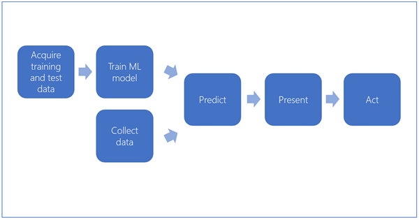
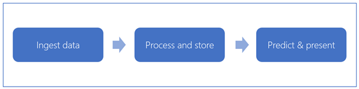
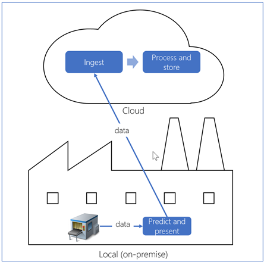
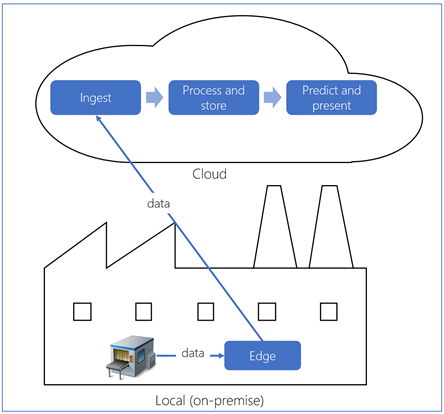
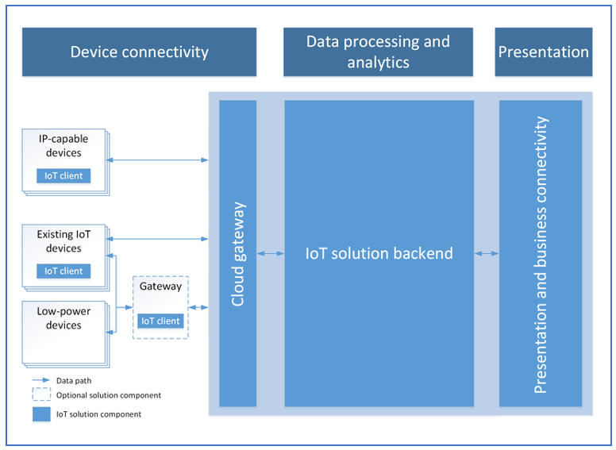
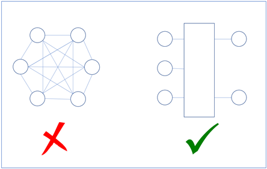
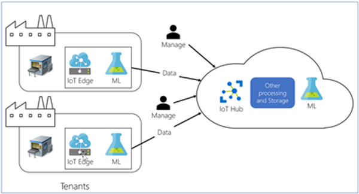

Predictive maintenance uses a combination of sensors, artificial intelligence, and data science to optimize equipment maintenance. Anticipating equipment maintenance needs to minimize maintenance costs and maximize uptime provides significant value to manufacturers.

Data lies at the heart of the solution. The data needs to have adequate failure indicators, as well as other aspects that describe the context. It can come from multiple sources, such as sensors, machine logs, and manufacturing application logs.

This article presents options for building a predictive maintenance solution. It presents different perspectives and references existing materials to get you started. The requirements for a predictive maintenance solution vary by equipment, environment, process, and organization. We give alternative approaches and technologies to guide you in the journey of determining a solution for your needs.

Let’s start with the high-level components of a predictive maintenance solution.

In this breakdown, the following high-level activities occur:

1. Collect training data, including failure data.
1. With this training data, train a Machine Learning (ML) model to predict future asset failures given a set of conditions.
1. Continue collecting data on an ongoing basis.
1. Input the collected data to the ML model, which will predict failure, normally with some level of confidence. (For example, “there's an 85% probability that the machine will fail in the next 24 hours.”)
1. Surface the predicted failure cases.
1. Plan and act on the insights seen in the data.

## Training the ML model

Building an ML model requires sufficient, correct and complete data. In addition, predictive maintenance poses unique challenges, a major one being the availability of failure data. Failures are relatively rare events, particularly in high-capital equipment, such as computer numerical control (CNC) machines, or components of oil refineries. Even if we've collected sensor data over a long period of time, we might not have sufficient failure data. Consider how “failure” is defined. What exactly constitutes a failure? Is it when the device stops working unexpectedly? Is it when the device degrades to a level where it isn't performing at a desired level anymore? Is the failure case a cutting machine being destroyed, because of a component failure caused by metal fatigue, or other indicators that point to a failure, before a catastrophe happens?

## Considering the data needed for ML

Consider, too, are we capturing enough data to record these failures properly? In many cases, sensor data alone may not be enough to identify a failure. Sometimes we may need external data to “flag” a machine’s state as a failure state, or a secondary source of information, such as an operator capturing the failure case through a different system. This data might reside in external systems, such as ERP, manufacturing execution systems (MES), historians, and so on. The data might cross the IT/OT divide that's prevalent in manufacturing firms, which provides a challenge when securing the necessary data.

By nature, predictive maintenance is a dynamic problem and, as such, associated machine learning models need to be continuously refreshed (or re-trained). If done well, predictive maintenance should reduce the instances of failures, which is a good thing, but that results in less failure data. Also, the features that affect failure may change, invalidating prior machine learning models. We recommend training models periodically with any changes in failure conditions.

“Fresh” data also mean new conditions brought into the model, other than the ones previously used for training the model. In other words, we may model the failure as the function of variables _x1,x2,⋯,xn, f(x1,x2,⋯,xn)_, but eventually we may discover variables _x(n+1),⋯,x(m+n)_ are also influencing the failure, thus we may need to modify our model training for _f(x1,x2,⋯,x(m+n))_. The model might not perform well for detecting the failures. A new model can be built to include the data points from the machine’s MES logs, as well for the next iteration.

Even without a modern IoT environment streaming data to the cloud, the data needed to train the machine learning models might already be in your MES, historians, or other production systems. It’s just a matter of preparing the data so it can be used to train the machine learning models.

The following figure illustrates the typical workflow for training a ML model. The arrow labeled “repeat” suggests that this is an iterative process. We're continuously re-training the models as fresh data comes in and conditions change. When and how often this loop needs to repeat depends on the specific conditions of the implementation. You must carefully monitor the performance of the previously built models in predicting failures to detect when models are “aging” or “degrading”.

Continuously training new models and deploying them also brings in the challenge for managing them. Microsoft offers Azure Machine Learning Model Management service for the CI/CD (continuous integration and continuous delivery) of models.

:::image type="content" source="./images/predictive-maintenance-solution/model-build-stages-inline.png" alt-text="Diagram shows machine learning Model Building Stages." lightbox="./images/predictive-maintenance-solution/model-build-stages-expanded.png":::

Microsoft has published [a detailed guide](/azure/machine-learning/team-data-science-process/cortana-analytics-playbook-predictive-maintenance?WT.mc_id=pdmsolution-docs-ercenk) on how to prepare the data and train the machine learning model. There are three typical maintenance questions, and the related machine learning algorithms:

- _For the asset, what is the probability that a failure will occur within the next X hours?_ Answer: 0-100%
  - **Binary classification** is a machine-learning method that uses data to determine the category, type, or class of an item or row of data, as a member of one of the two classes. There are multiple types of classification algorithms, Microsoft published a set of algorithms available as [Machine Learning studio modules](/azure/machine-learning/studio-module-reference/machine-learning-initialize-model-classification?WT.mc_id=pdmsolution-docs-ercenk).
- _What is the remaining useful life of the asset?_ Answer: X hours
  - **Regression** is a class of machine learning algorithms that predict the value of a variable, given a set of other variables. Machine Learning studio includes a set of regression algorithms as [modules](/azure/machine-learning/studio-module-reference/machine-learning-initialize-model-regression?WT.mc_id=pdmsolution-docs-ercenk).
  - **Long Short Term Memory (LSTM):** [LSTM](https://colah.github.io/posts/2015-08-Understanding-LSTMs/?WT.mc_id=pdmsolution-docs-ercenk) networks are a type of deep neural networks (DNN). Inspiration of DNNs comes from modelling the behavior of individual neurons in the brain. Microsoft has published a [step-by-step guide](https://github.com/Azure-Samples/MachineLearningSamples-DeepLearningforPredictiveMaintenance) for describing on using an LSTM for predictive maintenance
- _Which asset requires servicing most urgently?_ Answer: Asset X
  - **Multi-class classification** is a machine-learning method that uses data to determine the category, type, or class of an item or row of data, as a member of more than two classes.

Again, bringing in the data might mean utilizing multiple channels. You'd initialize it first in bulk, and then continue receiving streaming data for predicting failures. You'd also use it for subsequent builds of the model.

## Bringing data to Azure

Microsoft Azure provides a variety of services for ingesting and storing the data. We recommend batch methods for getting the data transferred to Azure if it isn't already there. If you can export your data as files into well-known formats, such as csv, json, xml etc. these are good options. You may also choose to compress them before uploading, and further process them on the cloud side.

- Upload using [AzCopy](/azure/storage/common/storage-use-azcopy?WT.mc_id=pdmsolution-docs-ercenk) to blob storage (both Windows and Linux).
- [Mount blob storage](/azure/storage/blobs/storage-how-to-mount-container-linux?WT.mc_id=pdmsolution-docs-ercenk) as a file system on Linux.
- Use [Import/Export service](/azure/storage/common/storage-import-export-service?WT.mc_id=pdmsolution-docs-ercenk), if the data size is big, and takes too much time to upload.
- [Mount an Azure File](/azure/storage/files/storage-how-to-use-files-windows?WT.mc_id=pdmsolution-docs-ercenk) share on Windows, Linux, and macOS.

If the data is in a SQL Server database, you can also use [Data Migration Assistant](/sql/dma/dma-overview?WT.mc_id=pdmsolution-docs-ercenk) to upload the data to an Azure SQL Database.

There are a variety of tools and services on the Azure platform for extract, transform and load (ETL) operations. The most prominent service is the [Azure Data Factory](/azure/data-factory/?WT.mc_id=pdmsolution-docs-ercenk) , which provides a full set of features for manipulating data. Other options for manipulating data are present in the many ML services that are available on Azure, through the open source libraries.

As for training the ML mode, Microsoft Azure provides many options, which all can be used in different combinations.

- [Azure Machine Learning Services](/azure/machine-learning/)
- [Azure Machine Learning Studio](/azure/machine-learning/studio/?WT.mc_id=pdmsolution-docs-ercenk)
- [Data Science Virtual Machine](/azure/machine-learning/data-science-virtual-machine/?WT.mc_id=pdmsolution-docs-ercenk)
- [Spark MLLib in HDInsight](/azure/hdinsight/spark/apache-spark-machine-learning-mllib-ipython?WT.mc_id=pdmsolution-docs-ercenk)
- [Batch AI Training Service](/azure/batch-ai/?WT.mc_id=pdmsolution-docs-ercenk)

Deciding which tool to use depends on the complexity of the operations, the team’s experience, and the size of the data.

The cost equation for cloud solutions contain many variables, in addition to the cloud service costs, such as additional engineering, administration, data transfers, and so on. Use these variables when assessing the cost and make an informed decision. Services don't make up the total cost equation.

Designing the process for analyzing the data and publishing the model are detailed subjects and differ by the technologies used. Those topics are outside the scope of this article. A series of articles explaining the process and the Azure services that can be used in generating the model are available. Microsoft also provides a systematic approach for building solutions that enables teams of data scientists to collaborate effectively over the lifecycle of the data.

Microsoft’s [Machine Learning documentation](/azure/machine-learning?WT.mc_id=pdmsolution-docs-ercenk) is a good starting point for exploring the options for building, deploying, and managing ML and AI models to the cloud.

The Microsoft Azure platform offers abundant choices for processing data in scale and building ML models. The availability of almost endless, scalable compute and storage power on the cloud platforms enable building ML and AI models. Thus, using Azure services for building the models is the most logical option for implementing this data flow.

## Using the model

Once we have an ML model, we need a mechanism for consuming it (or “using” it) to predict the need for maintenance of the equipment. After the data is received from the equipment, it moves through a processing layer to predict future failure cases. It then presents various means for the maintenance teams to act on.

Ingesting the data can be done either online by streaming the live sensor data into the solution, or offline by periodically importing the sensor data into the solution.

Microsoft Azure platform provides a variety of services for ingesting, processing and storing the data, such as:

- [Azure Event Hubs](/azure/event-hubs/event-hubs-what-is-event-hubs?WT.mc_id=pdmsolution-docs-ercenk)
- [Azure Service Bus](/azure/service-bus-messaging/service-bus-messaging-overview?WT.mc_id=pdmsolution-docs-ercenk)
- [Azure IoT Hub](/azure/iot-hub/iot-hub-what-is-iot-hub?WT.mc_id=pdmsolution-docs-ercenk)
- [Apache Kafka for HDInsight](/azure/hdinsight/kafka/apache-kafka-introduction?WT.mc_id=pdmsolution-docs-ercenk)

Unlike the process of building the ML model, consuming it doesn't require a lot of computational resources. Depending on your needs, the model can be deployed to a service in the cloud, or locally on the factory floor.

There are two main alternatives for where the ML model is executed: locally or cloud only.

## Local execution

The ML model is consumed locally, while data is sent to the cloud for ingestion, storage, and further processing. This option is well suited for scenarios where early detection is critical.

## Cloud execution

Ingestion, process and storage, and execution of the ML model can all take place in the Azure cloud. This option may be better suited in cases where you share the results of the execution of the ML model amongst multiple tenants or geographies (and where latency isn't critical). An optional component, often referred to as “edge gateway”, can be added locally to perform some of the work. This work includes data aggregation and projection, stream analytics, and so on. It follows the [“Ambassador” pattern](/azure/architecture/patterns/ambassador?WT.mc_id=pdmsolution-docs-ercenk).

There are multiple ways for using the model on Azure. [Azure Machine Learning Web service](/azure/machine-learning/studio/consume-web-services?WT.c_id=pdmsolution-docs-ercenk) is the most straightforward and uses [Azure Machine Learning Studio](/azure/machine-learning/studio/what-is-ml-studio?WT.c_id=pdmsolution-docs-ercenk) as the choice for creating the model. One could also choose [Azure Machine Learning Model Management](/azure/machine-learning/concept-model-management-and-deployment) which provides a comprehensive set of services for managing models, and provides REST API endpoints, with authentication, load balancing, automatic scale-out and encryption features. The model can be deployed to single machine (e.g. Data Science Virtual Machine, an IoT device, a local PC) or [Azure Container Service](/azure/aks/intro-kubernetes?WT.mc_id=pdmsolution-docs-ercenk). Once the model is exposed through a REST API, the possibilities for using it are endless, from custom applications to enterprise solution integration.

A cloud-only deployment doesn't necessarily mean there will be live steaming of data only. A potential strategy is to periodically export data from a local system (for example, a historian or MES), import it into the cloud system, and present the outcome. This option may be a feasible approach when devices aren't capable of pushing data directly into the system, existing systems are already collecting data, or no near-real-time data processing is necessary. In these cases, there's no need to consider an edge gateway.

## Predictive maintenance in the IoT context

Many IoT solutions ingest and store data as part of their feature set. And as predictive maintenance solutions often rely on IoT data, they can be a natural feature add to IoT solutions. A crucial point to highlight in this context is the importance of having recorded failures in the existing data to train a predictive model for the failures.

Some use cases require near-real-time data processing. In these cases, we need a scalable IoT solution with high data ingestion rate capabilities. The Microsoft Azure platform provides many services that can enable solutions for highly scalable IoT needs. [Microsoft’s IoT solution architecture](/azure/iot-suite/iot-suite-what-is-azure-iot?WT.mc_id=pdmsolution-docs-ercenk) on the Azure platform has logical components on three stages:

- Device connectivity
- Data processing and analytics
- Presentation

The details of the Azure IoT Solution Architecture are [available online](https://download.microsoft.com/download/A/4/D/A4DAD253-BC21-41D3-B9D9-87D2AE6F0719/Microsoft_Azure_IoT_Reference_Architecture.pdf?WT.mc_id=pdmsolution-docs-ercenk). However, there are unique challenges that may arise due to the potentially substantial number of devices connecting to backend services.

## Data ingestion and stream processing

Bringing in data from the devices is a problem of communication between two separate services; i.e. systems generating data (devices) and systems processing this data (i.e., training the ML model, running the incoming data points against the trained model to predict the remaining useful life).

Distributed systems, by definition, are composed of distinct components with an inherent need to communicate with each other. One option for enabling communication can be having related components talking directly to each other. This creates a system that is hard to maintain and scale. As the number of components increase, it will create _O(n2)_ complexity of communication links. A better approach is, where data is posted and read to and from a common hub.

Injecting a new component for data ingestion makes the communication more scalable. This component needs to be scalable, secure and most probably globally accessible, with the option of geo-partitioning the data ingestion process.

Considering predictive maintenance is a feature of the IoT solution. As the data streams through the gateway, it needs to be routed to services related with predictive maintenance functionality. Another pattern to consider is [Gateway Routing](/azure/architecture/patterns/gateway-routing?WT.mc_id=pdmsolution-docs-ercenk).

Both patterns can be implemented using Azure service, [IoT Hub](https://azure.microsoft.com/services/iot-hub/?WT.mc_id=pdmsolution-docs-ercenk) and [Azure Stream Analytics](https://azure.microsoft.com/services/stream-analytics/?WT.mc_id=pdmsolution-docs-ercenk).

## Edge and cloud processing cooperation

Not all devices and equipment can access the internet directly and consistently. Sometimes their data needs to be pulled out from a common gateway. For example, [MTConnect](https://www.mtconnect.org/) agents only provide a REST interface for pulling data out.

There can be other considerations such as latency, the need to scrub device data locally before sending it to the cloud (multitenant cases), and the need to perform projections or aggregations on device data. The [Ambassador pattern](/azure/architecture/patterns/ambassador?WT.mc_id=pdmsolution-docs-ercenk) is a good approach to address these needs. [Microsoft Azure IoT Edge](/azure/iot-edge/) is an implementation that can act as a proxy to [Microsoft Azure IoT Hub](https://azure.microsoft.com/services/iot-hub/?WT.mc_id=pdmsolution-docs-ercenk), as well as provide local processing capabilities with remote management.

A common deployment may include near-real-time alerts on the shop floor, while still scrubbing and posting data to a multitenant solution in the cloud for archival, model training, and non-time-critical reporting. With Azure IoT Edge and IoT Hub’s capabilities, customers can control the data-filtering options on the edge device, as well as interact with other shop-floor systems to deliver alerts.

## Multitenant perspective

As mentioned earlier, some manufacturers or third-parties may want to deliver predictive maintenance services to their customers. These services will most likely be offered in multitenant cloud deployments, which present their own set of challenges:

### Data security and isolation

The party providing a service must ensure confidential information from its customers is identified and properly secured or scrubbed out. Microsoft Azure provides capabilities for encrypting the data depending on the storage service used.

The way the devices generate and submit data also needs to be secured, using well known methods such as per-device certificates, per-device enable/disable, TLS security, X.509 support, IP allowlists or blocklists, and shared access policies. The party providing a service must ensure confidential information from customers is identified and properly secured or scrubbed out. [Azure Data Lake Store](/azure/data-lake-store/data-lake-store-encryption?WT.mc_id=pdmsolution-docs-ercenk), [Azure Storage](/azure/storage/common/storage-service-encryption?WT.mc_id=pdmsolution-docs-ercenk), [Azure Cosmos DB](/azure/cosmos-db/database-encryption-at-rest?WT.mc_id=pdmsolution-docs-ercenk), and [Azure SQL Database](/sql/relational-databases/security/encryption/transparent-data-encryption-azure-sql?WT.mc_id=pdmsolution-docs-ercenk) are examples of services that can be used for encrypting the data at rest. The solution providers should also consider how to partition the data either within the same resource (e.g. database) or multiple ones.

### Geographical considerations

Most likely, the devices generating data will be geographically dispersed. The solution needs provide an ingestion point closest to the data source. There might also be times where continuous connectivity is an issue, and data may have to be ingested in bulk, or a local store-and-forward mechanism needs to be present.

### Scalability

Building the ML models requires compute resources that can scale elastically. The solution provider must devise processes that make effective use of compute resources and use the processes for scaling the solution on demand.

### Provisioning tenants and secure access

The service provider needs to devise methods for effectively onboarding new tenants and giving them means for managing their accounts by themselves. This is also the when the decision on deployments to exclusive or shared resources are made.

## Pillars of software quality review

Complex systems require additional scrutiny, other than fulfilling the functional requirements. Successful cloud solutions focus on these five pillars, scalability, availability, resiliency, management, and security. In addition to the five pillars, we also would like to bring the cost effectiveness of the solution.

Please see the [Azure Well-Architected Framework pillars of software quality](/azure/architecture/guide/pillars?WT.mc_id=pdmsolution-docs-ercenk) for the details.

| Pillar | |
|-----------------------------|-|
| Scalability | Most Azure services support vertical and horizontal scaling options. Take advantage of on-demand deployment of resources on the Azure platform and control their scale (size and number of instances) via automated services. |
| Availability and resiliency | Compute and storage resources can be provisioned as needed elastically using many Azure services. All of the Azure services provide various levels of SLAs, however the solutions must consider and utilize the SLA levels as appropriate by using proper design principles. |
| Management  | Azure resources may be deployed and managed by various means, such as ARM templates, command line tools and PowerShell cmdlets, and Azure Management APIs. Consider building automated solutions when managing Azure resources, instead of using tools with UIs. |
| Security | Azure IoT Hub supports symmetrical and asymmetrical keys (X509 certificates and TPM) over TLS. The data stores are protected using Identity and Access Management (IAM) settings and they also support encryption of data at rest. As a general high-level security checklist, consider reviewing the authorization, authentication, transport and at rest encryption, and auditing mechanisms. |
| Cost effective | Consider provisioning resources when needed and discarding them when not in use by automation.

## Conclusion

Predictive maintenance has been a topic of discussion for a long time. Recent developments in cloud platforms like Microsoft Azure enable implementers of predictive maintenance to overcome many challenges that were obstacles in the past when dealing with data. With the elastic scale on the compute and storage capacity, cloud platforms present new opportunities for implementing predictive maintenance, along with new revenue opportunities. Microsoft’s Azure platform provides many services of different capabilities for achieving business goals of a predictive maintenance solution. This article provided a vision for how to collect data and train data models, along with utilizing the trained model to take action on the outcomes predicted in the previous sections.

## Contributors

*This article is maintained by Microsoft. It was originally written by the following contributors.* 

Principal author:

 - [Ercenk Keresteci](https://www.linkedin.com/in/ercenk/) | Dir Partner Tech Strategist
 
*To see non-public LinkedIn profiles, sign in to LinkedIn.*

## Next steps

- [Boost equipment reliability with IoT-enabled predictive maintenance](https://www.microsoft.com/internet-of-things/predictive-maintenance?WT.mc_id=pdmsolution-docs-ercenk)
- [Capture value from the Internet of Things: How to approach a predictive maintenance project](https://download.microsoft.com/download/0/7/D/07D394CE-185D-4B96-AC3C-9B61179F7080/Capture_value_from_the_Internet%20of%20Things_with_Predictive_Maintenance.PDF?WT.mc_id=pdmsolution-docs-ercenk)
- [Partner perspectives: Predictive maintenance on the frontlines](https://blogs.microsoft.com/iot/2017/03/21/partner-perspectives-predictive-maintenance-on-the-frontlines/?WT.mc_id=pdmsolution-docs-ercenk)
- [From commoditization to servitization: Transforming your business to compete in the new age of field service with IoT](https://blogs.microsoft.com/iot/2016/11/07/from-commodization-to-servitization-transforming-your-business-to-compete-in-the-new-age-of-field-service-with-iot/?WT.mc_id=pdmsolution-docs-ercenk)

# Related resources

- [Predictive maintenance for industrial IoT](../../solution-ideas/articles/iot-predictive-maintenance.yml)
- [Introduction to predictive maintenance in manufacturing](predictive-maintenance-overview.yml)
- [Predictive maintenance](../../solution-ideas/articles/predictive-maintenance.yml)
- [IoT Edge railroad maintenance and safety system](../../example-scenario/predictive-maintenance/iot-predictive-maintenance.yml)
- [Defect prevention with predictive maintenance using analytics and machine learning](../../solution-ideas/articles/defect-prevention-with-predictive-maintenance.yml)
