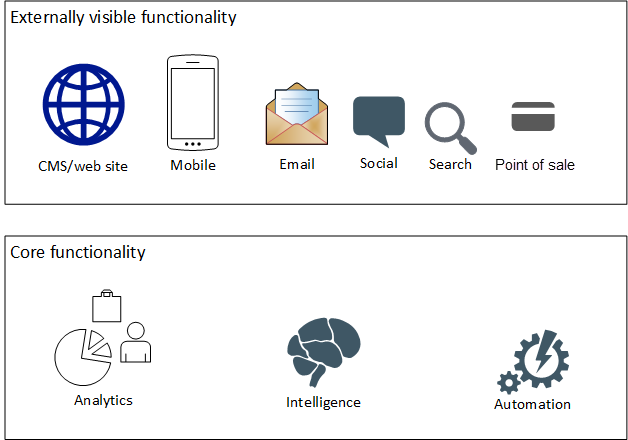

---
# required metadata
title: Migrate your e-commerce solution to Azure
author: EdPrice-MSFT
ms.author: architectures
ms.date: 07/26/2022
ms.topic: article
ms.service: industry
products:
  - azure-migrate
categories:
  - migration
description: This article explains the phases of migrating ecommerce infrastructure from on premises to Azure.
---

# Migrate your e-commerce solution to Azure

## Introduction

Moving an existing e-commerce solution to the cloud presents many benefits for an enterprise: it enables scalability, it offers customers 24/7 accessibility, and it becomes easier to integrate cloud services. But first, to move an e-commerce solution to the cloud is a significant task, with costs that must be understood by a decision maker. This document explains the scope of an Azure migration with the goal of informing you of the options. The first phase begins with IT Pros moving the components to the cloud. Once you're on Azure, we describe the steps an e-commerce team can take to increase your return on investment (ROI) and to take advantage of the cloud.

**At the crossroads**

Although global e-commerce transactions account for only a fraction of total retail sales, the channel continues to see steady year-over-year growth. In 2017, e-commerce constituted 10.2% of total retail sales, up from 8.6% in 2016 ( [source](https://www.emarketer.com/Report/Worldwide-Retail-Ecommerce-Sales-eMarketers-Updated-Forecast-New-Mcommerce-Estimates-20162021/2002182)). As e-commerce has matured, along with the advent of cloud computing, retailers are at a crossroads.  There are choices to make. They can envision their business model with new capabilities made possible by evolving technology; and they can plan their modernization given their current capability footprint.

**Improving the customer journey**

E-commerce, which is primarily focused on the customer journey, has many different attributes. These attributes can be grouped into four main areas: discovery, evaluation, purchase and post-purchase.

The customer behavior is captured as data. The shopping funnel is a collection of connection points to applications used for viewing product data, transactions, inventory, shipping, order fulfillment, customer profile, shopping cart, and product recommendations, to name a few.

A typical retail business relies on a large collection of software solutions that range from customer-facing applications, down through the stack to foundational applications.  The following drawing shows a view of the functionality present in a typical retail business.

 

The cloud presents an opportunity to shift how an organization obtains, uses and manages technology.  Other benefits include: reduced costs of maintaining data centers, improved reliability and performance, and the flexibility to add other services. In this use case, we look at a path a retail business can take to migrate its existing infrastructure to Azure. We also take advantage of the new environment using a phased approach of rehost, refactor and rebuild. While many organizations may follow this series path to modernization, in most cases, organizations can drop into any phase as their starting point.  Organizations may choose to forgo rehosting their current application on Azure, and jump straight to refactor or even rebuild.  This decision will be unique to the application, and organization to best meet their modernization needs.

## Rehost

Also referred to as &quot;lift and shift,&quot; this stage entails migrating physical servers and VMs as-is to the cloud. By simply shifting your current server environment straight to IaaS, you reap the benefits of cost savings, security, and increased reliability. The savings come from techniques like running workloads on properly sized VMs. Today, the capabilities of on-premises VMs and physical machines frequently exceed the day-to-day needs of retailers. The VMs must be able to handle seasonal business peaks that occur only a few times a year. Therefore you are paying for unused capabilities during the off-peak season. With Azure, you pick the right sized VM based on demands for the current business cycle.

To rehost in Azure, there are three phases:

- **Analysis** : Identify and inventory on-premises resources like applications, workloads, networking, and security. At the end of this phase, you have complete documentation of the existing system.
- **Migration** : Move each subsystem from on-premises to Azure. During this stage, you'll use Azure as an extension of your data center with the applications continuing to communicate.
- **Optimization** : As systems move into Azure, make sure that things are sized properly. If the environment shows that too many resources are allocated to some VMs, change the VM type to one that has a more appropriate combination of CPU, memory, and local storage.

### Analyze

Take the following steps:

1. List the on-premises servers and applications. This process relies on an agent or management tool to gather metadata about the servers, the applications that run on the servers, the current server usage, and how the servers and their applications are configured. Thed result is a report of all the servers and applications in the environment.
1. Identify the dependencies. You can use tooling to identify which servers talk to each other, and applications that communicate to each other. The result is a map—or maps—of all applications and workloads. These maps feed into migration planning.
1. Analyze the configurations. The goal is to know what VM types you need once running in Azure. The result is a report on all applications that can move to Azure. They can be further classified as having:
      1. No modifications
      1. Basic modifications such as naming changes
      1. Minor modifications, such as a slight code changes
      1. Incompatible workloads that require extra effort to move
1. Create your budget. You now have a list that enumerates each CPU—memory, and so on—and the requirements for each application. Place those workloads on properly sized VMs. The cloud-platform bill costs are based on usage. Tooling exists to map your needs to the right sized Azure VMs. If you are migrating Windows VMs or SQL Server, you should also look at the [Azure Hybrid Benefit](https://azure.microsoft.com/pricing/hybrid-benefit/?WT.mc_id=retailecomm-docs-scseely), which reduces your expenses on Azure.

Microsoft provides several tools to analyze and catalog your systems. If you run VMware, you can use [Azure Migrate](/azure/migrate/migrate-overview?WT.mc_id=retailecomm-docs-scseely) to assist with discovery and assessment. The tool identifies machines that can be moved to Azure, recommends the type of VM to run, and estimates the cost of the workload. For Hyper-V environments, use [Azure Site Recovery Deployment Planner](/azure/site-recovery/hyper-v-deployment-planner-overview?WT.mc_id=retailecomm-docs-scseely). For large migrations where you need to move hundreds or more VMs, you can work with an [Azure migration partner](https://azure.microsoft.com/migration/migration-center-partners). These partners have the expertise and experience to move your workloads.

### Migrate

Begin planning which services to move to the cloud and in what order. Because this stage involves moving workloads, follow this order:

1. Build out the network.
2. Incorporate an identity system (Azure Active Directory).
3. Provision storage pieces in Azure.

During migration, the Azure environment is an extension of your on-premises network. You can connect the logical networks with [Azure Virtual Network](/azure/virtual-network/virtual-networks-overview?WT.mc_id=retailecomm-docs-scseely). You can choose to use [Azure ExpressRoute](/azure/expressroute/?WT.mc_id=retailecomm-docs-scseely) to keep communications between your network and Azure on a private connection that never touches the Internet. You can also use a site-to-site VPN where an Azure VPN Gateway talks to your on-premises VPN device with all traffic sent securely using encrypted communication between Azure and your network. We have published a reference architecture detailing how to setup a hybrid network [here](/azure/architecture/reference-architectures/hybrid-networking/vpn?WT.mc_id=retailecomm-docs-scseely).

Once the network is configured, plan for business continuity. A recommendation is to use real time replication to move your on-premises data to the cloud and to ensure that the cloud and the existing data are the same. Ecommerce stores never close; duplication provides the ability to switch over from on-premises to Azure with minimal impact to your customers.

Begin moving the data, applications, and related servers into Azure. Many companies use the [Azure Site Recovery](/azure/site-recovery/site-recovery-overview?WT.mc_id=retailecomm-docs-scseely) service to migrate to Azure. The service targets business continuity and disaster recovery (BCDR). This is perfect for a migration from on-premises to Azure. Your implementation team can read the details of how to migrate on-premises VMs and physical servers to Azure [here](/azure/site-recovery/migrate-tutorial-on-premises-azure?WT.mc_id=retailecomm-docs-scseely).

Once a subsystem has been moved to Azure, test to make sure that everything works as expected. Once all issues are closed, move the workloads over to Azure.

### Optimize

At this point, you'll continue to monitor the environment and change the underlying compute options to fit workloads as the environment changes. Whoever monitors the health of the environment should watch how much each resource is used. The goal should be to have 75-90% utilization on most of the VMs. On VMs that have exceptionally low utilization, consider packing them with more applications, or migrating to the lowest cost VMs on Azure that retain the right level of performance.

Azure provides tools to optimize the environment as well. [Azure Advisor](/azure/advisor/advisor-overview?WT.mc_id=retailecomm-docs-scseely) monitors components of your environment and provides personalized recommendations based on best practices. The recommendations help improve the performance, security, and availability of the resources used in your applications. The Azure portal also exposes information about the health of your applications. Your VMs should take advantage of the [Azure virtual machine extensions for Linux and Windows](/azure/virtual-machines/extensions/overview?WT.mc_id=retailecomm-docs-scseely). Those extensions provide for post deployment configuration, antivirus, app monitoring, and more. You can also take advantage of many other Azure services for network diagnostics, service usage, and alerting through services like [Network Watcher](/azure/network-watcher/network-watcher-monitoring-overview?WT.mc_id=retailecomm-docs-scseely), [Service Map](/azure/monitoring/monitoring-walkthrough-servicemap?WT.mc_id=retailecomm-docs-scseely), [Application Insights](/azure/application-insights/app-insights-overview?WT.mc_id=retailecomm-docs-scseely), and [Log Analytics](/azure/log-analytics/log-analytics-overview?WT.mc_id=retailecomm-docs-scseely).

While parts of the organization are optimizing the system now in Azure, the development teams can begin moving to the post-migration phase: refactor.

## Refactor

With the migration complete, your ecommerce application can start taking advantage of its new home in Azure. The refactor phase does not have to wait until the entire environment has moved. If your CMS team has migrated, but the ERP team has not, no problem. The CMS team can still begin their refactoring efforts. This stage involves using additional Azure services to optimize the cost, reliability, and performance by refactoring your applications. Where in lift and shift, you were only taking advantage of the provider managed hardware and OS, in this model you also take advantage of cloud services to drive down cost. You continue to utilize your current application as-is, with some minor application code or configuration changes, and connect your application to new infrastructure services such as containers, database, and identity management systems.

The refactoring effort changes very little code and configuration. You'll focus more time on automation mostly because the technologies adopted at this phase rely upon scripting to build up and deploy the resources; the deployment instructions are a script.

While many of the Azure services can be used, we will focus on the most common services used in the refactor phase: containers, app services, and database services. Why do we look at refactoring? Refactoring provides a strong code foundation that lowers long-term costs by keeping code debt within reason.

Containers provide a way to bundle applications. Because of the way a container virtualizes the operating system, you can pack multiple containers into a single VM. You can move an application to a container with zero to few code changes; you may need configuration changes. This effort also leads to writing scripts that bundle applications into a container. Your development teams will spend their refactoring time writing and testing these scripts. Azure supports containerization through the [Azure Kubernetes Service](/azure/aks/?WT.mc_id=retailecomm-docs-scseely) (AKS) and the related [Azure Container Registry](https://azure.microsoft.com/services/container-registry/?WT.mc_id=retailecomm-docs-scseely) which you can use to manage the container images.

For app services, you can take advantage of various Azure services. For example, your existing infrastructure may handle a customer order by placing messages into a queue like [RabbitMQ](https://www.rabbitmq.com/). (For example, one message is to charge the customer, a second is to ship the order.) When rehosting, you put RabbitMQ in a separate VM. During refactoring, you can add a [Service Bus](/azure/service-bus-messaging/service-bus-queues-topics-subscriptions?WT.mc_id=retailecomm-docs-scseely) queue or topic to the solution. At this point, you can rewrite your RabbitMQ code and stop using the VMs that served the queuing functionality. If it's not feasible to rewrite all your code at once, you can use patterns such as the [messaging bridge](https://www.enterpriseintegrationpatterns.com/patterns/messaging/MessagingBridge.html) to bridge the gap between messaging queues. This allows you to migrate your endpoints one-by-one rather than all at once. Either way, when all the endpoints have been ultimately moved to Azure Service Bus, this replaces a set of VMs with an always-on message queue service for a lower cost. Other app services can be found in the Azure portal. 

For databases, you can move your database from a VM to a service. Azure supports SQL Server workloads with [Azure SQL Database](/azure/sql-database/sql-database-cloud-migrate?WT.mc_id=retailecomm-docs-scseely) and [Azure SQL Database Managed Instance](/azure/sql-database/sql-database-managed-instance?WT.mc_id=retailecomm-docs-scseely). The [Data Migration Service](https://azure.microsoft.com/services/database-migration/?WT.mc_id=retailecomm-docs-scseely) assesses your database, informs you of work that needs to happen prior to the migration, and then moves the database from your VM to the service. Azure supports [MySQL](https://azure.microsoft.com/services/mysql/?WT.mc_id=retailecomm-docs-scseely), [PostgreSQL](https://azure.microsoft.com/services/postgresql/?WT.mc_id=retailecomm-docs-scseely), and [other database](https://azure.microsoft.com/services/#databases?WT.mc_id=retailecomm-docs-scseely) engine services  as well.

## Rebuild

Up until this point, we tried to minimize changes to the ecommerce systems—we left working systems alone. Now, let's discuss how to really take advantage of the cloud. This stage means to revise the existing application by aggressively adopting PaaS or even SaaS services and architecture. The process encompasses major revisions to add new functionality or to rearchitect the application for the cloud.  _Managed APIs_ is a new concept that takes advantage of cloud systems. We can make our system easier to update, by creating APIs for communication between services.  A second benefit is the ability to gain insights on the data we have. We do this by moving to a _microservice plus API_ architecture and use machine learning and other tools to analyze data.

### Microservices + APIs

Microservices communicate through externally facing APIs. Each service is self-contained and should implement a single business capability, for example: recommend items to customers, maintain shopping carts, and so on. Decomposing an application into microservices requires time and planning. While no hard rules exist to define a microservice, the general idea involves reducing the deployable unit to a set of components which almost always change together. Microservices allow you to deploy changes as frequently as needed while reducing the testing burden for the overall application. Some services might be extremely small. For those, going serverless with [Azure Functions](/azure/azure-functions/functions-overview?WT.mc_id=retailecomm-docs-scseely) works well to scale out to as many callers as needed while consuming no resources when not in use. Other services will be broken out around business capabilities: manage product, capture customer orders, and so on.

Serverless mechanisms do have drawbacks: when under light load, they can be slow to respond as some server in the cloud takes a few seconds to configure and run your code. For parts of your environment used heavily by customers, you want to make sure that they can find products, place orders, request returns, and so on with speed and ease. Any time that performance slows down, you risk losing customers in the shopping funnel. If you have functionality that must respond quickly, rebuild that functionality as individually deployable units in [Azure Kubernetes Service](/azure/aks/?WT.mc_id=retailecomm-docs-scseely).  For other cases, such as services which require some combination of lots of memory, several CPUs, and plenty of local storage, it may make sense to host the microservice in its own VM.

Each service uses an API for interaction. Access to the API can be direct to the microservice, but this requires anyone communicating with the service to know the application topology. A service like [API Management](/azure/api-management/?WT.mc_id=retailecomm-docs-scseely) gives you a central way to publish APIs. All applications simply connect to the API Management service. Developers can discover what APIs are available. The API Management service also provides capabilities to make your retail environment perform well. The service can limit access to the API by different parts of the application (to prevent bottlenecks), cache responses to slow changing values, convert from JSON to XML, and more. A complete list of policies can be found [here](/azure/api-management/api-management-policies?WT.mc_id=retailecomm-docs-scseely).

### Make use of your data and the Azure Marketplace

Because you have all your data and systems in Azure, you can easily incorporate other SaaS solutions into your business. You can do some things immediately. For example, use [Power BI](https://powerbi.microsoft.com/?WT.mc_id=retailecomm-docs-scseely) to stitch together various data sources to create visualizations and reports—and gain insights.

Next, take a look at the offerings in the [Azure Marketplace](https://azuremarketplace.microsoft.com/marketplace/?WT.mc_id=retailecomm-docs-scseely) which can help you do things like optimize inventory, manage campaigns based on customer attributes, and present the right items to each customer based on their preferences and history. Expect to spend some time configuring your data to work in the Marketplace offerings.

## Components

Used during rehost:

- [Azure Advisor](https://azure.microsoft.com/services/advisor/) is a personalized cloud consultant that helps you follow best practices to optimize your Azure deployments.
- The [Azure Migrate](https://azure.microsoft.com/services/azure-migrate/) service assesses on-premises workloads for migration to Azure.
- [Azure Site Recovery](https://azure.microsoft.com/services/site-recovery) orchestrates and manages disaster recovery for Azure VMs, and on-premises VMs and physical servers.
- [Azure Virtual Network](https://azure.microsoft.com/services/virtual-network/) enables many types of Azure resources, such as Azure Virtual Machines (VM), to securely communicate with each other, the internet, and on-premises networks.
- [Azure ExpressRoute](https://azure.microsoft.com/services/expressroute) lets you extend your on-premises networks into the Microsoft cloud over a private connection facilitated by a connectivity provider.

Used during refactor:

- [Azure Kubernetes Service](https://azure.microsoft.com/services/kubernetes-service/) manages your hosted Kubernetes environment, making it quick and easy to deploy and manage containerized applications without container orchestration expertise.
- [Azure SQL Database](https://azure.microsoft.com/products/azure-sql/) is a general-purpose relational database managed service in Microsoft Azure. It supports structures such as relational data, JSON, spatial, and XML. SQL Database offers managed single SQL databases, managed SQL databases in an elastic pool, and SQL Managed Instances.

Used during rebuild:

- [Azure API Management](https://azure.microsoft.com/services/api-management) helps organizations publish APIs to external, partner, and internal developers to unlock the potential of their data and services.
- [Azure Functions](https://azure.microsoft.com/services/functions) is a solution for easily running small pieces of code, or &quot;functions,&quot; in the cloud.
- [Power BI](https://powerbi.microsoft.com/?WT.mc_id=retailecomm-docs-scseely) is a suite of business analytics tools that deliver insights throughout your organization.

## Conclusion

Moving your ecommerce system into Azure takes analysis, planning and a defined approach. We looked at a three phase approach of rehost, refactor, and rebuild. This allows an organization to move from one working state to another while minimizing the amount of change at each step. Retailers may also choose to refactor or even rebuild components, skipping rehosting altogether. Many times, you'll have a clear path forward to modernization—take it when you can. As you gain experience running in Azure, you'll see more opportunities to add new capabilities, reduce costs, and improve the overall system.

## Contributors

_This article is maintained by Microsoft. It was originally written by the following contributors._

Principal authors:

- [Scott Seely](https://www.linkedin.com/in/scottseely) | Software Architect
- [Mariya Zorotovich](https://www.linkedin.com/in/mariyazoro) | Head of Customer Experience, HLS & Emerging Technology

## Next steps

Many development teams are tempted to do rehost and refactor simultaneously to address technical debt and better leverage capacity. There are benefits to rehosting before jumping into the next steps.  Any issues in the deployment to the new environment will be easier to diagnose and fix. This in turn gives your development and support teams time to ramp up with Azure as the new environment. As you begin to refactor and rebuild the system, you are building on a stable, working application. This allows for smaller, targeted changes and more frequent updates.

We have published a more general whitepaper on migrating to the cloud: [Cloud Migration Essentials](https://azure.microsoft.com/resources/cloud-migration-essentials-e-book/?_lrsc=9618a836-9f81-4087-901f-51058783c3a8&WT.mc_id=retailecomm-docs-scseely). This is a great piece to read through as you plan out your migration.

Product documentation:

- [Introduction to Azure Advisor](/azure/advisor/advisor-overview?WT.mc_id=retailecomm-docs-scseely)
- [About Azure Migrate](/azure/migrate/migrate-overview?WT.mc_id=retailecomm-docs-scseely)
- [About Site Recovery](/azure/site-recovery/site-recovery-overview?WT.mc_id=retailecomm-docs-scseely)
- [What is Azure Virtual Network?](/azure/virtual-network/virtual-networks-overview?WT.mc_id=retailecomm-docs-scseely)
- [What is Azure ExpressRoute?](/azure/expressroute/?WT.mc_id=retailecomm-docs-scseely)
- [Azure Kubernetes Service](/azure/aks/?WT.mc_id=retailecomm-docs-scseely)
- [What is Azure SQL Database?](/azure/sql-database/sql-database-technical-overview?WT.mc_id=retailecomm-docs-scseely)
- [Azure API Management](/azure/api-management/?WT.mc_id=retailecomm-docs-scseely)
- [Introduction to Azure Functions](/azure/azure-functions/functions-overview?WT.mc_id=retailecomm-docs-scseely)
- [What is Power BI?](/power-bi/fundamentals/power-bi-overview)

## Related resources

- [Architect scalable e-commerce web app](../../solution-ideas/articles/scalable-ecommerce-web-app.yml)
- [Scalable order processing](../../example-scenario/data/ecommerce-order-processing.yml)
- [Retail - Buy online, pick up in store (BOPIS)](../../example-scenario/iot/vertical-buy-online-pickup-in-store.yml)
