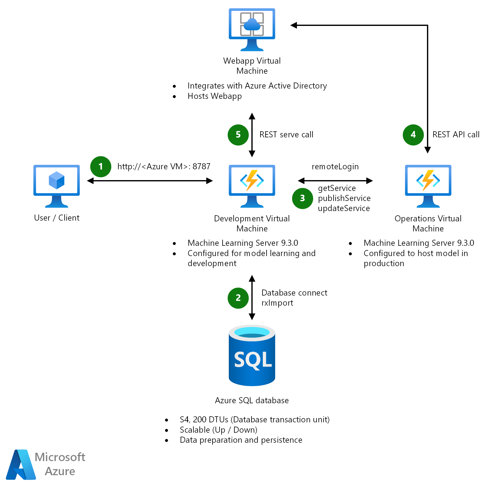
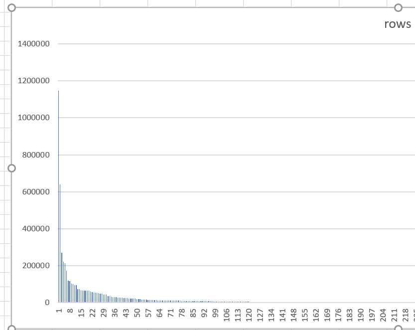

This document describes the process of successfully reusing and improving an existing recommendation system written in R. The key to this was the parallelism of the MicrosoftML and RevoScaleR libraries built into Microsoft Machine Learning Server.

## Recommendation systems and R

For a retailer, understanding consumer preferences and purchasing history is a competitive advantage. Retailers have used this data for years, in combination with machine learning, to identify products that are relevant to the consumer and to deliver a personalized shopping experience. The approach is called **product recommendation** and it generates a significant revenue stream for retailers. Recommendation systems help answer questions like: *What movie will this person watch next? What additional services is this customer likely to be interested in? Where will this customer want to vacation?*
A recent customer wanted to know: *Will consumers (subscribers) renew their contracts?* The customer had an existing recommendation model that would forecast the probability of a subscriber renewing a contract. Once the forecast was generated, additional processing was applied to classify a response into a yes, no, or maybe. The model response was then integrated into a callcenter business process. That process enabled a service agent to deliver a personalized recommendation to the consumer.  
Many of this customer’s early analytic products were built in the [programming language R](/machine-learning-server/rebranding-microsoft-r-server), including the machine learning model at the core of their recommendation system. As their subscriber base has grown, so have the data and compute requirements. So much so, the recommendation workload is now painfully slow and cumbersome to process. Now Python is increasingly a part of their analytic product strategy. But for the near term, they need to preserve their R investment and find a more efficient development and deployment process. The challenge was to optimize the existing approach using capabilities in Azure. We embarked on a task to provide—and validate—a proof-of-concept technology stack for the recommendation workload. Here we summarize a general approach that can be used for similar projects.  

## Design goals

A key priority was to redesign and automate the model workflow to provide several advantages:

- Faster model development cycles and faster time-to-innovate. When data preparation and model development cycles are efficient, the volume of experiments can increase.  
- More accurate model results and better recommendations through more frequent retraining cycles on fresh data.
- A more scalable proof-of-concept (POC) implementation—one that would work in full production.
- Faster time to production by automating the processes between development, test, and deployment. Automation also reduces operational errors and lag times.  

## Requirements

The workflow redesign had the following requirements:

- Leverage the team’s existing R skills and expertise.
- Reuse code where it made sense.
- Store subscriber data in a database to be easily and quickly integrated into the model training and retraining process.
- Invoke model retraining and scoring through a web app interface.
- Use Azure Active Directory for authentication on the web front end.

## Technology stack

The pipeline for this project required multiple technologies and tools and centered around four areas:

1. Persistence and accessibility of subscriber data.
2. Development, training, and selection of models.  
3. Model deployment and operationalization.
4. Use of a web application to invoke scoring and model retraining.

The technology components in the pipeline diagram are discussed in more detail in the following section.



### Microsoft Machine Learning Server

The primary reason for selecting R workloads:
**[RevoScaleR](/machine-learning-server/r-reference/revoscaler/revoscaler)** and **Microsoft ML**. The functions included with these packages were used extensively throughout the code to import the data, create the classification models, and deploy them into production.
Machine Learning studio (MLS) was deployed on two Linux virtual machines (VMs) in Azure. One VM configured for “development,” and one was configured for “operations.” The development VM that was provisioned with significantly more memory and processing power to facilitate the training and testing of hundreds of models. It also hosted RStudio Server to provide easy access to an RStudio IDE for remote users. The operations server was configured on a smaller VM with the additional extensions necessary to host R models that were callable from a web application through REST APIs.

### RStudio Server

**[RStudio Server](https://www.rstudio.com/products/rstudio/#Server)** is a Linux application that provides a browser-based interface for remote or laptop clients. It runs on port 8787 and is available to remote connections once a network security rule is created on the Azure VM. For analysts and data scientists who prefer the RStudio IDE, it can be an efficient option for providing access to virtual machine with a large compute and memory capacity. It's available for download in both source and commercial editions.

### Azure SQL Database

Originally, the subscriber data was stored in one very large .csv file with 6 million rows of purchasing and preference information for 500 unique subscribers. Storing the data in a database meant faster data access from within R and it would allow for filtered reads. No longer would the entire data set need to be imported for training or retraining: data would be filtered by subscriber at the database source, significantly reducing the resources needed to import and process the data.  
There are several managed cloud database options in Azure. [Azure SQL Database](/azure/sql-database/) was selected because of the customer’s familiarity with SQL Server and—more importantly—future plans to introduce SQL Server Machine Learning Services on a broader scale to Azure SQL Database. [SQL Server Machine Learning Services](/sql/advanced-analytics/what-is-sql-server-machine-learning?view=sql-server-2017) has in-database capabilities for executing R and Python workloads via stored procedures.

### Node.js and React.js

A web interface was created to invoke R scripts and secure the website. Node.js was selected as the web server framework because it enables a light-weight and efficient runtime environment for web applications within a distributed environment. React is used to build user interfaces and sits on the front end and calls web services hosted on the web server. It was believed Node + React would provide the quickest path for proto-typing web services for the model pipeline.  

## Infrastructure implementation

The sections below describe how the server infrastructure was deployed for this project. Getting the right development and deployment infrastructure can be as essential as determining the modeling approach and techniques that will be applied.

### Initial database load

The first step was to import the subscriber data from a very large .csv file into Azure SQL Database. There are multiple options for importing data into Azure SQL Database described in [this reference](/archive/blogs/sqlcat/loading-data-to-sql-azure-the-fast-way). Here's how we did it:

1. Created the database through Azure portal following steps [here](/azure/sql-database/sql-database-get-started-portal).
2. Downloaded and used [SQL Server Management Studio](/sql/ssms/download-sql-server-management-studio-ssms?view=sql-server-2017) to connect to the database from the VM.
3. Selected the [SQL Import/Export Wizard](/sql/integration-services/import-export-data/import-and-export-data-with-the-sql-server-import-and-export-wizard?view=sql-server-2017) (if you are time-constrained, there are more performant data import options). Keep in mind the import/export wizard maps datatypes from the data source to the target destination; and with our scenario, all data elements were mapped to a varchar(max) data type which was acceptable. If your scenario requires different mappings, you can modify the datatypes in the wizard ([reference](/sql/integration-services/import-export-data/data-type-mapping-in-the-sql-server-import-and-export-wizard?view=sql-server-2017)).  
4. Since most queries submitted to the database would filter on the field *subscriber_id*, we created an index on that field.

### Web application

The web application is responsible for three functions:

- **Authentication**: Web users authenticate against *Azure Active Directory* through the *React* front end.
- **Model scoring**: Accepts input data from the user for a specific subscriber, submits the subscriber data to the web service using the REST API, which returns a prediction response.  
- **Model retraining**: Accepts a subscriber identifier as input and invokes an R script on the development server to re-train the model for that subscriber.

Implementing single sign-on (SSO) with *Azure Active Directory* turned out to be more of a challenge than expected. This was due to the single page application (SPA) framework. One specific Azure Active Directory library was key for success: [react-adal](https://github.com/salvoravida/react-adal). The following references provided helpful guidance for implementing authentication:

- [Authentication Scenarios for Azure AD](/azure/active-directory/develop/active-directory-authentication-scenarios)
- [Single Page Application](/azure/active-directory/develop/active-directory-authentication-scenarios#single-page-application-spa)

### Development VM (MLS 9.3.0)

The development VM hosted model development, training and retraining, and deployment of the classification model. An Azure VM (DS13 V2) was provisioned with Linux/Ubuntu 16.10 and the following were installed to the base VM:

- Machine Learning Server 9.3.0 using instructions that are available [here](/machine-learning-server/install/machine-learning-server-install). Be sure to run through the setup verification steps to confirm the installation. Because this was the development VM, the section ‘*Enable web service deployment and remote connections*’ was disregarded.
- [RStudio Server](https://www.rstudio.com/products/rstudio/download-server/) (Open Source Version). Be careful not to reinstall R/r-base (it was installed previously with MLS 9.3.0).  
- [Add a network security group](/azure/virtual-machines/windows/nsg-quickstart-portal) to the VM to allow for inbound connections over port 8787 for RStudio Server.  
- Open Database Connectivity (ODBC) drivers to handle the communication between the development VM and Azure SQL Database. The following ODBC drivers were installed on the VM:  
- The [ODBC Driver for SQL Server 17](https://www.microsoft.com/download/details.aspx?id=56567) compatible with Linux/ubuntu 16.10  
- An open-source ODBC driver unixodbc with installation instructions from [Import relational data using ODBC](/machine-learning-server/r/how-to-revoscaler-data-odbc). Note: this article has two typos for Ubuntu instructions.  
- To check if unixodbc is installed:
        ````Apt list –installed | grep unixODBC (should be unixodbc)````
      - And to install the driver:
        ````sudo apt-get install unixodbc-devel unixodbc-bin unixodbc (should be unixodbc-dev)````

### Operations VM (MLS 9.3.0)

The operations VM hosted the model web services and endpoints, stored the Swagger files, and stored serialized versions of the classification models. Configuration is very similar to the MLS development server. However, it's configured for operationalization which means the web services necessary to serve the REST endpoints are installed. To deploy the operations VM, there are ARM templates that make deployment quick. See: [Configuring Microsoft Machine Learning Server 9.3 to Operationalize Analytics using ARM Templates](/archive/blogs/mlserver/configuring-microsoft-machine-learning-server-9-3-to-operationalize-analytics-using-arm-templates). For our project, a *One-Box* configuration was deployed using this [ARM template](https://github.com/Microsoft/microsoft-r/tree/master/mlserver-arm-templates/one-box-configuration/linux).  
With this, the server components to support the model pipeline were up and running.

## Model implementation

One key decision influenced the final model design for this project and that was to move to a “many models” design rather than a single, monolithic model. The difference: each subscriber has their own classification model rather than one big classification model to serve all subscribers. For this customer, the approach was preferred because a smaller model had a smaller memory footprint and was easier to scale horizontally in production.

### Data import

All the data needed for model development resided in an *Azure SQL Database*. For model training and retraining, data import was done in two stages:

1. A query was submitted to the database to retrieve data for a specific *subscriber_id* and a result set returned. Two options were considered for query access to the database:

- A RevoScaleR function called [RxSQLServerData](/machine-learning-server/r-reference/revoscaler/rxsqlserverdata)
- The R odbc package

It was decided to use the R “odbc” library which enabled data filtering at the database level. Filtering the database table for only the rows needed for a specific subscriber model minimized the number of rows to be read into R and processed. That reduced the memory, compute, and overall time needed to train or retrain each model.  

1. The result set was converted into an R data frame and some of the data types were explicitly converted from varchars to integers or numerics as required by the classification algorithms. For this functionality, the RevoScaleR function [rxImport](/machine-learning-server/r-reference/revoscaler/rximport) was used. The *rxImport* function is bundled with RevoScaleR and MicrosoftML and is engineered to be multi-threaded. Here's an example of how we used it:

````r

# Populate the data frame and modify column types as needed
input_data <- rxImport(sqlServerDataDS, colClasses = c(  
Approved="integer",
      OnTimeArrivalRate="numeric",
      Amount="numeric",
      IsInformed="numeric",
      <continue with list of columns> )
# View the characteristics of the variables in the data source
rxGetInfo (input_data, getVarInfo = TRUE)
````

## Unbalanced data

Because the goal of the recommendation model was to forecast the probability a customer would renew a contract and categorize the probability it into a ‘yes’, ‘no’, or ‘maybe’, a classification algorithm was used. One problem that can seriously impact the accuracy and performance of a classification algorithm is an unbalanced data set.  
A data set is unbalanced if there are many more samples for one ‘class’ than another ‘class’. In this case, the number of rows available for each subscriber was unbalanced: on the high end, one subscriber had 1 million+ rows; on the low end, 330 customers had fewer than 100 rows of data. The graph below shows the imbalance with the number of rows (samples) per subscriber:


One technique for treating an unbalanced data set is to change the data set and either over-sample the under-represented class, or under-sample the over-represented class. Another technique is to synthetically generate additional data using the data owner’s exact knowledge of the data and its attributes. The customer established a threshold for the minimum sample size for a subscriber. For subscribers below that threshold, data would need to be treated. For this project both approaches were explored.

## Algorithm selection

Three different classification algorithm implementations were evaluated: *rxDForest*, *rxFastTrees*, and *rxFastForest*. All three algorithms take advantage of multi-threading and parallelism. And Microsoft ML will use multiple CPUs or GPUs if available. The criteria for evaluating the models included:

- Were the new models more accurate that the original model?
- What was the memory footprint of the models running in production? Without compromising accuracy, could the operational environment support simultaneous execution of many models with near real-time prediction response?
- How well did the algorithm handle the unbalanced data set? Would the imbalance need to be pre-treated by generating synthetic data?

The table below summarizes the findings:

| Algorithm | Description | Findings | Notes |
| :--------- | :------------ | :--------- | :--------------- |
| [rxFastTrees](/machine-learning-server/r-reference/microsoftml/rxfasttrees) | Parallel implementation of boosted decision tree that implements multi-threaded version of FastRank. | Accurate, fastest performance. | No special features for unbalanced data. Pre-treated data needed to be provided as input |
| [rxFastForest](/machine-learning-server/r-reference/microsoftml/rxfastforest) | Parallel implementation of random forest and uses rxFastTrees to build an ensemble learner of decision trees. | Better accuracy than original with pre-treated data. Less memory intensive, faster than rxDForest |No special features for unbalanced data. Pre-treated data provided as input. |
| [rxDForest](/machine-learning-server/r-reference/revoscaler/rxdforest) | Parallel implementation of random forest. Included in RevoScaleR. Can deal with unbalanced data (removes missing data, conditions data, handles stratification of samples) all within the function call. | Faster than original model. Same or better accuracy than original model. Handles unbalanced data set using a variety of techniques for resampling and synthesizing. Largest memory footprint.  | Largest memory footprint because it includes the conditioned data within the function.   Treatment of the data was good but not as good as the customized transformations provided by the data owner. |

In the end, the customer selected the *rxFastForest* algorithm and decided to treat the unbalanced data by using the [vtreat](https://cran.r-project.org/web/packages/vtreat/index.html) library and adding a customized data pre-processing step to synthetically generate data for the under-represented subscribers.

## Model deployment and web services

Publishing a model for deployment to the operations VM is straight-forward and documented in this QuickStart documentation [Deploy an R Model as a web service with mrsdeploy](/machine-learning-server/operationalize/quickstart-publish-r-web-service).
In our scenario, once the models were created on the development VM, they were published on the operations VM using these steps:

1. Establish a remote login from the developer VM to the operations VM using one of two functions available in the mrsdeploy package for authentication; remoteLogin() using a local admin name and password, or remoteLoginAAD() using Azure Active Directory. Both options are described in this reference. Log in to Machine Learning Server or R Server with mrsdeploy and open a remote session.  
2. Once a model is trained, publish it to the operations VM using the publishService or updateService functions in the mrsdeploy package. For this project, we used multiple deployment approaches, and—depending on the approach—either a new model was published, or an existing model was updated. The following code was implemented to handle both cases:

````r
# If the service does not exist, publish it and if it does exist, update it.  
# No service by this name so publish one
 api <- publishService(serviceName, code =sc_predict, model = model,  
      inputs = list(prop_data="data.frame"),  
      outputs = list(answer = "numeric"), v = "v1.0.0" )
 print("=========== Model Created =============")
} else {
# A service by this name already exists, update it  
 api <- updateService(serviceName, model = model,
     inputs = list(prop_data="data.frame"), v = "v1.0.0" )
 print("=========== Model Updated =============")
}
 ````

When deployed, models are serialized and stored on the operations server and can be consumed via web services in either *standard* or *real-time* mode. Every time a web service is called with standard mode, R and any required libraries are loaded and unloaded with each call. In contrast, with *real-time* mode, R and the libraries are loaded only once and reused for subsequent web service calls. Since most of the overhead with a web service call is the loading of R and the libraries, real-time mode offers much lower latency for model scoring, and response times can be under 10ms. See documentation and reference examples [here](/machine-learning-server/operationalize/concept-what-are-web-services) for both standard and real-time options. Real time lends itself well to single predictions, but you can also pass in an input data frame for scoring. That is described in this reference: [Asynchronous web service consumption via batch processing with mrsdeploy](/machine-learning-server/operationalize/how-to-consume-web-service-asynchronously-batch).

## Conclusion

Leveraging the parallelism of the MicrosoftML and RevoScaleR libraries built into Microsoft Machine Learning Server accelerated development, deployment, and scoring of individual classification models for hundreds of subscribers. Model accuracy improved, and training and retraining times were compressed—all with minimal changes to the existing R code base.
Implementing the infrastructure to support a model pipeline and getting the technology components configured correctly end-to-end can be complex. Here are some references to get your started with your own approach:

- [Machine Learning Server Documentation](/machine-learning-server/)
- [R Tutorials for Machine Learning Server](/advanced-analytics/tutorials/sql-server-r-tutorials?view=sql-server-2017)
- [R Samples for Machine Learning Server](/machine-learning-server/r/r-samples)
- [R Function Library Reference](/machine-learning-server/r-reference/introducing-r-server-r-package-reference)

## Next steps

If you are interested in building other predictive solutions for your retail business, visit the [retail section](https://gallery.azure.ai/industries/retail) of the Azure [AI Gallery](https://gallery.azure.ai/).
