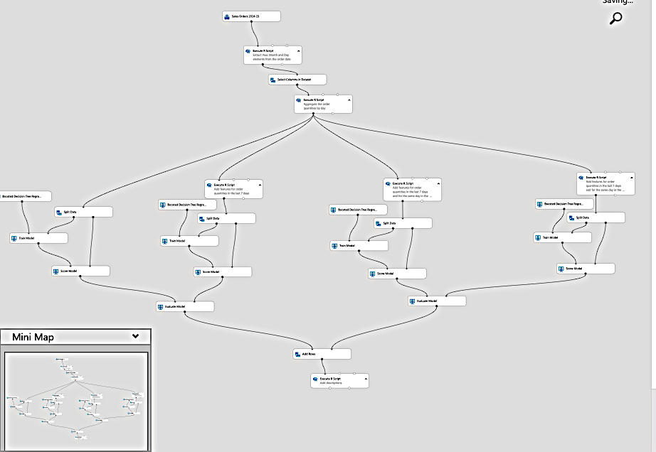

Retailers and consumer brands are focused on ensuring they have the right products and services that consumers seek to purchase within the marketplace. When looking at maximizing sales, products (or combinations of products) are the major part of the shopping experience. The availability of offerings—inventory—is a constant concern for consumer brands.

Product inventory, also known as SKU assortment, is a complex topic that spans the supply and logistics value chain. For this document, we focus specifically on the problem of optimizing SKU assortment to maximize revenue from a consumer goods point of view. The puzzle of SKU assortment optimization can be solved by developing algorithms to answer the following questions:

- Which SKUs are performing best in a given market or store? 
- Which SKUs should be allocated to a given market or store based on their performance?
- Which SKUs are low performing and should be replaced by higher performing SKUs?
- What other insights can we derive about our consumer and market segments?

## Automate decision making

Traditionally, consumer brands approached consumer demand by increasing the number of SKUs in the SKU portfolio. As the number of SKUs ballooned, and competition increased, it's estimated that 90 percent of revenue is attributed to only 10 percent of product SKUs within the portfolio. Typically, 80 percent of revenue accrues from 20 percent of SKUs. And this ratio is a candidate for improving profitability. 

Traditional methods of static reporting leverage historical data—which limits insights. At best, decisions are still manually made and implemented. This means human intervention and processing time. With the advancements of artificial intelligence (AI) and cloud computing, it's possible to use advanced analytics to a provide a range of choices and predictions. This kind of automation improves results and speed-to-customer.

## SKU assortment optimization

A SKU assortment solution must handle millions of SKUs by segmenting sales data into meaningful and detailed comparisons. The goal of the solution is to maximize sales at every outlet or store by tuning product assortment using advanced analytics. A second goal is to eliminate out-of-stocks and improve assortments. The fiscal goal is a 5 to ten percent increase in sales. To that end, insights enable one to:

- Understand SKU portfolio performance and manage low performers.
- Optimize distribution of SKUs to reduce out-of-stocks.
- Understand how new SKUs support short-term and long-term strategies.
- Create repeatable, scalable, and actionable insights from existing data.

## Descriptive analytics

Descriptive models aggregate data points and explore relationships among factors that may influence product sales. The information may be augmented with some external data points, such as location, weather, census data etc. Visualizations help a person derive insights by interpreting the data. In doing so, however, the person is limited to understanding what happened over the previous sales cycle, or possibly what is happening in the current period (depending on how often the data is refreshed).

A traditional data warehousing and reporting approach is sufficient in this case to understand, for instance, what SKUs have been the best and worst performers over a period of time.

The following figure shows a typical report of historical data—sales data. It features several blocks with check boxes to select criteria to filter the results. The center shows two bar charts that show sales over time. The first chart shows the average sales by week; the second shows quantities by week.

 
  
## Predictive analytics

Historical reporting is useful to understand what has happened. Ultimately, we want a forecast of what is likely to happen. Past information may be useful for that purpose. For example, we can identify seasonal trends. But it can’t cover “what-if” scenarios—for example, to model the introduction of a new product. To do that, we must shift our focus to modelling customer behavior, as that is the ultimate factor that determines sales.

### An in-depth look at the problem: choice models

Let’s start by defining what we are looking for and what data we have:

Assortment optimization means finding a subset of products to put on sale that will maximize the expected revenue. This is what we are looking for.

**Transaction data** is routinely collected for financial purposes. 

**Assortment data** includes potentially everything that pertains to SKUs: Here’s an example of what we want: 

- the number of SKUs
- SKU descriptions
- quantities allocated
- SKU and quantity purchased
- time stamps of events (for example, purchase)
- SKU price
- SKU price at POS
- stock level of every SKU at any point in time

Unfortunately, such data isn’t collected as reliably as transaction data. 

In this document, for simplicity we'll only consider transaction data and SKU data, not external factors.

Even so note that, given a set of n products, there are 2n possible assortments. This makes the optimization problem a computationally intensive process. Evaluating all possible combinations is impractical with a large number of products. So typically, assortments are segmented by category (for example, cereals), location and other criteria to reduce the number of variables. Optimization models try to “prune” the number of permutations to a workable subset.

The crux of the problem rests in **modelling the behavior of consumers** effectively. In a perfect world, the products presented to them will match those that they want to buy.

Mathematical models to predict consumers’ choice have been developed over the course of decades. The choice of model will ultimately determine the most suitable implementation technology; therefore, we’ll summarize them and offer a few considerations.

## Parametric models

Parametric models approximate customer behavior by using a function with a finite set of parameters. We estimate the set of parameters to best fit the data at our disposal. One of the oldest and best known is [Multinomial Logistic Regression](https://en.wikipedia.org/wiki/Multinomial_logistic_regression) (also known as MNL, multi-class logit, or softmax regression). It's used to compute the probabilities of several possible outcomes in classification problems. In this case, you can use MNL to compute:

- The probability that a consumer (c) chooses an item (i) at a specific time (t), given a set of items of that category in an assortment (a) with a known utility to the customer (v). 

We also assume that the utility of an item can be a function of its features. External information may also be included in the measure of utility (for example, an umbrella is more useful when it rains).

We often use MNL as a benchmark for other models because of its tractability when estimating parameters and when evaluating results. In other words, if you do worse than MNL, your algorithm is of no use.
Several models have been derived from MNL, but it's beyond the scope of this paper to discuss them. 

There are libraries for the R and Python programming languages. For R, you might use glm (and derivatives).  For Python, there are [scikit-learn](http://scikit-learn.org/stable), [biogeme](http://biogeme.epfl.ch/), and [larch](https://pypi.org/project/larch/). These libraries offer tools to specify MNL problems, and parallel solvers to find solutions on a variety of platforms.

Most recently, implementation of MNL models on GPUs have been proposed to compute complex models with a number of parameters that would make them intractable otherwise.

Neural networks with a softmax output layer have been used effectively on large multi-class problems. These networks produce a vector of outputs that represent a probability distribution over a number of different outcomes. They're slow to train compared to other implementations, but can handle a large number of classes and parameters. 

## Non-parametric models

Despite its popularity, MNL places some significant assumptions on human behavior that may limit its usefulness. In particular, it assumes that the relative probability of someone choosing between two options is independent of additional alternatives introduced in the set later. That is impractical in most cases.

For instance, if you like product "A” and product “B” equally, you'll choose one over the other 50% of the time. Let’s introduce product “C” to the mix. You may still choose “A” 50% of the time, but now you split your preference 25% to “B” and 25% to “C.” The relative probability has changed.

Also, MNL and derivatives have no simple way to account for substitution, due to stock-out or assortment variety (that is, when you have no clear idea and pick a random item among those on the shelf).
Non-parametric models are designed to account for substitution and impose fewer constraints on customer behavior. 

They introduce the concept of “ranking”—where consumers express a strict preference for products in an assortment. Their purchasing behavior can therefore be modelled by sorting the products in descending order of preference. 

The assortment optimization problem can be expressed as maximization of revenue:

 
- _$r_i$_ denotes the revenue of product _i_.
- _ $y_i^k$_ is 1 if the product _i_ is chosen in ranking _k_. Otherwise it's 0.  
- _$\lambda_k$_ is the probability that the customer makes a choice according to ranking _k_.
- _ $x_i$_ is 1, if the product is included in the assortment. Otherwise it's 0.
- _K_ is the number of rankings.
- _n_ is the number of products.

Subject to constraints:

- There can be exactly 1 choice for each ranking.
- Under a ranking _k_, a product _i_ can be chosen only if it's part of the assortment.
- If a product _i_ is included in the assortment, none of the less preferable options in ranking _k_ can be chosen.
- No-purchase is an option, and as such none of the less preferable options in a ranking can be chosen.

In such a formulation, the problem can be regarded as a [mixed-integer optimization](https://en.wikipedia.org/wiki/Integer_programming).

Let us consider that if there are n products, the maximum number of possible rankings, including the no-choice option, is factorial: (n+1)!

The constraints in the formulation allow for a relatively efficient pruning of the possible options. (For example, only the most preferable option is chosen and set to 1. The rest are set to 0.) You can imagine that the scalability of the implementation will be important, given the number of possible alternatives.

### The importance of data

We mentioned before that sales data are readily available. We want to use them to inform our assortment optimization model. In particular, we want to find our probability distribution λ.

The sales data from the point-of-sales system will consist of transactions with time stamps and of a set of products shown to customers at that time and location. From those, we can construct a vector of actual sales, whose elements vi,m represent the probability of selling item i to a customer given an assortment $S_m$

We can also construct a matrix:

Finding our probability distribution λ given our sales data becomes another optimization problem. We want to find a vector λ to minimize our sales estimate error:

$$min_\lambda|\Lambda\lambda - v|$$

Note that the computation can also be expressed as a regression, and as such, models like multi-variate decision trees can be used. 

## Implementation details

As we can deduct from the previous formulation, optimization models are both data-driven and computation-intensive.

Microsoft partners, such as Neal Analytics, have developed robust architectures to satisfy those conditions. See [SKU Max](https://appsource.microsoft.com/product/web-apps/neal_analytics.8066ad01-1e61-40cd-bd33-9b86c65fa73a?tab=Overview?WT.mc_id=invopt-article-gmarchet). We’ll use those architectures as an example and offer a few considerations.

- First, they rely on (1) a robust and scalable data pipeline to feed the models, and on (2) a robust and scalable execution infrastructure to run them.
- Second, the results are easily consumable by planners via a dashboard.

Figure 2 shows an example architecture. It includes four major blocks, capture, process, model, and operationalize. Each block contains major processes. Capture includes “data preprocessing;” process includes the “store data” function; model includes the “train machine learning model” function; and operationalize includes “store data” and reporting options (such as dashboards).

_Figure 2: architecture for SKU optimization—courtesy of Neal Analytics_

## The data pipeline

The architecture highlights the importance of establishing a data pipeline for both training and operations of the model. We orchestrate the activities in the pipeline using [Azure Data Factory](/azure/data-factory/introduction?WT.mc_id=invopt-article-gmarchet), a managed extract-transform-load (ETL) service that lets you design and run your integration workflows.

Azure Data Factory is a managed service with components called “activities” that consume and/or produce datasets.

Activities can be split into:

- data movement (for example, copying from source to destination)
- data transformation (for example, aggregating with a SQL query, or running a stored procedure)

Workflows that link together sets of activities can be scheduled, monitored and managed by the data factory service. The complete workflow is known called a “pipeline.”

In the capture phase, we can leverage the copy activity (built-in to Data Factory) to transfer data from a variety of sources (both on-premises and in the cloud) into Azure SQL Data Warehouse. Examples of how to do that are provided in the documentation:

- [Copy data to or from Azure SQL DW](/azure/data-factory/connector-azure-sql-data-warehouse?WT.mc_id=invopt-article-gmarchet)
- [Load Data into Azure SQL DW](/azure/data-factory/load-azure-sql-data-warehouse?WT.mc_id=invopt-article-gmarchet)

The following figure shows the definition of a pipeline. It consists of three equally-sized three blocks in a row. The first two are a data set and an activity connected by arrows to indicate data flows. The third block is labeled “pipeline” and simply points to the first two to indicate encapsulation. 

 
 
_Figure 3: Basic concepts of  Azure Data Factory_

An example of the data format that is used by Neal Analytics’ solution can be found on Microsoft’s Appsource page. The solution includes the following datasets:

- Sales history data for each combination of store and SKU
- Store and consumer records
- SKU codes and description
- SKU attributes that capture features of the products (for example, size, material). These are typically used in parametric models to differentiate between product variants.

If the data sources aren't expressed in the particular format, Data Factory offers a series of transformation activities. 

In the process phase, SQL Data Warehouse is the main storage engine. Therefore, you may want to express such a transformation activity as a SQL stored procedure, which can be automatically invoked as part of the pipeline. The documentation provides detailed instructions:

- [Transform data with SQL Stored Procedure](/azure/data-factory/transform-data-using-stored-procedure?WT.mc_id=invopt-article-gmarchet)

Note that Data Factory does not limit you to SQL Data Warehouse and SQL stored procedures. In fact, it integrates with a variety of platforms. You may choose, for instance, to use Databricks and run a Python script instead for transformation. This is an advantage, as you can use one platform for both storage, transformation, and training of machine learning algorithms in the following “model” stage.

## Training the ML algorithm

There are several tools that will help you implement parametric and non-parametric models. Your choice depends on your scalability and performance requirements.

[Azure ML Studio](https://studio.azureml.net/?WT.mc_id=invopt-article-gmarchet) is a great tool for prototyping. It provides an easy way for you to build and run a training workflow with your code modules (in R or Python), or with pre-defined ML components (such as multi-class classifiers, boosted decision tree regression) in a graphical environment. It also allows you to publish a trained model as a web service for further consumption with a few clicks, generating a REST interface for you. 

However, the data size it can handle is limited to 10 GB (for now) and the number of cores available to each component is also limited to 2 (for now).

The following figure shows an example of the ML studio in use. It's a graphical representation of a machine learning experiment. The figure shows several groups of blocks. Each set of blocks represents some stage in the experiment, and each block is connected to one or more blocks to indicate data input and output.

_Figure 4: example of ML training pipeline with R and pre-built components_

If you need to scale further but still want to use some of Microsoft’s fast, parallel implementation of common machine learning algorithm (such as multinomial logistic regression), you may want to look at Microsoft ML Server running on Azure Data Science Virtual Machine.

For very large data sizes (TBs), it makes sense to choose a platform where the storage and the computation element can:

- Scale independently, to limit costs when you aren't training the models.
- Distribute the computation across multiple cores.
- Run the computation “close” to the storage to limit data movement.

Azure [HDInsight](https://azure.microsoft.com/services/hdinsight/?WT.mc_id=invopt-article-gmarchet) and [Databricks](https://azure.microsoft.com/services/databricks/?WT.mc_id=invopt-article-gmarchet) both satisfy those requirements. In addition, they're both execution platforms supported within the Azure Data Factory editor. It's relatively simple to integrate either one in a workflow.

ML Server and its libraries can be deployed on top of HDInsight, but to take full advantage of the platform capabilities, you may want to implement your ML algorithm of choice using the SparkML , Microsoft ML Spark libraries in Python, or other specialist linear programming solvers such as TFoCS, Spark-LP or SolveDF. 

Starting the training process then becomes a question of invoking the appropriate pySpark script or notebook from a Data Factory workflow. This is fully supported in the graphical editor. For more details, please see [Run a Databricks notebook with the Databricks Notebook Activity in Azure Data Factory](/azure/data-factory/transform-data-using-databricks-notebook?WT.mc_id=invopt-article-gmarchet).

The following figure shows the Data Factory user interface, as accessed through the Azure portal. It includes blocks for the various processes in the workflow. 

_Figure 5: example of Data Factory pipeline with Databricks notebook activity_

Also note that in our [inventory optimization solution](https://gallery.azure.ai/Solution/Inventory-Optimization-3?WT.mc_id=invopt-article-gmarchet) we propose a container-based implementation of solvers that is scaled via [Azure Batch](https://azure.microsoft.com/services/batch/?WT.mc_id=invopt-article-gmarchet). Specialist optimization libraries such as [pyomo](http://www.pyomo.org/about/) allow you to express an optimization problem in the Python programming language, then invoke independent solvers such as [bonmin](https://projects.coin-or.org/Bonmin) (open source) or [gurobi](http://www.gurobi.com/) (commercial) to find a solution.

The inventory optimization documentation deals with a different problem (order quantities) than assortment optimization, yet the implementation of solvers in Azure is similarly applicable.

Although more complex than those suggested so far, this technique allows for maximum scalability, limited mostly by the amount of cores you can afford.

## Running the model (operationalize)

Once the model has been trained, running it typically requires a different infrastructure than the one used for deployment. In order to make it easily consumable, you may opt to deploy it as a web service with a REST interface. Both Azure ML Studio and ML Server automate the process of creating such services. In the case of ML Server, we provide templates for deployment of a supporting infrastructure. Please see the relevant [documentation](/machine-learning-server/what-is-operationalization?WT.mc_id=invopt-article-gmarchet).

The following figure shows the architecture of the deployment. It includes representations of servers running the R language and Python. Both servers communicate to a sub section of web nodes that perform computation. A large data store is connected to the computation block.

_Figure 6: example of ML server deployment_

For models created on HDInsight or Databricks and hence dependent on the Spark environment (libraries, parallel capabilities etc.), you may want to consider running them on a cluster. Guidance is provided [here](/azure/machine-learning/team-data-science-process/spark-model-consumption?WT.mc_id=invopt-article-gmarchet).

This has the advantage that the operational model can itself be invoked via a Data Factory pipeline activity for scoring.

To use containers, you can package your models and deploy them on Azure Kubernetes Service. Prototype will require the use of the [Azure Data Science VM](https://azure.microsoft.com/services/virtual-machines/data-science-virtual-machines/?WT.mc_id=invopt-article-gmarchet); you must also install the Azure ML [command line](/azure/machine-learning/desktop-workbench/model-management-service-deploy?WT.mc_id=invopt-article-gmarchet) tools on the VM.

## Data output and reporting

Once deployed, the model will be able to process financial transaction workflows and stock readings to generate optimal assortment predictions. The data thus produced can be stored back into Azure SQL Data Warehouse for further analysis. In particular, it will be possible to study historical performance of various SKUs, identifying the best revenue generators and the loss-makers. You’ll then be able to compare those against the assortments suggested by the models and evaluate performance, and the need for re-training.

[Power BI](https://powerbi.microsoft.com/get-started/?&OCID=AID719832_SEM_uhlWLg3x&lnkd=Google_PowerBI_Brand&gclid=CjwKCAjw5ZPcBRBkEiwA-avvkyOLMJCrhqH8iac84aLX7EcUQIirSSqUCostzGi8y_XntJTCD73ZixoCQ4sQAvD_BwE?WT.mc_id=invopt-article-gmarchet) provides a way to analyze and display the data produced in the process. 

The following figure shows a typical Power BI dashboard. It includes two graphs that show SKU stock information. 

_Figure 7: example of model results report—courtesy of Neal Analytics_

## Security considerations

A solution that deals with sensitive data contains financial records, stock levels and price information. Such sensitive data must be protected. To allay concerns about security and privacy of the data, note that:

- You can run some of the Azure Data Factory pipeline on premises using Azure Integration Runtime. The runtime executes data movement activities to/from sources on-premises. It will also dispatch activities for execution on premises.
  - In particular, you may want to develop a custom activity to anonymize the data to be transferred to Azure (and run it on premises).
- All the services mentioned support encryption in transit and at rest. If you opt to store the data on an Azure Data Lake, encryption is enabled by default. If you use Azure SQL Data Warehouse, you can enable transparent data encryption (TDE).
- All the services mentioned, with the exception of ML studio, support integration with Azure Active Directory for authentication and authorization. If you write your own code, you must build that integration into your application.

For more information about GDPR, see our [compliance](https://www.microsoft.com/trustcenter?WT.mc_id=invopt-article-gmarchet) page.

## Components

The following technologies were featured in this article:

- [Azure Batch](https://azure.microsoft.com/services/batch/?WT.mc_id=invopt-article-gmarchet)
- [Azure Active Directory](https://azure.microsoft.com/services/active-directory/?WT.mc_id=invopt-article-gmarchet)
- [Azure Data Factory](/azure/data-factory/introduction?WT.mc_id=invopt-article-gmarchet)
- [Azure Integration Runtime](/azure/data-factory/concepts-integration-runtime?WT.mc_id=invopt-article-gmarchet)
- [HDInsight](https://azure.microsoft.com/services/hdinsight/?WT.mc_id=invopt-article-gmarchet)
- [Databricks](https://azure.microsoft.com/services/databricks/?WT.mc_id=invopt-article-gmarchet)
- [Azure SQL Data Warehouse](/azure/sql-data-warehouse/sql-data-warehouse-overview-what-is?WT.mc_id=invopt-article-gmarchet)
- [Azure ML Studio](https://studio.azureml.net/?WT.mc_id=invopt-article-gmarchet)
- [Microsoft ML Server](/machine-learning-server/what-is-machine-learning-server?WT.mc_id=invopt-article-gmarchet)
- [Azure Data Science VM](https://azure.microsoft.com/services/virtual-machines/data-science-virtual-machines/?WT.mc_id=invopt-article-gmarchet)
- [Azure Kubernetes Service](https://azure.microsoft.com/services/kubernetes-service/?WT.mc_id=invopt-article-gmarchet)
- [Microsoft Power BI](https://powerbi.microsoft.com/?WT.mc_id=invopt-article-gmarchet)
- [Pyomo Optimization Modelling Language](http://www.pyomo.org/)
- [Bonmin Solver](https://projects.coin-or.org/Bonmin)
- [TFoCS solver for Spark](https://github.com/databricks/spark-tfocs)
