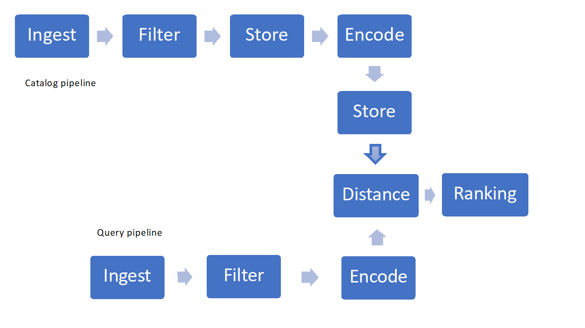
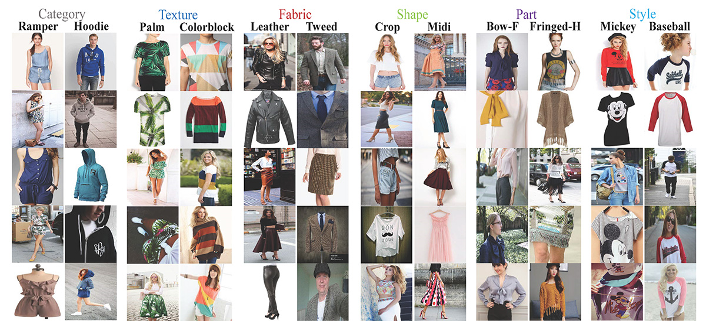
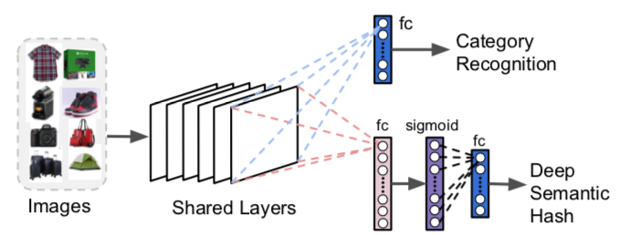

Artificial Intelligence offers the potential to transform retailing as we know it today. It's reasonable to believe that retailers will develop a customer experience architecture supported by AI. Some expectations are that a platform enhanced with AI will provide a revenue bump due to hyper personalization. Digital commerce continues to heighten customer expectations, preferences and behavior. Demands such as real-time engagement, relevant recommendations and hyper-personalization are driving speed and convenience at a click of a button. We enable intelligence in applications through natural speech, vision, and so on. This intelligence enables improvements in retail that will increase value while disrupting how customers shop.

This document focuses on the AI  concept of **visual search** and offers a few key considerations on its implementation. It provides a workflow example and maps its stages to the relevant Azure technologies. The concept is based on customers being able to leverage an image that's taken with their mobile device or that's located on the internet. They would conduct a search of relevant and like items, depending upon the intention of the experience. Thus, visual search improves speed from texted entry to an image with multiple meta-data points to quickly surface all applicable items that are available.

## Visual search engines

Visual search engines retrieve information using images as input and often—but not exclusively—as output too.

Engines are becoming more and more common in the retail industry, and for very good reasons:

- Around 75% of internet users search for pictures or videos of a product before making a purchase, according to an [Emarketer](https://www.emarketer.com/Report/Visual-Commerce-2017-How-Image-Recognition-Augmentation-Changing-Retail/2002059) report published in 2017.
- 74% of consumers also find text searches inefficient, according to a Slyce (a visual search company) 2015 report.

Therefore, the image recognition market will be worth more than $25 billion by 2019, according to research by [Markets &amp; Markets](https://www.marketsandmarkets.com/PressReleases/image-recognition.asp).

The technology has already taken hold with major e-commerce brands, who have also contributed significantly to its development. The most prominent early adopters are probably:

- eBay with their Image Search and "Find It on eBay" tools in their app (this is currently only a mobile experience).
- Pinterest with their Lens visual discovery tool.
- Microsoft with Bing Visual Search.

## Adopt and adapt

Fortunately, you don't need vast amounts of computing power to profit from visual search. Any business with an image catalog can take advantage of Microsoft's AI expertise built into its Azure services.

[Bing Visual Search](https://azure.microsoft.com/services/cognitive-services/bing-visual-search/?WT.mc_id=vsearchgio-article-gmarchet) API provides a way to extract context information from images, identifying—for instance—home furnishings, fashion, several kinds of products, and so on.

It will also return visually similar images out of its own catalog, products with relative shopping sources, related searches. While interesting, this will be of limited use if your company isn't one of those sources.

Bing will also provide:

- Tags that allow you to explore objects or concepts found in the image.
- Bounding boxes for regions of interest in the image (such as for clothing or furniture items).

You can take that information to reduce the search space (and time) into a company's product catalog significantly, restricting it to objects like those in the region and category of interest.

## Implement your own

There are a few key components to consider when implementing visual search:

- Ingesting and filtering images
- Storage and retrieval techniques
- Featurization, encoding or "hashing"
- Similarity measures or distances and ranking

 

*Figure 1: Example of Visual Search Pipeline*

### Sourcing the pictures

If you don't own a picture catalog, you may need to train the algorithms on openly available data sets, such as fashion [MNIST](https://www.kaggle.com/zalando-research/fashionmnist), [deep fashion](http://mmlab.ie.cuhk.edu.hk/projects/DeepFashion.html), and so on. They contain several categories of products and are commonly used to benchmark image categorization and search algorithms.

 

*Figure 2: An Example from the DeepFashion dataset*

### Filtering the images

Most benchmark datasets, such as those mentioned before, have already been pre-processed.

If you build your own benchmark, at a minimum you'll want the images to all have the same size, mostly dictated by the input that your model is trained for.

In many cases, it's best also to normalize the luminosity of the images. Depending on the detail level of your search, color may also be redundant information, so reducing to black and white will help with processing times.

Last but not least, the image dataset should be balanced across the different classes it represents.

### Image database

The data layer is a particularly delicate component of your architecture. It will contain:

- Images
- Any metadata about the images (size, tags, product SKUs, description)
- Data generated by the machine learning model (for instance a 4096-element numerical vector  per image)

As you retrieve images from different sources or use several machine learning models for optimal performance, the structure of the data will change. It's therefore important to choose a technology or combination that can deal with semi-structured data and no fixed schema.

You might also want to require a minimum number of useful data points (such as an image identifier or key, a product sku, a description, or a tag field).

[Azure Cosmos DB](https://azure.microsoft.com/services/cosmos-db/?WT.mc_id=vsearchgio-article-gmarchet) offers the required flexibility and a variety of access mechanisms for applications built on top of it (which will help with your catalog search). However, one has to be careful to drive the best price/performance. Azure Cosmos DB allows document attachments to be stored, but there's a total limit per account and it may be a costly proposition. It's a common practice to store the actual image files in blobs and insert a link to them in the database. In the case of Azure Cosmos DB this implies creating a document that contains the catalog properties associated to that image (such as a SKU, tag, and so on) and an attachment that contains the URL of the image file (for example, on Azure Blob storage, OneDrive, and so on).

 

*Figure 3: Azure Cosmos DB Hierarchical Resource Model*

If you plan to take advantage of the global distribution of Azure Cosmos DB, note that it will replicate the documents and attachments, but not the linked files. You may want to consider a content distribution network for those.

Other applicable technologies are a combination of Azure SQL Database (if fixed schema is acceptable) and blobs, or even Azure Tables and blobs for inexpensive and fast storage and retrieval.

### Feature extraction &amp; encoding

The encoding process extracts salient features from pictures in the database and maps each of them to a sparse "feature" vector (a vector with many zeros) that can have thousands of components. This vector is a numerical representation of the features (such as edges and shapes) that characterize the picture. It's akin to a code.

Feature extraction techniques typically use _transfer learning mechanisms_. This occurs when you select a pre-trained neural network, run each image through it and store the feature vector  produced back in your image database. In that way, you "transfer" the learning from whoever trained the network. Microsoft has developed and published several pre-trained networks that have been widely used for image recognition tasks, such as [ResNet50](https://www.kaggle.com/keras/resnet50).

Depending on the neural network, the feature vector will be more or less long and sparse, hence the memory and storage requirements will vary.

Also, you may find that different networks are applicable to different categories, hence an implementation of visual search may actually generate feature vectors of varying size.

Pre-trained neural networks are relatively easy to use but may not be as efficient as a custom model trained on your image catalog. Those pre-trained networks are typically designed for classification of benchmark datasets rather than search on your specific collection of images.

You may want to modify and retrain them so they produce both a category prediction and a dense (i.e. smaller, not sparse) vector, which will be very useful to restrict the search space, reduce memory and storage requirements. Binary vectors can be used and are often referred to as " [semantic hash](https://www.cs.utoronto.ca/~rsalakhu/papers/semantic_final.pdf)" – a term derived from document encoding and retrieval techniques. The binary representation simplifies further calculations.

 

*Figure 4: Modifications to ResNet for Visual Search – F. Yang et al., 2017*

Whether you choose pre-trained models or to develop your own, you'll still need to decide where to run the featurization and/or training of the model itself.

Azure offers several options: VMs, Azure Batch, [Batch AI](https://azure.microsoft.com/services/batch-ai/?WT.mc_id=vsearchgio-article-gmarchet), Databricks clusters. In all cases, however, the best price/performance is given by the use of GPUs.

Microsoft has also recently announced the availability of FPGAs for fast computation at a fraction of the GPU cost (project [Brainwave](https://www.microsoft.com/research/blog/microsoft-unveils-project-brainwave/?WT.mc_id=vsearchgio-article-gmarchet)). However, at the time of writing, this offering is limited to certain network architectures, so you'll need to evaluate their performance closely.

### Similarity measure or distance

When the images are represented in the feature vector space, finding similarities becomes a question of defining a distance measure between points in such space. Once a distance is defined, you can compute clusters of similar images and/or define similarity matrices. Depending on the distance metric selected, the results may vary. The most common Euclidean distance measure over real-number vectors, for instance, is easy to understand: it captures the magnitude of the distance. However, it's rather inefficient in terms of computation.

[Cosine](https://en.wikipedia.org/wiki/Cosine_similarity) distance is often used to capture the orientation of the vector, rather than its magnitude.

Alternatives such as [Hamming](https://en.wikipedia.org/wiki/Hamming_distance) distance over binary representations trade some accuracy for efficiency and speed.

The combination of vector size and distance measure will determine how computationally intensive and memory intensive the search will be.

### Search &amp; ranking

Once similarity is defined, we need to devise an efficient method to retrieve the closest N items to the one passed as input, then return a list of identifiers. This is also known as "image ranking". On a large data set, the time to compute every distance is prohibitive, so we use approximate nearest-neighbor algorithms. Several open-source libraries exist for those, so you won't have to code them from scratch.

Finally, memory and computation requirements will determine the choice of deployment technology for the trained model, as well high availability. Typically, the search space will be partitioned, and several instances of the ranking algorithm will run in parallel. One option that allows for scalability and availability is [Azure Kubernetes](https://azure.microsoft.com/services/container-service/kubernetes/?WT.mc_id=vsearchgio-article-gmarchet) clusters. In that case it's advisable to deploy the ranking model across several containers (handling a partition of the search space each) and several nodes (for high availability).

## Contributors

*This article is maintained by Microsoft. It was originally written by the following contributors.*

Principal authors:

- [Giovanni Marchetti](https://www.linkedin.com/in/giovanni-marchetti) | Manager, Azure Solution Architects
- [Mariya Zorotovich](https://www.linkedin.com/in/mariyazoro) | Head of Customer Experience, HLS & Emerging Technology

Other contributors:

- [Scott Seely](https://www.linkedin.com/in/scottseely) | Software Architect

## Next steps

Implementing visual search need not be complex. You can use Bing or build your own with Azure services, while benefiting from Microsoft's AI research and tools.

### Trial

- Try out the [Visual Search API Testing Console](https://dev.cognitive.microsoft.com/docs/services/878c38e705b84442845e22c7bff8c9ac)

### Develop

- To begin creating a customized service, see [Bing Visual Search API Overview](/azure/cognitive-services/bing-visual-search/overview/?WT.mc_id=vsearchgio-article-gmarchet)
- To create your first request, see the quickstarts: [C#](/azure/cognitive-services/bing-visual-search/quickstarts/csharp) | [Java](/azure/cognitive-services/bing-visual-search/quickstarts/java) | [node.js](/azure/cognitive-services/bing-visual-search/quickstarts/nodejs) | [Python](/azure/cognitive-services/bing-visual-search/quickstarts/python)
- Familiarize yourself with the [Visual Search API Reference](/rest/api/cognitiveservices/bingvisualsearch/images/visual-search).

### Background

- [Deep Learning Image Segmentation](https://www.microsoft.com/developerblog/2018/04/18/deep-learning-image-segmentation-for-ecommerce-catalogue-visual-search/?WT.mc_id=vsearchgio-article-gmarchet): Microsoft paper describes the process of separating images from backgrounds
- [Visual Search at Ebay](https://arxiv.org/abs/1706.03154): Cornell University research
- [Visual Discovery at Pinterest](https://arxiv.org/abs/1702.04680) Cornell University research
- [Semantic Hashing](https://www.cs.utoronto.ca/~rsalakhu/papers/semantic_final.pdf) University of Toronto research

## Related resources

- [Image classification on Azure](../../example-scenario/ai/intelligent-apps-image-processing.yml)
- [Knowledge mining in digital asset management](../../solution-ideas/articles/digital-asset-management.yml)
- [Image classification with convolutional neural networks (CNNs)](../../solution-ideas/articles/image-classification-with-convolutional-neural-networks.yml)
- [Vision classifier model with Azure Custom Vision Cognitive Service](../../example-scenario/dronerescue/vision-classifier-model-with-custom-vision.yml)
- [Retail and e-commerce using Azure Cosmos DB](../../solution-ideas/articles/retail-and-e-commerce-using-cosmos-db.yml)
