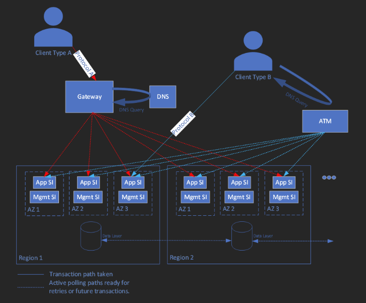

This architecture provides guidance for designing a carrier-grade solution for a telecommunication use case. The design choices focus on high reliability by minimizing points of failure and ultimately the overall downtime using native Azure capabilities. It applies the [Well-Architected](/azure/architecture/framework/carrier-grade/carrier-grade-get-started) design principles to a carrier-grade application. 

## Architecture

This reference architecture is for a voicemail solution, where multiple clients connect to a server in a shared model. They can connect using different protocols potentially for different operations. Certain operations might need to persist state in a database. Other operations can query for that data. These operations are simple request/response and don't need long-lived sessions. In case of a failure, the client will just retry the operation. 

The server has two main layers; each layer is composed of immutable service instances (SIs). They differ in their functions and lifetimes.

- Application SIs deliver the actual application function and are intended to be short-lived. 
- Management SIs only deliver the management and monitoring aspects for the application. 

All SIs are interchangeable in that any SI can service any request. Any application SI can serve a client request. More than one managment SI can service a single appliction SI. SIs are deployed in active-active mode in multiple Availability Zones and multiple regions.  

In this use case, the business requirements necessitate that the requests be served at the edge to reduce latency. As such, the application isn't required to maintain active session state relating to in-flight message processing in the event of failure. Application logic can accept an eventual consistency data replication model with distributed processing pools, instead of the application requiring global synchronization of its data with a single point of control. Also, there aren't any regulatory requirements.

## Scaling

Scale is achieved through the combination of individual SI capacity and the total number of SIs.   

The overall solution is sized such that any single region can fail and the remaining regions will still be able to service the expected traffic load. 