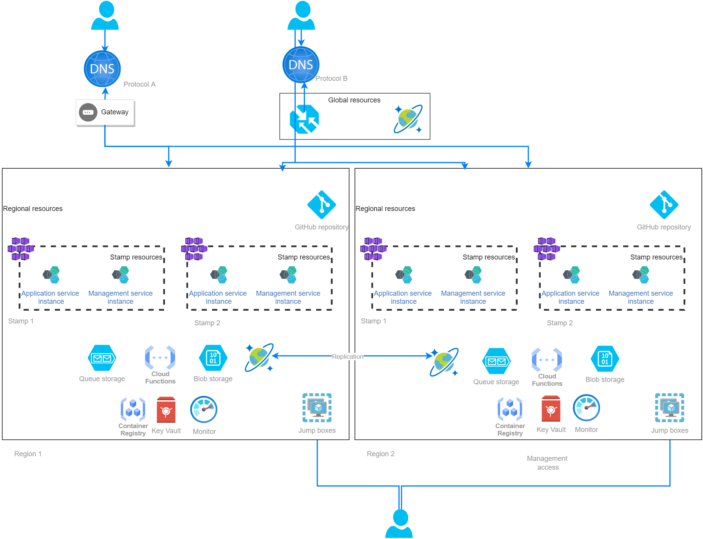
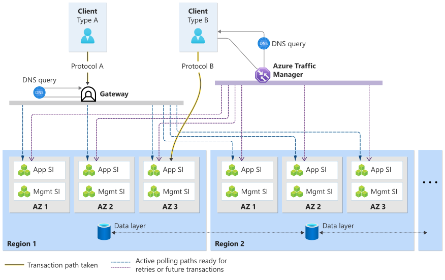

This architecture provides guidance for designing a carrier-grade solution for a telecommunication use case. The design choices focus on high reliability by minimizing points of failure and ultimately overall downtime using native Azure capabilities. 

> [!IMPORTANT] 
> This architecture is based on the design principles of a carrier-grade workload. We highly recommend that you read the guidance on [Well-Architected for carrier-grade workloads](/azure/architecture/framework/carrier-grade/carrier-grade-get-started) to understand the design choices made in this architecture. 

## Use case

This reference architecture is for a voicemail solution. It offers common functionalities such as: play greeting and record voicemail, retrieve voicemail through phone or app, configure features, and much more.  

Multiple clients can connect to the workload using various protocols. They can be HTTP or other protocols, such as SIP or IMAP. A connection may modify persisted state, which could be client configuration, messages, and related metadata.

## Workload requirements

- The workload is expected to have a Service Level Objective target of 99.999%, which equates to a total expected outage duration of less than 5 minutes per year.
- Application requests for all the supported protocols must be load-balanced across all the active stamps.
- Replication of write operations on subscriber data should be near-instantaneous across regions. In most cases, a stamp reading data should be served the latest and most up to date version of the subscriber data.
- If a failure occurs in the middle of an active subscriber voice mail session, the caller will need to reconnect. The workload isn't required to maintain active session state for in-flight messages.

## Key design strategies

- **Active-active multi-region deployment**. Deploy multiple application instances across multiple regions to minimize regional outage as a single point of failure. In an active-active model there's no separate failover procedure, so failure handling is fast and reliable.
- **Replicated storage**. Keep the application itself stateless. Data is persisted either regionally or globally and redundancy is built by replicating across regions.
- **Eventual consistency of data** is forced by the CAP theorem (Consistency, Availability, and Partition Tolerance). Implement application logic that uses conflict-free replicated data types (CRDTs) and application logic to handle intermediate states.
- **Avoid correlated failure modes**. Take independent elements and [combine them to reach a higher reliability target](/azure/architecture/framework/carrier-grade/carrier-grade-design-area-fault-tolerance#high-availability-through-combination). 
- **Shared fate within each stamp**. Aggregate all the dependencies of the stamp within that stamp. This removes the overhead of handling partial failures. If an instance is down, a new stamp replaces the unhealthy instance.

## Architecture

The workload is hosted in Azure infrastructure and several Azure services participate in processing requests and providing the service functionality. The components of this architecture can be broadly categorized as follows. For product documentation about Azure services, see [Related resources](#related-resources).

### Global resources

These resources provide functionality that is shared by resources deployed in all regions. For instance, the global load balancer that distributes traffic to multiple regions. Foundational services that other services depend on, such as the Identity platform (Azure Active Directory) and DNS. Global resources also include services that maintain functional consistency across regions, such as shared state stores and databases. 

**Azure Traffic Manager**

The global load balancer that uses DNS-based routing to send traffic to the application stamp that has public endpoints. Health endpoint monitoring is enabled to make sure that traffic is sent to healthy backend instances. 

**Azure Cosmos DB**

Stores application payload metadata and end-user provisioning data. Also used by dependent services listed above. Multi-region write is enabled so that data is replicated to each region, instantaneously. Also, zone redundancy is enabled through the zone-redundant storage (ZRS) mode.

**Gateway component** 

A custom solution component such as a Session Border Controller (SBC) that exists outside of the cloud. The gateway serves as the single endpoint for clients using protocols different than HTTP. It monitors the health of the backend endpoints and routes traffic to the healthy instances. 

> [!IMPORTANT] 
> Global routing is handled through DNS. If any global or foundational service isn't available, the entire system will be impacted.

### Regional resources

This set of services that are deployed to each region and their lifetime is tied to that region.  

**Management service**

Is a custom service that delivers the management, deployment, and monitoring aspects for the application. More than one management stamp can service a single application instance in any region.

**Azure Container Registry**

Stores all container images. Zone redundancy is enabled to safeguard against zonal failures.

**Azure Key Vault**

Stores global secrets such as connection strings to the global database and regional secrets.

**Azure Monitor**

Collects logs and metrics emitted by the workload and Azure resources. The data is stored in Azure Monitor Logs and Log Analytics Workspace.

**Virtual machine scale set**

Runs as jump box instances to run tools against the cluster, such as kubectl.

**Azure Blob Storage**

Stores large payload data, long-term metrics data, virtual machine images, application core dumps and diagnostics packages. Consider using the Premium SKU for performance depending on expected usage patterns. Storage is configured for zone-redundant storage (ZRS), object replication (OR) between regions, and application-level handling. 

**Azure Functions**

Triggers application-specific functionality as desired.

**Azure Queue Storage**

Provides additional durability via a distinct mechanism, so that if the primary storage mechanism is unavailable at the point of message deposit the message is retained safely.

> [!IMPORTANT] 
> Regional resources are independent, so that unavailability of a resource in one region does not (as far as possible) impact resources in another region. There may be simultaneous outages in multiple regions, but these are expected to be extremely rare.
>
> The resources can be further categorized by their functional requirement. Azure Blob Storage, Azure Cosmos DB, Azure Functions, Azure Queue Storage participate in processing a request. Other components such as Key Vault, Monitor, and Container Registry are used indirectly and during management operations.

### Regional stamp resources

Within each region, a set of resources are deployed as part of a deployment stamp to provide more resiliency and scale. The resources are expected to be ephemeral. They are destroyed and recreated dynamically while the regional resources outside the stamp (holding the application state) continue to persist.

**Workload compute**

Both virtual machines and containers are used to host the workload. The technology choices are the standard Azure Virtual Machine and Azure Kubernetes Service (AKS), respectively. AKS was chosen as the container orchestrator because it's widely adopted and supports advanced scalability and deployment topologies. 

## Workload design

The application is part of the stamp and is therefore immutable. Application stamps deliver the actual application function. Any application stamp can serve a client request. Stamps are deployed and monitored by the management service.

### Resiliency considerations

The services are implemented as microservices, containerized in a regional AKS cluster. The microservice pattern allows for separation of processing elements and state so that failure in one component doesn't affect others. The application is stateless and long-lived state is stored in an external database. 

To build redundancy, stamps are deployed in multiple Availability Zones and regions in an active-active model. That is, there is one stamp in each Availability Zone of each region in the deployment; all stamps are active and load is balanced across all of them.

The components within each stamp use a fate-sharing model, which simplifies logic flows and connection paths by removing the need for special-case code to handle partial failure conditions. 

### Monitoring

This implementation has a health model in place to make sure client requests aren't sent to unhealthy instances. The management service probes the application stamps at regular intervals and maintains a health status. If the health state of a particular stamp is degraded, the management service stops responding to the polling request from Traffic Manager and traffic isn't routed to that instance.  

## Traffic management

The application is fronted by a traffic management layer, which provides load balancing. Incoming traffic can be categorized based on the type of protocol:

- **Protocol A** accesses the application through an intermediate gateway component outside the cloud. The design uses [gateway routing pattern](/azure/architecture/patterns/gateway-routing) and the gateway serves as the single endpoint and routes traffic to multiple backend stamps. 

- **Protocol B** routes HTTP or non-HTTP traffic to the application in multiple regions. Azure Traffic Manager is used as global load balancer and routes traffic based on DNS.

The internal load balancer distributes incoming requests to the stamp pods. The services are reachable through their DNS names assigned by native Kubernetes objects.

### Reliability considerations 

Azure Traffic Manager is on the critical path for clients. If Traffic Manager is unavailable, the system will appear as offline to the clients. So, when calculating the composite SLA target for the system, the Traffic Manager SLA must be considered, and careful attention given to TTL configuration, client retry periods, and so on.

Like Azure Traffic Manager, the gateway is also a single point of failure and thus should be designed with internal redundancy. Failure will impact new client connections and existing clients after the cached DNS entry expires.

If a backend service is unavailable, Traffic Manager and gateway won't update the DNS record until DNS time-to-live (TTL) has expired. So, this time must be short. Clients will continue to reach the last-known address. Use Azure policies to enforce termination of long-running calls or connections that still exist.

Both Traffic Manager and gateway depend on Azure DNS, as a foundational service, to reduce complexity and provide higher Service Level Agreement (SLA). In principle, an Azure DNS outage could lead to a full outage. However Azure DNS is highly redundant with a 100% availability SLA, and clients with existing connections or appropriate caching can continue to operate even if DNS is unavailable for a short period.

### Health monitoring

The health model makes sure client requests aren't routed to unhealthy instances. The traffic management layer polls the backend management service before routing traffic. 

For Protocol A, the gateway is responsible for endpoint monitoring. It receives a prioritized list of stamp access points from a DNS server and uses active polling to determine stamp liveness. 

For Protocol B, Azure Traffic Manager has built-in polling capabilities that minimize the chance of sending traffic to an unresponsive stamp. Unhealthy endpoints are excluded in the DNS response to clients. This approach helps reliability because a client’s first attempt to reach a server will most likely be successful. 

## Data consistency

For carrier-grade workloads, it's recommended that crucial data related to the workload is stored externally (the stateless pattern).  Writing to the database is a critical process for this use case.

Data should be regionally replicated in an active-active configuration, so that it is rapidly synchronized across regions. The database should be configured with multiple write regions. Both read and write can be performed against all regions. This ensures that if there is a failure of either workload or database in any region, the workload can continue to service requests from other regions seamlessly. 

In this architecture, Azure Cosmos DB was chosen as the global database because it supports the multiple write region model. If there's a global outage, consistent data is available in multiple regions almost instantly. Also, zonal redundancy is guaranteed through use of zone redundant storage (ZRS).

This architecture also uses Azure Blob Storage to store supplementary data, such as long-term metrics data, application core dumps, and diagnostics packages. The resource is configured to use zone-redundant storage (ZRS) with [object replication](/azure/storage/blobs/object-replication-overview) between regions. This combination was chosen because it allows control of the secondary region and storage tier, that is, premium primary copy and hot-cool secondary copy. For this use case, it's also a cost-effective way of replicating data. 

> Refer to [Well-Architected carrier-grade workloads: Data model](/azure/architecture/framework/carrier-grade/carrier-grade-design-area-data-model).

## Multi-region deployment - scalability, availability, and cost

The workload is deployed across multiple regions, and across multiple Availability Zones within each region. This provides resilience against failures at both zone and region level.

Scale is achieved through the combination of individual stamp capacity and the total number of instances.  The overall solution is sized such that up to one entire region can fail but the remaining regions can still service the expected maximum traffic load. This means a two-region deployment needs 100% headroom (2x overprovisioned), whereas a four-region deployment needs only 33% headroom.

Headroom considerations favor a larger deployment. However constant per-instance overheads and constant per-region availability rate favor a smaller deployment; availability and cost modeling are required in order to determine the best topology for a given workload. Connectivity, locality, and data residency requirements may also impact region selection.

The capacity of each individual stamp is adjusted based on load testing results that predict load variations. Autoscaling is enabled for the service and cluster by using AKS Cluster Autoscaler and Kubernetes Horizontal Pod Autoscaler. There are components that scale manually. For these components, scale limits are defined in the configuration and scaling is handled as an upgrade operation.  

## Overall observability

Logs and metrics emitted by the workload and by Azure resources are collected and stored in Azure Monitor Logs and Blob Storage. They are handled by the management service in each Availability Zone and not replicated outside each zone, because the additional cost isn't justified in this case. Application-wide monitoring is achieved through use of federated queries across the management service in each zone. Monitoring data is retained so that diagnosis can be performed after the fact, allowing fault resolution.

Alerts are set up by the application instances. Metric threshold events are replicated across all zones and regions so they're always available. 

> Refer to [Well-Architected carrier-grade workloads: Health modeling](/azure/architecture/framework/carrier-grade/carrier-grade-design-area-health-modeling).

## Operational considerations

The operational aspect of the architecture is key to achieving high availability. This covers automation, deployment, secret management decisions of the architecture.

### Deployment

Application source code and configuration are stored in a Git repository in Azure DevOps. A GitOps approach is used for continuous integration/continuous deployment (CI/CD). 

Flux is the GitOps operator that responds to changes and triggers a scripting tool to create Azure resources for the stamps. These include virtual machines, AKS cluster, convergence pods, and updates DNS for service discovery of the new instance. Scaling requirements are also met by GitOps. For manual scaling, scale limits are defined in the stamp configuration. Scaling is achieved through the upgrade process that creates new instances of the required size and then replaces the current one. 

Conversely, Flux also decommissions resources that aren't required. For example, if a particular instance shouldn't receive traffic, Flux reacts to the configuration change. It triggers DNS updates to stop new traffic from reaching the instance. Also, when definition files are removed, GitOps triggers scripting to gracefully delete the cluster, virtual machines, and other Azure resources. Resources are decommissioned as part of scaling in operations. 

### Upgrade, patching, and configuration updates

When a new instance is created, the deployment config files are changed to indicate an increase in traffic to the new instance and decrease traffic to the old instance. Flux detects this change and updates the DNS records. Traffic is reverted to the old instance if there are errors. Otherwise, the old instance is decommissioned. 

### Automation

Automation is fundamental to the overall resiliency given the required reaction times. Various automation technologies are used in the operational flow. However, it's also critical that there are manual gates in the end-to-end process to ensure errors aren't introduced and propagated through automation. 

> Refer to [Well-Architected carrier-grade workloads: Fault tolerance](/azure/architecture/framework/carrier-grade/carrier-grade-design-area-fault-tolerance).

## Testing and validation

From an availability perspective, failure mode analysis is extended to include all network segments between application components. Also, between the application and the clients because outages will still impact availability of the application as perceived by the users. 

> Refer to [Well-Architected carrier-grade workloads: Testing and validation](/azure/architecture/framework/carrier-grade/carrier-grade-design-area-testing).

## Alternatives

- Instead of Storage Queue, you can choose another message broker that has reliability guarantees. Azure Service Bus is a good option because it has two-phase commits and features such as a built-in dead letter queue and deduplication capabilities.

- Another option for global routing of HTTP traffic (not other protocols) is Azure Front Door. It has built-in Web Application Firewall (WAF) capabilities applied to secure Layer 7 ingress traffic.

- Azure Functions can be used to provide additional features, even including time-dependent function such as delayed messages or delayed notifications.

## Related resources

For product documentation on the Azure services used in this architecture, see these articles.

- [Azure Traffic Manager](/azure/traffic-manager/)
- [Azure Cosmos DB](/azure/cosmos-db/)
- [Azure Container Registry](/azure/container-registry/)
- [Azure Key Vault](/azure/key-vault/)
- [Azure Kubernetes Service](/azure/aks/)
- [Azure Application Insights](/azure/azure-monitor/)
- [Azure Blob Storage](/azure/storage/blobs/)
