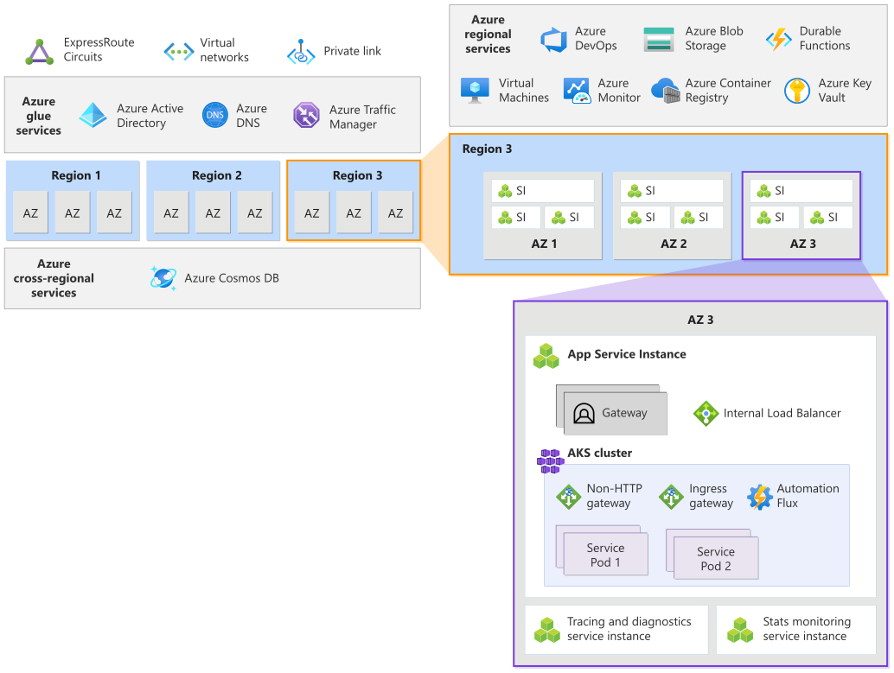

This architecture provides guidance for designing a carrier-grade solution for a telecommunication use case. The design choices focus on high reliability by minimizing points of failure and ultimately the overall downtime using native Azure capabilities. 

> [!TIP] This architecture is based on the design principles of a carrier-grade workload. We highly recommend that you read [Well-Architected](/azure/architecture/framework/carrier-grade/carrier-grade-get-started) documentation to undersand the design choices made in this architecture. 

## Use case and business requirements

This reference architecture is for a voicemail solution, where multiple clients connect to the workload in a shared model. They can connect using different protocols potentially for different operations. Certain operations might need to persist state in a database. Other operations can query for that data. These operations are simple request/response and don't need long-lived sessions. In case of a failure, the client will just retry the operation. 

In this use case, the business requirements necessitate that the requests be served at the edge to reduce latency. As such, the application isn't required to maintain active session state for in-flight messages if failure occurs. Application logic can accept an eventual consistency data replication model with distributed processing pools, instead of the application requiring global synchronization of its data with a single point of control. Also, there aren't any regulatory requirements.

## Architecture

The workload is hosted in Azure infrastructure and several Azure services participate in processing requests and the operations. The components of this architecture can be broadly categorized in this manner. For product documentation about Azure services, see [Related resources](#related-resources).

### Global resources

These resources provide functionality that's shared by resources deployed in regions. For instance, the global load balancer that distributes traffic to multiple regions. Foundational services that other services depend on, such as the identity platform. Global resources also include services that maintain functional consistency across regions, such as shared state stores and databases. 

**Azure Traffic Manager**

The global load balancer that uses DNS-based routing to send traffic to the application SI that have public endpoints. Health endpoint monitoring is enabled to make sure that traffic is sent to healthy backend instances. 

An alternate technology choice is Azure Front Door. This option only applies to HTTP(S) traffic and can add to the cost. 

**Azure DNS** 

Handles traffic that flows through the intermediate gateway. The gateway is responsible for monitoring the health of the backend endpoints.

**Azure Cosmos DB**

Stores application payload metadata and end-user provisioning data. Also used by dependent services listed above. Multi-master write is enabled so that data is replicated to each region. Also, zone redundancy is enabled through availability zone redundancy support (AZRS). 

> [!IMPORTANT] 
> If any global service is unavailable, the entire system will be impacted. If Azure DNS is unavailable, Traffic Manager won't be able to route traffic. If Azure AD fails, existing compute nodes will continue to work, however, new nodes won't be created. 

### Regional resources

This set of services that are deployed to a given region and their lifetime is tied to the region. They are independent in that unavailability of a resource in one region shouldn't impact resources in another region. There might be simultaneous outages in multiple regions but the impact must be restricted to the individual region.

**Workload compute**

Both virtual machines and containers are used to host the workload. The technology choices are the standard Azure Virtual Machine and Azure Kubernetes Service (AKS), respectively. AKS was chosen as the container orcherstrator because it's widely adopted and supports advanced scalability and deployment topologies. 

**Azure Container Registry**

Stores all Open Container Initiative (OCI) artifacts. Zone redundancy is enabled. 

**Azure Key Vault**

Stores global secrets such as connection strings to the global database and regional secrets.

**Azure Blob Storage**

Premium SKU is used for large payload data, long-term metrics data, virtual machine images, application core dumps and diagnostics packages. Storage is configured for  zone-redundant storage (ZRS), object replication (OR) between regions, and application-level handling. 

## Workload design

The workload has two main layers; each layer is composed of immutable service instances (SIs). They differ in their functions and lifetimes.

- Application service delivers the actual application function and are intended to be short-lived. 
- Management service only deliver the management and monitoring aspects for the application. 

All SIs are interchangeable in that any SI can service any request. Any application SI can serve a client request. More than one managment SI can service a single appliction SI.  

### Resiliency considerations

The services are implemented as microservices, containerized in a regional AKS cluster. The microservice pattern allows for separation of processing elements and state so that failure in one component doesn't affect others. The SIs are stateless and long-living state is stored in an external database. 

To increase reliability, the cluster uses AKS Uptime SLA that SLA guarantees 99.95% SLA availability of the AKS control plane. SIs are deployed in multiple Availability Zones and regions in an active-active model. An application SI and its associated management and monitoring SIs are colocated in the cluster, so a local failure terminates both the application SI and all related SIs. 

> TODO: Why?! Although the diagram shows multiple AZs, the pattern does not rely on AZs. It would be perfectly acceptable to deploy multiple application SIs into a single zone. Equally, use of single-AZ regions is fully supported, subject to the overall capacity requirements of the workload.

The components within each SI use a fate-sharing model, which simplifies logic flows and connection paths by removing the need for special case code to handle partial failure conditions. 

### Monitoring

This implementation has a health model in place to makes sure client requests aren't sent to unhealthy instances. The management SIs probe the application SIs at regular intervals and maintain a health status. If the health state of a particular SI is degraded, the management SI stops responding to the polling request and traffic isn't routed to that instance.  

 ### Scalability considerations

The capacity of the individual SIs is adjusted as needed to handle predictable load variations (such as busy hours and weekdays/weekends).  This provides efficiencies in the platform resource costs. 

> TODO: Does this mean autoscaling is enabled on the pod and the cluster? 

## Traffic management

The application is fronted by a traffic management layer which provides load balancing. Incoming traffic can be categorized based on the type of protocol:

- **Protocol A** accesses the application through an intermediate gateway component outside the cloud. The design uses [gateway routing pattern](/azure/architecture/patterns/gateway-routing) in which the gateway serves as the single endpoint and routes traffic to multiple backend SIs. 

- **Protocol B** routes internet traffic to the application in multiple regions. Azure Traffic Manager is used as global load balancer and routes traffic based on DNS. 

The internal load balancer distributes incoming requests to the SI pods. The services are reachable through their DNS names assigned by native Kubernetes objects.

### Health monitoring

The health model makes sure client requests aren't routed to unhealthy instances. The traffic management layer polls the backend management SIs before routing traffic. 

For Protocol A, the gateway is responsibile for endpoint monitoring. It receives a prioritized list of SI access points from a DNS server and uses active polling to determine SI liveness. 

For Protocol B, Azure Traffic Manager has its own active polling that minimizes the chance of sending traffic to an unresponsive SI. Unhealthy endpoints are excluded in the DNS response to clients. This approach helps reliability because a client’s first attempt to reach a server will most likely be successful. 

### Reliability considerations 

> TODO Is the gateway single point of failure then? What fault tolerance capabilities are in place to avoid this situation.

In the Protocol A routing pattern, the gateway can be a single point of failure. Azure Global DNS is chosen to reduce complexity and higher Service Level Agreement (SLA). 

Traffic Manager is on the critical path for clients making their initial connection and for clients whose existing cached DNS records have expired. If Traffic Manager is unavailable, the system will appear as offline to the clients. So, when calculating the composite SLA target for the system, Traffic Manager SLA must be considered. 

> TODO In choosing TM, we don't get WAF. So security can bring down the reliability.

## Data consistency

The documented guidance10 for Cosmos DB is to use the single-write region option with service-managed failover for high availability in case of region outage.  However, the reference architecture instead uses the multi-write region model (with availability zone redundancy support – AZRS).  This is because the Cosmos DB process for handling failure of the write region is to bring up a new write instance in another region.  Even with service-managed instances, this will take at least minutes, and can be much longer.  Since writing to the database is a critical process for the reference application, such a global outage duration cannot be tolerated, and so the multi-write region option is the only acceptable choice.  This in turn requires the use of conflict-free replicated data types (CRDTs) within the application, as discussed in the Considered Data Model section of the Appendix. 

An application which had less demanding outage requirements on the ability to write data might be able to use the single-write region option. 

Cosmos DB is selected over other replicated database options since it is the only NoSQL database which is an Azure 1st Party managed service. 

ABS: This combination provides the best compromise for a cost-effective GR storage solution for the volumes of data needed for the reference application.  ZRS plus OR is chosen over GZRS because it allows control of the secondary region and storage tier (premium primary copy and hot/cool secondary copy). 

## Scaling

Scale is achieved through the combination of individual SI capacity and the total number of SIs.   

The overall solution is sized such that any single region can fail and the remaining regions will still be able to service the expected traffic load. 

## Testing and validation

From an availability perspective, what is important is that the failure mode analysis is extended to include all network segments between elements of the application, and between the application and the clients, since outages here will still impact availability of the application as perceived by the users. 

## Related resources
For product documentation on the Azure services used in this architecture, see these articles.

Azure Front Door
Azure Cosmos DB
Azure Container Registry
Azure Log Analytics
Azure Key Vault
Azure Service Bus
Azure Kubernetes Service
Azure Application Insights
Azure Event Hubs
Azure Blob Storage