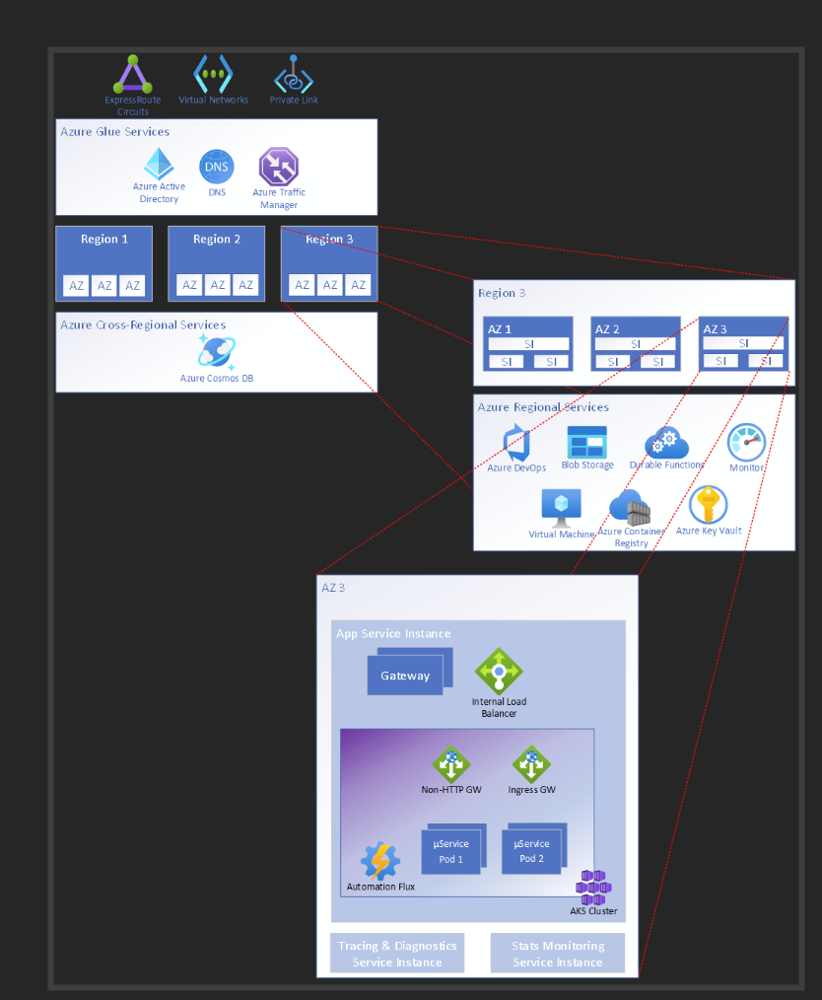

This architecture provides guidance for designing a carrier-grade solution for a telecommunication use case. The design choices focus on high reliability by minimizing points of failure and ultimately the overall downtime using native Azure capabilities. It applies [Well-Architected](/azure/architecture/framework/carrier-grade/carrier-grade-get-started) design principles to a carrier-grade workload. 

## Architecture

This reference architecture is for a voicemail solution, where multiple clients connect to the workload in a shared model. They can connect using different protocols potentially for different operations. Certain operations might need to persist state in a database. Other operations can query for that data. These operations are simple request/response and don't need long-lived sessions. In case of a failure, the client will just retry the operation. 

In this use case, the business requirements necessitate that the requests be served at the edge to reduce latency. As such, the application isn't required to maintain active session state for in-flight messages if failure occurs. Application logic can accept an eventual consistency data replication model with distributed processing pools, instead of the application requiring global synchronization of its data with a single point of control. Also, there aren't any regulatory requirements.

The workload has two main layers; each layer is composed of immutable service instances (SIs). They differ in their functions and lifetimes.

- Application SIs deliver the actual application function and are intended to be short-lived. 
- Management SIs only deliver the management and monitoring aspects for the application. 

The workload is hosted in Azure infrastructure and several Azure services participate in processing requests and the operations related to the workload. 

The components of this architecture can be broadly categorized in this manner. For product documentation about Azure services, see [Related resources](#related-resources).

### Global resources

These resources provide functionality that's shared by resources deployed in regions. For instance, the global load balancer that distributes traffic to multiple regions. The global resources can also be foundational services that other services depend on.

#### Azure Traffic Manager

is the global load balancer that uses DNS-based routing to send traffic to the application SI that have public endpoints. Health endpoint monitoring is enabled to make sure that traffic is sent to healthy backend instances. Unhealthy endpoints are excluded in the DNS response to clients. This helps boost reliability because a client’s first attempt to reach a server will most likely be successful. 

Traffic Manager is on the critical path for clients making their initial connection and for clients whose existing cached DNS records have expired. If this service is unavailable, the system will appear as offline to the clients. So, there's a reliability dependency on this service to achieve the overall reliability targets. 

An alternate technology choice is Azure Front Door. This option only applies to HTTP(S) traffic and can add to the cost. 

#### Azure Global DNS 

Azure Global DNS is used within the architecture where the additional features of ATM are not required, since it is simpler and (currently) has a higher SLO.  Within the reference architecture, this means Global DNS is primarily used to handle the protocol traffic which flows through the intermediate gateway.  This is marked Protocol A traffic in the earlier diagram.  Here, the intermediate gateway takes on the responsibility for endpoint monitoring. 

See here for the set of application feature requests in ADO  

Azure Networking 

Depending on the specific application, and the details of the deployment, the exact networking requirements can vary significantly, and so they are not dwelt on here.  Any given instance of the architecture is likely to use some or all of vNets, vNet peering, ExpressRoute, Private Endpoints and Private DNS Zones.  From an availability perspective, what is important is that the failure mode analysis is extended to include all network segments between elements of the application, and between the application and the clients, since outages here will still impact availability of the application as perceived by the users. 

If any global services is unavailable, the entire system will be impacted. If Azure DNS is unavailable, Traffic Manager won't be able to route traffic. If Azure AD fails, existing compute nodes will continue to work, however, new nodes won't be created. 

#### Global resources

All SIs are interchangeable in that any SI can service any request. Any application SI can serve a client request. More than one managment SI can service a single appliction SI. SIs are deployed in active-active mode in multiple Availability Zones and multiple regions.  

## Scaling

Scale is achieved through the combination of individual SI capacity and the total number of SIs.   

The overall solution is sized such that any single region can fail and the remaining regions will still be able to service the expected traffic load. 

## Related resources
For product documentation on the Azure services used in this architecture, see these articles.

Azure Front Door
Azure Cosmos DB
Azure Container Registry
Azure Log Analytics
Azure Key Vault
Azure Service Bus
Azure Kubernetes Service
Azure Application Insights
Azure Event Hubs
Azure Blob Storage