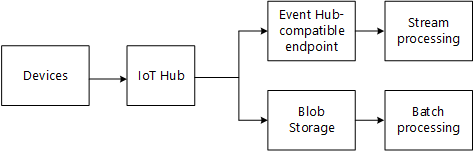
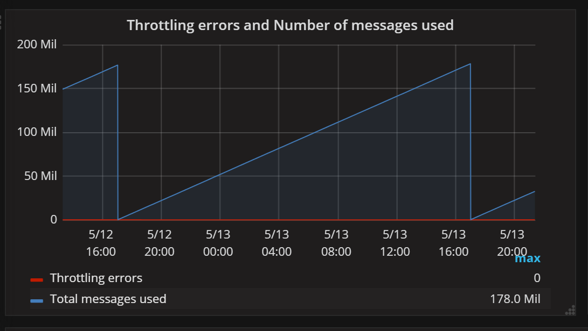

# Ingesting messages from IoT devices into the cloud

This chapter describes how to get data from IoT devices into the cloud.

## Requirements 

**High scale ingestion**. Even a moderately sized IoT solution generates a lot of data. For our basic reference implementation, we targeted 10,000 devices, with each device sending an event every 5 seconds, for a total throughput of 2000 events/second. That's on the low end for an IoT scenario. Even if you start with a small number of devices, that number can grow over time. The price of success is ever greater demands on the system.

**Low latency**. Many IoT solutions need to operate in near-real-time, which means minimizing the latency introduced by message ingestion and processing.

**Multiple event receivers**. Typically you will process the same device data in multiple ways, using more than one data processing pipeline. The previous chapter introduced the concept of hot, warm, and cold paths. These paths will consume the data at different rates. The hot path typically uses stream processing, while the cold path uses batch processing.

**Durable storage**. Messages should be retained for a period of time, so they can be reprocessed. 

**Device authentication**. The cloud gateway should only accept connections from authenticated devices. There may be thousands or tens of thousands of devices. If devices share the same credentials, and one device is compromised, then all the devices are compromised. Instead, every device should have unique credentials, making it possible to revoke individual devices.

## Technology choices

For most solutions, we recommend [Azure IoT Hub](https://docs.microsoft.com/en-us/azure/iot-hub/about-iot-hub), which is specifically designed for IoT scenarios. It provides some important capabilities that most IoT solutions require:

- High-scale event ingestion
- At-least-once delivery semantics
- Multiple independent event consumers, using the same programming model as Azure Event Hubs. 
- Support for cloud-to-device messages.
- Per device authentication and security, including the ability to revoke individual devices.
- Monitoring of device connectivity.
- The ability to route events to different outputs based on filtering criteria
- Ability to capture events directly into storage.

Azure Event Hubs and Apache Kafka are also viable options, as both of these technologies support event streaming at high scale. However, they lack some of the other features listed above, particularly support for per-device authentication. 

For more information about choosing between IoT Hub and Event Hubs, see:

- [Connecting IoT Devices to Azure: IoT Hub and Event Hubs](https://docs.microsoft.com/en-us/azure/iot-hub/iot-hub-compare-event-hubs)
- [Choose between Azure services that deliver messages](https://docs.microsoft.com/en-us/azure/event-grid/compare-messaging-services)

IoT Hub has a built-in endpoint that is compatible with the Azure Event Hubs API. Messages can also be [captured](https://docs.microsoft.com/en-us/azure/iot-hub/iot-hub-devguide-messages-read-custom) directly into blob storage.

Generally you should use the Event Hubs endpoint for stream processing (hot and warm path), and blob storage for batch processing cold path).

When using the Event Hubs endpoint, it's important to understand the streaming model: 

- Event consumers (readers) read the event stream independently at their own pace. Although multiple consumers can read a stream, each reads the stream independently. A consumer is responsible for keeping track of its current position in the stream.

- A consumer writes its current position to persistent storage at some predefined interval. That way, if the consumer experiences a fault, a new instance can restart at the last recorded position. This process is called checkpointing. In practice, you rarely need to write any checkpointing code, because it's handled by client SDKs, or by using built-in integration features of Azure. For example, Azure Stream Analytics can read from Event Hubs, which doesn't require writing any code.

- An event hub uses partitions to increase throughput. Horizontal scale is achieved by assigning a separate reader to each partition and reading the partitions in parallel. Incoming messages are partitioned based on the device ID. All of the messages from a particular device will always arrive on the same partition, but a single partition will have messages from multiple devices.

For more information, see [Event Hubs features overview](https://docs.microsoft.com/en-us/azure/event-hubs/event-hubs-features).

## Scaling considerations

For IoT Hub, the considerations for scaling include:

- The maximum daily quota of messages into IoT Hub.
- Ingestion throughput. How quickly IoT Hub can ingest messages.
- Processing throughput: How quickly the incoming messages are processed.

Each IoT hub is provisioned with a certain number of units in a specific tier. The tier and number of units determine the maximum daily quota of messages that devices can send to the hub. For more information, see [IoT Hub quotas and throttling](https://docs.microsoft.com/en-us/azure/iot-hub/iot-hub-devguide-quotas-throttling). 

You can scale up a hub without interrupting existing operations. However, IoT Hub does not currently support auto-scaling. For production workloads, always monitor the [quota metrics](https://docs.microsoft.com/en-us/rest/api/iothub/iothubresource/getquotametrics) for the hub, and manually scale the hub if needed. The following graph plots the number of messages applied toward the daily quota. Notice that it resets to zero at the start of each day. 

You can open a support request to increase the maximum quota for a hub. If you still need more throughput than a single IoT Hub instance can provide, you will need to create multiple IoT Hub instances. You can use the IoT Hub Device Provisioning Service to automate the process of assigning devices to hubs, without needing to pre-allocate devices to hubs. For more information, see [Provision devices across load-balanced IoT hubs](https://docs.microsoft.com/en-us/azure/iot-dps/tutorial-provision-multiple-hubs). 

Another way to handle very high traffic is to use a [field gateway](./field-gateways.md) to reduce the volume of data from each device. A field gateway can aggregate or filter the raw telemetry before sending it to the cloud. 

Ingestion is one side of the equation. The other side is processing messages quickly enough to keep up with the ingestion rate. When using Event Hubs to process messages, the number of parallel readers may be a bottleneck. The maximum rate that you can process messages is determined by how fast one reader can read over a single partition. Make sure to create enough IoT Hub partitions for your expected load. Use load testing to validate your throughput. In your load tests, scale to your expected message rate and number of devices.

## Device simulators

For development and testing, you will need a device simulator. This is an application that can send synthetic telemetry to the cloud gateway.

A simulator lets the development team work on their code without needing to configure actual devices. The simulator can be programmed to generate specific message payloads, for testing specific scenarios or code paths. Finally, a simulator allows you to load test the solution. 

Here are some considerations when creating a device simulator. 

- Telemetry generated by the simulator should be as realistic as possible, in terms of message format, payloads, and patterns in the data. 

- The simulator should be easy to configure and deploy, so that developers and DevOps teams can spin up simulator instances as needed. Consider containerizing the simulator. That way, you can easily deploy instances using a container orchestrator such as Service Fabric or Azure Kubernetes Service (AKS), and scale out as needed.

- For load testing, the simulator should support configurable step loads. For example, you might run a load test that starts with 1000 simulated devices, and ramps up to 20,000 devices at increments of 1000. When you generate load, consider the target throughput (messages per second), the number of simulated devices, and the number of simultaneous connections.

During load testing, the simulator itself can become a bottleneck. For example, if the simulator creates a thread for each simulated device, the simulator may become thread bound. You should monitor the simulator host for CPU, memory, and I/O consumption. At high scale, a cluster of simulators can also hit networking limits, where adding more simulator instances doesn't help. For example, with a large number of simulated devices, it's possible to experience SNAT port exhaustion. For more inforation, see [Outbound connections in Azure](https://docs.microsoft.com/en-us/azure/load-balancer/load-balancer-outbound-connections).

