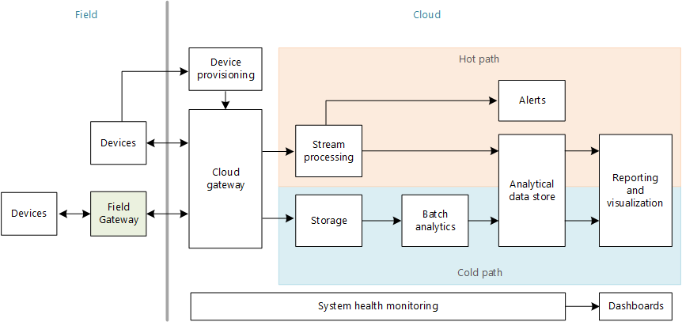
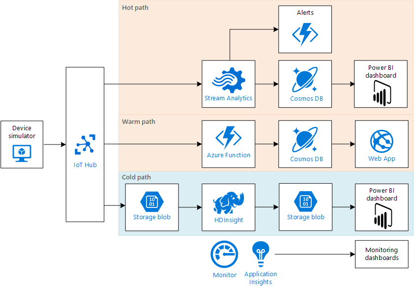

# Architecture of an IoT solution

The following diagram shows the functional components of a typical IoT solution. Numerous variations exist, but this diagram forms a baseline for discussion. 

 

## Logical architecture

This logical architecture consists of the following functional blocks:

**Devices**. Devices are the "things" in the Internet of Things. A device consists of one or more sensors plus a microprocessor. A sensor is a component that measures some physical state, such as temperature or position. The device takes periodic readings from the sensors and transmits them over a local network or the internet. A device may perform some computation processing on the sensor readings before sending them. The stream of sensor data that is sent from a device is called the device telemetry.

**Field gateway**. In some cases, devices connect directly to the cloud. However, many devices are very constrained in terms of processing and battery power. Such devices might not be able to connect to the internet. In that case, devices will connect to a *field gateway*, sometimes called a *device gateway*. The field gateway is an appliance that mediates between devices and the cloud. It's usually installed close to the devices. Devices use a local network to send telemetry to the field gateway. The field gateway sends the data to the cloud. Constrained devices aren't the only reason to deploy a field gateway, however. A field gateway can provide additional security or message processing capabilities. The chapter Field Gateways describes these considerations.

**Cloud gateway**. A cloud gateway handles message ingestion at the cloud. The cloud gateway is hosted as a cloud service. It provides one or more endpoints for devices to connect to the cloud, and acts as a message broker between the devices and the cloud. Some IoT scenarios require two-way communication, with the cloud gateway sending command-and-control messages to devices. The cloud gateway also handles device authentication.  

**Device provisioning**. Before a device can send telemetry to the cloud, it must be registered with the cloud gateway, including cryptographic secrets that are needed to connect to the cloud gateway. 

**Processing telemetry data**. The goal of an IoT system is to derive insights from the device telemetry. At a high level, there are two characteristic patterns for processing telemetry data, which can be labeled **hot path** and **cold path**. The difference has to do with requirements for latency and data access.

- The **hot path** analyzes data in near-real-time, as it arrives. Typical scenarios for the hot path include alerting and presenting real-time dashboards. In the hot path, telemetry must be processed with very low latency. The total latency is the amount of time from when a sensor records a measurement to when that measurement can be acted on. The hot path is typically built using a stream processing engine such as Azure Stream Analytics, Apache Storm, or Apache Spark. The results of stream processing can trigger alerts or get written to a structured format that can be queried using analytical tools

- The **cold path** performs batch processing at longer intervals (hourly or daily). Typical scenarios involve mining historical data for business insights or machine learning. The cold path typically operates over large volumes of data, but the results don't need to be as timely as the hot path. In the cold path, raw telemetry is captured and then fed into a batch process such as a MapReduce job.  

    The cold path is not the same as *cold storage*. The term cold storage refers to a data store that is archived and rarely accessed. Azure Archive Blob Storage and Amazon Glacier are examples of cold storage. However, the results from the cold path are typically used for interactive analytic queries, where cold storage would not be appropriate.

- In some cases, it's also useful to define a **warm path**. The warm path is similar to the hot path, except the hot path has stricter latency requirements. For example, if the hot path has latency on the order seconds or a minute, the warm path may have a latency of several minutes or longer. However, there's no precise cutoff that distinguishes "hot" from "warm."

    The warm path often supports the hot path. For example, the hot path might trigger an alert, while the warm path shows the last hour of telemetry data in a dashboard. An operator who receives the alert will use the warm-path dashboard to drill more deeply into the data. 

The hot, cold, and warm paths all feed into data visualization and reporting tools, such as Power BI dashboards. 

**Monitoring**. As with any distributed system, it's critical to monitor all of the components of the solution and correlate KPIs. Operators need access to dashboards that give insight into the health of system. 

## Batch processing versus stream processing

There are two general approaches to processing large amounts of data: Batch processing and stream processing. Batch processing corresponds to the cold path described above, while stream processing corresponds to the hot and warm paths. Many solutions use a combination of stream processing and batch processing. 

With batch processing, you collect and store a batch of data over some period of time, and then process the batch. The batch size may typically range from an hour to a day, depending on how often you run the batch job. Consider batch processing if you process large aggregates of data (hours or days) to find historical trends or make statistical inferences, and you don't require the answers in real time.

With stream processing, events are processed as they arrive. Messages can be processed individually or across short time windows (seconds or minutes). Some stream processing solutions use "micro-batching," where small batches of data are processed in chunks (on the order of tens to hundreds of messages per batch). Micro-batching is still considered to be a form of stream processing, because the time windows are still small. However, micro-batching can result in higher latencies than pure stream processing, depending on the batch size. Stream processing is appropriate when you need to process the data continuously and get the results quickly, in real time or near real time. The tradeoff can be a loss in accuracy, because the processing operates over very small time windows.

## Example architecture

The following diagram shows how we implemented the Drone IoT sample application in Azure.

 
**Device simulator**. A device simulator runs on a virtual machine. It sends simulated telemetry to the cloud gateway (IoT Hub). For load testing, we ran the simulator in a Kubernetes cluster so that we could easily scale out. You could use any container orchestrator for this purpose.

**Cloud gateway**. IoT Hub acts as the cloud gateway, ingesting telemetry from the drones. 

**Hot path**. The hot path monitoring the drones' operating status to detect anomalies in the engine temperature. If uses Azure Stream Analytics to compute the average engine temperature of each drone over a 2-minute window. If the average temperature goes above a certain threshold, it may indicate a problem with the engine. Anomolous readings are stored in Cosmos DB and also trigger an alert. The sample application includes stub code for the alerts, but you could replace this with code to send an SMS message or a push notification to a mobile app.

**Warm path**. The warm path uses an Azure Function to writes the latest position data for each drone into Cosmos DB. The data can then be queried using geo-spatial queries. For example, you can query for all drones within a given area. 

**Cold path**. The cold path captures all of the raw telemetry and then processes it using HDInsight. The sample application includes a Hive query that summarizes the pickup and dropoff times for each delivery, based on the location data from the drones.  You can then use Power BI to explore and visualize the results. 

**Azure Monitor** and **Application Insights** collect system metrics, application metrics, and logs. To display the metrics, we created dashboards using both the Azure Portal and Grafana. The sample application includes an Azure Resource Manager template to deploy the Azure Portal dashboard. 

