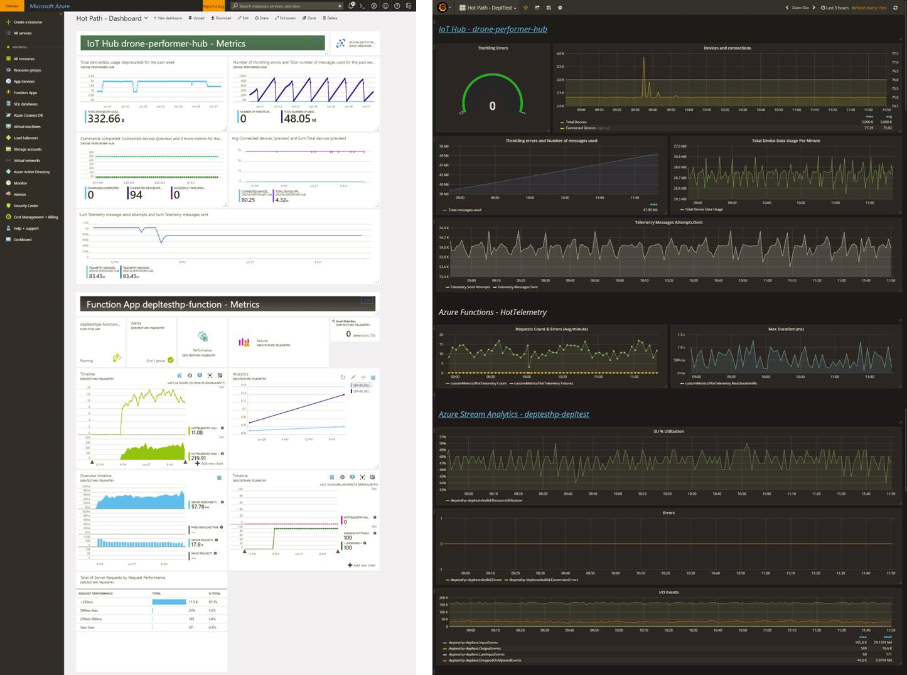

# Monitoring

It's important to monitor the health and performance of any application, and IoT is no exception.  The purpose of monitoring is to measure performance and uptime, track the health of the system, observe failures, and be able to find the cause of failures.

For applications that run in the cloud, you have to monitor two distinct aspects of the system:

- **Infrastructure monitoring**. You should monitor all of the cloud services used in your application. For example, monitor the number of messages ingested by your IoT Hub instance, or whether a service is throttling requests. Use Azure Monitor to monitor Azure services. This service is built into the Azure platform and does not require any additional code in your application. 

- **Application monitoring**. An application should be instrumented to product run-time metrics and application logs. Metrics are numerical values that can be analyzed. Use them to observe the system in real time, or analyze performance trends over time. Logs are records of events that occur while the application is running. They include things like application logs (trace statements) or web server logs. Logs are primarily useful for forensics and root cause analysis. Consider using Application Insights for application metrics and logs.

It's no good collecting all of this data unless you can see the data and act on it. Broadly speaking, there are three main ways that you will consume monitoring data:

- **Alerts**. If a critical failure happens, such as a subsystem fails, the monitoring system should send an alert, so that operators know to respond. Azure Monitor allows you to create alert rules based on a set of criteria, such as a metric hitting a certain threshold.

- **Dashboards**. A dashboard is a visual representation of the monitoring data. You can create a dashboard in the Azure Portal, or use a third-party dashboard.

- **Ad hoc queries**. Distributed systems tend to generate a large volume of logs and traces. To perform root-cause analysis, you must be able to query all of your logs. Azure Log Analytics is an analytics engine that can collect data from Azure Monitor, Application Insights, and other sources.

## Creating a monitoring dashboard

A dashboard provides a way to visualize the application metrics. When creating a dashboard, consider the following two options:

- Create a custom dashboard in the Azure Portal. This option is very easy to create and deploy, because Azure Monitor and Application Insights are both integrated into the portal. You can create a custom dashboard from a set of existing resources in Azure. Then you can download an Azure Resource Manager template for the dashboard and use it to automate deployment the dashboard. By parameterizing the template, you can make it a part of your CI/CD pipeline. For more information, see Programmatically create Azure Dashboards.

- Use a third-party dashboard that integrates with Azure Monitor. For example, plugins are available for Grafana or Datadog. This approach requires some additional work to set up, but lets you take advantage of advanced features provided by those dashboards, such as heatmaps and other visualizations.

For our own load testing, we built two dashboards, one using the Azure Portal, and one using Grafana. The two dashboards pull from the same data sources. Here you can see them side-by-side:

A good monitoring dashboard should make it easy to tell at a glance when key metrics are in the red. It should also be easy to see how different metrics are correlated across time. Finally, you should be able to select a time range, in order to understand what was happening before and during an incident.

## Key performance indicators

It's important to choose the right metrics to monitor. You are looking to capture warning signals, metrics to validate the system is functioning correctly, and anything that will help with root cause analysis after a failure.

The best time to detect a problem is before it happens. Warning signals let you know when a resource is hitting a performance or scale limit. For example, any of the following could indicate a capacity problem:

- Stream Analytics job has SU consumptions above 80%.
- Cosmos DB begins to throttle requests.
- IoT Hub is close to the maximum message ingestion.

Often these signals mean that you should scale a resource to provide more capacity. Consider creating alerts for these signals, if they require an operator to respond. However, you also need to balance the number of alerts against the danger of having too many false positives.

For the hot and warm paths, you should also measure the processing latency. It's possible that everything can work fine without errors, but the processing falls behind the ingestion rate.

In a stream processing application, it can be hard to know whether the system is functioning correctly, because the quantity of data is too large to inspect manually. For example, consider anomaly detection in the Drone Delivery application. If no anomalies are detected, does that mean every drone is functioning normally, or does it mean the messages aren't reaching the stream processing component?  

For this reason, it's useful to include some metrics that validate the overall state of the system. For example, include a query that detects the absence of telemetry from a device. That way, you can avoid "silent failures" where a lack of a signal is interpreted to mean systems are running normally.

A final point to consider: Single metrics can be hard to interpret. For example, in the warm path, we track the number of documents written to Cosmos DB per second. Without any other context, this metric is meaningless. How many documents *should* get written? But it has meaning when you compare it to the number of messages ingested by IoT Hub. As the volume of device messages goes up, the number of writes to Cosmos DB should go up proportionally.

For reference, here are the metrics that we tracked during our load testing:

Cold path:

- Blob Storage: Storage capacity, transactions per minute

Hot path:

- IoT Hub: Total messages, total device data usage, throttling errors, number of registered devices, number of connected devices, endpoint latency
- Azure Functions: Request count, error count, maximum function duration
- Azure Stream Analytics: SU % utilization, conversion errors, input deserialization errors, I/O events, late events, dropped/adjusted events 
- Cosmos DB: RU, total requests

Warm path:

- Azure Functions: Request count, error count, maximum function duration
- Cosmos DB: RU, total requests
- Custom metrics: 
    - Messages received per batch
    - Documents created or updated per batch
    - Message freshness (latency)
    - Number of discarded messages (late messages)

Device simulator:

- IoT Hub metrics
- CPU usage for VMs running the simulator
- Network Out (bytes of outgoing traffic on all network interfaces)

## Distributed tracing

A common challenge in distributed systems is understanding how messages flow through the system. When a message triggers some action, it's useful to know where the message originated. For IoT, that means including the device ID and timestamp in the message. If there are processing steps that transform the message payload, they should preserve these values. For example, if the pipeline has a protocol translation stage, the output should include the device ID and the timestamp. You might also have an event ID to correlate messages that relate to the same event. 

(this is the "reduce" step in MapReduce)

Correlation – hard to correlate individual events, because you are aggregating as they move through the pipeline – compared to transactional data – Why do we need correlation? 
-	If it's to make sure you aren't losing events, then use (a) no telemetry query, (b) monitor metrics at each stage in the pipeline
-	Commands (D2C or C2D) – these you may want to track the entire flow including round trip
o	Eg connected car, you can lock the car remotely

Monitoring can also cost money – AI cost model
AI throttling – take from MSA guidance

Example of diagnosing an issue: Warm path performance. This was part of a load test where we deliberately stressed the system by pusing load through it.

Lots of 429s – that means Cosmos DB is throttling
 
Strangely, this happened even after we increased the RUs for the collection. This seemed odd because our back-of-envelope calculation indicated that Cosmos DB should have no problem keeping up. 
Email from someone on the team:
“I looked at Cosmos DB for the warm path. There's one thing I don't understand. The partition key is deliveryid, however we don't send deliveryid to Cosmos DB.  Am I missing something?”
That was the clue. Looking at the partition heat map, it turned out that everything was landing on the same partition – due to a code bug that did not include the partition key in the payload.

 
Fixed the bug, re-ran the test. Now Cosmos DB stopped throttling.
Everything looks good. But wait – at a certain load, the number of Cosmos DB records being written is not proportional to the number of  messages per batch.
 
The yellow line is number of messages received per batch, and the green is the number of documents written per batch. These should be proportional – the warm path writes position messages and ignores drone state messages. 
Look at the lateness factor – The function isn't keeping up. As it falls behind, the lateness threshold is reached and the function starts discarding messages.
 

ASA
-	High SU spikes
-	Late or dropped messages
-	When ASA stops, look for input/output events drop to zero
o	But also need to look at other metrics like number of events landing in IoT Hub, so need to correlate time ranges
-	See unprocessed messages (backlog) in the job diagram

Custom warm path metrics
 
Cosmos DB throttling
 

Function App – requests and request duration (monitor-function-app-requests)
 
Device simulator – CPU running hot (device-simulator-cpu)
 

Cosmos DB – RUs per minute (cosmosdb-ru)
 

IoT Hub message quota (Total number of messages used – resets daily) (iot-hub-total-messages)
 
IoT Hub message sent per minute correlated with endpoint latency (time it takes to reach Event Hub) (iot-hub-endpoint-latency)
 
See https://docs.microsoft.com/en-us/azure/iot-hub/iot-hub-metrics - d2c.endpoints.latency.builtIn.events

Function app: Messages receives vs documents created (warm-path-cosmosdb-metrics)
 

